# 一、Java基础

## 需要再次回顾的知识点

1. static 单例模式
2. 创建对象的方式
3. 包装类的特点
4. 反射的知识
5. IO模型


## 1、编码时知识

### **1.主函数public static void main(String[] args)**

**1.1、主函数简介**

​		首先，**public static void main(String[] args)是作为Java程序的程序入口**，main是**JVM识别**的特殊方法名，**只有包含main()方法的java程序才能够被JVM执行**。JVM通过main方法找到需要启动的运行程序，并且检查main函数所在类是否被JVM装载。如果没有装载，那么就装载该类，并且装载该类的所有相关类。因此程序在运行的时候，第一个执行的方法（注意是方法，而不是其他的，例如代码块——为什么这么说，还有代码块在main方法前面调用？待补入本文）就是main( )方法。简单点说，**JVM运行程序的时候，首先找的就是main方法——你在哪个文件创建了public static void main(String[] args)，JVM就从那个文件的public static void main(String[] args)开始执行。**jvm在启动时就是按照上诉方法的签名（必须有public和static修饰，返回值为void，且方法参数为字符串数组，待验证）来查找方法的入口地址，若找到就执行，找不到就会报错。

​		在新建文件时，会有一项提示“是否新建public static void main(String[] args)，选中它，就会在这个新建的文件内生成public static void main(String[] args)，待补图。


**1.2、主函数声明中各关键词的作用**

​		然后，我们分别来看下public static void main(String[] args)中各个关键字起到的作用：

**public**

​		main是java程序的入口，java程序通过JVM调用，属于**外部调用**，所以需要使用public修饰，否则虚拟机无法调用。


**static**

​		在java中，对于没有static的变量或函数，如果想被调用的话，是要先新建一个对象才可以。而**main函数作为程序的入口，需要在其它函数实例化之前就启动**。或者更具体地说，通常情况下， 如果要运行一个类的方法，必须首先实例化出这个类的一个对象，然后通过调用该对象的方法——即"对象名.方法名()"的方式来运行，但是**因为main是程序的入口，这时候还没有实例化对象，**因此将main方法声明为static的，这样main()中的代码是存储在静态存储区的，即当定义了类以后，这段代码就已经存在了。**在类加载的时候，静态方法——main()方法就会随之加载到内存中去。**如果main()方法没有使用static修饰符，那么编译不会出错，但是当你试图执行该程序时，编译器将会报错，提示main()方法不存在。因为包含main()的类并没有实例化（即没有这个类的对象），所以其main()方法也不会存在。而使用static修饰符则表示该方法是静态的，不需要实例化即可使用。

**void**

​		（从语法上不能写成？）对于java中的main()，jvm有限制，不能有返回值，因此返回值类型为void。**因为当main方法出现返回值时，JVM无法进行上抛，**如果有返回值难道抛给操作系统么?（JVM外面就是操作系统？）

​		区分public static void main(String[] args) throws Exception不能这么写的原因

​		（从逻辑上不能写成，并非语法上有问题）抛出异常的目的，一般是为了让调用方处理异常，而主函数main()是最终调用者，没有函数再调用它。如果到main函数这里还往外抛出异常，相当于把异常抛给了JVM，而JVM的处理方式就是让程序挂掉，然后打印异常信息，那就相当于写了异常抛出跟没写一样，都是出了异常，程序挂掉，所以说逻辑上来说没有这么写的，但是这么写是不存在任何语法错误。

**String[] args**

- 是开发人员通过命令提示行与已开发完的程序代码进行交互的一种手段。
- 参数String[] args是一个字符串数组，接收在执行程序时传入的参数。


### ==2.主函数可以直接调用static方法，间接调用非静态方法==

在**main函数中调用的方法修饰符必须为 public static ，方法必须为静态；**而在类里面写方法的时候，修饰符为  public  就行了。原因如下：

​		用static修饰的方法，无须产生类的实例对象就可以调用该方法。没有static修饰的方法，需要产生一个类的实例对象才可以调用该方法。static变量是存储在静态存储区的，不需要实例化。在**main函数中调用函数只能调用静态的。如果要调用非静态的，那么必须要先实例化对象，然后通过对象来调用非静态方法。**


## 1.Java语言有哪些特点?

**6大**

- **面向对象**(封装，继承，多态）﹔
- **平台无关性，**平台无关性的具体表现在于，Java是“**一次编写，到处运行**(Write Once，Run anywhere)"的语言，因此采用Java语言编写的程序具有很好的可移植性，而保证这一点的正是Java的虚拟机机制。在引入虚拟机之后，Java语言在不同的平台上运行不需要重新编译。
- **可靠性、安全性;**（编译器)
- **支持多线程。**C+语言没有内置的多线程机制，因此必须调用操作系统的多线程功能来进行多线程程序设计，而Java语言却提供了多线程支持;
- **支持网络编程并且很方便。**Java语言诞生本身就是为简化网络编程设计的，因此Java 语言不仅支持网络编程而且很方便;
- **编译与解释并存;**（字节码文件+JVM）

​		编译器：**一次性翻译后执行**。编译器中，在对整个程序全部编译完之后，变成可执行文件（通常以.exe为扩展名），才可以执行代码，程序执行与编译是分开。

​				**优点：**运行速度快、安全性高（不需要暴露源代码）

​				**缺点：**可移植性差，（不同平台需要重新编译）；灵活性差（修改代码后需要重新编译）

​		解析器是：**” 边翻译，边执行 “**

​				**优点：**可移植性好，灵活性高

​				**缺点：**运行速度慢、安全性低

​				

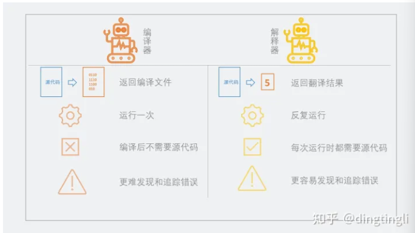


## 2.Java和C++有什么关系，它们有什么区别?

1+6

- **都是面向对象的语言**，都支持封装、继承和多态;
- · C++支持**指针，而Java没有指针**的概念﹔
- .C++支持**多继承**，而Java不支持多重继承，但允许一个类实现多个接口;**（单继承多实现）**
- . Java**自动进行无用内存回收操作**，不再需要程序员进行手动删除，而C++中必须由程序释放内存资源，这就增加了程序员的负担。
- Java不支持**操作符重载**，操作符重载则被认为是C++的突出特征;
- . Java是**完全面向对象**的语言，并且还取消了C/C++中的结构和联合，使编译程序更加简洁;
- C和C++**不支持字符串变量**，在C和C++程序中使用"NulI"终止符代表字符串的结束。在Java中字符串是用**类对象(String 和StringBuffer）**来实现的;
- goto语句是C和C++的"遗物"，Java不提供goto语句，虽然Java 指定goto作为关键字，但不支持它的使用，这使程序更简洁易读;


## 3.JVM、JRE和JDK的关系是什么?

JDK是(Java Development Kit）的缩写，它是**功能齐全的Java SDK。它拥有JRE所拥有的一切，还有编译器(javac）和工具（如javadoc和 jdb）。它能够创建和编译程序。**

JRE是 Java Runtime Environment 缩写，它是**运行已编译**Java程序所需的所有内容的集合，包括**Java虚拟机(JVM)** **,Java类库**，**java 命令和其他的一些基础构件**。但是，它不能用于创建新程序。

JDK包含JRE，JRE包含JVM。

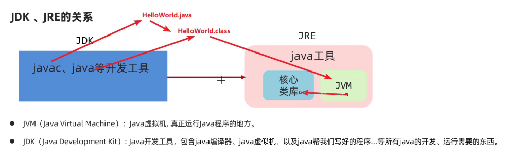

## ==4.什么是字节码?采用字节码的好处是什么?==

> 这个问题，面试官可以扩展提问，Java是编译执行的语言，还是解释执行的语言?

在 Java 中，**JVM 可以理解的代码就叫做字节码**（即扩展名为 `.class` 的文件），它不面向任何特定的处理器，只面向虚拟机。

==字节码最重要的作用就是：提高效率==，

- 一个Java文件从编译到运行包括两大步：
  - 1、java代码编译成字节码（.class文件），这个速度是很快的；
  - 2、字节码被Java解释器翻译成机器指令去执行，这个速度比较慢；
- 如果直接把java代码交给 JVM解释器 去解释执行，也是可以的，那么会导致java代码运行效率低下，而如果==提前先对Java代码进⾏编译，编译为字节码，那字节码再翻译为机器指令时，效率⽐较块，也就导致真正执行字节码时，效率更高==，这就是字节码的作⽤，所以Java其实是编译+解释⼆合⼀的语⾔。

**Java语言通过字节码的方式，在一定程度上解决了传统解释型语言执行效率低的问题，同时又保留了解释型语言可移植的特点。**

同时也是Java可以**"一次编译，到处运行"**的重要特点之一，一是因为**JVM针对各种操作系统、平台都进行了定制，**二是因为无论在什么平台，都**可以编译**生成固定格式的字节码(.class文件）供JVM使用。因此，也可以看出字节码对于Java生态的重要性。


## 4.**为什么说 Java 语言“编译与解释并存”？**

==这是因为 Java 语言既具有编译型语言的特征，也具有解释型语言的特征。因为 Java 程序要经过先编译，后解释两个步骤，由 Java 编写的程序需要先经过编译步骤，生成字节码（`.class` 文件），这种字节码必须由 Java 解释器来解释执行。==


一个.java文件从编译到运行的示例如图所示。

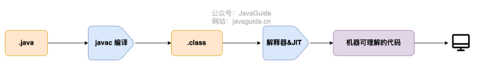格外注意的是    **我们需要格外注意的`.class->机器码` 这一步。在这一步 JVM 类加载器首先加载字节码文件，然后通过解释器逐行解释执行，这种方式的执行速度会相对比较慢。**而且，有些方法和代码块是经常需要被调用的(也就是所谓的==热点代码==)，所以后面引进了 **JIT（just-in-time compilation) 编译器**，而 JIT 属于运行时编译。当 JIT 编译器完成第一次编译后，其会将热点d艾玛对应的**机器码保存下来**，下次可以直接使用。而我们知道，**机器码的运行效率肯定是高于 Java 解释器的**。这也解释了我们为什么经常会说 **Java 是编译与解释共存的语言** 。


## 4.==为什么不全部使用 AOT 呢？==

AOT 可以提前编译节省启动时间，那为什么不全部使用这种编译方式呢？

长话短说，这和 **Java 语言的动态特性**有千丝万缕的联系了。举个例子，**CGLIB 动态代理**使用的是 ASM 技术，而这种技术大致原理是运行时直接在内存中生成并加载修改后的字节码文件也就是 `.class` 文件，==如果全部使用 AOT 提前编译，也就不能使用 ASM 技术了==。为了支持类似的动态特性，所以选择使用 JIT 即时编译器。


## 5.==Java有哪些数据类型?==

Java语言的数据类型分为两种：**基本数据类型和引用数据类型。**

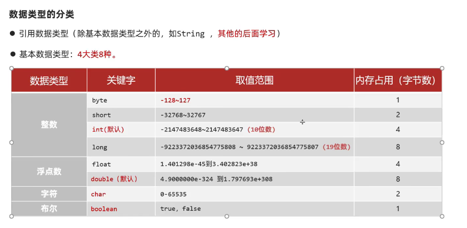

**引用数据类型建立在基本数据类型的基础上，包括==数组、类和接口==。**引用数据类型是由用户自定义，用来限制其他数据的类型。另外，Java语言中不支持C++中的指针类型、结构类型、联合类型和枚举类型。

  **计算机中数据的最小组成单位--字节。** 1字节=8位二进制。其中，每个二进制位称为一个比特bit，即**1byte = 8bit。**


AscII编码表：字符（char类型）在计算机内的存储是二进制形式；

==ASCII编码表就是每个字符的约定二进制编号==

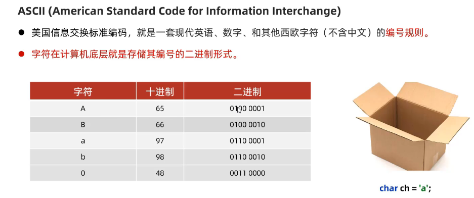

   


## 6.switch是否能作用在 byte 上，是否能作用在long上，是否能作用在 String 上?

switch（）里面的表达式只能是 **int， byte，short， char，枚举（jdk5），String（jdk7），**==不支持，long，float，double。==（byte、short、char会隐式转换成int）

case给的值不允许出现重复，而且只能是**字面量**，不能是变量。


## 7.访问修饰符！！！

Java中，可以使用访问控制符来保护对类、变量、方法和构造方法的访问。Java支持4种不同的访问权限。

- public ：**所有类可见。**
  - 使用对象：类、接口、变量、方法

- protected :**本包+子类**。
  - 使用对象：内部类、成员变量、方法。
  - 不能修饰类（外部类）。

- default︰**本包可见**。
  - 使用对象：类、接口、成员变量、方法。

- private：**本类可见。**
  - 使用对象：内部类、成员变量、方法。
  - 不能修饰类（外部类)


## 7.1为什么外部类只有public和default两种修饰符呢？

- 首先外部类即我们创建的最外层的class，如.java文件的那个最外部类。
- 外部类的上一单元是包，所以他的作用域只有两个：同包 、任何位置，因此只需要两个控制权限；
- 此外，如果用private修饰，那么JVM都加载不了他，他就没有存在意义了，可以说都无法运行；
- 如果用protect修饰，
- 举个例子，如果类A用protected修饰，与类A不同包的类B想要访问类A的话，类B就必须是继承类A的（或者说类B必须为类A的子类），但是类B继承类A的前提又是类B可以访问到类A，有点绕对吧，仔细想想会发现这里是冲突的，其实这就说明了为什么不能用protected来修饰外部类。再说，protected是用来表示在继承关系中的访问权限的，在同一个包和子类中都可以访问，因为继承就是为了拥有父类的属性和方法，所以protected是用于修饰类的方法和属性的，也就是说，我想要这个类的属性和方法可以被任何子类继承，我就用protected
  


## 8.break ,continue ,return的区别及作用?

- break跳出然后去上一层循环，不再执行循环 **(结束当前的循环体)**
- continue跳出本次循环，继续执行下次循环**(结束正在执行的循环进入下一个循环条件)·**
- return程序返回，不再执行下面的代码**(结束当前的方法直接返回)**


## 9.==final、finally、finalize的区别?==

final用于修饰变量、方法和类。

- final变量：**被修饰的变量不可变**，不可变分为引用不可变和对象不可变，**final指的是引用不可变**，final 修饰的变量**必须初始化，通常称被修饰的变量为常量。**
- final修饰变量的注意

  - final修饰的变量是基本类型：那么变量存储的**数据值**不能发生改变。

  - final修饰的变量是引用类型：那么变量存储的**地址值**不能发生改变，但是地址指向的对象内容是可以发生变化的。
- final方法：**被修饰的方法不允许任何子类重写，**子类可以使用该方法。
- final类：**被修饰的类不能被继承**，所有方法不能被重写。

finally 作为异常处理的一部分，它只能在try/catch语句中，并且附带一个语句块表示这段语句最终一定被执行（无论是否抛出异常)，经常被用在需要释放资源的情况下，System.exit (O)可以阻断finally执行。

**finalize是在 java.lang.object 里定义的方法，也就是说每一个对象都有这么个方法，这个方法在gc启动，该对象要被回收的时候被调用。**

一个对象的 finalize方法**只会被调用一次**，finalize被调用**不一定会立即回收该对象**，所以有可能调用finalize后，该对象又不需要被回收了，然后**到了真正要被回收的时候，因为前面调用过一次，所以不会再次调用finalize 了，进而产生问题，因此不推荐使用finalize方法。**


## 10.Java的内存图


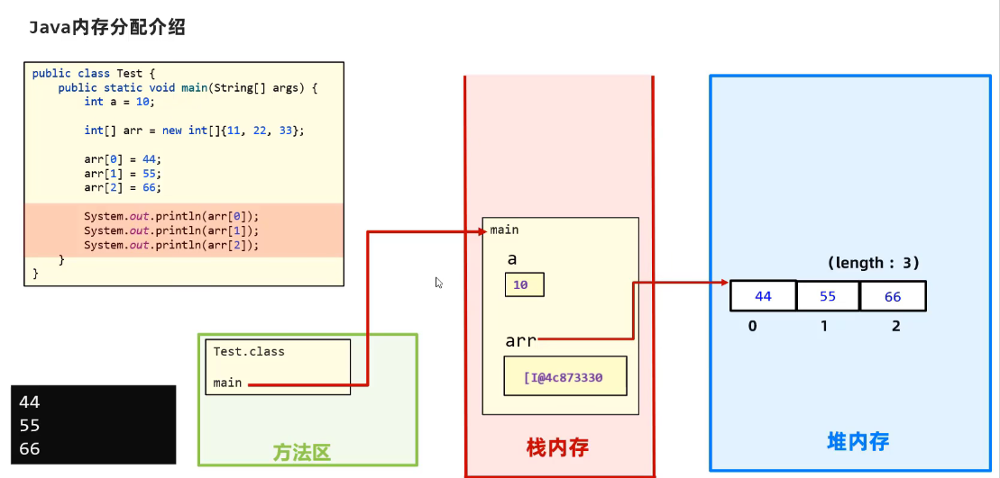

- 方法区

​				**字节码文件，类，方法**，加载时进入的内存

-   栈

​				方法运行时所进入的**变量**在这里

-  堆内存

​				**new**出来的东西**（对象）**会在这块内存中开辟空间，并产生地址


刚好讲到这里，看看**类创建两个对象**时的内存图：

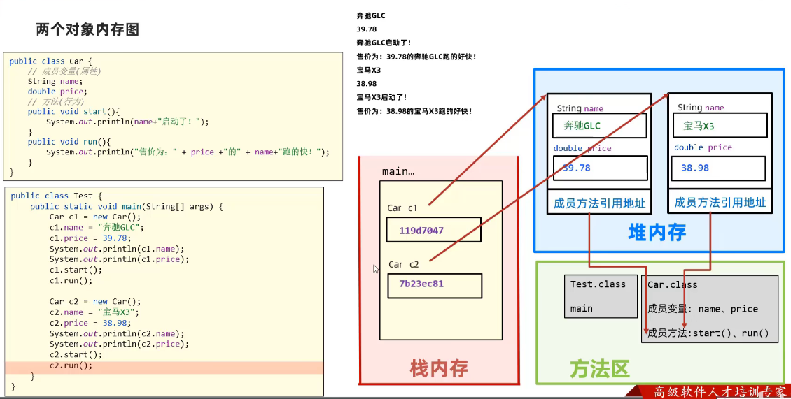

**1、方法只有一份**（同C++一个原理），由于this指针的存在，所以他知道调用的是哪个对象**（谁调用这个函数，函数的this指针就指向谁！！！）**

- 在C++中，类内的**成员变量和成员函数分开存储;**
- 只有**非静态成员变量**====>>>才属于**类的对象**上;


## ==11.为什么要用static关键字?==

**通常来说，只有在用new创建类的对象时，数据存储空间才被分配，方法才供外界调用。**但有时我们**只想为特定域分配单一存储空间，不考虑要创建多少对象或者说根本就不创建任何对象，**再就是我们**想在没有创建对象的情况下也想调用方法。**在这两种情况下，static关键字，满足了我们的需求。


static是静态的意思，可以修饰**成员变量和成员方法**。静态的东西都是最最最先加载的，在类创建的同时加载，比对象里面的任何东西都早！==注意：静态的东西只能处理静态的哦！==

**内存原理：**

1. **类编译完，**在方法区生成.class的时候，会同时在**堆内存**创建该类的静态变量区，加载我们的静态成员变量；在方法区里面加载我们的静态成员方法！！！

2. 后面创建的每个类的对象，都会自动指向该静态变量区哦！！！

   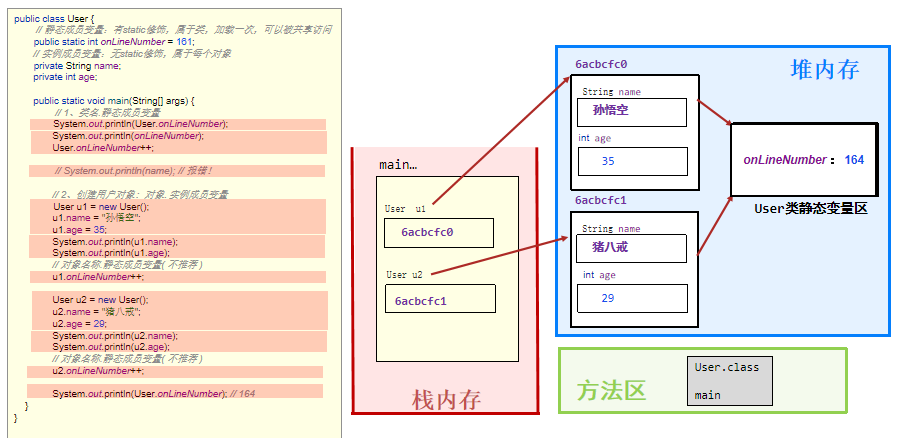
   
   

## ==12."static"关键字是什么意思? Java中是否可以覆盖(override)一个private或者是static的方法?==

static是静态的意思，可以修饰成员变量和成员方法。静态的东西都是最最最先加载的，在类创建的同时加载，比对象里面的任何东西都早！==注意：静态的东西只能处理静态的哦！==

"static"关键字**表明一个成员变量或者是成员方法可以在没有该类的实例对象的情况下被访问。**

1、Java中static方法**不能被重写**，因为**方法重写是基于运行时动态绑定的**，而**static方法是编译时静态绑定的，随着类加载的同时进行加载。**。static方法跟类的任何实例对象都不相关，所以概念上不适用。

2、**有争议的点：**子类是否继承了父类的静态成员？

​	答案是：没有！是共享关系！前面说了静态成员是属于这个类自己的，是独特的东西，但是子类可以直接使用父类的静态成员，对象也可以直接用类的静态成员，但不要这么搞哦。

3、**当子类和父类出现一模一样的静态属性时，会把父类的覆盖。**我们会发现父类的静态成员属性age和静态成员print()方法并没有被子类覆盖掉，子类调用的是自己本类的静态成员属性age和静态成员print()方法！


**[private]**只能够被自身类访问，子类不能访问private修饰的成员，所有不能override一个private方法。


## 13.是否可以在static环境中访问非static变量?

**static变量在Java中是属于类的，它在所有的实例中的值是一样的。**

***当类被Java虚拟机载入的时候，就会初始化static环境。非static变量是在类的实例对象被创建后才有的**，如果你的代码尝试在static环境来访问非static的变量，编译器会报错，**因为这些变量还没有被创建出来，还没有跟任何实例关联上。**


## 14.static静态方法能不能引用非静态资源?

不能，new的时候才会产生的东西，对于初始化后就存在的静态资源来说，根本不认识它。


## 15.static静态方法里面能不能引用静态资源?

可以，因为都是类初始化的时候加载的，大家相互都认识。


## 16.非静态方法里面能不能引用静态资源?

可以，非静态方法就是实例方法，那是new之后才产生的，那么属于类的内容它都认识。


## 17.java静态变量、代码块、和构造方法的执行顺序是什么?


基本上**代码块分为三种: Static静态代码块、构造代码块、普通代码块**

- 一个类中的顺序：

​	**静态属性（变量、方法）——》静态代码块——》构造代码块——》构造函数——》**

- 继承中的顺序

​	**父类静态变量——》父类静态代码块―—>子类静态变量一一>子类静态代码块——》父类构造代码块―一>父类构造器―一>子类构造代码块——>子类构造器**


## ==18.static有哪些应用场景？（3）==

==工具类==

工具类中定义的都是一些静态方法，每个方法都是以完成一个共用的功能为目的。

- 工具类的好处：

  一是调用方便，二是提高了代码复用（一次编写，处处可用）

- 工具类的定义注意

  建议将工具类的**构造器进行私有**，工具类无需创建对象。里面都是静态方法，直接用类名访问即可。


==静态代码块==

- 代码块是类的5大成分之一（成员变量、构造器，成员方法，**代码块**，内部类），定义在**类中方法外**。   

- 在Java类下，使用 **{ }** 括起来的代码被称为代码块 。

- 代码块分为 

  **静态代码块:** 
  格式：static{  }
  特点：static关键字修饰，随着类的加载而加载，并且自动触发、**有且仅执行一次**（意			思是这个代码里面的内容，只会自动执行一次，后面不能被调用了，与静态成			员变量，方法不同，他们被加载后，可以被无数次调用）
  使用场景：**类初始化的时候静态变量初始化的操作**，以便后续使用。

  

   **构造代码块**（了解，用的少）：
  格式：{  }
  特点：每次创建对象，调用构造器执行时，都会执行该代码块中的代码，并且在构造器执行前执行
  使用场景：初始化实例资源。

==单例设计模式==

- **什么是设计模式（Design pattern）**
  	开发中经常遇到一些问题，一个问题通常有n种解法的，但其中肯定有一种解法是最优的，这个最优的解法被人总结出来了，称之为设计模式。
      设计模式有20多种，对应20多种软件开发中会遇到的问题，学设计模式主要是学2点：第一：这种模式用来解决什么问题。第二：遇到这种问题了，该模式是怎么写的，他是如何解决这个问题的。

- **单例模式**

  ​		==可以保证系统中，应用该模式的这个类永远只有一个实例，即**一个类永远只能创建一个对象。**==
  ​		例如任务管理器对象我们只需要一个就可以解决问题了，可以节省内存空间。

- **单例的实现方式：**

​                饿汉单例模式。懒汉单例模式。

- **饿汉单例模式**

  即像要饿死了一样，我希望午饭已经提取给我准备好了，我可以直接吃！，即在用类获取对象的时候，对象已经提前为你创建好了。有一点注意哦，对象名也是一个变量哦

​		设计步骤：
​						定义一个类，把构造器私有。
​						**定义一个该类静态变量存储该类new的对象。**(静态对象)

```java
// 饿汉类
public class SingleInstance1 {
    /**
       定义一个静态变量存储一个对象即可 :属于类，与类一起加载一次
     */
    public static SingleInstance1 instance = new SingleInstance1();
  
    private SingleInstance1(){
    }
}

// 测试类
public class Test {
    public static void main(String[] args) {
        SingleInstance1 s1 = SingleInstance1.instance;
        SingleInstance1 s2 = SingleInstance1.instance;
        SingleInstance1 s3 = SingleInstance1.instance;
        System.out.println(s1);
        System.out.println(s2);
        System.out.println(s3);
        System.out.println(s1 == s2); 	//true
    }
}
```

- ​	**懒汉模式**

  即我都要饿死了，但我太懒了，菜都洗好了，但不提前区做饭，硬要等到12点了再去做饭；在真正需要该对象的时候，才去创建一个对象(延迟加载对象)。

  设计步骤：
  		定义一个类，把构造器私有。
  		**定义一个静态变量，先不存储该类的对象，也就是此时不new**。
  		**提供一个返回单例对象的方法**

```java
// 懒汉类
public class SingleInstance2 {
    /**
       2、定义一个静态的成员变量用于存储一个对象，一开始不要初始化对象，因为人家是懒汉
     */
    private static SingleInstance2 instance;

    private SingleInstance2(){
    }

    /**
      3、提供一个方法暴露，真正调用这个方法的时候才创建一个单例对象
     */
    public static SingleInstance2 getInstance(){
        if(instance == null){
            // 第一次来拿对象，为他做一个对象
            instance = new SingleInstance2();
        }
        return instance;
    }
}
// Test class
public class Test2 {
    public static void main(String[] args) {
        // 得到一个对象
        SingleInstance2 s1 = SingleInstance2.getInstance();
        SingleInstance2 s2 = SingleInstance2.getInstance();
        System.out.println(s1 == s2);
    }
}
```


## 19.面向对象和面向过程的区别?


**两者的主要区别**在于解决问题的方式不同：

- 面向过程把解决问题的**过程拆成一个个方法**，通过一个个方法的执行解决问题。
- 面向对象会**先把客观问题抽象出对象**，然后用**对象执行方法行为**的方式解决问题。

另外，面向对象开发的程序一般更易维护、易复用、易扩展。


面向过程:

- 优点：**性能比面向对象高，因为类调用时需要实例化，开销比较大，比较消耗资源**；比如单片机、嵌入式开发、**Linux/Unix等一般采用面向过程开发，性能是最重要的因素。**
- 缺点：没有面向对象**易维护、易复用、易扩展。**

面向对象:

- ·优点:**易维护、易复用、易扩展，由于面向对象有封装、继承、多态性的特性，可以设计出低耦合的系统，使系统更加灵活、更加易于维护。**
- 缺点:  性能比面向过程低。


## 20.==讲讲面向对象三大特性==

- 封装。

  封装最好理解了。**封装，也就是把客观事物封装成抽象的类，然后进行”合理隐藏，合理暴露“。有效提高代码的安全性**并且类可以把自己的数据和方法只让可信的类或者对象操作，对不可信的进行信息隐藏。

- 继承。（extends）

  继承是指这样一种能力:**它可以使用现有类的所有功能，并在无需重新编写原来的类的情况下对这些功能进行扩展。**通过继承创建的新类称为"子类"或"派生类"，被继承的类称为"基类"、“父类"或"超类"。

- 多态性。

  **同一个类的对象，执行同一个行为，会表现出不同的行为特征。大大降低代码耦合性**

  > 只针对**有继承/实现**关系，并且**一定有方法重写**。在多态形式下，右边对象可以**实现解耦合，便于扩展和维护。**
  >
  > 成员方法：取子类/实现类里面的重写的成员方法；**成员变量：只看父类/接口**
  >
  > 问题：多态下不能使用**子类的独有功能**。


## 20.1 继承

- 关键字：**extends**（**两个类之间的关系**）子类，父类。**所以类都是Object的子类。**

- 注意：子类可以继承父类的成员属性和行为，==但是子类不能继承父类的构造器和静态成员。==

​	**子类可以继承父类的私有成员**，只是说不能访问，就像你爸给你了保险箱，但是没有给密码哦，但也算是你继承下来了呀。父类有两个儿子，一个是对象（多生子，爸爸不喜欢，不想去拿他的东西），一个是子类（比爸爸流批多了的儿子，把爸爸什么东西都学会了，还自学了很多）

- **有争议的点：**子类是否继承了父类的静态成员？

  ​	答案是：没有！是共享关系！

  ​	前面说了静态成员是属于这个类自己的，是独特的东西，但是子类可以直接使用父类的静态成员，对象也可以直接用类的静态成员，但不要这么搞哦。

  

### 内存原理

子类在创建的时候，会在堆内存里面创建一片区域，然后这片里面会再划分一个父类空间(super)和一个子类空间(this)！

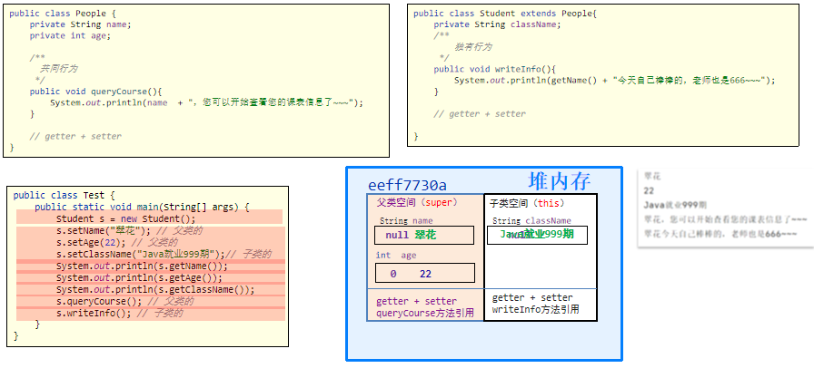

###  继承后，成员访问的特点

- 就近原则，先找子类里面的，再找父类里面的。

- super.成员——调用父类的成员；

  this.成员——调用子类的成员；

### 方法重写

子类出现了和父类中一模一样的方法声明，我们就称子类这个方法是重写的方法。（方法名+形参要一模一样）；但要是**已经继承过来**的方法哦！当你有了之后，你再去重新搞一个一模一样的才叫重写。

**@Override重写注解**


### 继承后，子类构造器的特点

- 子类中所有的构造器默认都会先访问父类中**无参构造器**，再执行自己。

- 为什么？
      子类在初始化的时候，有可能会使用到父类中的数据，如果父类没有完成初始化，子类将无法使用父类的数据。
      **子类初始化之前，一定要调用父类构造器先完成父类数据空间的初始化。**

子类构造器的第一行语句默认都是：**super( )**，不写也存在。

当子类想要调用父类的**有参构造器**时，直接用super.(.....)就行，作用是可以初始化继承过来的父类数据。


### this 和super

this引用的是本类对象，super引用的是父类对象。代码中最好用this，super来明确标识。专业优雅！


## ==21.Java语言是如何实现多态的?==

本质上多态分两种:

> 1、编译时多态（又称静态多态)
>
> 2、运行时多态（(又称动态多态)


**重载(overload)就是编译时多态的一个例子，**编译时多态在编译时就已经确定，运行的时候调用的是确定的方法。

我们**通常所说的多态指的都是运行时多态**，也就是编译时不确定究竟调用哪个具体方法，一直延迟到运行时才能确定。

Java实现多态有3个必要条件:**继承/实现、方法重写和向上转型**。只有满足这3个条件，开发人员才能够在同一个继承结构中使用统一的逻辑实现代码处理不同的对象，从而执行不同的行为。

- 继承：在多态中必须存在有继承关系的子类和父类。
- 重写：子类对父类中某些方法进行重新定义，在调用这些方法时就会调用子类的方法。
- 向上转型：在多态中需要**将子类的引用赋给父类对象**，只有这样该引用才既能可以调用父类的方法，又能调用子类的方法。


##==21.重载(Overload）和重写(Override）的区别是什么?==

方法的重载和重写都是实现多态的方式，区别在于前者实现的是**编译时的多态性**，而后者实现的是**运行时的多态性**。

- 重写：
  - 方法名相同
  - 形参列表相同
  - 返回值类型相同
  - 权限修饰符 >= 父类访问范围

- 重载(overloading）：
  - 方法名相同
  - 形参列表不同；
  - 剩下两个随便；


## ==22.构造器(constructor)是否可被重写(override) ?==

**构造器不能被继承，因此不能被重写，但可以被重载。**每一个类必须有自己的构造函数，负责构造自己这部分的构造。**子类不会覆盖父类的构造函数，相反必须一开始调用父类的构造函数。**


## 23.==抽象类和接口的区别是什么?（实习-美团-阿里）==

抽象类：被abstract修饰的类；

接口：接口就是抽象类进一步扩展出来的一个更加规范的形式而已。


Java中抽象类和接口中有构造方法吗?

①在接口中 不可以有构造方法

```java
在接口里写入构造方法时，编译器提示：Interfaces cannot have constructors。
A. 构造方法用于初始化成员变量，但是接口成员变量是常量,无需修改。接口是一种规范，被调用时，主要关注的是里边的方法，而方法是不需要初始化的，
B. 类可以实现多个接口，若多个接口都有自己的构造器，则不好决定构造器链的调用次序
C. 构造器是属于类自己的，不能继承。因为是纯虚的，接口不需要构造器。
```

②在抽象类中 可以有构造方法。

```java
    在抽象类中可以有构造方法，只是不能直接创建抽象类的实例对象，但实例化子类的时候，就会初始化父类，不管父类是不是抽象类都会调用父类的构造方法，初始化一个类，先初始化父类。 
```


语法层面上的区别:

- **抽象类可以有抽象方法和普通成员方法**，抽象类中不一定有抽象方法，有抽象方法的类一定是抽象类，**而接口中只能存在public abstract方法;**  

- **抽象类中的成员变量可以是各种类型的，而接口中的成员变量只能是public static final类型的;**

- **抽象类可以有静态代码块和静态方法，接口中不能含有静态代码块以及静态方法**

- **一个类只能继承一个抽象类，而一个类却可以实现多个接口。**

  

设计层面上的区别:

- 抽象类是**对一种事物的抽象，即对类抽象，而接口是对行为的抽象。**抽象类是对类整体进行抽象，包括属性、行为，但是接口却是对类局部（行为）进行抽象。
- 设计层面不同，抽象类作为很多子类的父类，它是一种**模板式设计，类似于ppt模板，已有一套可以使用的东西，自己再去填充**。
- 而**接口是一种辐射式设计**，它是对行为的抽象 它只定义一组行为规范 每个实现类都要实现所有规范，并且当接口中的规范发生变化时，每个实现类也要跟着变化；


**应用层面上的区别：**

- 两者各有千秋；

- 采用抽象类时，只能是单继承，但父类可以提供很多已有的方法给子类使用，并且对子类的行为加上一定行为规范；

  假如业务中会有很多重复的代码、方法，那么可以采用抽象类去继承，这样子类就直接拿来使用即可，不像接口那样必须重写；其次这些共有的方法需要修改时，也很方便，只需要修改抽象类这个父类即可；缺点就是只能单继承！

  某个问题需要子类除了需要重写父类的abstract的方法，还需要从父类继承变量或者使用非abstract方法，就考虑abstract类

- 接口的话，优点就是多继承，但是每个实现类都必须要重写接口内所有的方法，没有可以直接使用的方法，这是缺点之一，其次就是如果接口发生变化如增加一个方法，那么他下面的所有实现类都需要变动源代码去实现，造成不便利！如果某个问题不需要继承，只需要很多子类给出的abstract方法的具体实现细节，就用接口


## 24.抽象类有什么应用？接口的继承、实现关系？

**应用：模板方法**

在抽象类里面，我们不仅定义了**抽象方法**，我们还**定义模板方法**！即我们将一个通用的功能写在里面，并且用**final 修饰**，子类都要用的。然后我们将模板方法中不能决定的功能定义成抽象方法，让具体子类去实现。

final修饰的原因：模板方法是给子类直接使用的，不是让子类重写的，一旦子类重写了模板方法就失效了。

```java
public abstract class Animal{
  public abstract void run();
  // 模板方法
  public final void login(){
    ........
  }
}
```


- 类和类的关系：单继承。
- 类和接口的关系：**多实现**。
- 接口和接口的关系：**多继承**，一个接口可以同时继承多个接口。
- **一个类继承了父类，同时又实现了接口，父类中和接口中有同名方法，默认用父类的****


## 25.==抽象类能使用final修饰吗?==

不能，**定义抽象类就是让其他类继承的**，如果定义为 final该类就不能被继承，这样彼此就会产生矛盾，所以final不能修饰抽象类


## 26.==java创建对象有哪几种方式?（实习-美团）==

**java中提供了以下四种创建对象的方式:**

- **new创建新对象**
- **通过反射机制**
- **采用clone机制**
- **通过序列化机制**

**前两者都需要显式地调用构造方法。**对于clone机制,需要注意浅拷贝和深拷贝的区别，对于序列化机制需要明确其实现原理，在java中序列化可以通过实现Externalizable或者Serializable来实现。


==美团特别提到了，深拷贝和浅拷贝==

[Java 之浅拷贝、深拷贝，你到底知多少？ - 知乎 (zhihu.com)](https://zhuanlan.zhihu.com/p/95686213)


### 深拷贝和浅拷贝区别了解吗？什么是引用拷贝？

关于深拷贝和浅拷贝区别，我这里先给结论：

- **浅拷贝**：浅拷贝会在堆上创建一个新的对象（区别于引用拷贝的一点）但是对象的内部成员属性，采用的是直接复制引用地址的方式，
- **深拷贝** ：深拷贝会完全复制整个对象，包括这个对象所包含的内部对象。

上面的结论没有完全理解的话也没关系，我们来看一个具体的案例！

**浅拷贝**

浅拷贝的示例代码如下，我们这里实现了 `Cloneable` 接口，并重写了 `clone()` 方法。

`clone()` 方法的实现很简单，直接调用的是父类 `Object` 的 `clone()` 方法。

```java
public class Address implements Cloneable{
    private String name;
    // 省略构造函数、Getter&Setter方法
    @Override
    public Address clone() {
        try {
            return (Address) super.clone();
        } catch (CloneNotSupportedException e) {
            throw new AssertionError();
        }
    }
}

public class Person implements Cloneable {
    private Address address;
    // 省略构造函数、Getter&Setter方法
    @Override
    public Person clone() {
        try {
            Person person = (Person) super.clone();
            return person;
        } catch (CloneNotSupportedException e) {
            throw new AssertionError();
        }
    }
}
```

测试 ：

```java
Person person1 = new Person(new Address("武汉"));
Person person1Copy = person1.clone();
// true
System.out.println(person1.getAddress() == person1Copy.getAddress());
```

从输出结构就可以看出， `person1` 的克隆对象和 `person1` 使用的仍然是同一个 `Address` 对象。

**深拷贝**

这里我们简单对 `Person` 类的 `clone()` 方法进行修改，连带着要把 `Person` 对象内部的 `Address` 对象一起复制。

```java
@Override
public Person clone() {
    try {
        Person person = (Person) super.clone();
        person.setAddress( person.getAddress().clone() );
        return person;
    } catch (CloneNotSupportedException e) {
        throw new AssertionError();
    }
}
```

测试 ：

```java
Person person1 = new Person(new Address("武汉"));
Person person1Copy = person1.clone();
// false
System.out.println(person1.getAddress() == person1Copy.getAddress());
```

从输出结构就可以看出，虽然 `person1` 的克隆对象和 `person1` 包含的 `Address` 对象已经是不同的了。

**那什么是引用拷贝呢？** 简单来说，引用拷贝就是两个不同的引用指向同一个对象。

我专门画了一张图来描述浅拷贝、深拷贝、引用拷贝：


## 27.==什么是不可变对象?好处是什么?==

不可变对象指对象一旦被创建,状态就不能再改变,任何修改都会创建一个新的对象,**如String、Integer及其它包装类**.

不可变对象最大的好处是**线程安全.**

>在线程之间可以相互共享，不需要利用特殊机制来保证同步问题，因为对象的值无法改变,可以降低并发错误的可能性，因为不需要用一些锁机制等保证内存一致性问题也减少了同步开销。


## 28.==能否创建一个包含可变对象的不可变对象?==

**当然可以,**  比如  `final Person[] persons = new persion[]{ }.`   persons 是不可变对象的引用,但其数组中的Person实例却是可变的. **这种情况下需要特别谨慎,不要共享可变对象的引用.这种情况下,如果数据需要变化时,就返回原对象的一个拷贝.**


## ==28.Java包装类特点？==

**1、缓存对象:**

面试者需要知道**Byte、Short、Integer、Long、Character这五个**包装类会缓存一定范围内的对象。例如，Integer缓存范围为-128到127。因此，当两个Integer对象的值在此范围内时，它们可能引用相同的对象。这可能导致在使用==比较包装类对象时出现意外的结果。为了避免这个问题，应使用equals()方法来比较包装类对象的值。

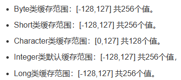

**2、使用包装类的实用方法:**

面试者应熟悉各种包装类提供的实用方法，如类型转换、进制转换、字符串转换等。例如，Integer类提供了parseInt()方法，可以将字符串转换为整数。

**3、不可变性:**

面试者需要了解所有包装类都是不可变的。这意味着一旦创建了包装类对象，其值就不能更改。任何对值的修改都将创建一个新的包装类对象。不可变性有助于提高代码的安全性和可维护性


## 29.值传递和引用传递的区别的什么?为什么说Java中只有值传递?

值传递：指的是在方法调用时，传递的参数是按值的拷贝传递，传递的是**值的拷贝**，也就是说**传递后就互不相关了。**

引用传递：指的是在方法调用时，**传递的参数是按引用进行传递，其实传递的是引用的地址，也就是变量所对应的内存空间的地址。**传递的是值的引用，**也就是说传递前和传递后都指向同一个引用(也就是同一个内存空间)。**


**基本类型作为参数被传递时肯定是值传递：引用类型作为参数被传递时也是值传递，只不过"值"为对应的引用。**（因为引用类型的变量名字存储的是其内存空间的地址）


30.==和 equals区别是什么?
--

== 常用于相同的基本数据类型之间的比较，也可用于相同类型的对象之间的比较;

- 如果 == 比较的是**基本数据类型**，那么比较的是两个基本数据类型的**值是否相等;**
- 如果 == 是比较的**两个对象**，那么比较的**是两个对象的引用**，也就是判断两个对象是否指向了同一块内存区域;

equals方法主要用于**两个对象**之间，**检测一个对象是否等于另一个对象**


看一看Object类中equals方法的源码:

```
public boolean equals(object obj) {
		return (this == obj);
}
```

它的作用也是判断两个对象是否相等，一般有两种使用情况:

- ·情况1，**类没有覆盖equals()方法**。则通过equals()比较该类的两个对象时，**等价于通过"==比较这两个对象。**
- ·情况2，**类覆盖了equals()方法**。一般，我们都覆盖equals()方法**来两个对象的内容相等**:若它们的内容相等，则返回true(即，认为这两个对象相等)。

- 所以类要  **重写equals方法** （Object是所有类的父类）


## 31.介绍下hashCode()?


**hashCode( )的作用是获取哈希码，也称为散列码**

hashCode，是根据**对象的某些特征**推导出的一个整数值，默认情况下根据对象的内存**存储地址**。这个哈希码的作用是==确定该对象在哈希表中的索引位置。==  通过散列码，可以提高检索的效率，主要用于在散列存储结构中快速确定对象的存储地址，如Hashtable、hashMap中。

> hashCode()定义在JDK的Object.java中，这就意味着Java中的任何类都包含有hashCode()函数。

散列表存储的是键值对(key-value)，它的特点是:能根据"键"快速的检索出对应的“值"。这其中就利用到了散列码!(可以快速找到所需要的对象)


## 32.为什么要有hashCode?

==提高检索效率==

以"HashSet如何检查重复"为例子来说明为什么要有hashCode:

当你把对象加入HashSet时，**HashSet 会先计算对象的 hashcode值来判断对象加入的位置，同时也会与其他已经加入的对象的hashcode值作比较，如果没有相符的hashcode，HashSet会假设对象没有重复出现。**

**但是如果发现有相同hashcode值的对象，**这时会调用equals()方法来检查 hashcode相等的对象是否真的相同。如果两者相同，HashSet就不会让其**加入操作**成功。**如果不同的话，就会重新散列到其他位置。**这样我们就大大减少了equals 的次数，相应就大大提高了执行速度。


## ==33.hashCode(),equals()两种方法是什么关系?==


Java对于eqauls(方法和 hashcode(）方法是这样==**规定的:**==

- 同一对象上**多次调用**hashCode()方法，总是**返回相同的整型值。**
- **如果 a.equals(b)，则一定有a.hashCode()一定等于b.hashCode()。**
- 如果！a.equals(b)，则 a.hashCode()不一定等于b.hashCode()。此时如果 a.hashCode()总是不等于b.hashCode()，会提高hashtables 的性能。
- a.hashCode()==b.hashCode() 则a.equals(b)可真可假a.hashCode()! = b.hashCode() 则 a.equals(b)为假。

上面结论简记:

- **如果两个对象（相同）equals，Java运行时环境会认为他们的 hashCode一定相等。**
- 如果两个对象不equals，他们的 hashCode有可能相等。
- 如果两个对象hashCode 相等，他们不一定equals。
- 如果两个对象 **hashCode 不相等**，两个对象一定**不（相同）equals**


补充:关于equals()和 hashCode()的重要规范

- 规范1：**若重写equals()方法，有必要重写hashcode()方法，确保通过equals()方法判断结果为true 的两个对象具备相等的 hashcode()方法返回值。**说得简单点就是：“如果两个对象相同，那么他们的 hashCode应该相等"。不过请注意:这个只是规范，如果非要写一个类让 equals()方法返回true而 hashCode()方法返回两个不相等的值，编译和运行都是不会报错的。不过这样违反了Java规范，程序也就埋下了BUG。

- 规范2：**如果 equals()方法返回false，即两个对象"不相同"，并不要求对这两个对象调用hashCode()方法得到两个不相同的数。**说的简单点就是:“如果两个对象不相同，他们的hashCode可能相同"。

  

## 34.为什么要重写equals方法

重写并不是说 **object类** 里面的equals方法有缺陷，而是为了不同场景的需要。

在对比两个对象是否相同时，我们关注的是**对象的内容信息，而不是对象的存储地址**！！！例如在Set集合中我们不能存储相同的对象（这里指的就是内容），假如不重写的话，就会重写很多相同内容的对象！！！


##34.为什么重写equals方法必须重写hashcode方法?

**1、满足Java的规定：如果两个对象（相同）equals，那么他们的 hashCode一定相等。**

不重写的话，就会出现两个对象equals，但hashCode不同，因为hashCode默认情况是根据对象存储地址计算的。


**2、为了提高检索效率**

==在Set集合中是不允许出现相同的对象的，在进行两个对象的判断时会**先使用hashcode做一次判断，再去equals**，如果不同，那么就没必要在进行equals的比较了，直接插入即可，这样就大大减少了equals比较的次数，这对比需要比较的数量很大的效率提高是很明显的，==

> 我们都知道java中的List集合是有序的，因此是可以重复的，而set集合是无序的，因此是不能重复的，那么怎么能保证不能被放入重复的元素呢，但靠equals方法一样比较的话，如果原来集合中以后又10000个元素了，那么放入10001个元素，难道要将前面的所有元素都进行比较，看看是否有重复，这个效率可想而知，因此hashcode就应遇而生了，java就采用了hash表，利用哈希算法（也叫散列算法），就是将对象数据根据该对象的特征使用特定的算法将其定义到一个地址上，那么在后面定义进来的数据只要看对应的hashcode地址上是否有值，那么就用equals比较，如果没有则直接插入，只要就大大减少了equals的使用次数，执行效率就大大提高了。


**3、为了保证同一个对象**

==java中另外一个规定：两个对象hashCode不同，则他们一定不相同（equals）==

在Java中的**一些容器（SET）中**，不允许有两个完全相同的对象，插入对象时，如果判断两个对象相同则会进行覆盖。如果没有重写hashCode，那么两个相同对象的hashCode是不同的，此时就会出现集合中出现**两个完全相同的对象**！！！造成相同的对象散列到不同的位置不能覆盖的问题。


## 35. String,StringBuffer, StringBuilder的区别是什么?


**1、可变与不可变。**

String类中使用**字符数组保存字符串，因为有"final"修饰符、并且没有暴露set方法，**所以string对象是不可变的。对于已经存在的String对象的修改都是重新创建一个新的对象,然后把新的值保存进去.

`private final char value[] ;`

StringBuilder与StringBuffer都继承自AbstractStringBuilder类，在AbstractStringBuilder中也是使用**字符数组保存字符串**，这两种对象都是可变的。

`char[] value;`


**2.是否线程安全。**

String中的**对象是不可变**的，也就可以理解为常量，显然线程安全。

StringBuilder是**非线程安全的**。

StringBuffer对方法**加了同步锁**或者对调用的方法加了同步锁，所以是**线程安全**的。

```java
@override
public synchronized stringBuffer append(string str) {
		tostringcache = nu11;
		super.append(str);
  	return this;
}
```


**3、性能**

每次对 `String` 类型进行改变的时候，都会生成一个新的 `String` 对象，然后将指针指向新的 `String` 对象。`StringBuffer` 每次都会对 `StringBuffer` 对象本身进行操作，而不是生成新的对象并改变对象引用。相同情况下使用 `StringBuilder` 相比使用 `StringBuffer` 仅能获得 10%~15% 左右的性能提升，但却要冒多线程不安全的风险。


**对于三者使用的总结：**

1. 操作少量的数据: 适用 `String`
2. 单线程操作字符串缓冲区下操作大量数据: 适用 `StringBuilder`
3. 多线程操作字符串缓冲区下操作大量数据: 适用 `StringBuffer`


## ==36.String为什么要设计成不可变的?==


==**1. 便于实现字符串常量池（String pool )**==

在Java中，由于会大量的使用String常量，如果**每一次声明一个String都创建一个String对象，那将会造成极大的空间资源的浪费。** Java提出了**String pool**的概念，在堆中开辟一块存储空间，当使用  ==**双引号" "**==  初始化一个String变量时，**如果该字符串已经存在了，就不会去创建一个新的字符串变量，而是会返回已经存在了的字符串的引用。**

`string a = "He11o world ! " ;`

`string b = "He1lo wor1d ! " ;`

==**2.加快字符串处理速度**==

**由于String是不可变的，保证了hashcode的唯一性，于是在创建对象时其hashcode就可以放心的缓存了，不需要重新计算。**这也就是==**Map喜欢将String作为Key**==的原因，处理速度要快过其它的键对象。所以HashMap中的键往往都使用String。


==**3.使多线程安全**==

在并发场景下，多个线程同时读一个资源，是安全的，不会引发竞争，但对资源进行写操作时是不安全的，**不可变对象不能被写，所以保证了多线程的安全。**


**4.避免安全问题**

**在网络连接和数据库连接中字符串常常作为参数，**例如，网络连接地址URL，文件路径path，反射机制所需要的String参数。**其不可变性可以保证连接的安全性。**如果字符串是可变的，黑客就有可能改变字符串指向对象的值，那么会引起很严重的安全问题。

总体来说，String不可变的原因要包括**节约资源，效率优化，以及安全性**这三大方面。


## ==36.创建字符串对象有哪几种方式，有什么区别？==

**创建字符串对象的两种方式：**

- 第一种：直接使用 “  ” 定义。

```java
String name = "heima";
```

- 第二种：使用String类里面的构造器创建

  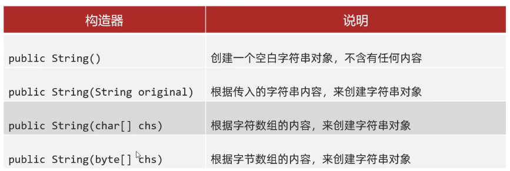


**这两种定义方式的区别**

- 以 “  ” 方式给出的字符串对象，存储在**堆内存**中的**字符串常量池**；，并且相同的字符串内容只会存储一份。
  - 看见了 “  ” 的就**一定会**在常量池里面创建一个对象，**不管位置在哪里**，除了下面这种java的**编译优化机制**：在程序编译时，"a" + "b" + "cd" 会直接转化成  "abcd"  !（仅限于这种一模一样的）
- 通过构造器new出来的对象，每new一次会产生一个新的对象，就算是字符串内容相同也会产生新的对象，存储在**堆内存里面**

## 37.字符型常量和字符串常量的区别?

1.形式上:字符常量是**单引号**引起的一个字符，字符串常量是**双引号**引起的若干个字符;

2.含义上:**字符常量相当于一个整型值(ASCII值),**可以参加表达式运算（能算就算，不能算就在一起）；**字符串常量代表一个地址值**(该字符串在内存中存放位置，相当于对象）;

3.占内存大小:字符常量只占**2个字节**字符串常量**古若干个字节**(至少一个字符结束标志)(注意: char在Java中占两个字节)。


## ==38.什么是字符串常量池?==

> java中常量池的概念主要有三个:全局字符串常量池，class文件常量池，运行时常量池。我们现在所说的就是全局字符串常量池。

 jvm为了**提升性能和减少内存开销，避免字符的重复创建，其维护了一块特殊的内存空间**，即字符串池，当需要使用字符串时，先去字符串池中查看该字符串是否已经存在，如果存在，则可以直接使用，如果不存在，初始化，并将该字符串放入字符串常量池中。

> 字符串常量池的位置也是随着jdk版本的不同而位置不同。在jdk6中，常量池的位置在永久代(方法区)中，此时常量池中存储的是对象。在jdk7中，**常量池的位置在堆中，此时，常量池存储的就是引用了。**在jdk8中，永久代(方法区）被元空间取代了。


## ==38-1.java中常量池的有哪些常量池？==

**1、在JDK1.7之前运行时常量池逻辑包含字符串常量池存放在方法区, 此时hotspot虚拟机对方法区的实现为永久代。**

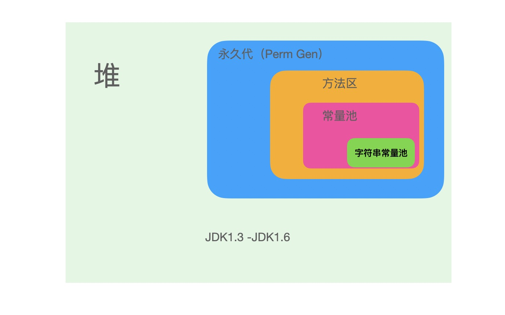

**2、在JDK1.7字符串常量池和静态变量被从方法区拿到了堆中，运行时常量池剩下的还在方法区, 也就是hotspot中的永久代。** 

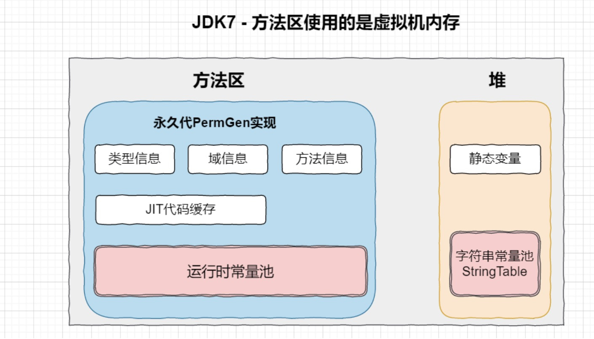

**3、在JDK8 hotspot移除了永久代用元空间(Metaspace)取而代之, 这时候字符串常量池还在堆，运行时常量池还在方法区，只不过方法区的实现从永久代变成了元空间(Metaspace)** 


## 39.String str="aaa"与String str=new String("aaa")一样吗?new String( “aaa"');创建了几个字符串对象?

如果**JVM是纯空的情况**下：分别是一个对象、两个对象

- 使用string a = "aaa”；程序运行时会在常量池中查找"aaa"字符串，若没有，会将"aaa"字符串放进常量池，再将其地址赋给a；若有，将找到的"aaa"字符串的地址赋给a。
- 使用String b = new String("aaa");'，程序会在堆内存中开辟一片新空间存放新对象，同时会将"aaa"字符串放入常量池，相当于**创建了两个对象**，无论常量池中有没有"aaa"字符串，程序都会在堆内存中开辟一片新空间存放新对象。


## 40.intern方法有什么作用?

`String.intern()`  是一个native (本地)方法，其作用是将指定的字符串对象的引用保存在字符串常量池中，可以简单分为两种情况:

- ·如果字符串常量池中保存了对应的字符串对象的引用，就直接返回该引用。
- ·如果字符串常量池中没有保存了对应的字符串对象的引用，那就在常量池中创建一个指向该字符串对象的引用并返回。


## 40.String是最基本的数据类型吗?

不是。Java中的基本数据类型只有（4大类）8个:byte、short、int、long、float、double、char、boolean;除了基本类型(primitive type)，剩下的都是引用类型（referencetype), Java 5以后引入的枚举类型也算是一种比较特殊的引用类型。


## 41.String有哪些特性?

- **不变性：**String 是只读字符串，是一个典型的 immutable对象，对它进行任何操作，其实都是创建一个新的对象，再把引用指向该对象。不变模式的主要作用在于当一个对象需要被多线程共享并频繁访问时，可以保证数据的一致性;
- **常量池优化：**String对象创建之后，会在字符串常量池中进行缓存，如果下次创建同样的对象时，会直接返回缓存的引用;
- **final：**使用final来定义String类，表示String类不能被继承，提高了系统的安全性。


## ==42.在使用HashMap的时候,用String做key有什么好处?==

**提高检索效率。**HashMap 内部实现是通过**key的 hashcode来确定value 的存储位置**，因为字符串是不可变的，所以当**创建字符串时，它的hashcode被缓存下来，不需要再次计算**，所以相比于其他对象更快。


## 43.包装类型是什么?基本类型和包装类型有什么区别?

Java为每一个**基本数据类型都引入了对应的包装类型**(wrapper class), int 的包装类就是Integer,从Java 5开始引入了**自动装箱/拆箱机制**，把基本类型转换成包装类型的过程叫做装箱(boxing)﹔反之，把包装类型转换成基本类型的过程叫做拆箱（unboxing)，使得二者可以相互转换。

Java为每个原始类型提供了包装类型:

- 原始类型: boolean，char，byte，short，int，long，float，double
- 包装类型: Boolean，**Character**，Byte，Short，Integer，Long，Float，Double

基本类型和包装类型的**区别主要有以下几点:**

- **包装类型可以为 null，而基本类型不可以。**它使得包装类型可以应用于POJO中，而基本类型则不行。那为什么POJO 的属性必须要用包装类型呢?《阿里巴巴Java开发手册》上有详细的说明，数据库的查询结果可能是null，如果使用基本类型的话，因为要自动拆箱（将包装类型转为基本类型，比如说把 Integer对象转换成int值），就会抛出(Nu11PointerException)的异常。
- **包装类型可用于泛型，而基本类型不可以。**泛型不能使用基本类型，因为使用基本类型时会编译出错。

- **基本类型比包装类型更高效。**基本类型在栈中**直接存储的具体数值**，而包装类型则存储的是堆中的引用。很显然，相比较于基本类型而言，包装类型需要**占用更多的内存空间。**


## 44.解释一下自动装箱和自动拆箱?

自动装箱:   将基本数据类型重新转化为包装对象；**调用封装类valueof(x)方法**

自动拆箱：将包装对象重新转化为基本数据类型；**调用封装类的xxValue()方法**；==可能会出现空指针异常==


- **`Integer i = 10` 等价于 `Integer i = Integer.valueOf(10)`**
- **`int n = i` 等价于 `int n = i.intValue()`;**


## ==47.Integer变量和int变量的对比==

Integer变量和int变量比较时，**只要两个变量的值是向等的，则结果为true** (因为包装类Integer和基本数据类型int比较时，java会**自动拆包装为int，然后进行比较，**实际上就变为两个int变量的比较)

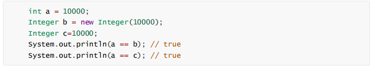


##==48.非new生成的Integer变量和new Integer()生成变量的对比==

非new生成的Integer变量和new Integer()生成的变量比较时，**结果为false。**

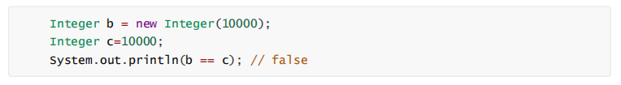

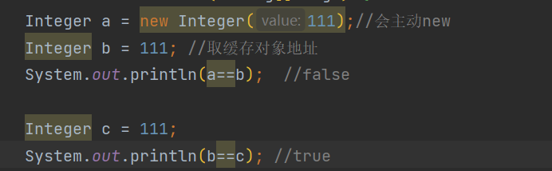


## ==49.两个非new生成的Integer对象的对比（实习-美团）==


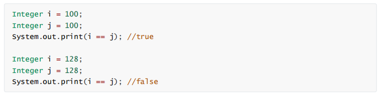

==在Integer的自动装箱赋值==时：**当被装值在-128~127之间时，会直接在IntegerCache缓存中取出对象引用地址。**  

IntegerCache是[Interger](https://so.csdn.net/so/search?q=Interger&spm=1001.2101.3001.7020)的一个静态内部类，实现如下：可以看到，默认情况下，该[静态内部类](https://so.csdn.net/so/search?q=静态内部类&spm=1001.2101.3001.7020)会直接缓存-127到128的Integer对象，因此，在valueOf()方法中，如果值在-127-128之间，都会直接返回缓存中的该对象而不会重新生成对象，引用地址当然相同了。


## ==49-2.两个new的Integer==


两个都是new出来的，==比较都为false。若要比较值是否相等，需使用equals方法进行比较


## ==50.什么是反射?==

在程序运行中，可以构造任意一个类的对象，可以了解任意一个对象所属的类，可以了解任意一个类的成员变量和方法，可以调用任意一个对象的属性和方法。

**在运行状态中:对于任意一个类，都能够知道这个类的所有变量和方法；对于任意一个对象，都能够调用它的任意一个变量和方法。**

**这种运行时，动态获取类信息以及动态调用对象属性方法的能力称为Java语言的反射机制。**

==这个通过Method类调用任意一个对象的属性和方法-----》》JDK动态代理的底层实现原理==

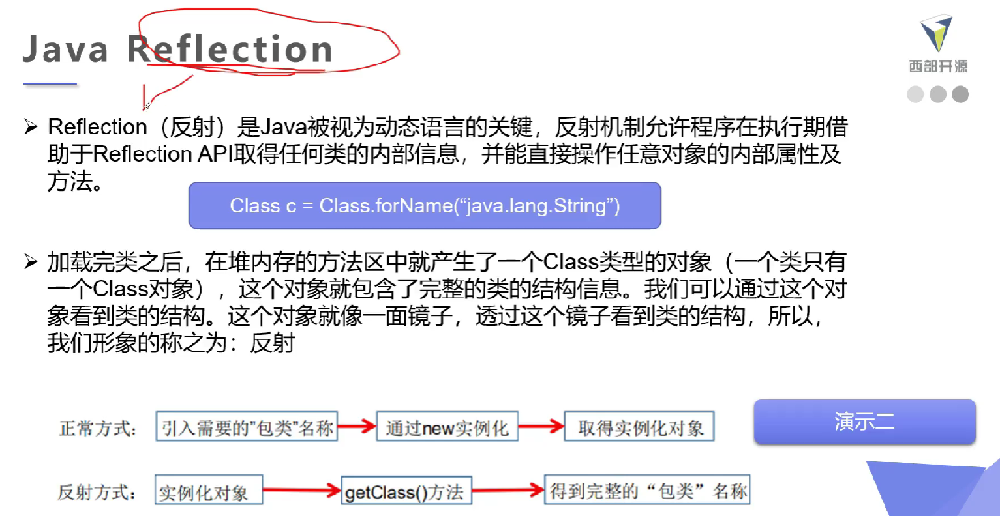


- **每个类都会有一个Class类的实例对象，用来表示这个类的类型信息**，而且唯一，存放在堆中（是对象就肯定在堆里面撒）
- 当我们编写一个类，编译完成后，在生成的.class文件中，就会产生一个Class对象。
- **反射的关键：获取这个类/对象的 Class对象，**我们的Class对象是通过字节码文件去获取的，底层是JVM的实现的这个功能。

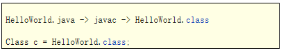

- 然后就可以通过调用Class对象的API获得这个类的全部信息，包括成员变量、成员方法、构造方法三部分，并且Java也为我们对应的准备了这三部分的一个类；

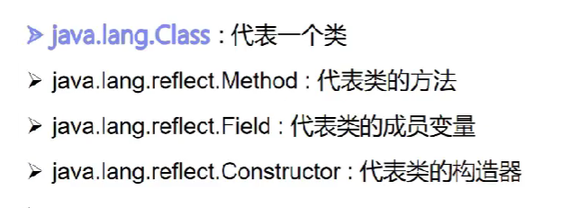

- 堆内存中，这个Class对象实例结构为以下三部分；

  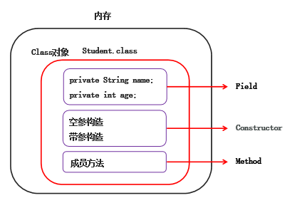

  

> **正射**
>
> 有反射就有对应到正射，当需要使用到某一个类的时候，先了解这个类到作用。然后实例化这个类，接着用实例化好的对象进行操作，这就是正射。
>
> ```java
> 	User u= new  User();
> 	
> 	u.setAge(20);
> 	u.setName("java");
> ```
>
> **反射**
>
> 反射就是，一开始并不知道要初始化的类对象是什么，自然也无法使用 new 关键字来创建对象了。
>
> ```java
>    Class<?> clazz = null;
>     //获取Class对象的引用
>     clazz = Class.forName("com.example.javabase.User");
> 
>     //第一种方法，实例化默认构造方法，User必须无参构造函数,否则将抛异常
>     User user = (User) clazz.newInstance();
>     user.setAge(20);
>     user.setName("java");
>     System.out.println(user);	
> ```
>
> 两段代码执行效果一样，但是实现的过程还是有很大的差别的：
>
> - 第一段代码在未运行前就已经知道了要运行的类是 User；
> - 第二段代码则是到整个程序运行的时候，从字符串 “com.example.javabase.User”，才知道要操作的类是 User。
>
> 所以反射就是**在运行时**才知道要操作的类是什么，并且可以**在运行时**获取类的完整构造，并调用对应的方法。
>


## ==51.反射机制的优缺点有哪些?==

优点：**能够运行时动态获取类的实例，提高灵活性；实现动态创建对象和编译（即动态编译）**

**动态代理，如AOP**

class.forName( ' com.mysq1.jdbc.Driver.class ');，加载MySQL的驱动类。

缺点：

- **使用反射性能较低，需要解析字节码，将内存中的对象进行解析。**其解决方案是:通过setAccessible(true)关闭JDK的安全检查来提升反射速度;多次创建一个类的实例时，有缓存会快很多;ReflflectASM工具类，通过字节码生成的方式加快反射速度。
- **增加安全问题。**如可以无视**泛型参数**的安全检查（**泛型参数的安全检查发生在编译时，而反射是在动态运行时**，此时集合的泛型将不能产生约束了，此时是可以为集合存入其他任意类型的元素的。）


## ==52.如何获取反射中的Class对象?==


- 方式一：Class c1 = **Class.forName(“全类名”);**


- 方式二：Class c2 = **类名.class**


- 方式三：Class c3 = **对象.getClass( );**

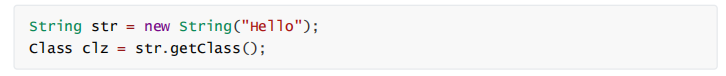

所以说我们反射是需要得到——Class类对象，可以从三个过程中获取，如下：

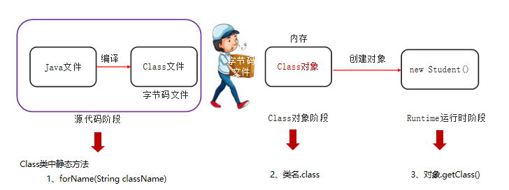


## ==53.Java反射API有几类?==

**反射API用来生成JVM中的类、接口或则对象的信息。**

- **Class类:**反射的核心类，可以获取类的属性，方法等信息。
- **Field类:** Java.lang.reflec包中的类，表示类的**成员变量**，可以用来获取和设置类之中的属性值。
- **Method类:** Java.lang.reflec包中的类，表示类的**成员方法**，它可以用来获取类中的方法信息或者执行方法。
- **Constructor类:** Java.lang.reflec包中 的类，表示类的**构造器**。

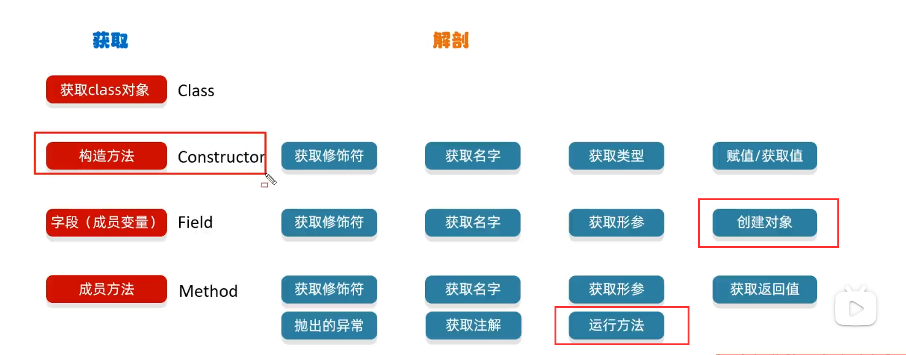

- ==创建对象，利用我们的构造器==

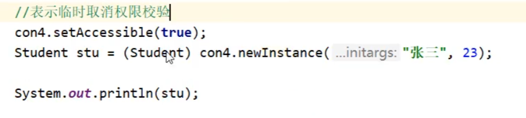

- ==通过Method类，可以调用任意一个对象的方法。==，他是通过使用一个该类的对象来实现成员方法的运行的，我就说嘛，怎么可能自己去调用呢，草

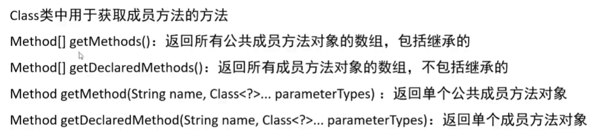

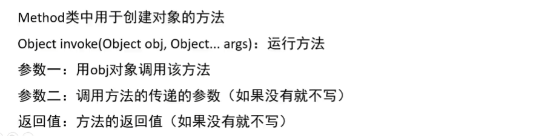

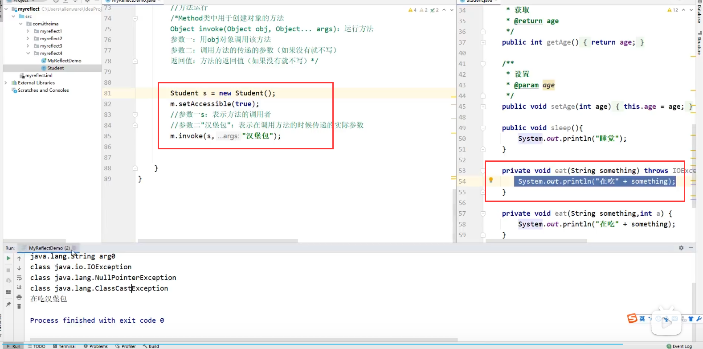


## 54.反射使用的步骤?

**1.获取想要操作的类的Class对象，**这是反射的核心，通过Class对象我们可以任意调用类的方法。

**2.调用Class类中的方法，既就是反射的使用阶段。**  **当我们获得了想要操作的类的Class对象后，可以通过Class类中的方法获取并查看该类中的方法和属性。**

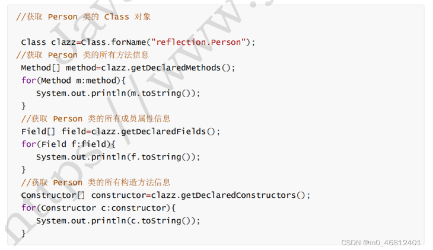

**3.使用反射API来操作这些信息。**例如对成员变量赋值、调用成员方法等


##==55.为什么引入反射概念?反射机制的应用有哪些?==

我们来看一下Oracle官方文档中对反射的描述:

从Oracle官方文档中可以看出，反射主要应用在以下几方面:

- 反射让开发人员**可以通过外部类的全路径名创建对象，并使用这些类，实现一些扩展的功能**
- ·反射让开发人员**可以枚举出类的全部成员，**包括构造函数、属性、方法。以帮助开发者写出正确的代码。
- ·测试时可**以利用反射API访问类的私有成员，以保证测试代码覆盖率。**

也就是说，Oracle希望开发者将反射作为一个工具，用来帮助程序员实现本不可能实现的功能。


举两个最常见使用反射的例子，来说明**反射机制的强大之处:**

**第一种:JDBC的数据库的连接**

在JDBC的操作中，如果要想进行数据库的连接，则必须按照以上的几步完成

1. **通过Class.forName()加载数据库的驱动程序**（通过反射加载，前提是引入相关了Jar包);
2. **通过DriverManager类进行数据库的连接，**连接的时候要输入数据库的连接地址、用户名、密码;
3. **通过Connection接口接收连接。**

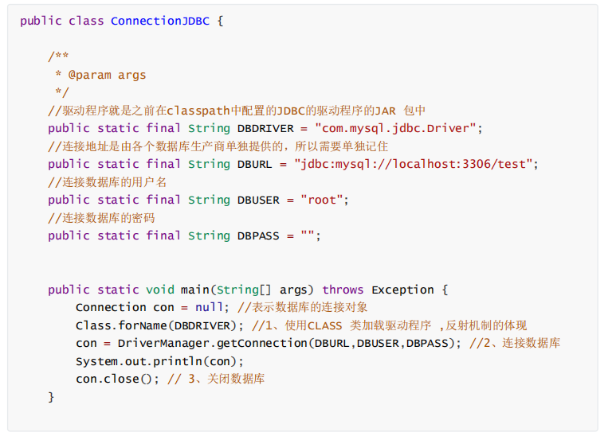


**第二种:Spring框架的使用，最经典的就是xml的配置模式。**

Spring通过XML配置模式装载Bean的过程:

1. **将程序内所有XML或 Properties 配置文件加载入内存中;**

2. **Java类里面解析xml或properties里面的内容，得到对应实体类的字节码字符串以及相关的属性信息;**

3. **使用反射机制，根据这个字符串获得某个类的Class实例;**
4. **动态配置实例的属性。**


Spring这样做的好处是:

- **不用每一次都要在代码里面去new或者做其他的事情;**

- **以后要改的话直接改配置文件，代码维护起来就很方便了;**

  


## ==56.反射的实现原理是什么？==

想要理解反射首先我们要知道JVM也就是java的虚拟机，java能够跨平台也是因为它，JVM说白了也就是一个进程，只不过是用来跑你的代码的。


1. **首先调用了 java.lang.Class 的静态方法，获取类信息。**反射获取类实例`Class.forName()`，并没有将实现留给了java,而是交给了**jvm去加载!**   **主要是先获取ClassLoader，然后调用native方法，获取信息，**

2. class类信息获取到之后开**始实例化，**一般调用 newInstance( ) 方法。
3. 以方法调用为例子：
   - 获取Method对象,
   - 调用 method.invoke() 方法


## 57.Java中的泛型是什么?

泛型是JDK1.5的一个新特性，**泛型就是将变量类型参数化，其在==编译时==才确定具体的参数。**这种参数类型可以用在类、接口和方法的创建中，分别称为**泛型类、泛型接口、泛型方法。**


## ==58.使用泛型的好处是什么?==

使用泛型的好处有以下几点:

**1、类型安全**

- 泛型的主要目标是**提高Java程序的类型安全**
- **编译时期就可以检查**出因Java类型不正确导致的ClassCastException异常
- 符合越早出错代价越小原则

**2、消除强制类型转换**

- 泛型的一个附带好处是，使用时直接得到目标类型，消除许多强制类型转换
- 所得即所需，这使得代码更加可读，并且减少了出错机会

**3、潜在的性能收益**

 由于泛型的实现方式，**支持泛型（几乎）不需要JVM或类文件更改。** 

**所有工作都在编译器中完成**

编译器生成的代码跟不使用泛型（和强制类型转换）时所写的代码几乎一致，只是更能确保类型安全而已


## ==60.什么是泛型中的限定通配符和非限定通配符?==

**限定通配符**  对类型进行了限制。有两种限定通配符，

- 一种是**<? extends T>**它通过确保类型必须是T的子类来设定类型的上界，
- 另一种是**<? superT>**它通过确保类型必须是T的父类来设定类型的下界。泛型类型必须用限定内的类型来进行初始化，否则会导致编译错误。

**非限定通配符 ？，可以用任意类型来替代**。如 `List<?>` 的意思是这个集合是一个可以持有任意类型的集合，它可以是`List<A>`，也可以是 `List<B>` ,或者 `List<C>` 等等。


## ==63.判断ArrayList< string>与ArrayList< Integer>是否相等?==

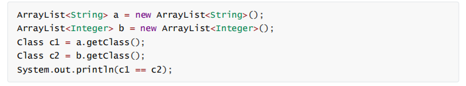

输出的结果是**true**。**因为无论对于ArrayList还是 ArrayList，它们的 Class类型都是一样的，都是ArrayList.class。**

==那它们声明时指定的String 和Integer到底体现在哪里呢?==

==答案是体现在类编译的时候。当JVM进行类编译时，会进行泛型检查，如果一个集合被声明为String类型，那么它往该集合存取数据的时候就会对数据进行判断，从而避免存入或取出错误的数据。==

补充: Array中可以用泛型吗?

**不可以。**这也是为什么Joshua Bloch在《Effective Java》一书中建议使用List来代替Array，因为 List可以提供编译期的类型安全保证，而Array却不能。


## ==64.Java序列化与反序列化是什么?==

**Java序列化是指把Java对象转换为字节序列流的过程，而Java反序列化是指把字节序列恢复为Java对象的过程:**

-  序列化：**序列化是把对象转换成有序字节流，以便在网络上传输或者保存在本地文件中。核心作用是对象状态的保存与重建。**我们都知道，Java对象是保存在JVM的堆内存中的，也就是说，如果JVM堆不存在了，那么对象也就跟着消失了。而序列化提供了一种方案，可以让你在即使VM停机的情况下也能把对象保存下来的方案。就像我们平时用的U盘一样。把Java对象序列化成可存储或传输的形式(如二进制流），比如保存在文件中。这样，当再次需要这个对象的时候，从文件中读取出二进制流，再从二进制流中反序列化出对象。
- 反序列化：**客户端从文件中或网络上获得序列化后的对象字节流，根据字节流中所保存的对象状态及描述信息，通过反序列化重建对象。**


## 65.为什么需要序列化与反序列化?

简要描述: 对内存中的对象进行持久化或网络传输,这个时候都需要序列化和反序列化

深入描述

1. **对象序列化可以实现分布式对象。**

主要应用例如:RMI(即远程调用Remote Method Invocation)要利用对象序列化运行远程主机上的服务，就像在本地机上运行对象时一样。

2. **java对象序列化不仅保留一个对象的数据，而且递归保存对象引用的每个对象的数据。**

可以将整个对象层次写入字节流中，可以保存在文件中或在网络连接上传递。利用对象序列化可以进行对象的"深复制"，即复制对象本身及引用的对象本身。序列化一个对象可能得到整个对象序列。

3. **序列化可以将内存中的类写入文件或数据库中。**

比如:将某个类序列化后存为文件，下次读取时只需将文件中的数据反序列化就可以将原先的类还原到内存中。也可以将类序列化为流数据进行传输。
总的来说就是将一个已经实例化的类转成文件存储，下次需要实例化的时候只要反序列化即可将类实例化到内存中并保留序列化时类中的所有变量和状态。

4. **对象、文件、数据，有许多不同的格式，很难统一传输和保存。**

==序列化以后就都是字节流了，无论原来是什么东西，都能变成一样的东西，就可以进行通用的格式传输或保存==，传输结束以后，要再次使用，就进行反序列化还原，这样对象还是对象，文件还是文件。


## ==66.序列化实现的方式有哪些?==

实现**Serializable**接口或者**Externalizable**接口。

==Serializable接口==

类通过实现 `java.io.serializable` 接口以启用其序列化功能。可序列化类的所有子类型本身都是可序列化的。序列化接口没有方法或字段，仅用于标识可序列化的语义。

==Externalizable接口==

**Externalizable 继承自 serializable，该接口中定义了两个抽象方法:writeExternal(）与readExternal( ）。**

当使用Externalizable接口来进行序列化与反序列化的时候需要开发人员**重写writeExternal()与readExternal(方法。否则所有变量的值都会变成默认值。**

==两种序列化的对比==

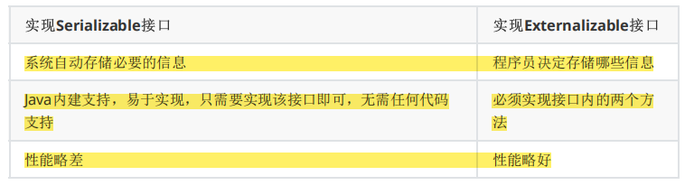


## 67.什么是serialVersionUlD ?

serialVersionUID用来**表明类的不同版本**

**Java的序列化机制是通过在运行时判断类的serialVersionUID来验证版本一致性的。**在进行反序列化时，JVM会把传来的字节流中的serialVersionUID与本地相应实体（类〉的serialVersionUID进行比较，如果相同就认为是**一致的，可以进行反序列化，**否则就会出现序列化版本不一致的异常。

```java
 private static final long serialVersionUID = 1;
```


## 68.为什么还要显示指定serialVersionUID的值?

如果不显示指定serialVersionUID, JVM在**序列化时会根据属性自动生成一个serialVersionUID,**然后与属性一起序列化,再进行持久化或网络传输。**在反序列化时, JVM会再根据属性自动生成一个新版serialNersionUID,**  然后将这个新版serialNersionUID与序列化时生成的旧版serialVersionUID进行比较，如果相同则反序列化成功，否则报错.

**如果显示指定了, JVM在序列化和反序列化时仍然都会生成一个serialVersionUID,但值为我们显示指定的值,这样在反序列化时新旧版本的serialVersionUID就一致了.**

在实际开发中,不显示指定serialVersionUID的情况会导致什么问题?如果我们的类写完后不再修改,那当然不会有问题,但这在实际开发中是不可能的,我们的类会不断迭代,一旦类被修改了，那旧对象反序列化就会报错. 所以**在实际开发中,我们都会显示指定一个serialVersionUID,**值是多少无所谓,只要不变就行。


## ==70.Java序列化中如果有些字段不想进行序列化，怎么办?==

对于不想进行序列化的变量，使用**transient关键字修饰。不能修饰类和方法。**

**transient关键字的作用是控制变量的序列化，**在变量声明前加上该关键字，可以阻止该变量被序列化到文件中，在被反序列化后，transient变量的值被设为初始值，如 int型的是0，对象型的是 null。

## ==71.静态变量会被序列化吗?==

**不会。因为序列化是针对对象而言的，而静态变量优先于对象存在,随着类的加载而加载,所以不会被序列化.**

看到这个结论,是不是有人会问, serialVersionUID也被static修饰，为什么serialVersionUID会被序列化? 其实serialVersionUID属性并没有被序列化，JVM在序列化对象时会自动生成一个serialVersionUID， 然后将我们显示指定的serialVersionUID属性值赋给自动生成的serialVersionUID。


## 72.异常处理体系？Error和 Exception区别是什么?

**异常体系**：主要是Error和Excepton两大类

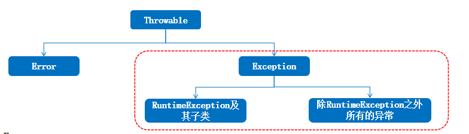

**Error：**

​		系统级别问题、JVM退出等，**代码无法控制。**

**Exception：**java.lang包下，称为异常类，它**表示程序本身可以处理的问题，可以通过catch捕获**

- **RuntimeException及其子类**：运行时异常，编译阶段不会报错。 (空指针异常，数组索引越界异常) 
- **除RuntimeException之外所有的异常**：==编译时异常==，编译期必须处理的，否则程序不能通过编译。 (日期格式化异常)


## ==74.throw和throws的区别是什么?==（实习-美团）

Java中的异常处理除了捕获异常和处理异常之外，还包括**声明异常和抛出异常**，可以通过 throws关键字在方法上声明该方法要抛出的异常，或者在方法内部通过throw抛出异常对象。

throws关键字和 throw关键字在使用上的几点区别如下:

- **throw关键字用在方法内部，只能用于抛出一种异常，**用来抛出方法或代码块中的异常，受查异常和非受查异常都可以被抛出。

- **throws关键字用在方法声明上，可以抛出多个异常，**用来标识该方法可能抛出的异常列表。一个方法用throws标识了可能抛出的异常列表，调用该方法的方法中必须包含可处理异常的代码，否则也要在方法签名中用throws关键字声明相应的异常。


## ==77.try-catch-finally中哪个部分可以省略?==（实习-美团）


**catch可以省略。**更为严格的说法其实是: **try只适合处理运行时异常，try+catch适合处理运行时异常+普通异常。**也就是说，如果你只用try去处理普通异常却不加以catch处理，编译是通不过的，因为编译器硬性规定，普通异常如果选择捕获，则必须用catch显示声明以便进一步处理。而运行时异常在编译时没有如此规定，所以catch可以省略，你加上catch编译器也觉得无可厚非。

理论上，编译器看任何代码都不顺眼，都觉得可能有潜在的问题，所以你即使对所有代码加上try，代码在运行期时也只不过是在正常运行的基础上加一层皮。但是你一旦对一段代码加上try，就等于显示地承诺编译器，对这段代码可能抛出的异常进行捕获而非向上抛出处理**。如果是普通异常，编译器要求必须用catch捕获以便进一步处理;如果运行时异常，捕获然后丢弃并且+finally扫尾处理，或者加上catch捕获以便进一步处理。**

==至于加上finally，则是在不管有没捕获异常，都要进行的"扫尾"处理。==


## 78.try-catch-finally中，如果catch 中 return了，finally还会执行吗?

会执行，在return前执行。


## ==79.JVM是如何处理异常的?==

**在一个方法中如果发生异常，这个方法会创建一个异常对象，并转交给JVM，**该异常对象包含异常名称，异常描述以及异常发生时应用程序的状态。**创建异常对象并转交给JVM的过程称为抛出异常。**可能有一系列的方法调用，最终才进入抛出异常的方法，这一系列方法调用的有序列表叫做调用栈。

**JVM会顺着调用栈去查找看是否有可以处理该异常的代码，如果有，则调用异常处理代码。**当JVM发现可以处理异常的代码时，会把发生的异常传递给它。**如果JVM没有找到可以处理该异常的代码块，JVM就会将该异常转交给默认的异常处理器（默认处理器为JVM的一部分），默认异常处理器打印出异常信息并==终止应用程序。==**
想要深入了解的小伙伴可以看这篇文章: https://www.cnblogs.com/qdhxhz/p/10765839.html


## ==80.Java的IO流分为几种?==

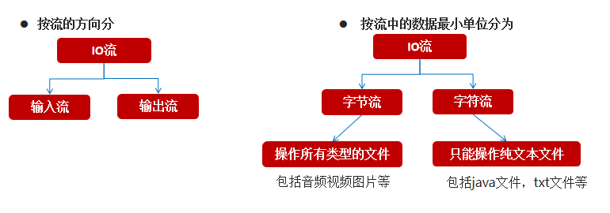

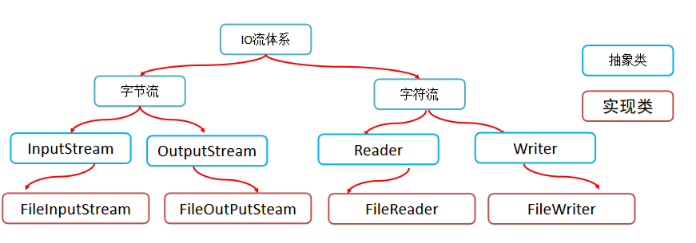

## 80.为什么要有字符流？

无论怎么搞，用**字节流读取文本数据**，肯定会出现**乱码问题，特别是对于中文字符**，如果要完美解决乱码，就又会引起内存溢出的隐患。所以我们**不用字节流进行文本数据的传输。**


## ==81.缓冲流是什么，有什么作用==

==缓冲流也称为高级流，是对原始流的加强！！==。之前学习的字节流可以称为**原始流。**

==作用：缓冲流自带缓冲区、可以提高原始字节流、字符流读写数据的性能==

他们之间的效率对比如下：我们程序中读取的数据都是从内存里面，而不是磁盘，要明白内存的读取速度远远大于磁盘。

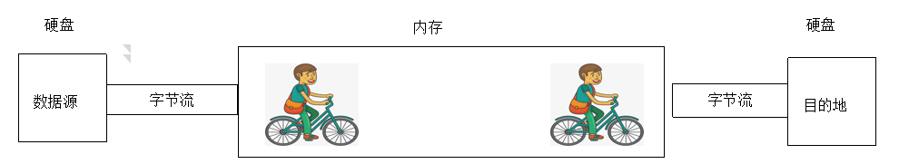


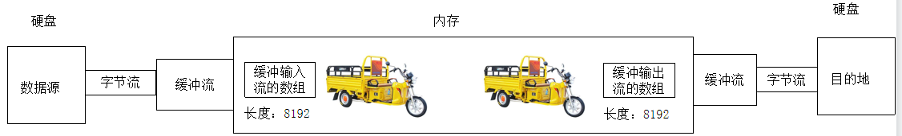

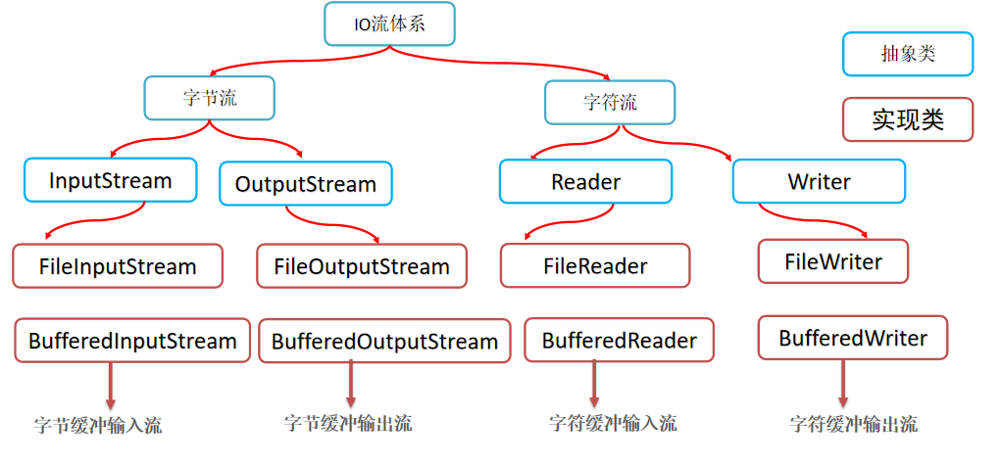

## ==81.什么是转换流，为什么要有转换流？字节流如何转为字符流?==

  **转换流：就是将字节流转换成字符流**，也是解决读取文本数据的问题。


**解决字符流在==代码字符集和文本字符集不一致时==，读取文本数据的乱码问题！！** 

> 字符流直接读取文本内容，代码文件编码和读取文本编码**必须一致才不会乱码！**！！我们的代码基本上都是UTF-8的，但文本内容就不一定，也可能是其他编码，这样直接采用Reader流进行读取就有问题。
>
> 所以我们读取文本数据时，**先通过字节流读取，然后把字节流转换！！！**


字节输入流转字符输入流通过**字符输入转换流——InputStreamReader**实现，该类的构造函数可以传入InputStream对象。

字节输出流转字符输出流通过**字符输出转换流——OutputStreamWriter_**实现，该类的构造函数可以传入OutputStream对象。


## 82.字符流与字节流的区别?

- 读写的时候字节流是**按字节读写**，字符流按**字符读写。**

- 字节流适合**所有类型文件的数据传输**，因为计算机字节(Byte）是电脑中表示信息含义的最小单位。字符流只能够处理**纯文本数据**，其他类型数据不行，但是字符流处理文本要比字节流处理文本要方便。
- 在读写文件需要对内容按行处理，比如比较特定字符，处理某一行数据的时候一般会选择字符流。
- 只是读写文件，和文件内容无关时，一般选择字节流。


## ==83.什么是阻塞IO?什么是非阻塞IO?==


当用户线程**发起一个IO请求操作**（ 本文以读请求操作为例 )，内核会去查看要读取的数据是否就绪，**对于阻塞IO来说，如果数据没有就绪，则会一直在那等待，直到数据就绪；**  **对于非阻塞IO来说，如果数据没有就绪，则会返回一个标志信息告知用户线程当前要读的数据没有就绪。**==当数据就绪之后，再将数据拷贝到用户线程，这样才完成了一个完整的IO读请求操作==。

那么阻塞（blocking lO）和非阻塞(non-blocking lO）的区别就在于第一个阶段，**如果数据没有就绪，在查看数据是否就绪的过程中==是一直等待，还是直接返回一个标志信息==。**

> Java中传统的IO都是阻塞IO，比如通过socket来读数据，调用read()方法之后，如果数据没有就绪，当前线程就会一直阻塞在read方法调用那里，直到有数据才返回;而如果是非阻塞IlO的话，当数据没有就绪，read()方法应该返回一个标志信息，告知当前线程数据没有就绪，而不是一直在那里等待。


## ==84.Java 中 3 种常见 IO 模型==(携程)

- **BIO（Blocking IO）：同步阻塞 IO 模型**

  应用程序发起 read 调用后，会一直阻塞，直到内核把数据拷贝到用户空间。

  

  ==在服务器中实现的模式为一个连接一个线程。==也就是说，客户端有连接请求的时候，服务器就需要启动一个线程进行处理，如果这个连接不做任何事情会造成不必要的线程开销。

  ==BIO适用于客户端连接数量小的架构。对于高并发无能为力==。

  

- **NIO（Non-blocking IO）：同步非阻塞IO模型**。

  Java 中的 NIO 可以看作是 ==I/O 多路复用模型==。也有很多人认为，Java 中的 NIO 属于==同步非阻塞 IO 模型。==

  **1、我们先来看看 同步非阻塞 IO 模型。**

  

  同步非阻塞 IO 模型中，应用程序会一直发起 read 调用直到收到了数据已准备就绪的信息才开始真正进行读取拷贝，==但等待数据从内核空间拷贝到用户空间的这段时间里，线程依然是阻塞的==，直到在内核把数据拷贝到用户空间。

  ==通过轮询操作，避免了一直阻塞。==相比于同步阻塞 IO 模型，同步非阻塞 IO 模型确实有了很大改进。

  但是，这种 IO 模型同样存在问题：==应用程序不断进行 I/O 系统调用==，==轮询数据是否已经准备好的过程是十分消耗 CPU 资源的。==

  

  **2、这个时候，I/O 多路复用模型 就上场了。**

  

  IO 多路复用模型中，==线程首先发起 select 调用，询问内核数据是否准备就绪==，等内核把数据准备好了，用户线程再发起 read 调用。

  read 调用的过程（数据从内核空间 -> 用户空间）还是阻塞的。
  
  ==IO 多路复用模型，通过减少无效的系统调用，减少了对 CPU 资源的消耗。==
  
  > 目前支持 IO 多路复用的系统调用，有 select，epoll 等等。select 系统调用，目前几乎在所有的操作系统上都有支持。
  >
  > - **select 调用** ：内核提供的系统调用，它支持一次查询多个系统调用的可用状态。几乎所有的操作系统都支持。
  > - **epoll 调用** ：linux 2.6 内核，属于 select 调用的增强版本，优化了 IO 的执行效率。
  
  > **select，poll，epoll都是IO多路复用的机制。**IO多路复用就是通过一种机制监视多个描述符，一旦某个描述符就绪（一般是读就绪或者写就绪），就通知程序进行相应的读写操作。但select,poll，epoll本质上都是同步IO，因为他们都需要在读写事件就绪后自己负责进行读写，也就是说这个读写过程是阻塞的，而异步I/o则无需自己负责进行读写，异步Io的实现会负责把数据从内核拷贝到用户空间。
  
  **3、Java 中的 NIO ，**有一个非常重要的**选择器 ( Selector )** 的概念，也可以被称为 **多路复用器**。通过它，只需要一个线程便可以管理多个客户端连接。==当客户端数据到了之后，才会为其服务。==
  
  ==所以说java中的NIO既可以说是同步非阻塞IO模型，也可以说是IO多路复用模型==
  
  
  
  ==在服务器中实现的模式为一个请求一个线程==，也就是说，客户端发送的连接请求都会注册到多路复用器上，多路复用器轮询到有连接IO请求时才会启动一个线程进行处理。
  
  ==NIO适用于连接数目多且连接比较短（轻操作）的架构==
  
  
  
- **AlO（Asynchronous IO）：异步并非阻塞IO模型，**

  AIO 也就是 NIO 2。Java 7 中引入了 NIO 的改进版 NIO 2,它是异步 IO 模型。

  ==异步 IO 是基于事件和回调机制实现的==，也就是应用操作之后会直接返回，不会堵塞在那里，当后台处理完成，操作系统会通知相应的线程进行后续的操作。

  

  ==在服务器中实现的模式为一个有效请求一个线程==，也就是说，客户端的IO请求都是通过操作系统先完成之后，再通知服务器应用去启动线程进行处理。

  ==AIO一般适用于连接数目多且连接比较长(重操作）的架构==，充分调用操作系统参与并发操作，编程比较复杂，从JDK1.7开始支持。

  ==目前来说 AIO 的应用还不是很广泛。==Netty 之前也尝试使用过 AIO，不过又放弃了。这是因为，Netty 使用了 AIO 之后，在 Linux 系统上的性能并没有多少提升。

  最后，来一张图，简单总结一下 Java 中的 BIO、NIO、AIO。

  

  


## ==85.Java lO都有哪些设计模式?==

==使用了适配器模式和装饰器模式，对应转换流和缓冲流==

- 适配器模式，在字符转换流中将字节流转换成字符流！！！

```java
Reader reader = new INputstreamReader(inputstream) ;
```

**把一个类的接口变换成客户端所期待的另一种接口，**从而使原本因接口不匹配而无法在一起工作的两个类能够在一起工作

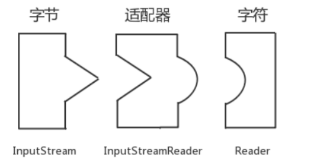

- **装饰器模式，缓冲流，**直接将FileInputstream对象变成BufferedInputstream，增加这个对象的功能。

- 就拿我们前面的IO流为例子，他就是使用了装饰设计模式，

  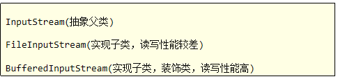

```java
new BufferedInputstream(new Fi1eInputstream(inputstream));
```

**在不改变原类的基础上, 动态地扩展一个类的功能。动态地往一个类中添加新的行为的设计模式。**

==就功能而言，装饰器模式相比生成子类更为灵活，这样可以给某个对象而不是整个类添加一些功能。==


## ==86. 什么是IO？==

IO就是输入输出，简单来说就是对数据的读写操作，包括对**硬盘**的读写、对**socket的**读写以及**外设的读写**。我们在平常开发过程中接触最多的就是 **磁盘 IO（读写文件）** 和 **网络 IO（网络请求和响应）**。

- **从计算机结构的视角来看的话，** I/O 描述了计算机系统与外部设备之间通信的过程。输入设备向计算机输入数据，输出设备接收计算机输出的数据。
- **从应用程序的视角来看的话，**我们的应用程序对操作系统的内核发起 IO 调用（系统调用），操作系统负责的内核执行具体的 IO 操作。也就是说，我们的应用程序实际上只是发起了 IO 操作的调用而已，具体 IO 的执行是由操作系统的内核来完成的。

**当应用程序发起 I/O 调用后，会经历两个步骤：**

1. 内核查看 I/O 设备是否准备好数据
2. 内核将数据从内核空间拷贝到用户空间

> 根据操作系统相关的知识：为了保证操作系统的稳定性和安全性，一个进程的地址空间划分为 **用户空间（User space）** 和 **内核空间（Kernel space ）** 。
>
> 像我们平常运行的应用程序都是运行在用户空间，只有内核空间才能进行系统态级别的资源有关的操作，比如文件管理、进程通信、内存管理等等。也就是说，我们想要进行 IO 操作，一定是要依赖内核空间的能力。并且，用户空间的程序不能直接访问内核空间。
>
> 当想要执行 IO 操作时，由于没有执行这些操作的权限，只能发起系统调用请求操作系统帮忙完成。因此，用户进程想要执行 IO 操作的话，必须通过 **系统调用** 来间接访问内核空间


# 二、java集合

## 1.集合与数组的区别

特点：

- **集合大小动态变化**（所以在删除元素时，有并发修改问题）
- **只能存储引用类型数据啊！！**
- **支持泛型**

数组：

- **大小固定**（声明时即定下来）
- **既可以存储基本数据类型，也可以存储引用类型**  （Teacher[] tt = new ......)
- **不支持泛型**


## 2.常见的集合有哪些?

**Java集合类主要由两个根接口Collection和Map派生出来的，分别是单列集合体系和双列的集合体系**

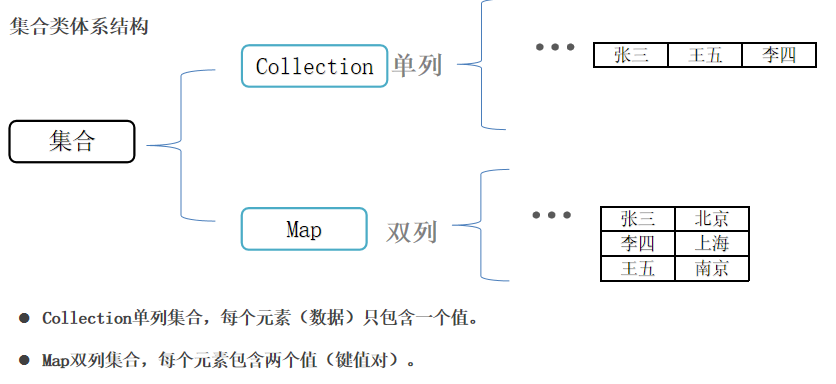

Collection派生出了三个子接口: **List、Set、Queue** (Java5新增的队列)，因此Java集合大致也可分成**List、Set、Queue、Map四种接口体系。**

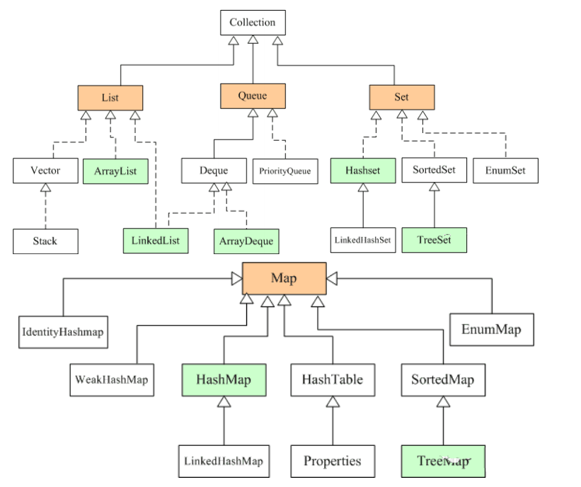


**List接口体系特点：**

- 有序、可重复、有索引

**Set接口体系：**

- 无序、不重复、无索引

**Queue集合体系：**

- 队列集合

**Map集合体系：**

- 使用键值对（key-value）存储
- 键是 无序, 不重复，无索引
-  可以存储 null 的 key 和 value，但 null 作为键只能有一个，null 作为值可以有多个


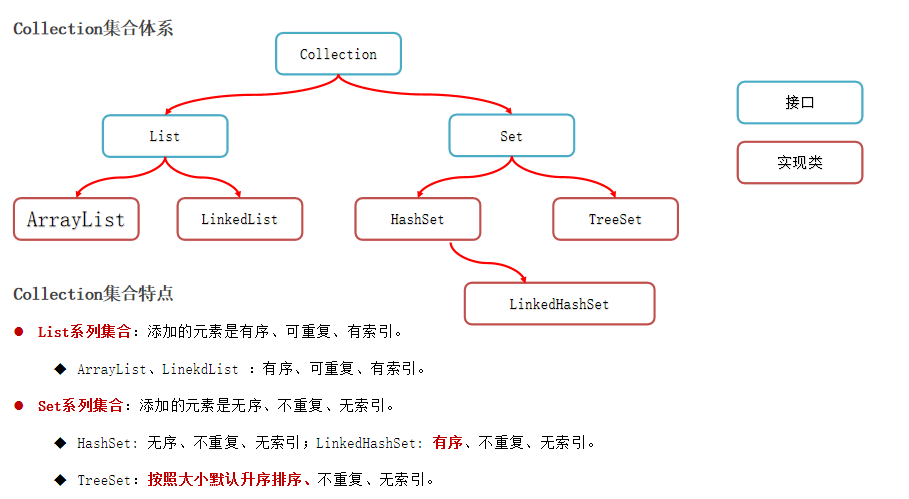

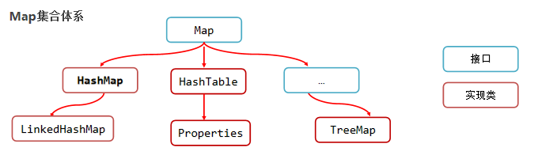

**HashMap:** 元素按照键是无序，不重复，无索引，值不做要求。（与Map体系一致）

**LinkedHashMap:** 元素按照键是有序，不重复，无索引，值不做要求。

**TreeMap：**元素按照建是排序，不重复，无索引的，值不做要求。


## ==2.线程安全的集合有哪些?线程不安全的呢?==

线程安全的:

- **Hashtable:  比HashMap多了个线程安全。**
- **ConcurrentHashMap: 是一种高效但是线程安全的集合。**
- **Vector:  比Arraylist多了个同步化机制。**  Vector类中对get以及remove，size方法都加了synchronized关键字来保证同步
- **Stack: 栈，也是线程安全的，继承于Vector。**

线性不安全的:

- **HashMap**
- **Arraylist**
- **LinkedList**
- **HashSet**
- **TreeSet**
- **TreeMap**


## 3.Arraylist与 LinkedList异同点?

**线程安全：**ArrayList和 LinkedList都是不同步的，也就是**线程不安全;**

**底层数据结构:：**Arraylist底层使用的是Object**数组**; LinkedList底层使用的是**双向循环链表**数据结构;

**插入和删除是否受元素位置的影响： ** 

- ==ArrayList采用数组存储，所以插入和删除元素的时间复杂度受元素位置的影响。==比如:执行add(E e)方法的时候，ArrayList 会默认在将指定的元素追加到此列表的末尾，这种情况时间复杂度就是O(1)。但是如果要在指定位置i插入和删除元素的话( add(int index，E element))时间复杂度就为O(n-i)。因为在进行上述操作的时候集合中第i和第i个元素之后的(n-i)个元素都要执行向后位/向前移一位的操作。
- ==LinkedList采用链表存储，所以插入，删除元素时间复杂度不受元素位置的影响，==都是近似0(1）而数组为近似o (n) 。

**是否支持快速随机访问:**

- LinkedList**不支持高效的随机元素访问**，而ArrayList实现了RandmoAccess接口，所以有**随机访问功**能。快速随机访问就是通过元素的序号快速获取元素对象(对应于get(int index)方法)。

内存空间占用:

-  ArrayList的空间浪费主要体现在在list列表的结尾会预留一定的容量空间，而LinkedList的空间花费则体现在它的每一个元素都需要消耗比ArrayList更多的空间(因为要存放直接后继和直接前驱以及数据）。


## 4.ArrayList 与 Vector区别?

- . Vector是线程安全的，ArrayList不是线程安全的。其中，**Vector在关键性的方法前面都加了synchronized关键字，来保证线程的安全性。**如果有多个线程会访问到集合，那最好是使用Vector，因为不需要我们自己再去考虑和编写线程安全的代码。

- ArrayList在底层数组不够用时在原来的基础上**扩展0.5倍，Vector是扩展1倍，**这样**ArrayList就有利于节约内存空间。**


##==5.说一说ArrayList的扩容机制?==

ArrayList扩容的本质就是计算出新的扩容数组的size后实例化，并将原有数组内容复制到新数组中去。**默认情况下，新的容量会是原容量的1.5倍。**


## ==7.HashMap的底层数据结构是什么?==

在JDK1.7和JDK1.8中有所差别:

在JDK1.7中，由"**数组+链表**"组成，数组是HashMap 的主体，链表则是主要为了解决哈希冲突而存在的。

在JDK1.8中，由”**数组+链表+红黑树**"组成。==当链表过长，则会严重影响HashMap 的性能，红黑树搜索时间复杂度是O(logn)，而链表是糟糕的O(n)。==因此，JDK1.8对数据结构做了进一步的优化，引入了红黑树，链表和红黑树在达到一定条件会进行转换:

- 当**链表超过8**且**数据总量超过64**才会转红黑树。如果当前数组的**长度小于64**，那么会选择**先进行数组扩容**，而不是转换为红黑树。

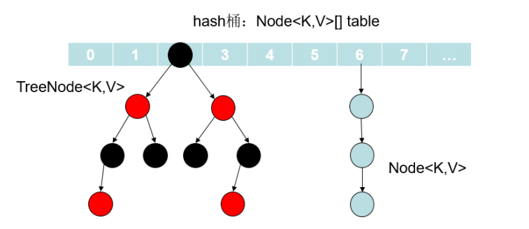


## ==8.解决hash冲突的办法有哪些?HashMap用的哪种?==

解决Hash冲突方法有:==开放定址法、再哈希法、链地址法(拉链法)、建立公共溢出区==。**HashMap中采用的是链地址法。**

- 开放定址法也称为再散列法，基本思想就是，**如果p=H(key)出现冲突时，则以p为基础，再次hash，**p1=H(p),如果p1再次出现冲突，则以p1为基础，以此类推，直到找到一个不冲突的哈希地址 pi。因此开放定址法所需要的 **hash表 的长度要大于等于**所需要存放的元素，而且因为存在再次hash，所以只能在删除的节点上做标记，而不能真正删除节点。
- 再哈希法(双重散列，多重散列)，**提供多个不同的hash函数，**当Rl=H1(key1)发生冲突时，再计算R2=H2(key1)，直到没有冲突为止。这样做虽然不易产生堆集，但增加了计算的时间。
- 链地址法(拉链法)，**将哈希值相同的元素构成一个同义词的单链表,**  并将单链表的头指针存放在哈希表**数组的第 i 个单元**中，查找、插入和删除主要在同义词链表中进行。==链表法适用于经常进行插入和删除的情况。==
- 建立公共溢出区，**将哈希表分为公共表和溢出表，当溢出发生时，将所有溢出数据统一放到溢出区。**


## ==9.为什么在解决hash 冲突的时候,不直接用红黑树？而选择先用链表,再转红黑树?==

因为红黑树需要进行左旋，右旋，变色这些操作来保持平衡，而单链表不需要。当==元素小于8个==的时候，此时做查询操作，==链表结构已经能保证查询性能==。当元素大于8个的时候，红黑树搜索时间复杂度是O(logn)，而链表是O(n)，此时==需要红黑树来加快查询速度，但是新增节点的效率变慢了。==

**因此，如果一开始就用红黑树结构，新增效率又比较慢, 但元素太少导致我的查询效率得不到很大提升，，无疑这是浪费性能的**。


## ==10.HashMap默认加载因子是多少?为什么是0.75，不是0.6或者0.8 ?==

回答这个问题前，我们来先看下HashMap的默认构造函数:

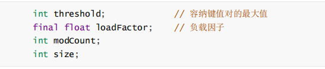

**Node[] table**的初始化长度length**(默认值是16)**，**Load factor**为负载因子(默认值是0.75)，**threshold**是HashMap所能容纳键值对的最大值。**threshold = length * Load factor**。也就是说，在数组定义好长度之后，负载因子越大，所能容纳的键值对个数越多。

默认的loadFactor是0.75，==0.75是对空间成本和时间效率的一个平衡选择==，一般不要修改，除非在时间和空间比较特殊的情况下:

==（对于初始化而言，负载因子越高，占内存空间成本越低，但会提高查找成本；太小，占内存空间成本会上升，但会降低查找成本）==

- **如果内存空间很多而又对时间效率要求很高，可以降低负载因子Load factor的值。**
- **相反，如果内存空间紧张而对时间效率要求不高，可以增加负载因子loadFactor的值，这个值可以大于1。**

我们来追溯下作者在源码中的注释(JDK1.7) :

> 翻译过来大概的意思是:作为一般规则，==默认负载因子(0.75）在时间和空间成本上提供了很好的折衷。较高的值会降低空间开销，但提高查找成本==（体现在大多数的HashMap类的操作，包括get和put)。设置初始大小时，应该考虑预计的entry数在map及其负载系数，并且尽量减少rehash操作的次数。如果初始容量大于最大条目数除以负载因子，rehash操作将不会发生。


## 11.==HashMap 中 key的存储索引是怎么计算的?==

首先根据key的值计算出hashcode的值，然后根据hashcode计算出hash值，最后通过**hash& (length-1）**计算得到存储的位置。

这里的Hash算法本质上就是三步==取key的 hashCode值、根据hashcode计算出hash值、通过取模计算下标==。其中，JDK1.7和1.8的不同之处，就在于第二步。我们来看下详细过程，以JDK1.8为例，n为table的长度。

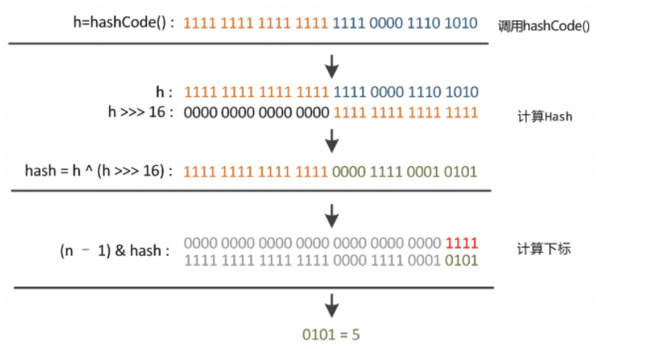


## **11.==JDK1.8 为什么要 hashcode 异或，其右移十六位的值？==**

之所以要对hashCode无符号右移16位并且异或，**核心目的是为了让hash值的[散列](https://so.csdn.net/so/search?q=散列&spm=1001.2101.3001.7020)度更高，尽可能减少hash表的hash冲突，从而提升数据查找的性能。**

- 在HashMap的put方法里面，是通过**Key的hash值**与数组的长度取模计算得到数组的位置。

- 而在绝大部分的情况下，**n的值一般都会小于2^16次方，也就是65536**。

- 所以也就意味着**index的值 ， 始终是使用hash值的低16位与(n)进行取模运算，**这样就会造成key的散列度不高，导致大量的key集中存储在固定的几个数组位置，很显然会影响到数据查找性能。

因此，为了提升key的hash值的散列度，在hash方法里面，做了位移运算。

首先使用key的hashCode无符号右移16位，意味着把hashCode的高位移动到了低位。然后再用hashCode与右移之后的值进行异或运算，**就相当于把高位和低位的特征进行和组合。从而降低了hash冲突的概率。**


> 因为在JDK 1.7 中扰动了 4 次，计算 hash 值的性能会稍差一点点。从速度、功效、质量来考虑，JDK1.8 优化了高位运算的算法，通过hashCode()的高16位异或低16位实现：(h = k.hashCode()) ^ (h >>> 16)。这么做可以在数组 table 的 length 比较小的时候，也能保证考虑到高低Bit都参与到Hash的计算中，同时不会有太大的开销。
>

## 12.==为什么 hash 值要与length-1相与？==

- 把 hash 值对数组长度取模运算，模运算的消耗很大，没有位运算快。
- 当 length 总是 2 的n次方时，h& (length-1) 运算等价于对length取模，也就是 h%length，但是 & 比 % 具有更高的效率。

## 12.==HashMap数组的长度为什么是 2 的幂次方？==

第一点，事实证明：2 的 N 次幂有助于减少碰撞的几率。

第二点，如果 length 为2的幂次方，则 length-1 转化为二进制必定是11111……的形式，在与h的二进制**与操作**效率会非常的快，而且空间不浪费，提高速度。

HashMap 构造函数允许用户传入的容量不是 2 的 n 次方，因为它可**以自动地将传入的容量转换为 2 的 n 次方**。会取大于或等于这个数的 且最近的2次幂作为 table 数组的初始容量， 

## 12.HashMap的put方法流程?

以JDK1.8为例，简要流程如下:

==1、首先根据key的值计算 hash 值，找到该元素在数组中存储的下标;==

==2、如果数组是空的，则调用resize进行初始化;==

==3、如果没有哈希冲突直接放在对应的数组下标里;==

==4、如果冲突了，调用equals判断是否相等，相等就覆盖掉value;==

==5、如果冲突后，发现该节点是红黑树，就将这个节点挂在树上;==

==6、如果冲突后是链表，判断该链表是否大于8，如果大于8并且数组容量小于64，就进行扩容;如果链表节点大于8并且数组的容量大于64，则将这个结构转换为红黑树;否则，链表插入键值对，若key存在，就覆盖掉value。==


## 13.HashMap的扩容方式?

==HashMap在容量超过负载因子所定义的容量之后，就会扩容==。Java里的数组是无法自动扩容的，方法是将HashMap 的大小扩大为原来**数组的两倍**，并将原来的对象放入新的数组中。

那扩容的具体步骤是什么?让我们看看源码。

先来看下JDK1.7的代码


....................................


## 14.一般用什么作为HashMap的key?

==一般用Integer、String这种不可变类当HashMap 当 key，而且String最为常用。==

- 因为字符串是==不可变的，所以在它创建的时候hashcode就被缓存了，不需要重新计算。==这就是HashMap 中的键往往都使用字符串的原因。
- 因为获取对象的时候要用到equals()和 hashCode()方法，那么键对象正确的重写这两个方法是非常重要的,这些类已经很规范的重写了hashCode()以及equals()方法。


## 15.==HashMap为什么线程不安全?==

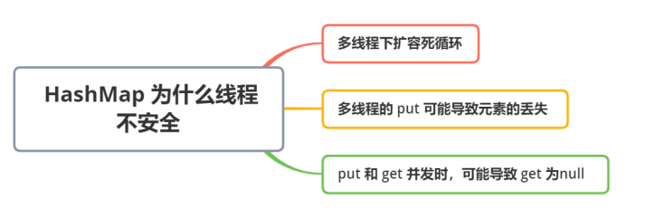

- **多线程下扩容死循环。**  ==JDK1.7==中的 HashMap使用头插法插入元素，在多线程的环境下，扩容的时候有可能==导致环形链表的出现，形成死循环==。因此，==JDK1.8使用尾插法==插入元素，在扩容时会保持链表元素原本的顺序，==不会出现环形链表的问题。==
- **多线程的put可能导致元素的丢失**。多线程同时执行put操作，如果计算出来的索引位置是相同的，那会造成前一个key被后一个key覆盖，从而导致元素的丢失。==此问题在JDK1.7和JDK 1.8中都存在。==
- **put和get并发时，可能导致get为null。**==线程1执行put时，因为元素个数超出threshold而导致rehash，线程2此时执行get，有可能导致这个问题。此问题在JDK1.7和JDK 1.8中都存在。==

我们来看下JDK 1.8 中 resize 方法的部分源码，重点看黄色部分：

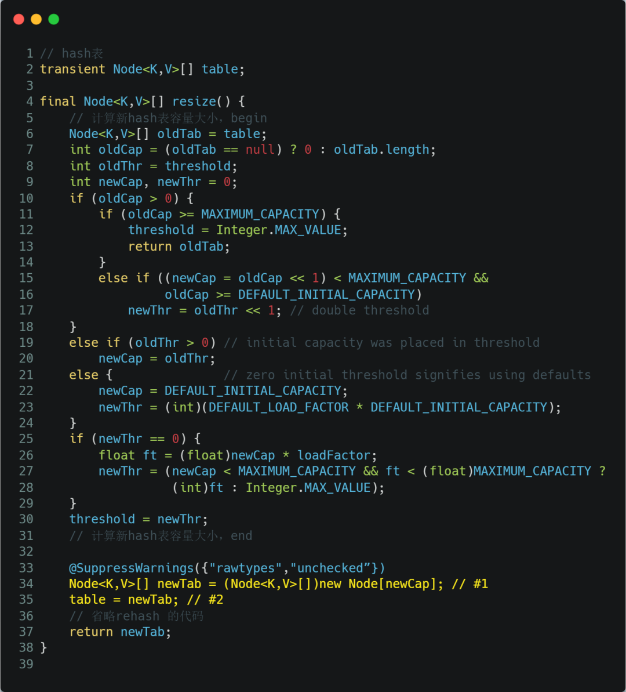

在代码`#1`位置，用新计算的容量new了一个新的hash表，`#2`将新创建的空hash表赋值给实例变量table。

注意此时实例变量table是空的，如果此时另一个线程执行get，就会get出null

具体分析可见我的这篇文章:[面试官：HashMap 为什么线程不安全？ (qq.com)](https://mp.weixin.qq.com/s?__biz=MzkyMTI3Mjc2MQ==&mid=2247485906&idx=1&sn=64785914b2bc6c53b21d7c62fbb605a7&source=41#wechat_redirect)


## ==16.HashTable、ConcurrentHashMap与HashMap==

**1、HashMap**

`HashMap`是==线程不安全==的，因为`HashMap`中操作都没有加锁，因此在多线程环境下会导致数据覆盖之类的问题，所以，在多线程中使用`HashMap`是会抛出异常的。

 **2、 HashTable**

`HashTable`是线程安全的,但是`HashTable`只是==原因为在put和get方法上使用加上`synchronized`。==保证插入时阻塞其他线程的插入操作。==虽然安全，但因为设计简单，所以性能低下。==


**3、ConcurrentHashMap**

`ConcurrentHashMap`是线程安全的，`ConcurrentHashMap`并非锁住整个方法，而是通过==原子操作和局部加锁==的方法保证了多线程的线程安全，且尽可能减少了性能损耗。


## 16.==ConcurrentHashMap的实现原理是什么?==

在数据结构上，**JDK1.8**中的ConcurrentHashMap 选择了与HashMap相同的==数组+链表+红黑树结构==；

在锁的实现上，抛弃了原有的 Segment 分段锁(ReentrantLock)，采用==CAS(Compare-And-Swap：比较并交换) + synchronized==实现更加低粒度的锁。将锁的级别控制在了**更细粒度的哈希桶元素级别**，也就是说**只需要锁住这个链表头结点（红黑树的根节点），就不会影响其他的哈希桶元素的读写，大大提高了并发度**。将 1.7 中存放数据的 HashEntry 改为 Node，但作用都是相同的，**其中的 val , next 都用了 volatile 修饰，保证了内存可见性。**

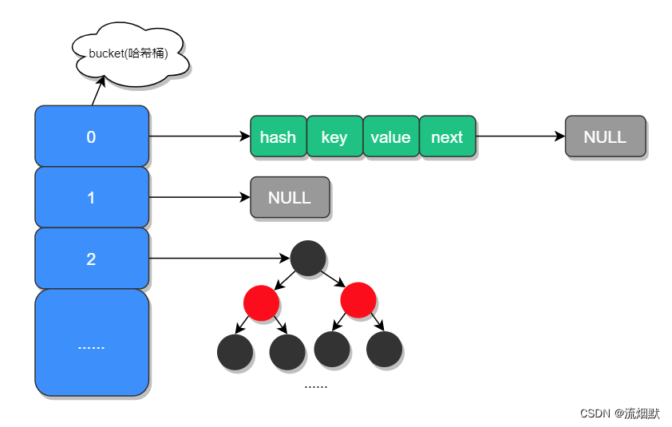

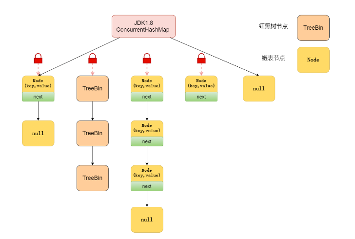

。。。。。。。。。。。。。。。


## ==17.ConcurrentHashMap的put方法执行逻辑是什么?==

大致可以分为以下步骤:

1.**根据key计算出hash值。**

2.**判断是否需要进行初始化。**

**3.根据hash值定位到首节点Node，**

- 如果为空，null，则通过**CAS**的方式尝试添加。这里没有加锁；
- 如果Node为不为null，计算Node的`hashcode == MOVED == -1`，无哈希冲突，说明其他线程在扩容，参与一起扩容。这里没有加锁；
- 如果都不满足，则出现了hash冲突且不处于扩容状态，**synchronized 锁住该首节点**，判断是链表还是红黑树，遍历插入。

4.当在链表长度超过8的时候，数组扩容或者将链表转换为红黑树。


## 18.ConcurrentHashMap的get方法是否要加锁，为什么?

get没有加锁的话，ConcurrentHashMap是如何保证读到的数据不是脏数据的呢？

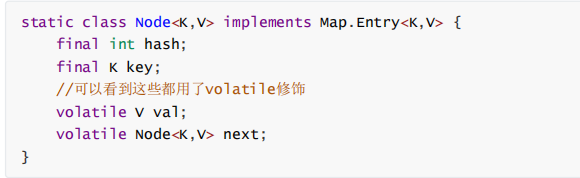

[(43条消息) JDK1.8的ConcurrentHashMap 的put、get 工作原理_hashmap1.8 put原理_卖山竹的山兔的博客-CSDN博客](https://blog.csdn.net/weixin_44683593/article/details/107081605)


**全程无锁。get操作可以无锁是由于Node元素的val和指针next是用volatile修饰的，在多线程环境下线程A修改结点的val或者新增节点的时候是对线程B可见的。**

1. 计算hash值，定位到该table索引位置，如果是首节点符合就返回
2. 如果遇到扩容的时候，会调用标志正在扩容节点**ForwardingNode**的find方法，查找该节点，匹配就返回
3. 以上都不符合的话，就往下遍历节点，匹配就返回，否则最后就返回null

> **ForwardingNode：**
>
> 一个用于连接两个table的节点类。它包含一个nextTable指针，用于指向下一张表。而且这个节点的key value next指针全部为null，它的hash值为-1(当hash为-1表示正在扩容). 这里面定义的find的方法是从nextTable里进行查询节点，而不是以自身为头节点进行查找。
> 


## 19.get方法不需要加锁与volatile修饰的哈希桶有关吗?


==没有关系。哈希桶table用volatile修饰主要是保证在数组扩容的时候保证可见性。==

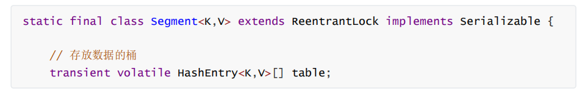


## 20.==ConcurrentHashMap不支持key或者value为null的原因?==

在ConcurrentMaps (ConcurrentHashMaps, ConcurrentSkipListMaps)这些**考虑并发安全的容器中**不允许null值的出现的主要原因是他可能会**在并发的情况下带来难以容忍的二义性**。而**在非并发安全的容器中**，**这样的问题刚好是可以解决的**。

在map容器里面，调用**map.get(key)=null时**，就会两重含义；

- **1.这个key在map里面不存在。**
- **2.这个key的value在设置的时候，就是null。**

**这种情况下，在非并发安全的map中，你可以通过map.contains(key)的方法来判断。**但是在考虑并发安全的map中，在**这两次方法调用的过程中**，这个值是有可能被改变的。

> 这时有A、B两个线程。
>
> 线程A调用concurrentHashMap.get(key)方法,返回为null，我们还是不知道这个null是没有映射的null还是存的值就是null。
>
> 我们假设此时返回为null的真实情况就是因为这个key没有在map里面映射过。那么我们可以用concurrentHashMap.containsKey(key)来验证我们的假设是否成立，我们期望的结果是返回false。
>
> 但是在我们调用concurrentHashMap.get(key)方法之后，containsKey方法之前，有一个线程B执行了concurrentHashMap.put(key,null)的操作。那么我们调用containsKey方法返回的就是true了。这就与我们的假设的真实情况不符合了。
>
> 这就是Doug说的在两次调用的过程中值是可能变化的(the map might have changed between calls.)。这就是Doug所要表达的二义性。


## 21.==ConcurrentHashMap的并发度是多少?==

在JDK1.7中，==并发度默认是16，==这个值可以在构造函数中设置。如果自己设置了并发度，
ConcurrentHashMap会使用**大于等于该值的最小的2的幂指数作为实际并发度，也就是比如你设置的值是17，那么实际并发度是32。**

- JDK 1.8 最大并发度是 Node 数组的大小，并发度更大；


## 22.==ConcurrentHashMap迭代器是强一致性还是弱一致性?==

注意哦，这里map是本身没有迭代器的，是通过转换的方式变成Set集合迭代的，用的是Collection集合的迭代器。

==与HashMap、HashTable迭代器是强一致性不同，ConcurrentHashMap迭代器是弱一致性。==

ConcurrentHashMap的迭代器创建后，就会按照哈希表结构遍历每个元素，但在遍历过程中，内部元素可能会发生变化，如果变化发生在已遍历过的部分，迭代器就不会反映出来，而如果变化发生在未遍历过的部分，迭代器就会发现并反映出来，这就是**弱一致性。**

**对比强一致性，只要发生了变化，迭代器就会反应出来**

**这样弱一致性迭代器线程可以使用原来老的数据，而写线程也可以并发的完成改变，更重要的，这保证了多个线程并发执行的连续性和扩展性，是性能提升的关键。**想要深入了解的小伙伴，可以看这篇文章为什么ConcurrentHashMap是弱一致的


==然后我们的HashTable是强一致性的迭代器==，所以说hashTable并不是完全没有用，它被提出来就是有一定的价值的，有些场景可能就是需要使用到强一致性的迭代器。


## 23.JDK1.7与JDK1.8中ConcurrentHashMap的区别?

- ·数据结构:取消了Segment分段锁的数据结构，取而代之的是**数组+链表+红黑树**的结构。
- 保证线程安全机制：JDK1.7采用**Segment的分段锁机制**实现线程安全，其中segment继承自ReentrantLock。JDK1.8采用**CAS+Synchronized保证线程安全**。
- ·锁的粒度：原来是对需要**进行数据操作的Segment加锁，现调整为对每个数组元素加锁**
  **(Node) 。**
- 链表转化为红黑树：定位结点的hash算法简化会带来弊端,Hash冲突加剧,因此在链表节点数量大于8时，会将链表转化为红黑树进行存储。
- **查询时间复杂度：从原来的遍历链表O(n)，变成遍历红黑树O(logN)。**


## 24.==ConcurrentHashMap和Hashtable的效率哪个更高?为什么?==

ConcurrentHashMap的效率要高于Hashtable，因为Hashtable**给整个哈希表加了一把大锁从而实现线程安全。而ConcurrentHashMap的锁粒度更低，**在JDK1.7中采用分段锁实现线程安全，在JDK1.8中采用CAS+synchronized实现线程安全。


## 25.说一下Hashtable的锁机制?

Hashtable是使用**Synchronized**来实现线程安全的，**给整个哈希表加了一把大锁，**多线程访问时候，只要有一个线程访问或操作该对象，那其他线程只能阻塞等待需要的锁被释放**，在竞争激烈的多线程场景中性能就会非常差!**

==原因为在put和get方法上使用加上`synchronized`。==

那为什么在get方法也加锁呢，原因和HashMap的并发读写问题一样，在扩容的时候容易出现get出null，concurrentHashMap之所以不会有问题，有两点一是volatile，二是那个forwardingNode；而hashTable没有这些，所以要加锁；

防止读的过程中，出现了put方法导致扩容了，然后读出来无效。 


## ==26.多线程下安全的操作map还有其他方法吗?==

还可以使用**collections.synchronizedMap**方法，对方法进行加同步锁，**本质也是对HashMap进行全表锁**。在竞争激烈的多线程环境下性能依然也非常差，不推荐使用!


## 27.HashSet和 HashMap区别?

HashSet的实现：==HashSet的底层其实就是HashMap，只不过我们HashSet是实现了Set接口并且把数据作为K值，而V值一直使用一个相同的虚值来保存。==

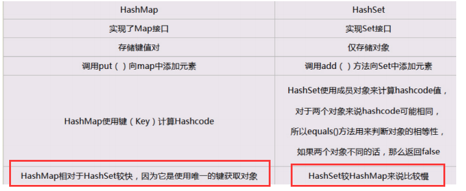


## 28.Collection中实现比较要怎么做?

第一种，==实体类实现Comparable接口，并实现 compareTo(T t)方法==，称为内部比较器。

第二种，==使用Collections集合工具类，进行比较排序，创建一个Comparator比较器对象，重写的compare(T t1,T t2)方法，实现自定义排序==。


| public static <T> void **sort**(List<T> list)                | 将集合中元素按照默认规则排序 |
| ------------------------------------------------------------ | ---------------------------- |
| public static <T> void **sort**(List<T> list，**Comparator**<? super T> c) | 将集合中元素按照指定规则排序 |


## 29.集合中lterator和 Listlterator有什么区别?

- 遍历。
  - 使用lterator，**可以遍历所有Collection类集合**，如Map，List，Set;但只能在**向前方向上遍历**集合中的元素。
  - ==使用Listlterator，只能遍历List实现的对象，但可以向前和向后遍历集合中的元素。==

- 添加元素。lterator无法向集合中添加元素;而Listlteror可以向集合添加元素。
- 修改元素。Ilterator无法修改集合中的元素;而，Listlterator可以使用set( )修改集合中的元素。
- 索引。lterator无法获取集合中元素的索引;而，使用Listlterator，可以获取集合中元素的索引。


## 30.==list集合的遍历删除问题==

 其他的**Set、Queue、Map都没有遍历删除，因为他们无序啊**，没有连在一起。相互之间没有关联，而List的无论是数组还是链表之间都是有很强的关联的。

 ==由于集合大小是动态变化的，list集合为有序有索引的，每次删除后后面的元素就会马上往前填充，但我遍历的指针会同时向后移动，造成漏删的问题。==

**解决方式：**

- 使用迭代器的remove方法进行删除（原理是it.remove (  ) 删除当前迭代器取到的元素，并且让迭代器不后移。）
- for循环，使用索引倒着删除。


## 31.==collection集合的遍历方式&能否在遍历过程中使用collection.remove方法？==

所有Collection集合通用的方式有三种：

**1、迭代器Iterator：集合专属（仅遍历、删除）**

- 先通过集合的 `iterator（）`方法获取当前集合的迭代器，调用Iterator类的`hasNext（）、next（）、remove（）`方法完成遍历或删除。
- 迭代器进行遍历时，不能使用集合自带的删除方法，如 `List.remove（）`，只能使用迭代器的`remove（）`方法，否则会报 `ConcurrentModificationException()`异常。

> 我们通过源码分析：it.next()是获取当前元素并同时将迭代器对象移向下一个位置，我们直接点开next（）方法，内部有一个checkForComodification();
>
> 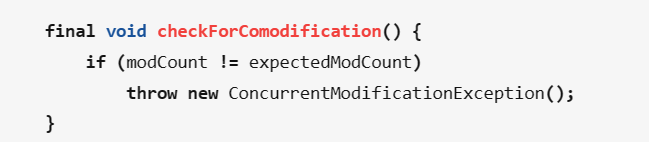
>
> 我们会看到只要modCount != expectedModCount就会报异常了，而这个modCount可以理解为集合的修改次数，然后这个modCount是集合内部的属性，，expectedModCount是迭代器内部属性，在获取迭代器（Iterator it = list.iterator()）时，会把expectedModCount设置为modCount，因此迭代期间如果集合被他自己类方法修改了，那么modCount就会变，所以会导致expectedModCount和modCount不相等，当我们调用next()方法的时候就会抛出异常了。（比如说list调用add方法，里面都会有modCount++ 这么个语句）


**2、增强for循环：集合数组均可（仅遍历）**

- jdk5出现的，内部原理就是一个迭代器，相当于是迭代器遍历集合的简化写法（编译时会增强for**变成迭代器的写法**遍历）。==只能进行遍历==

​	

**3、lambda表达式（仅遍历）**

JDK8开始的，更简单，更直接的遍历集合！！！底层是forEach，然后forEach底层是Iterator哈哈哈哈。

```java
// 加上lambda表达式后
list.forEach( s -> sout(s));
```


**iterator使用详情：**

- 获取迭代器

  | collection的方法名称      | 说明                                                        |
  | ------------------------- | ----------------------------------------------------------- |
  | **Iterator<E>iterator()** | 返回集合中的迭代器对象，该迭代器对象默认指向当前集合的0索引 |

- 三大方法

  | Iterator常用方法名称     | 说明                                                         |
  | ------------------------ | ------------------------------------------------------------ |
  | boolean  **hasNext ( )** | 询问**当前位置是否有元素存在**，存在返回true ,不存在返回false |
  | E  **next()**            | 获取当前位置的元素，并同时将迭代器对象移向下一个位置，注意防止取出越界。 |
  | void **remove( )**       | 移除当前迭代器指向元素，**并且不让迭代器后移**               |

- ```java
  Collection<String> list = new ArrayList<>(); 
  Iterator<String> it = list.iterator();
  while(it.hasNext()){
    String ele = it.next();
    System.out.println(ele);
    it.remove();
  }
  ```


## 32.==Map集合遍历方式？==

Map集合是通过键对应值的方式，他是**没有Iterator迭代器**的哦。有三种遍历方式：

- **1、先获取Map集合的全部键的Set集合，遍历键的Set集合，然后通过键提取对应的值**

  - public Set< K>  **keySet( )**：获取Map集合里面的键的集合，返回Set集合。
  - **get（key）**：通过键获取值。

  ```java
     //先把所有键取出来
  	Set<String> s1= buyMap.keySet();
  	//开始根据键找值
  	for (String key : s1) {
  		Integer value= buyMap.get(key);
  		System.out.println(key+"->>>>"+value);	
  	}
  ```
  
- **2、通过Map.Entry<K,V>对象的Set集合，然后通过Set集合的迭代器方式进行遍历**（iterator或foreach）

  - 先把Map集合转换成Set集合，Set集合中每个元素都是**键值对实体类**了。其实就是说，Map给我们定一个类，这个类用来存储Map元素的键和值，然后把这个类的每个对象放到Set集合里面去。这个类名字是   Map.Entry<K,V>——键值对类型。
  - public Set<Map.Entry<K,V>>  **entrySet()**：获取所有键值对对象的Set集合。
  - K **getKey( )** 和 V **getValue()**：**Map.Entry的两个方法获取键和值**

  ```java
  	Set<Map.Entry<String,Integer>> en= buyMap.entrySet();
  	for (Map.Entry<String, Integer> entry : en) {
  		String key=entry.getKey();
  		Integer value=entry.getValue();
  		System.out.println(key+"->>>"+value);
  		
  	}
  ```
  
  

- ==**3、Lambda表达式 推荐**==

得益于JDK 8开始的新技术Lambda表达式，提供了一种更简单、更直接的遍历集合的方式。底层原理是：键值对类型+forEach。

```java
buyMap.forEach((k , v) -> {
  System.out.println(k +"----->" + v);
});
```


# 三、java并发

## 1.线程和进程有什么区别?

同比操作系统中，线程进程的区别进行记忆，分辨。

**进程：**  

- 进程是程序的一次执行过程，是==系统运行程序的基本单位==，是==操作系统==资源分配的基本单位。

> 系统运行一个程序即是一个进程从创建，运行到消亡的过程。在 Java 中，当我们启动 main 函数时其实就是启动了一个 JVM 的进程，而 main 函数所在的线程就是这个进程中的一个线程，也称主线程。
>
> 在 Windows 中通过查看任务管理器的方式，我们就可以清楚看到 Windows 当前运行的进程（`.exe` 文件的运行）。

**线程：**

- 线程是==处理器任务调度和执行==的基本单位，线程与进程相似，但线程是进程内部的一个更小的执行单位。一个进程在其执行的过程中可以产生多个线程。


- 与进程不同的是，同类的多个线程共享该进程的**方法区**和**堆**资源，每个线程有自己独立的**程序计数器**、**虚拟机栈**和**本地方法栈**，所以==系统在各个线程之间作切换工作时，开销要比进程切换小得多==，也正因为如此，线程也被称为轻量级进程。

**根本区别：**进程是==操作系统==资源分配的基本单位，而线程是==处理器任务调度和执行==的基本单位

**包含关系:** 每个进程可以独立执行。==但线程不能，必须依存在程序中==

**影响关系: **一个进程崩溃后，在保护模式下不会对其他进程产生影响，但是一个线程崩溃整个进程都死掉。


##==2.创建线程的三种方式的对比?（实习-美团）==

**1）继承Thread类,重写run方法**

1. 定义一个子类MyThread继承线程类java.lang.Thread，重写run()方法

2. 创建子类对象，调用start( )方法启动线程（启动后会执行run方法的）

- **优势:** 编写简单

- **劣势:** 线程类已经继承了Thread类，所以==不能再继承其他父类，不利于扩展，没有返回值。不能抛出异常。==

**2）实现Runnable接口方式创建多线程**

1. 定义一个线程任务类实现Runnable接口，重写run()方法
2. 创建这个线程任务类对象，将其传递给Thread类的构造函数，得到Thread类的对象
3. 调用该线程对象的start()方法启动线程

- **优点：**==可以继续继承类和实现接口，扩展性强。==线程任务类只是实现了接口撒

- **缺点：**==编程稍微复制，没有返回值，不能抛出异常。==

**3）使用实现Callable接口方式创建多线程**

1. 新定义一个线程任务类实现Callable接口，重写call（）方法。
2. 创建线程任务类对象，将他传到FutureTask构造器中，创建FutureTask的对象
3. FutureTask的对象传递给Thread类的构造器，得到Thread的对象

4. 调用Thread的start方法启动线程

5. 线程执行完毕后、通过**FutureTask的get方法**去获取call（）方法的返回值

- 优点：
  - ==可以继续继承类和实现接口，扩展性强。==
  - **call方法可以有返回值，并且支持泛型。还可以抛出异常。**
- 缺点：编程最复杂，需要借助 FutureTask 类


## 3.为什么要使用多线程呢?

- **从计算机底层来说：线程可以比作是轻量级的进程，是程序执行的最小单位,线程间的切换和调度的开销远远小于进程。**另外，多核CPU时代意味着多个线程可以同时运行，这减少了线程上下文切换的开销。
- **从当代互联网发展趋势来说：现在的系统动不动就要求百万级甚至千万级的并发量，而多线程并发编程正是高并发系统的基础，利用好多线程机制可以大大提高系统整体的并发能力以及性能。**


## 4.说一说线程的生命周期和状态？

线程的生命周期及五种基本状态：

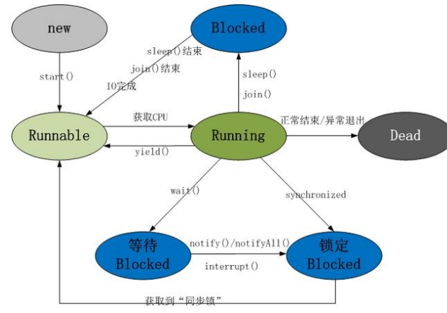

**1）新建状态（New）**:当==线程对象对创建后==，即进入了新建状态，如:Thread t = new MyThread();

**2）就绪状态（Runnable):** 当调用线程对象的start()方法；线程即进入就绪状态。处于就绪状态的线程，只是说明此线程已经做好了准备，==随时等待CPU调度执行==。

**3）运行状态（Running)：**当CPU开始调度处于就绪状态的线程时，此时线程才得以真正执行，即进入到运行状态。

**4）阻塞状态（Blocked) ：**处于运行状态中的线程由于某种原因，暂时放弃对CPU的使用权，停止执行，此时进入阻塞状态，==直到其进入到就绪状态==，才有机会再次被CPU调用。根据阻塞产生的原因不同，阻塞状态又可以分为三种:

- **1、等待阻塞：**运行状态中的线程执行==wait( )方法（Object）==，使本线程进入到等待阻塞状态;

- **2、同步阻塞：**线程在==获取synchronized同步锁失败( 因为锁被其它线程所占用 )==，它会进入同步阻塞状态;

- **3、其他阻塞：**通过调用线程的 ==sleep( )（THread）==或 join（）或发出了I/O请求时，线程会进入到阻塞状态。当sleep( )状态超时. join( )等待线程终止或者超时或者I/O处理完毕时，线程重新转入就绪状态。

**5）死亡状态（Dead)：**线程执行完了或者因异常退出了run()方法，该线程结束生命周期。


## ==5.什么是线程死锁?如何避免死锁?==

**死锁**

- ==多个线程同时被阻塞，它们中的一个或者全部都在等待某个资源被释放。由于线程被无限期地阻塞，导致程序不能正常终止。==

> 如下图所示，线 程 A 持有资源 2，线程 B 持有资源 1，他们同时都想申请对方的资源，所以这两个线程就会互相等待而进入死锁状态。
>
> 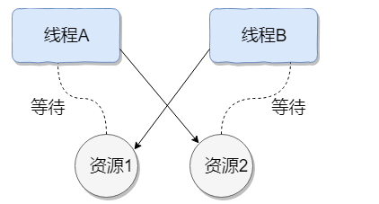

死锁**必须具备**以下四个条件:

- **互斥条件：**该资源任意一个时刻只由一个线程占用。
- **请求与保持条件:**  一个进程已经获取了至少一个资源，然后提出新的资源请求时受到了阻塞，但对已经获取的资源保持不放。
- **不剥夺条件:**  线程已获得的资源在末使用完之前不能被其他线程强行剥夺，只有自己使用完毕后才释放资源。
- **循环等待条件:**  若线程之间形成一种头尾相接的循环等待资源关系。


**如何避免线程死锁？**

只要破坏产生死锁的四个条件中的其中一个就可以了

- 破坏互斥条件

  ​	这个条件我们没有办法破坏，因为我们用锁本来就是想让他们互斥的

- **破坏请求与保持条件**

  ​	一次性申请所有的资源，没有申请完不进入运行。

- **破坏不剥夺条件**

  ​	占用资源的线程进一步申请其他资源时，如果申请不到，就主动释放它的资源，等以后再重新申请。

- **破坏循环等待条件**

  ​	按照顺序资源分配法。按某一顺序挨个申请资源，

- ==**锁排序法:（必须回答出来的点）**==

​	       **通过指定锁的获取顺序，**比如规定，只有获得A锁的线程才有资格获取B锁，按顺序获取锁就可以避免死锁。这通常被认为是解决死锁很好的一种方法。


## 6.什么是线程安全？什么是线程同步？

线程安全：**多个线程同时操作同一个共享资源**的时候可能会出现业务安全问题。**并发写入，并发读写。**

线程同步：**为了解决线程安全引入的方法，让多个线程实现先后依次访问共享资源。**


## 7.如何实现线程同步？

==线程同步的核心思想就是：加锁！！，可以通过synchronized关键字和Lock锁接口实现。==

synchronized关键字可以给修饰方法和代码块两个。

**使用Lock锁对象（只能锁代码块）**

为了更清晰的表达如何加锁和释放锁，**JDK5**以后提供了一个新的锁对象Lock，更加灵活、方便实现上锁与解锁操作。

由于Lock是接口，所以采用它的实现类**ReentrantLock**来构建Lock锁对象。可以直接通过调用Lock对象的 lock( )方法和unlock( ) 方法实现上锁解锁。（unlock这个必须配合try...finally...使用)

```java
   public void drawMoney( double money){
        String name = Thread.currentThread().getName();
     // 上锁
        lock.lock();
        try {
            if (this.money>0){
                System.out.println(name+"来取钱成功,吐出"+money);
                this.money -=money;
                System.out.println("余额剩余："+ this.money);
            }else{
                System.out.println(name+"来取钱成功余额不足了哦");
            }
        } finally {
          // 解锁
            lock.unlock();
        }
    }
```

## ==7.sleep()方法和 wait()方法区别和共同点?（实习-美团）==

**相同：**两者都可以暂停线程的执行。

**区别：**

- sleep方法：是**Thread类的静态方法**，当前线程将睡眠n毫秒，线程进入阻塞状态不释放锁。当睡眠时间到了，会自动解除阻塞，进入就绪状态，等待CPU的到来。==睡眠不释放锁。==
- wait方法：是**Object的方法，必须与synchronized关键字一起使用**，线程进入阻塞状态并且释放锁，需要别的线程调用一个对象上的[notify](https://so.csdn.net/so/search?q=notify&spm=1001.2101.3001.7020)或者notifyAll。==并且只有重新占用锁之后才会进入就绪状态。==  ==睡眠时会释放锁。==
- sleep方法没有释放锁，而 wait方法释放了锁。
- **sleep 通常被用于暂停执行；Wait通常被用于线程间交互/通信**
- **sleep()方法执行完成后，线程会自动苏醒**。wait()方法被调用后，**线程不会自动苏醒**，需要别的线程调用同一个对象上的notify( )或者notifyAll( )方法


## 8.为什么我们不能直接调用Thread. run()方法

**调用start方法方可使线程并使线程进入就绪状态**，而run方法只是 thread的一个普通方法调用，直接执行run()方法，会把run方法当成一个main线程下的普通方法去执行，并不会在某个线程中执行它，不是多线程。


## ==9.Thread类中的yield方法有什么作用?==

**Yield方法可以暂停当前正在执行的线程对象，让其它有相同优先级的线程执行。**它是一个静态方法而且只保证当前线程放弃CPU占用而不能保证使其它线程一定能占用CPU，执行yield()的线程有可能在进入到暂停状态后马上又被执行。


## 10.==谈谈Java的原子性，可见性，有序性（实习-阿里）==

**1）原子性**（synchronize、Lock）

​	**原子性**：即一个操作或者多个操作，要么全部执行，并且执行的过程不会被任何因素打断，要么就都不执行。

​	在Java中，对==基本数据类型变量==的读取和赋值操作是原子性操作，即这些操作是不可被[中断](https://so.csdn.net/so/search?q=中断&spm=1001.2101.3001.7020)的，要么执行，要么不执行。（而且必须是将数字赋值给某个变量，变量之间的相互赋值不是原子操作）。

从上面可以看出，**Java内存模型只保证了基本数据类型读取和赋值是原子性操作**，

如果要**实现更大范围操作的原子性，可以通过synchronized和Lock来实现。**

==由于synchronized和Lock能够保证任一时刻只有一个线程执行该代码块，那么自然就不存在原子性问题了，从而保证了原子性。==(如果存在多个线程去执行的话，那我第一个线程的代码逻辑可能就会执行不成功，例如我是对a--，可能最后a还是原数值，那这就说明我的操作失败了，执行了但是没有成功的感觉)

> 上面一句话虽然看起来简单，但是理解起来并不是那么容易。看下面一个例子：
>
> ```java
> x = 10; 	//语句1
> y = x; 		//语句2
> x++; 		//语句3
> x = x + 1; 	//语句4
> ```
>
> **注意**：其实只有语句1是原子性操作，其他三个语句都不是原子性操作。
>
> - 语句1是直接将数值10赋值给x，也就是说线程执行这个语句的会直接将数值10写入到工作内存中。
> - 语句2实际上包含2个操作，它先要去读取x的值，再将x的值写入工作内存，虽然读取x的值以及将x的值写入工作内存，这2个操作都是原子性操作，但是合起来就不是原子性操作了。
> - 同样的，x++和 x = x+1包括3个操作：读取x的值，进行加1操作，写入新的值


**2）可见性 (volatile保证)**（（synchronize、Lock））

可见性是指当多个线程访问同一个变量时，一个线程修改了这个变量的值，其他线程能够立即看得到修改的值。

- Java提供了**volatile关键字**来保证可见性。当一个共享变量被volatile修饰时，它会保证修改的值会立即被更新到主存，当有其他线程需要读取时，它会去内存中读取新值。

- 另外，**通过synchronized和Lock也能够保证可见性**，==synchronized和Lock能保证同一时刻只有一个线程获取锁然后执行同步代码，并且在释放锁之前会将对变量的修改刷新到主存当中。因此可以保证可见性。==


**3）有序性(volatile保证)**（synchronize、Lock）

​		有序性：即程序执行的顺序按照代码的先后顺序执行。

当从代码的层面上看，语句1在2的前面，但是真正执行时JVM不一定会保证语句1会在语句2之前执行，因为可能会发生**指令重排序（Instruction Reorder）**。

**指令重排序**：一般来说，**处理器**为了提高程序运行效率，可能会对输入代码进行优化，它不保证程序中各个语句的执行先后顺序同代码中的顺序一致，但是它会保证程序最终执行结果和代码顺序执行的结果是一致的。

**volatile可以避免指令重排序，保证有序性。**

==指令重排序不会影响单个线程的执行，但是会影响到线程并发执行的正确性。==

> 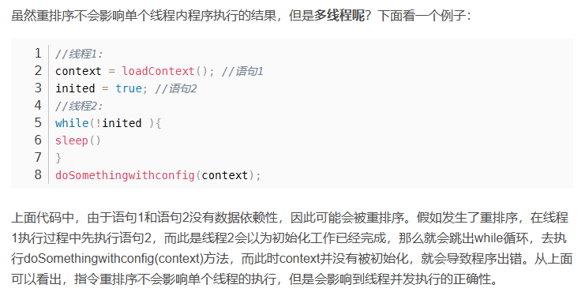

==**总结：**==

==要想并发程序正确地执行，必须要保证原子性、可见性以及有序性。只要有一个没有被保证，就有可能会导致程序运行不正确。==


## 10.==如何保证并发程序的正确执行？==

==要想并发程序正确地执行，必须要保证原子性、可见性以及有序性。只要有一个没有被保证，就有可能会导致程序运行不正确。==


## ==11.谈谈volatile的使用及其原理（实习-阿里）==

**volatile的两层语义:**

1. volatile保证变量对所有线程的**可见性**：将一个变量使用 `volatile` 修饰，它会保证修改的值会立即被**更新到主存**，当有其他线程需要读取时，都会去内存中读取新值。

2. **避免指令重排序，保证有序性。**
3. **但是不能保证原子性。**因为volatile只保证了每个线程去读取该变量时会去主存读到最新的！！！

>  为什么不能保证原子性呢？
>
> 举一个例子说明：即volatile 不能保证 自增i++ 是一个原子操作。
>
> 首先要明白一点，i++是非原子性的操作。它分为三步进行执行：
>
> 1. 将主存中 i 的值load到寄存器中 --> `ldr i`
> 2. i 的值在寄存器中自增。 --> `inc i`
> 3. 将自增后的值刷回主存。 --> `str i`
>
> 在变量 i 从主存被load到寄存器这一过程，如果 i 发生了变化，因为线程间的可见性，会重新去主存读取最新的 i 。但是，当 i 被加载到寄存器后，主存中的 i 的值再发生变化，不会对寄存器内的 i 值造成影响。
>
> 试想以下场景，对于变量 i = 5，线程A和线程B分别执行 i++，最后应该得到 i = 7。但是，如果A和B并发，按照以下顺序执行：A将 i load 到自己的寄存器中，A寄存器的 i = 5，此时A时间片结束。紧接着B 将 i load 到自己的寄存器中，B寄存器的 i = 5。B寄存器 i 自增，i = 6。 B寄存器的 i 值刷回内存，内存i = 6，B时间片结束。A拿到时间片，令A寄存器的 i 自增，A寄存器 i = 6。A将自己寄存器中的 i 刷回主存，主存 i = 6。
> 

**volatile的原理:（不用背）**内存屏障保证有序性


## ==12.线程阻塞的三种情况==

阻塞状态（Blocked) ：处于运行状态中的线程由于某种原因，暂时放弃对CPU的使用权，停止执行，此时进入阻塞状态，直到其进入到就绪状态，才有机会再次被CPU调用。根据阻塞产生的原因不同，阻塞状态又可以分为三种:

- **1、等待阻塞：**运行状态中的线程执行==wait( )方法（Object类）==，使本线程进入到等待阻塞状态;

- **2、同步阻塞：**线程在==获取synchronized同步锁失败( 因为锁被其它线程所占用 )==，它会进入同步阻塞状态;

- **3、其他阻塞：**通过调用线程的 ==sleep( )方法（Thread）==或 join（）或发出了I/O请求时，线程会进入到阻塞状态。当sleep( )状态超时. join( )等待线程终止或者超时或者I/O处理完毕时，线程重新转入就绪状态。


## ==15.守护线程是什么?==

在Java中有两类线程：用户线程 (User Thread)、守护线程 (Daemon Thread)。 

守护线程是指在程序运行的时候在后台提供一种通用服务的线程。它独立于控制终端并且周期性地执行某种任务或等待处理某些发生的事件。**在Java中垃圾回收线程就是守护线程。**

守护线程守护的就是用户线程。当用户线程全部执行完毕，守护线程才会跟着结束。


## 17. ==CAS了解吗?==

CAS：全称**compare and swap**，即比较并交换，它是一条==CPU同步原语，是一种硬件对并发的支持，不会被中断==。**可以解决多线程并行情况下，频繁加锁影响性能。**是乐观锁的实现

- CAS是一种**无锁的非阻塞算法**的实现。

- CAS包含了3个操作数:

  - 需要读写的内存值 V

  - 旧的预期值 A

  - 要修改的更新值 B

- 当且仅当 V 的值等于 A 时，CAS通**过原子方式用新值B来更新V的值**，否则不会执行任何操作（他的功能是判断内存某个位置的值是否为旧的预期值，如果是则更改为新的值，这个过程是原子的）


## 18.==CAS有什么缺陷?==

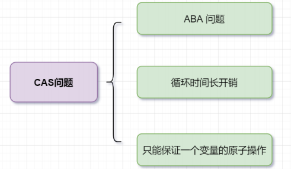

**1、ABA问题**

并发环境下，假设初始条件是A，去修改数据时，发现是A就会执行修改。但是看到的虽然是A，中间可能发生了A变B，B又变回A的情况。此时A已经非彼A，数据即使成功修改，也可能有问题。

可以通过**AtomicStampedReference类**解决ABA问题，它，一个原子更新带有版本号的引用类型，通过控制变量值的版本来保证CAS的正确性。原理是：**AtomicStampedReference** 有一个静态内部类Pair，使其成员变量上被 volatile 关键字修饰保证该属性被修改时对所有线程的可见性。Pair 类中有一个stamp属性维护当前版本号，使用CAS修改字段的同时也会CAS更新Pair对象。


**2、循环时间长开销**

CAS 经常会用到自旋操作来进行重试，也就是不成功就一直循环执行直到成功。如果长时间不成功，会给 CPU 带来非常大的执行开销。如果JVM能支持处理器提供的pause指令，那么效率会有一定的提升。

> 自旋示意图：就是不停的判断比较，看能否将值交换
>
> 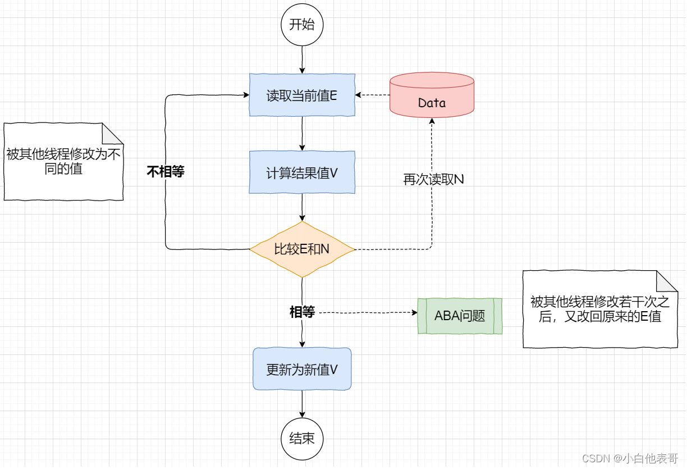
>
> - 现在Data中存放的是num=0，线程A将num=0拷贝到自己的工作内存中计算E=0（需求是做+1操作），计算的结果为V=1。
> - 由于是在多线程不加锁的场景下操作，所以可能此时num会被别的线程修改为其他值。此时需要再次读取num看其是否被修改，记再次读取的值为N。
> - 如果被修改，即E !=N，说明被其他线程修改过。那么此时工作内存中的E已经和主存中的num不一致了，根据EMSI协议，保证安全需要重新读取num的值。直到E= N才能修改。
> - 如果没被修改，即E =N，说明没被其他线程修改过。那门将工作内存中的E=0改为E=1，同时写回主存。将num=0改为num=1


**3、只能保证一个变量的原子操作。**

CAS保证的是对==一个变量执行操作的原子性==，如果对多个变量操作时，CAS目前无法直接保证操作的原子性的。但可以通过这两个方式解决这个问题:

- 使用锁来保证原子性:

- **将多个变量封装成对象，通过AtomicReference对象来保证原子性。**


## 19.==介绍一些乐观锁和悲观锁，能否举出一些例子？==

**悲观锁：**（加锁就是影响性能，因为并发读的情况下不会存在并发问题）

- 悲观锁就是我们常说到的锁。对于悲观锁来说，他总是认为==每次访问共享资源时会出现问题==(比如共享数据被修改)，所以必须每次数据操作加上锁，以保证[临界区](https://so.csdn.net/so/search?q=临界区&spm=1001.2101.3001.7020)的程序同一时间只能有一个线程在执行。也就是说，**共享资源每次只给一个线程使用，其它线程阻塞，用完后再把资源转让给其它线程**。
- 例如，java中**Synchronized**关键字

**乐观锁：**（更改数据多的情况下，会频繁发生自旋重试）

- 乐观锁又称为 “ 无锁 ”，顾名思义，它是乐观派。乐观锁认为==共享资源每次被访问的时候不会出现问题==，线程可以不停地执行，无需加锁也无需等待。
- ==只在数据进行提交更新==的时候，去验证对应的资源是否被其它线程修改了。
- **乐观锁天生免疫死锁**。由于无锁操作中没有锁的存在，因此肯定不会出现死锁的情况。
- 例如，**CAS、AQS、ReentrantLock**

**乐观锁多用于“ 读多写少 ”的环境，避免频繁加锁影响性能；而悲观锁锁用于“ 写多读少 ”的环境，避免频繁失败和重试影响性能。**


## 19.synchronized和 volatile 的区别是什么?

**volatile**保证==变量==对所有线程的**可见性**，使得所有对volatile变量的读写都直接写入主存。

**synchronized 解决的是执行控制的问题**，可以修饰**方法以及代码块**，属于悲观锁的一种实现。

**volatile仅能实现变量的修改可见性，不能保证原子性，而synchronized则可以保证变量的修改可见性和原子性；**


## 20.==synchronized 和Lock 有什么区别?==

- synchronized可以修饰**方法以及代码块**；而 lock 只能给**代码块**加锁。

- synchronized**不需要手动获取锁和释放锁**，使用简单，发生异常会自动释放锁，不会造成死锁；**而lock需要自己加锁和释放锁**，如果没有进行unLock( )去释放锁就会造成死锁。

- **两者都是可重入锁**，就是一个线程不用释放，可以重复的获取一个锁n次，只是在释放的时候，也需要相应的释放n次。（简单来说：A线程在某上下文中或得了某锁，当A线程想要在次获取该锁时，不会应为锁已经被自己占用，而需要先等到锁的释放）假使A线程即获得了锁，又在等待锁的释放，就会造成[死锁](https://so.csdn.net/so/search?q=死锁&spm=1001.2101.3001.7020)。

  


## 22.==什么是synchronized，用法有哪些?==

**`synchronized` 是 Java 中的一个关键字，属于悲观锁的实现，**主要解决的是多个线程之间访问资源的同步性，可以保证被它修饰的方法或者代码块在任意时刻只能有一个线程执行。

`synchronized` 关键字的使用方式主要有下面 3 种：

**1、修饰实例方法 （锁当前对象实例）**

​		给当前对象实例加锁，进入同步代码前要获得 **当前对象实例的锁** 。

```java
synchronized void method() {
    //业务代码
}
```

**2、修饰静态方法 （锁当前类）**

​		给当前类加锁，会作用于类的所有对象实例 ，进入同步代码前要获得 **当前 class 的锁**。

​		这是因为静态成员不属于任何一个实例对象，归整个类所有，被类的所有实例共享。

```java
synchronized static void method() {
    //业务代码
}
```

**3、修饰代码块 （锁指定对象/类）**

​		对括号里指定的对象/类加锁：

- `synchronized(this)` 表示进入同步代码库前要获得 **锁当前对象实例**。
- `synchronized(类.class)` 表示进入同步代码前要获得 **锁当前类**

```java
synchronized(同步锁对象) {
    //业务代码
}
```

**静态 `synchronized` 方法和非静态 `synchronized` 方法之间的调用互斥么？**

不互斥！！！如果一个线程 A 调用一个实例对象的非静态 `synchronized` 方法，而线程 B 需要调用这个实例对象所属类的静态 `synchronized` 方法，是允许的，不会发生互斥现象，因为访问静态 `synchronized` 方法占用的锁是当前类的锁，而访问非静态 `synchronized` 方法占用的锁是当前实例对象锁。


## 23.==Synchronized可以有效保证并发吗？或者问关键字的作用有哪些？==

1. **原子性：**确保线程互斥的访问同步代码 ，保证被它修饰的方法或者代码块在任意时刻只能有一个线程执行。

2. **可见性：**保证共享变量的修改能够及时可见，synchronized和Lock能保证同一时刻只有一个线程获取锁然后执行同步代码，并且在释放锁之前会将对变量的修改刷新到主存当中。因此可以保证可见性。

3. **有序性:** 有效解决重排序问题。同volatile是使用的内存屏障原理。

## 24.==synchronized 底层原理了解吗？（实习-阿里）==

synchronized 关键字底层原理属于 JVM 层面的东西。

- `synchronized` **同步代码块**的实现使用的是 `monitorenter` 和 `monitorexit` 指令，其中 `monitorenter` 指令指向同步代码块的开始位置，`monitorexit` 指令则指明同步代码块的结束位置。

- `synchronized` **修饰的方法**并没有 `monitorenter` 指令和 `monitorexit` 指令，取得代之的确实是 `ACC_SYNCHRONIZED` 标识，该标识指明了该方法是一个同步方法。

**不过两者的本质都是对对象监视器 monitor 的获取。**

   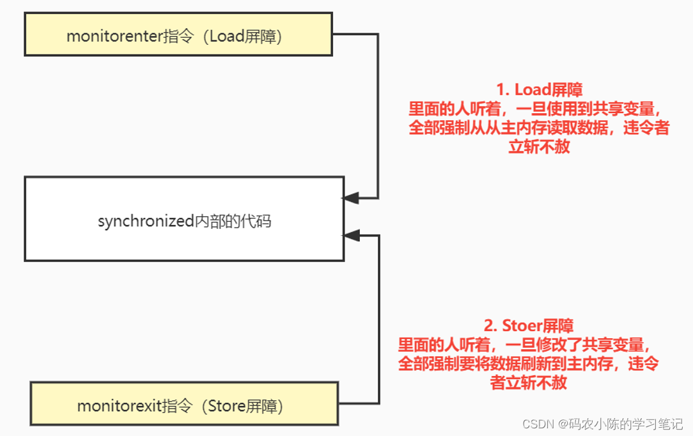


## ==25.ThreadLocal是什么?==

ThreadLocal，即==线程本地变量==。如果你创建了一个ThreadLocal变量，**那么访问这个变量的每个线程都会有这个变量的一个本地拷贝**，多个线程操作这个变量的时候，**实际是操作自己本地内存里面的变量，从而起到线程隔离的作用，避免了线程安全问题。**

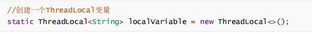


## 26.==ThreadLocal的实现原理?==

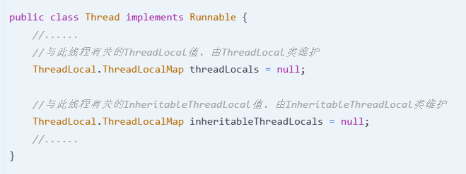

- Thread类有一个类型为**ThreadLocal.ThreadLocalMap**的实例变量**threadLocals**，即每个线程都有一个属于自己的ThreadLocalMap。

- **ThreadLocalMap内部维护着Entry数组**，每个Entry代表一个完整的键值对对象，**key是ThreadLocal本身，value是ThreadLocal的泛型值。**

- 每个线程在往ThreadLocal里设置值的时候，都是**往自己的ThreadLocalMap里存**，读也是以某个ThreadLocal作为引用，在自己的map里找对应的key，从而实现了线程隔离。


## 27.==知道ThreadLocal内存泄露问题吗?==

`ThreadLocalMap` 中使用的 key 为 `ThreadLocal` 的弱引用，而 value 是强引用。所以，如果 `ThreadLocal` 没有被外部强引用的情况下，在垃圾回收的时候，key 会被清理掉，而 value 不会被清理掉。这样一来，`ThreadLocalMap` 中就会出现 key 为 null 的 Entry。假如我们不做任何措施的话，value 永远无法被 GC 回收，这个时候就可能会产生内存泄露。

`ThreadLocalMap` 实现中已经考虑了这种情况，在调用 `set()`、`get()`、`remove()` 方法的时候，会清理掉 key 为 null 的记录。==使用完 `ThreadLocal`方法后 最好手动调用`remove()`方法==


## 线程池专题

## 1.为什么要用线程池?

  线程池就是一个可以复用线程的技术。如果用户每发起一个请求，后台就创建一个新线程来处理，下次新任务来了又要创建新线程，而创建新线程的开销是很大的，这样会严重影响系统的性能。

使用线程池的好处:

- **降低资源消耗。**通过重复利用已创建的线程，降低线程创建和销毁造成的消耗。
- **提高响应速度。**当任务到达时，任务不需要的等到线程创建就能立即执行。
- **提高线程的可管理性。**线程是稀缺资源，如果无限制的创建，不仅会消耗系统资源，还会降低系统的稳定性，使用线程池可以进行统一的分配，调优和监控。


## 2.==如何创建线程池？==

> Java的线程池，也叫Executor框架。因为接口Executor是其根接口
>
> 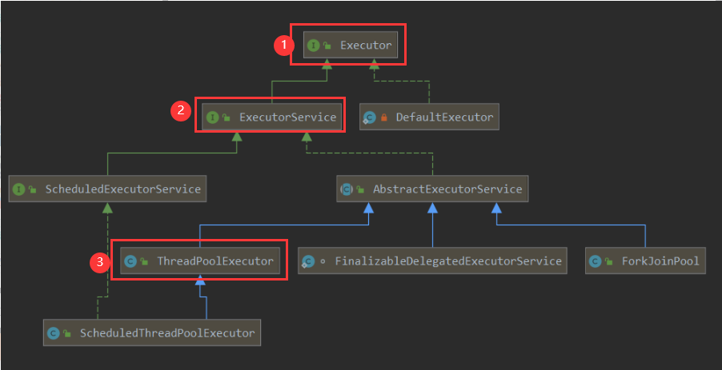
>
> - Executor:运行新任务的简单接口
> - ExecutorService：扩展了Executor，添加了用来管理执行器生命周期和任务生命周期的方法
> - ScheduleExcutorService：扩展了ExecutorService，支持Future和定期执行任务


==方式一：==使用**ExecutorService**的实现类**ThreadPoolExecutor类 ** 去创建一个线程池对象


==方式二：==使用**Executors（线程池的工具类）**调用方法返回不同特点的线程池对象

但是《阿里巴巴 Java 开发手册》中**强制线程池不允许使用 Executors 去创建**，而是通过 ThreadPoolExecutor 的方式，规避资源耗尽的风险。

> Executors 返回线程池对象的弊端如下：
>
> - **FixedThreadPool 和 SingleThreadExecutor** ： 允许请求的队列长度为 Integer.MAX_VALUE ，可能堆积大量的请求，从而导致 OOM。
> - **CachedThreadPool 和 ScheduledThreadPool** ： 允许创建的线程数量为 Integer.MAX_VALUE ，可能会创建大量线程，从而导致 OOM。


## 3.==介绍一下ThreadPoolExecutor类==

**ThreadPoolExecutor构造器的参数说明：7个**

```java
public ThreadPoolExecutor(int corePoolSize,
                          int maximumPoolSize,
                          long keepAliveTime,
                          TimeUnit unit,
                          BlockingQueue<Runnable> workQueue,
                          ThreadFactory threadFactory,
                          RejectedExecutionHandler handler)
```

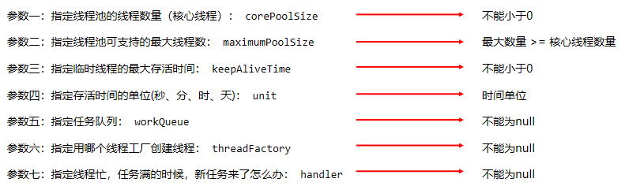

**`ThreadPoolExecutor` 3 个最重要的参数：**

- **`corePoolSize` : 核心线程数** ，核心线程是不会被回收销毁的线程，一来任务就会创建，直到达到最大值。
- **`maximumPoolSize` : 最大线程数** 当任务队列满了，并且核心线程都在忙时，会将可以运行的线程数量变为最大线程数，并且创建临时线程。
- **`workQueue`: 阻塞队列** ，用来存放线程任务。当新任务来的时候会先判断核心线程是否都在忙，如果忙的话，新任务就会被存放在队列中。
- **`handler`：饱和策略** ，核心线程和临时线程都在忙，任务队列也满了，新的任务过来的时候才会开始任务拒绝。
- **`threadFactory`：线程工厂** :executor 创建新线程的时候会用到。
- **`keepAliveTime`：临时线程最大存活时间**，如果临时线程等待 `keepAliveTime`时间后，依然没有运行任务，就会被回收销毁；
- **`unit`：最大存活时间的单位** : `keepAliveTime` 参数的时间单位。


## ==3.ThreadPoolExecutor 如何运行任务对象==

- ==执行Runnable任务对象，用execute（）方法；==
- ==执行Callable 任务，用submit（）方法；==

| ExecutorServic方法名称                      | 说明                                                         |
| ------------------------------------------- | ------------------------------------------------------------ |
| void **execute(Runnable command)**          | 执行任务/命令，没有返回值，一般用来执行 Runnable 任务        |
| ==Future==<T>  **submit(Callable<T> task)** | 执行任务，返回未来任务对象获取线程结果，一般拿来执行 Callable 任务 |
| void **shutdown()**                         | 等任务执行完毕后关闭线程池                                   |
| List<Runnable> **shutdownNow()**            | 立刻关闭，停止正在执行的任务，并返回队列中未执行的任务       |


## ==4. 介绍一下线程池的饱和策略？（实习-阿里）==


**新任务拒绝策略：**

| 策略                                   | 详解                                                         |
| -------------------------------------- | ------------------------------------------------------------ |
| ThreadPoolExecutor.AbortPolicy         | 丢弃任务并抛出RejectedExecutionException异常。**是默认的策略** |
| ThreadPoolExecutor.DiscardPolicy：     | 丢弃任务，但是不抛出异常 这是不推荐的做法                    |
| ThreadPoolExecutor.DiscardOldestPolicy | 抛弃队列中等待最久的任务 然后把当前任务加入队列中            |
| ThreadPoolExecutor.CallerRunsPolicy    | **由主线程负责调用任务的run( )方法从而绕过线程池直接执行**   |

- **`ThreadPoolExecutor.CallerRunsPolicy`：** 调用执行自己的线程运行任务，也就是直接在调用`execute`方法的线程中运行(`run`)被拒绝的任务，如果执行程序已关闭，则会丢弃该任务。因此这种策略会降低对于新任务提交速度，影响程序的整体性能。如果您的应用程序可以承受此延迟并且你要求任何一个任务请求都要被执行的话，你可以选择这个策略。

举个例子：Spring 通过 `ThreadPoolTaskExecutor` 或者我们直接通过 `ThreadPoolExecutor` 的构造函数创建线程池的时候，当我们不指定 `RejectedExecutionHandler` 饱和策略来配置线程池的时候，默认使用的是 `AbortPolicy`。在这种饱和策略下，如果队列满了，`ThreadPoolExecutor` 将抛出 `RejectedExecutionException` 异常来拒绝新来的任务 ，这代表你将丢失对这个任务的处理。如果不想丢弃任务的话，可以使用`CallerRunsPolicy`。`CallerRunsPolicy` 和其他的几个策略不同，它既不会抛弃任务，也不会抛出异常，而是将任务回退给调用者，使用调用者的线程来执行任务


## ==4-1. 线程池常用的阻塞队列有哪些？（实习-蚂蚁）==


Java线程池一般会使用阻塞队列来存储等待执行的任务，常见的阻塞队列有以下几种：

1. **ArrayBlockingQueue：**一个由数组支持的**有界阻塞队列**。创建时必须指定容量。当队列已满时，插入操作会被阻塞，直到队列出现空间。

2. **LinkedBlockingQueue：**一个由链表支持的可选**有界阻塞队列**。如果创建时指定容量，它是有界队列。当队列已满时，插入操作会被阻塞，直到队列出现空间。

3. **SynchronousQueue：**一个**没有容量的阻塞队列**。每一个插入操作必须等待另一个线程的移除操作，反之亦然。同步队列类似于传球手与接球手之间的配合，一旦传球手把球传给接球手，就必须等待接球手接住再继续传球。

4. **PriorityBlockingQueue：**一个**支持优先级排序的无界阻塞队列**。默认情况下元素采用自然顺序升序排列，可以自定义排序规则。

在实际使用中，也可以根据需要自定义阻塞队列。


## ==5.执行execute()方法和submit()方法的区别是什么呢？==

- execute()方法用于**执行无返回值**的Runnable任务，所以无法判断任务是否被线程池执行成功与否;

- submit()方法用于**执行需要返回值**的Callable任务。线程池会返回一个future类型的对象，通过这个future对象可以判断任务是否执行成功，并且get()方法来获取返回值


## 6.线程池执行任务的流程?


## 7.什么是AQS？

AQS 的全称为 `AbstractQueuedSynchronizer` ，翻译过来的意思就是**抽象队列同步器**。AQS 就是一个抽象类，**主要用来构建锁和同步器。**

AQS 为构建锁和同步器提供了一些通用功能的实现，因此，使用 AQS 能简单且高效地构造出应用广泛的大量的同步器，比如我们提到的 `ReentrantLock`，`Semaphore`，其他的诸如 `ReentrantReadWriteLock`，`SynchronousQueue`等等皆是基于 AQS 的。


## 8.AQS的原理是什么？

AQS 核心思想是，如果被请求的共享资源空闲，则将当前请求资源的线程设置为有效的工作线程，并且将共享资源设置为锁定状态。如果被请求的共享资源被占用，那么就需要一套线程阻塞等待以及被唤醒时锁分配的机制，这个机制， AQS 是用 **CLH 队列锁** 实现的，即将暂时获取不到锁的线程加入到队列中。

**CLH(Craig,Landin,and Hagersten)** 队列是一个虚拟的双向队列（虚拟的双向队列即不存在队列实例，仅存在结点之间的关联关系）。AQS 是将每条请求共享资源的线程封装成一个 CLH 锁队列的一个结点（Node）来实现锁的分配。在 CLH 同步队列中，**一个节点表示一个线程，**它保存着线程的引用（thread）、 当前节点在队列中的状态（waitStatus）、前驱节点（prev）、后继节点（next）。


## ==9.介绍一下Atomic原子类==

Atomic是指一个操作是不可中断的。即使是==在多个线程一起执行的时候，一个操作一旦开始，就不会被其他线程干扰。==

所以，所谓原子类说简单点就是具有原子/原子操作特征的类。

CAS里面可以通过**AtomicStampedReference类**解决ABA问题。== 》 Pair内部类==》volatile 关键字 ==》stamp-版本号，每次CAS方式修改会更新

CAS解决实现多个变量的原子性。  将多个变量封装成对象，通过AtomicReference对象来保证原子性。


## 网络编程

**什么是网络编程？**

- 网络编程可以让程序与网络上的其他设备中的程序进行数据交互。

**网络通信基本模式**

- 常见的通信模式有如下2种形式：Client-Server(CS) 、 Browser/Server(BS)

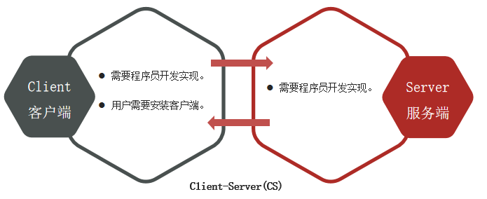

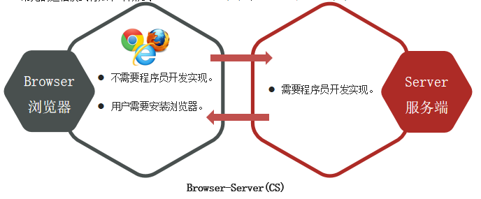

**网络编程学习要点：**

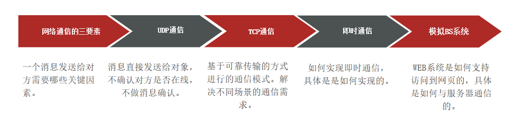

#### 三要素

**IP地址：**设备在网络中的地址，是唯一的标识。

**端口：**应用程序在设备中唯一的标识。

**协议:**   数据在网络中传输的规则，常见的协议有UDP协议和TCP协议

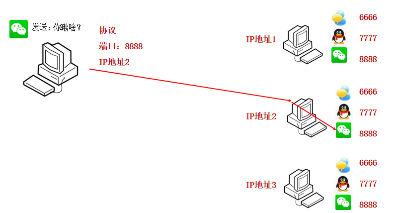

#### IP地址

IP（Internet Protocol）：全称”互联网协议地址”，是分配给上网设备的唯一标志。

常见的IP分类为：IPv4和IPv6

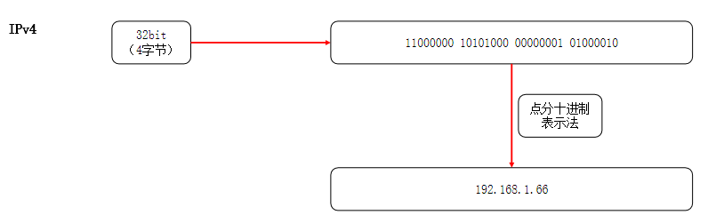

 **IPv6：**128位（16个字节），号称可以为地球每一粒沙子编号。

 **IPv6**分成8个整数，每个整数用四个十六进制位表示， 数之间用冒号（：）分开


**IP地址基本寻路：**

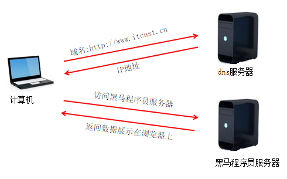

**IP地址形式：**

- 公网地址、和私有地址(局域网使用)。
- 192.168. 开头的就是常见的局域网地址，范围即为192.168.0.0--192.168.255.255，专门为组织机构内部使用。

**IP常用命令：**

- ipconfig：查看本机IP地址
- ping IP地址：检查网络是否连通

**特殊IP地址：**

- 本机IP: 127.0.0.1或者localhost：称为回送地址也可称本地回环地址，只会寻找当前所在本

  

#### 端口号

**端口号：**准确标识出正在计算机设备上运行的进程（程序），规定为一个 16 位的二进制，范围是 0~65535。

**端口类型：**

- 周知端口：0~1023，被预先定义的知名应用占用（如：HTTP占用 80，FTP占用21） 
- **注册端口：**1024~49151，分配给用户进程或某些应用程序。（如：Tomcat占 用8080，MySQL占用3306）
- 动态端口：49152到65535，之所以称为动态端口，是因为它 一般不固定分配某种进程，而是动态分配。


#### 协议

连接和通信数据的规则被称为网络通信协议

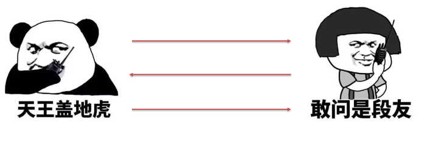

**网络通信协议有两套参考模型**

OSI参考模型：世界互联协议标准，全球通信规范，由于此模型过于理想化，未能在因特网上进行广泛推广。 

TCP/IP参考模型(或TCP/IP协议)：事实上的国际标准。

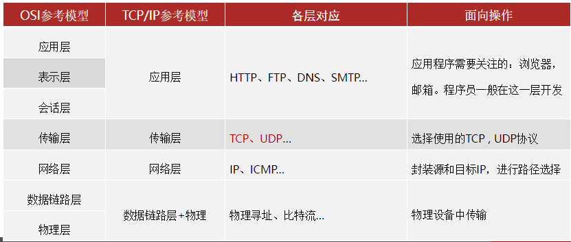

**传输层的2个常见协议：**

- TCP(Transmission Control Protocol) ：传输控制协议
- UDP(User Datagram Protocol)：用户数据报协议


# 四、JVM

## 1.什么是JVM

JVM 是 Java Virtual Machine 的缩写，即==Java虚拟机，类似于一台小电脑运行在windows或者linux这些操作系统下，用来运行我们的Java编译程序，它直接和操作系统进行交互，==与硬件不直接交互，而操作系统可以帮我们完成和硬件进行交互的工作。

就是一个进程

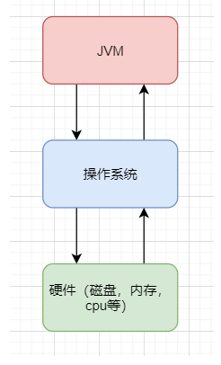

## 2.==什么是JVM整体结构?==


JVM主要由三个主要的子系统构成：**类加载子系统，运行时数据区（内存结构），执行引擎。**

- （运行时数据区）虚拟机内存结构 分为5大区域，**方法区、Java方法栈（虚拟机栈）、本地方法栈、堆、程序计数器**；，其中蓝色部分==方法区和堆是线程共享的==，绿色部分==Java方法栈、本地方法栈、程序计数器是线程私有的==
- 执行引擎包括三个部分：**解释器、JIT编译器、垃圾回收器**


## 3.==一个Java文件是如何被运行的？==

先将java文件编译为class文件，再利用==类加载器==将class文件加载到方法区中，然后由==解析器==逐行执行字节码，每执行一个Java方法，就将方法存入==虚拟机栈==，每执行一个本地方法，也就是native方法，就将方法存入==本地方法栈==中，方法执行完后就从栈中移除，==程序计数器==用来记录待执行的下一条字节码指令地址，方法执行过程中产生的==Java对象会存入堆中==，垃圾回收器会回收已经没有被使用的Java对象，==JIT编译器==会在程序运行过程中发现热点代码，并编译为机器指令，从而提高执行效率。

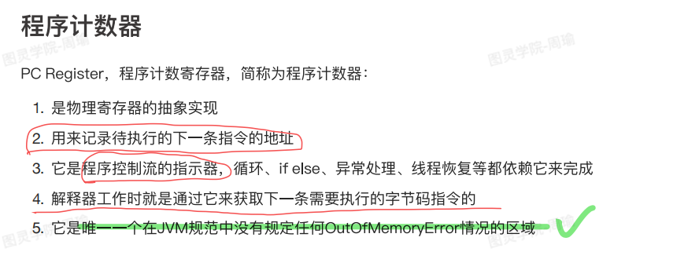


## ==4.什么是类加载？类加载的过程？（实习-美团）==

**类加载： **就是通过**类加载子系统 ** 将字节码（class文件）加载到JVM的方法区中，类似于一个搬运工，把所有的 **.class** 文件全部搬进JVM里面来。

**类加载的过程：**

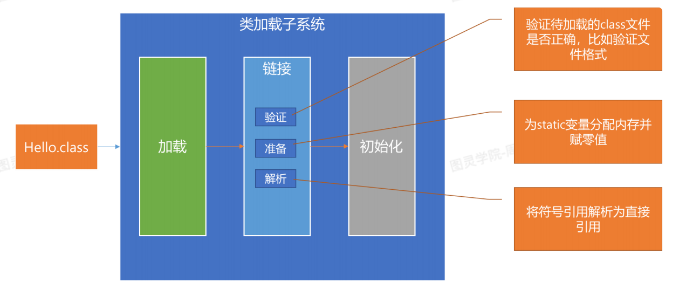

类加载过程包括三个过程：**加载-->链接-->初始化**，连接过程又可分为三步：**验证--->准备--->解析**。

- **验证阶段**  会验证待加载的class文件是否正确，比如验证文件格式
- **准备阶段**  会为==static变量分配内存并赋零值==

- **解析阶段**  会将==符号引用解析为直接引用==，在一个字节码文件中，会用到其他类，而在字节码中只会存用到的类的类名，而解析阶段就是会==根据类名找到该类加载后在方法区中的地址，也就是直接引用，并替换调符号引用==，这样真正运行字节码时，就能直接找到某个类了。

- **初始化阶段**  会给==static变量赋值，并执行static代码块==


## 5.什么是类加载器，常见的类加载器有哪些?

==类加载器就是一个类加载子系统，负责加载字节码到JVM的方法区中。上面第四点只是一个理论，这是具体实现方式==

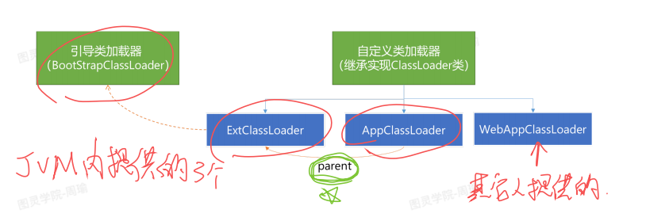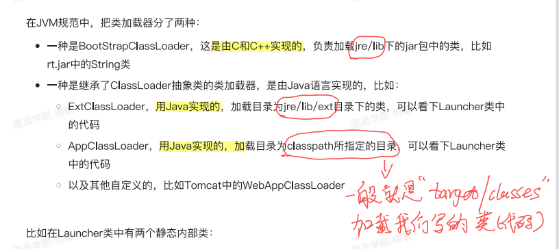

- 引导类加载器（BootStrapClassLoader): 用来==加载java核心类库在jre/lib目录，如String类==，无法被java程序直接引用；
- 扩展类加载器（Ext ClassLoader):用来 ==加载java的扩展库==，java的虚拟机实现会提供一个扩展库目录，该类加载器在扩展库目录里面查找并加载java类:
- 系统类加载器(AppClassLoader): ==它根据 java的类路径来加载类，一般来说，java应用的类都是通过它来加载的:==
- ==自定义类加载器:== 由java语言实现，继承自ClassLoader:


## 6.什么是双亲委派？为什么需要双亲委派？

当一个==类加载器==收到一个==类加载的请求==，他首先不会尝试自己去加载，而是将这个请求==委派给父类加载器去加载==，只有父类加载器==在自己的搜索范围类查找不到给类时==，子加载器才会尝试自己去加载该类：


拿加载我们自己写的JAVA应用类来说：==即AppClassLoader加载应用类==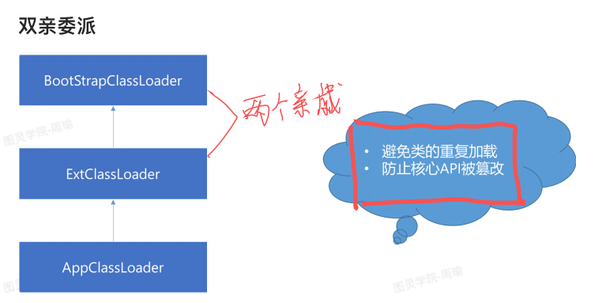

**如图，在我们LoadClass加载类方法的源码里面：**首席按检查这个类是否被加载了，然后类的parent属性有值，则委托给parent去加载，否则委托给bootstrapClassLoader加载，如果上面都没有加载到，则自己加载。

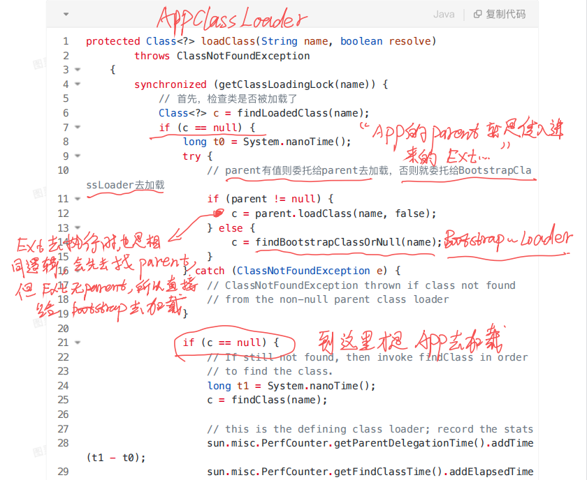

这段代码就体现了双亲委派，AppClassLoader有一个**parent属性指向了ExtClassLoader**。

当我们用AppClassLoader去加载一个类时，会**先委托给其父类ExtClassLoader去加载**，而**ExtClassLoader没有parent属性，所以会委派BootstrapClassLoader去加载**，==只有BootstrapClassLoader没有加载到，才会由ExtClassLoader去加载，也只有ExtClassLoader没有加载到,才会由AppClassLoader来加载，这就是双亲委派。==


**双亲委派的作用:**

- ==避免类的重复加载==，如果一个类被BootStrapClassLoader加载过了，那么AppClassLoader就不会再重复加载到这个类了。

- ==防止核心API被篡改==，例如我们自定义一个`java.lang.String`类，想要去替换掉JDK内的String类（包名、类名全部一样），但是我们是不到这个类的，因为根据**双亲委派**，BootStrapClassLoader已经加载过了rt.jar中的java.lang.String类，不会再重复加载了。

  很好的防止黑客利用这个，替换原始String类读取信息。

  

## 7.列举一些你知道的打破双亲委派机制的例子，为什么要打破?

如Tomcat自定义的类加载器——**WebappClassLoader**。作用就是为了进行==类加载的隔离==。

==因为Tomcat通常会部署多个应用，不同应用中可能会出现相同的类路径相同的类名嘛，此时用`AppClassLoader`去加载的话，就会出现加载了A应用的后，就不会去加B应用的这个类了，因为加载名字都是一样的。所以说Tomcat打破了双亲委派，自定义了一个类加载器——`WebappClassLoader`，他会在每个应用中建立一个类加载器实例对象，实现类加载的隔离。==

**PS：JVM中判断一个类是不是已经被加载的逻辑是:类名+对应的类加载器实例**

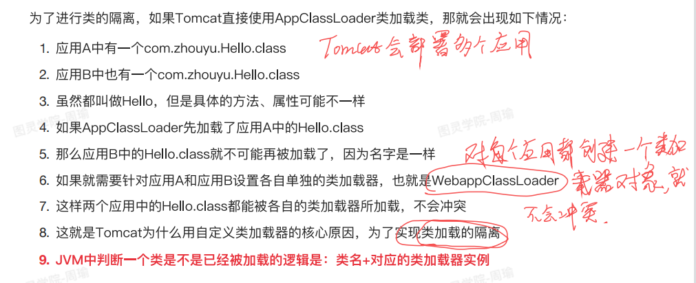


## ==8.什么是JVM的内存结构？==


内存结构，也就是**运行时数据区。**

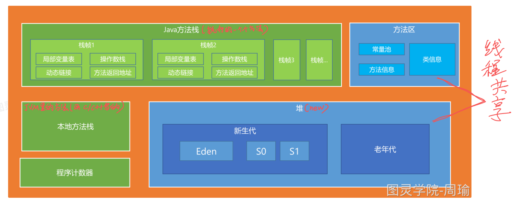

- （运行时数据区）虚拟机内存结构 分为5大区域，**方法区、虚拟机栈、本地方法栈、堆、程序计数器**；
- 其中蓝色部分==方法区和堆是线程共享的==，绿色部分==Java方法栈、本地方法栈、程序计数器是线程私有的==


**5、方法区（说一说永久代）**

-  JDK8：采用元空间实现，存放在本地内存中，存放已被加载的==类信息、方法信息、运行时常量池==。
- **字符串常量池、静态变量 **这两个部分在堆里面。
- 之前方法区逻辑上位于JVM的堆区，但又被称为非堆内存——被称为永久代；在JDK8中被元空间取代。


**1、程序计数器：唯一一个无OOM**主要用来记录待执行的下一条指令的地址，解释器工作的依靠他

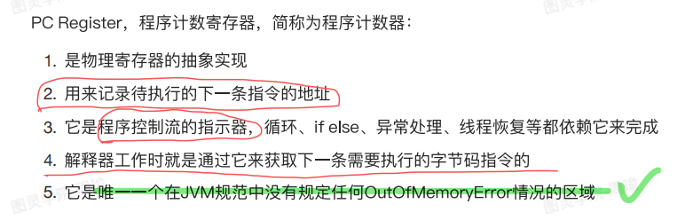


**2、虚拟机栈：**也叫Java栈、Java方法栈

==每个线程在创建时，都会创建一个虚拟机栈，每个方法执行时都会产生一个栈帧，存入到虚拟机栈中。==  然后 、每个栈帧内部又有**局部变量表、操作数栈、方法返回地址、动态链接**等

**虚拟机栈的特点：**

1. 虚拟机栈是线程私有的

2. 一个方法开始执行栈帧入栈、方法执行完对应的栈帧就出栈，所以虚拟机栈不需要进行垃圾回收

3. 虚拟机栈存在==OutOfMemoryError==、以及==StackOverflowError==（SOF）

4. ==线程太多==，就可能会出现OutOfMemoryError，即线程创建时没有足够的内存去创建虚拟机栈了

5. ==方法调用层次太多，栈帧太多了，超出了栈的容量==,就可能会出现StackOverflowError

6. 可以通过-Xss来设置虚拟机栈的大小

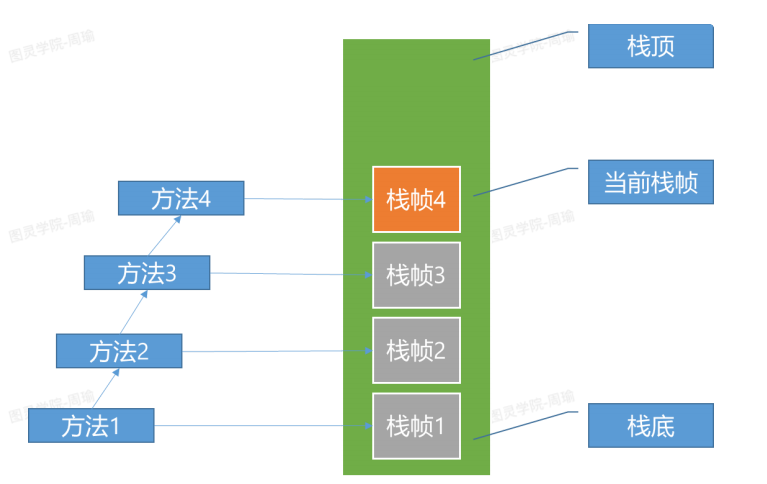

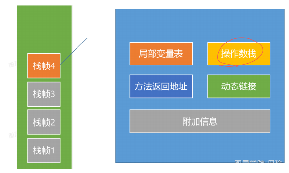

**3、本地方法栈**

- 线程调用本地方法时，存入的栈帧的地方
- ==本地方法: native method，JVM里的一些方法，由C/C++实现.==
- 也是==线程私有的，也可能会出现OOM和SOF==

**4、堆**

- 堆是所有线程共享的一块内存，几乎所有==对象和数组==都要在堆上分配内存，经常发生垃圾回收；

> 堆是JVM中最重要的一块区域，JVM规范中规定所有的对象和数组都应该存放在堆中，在执行字节码指令时，会把创建的对象存入堆中，对象对应的引用地址存入虚拟机栈中的栈帧中，不过当方法执行完之后，刚刚所创建的对象==并不会立马被回收，而是要等JVM后台执行GC后，对象才会被回收。==


## ==8-1.说一说永久代，元空间？==

首先：永久代和元空间是方法区的一个具体实现，类似于接口和实现类的关系，永久代是 JDK 1.8 之前的方法区实现，JDK 1.8 及以后方法区的实现变成了元空间。永久代以及元空间是 HotSpot 虚拟机对虚拟机规范中方法区的两种实现方式。


**方法区会存储 **已被虚拟机加载的 ==类信息、方法信息、运行时常量池、JIT代码缓存等数据。==

**JDK 1.7** ：**永久代**在逻辑上位于JVM的堆区，但又被称为非堆内存，在JDK8中被元空间取代


**JDK 1.8 之后** ：取代方法区，使用元空间，放在本地内存中实现，==我们后面学习到的都是JDK8的版本==


**为什么要将永久代 (PermGen) 替换为元空间 (MetaSpace) 呢?**

> 下图来自《深入理解 Java 虚拟机》第 3 版 2.2.5
>
> 


整个永久代有一个 JVM 本身设置的固定大小上限，无法进行调整，而元空间使用的是本地内存，受本机可用内存的限制，虽然元空间仍旧可能溢出，但是比原来出现的几率会更小。


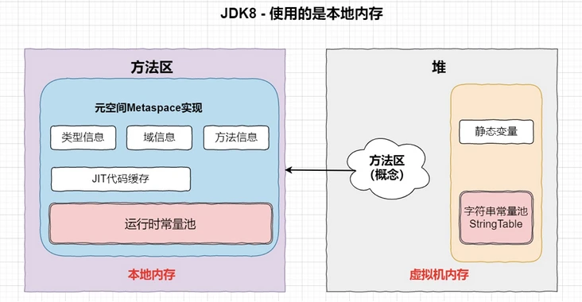


## 9.详细说一下JVM里面的堆结构？

堆是JVM中最重要的一块区域，JVM规范中规定所有的对象和数组都应该存放在堆中，在执行字节码指令时，会把创建的对象存入堆中，对象对应的引用地址存入虚拟机栈中的栈帧中，不过当方法执行完之后，创建的对象==并不会立马被回收，而是要等JVM后台执行GC后，对象才会被回收。==

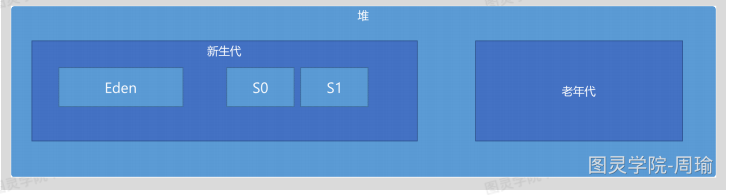

堆中划分了两大区域：**新生代和老年代**（默认比例为1：2）

> 可以通过 **-XX:NewRatio** 参数来配置新生代和老年代的比例，默认为2，表示新生代占1，老年代占2，也就是新生代占堆区总大小的1/3。一般是不需要调整的，只有明确知道存活时间比较长的对象偏多，那么就需要调大NewRatio，从而调整老年代的占比。

新生代又划分为：**Eden、S0、S1**（默认大小为8：1：1）（也可以调整）

- Eden：**伊甸园区，一般新对象都会先放到Eden区 ** (除非对象的大小都超过了Eden区，那么就只能直接进老年代)
- S0、S1：Survivor0、Survivor1区，也可以叫做from区、to区，**用来存放MinorGC (YGC)后存在的对象**

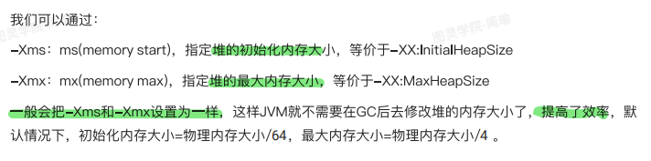


## 10.说一下对象在JVM 堆的流转过程？

1、**新对象**在Eden区

2、**Eden区如果满**了，就会进行YGC（Young GC）

3、YGC会对Eden区、S0、S1区都进行垃圾回收，先找到垃圾对象，然后马上清理

4、将Eden区剩余存活对象转移到S0区，表示存活对象，并且记录一下这些对象经历的YGC次数；

5、**后续Eden又满了**，就会再次进行YGC垃圾回收

6、同样对Eden、S0、S1区进行垃圾回收，进行清理Eden区，再对S0区进行清理；

7、然后把S0的剩余存活对象转到S1区，并且记录他们经历了2次GC，把Eden区的转到S1区，记录这些对象经历了一次YGC；

**后续只要Eden区满了就会进行YGC**，就会导致SO和S1区中的对象不断横跳，每跳一次就会加1,最高到15。
		**如果已经15了，**此时再来进行YGC,那么这些对象就会进入老年代，表示这些对象是比较难回收的，可能需要长期使用。

**特殊情况一：直接到老年区**

​	==如果YGC后，Eden区有存活对象，需要保存到SO区，但是**SO剩余的空间**不够，那么这个对象会直接放到老年代。==

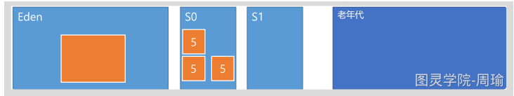

**特殊情况二：直接到老年区**

​	==如果有一个**超大对象，比Eden区的范围都要大**，会直接放到老年代，如果老年代放不下，则会进行和FGC，FGC后 如果老年代还放不下就会报  **OOM**==

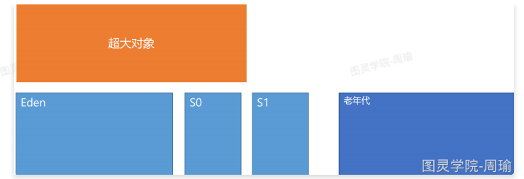


**图示解释：**

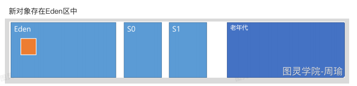

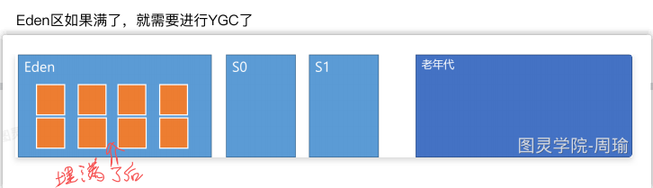

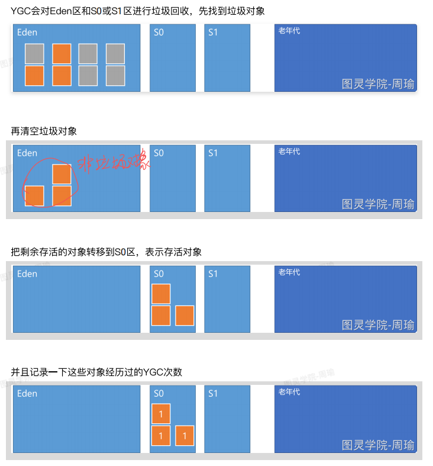

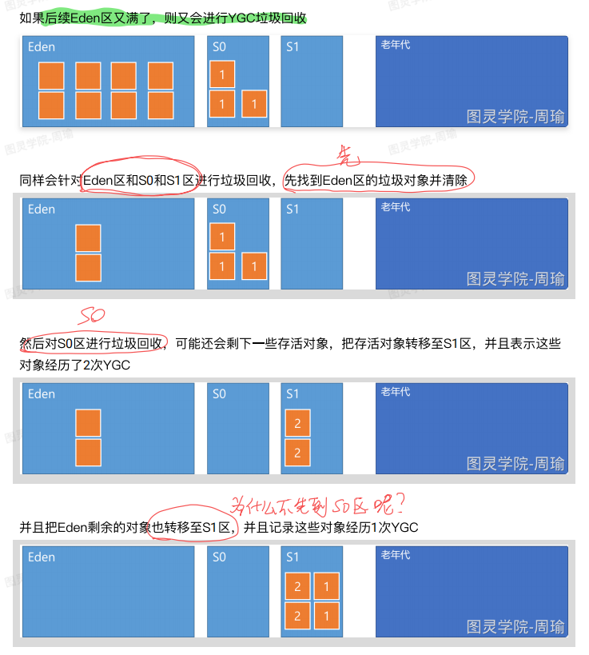

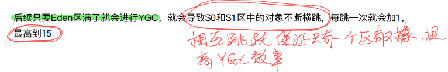

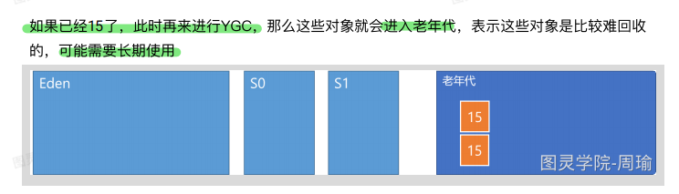


## 11.有哪几种GC？什么时候会触发


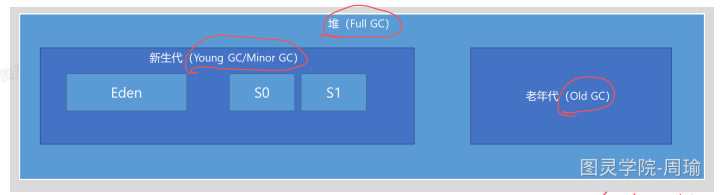

- **Young GC / Minor GC**：负责对**新生代**进行垃圾回收
- **Old GC / Major GC**：负责对**老年代**进行垃圾回收，目前==只有CMS垃圾收集器会单独==对老年代进行垃圾收集，其他垃圾收集器基本都是==整堆回收的时候==对老年代进行垃圾收集
-  **Full GC**：**整堆回收**，也会堆方法区进行垃圾收集

**Eden区满了之后，就会进行YGC**，YGC会STW (Stop The World) ，会占停用户线程，YGC执行的频率一般会比较高，但是执行的速度会比较块。

**老年代满了，就会触发Full GC，**一般会在Full GC之前先进行一次YGC，Full GC也会STW，并且速度比较慢，所以要==尽可能的避免Full GC==，如果Full GC后，内存还是不足，那么就会报==OOM了。==


## 12.JVM如何寻找确定垃圾对象


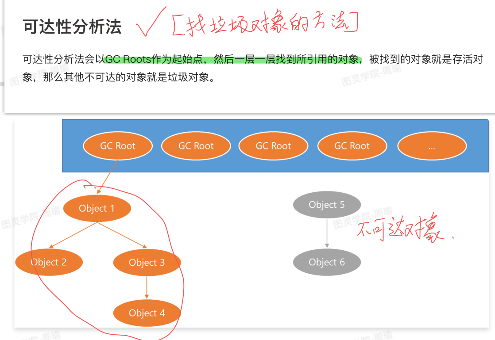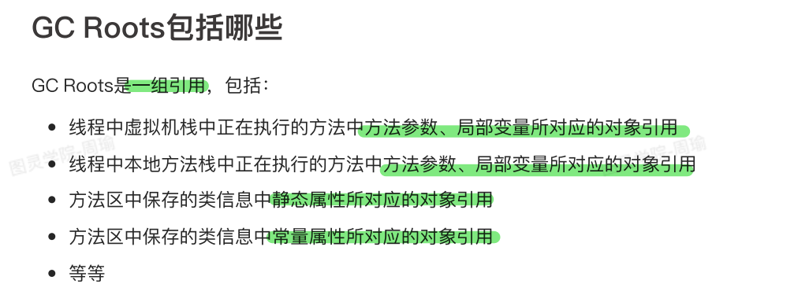

## 12.Java中垃圾回收算法有哪些？


**1、标记-清除算法（速度中等、有碎片、无额外空间）**

一种非常基础和常用的垃圾回收算法，针对某块内存空间，比如新生代、老年代，如果可用内存不足后，就会STW，暂定用户线程的执行，然后执行算法进行垃圾回收:

1. 标记阶段︰从GC Roots开始遍历，找到可达对象，==并在对象头中进行记录==

2. 清除阶段︰堆内存空间进行线性遍历，如果发现对象头中没有记录是可达对象，则回收它

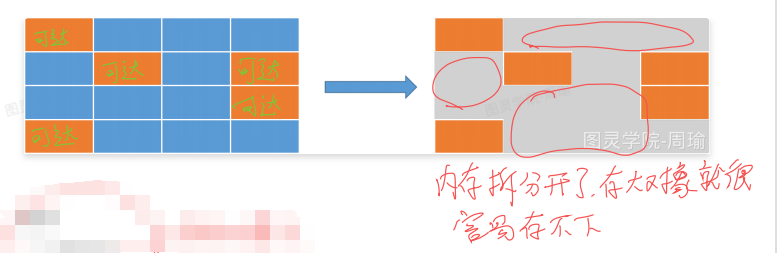

**缺点：**

​		1、效率不高，需要修改对象头；

​		2、出现内存碎片

**优点：**思路简单（哈哈哈这算不算优点啊）


**2、复制算法（最快、无碎片、有额外空间）**

==将内存空间分为两块，每次只使用一块，在进行垃圾回收时，将可达对象复制到另外没有被使用的内存块中，然后再清除当前内存块中的所有对象，后续再按同样的流程进行垃圾回收，交换着来。==

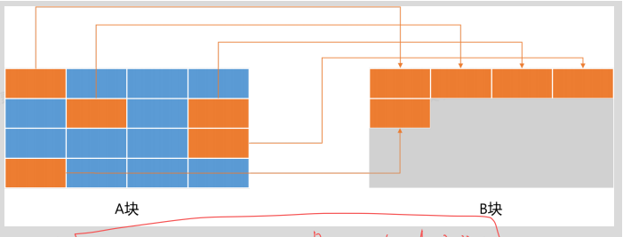

**优点：**（刚好解决了标记-清除法的缺点）

​	1、==不需要修改对象头，效率高==（没有标记和清除阶段，直接复制，）

​	2、==不会出现内存碎片==

**缺点：**

​	1、==需要更多的内存==，始终有一半的内存空闲

​	2、==需要额外的时间修改栈帧中记录的引用地址==（因为对象移动后，对象存放的内存地址发生了变化)

**如果可达对象比较多，垃圾对象比较少，那么复制算法的效率就会比较低，所以垃圾对象多的情况下，复制算法比较适合。**


**3、标记整理算法（最慢、无碎片、无额外空间）**

- 第一阶段和标记-清除算法一样，从GC Roots找到并标记可达对象
- 第二阶段将**所有存活对象移动到内存的一端**
- 最后清理边界外所有的空间

标记-整理算法相当于标记-清除算法执行完一次之后**再进行一次内存整理。**

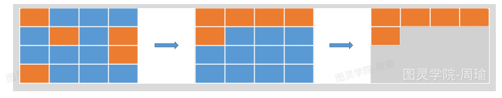

**优点：**

​	1、无内存碎片

​	2、不需要利用额外的内存空间

**缺点︰**

​	1、效率最低，要低于前两种算法，因为多走了一步

​	2、也需要额外的时间修改栈帧中记录的引用地址


**总结：**

- 复制算法适用于==垃圾对象多（新生代）==的情况，因为复制过去的少。
- 标记-清除或标记-整理算法使用于==垃圾对象少的情况（老年代）；==


**4、分代收集算法**

不同对象的存活时长是不一样的，也就可以针对不同的对象采取不同的垃圾回收算法。

==默认几乎所有的垃圾收集器都是采用**分代收集算法进行垃圾回收**的。==

**我们会把堆分为新生代和老年代：**

- **新生代中**的对象存活时间比较短，那么就可以利用**复制算法**，它适合垃圾对象比较多的情况。
- **老年代中**的对象存活时间比较长，所以不太适合用复制算法，可以用**标记-清除或标记-整理算法**比如
  - CMS垃圾收集器采用的就是标记-清除算法
  - Serial Old垃圾收集器采用的就是标记-整理算法


## 13.有哪几种垃圾回收器？各自优缺点是什么？

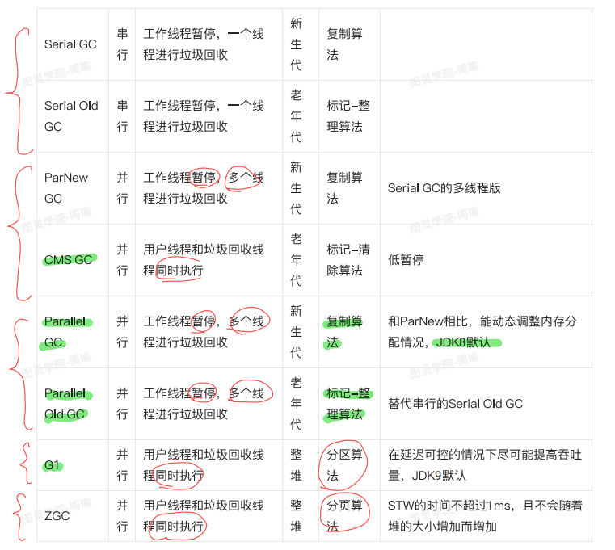

==主要掌握Parallel GC、CMS垃圾回收器和G1回收器==

Parallel GC垃圾回收器**（JDK8默认）**

​		进行一次SWT，然后多个线程进行垃圾回收，采用复制算法。

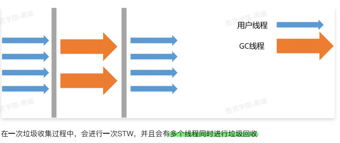

CMS垃圾回收器：**（Concurrent Mark Sweep）**

- **针对老年代**，一种以获得最短STW停顿时间为目标的并发收集器，用户线程和垃圾回收线程同时进行。**它非常符合在注重用户体验的应用上使用。**采用标记-清除算法。
- 缺点在于：可能出现并发失败(Concurrent Mode Failure) 、无法处理浮动垃圾、有内存碎片。

G1垃圾回收器：**（JDK9默认）**

- **针对整堆，**G1 (Garbage-First) 是一款面向服务器的并发垃圾收集器, 主要针对配备多颗处理器及大容量内存的机器，以极高概率满足STW 停顿时间要求的同时,还具备高吞吐量性能特征.

- G1从整体来看是基于**标记-整理算法**实现的回收器，但从局部（(两个Region之间)上看又是基于**标记-复制算法**实现的。（也可以叫**分区算法**）

  


## 14.详细说一下CMS的回收过程，CMS的问题是什么？

**CMS**：三标一清除。2个STW。无可控参数。

> **针对老年代**，一种以获得最短STW停顿时间为目标的并发收集器，用户线程和垃圾回收线程同时进行。**它非常符合在注重用户体验的应用上使用。**采用标记-清除算法。

- 回收过程包括四步：**初始标记 --->并发标记- ->  重新标记 --> 并发清除**
  - 初始标记：进行一次STW，但只标记GC Root的下一级，所以这个过程很快；
  - 并发标记：无STW，并发执行，从上一步的标记对象，开始遍历整个老年代标记出所有可达对象，耗时较长，；
  - 重新标记：进行一次STW，但时间微长，主要上一次标记的对象进行修正，因为上一阶段用户线程也在工作，可能会产生新垃圾；
  - 并发清除：无STW，就是清除垃圾对象

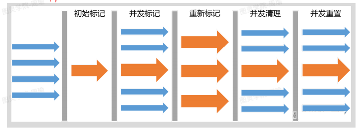

> 虽然CMS整个垃圾收集过程更长了，但是STW的时间变短了，而且==在垃圾收集过程中大部时间用户线程也还在执行，所以用户体验更好了，但是吞吐量更低了==，因为单位时间内执行用户线程更少了 

**问题总结：**

- **1、并发失败(Concurrent Mode Failure) :**

​		在==并发标记、并发清理过程==中，由于用户线程同时在执行，如果有新对象要进入老年代，但是空间又不够的情况，那么就会导致**“concurrent mode failure”**、此时就会利用**Serial Old**来做一次垃圾收集，做一次长时间全局的STW，单线程回收垃圾（这样一来停顿的时间就比较长了）

- **2、浮动垃圾**

​		在==并发清理==过程中，可能产生新的垃圾——“浮动垃圾”，只能等到下一次GC时来清理。

- **3、内存碎片**

由于采用的时**标记-清除，所以会产生内存碎片，**但可以控制CMS在做完之后进行一次整理

> 可以通过参数-XX:+UseCMSCompactAtFullCollection可以让JVM在执行完标记-清除后再做一次整理，也可以通过-XX:CMSFulIlGCsBeforeCompaction来指定多少次GC后来做整理，默认是0，表示每次GC后都整理。


## 15. 详细说一下G1的回收过程？

**G1 (Garbage-First)**：三标一回收。3个STW。一个可控参数

> ​	**针对整堆，**G1 是一款面向服务器的并发垃圾收集器, 主要针对配备多颗处理器及大容量内存的机器，以极高概率满足 GC 停顿时间要求的同时，还具备高吞吐量性能特征，平衡用户体验和吞吐量。
>
> G1从整体来看是基于**标记-整理算法**实现的回收器，但从局部（(两个Region之间)上看又是基于**标记-复制算法**实现的。也叫**分区算法**

- 回收过程包括四步：**初始标记 --> 并发标记 --> 最终标记 --> 筛选回收**

  - 初始标记：同CMS一样，进行一次STW，但只标记GC Root的下一级，所以这个过程很快；

  - 并发标记：同CMS一样，从上一步的标记对象，开始遍历整个老年代标记出所有可达对象，耗时较长，但无STW；

  - 最终标记：同CMS一样，进行一次STW，但时间不是很长，主要上一次标记的对象进行修正，因为上一阶段用户线程也在工作，可能会产生新垃圾；

  - ==筛选回收：有STW， 但可通过参数人为控制STW的停顿时间，这是G1最大的优势，提高程序的可控性。并且采用复制算法，无内存碎片==  (会把某个region里的垃圾对象复制到另外空闲region区域，如相邻的）

    除此以外，由于G1可能无法收掉所有的垃圾，所以G1 收集器在后台维护了一个优先列表，每次根据允许的收集时间，优先选择回收价值最大的 Region，在有限时间内获取尽可能高的回收效率（这也就是它的名字 Garbage-First 的由来) 。

  

- **G1的堆内存分布：**

​		G1将堆内存会分为2048个region，每一个方块叫做 **region**，依然分了Eden区、S0区、S1区、老年代，只不过**空间是不连续的**了，**还加了一个Humongous区**是专门用来存放大对象的( 如果一个对象大小超过了一个region的**50%**，那么就是大对象)。

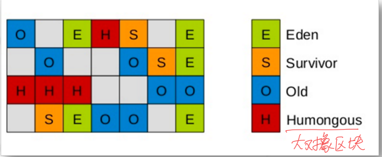


## 16.说一下G1是如何进行整堆回收的？


G1是争对整个堆内存进行回收的，包括了新生代和老年代，采用的是分代收集算法。==一个可控参数==

这里出现了另外一种GC方式——**MixedGC**，之前只有**YGC（MinorGC）**、**OldGC（MajorGC）**和**FullGC**。

- **YoungGC：**==Eden区满了时==，会触发G1的YGC；
- **MixedGC：**==老年代的占用率达到了G1参数指定的百分比时==，回收==所有的新生代==以及==部分老年代==，以及==大对象区==。（-XX:InitiatingHeapOccupancyPercent）；
- **FullGC：**在进行MixedGC过程中，采用的复制算法，如果复制过程中内存不够，则会触发FullGC，进行一次全局STW，并采用**单线程的标记-整理算法**进行GC，相当于用一次Serial GC


## 17.什么时候会发生栈内存溢出？

栈内存溢出：StackOverflowError

每个线程在创建时，都会创建一个虚拟机栈，每个方法执行时都会产生一个栈帧，存入到虚拟机栈中。当线程调用的方法层数太多时，就会发现栈内存溢出，通常发生在递归调用过程。


## ==18.谈谈对OOM的认识?如何排查OOM的问题?==

OOM，全称“Out Of Memory（内存溢出，内存不足）”，来源于java.lang.OutOfMemoryError。当JVM因为没有足够的内存来为对象分配空间并且垃圾回收器也已经没有空间可回收时，就会抛出这个error。

除了**程序计数器**，JVM的其他内存区域都有OOM的风险。

- **虚拟机栈**存在==OutOfMemoryError==和==StackOverflowError==
  - ==线程太多==，就可能会出现 OutOfMemoryError，即线程创建时**没有足够的内存去创建虚拟机栈了**
  - ==方法调用层次太多==,就可能会出现 StackOverflowError

- **本地方法栈**，同虚拟机栈类似，会出现==OutOfMemoryError==和==StackOverflowError==

- **堆OOM，**垃圾对象过多时就容易出现OOM。

- ==方法区OOM==（阿里）

  当应用程序动态加载大量的类，或者使用反射机制频繁创建新类时，方法区会不断增加，最终导致OOM。

  当应用程序频繁使用反射来创建新类实例时，每次创建都会涉及类的加载、链接和初始化等过程，这些类信息将会存储在方法区中。如果大量的新类不断被动态创建，方法区会不断增加，最终可能导致方法区内存溢出（OOM）。

  当使用反射机制时，我们可以在程序运行时动态生成新的类。这些类在编译阶段并不存在，而是在程序运行过程中通过反射动态创建的。以下是一个例子：

  假设我们有一个名为`Animal`的接口，并且我们想要在运行时创建不同的实现类。通常情况下，在编译阶段，我们会定义类如`Dog`、`Cat`、`Bird`等来实现`Animal`接口。

  然而，使用反射，我们可以在运行时动态生成新的类，而无需在源代码中定义它们。

  

排查OOM的方法:

- 相关JVM参数：-Xms、-Xmx。

- **需要先设置JVM参数，当发生OOM的时候自动生成dump出堆的信息:**

  **两个参数** -开启堆快照： -XX: +HeapDumpOnOutOfMemoryError。OOM时日志记录文件位置： -XX:HeapDumpPath=/user/local/error.hprof

- 同时**jstat命令查看监控JVM的内存和GC情况，先观察问题大概出在什么区域;**

- 使用**MAT工具载入到dump文件，分析大对象的占用情况**，比如 HashMap做缓存未清理，时间长了就会内存溢出，可以把改为弱引用。


## 19.如何判断一个对象是否存活?

> 或者问：JVM如何判断垃圾对象？

判断一个对象是否存活，分为两种算法，1：引用计数法；2：可达性分析法。

**1、引用计数法**

每个对象都保存一个==引用计数器属性==，用户记录对象被引用的次数。

- 优点∶实现简单，计数器为0则表示是垃圾对象·

- 缺点∶
  - 需要额外的空间来存储引用计数。
  - 以及需要额外的时间来维护引用计数
  - ==还有一个严重问题，无法处理循环引用的问题==

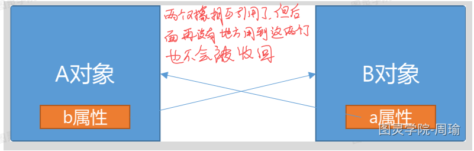


**2、可达性分析法**

可达性分析法会==以GC Roots作为起始点，然后一层一层找到所引用的对象==，被找到的对象就是存活对象，那么其他不可达的对象就是垃圾对象。

GC Roots就是一组引用：

- 虚拟机栈中引用的对象
- 本地方法栈中引用的对象
- 方法区类**静态属性引用的变量**
- 方法区**常量池引用的对象**

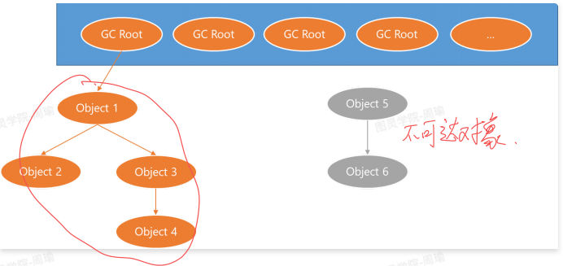


## 19.强引用、软引用、弱引用、虚引用是什么，有什么区别?

- 强引用，就是**普通的对象引用关系**，如String s = new String("ConstXiong")
- 软引用，用于维护一些**可有可无**的对象。**只有在内存不足时，系统则会回收软引用对象**，如果回收了软引用对象之后仍然没有足够的内存，才会抛出内存溢出异常。SoftReference实现
- 弱引用，相比软引用来说，**要更加无用一些，**它拥有更短的生命周期，**当JVM进行GC时，会回收弱引用对象，**，无论内存是否充足，都会回收被弱引用关联的对象。WeakReference实现
- 虚引用是一种**形同虚设的引用，**在现实场景中用的不是很多，它**主要用来跟踪对象被垃圾回收的活动。**PhantomReference 实现


## ==20.JVM频繁GC引起问题以及解决办法？==


[【HeapDump性能社区】YGC问题排查，又让我涨姿势了！_哔哩哔哩_bilibili](https://www.bilibili.com/video/BV17T4y1U7mU/?spm_id_from=333.337.search-card.all.click&vd_source=3bb8a0b0cedc98aabfd7778729a81d51)


## ==21.讲一讲JMM是什么？==

[面试官问我什么是JMM - 知乎 (zhihu.com)](https://zhuanlan.zhihu.com/p/258393139)


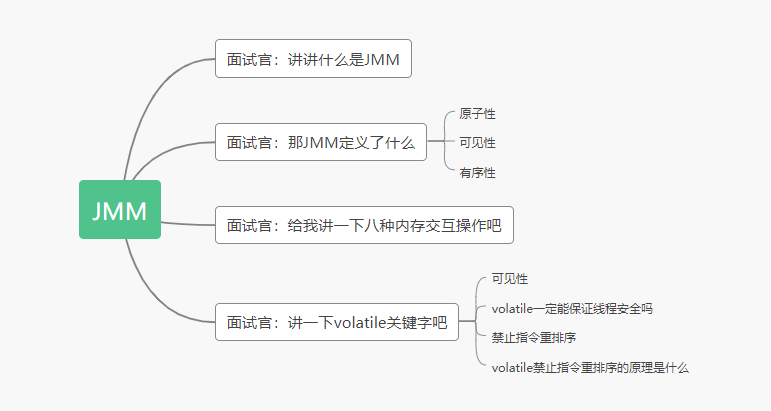

==1、JMM就是Java内存模型(java memory model)。==因为在不同的硬件生产商和不同的操作系统下，内存的访问有一定的差异，所以会造成相同的代码运行在不同的系统上会出现各种问题。所以**java内存模型(JMM)屏蔽掉各种硬件和操作系统的内存访问差异，以实现让java程序在各种平台下都能达到一致的并发效果。**

==2、这是 Java 内存模型定义的线程基本工作方式：==Java内存模型规定**所有的变量都存储在主内存**中，包括实例变量，静态变量，但是不包括局部变量和方法参数。**每个线程都有自己独立的工作内存，线程的工作内存保存了该线程用到的变量和主内存的副本拷贝，线程操作数据只能在工作内存中进行，然后刷回到主存。线程不能直接读写主内存中的变量，需要通过JMM。**

不同的线程之间也无法访问对方工作内存中的变量。**线程之间变量值的传递均需要通过主内存来完成。**如果听起来抽象的话，我可以画张图给你看看，会直观一点：


温馨提醒一下，这里有些人会把Java内存模型误解为**Java内存结构**，然后答到堆，栈，GC垃圾回收，最后和面试官想问的问题相差甚远。**实际上一般问到Java内存模型都是想问多线程，Java并发相关的问题**。


## 22.那JMM定义了什么？

这个简单，==整个Java内存模型实际上是围绕着三个特征建立起来的。分别是：原子性，可见性，有序性。==这三个特征可谓是整个Java并发的基础。

- 原子性指的是一个操作是不可分割，不可中断的，一个线程在执行时不会被其他线程干扰。JMM只能保证基本的原子性——变量的直接读取和赋值，如果要保证一个代码块的原子性，提供了monitorenter 和 moniterexit 两个字节码指令，也就是 synchronized 关键字。因此在 synchronized 块之间的操作都是原子性的。还有Lock。

- 除了volatile关键字之外，final和synchronized也能实现可见性。

  synchronized的原理是，在执行完，进入unlock之前，必须将共享变量同步到主内存中。

- volatile关键字是使用内存屏障达到禁止指令重排序，以保证有序性。

  synchronized的原理是，一个线程lock之后，必须unlock后，其他线程才可以重新lock，使得被synchronized包住的代码块在多线程之间是串行执行的。

## 23.给我讲一下八种内存交互操作吧

好的，面试官，内存交互操作有8种，我画张图给你看吧：


- lock(锁定)，作用于**主内存**中的变量，把变量标识为线程独占的状态。
- read(读取)，作用于**主内存**的变量，把变量的值从主内存传输到线程的工作内存中，以便下一步的load操作使用。
- load(加载)，作用于**工作内存**的变量，把read操作主存的变量放入到工作内存的变量副本中。
- use(使用)，作用于**工作内存**的变量，把工作内存中的变量传输到执行引擎，每当虚拟机遇到一个需要使用到变量的值的字节码指令时将会执行这个操作。
- assign(赋值)，作用于**工作内存**的变量，它把一个从执行引擎中接受到的值赋值给工作内存的变量副本中，每当虚拟机遇到一个给变量赋值的字节码指令时将会执行这个操作。
- store(存储)，作用于**工作内存**的变量，它把一个从工作内存中一个变量的值传送到主内存中，以便后续的write使用。
- write(写入)：作用于**主内存**中的变量，它把store操作从工作内存中得到的变量的值放入主内存的变量中。
- unlock(解锁)：作用于**主内存**的变量，它把一个处于锁定状态的变量释放出来，释放后的变量才可以被其他线程锁定。

> 我再补充一下JMM对8种内存交互操作制定的规则吧：
>
> - 不允许read、load、store、write操作之一单独出现，也就是read操作后必须load，store操作后必须write。
> - 不允许线程丢弃他最近的assign操作，即工作内存中的变量数据改变了之后，必须告知主存。
> - 不允许线程将没有assign的数据从工作内存同步到主内存。
> - 一个新的变量必须在主内存中诞生，不允许工作内存直接使用一个未被初始化的变量。就是对变量实施use、store操作之前，必须经过load和assign操作。
> - 一个变量同一时间只能有一个线程对其进行lock操作。多次lock之后，必须执行相同次数unlock才可以解锁。
> - 如果对一个变量进行lock操作，会清空所有工作内存中此变量的值。在执行引擎使用这个变量前，必须重新load或assign操作初始化变量的值。
> - 如果一个变量没有被lock，就不能对其进行unlock操作。也不能unlock一个被其他线程锁住的变量。
> - 一个线程对一个变量进行unlock操作之前，必须先把此变量同步回主内存。

## 24.讲一下volatile关键字吧？

很多并发编程都使用了volatile关键字，主要的作用包括两点：

1. **保证可见性。**

   volatile修饰的变量，当一个线程改变了该变量的值，其他线程是立即可见的。普通变量则需要重新读取才能获得最新值。

   volatile保证可见性的流程大概就是这个一个过程：

   

2. **保证有序性。**原理是JVM的内存屏障。

   


## 25.volatile禁止指令重排序的原理是什么


首先要讲一下内存屏障，内存屏障可以分为以下几类：

- **LoadLoad 屏障：**对于这样的语句Load1，LoadLoad，Load2。在Load2及后续读取操作要读取的数据被访问前，保证Load1要读取的数据被读取完毕。
- **StoreStore屏障：**对于这样的语句Store1， StoreStore， Store2，在Store2及后续写入操作执行前，保证Store1的写入操作对其它处理器可见。
- **LoadStore 屏障：**对于这样的语句Load1， LoadStore，Store2，在Store2及后续写入操作被刷出前，保证Load1要读取的数据被读取完毕。
- **StoreLoad 屏障：**对于这样的语句Store1， StoreLoad，Load2，在Load2及后续所有读取操作执行前，保证Store1的写入对所有处理器可见。

在每个volatile读操作后插入LoadLoad屏障，在读操作后插入LoadStore屏障。

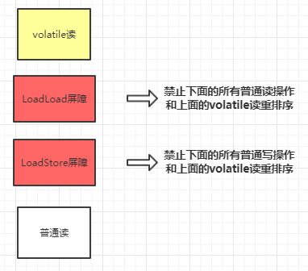

在每个volatile写操作的前面插入一个StoreStore屏障，后面插入一个SotreLoad屏障。

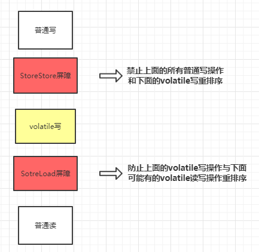

大概的原理就是这样。

面试官：讲得还不错，基本上都讲到了，时间也不早了，今天的面试就到这吧，回去等通知吧~


## ==26、谈JVM xmx, xms等内存相关参数合理性设置==


[谈JVM xmx, xms等内存相关参数合理性设置 - 掘金 (juejin.cn)](https://juejin.cn/post/7204485623460249658#heading-7)

由于每次Eden区满就会触发YGC，而每次YGC的时候，晋升到老年代的对象大小超过老年代剩余空间的时候，就会触发FGC。所以基本来说，GC频率和堆内内存大小是成反比的，也就是说堆内内存越大，吞吐量越大。

如果Xmx设置过小，不仅浪费了容器资源，在大流量下会频繁GC，导致一系列问题，包括吞吐量降低，响应变长，CPU升高，
 java.lang.OutOfMemoryError异常等。当然Xmx也不建议设置过大，否则会导致进程hang住或者使用容器Swap。所以合理设置Xmx非常重要，特别是对于1.8.0_131之前的版本，一定要明确指定Xmx。**推荐设置为容器内存的50%，不能超过容器内存的80%。**

JVM的动态内存策略不太适合服务使用，因为每次GC需要计算Heap是否需要伸缩，内存抖动需要向系统申请或释放内存，特别是在服务重启的预热阶段，内存抖动会比较频繁。另外，容器中如果有其他进程还在消费内存，JVM内存抖动时可能申请内存失败，导致OOM。**因此建议服务模式下，将Xms设置Xmx一样的值。**

NewRatio建议在2~3之间，最优选择取决于对象的生命周期分布。一般先确定老年代的空间（足够放下所有live data，并适当增加10%~20%)，其余是年轻代，年轻代大小一定要小于老年代。

另外，以上建议都是基于一个容器部署一个JVM实例的使用情况。有个别需求，需要在一个容器内启用多个JVM，或者包含其他语言的，研发需要按业务需求在推荐值范围内分配JVM的Xmx。


##==27、每天100w次登陆请求, 8G 内存该如何设置JVM参数？==

[每天100w次登陆请求, 8G 内存该如何设置JVM参数？ - 掘金 (juejin.cn)](https://juejin.cn/post/7203255955214172218)


