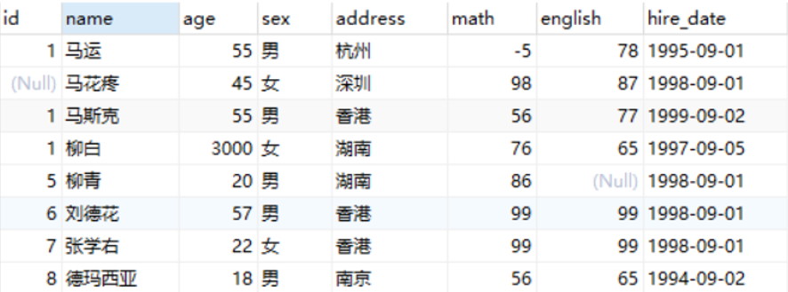
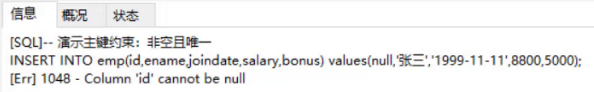
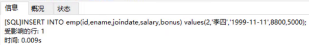
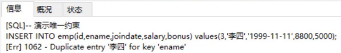
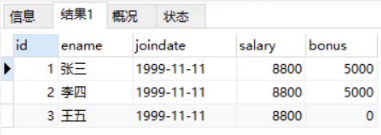
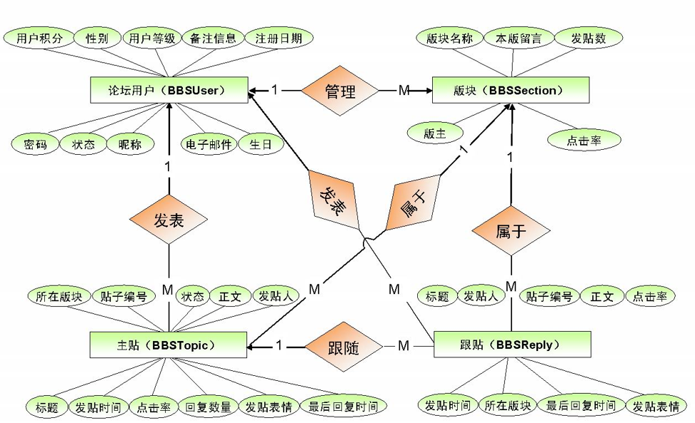
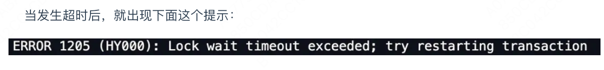
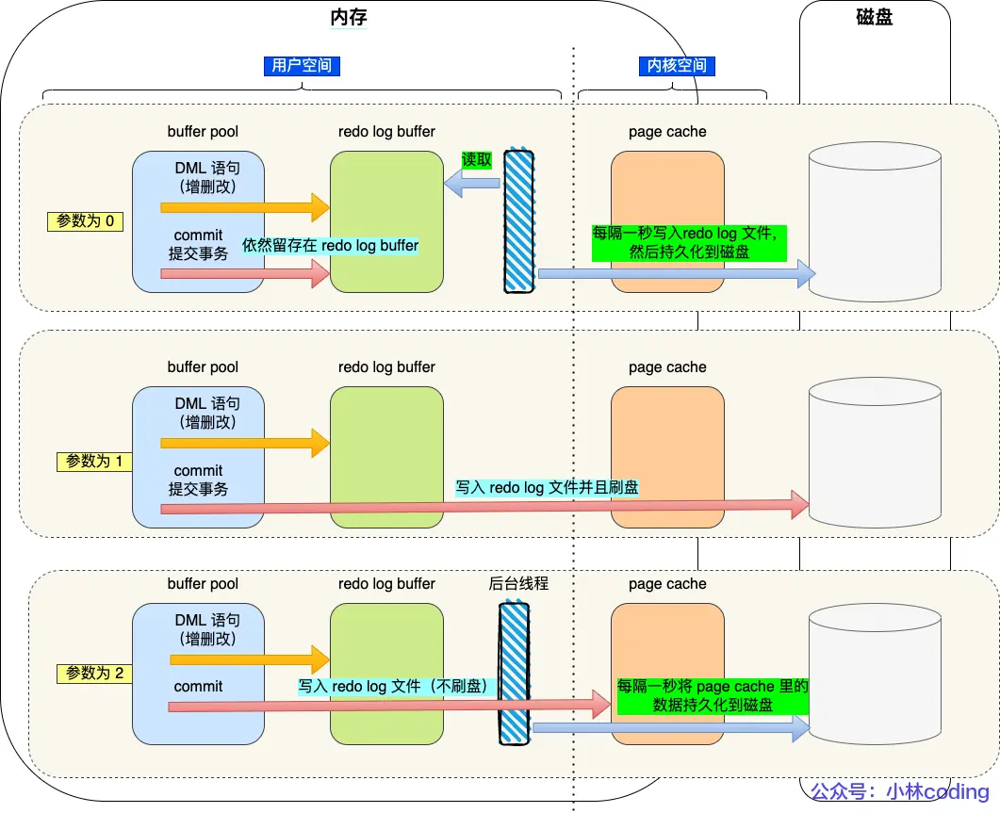

# 关系型数据库基础知识

## **1、数据库**

- **存储和管理数据的仓库，数据是有组织的进行存储。**
- 数据库英文名是 DataBase，简称DB。

顾名思义，**关系型数据库（RDBMS，Relational Database Management System）**就是一种**建立在关系模型的基础上**的数据库。关系模型表明了数据库中所存储的数据之间的联系（一对一、一对多、多对多）。

## **2、数据库管理系统**

- **管理数据库的大型软件**
- 英文：DataBase Management System，简称 DBMS

在电脑上安装了数据库管理系统后，就可以通过数据库管理系统创建数据库来存储数据，也可以通过该系统对数据库中的数据进行数据的增删改查相关的操作。**我们平时说的MySQL数据库其实是MySQL数据库管理系统。**


​		常见的数据库管理系统：


接下来对上面列举的数据库管理系统进行简单的介绍：

- Oracle：收费的大型数据库，Oracle 公司的产品
- **MySQL： 开源免费的中小型数据库。后来 Sun公司收购了 MySQL，而 Sun 公司又被 Oracle 收购**
- SQL Server：MicroSoft 公司收费的中型的数据库。C#、.net 等语言常使用
- PostgreSQL：开源免费中小型的数据库
- DB2：IBM 公司的大型收费数据库产品
- SQLite：嵌入式的微型数据库。如：作为 Android 内置数据库
- MariaDB：开源免费中小型的数据库

## 3、SQL语言


==这么多的管理系统，怎么学的完呢，对不对？，所以我们统一了一门编程语言（SQL）来操作所有的DBMS。整理一下，**用户、DBMS、DB的关系**，如下：==


用户通过SQL语言跟数据库管理系统（DMBS）打交道 ；然后DBMS识别用户的命令，来对数据库（DB）进行增删改查的操作。

- **英文：Structured Query Language，简称 SQL，结构化查询语言**
- 操作==关系型数据库==的编程语言
- ==大部分数据库管理系统的sql语句都是一样的，但是也存在部分的需求，它的语法规则不一样，这种我们称为——数据库管理系统的方言。==

**SQL分类**

- **DDL(Data Definition Language) ：** 数据定义语言，**用来操作数据库， 表属性 等**
- **DML(Data Manipulation Language)** ：数据操作语言，对**表中数据进行增删改**

- **DQL(Data Query Language)** 数据查询语言，**对表中数据进行查询。**


- **DCL(Data Control Language)** 数据控制语言。**对数据库、表进行权限控制**。比如我让某一个数据库表只能让某一个用户进行操作等。


## 4、ER图

就是对数据库表中的设计，思路。==搞清楚表之间的关系，以及单张表的结构==

数据库设计的步骤

* 需求分析（数据是什么? 数据具有哪些属性? 数据与属性的特点是什么）

* 逻辑分析（通过ER图对数据库进行逻辑建模，不需要考虑我们所选用的数据库管理系统）

  如下图就是==ER(Entity/Relation)图==：（现在已经不需要画这个了，Mysql那个模型转换功能就可以看见）


这个就是：emp表有一个外键指向了dept表，外键是dep_id字段到dept的id。


**表之间的关系：**

- 一对一（一个表拆分成两个表，用于提高查询性能），
- 一对多，（部门与员工之间的关系；一个部门对应多个员工，一个员工属于一个部门）
- 多对多。（商品与订单的关系。一个商品对应会有多个订单，一个订单里面有多个商品。）

## 5、数据库范式

数据库范式有 3 种：

- 第一范式: 即数据库表的每一列都是不可分割的原子数据项。**也就是这个字段只能是一个值**，不能再分为多个其他的字段了
- 第二范式:要求**实体的属性完全依赖于主关键字**。所谓完全依赖是指不能存在仅依赖主关键字一部分的属性。
- 第三范式:**任何非主属性不依赖于其它非主属性**。

**1NF(第一范式)**

属性（对应于表中的字段）不能再被分割，也就是这个字段只能是一个值，不能再分为多个其他的字段了。**1NF 是所有关系型数据库的最基本要求** ，也就是说关系型数据库中创建的表一定满足第一范式。

**2NF(第二范式)**

2NF 在 1NF 的基础之上，消除了非主属性对于码（列）的部分函数依赖。如下图所示，展示了第一范式到第二范式的过渡。**第二范式在第一范式的基础上增加了一个列，这个列称为主键，非主属性都依赖于主键。**


**3NF(第三范式)**

3NF 在 2NF 的基础之上，消除了非主属性对于码的传递函数依赖 。符合 3NF 要求的数据库设计，**基本**上解决了数据冗余过大，插入异常，修改异常，删除异常的问题。比如在关系 R(学号 , 姓名, 系名，系主任)中，学号 → 系名，系名 → 系主任，所以存在非主属性系主任对于学号的传递函数依赖，所以该表的设计，不符合 3NF 的要求。

## 6、主键和外键

**主键(主码)** ：主键用于唯一标识一个元组，不能有重复，不允许为空。一个表只能有一个主键。

**外键(外码)** ：外键用来和其他表建立联系用，外键是另一表的主键，**外键是可以有重复的，可以是空值。一个表可以有多个外键。**


==不得使用外键与级联，一切外键概念必须在应用层解决。==

说明: 以学生和成绩的关系为例，学生表中的 student_id 是主键，那么成绩表中的 student_id 则为外键。如果更新学生表中的 student_id，同时触发成绩表中的 student_id 更新，即**为级联更新**。外键与级联更新适用于单机低并发，不适合分布式、高并发集群。

 **级联更新**是强阻塞，存在数据库更新风暴的风 险; 

**外键：**

- **增加了开发复杂性。**

  每次做 DELETE 或者 UPDATE 都必须考虑外键约束，会导致开发的时候很痛苦, 测试数据极为不方便; b. 外键的主从关系是定的，假如那天需求有变化，数据库中的这个字段根本不需要和其他表有关联的话就会增加很多麻烦。

- **降低数据库效率**

  数据库需要增加维护外键的工作，比如当我们做一些涉及外键字段的增，删，更新操作之后，需要触发相关操作去检查，保证数据的的一致性和正确性，这样会不得不消耗资源；）

- **对分库分表不友好** ：因为分库分表下外键是无法生效的。


# MYSQL初级

## 数据模型

**一：关系型数据库：**

关系型数据库是建立在关系模型基础上的数据库，简单说，关系型数据库是由多张能互相连接的 **二维表** 组成的数据库。即数据库里面存储的都是有行有列的二维表，表之间存在一定联系。


接下来看关系型数据库的优点：

- **都是使用表结构，格式一致，易于维护。**

- 使用通用的 SQL 语言操作，使用方便，可用于**复杂查询。**

如现在需要查询001号订单数据，我们可以看到该订单是1号客户的订单，而1号订单是李聪这个客户。以后也可以在一张表中进行统计分析等操作。

**现在总结一下，MYSQL的整体数据模型：**


前面讲过，客户端通过SQL语言操作DBMS，然后他再对数据库执行相应的操作。举个例子：

```sql
create database db1;
```

这样就在数据库按照目录下的data文件下，新建一个db1的文件夹；**即在MySQL中一个数据库对应到磁盘上的一个文件夹。**

然后一个数据库下可以创建多张表，我们到MySQL中自带的mysql数据库的文件夹目录下：


上图中右边的 **db.frm 是表文件**， **db.MYD 是数据文件**，通过这两个文件就可以查询到数据展示成二维表的效果。

**小结：**

1. **MySQL中可以创建多个数据库，每个数据库对应到磁盘上的一个文件夹**
2. **在每个数据库中可以创建多个表，每张都对应到磁盘上一个 frm 文件**
3. **每张表可以存储多条数据，数据会被存储到磁盘中 MYD 文件中**


## 数据类型

MySQL 支持多种类型，可以分为三类：

下面是简单的举例，还有很多其他类型，查看同目录下的《MySQL数据类型.xlsx》。

### 数值

```sql
tinyint	:小整数型，占一个字节 
int			:大整数类型，占四个字节 
						eg ： age int 
double	:浮点类型 
				使用格式： 字段名 double(总长度,小数点后保留的位数) 
						eg ： score double(5,2)
```

### 日期（单引号包裹）

```sql
date			:日期值。只包含年月日 
							eg ：birthday date 
datetime	:混合日期和时间值。包含"年-月-日-时-分-秒"
```

### 字符串（单引号包裹）

```sql
char		:定长字符串。 
				优点：存储性能高 
				缺点：浪费空间 
					eg ： name char(10) 
				如果存储的数据字符个数不足10个，也会占10个的空间 
varchar	:变长字符串。 
				优点：节约空间 
				缺点：存储性能低 
					eg ： name varchar(10) 
				如果存储的数据字符个数不足10个，那就数据字符个数是几就占几个的空间 
```


## SQL语句

### 通用语法

- **SQL 语句可以单行或多行书写，以分号结尾，并且一条sql语句，内部是使用逗号 ， 进行分割，内部的最后部分不要加逗号，哦**。

  ```sql
  show databases;
  ```

- **MySQL 数据库的 SQL 语句不区分大小写**，关键字建议使用大写。

  ```sql
  Show DataBases;
  ```

- **DML、DQL语句内不严格区分单引号、双引号，都可以**，一般我们都是使用双引号包裹查询条件；

- **DDL语句中 comment必须使用单引号**。这是因为注释内容被视为字符串，而在SQL语句中，字符串值通常需要用单引号来界定。

- **DML、DQL中，如果想表达某个字符串内部还有引号，**则采用外部双引号+内部单引号  或 外部单引号+内部双引号。

- **单行注释：**     **-- 注释内容** 或   **#注释内容**(MySQL 特有)【注意：--后面一定加空格，#没有要求】

  ```sql
  show databases;-- 查询所有的数据库名称
  show databases; #查询所有的数据库名称
  ```

- **多行注释：**   /*  注释  */

  此外，额外注意的地方：

  

## SQL分类

- **DDL(Data Definition Language) ：** 数据定义语言，用来定义数据库对象：数据库，表，列等，**DDL简单理解就是用来操作数据库， 表 等**
- **DML(Data Manipulation Language)** ：数据操作语言，用来对数据库中表的数据进行增删改，**DML简单理解就对表中数据进行，增删改**

- **DQL(Data Query Language)** 数据查询语言，用来查询数据库中表的记录(数据)；**DQL简单理解就是对数据进行查询操作。**


- **DCL(Data Control Language)** 数据控制语言，用来定义数据库的访问权限和安全级别，及创建用户。**DML简单理解就是对数据库进行权限控制**。比如我让某一个数据库表只能让某一个用户进行操作等。

**重点： DML 和 DQL** 

### DDL：操作数据库

操作数据库主要就是对数据库的增删查操作。

1. 查询所有的数据库：

   ```sql
   SHOW DATABASES;
   ```

2. 创建数据库 (判断，如果不存在则创建)：

   ```sql
   CREATE DATABASE IF NOT EXISTS 数据库名称;
   ```

3. 删除数据库(判断，如果存在则删除)

   ```sql
   DROP DATABASE IF EXISTS 数据库名称;
   ```

4. 进入使用数据库：

   ```sql
   USE 数据库名称;
   ```

5. 查看当前使用的数据库：

   ```sql
   SELECT DATABASE();
   ```

### DDL：操作表

操作表也就是对**表**进行增（Create）删（Retrieve）改（Update）查（Delete）。

1. **查询当前数据库下所有表名称**

   ```sql
   SHOW TABLES;
   ```

2. **查询表结构**

   ```sql
   DESC 表名称;
   ```

   查看mysql数据库中func表的结构，运行语句如下：


3. **创建表**

   ```sql
   CREATE TABLE 表名 ( 
     字段名1 数据类型1, 
     字段名2 数据类型2, 
     …
     字段名n 数据类型n 
   );
   -- 注意：最后一行末尾，不能加逗号
   ```

4. **删除表**

   ```sql
   DROP TABLE IF EXISTS 表名;
   ```

5. **修改表**

   ​	**修改表名:**	RENAME TO

   ```sql
   ALTER TABLE 表名 RENAME TO 新的表名; 
   
   -- 将表名student修改为stu 
   alter table student rename to stu;
   ```

   ​	**添加一列:**	ADD

   ```sql
   ALTER TABLE 表名 ADD 列名 数据类型; 
   
   -- 给stu表添加一列address，该字段类型是varchar(50) 
   alter table stu add address varchar(50);
   ```

   ​	**修改数据类型:**	MODIFY

   ```sql
   ALTER TABLE 表名 MODIFY 列名 新数据类型; 
   
   -- 将stu表中的address字段的类型改为 char(50) 
   alter table stu modify address char(50);
   ```

   ​	**修改列名和数据类型:**	CHANGE

   ```sql
   ALTER TABLE 表名 CHANGE 列名 新列名 新数据类型;
   
   -- 将stu表中的address字段名改为 addr，类型改为varchar(50) 
   alter table stu change address addr varchar(50);
   ```

   ​	**删除列:**

   ```sql
   ALTER TABLE 表名 DROP 列名; 
   
   -- 将stu表中的addr字段 删除 
   alter table stu drop addr;
   ```

### DML

**对表中数据进行，增、删、改**

#### 添加数据

- **给指定列添加数据**

  ```sql
  INSERT INTO 表名(列名1,列名2,…) VALUES(值1,值2,…);
  ```

- **给全部列添加数据**

  ```sql
  INSERT INTO 表名 VALUES(值1,值2,…);
  ```

- **批量添加数据**

  ```sql
  INSERT INTO 表名(列名1,列名2,…) VALUES(值1,值2,…),(值1,值2,…),(值1,值2,…)…; 
  INSERT INTO 表名 VALUES(值1,值2,…),(值1,值2,…),(值1,值2,…)…;
  ```

#### 修改数据

- **修改表数据**

  ```sql
  UPDATE 表名 SET 列名1=值1,列名2=值2,… [WHERE 条件];
  ```

注意：

1. 修改语句中如果不加条件，则将所有数据都修改！
2. 中括号表示里面的语句 可要可不要；这个中括号一般省略不写

**Example：**

```sql
#将张三的性别改为女
update stu set sex="女" where name = "张三";
#将张三的生日改为 1999-12-12 分数改为99.99
update stu set birthday = "1999-12-12", score = 99.99 where name = "张三";
#注意：如果update语句没有加where条件，则会将表中所有数据全部修改！
update stu set sex = "女";
```

#### 删除数据

```sql
DELETE FROM 表名 WHERE 条件 ; 
```

```sql
-- 删除张三记录 
delete from stu where name = '张三'; 
-- 删除stu表中所有的数据 
delete from stu;
```

### DQL(重点)

查询这里是最重要的啊，因为他是特别灵活的一类，例如在我们的前端页面展示所有数据库里面的数据，然后分页展示数据，排序展示数据等等，需要实现定制化的效果。需要特别重点掌握。

**先介绍查询的完整语法：**

```sql
SELECT
		字段列表 
FROM
		表名列表 
WHERE
		条件列表 （条件查询）
GROUP BY 
		分组字段 （分组查询）
HAVING
		分组后条件 
ORDER BY 
		排序字段 （排序查询）
LIMIT
		分页限定 （分页查询）
```

下面各自查询操作，均基于下面这个表进行。

 ```sql
-- 删除stu表
drop table if exists stu;


-- 创建stu表
CREATE TABLE stu (
 id int, -- 编号
 name varchar(20), -- 姓名
 age int, -- 年龄
 sex varchar(5), -- 性别
 address varchar(100), -- 地址
 math double(5,2), -- 数学成绩
 english double(5,2), -- 英语成绩
 hire_date date -- 入学时间
);

-- 添加数据
INSERT INTO stu(id,NAME,age,sex,address,math,english,hire_date) 
VALUES 
(1,'马运',55,'男','杭州',66,78,'1995-09-01'),
(2,'马花疼',45,'女','深圳',98,87,'1998-09-01'),
(3,'马斯克',55,'男','香港',56,77,'1999-09-02'),
(4,'柳白',20,'女','湖南',76,65,'1997-09-05'),
(5,'柳青',20,'男','湖南',86,NULL,'1998-09-01'),
(6,'刘德花',57,'男','香港',99,99,'1998-09-01'),
(7,'张学右',22,'女','香港',99,99,'1998-09-01'),
(8,'德玛西亚',18,'男','南京',56,65,'1994-09-02');
 ```

#### 基础查询

- **查询多个字段**

```sql
SELECT 字段列名 FROM 表名; 
# select name,age from stu;
SELECT * FROM 表名; -- 查询所有数据
```

- **去除重复记录**

```sql
SELECT DISTINCT 字段列名 FROM 表名;
```

- **起别名**

```sql
AS
中间的冒号：也可以省略,但不建议省略，这样可读性强
# select name,math as 数学成绩,english as 英文成绩 from stu;
```

#### 条件查询

```sql
SELECT 字段列表 FROM 表名 WHERE 条件列表;  多个条件用 and（&&），or（||）
```

其中，条件列表可以使用以下运算符：

​				==between...and...——可用于时间段查询==


**练习一：**

- **查询年龄大于等于20岁 并且 年龄 小于等于 30岁 的学员信息**

```sql
#1. 
select * from stu where age >= 20 and age <= 30;
#2. 
select * from stu where age BETWEEN 20 and 30;
```

- **查询入学日期在'1998-09-01' 到 '1999-09-01' 之间的学员信息**

```sql
select * from stu where hire_date BETWEEN '1998-09-01' and '1999-09-01';
```

- **查询年龄等于18岁 或20岁 或 22岁的学员信息**

```sql
select * from stu where age in (18,20,22);
```

- **查询英语成绩为 null的学员信息**

​		注意：null值的比较不能使用 = 或者 != ，需要使用 is 或者 is not。其他情况使用 = 或！=

```sql
select * from stu where english = null; -- 这个语句是不行的 
select * from stu where english is null; 
select * from stu where english is not null;
##
select * from stu where age != 18;
```

**模糊查询练习二：**

```
模糊查询使用like关键字，可以使用通配符进行占位: 
（1）_ : 代表单个任意字符
（2）% : 代表任意个数字符
```

- **查询姓'马'的学员信息**

```sql
select * from stu where name like "马%";
```

- **查询第二个字是'花'的学员信息**

```sql
select * from stu where name like '_花%';
```

- **查询名字中包含 '德' 的学员信息**

```sql
select * from stu where name like "%德%";
```

#### 排序查询

```sql
SELECT 字段列表 FROM 表名 ORDER BY 排序字段名1 [排序方式1], 排序字段名2 [排序方式2] …;
```

上述语句中的排序方式有两种，分别是：

1. **ASC** ： 升序排列 **（默认值）**——ascending sort
2. **DESC** ： 降序排列——descending sort

**注意：如果有多个排序条件，当前边的条件值一样时，才会根据第二条件进行排序**，就是说，假如你写了两种方式排序，优先按照第一种来，当第一种出现了两个或以上数据排序一样时，再按照第二种对这几个相同的数据排序。

**Example：**

- **查询学生信息，按照数学成绩降序排列，如果数学成绩一样，再按照英语成绩升序排列**

  ```sql
  select * from stu order by math desc , english asc ;
  ```

#### 分组查询

##### 聚合函数

学习分组查询前，先要学习一个东西——**聚合函数**。

简单说：**将一列数据作为一个整体，进行纵向计算。**

举个例子说明：假如有下表：


现有一需求让我们求表中所有数据的数学成绩的总和。这就是对math字段进行纵向求和。

**聚合函数分类：**


**语法：**	==**特别注意：null 值不参与所有聚合函数运算**==

```sql
SELECT  聚合函数名(列名)  FROM 表;
```

**Example：**

- **统计班级一共有多少个学生**

```sql
select count(*) from stu; 
# 下面这种方式是不行的哦，因为假如统计的这个字段是null，而其他的字段内容不为空，就会少统计一个学生，这个意思。
select count(id) from stu;
```

==* 表示所有字段数据，即只有当这条数据的所有字段列表全为null时才不统计，只要有一个字段不为0，就会统计该条数据。==

- **查询数学成绩的最高分**

  ```sql
  select max(math) from stu;
  ```

- **查询数学成绩的平均分**

  ```sql
  select avg(math) from stu;
  ```

##### **语法**

```sql
SELECT 字段列表 FROM 表名 [WHERE 分组前条件限定] GROUP BY 分组字段名 [HAVING 分组后条件限制]; 
```

- **注意：查询的字段（即上面的字段列表）只能为==聚合函数（可以为任意字段）==和该==分组的字段==，查询其他字段无任何意义。**

- where 就是前面的条件查询语句。having后面的除了条件查询语句写法，还可以写聚合函数。


**where和having的区别**

- 执行时机不一样：where 是分组之前进行限定，不满足where条件，则不参与分组，而having是分组之后对结果进行过滤。
- 可判断的条件不一样：where 不能对聚合函数进行判断，having 可以。

**写分组查询sql的顺序：**

```sql
1. 
select   from stu group by sex;
		#表示将sex这个字段这一列，按照存储内容的不同分组。现在sex字段存储的数据只有男、女，所以会自动把他分为两组。
2.
select sex,avg(math) from stu group by sex;
		#然后再写，我对这两个分组之后做的操作，select查询的字段列表只能是，聚和函数和分组字段，注意哦：现在这个sex不是对应表里面那个字段下的所有数据哦，他是指的分组名。
```

上面语句的输出如下：


现在学会了书写顺序后，再看看下面的几个例子。

**Example：**

- **查询男同学和女同学各自的数学平均分，以及各自人数**

  ```sql
  select sex,avg(math),COUNT(*) from stu GROUP BY sex;
  ```

- **查询男同学和女同学各自的数学平均分，以及各自人数，要求：分数低于70分的不参与分组**

  ```sql
  select sex,avg(math),COUNT(*) from stu where math >= 70 GROUP BY sex;
  ```

- **查询男同学和女同学各自的数学平均分，以及各自人数，要求：分数低于70分的不参与分组，分组之后人数大于2个的**

  ```sql
  select sex,avg(math),COUNT(*) from stu where math >= 70 GROUP BY sex HAVING count(*)>2;
  ```

##### 多个字段

可以使用多个字段对结果进行分组查询。**通过在`GROUP BY`子句中指定多个字段，可以按照这些字段的组合进行分组。**

以下是使用两个分组字段的示例：


```sql
select student_id,subject_name,count(*)
from examinations
GROUP BY student_id, subject_name;
```

上述查询将从名为`examinations`的表中选择`student_id`和`subject_name`列，并按照**这两个字段的组合**进行分组。`COUNT(*)`用于计算每个组中的行数。


#### 分页查询

```sql
SELECT 字段列表 FROM 表名 LIMIT 起始索引 , 每页条目数; # 包含起始索引，数据从0开始记录
```

- ==其中起始索引是从0开始，他是mysql内部它自己标示每一条数据的索引（我们是看不见的）；==
- 查询条目就是每一页你要显示的数据个数。

所以说：当我们需要查询第三页的数据，每页显示3条时，应该怎么写呢：

```sql
select * from stu limit 6,3;

select * from stu limit (pageNum-1), pageSize;
```


# MySQL高级

## 1. 约束

注意到，我们前面用的数据库的那个表，是我们自己写的，对不对，并且所有的字段里面的数据都可以随便写，例如id可以写1，2，3甚至可以重复写，这就存在很多问题。以我们前面那个stu表为例子。



表中数据存在一些问题：

* id 列一般是用标示数据的唯一性的，而上述表中的id为1的有三条数据，并且 `马花疼` 没有id进行标示
* `柳白` 这条数据的age列的数据是3000，而人也不可能活到3000岁
* `马运`  这条数据的math数学成绩是-5，而数学学得再不好也不可能出现负分

* `柳青` 这条数据的english列（英文成绩）值为null，而成绩即使没考也得是0分

针对上述数据问题，我们就可以从数据库层面在添加数据的时候进行限制，这个就是约束。

### 1.1 概述

* 约束就是表中字段列上的规则，用于限制加入表的数据

  ​		例如：我们可以给id列加约束，让其值不能重复，不能为null值。

* 约束的存在保证了数据库中数据的正确性、有效性和完整性

  ​		添加约束可以在添加数据的时候就限制不正确的数据，年龄是3000，数学成绩是-5分这样无效的数据，继而保障数据的完整性。

### 1.2 约束的分类（DDL）

1. **非空约束： 关键字是 NOT NULL**

   ​		保证列中所有的数据不能有null值。

2. **唯一约束：关键字是  UNIQUE**

   ​		保证该列中所有数据各不相同。

3. **主键约束： 关键字是  PRIMARY KEY** = not null + unique

   ​		主键是一行数据的唯一标识，非空且唯一。一张表只能有一个主键。

4. **检查约束： 关键字是  CHECK** 

   保证字段列中的值满足某一条件。

   例如：我们可以给age列添加一个范围，最低年龄可以设置为1，最大年龄就可以设置为300，这样的数据才更合理些。

   > ==注意：MySQL不支持检查约束。==
   >
   > 这样是不是就没办法保证年龄在指定的范围内了？从数据库层面不能保证，以后可以在java代码中进行限制，一样也可以实现要求。

5. **默认约束： 关键字是   DEFAULT**

   保存数据时，未指定值则采用默认值。

   例如：我们在给english列添加该约束，指定默认值是0，这样在添加数据时没有指定具体值时就会采用默认给定的0。

6. **外键约束： 关键字是  FOREIGN KEY**

   ​		外键用来让两个表的数据之间建立链接，保证数据的一致性和完整性。后面我们会重点进行讲解。

7. **额外介绍一个：自动增长,     关键字：AUTO_INCREMENT**

   ​		只有当该字段的数据为数字类型，且唯一的时候，才可以加这个约束。

   ​		作用是：当我们插入数据时，==该字段数据为null==，他就会按照数据插入库的顺序去给字段添加值。

### 1.3 非空约束

**关键字是 NOT NULL**，保证列中所有的数据不能有null值。

语法：

- 添加约束

  ```sql
  -- 创建表时添加非空约束
  CREATE TABLE 表名(
     列名 数据类型 NOT NULL,
     …
  ); 
  ```

  ```sql
  -- 建完表后添加非空约束
  ALTER TABLE 表名 MODIFY 字段名 数据类型 NOT NULL;
  ```

- 删除约束==（只有这里是modify、其他的是drop）==

  ```sql
  ALTER TABLE 表名 MODIFY 字段名 数据类型;
  ```

### 1.4 唯一约束（重点）

**关键字是  UNIQUE**，保证该列中所有数据各不相同。

==创建唯一约束，就一定会插件该字段的索引==、

在 MySQL 中，当你为某个字段设置 `UNIQUE` 约束时，系统自动为该字段创建唯一索引，这是 MySQL 管理和强制执行 `UNIQUE` 约束的机制。因此，没有直接的方法可以设置 `UNIQUE` 约束而不创建索引。

`UNIQUE` 约束的实现本质上依赖于唯一索引。索引不仅用于强制数据的唯一性，还用于优化基于这些字段的查询性能。没有索引，数据库将无法有效地强制执行 `UNIQUE` 约束，因为它需要在每次插入或更新操作时扫描整个表来检查是否违反了唯一性，这在大型数据集上是非常低效的。

语法：

- 添加约束

  ```sql
  -- 创建表时添加唯一约束
  CREATE TABLE 表名(
     列名 数据类型 UNIQUE,
     …
  ); 
  --
  create table stu(
  	id int unique,
    ....
  );
  ```

  ```sql
  -- 建完表后添加唯一约束
  ALTER TABLE 表名 MODIFY 字段名 数据类型 UNIQUE;
  --
  alter table stu modify id int unique;
  ```

- 删除约束

  ```sql
  ALTER TABLE 表名 DROP INDEX 约束字段名;
  --
  alter table stu drop index id;
  ```

### 1.5 主键约束

**关键字是  PRIMARY KEY**，主键是一行数据的唯一标识，**非空且唯一**。一张表只能有一个主键。

**语法**

- 添加约束

  ```sql
  -- 创建表时添加主键约束
  CREATE TABLE 表名(
     列名 数据类型 PRIMARY KEY [AUTO_INCREMENT],
     …
  ); 
  CREATE TABLE 表名(
     列名 数据类型,
     [CONSTRAINT] [约束名称] PRIMARY KEY(列名) -- 这种写法也可以
  ); 
  ```

  ```sql
  -- 建完表后添加主键约束
  ALTER TABLE 表名 ADD PRIMARY KEY(字段名);
  ```

- 删除约束

  ```sql
  ALTER TABLE 表名 DROP PRIMARY KEY;
  ```

### 1.6 默认约束

**关键字是   DEFAULT**，保存数据时，未指定值则采用默认值。

**语法**

- 添加约束

  ```sql
  -- 创建表时添加默认约束
  CREATE TABLE 表名(
     列名 数据类型 DEFAULT 默认值,
     …
  ); 
  ```

  ```sql
  -- 建完表后添加默认约束
  ALTER TABLE 表名 ALTER 列名 SET DEFAULT 默认值;
  ```

- 删除约束

  ```sql
  ALTER TABLE 表名 ALTER 列名 DROP DEFAULT;
  ```


### 1.7  约束练习

**根据需求，为表添加合适的约束**

```sql
-- 员工表
CREATE TABLE emp (
	id INT,  -- 员工id，主键且自增长
    ename VARCHAR(50), -- 员工姓名，非空且唯一
    joindate DATE,  -- 入职日期，非空
    salary DOUBLE(7,2),  -- 工资，非空
    bonus DOUBLE(7,2)  -- 奖金，如果没有将近默认为0
);
```

上面一定给出了具体的要求，我们可以根据要求创建这张表，并为每一列添加对应的约束。建表语句如下：

```sql
DROP TABLE IF EXISTS emp;

-- 员工表
CREATE TABLE emp (
  id INT PRIMARY KEY, -- 员工id，主键且自增长
  ename VARCHAR(50) NOT NULL UNIQUE, -- 员工姓名，非空并且唯一
  joindate DATE NOT NULL , -- 入职日期，非空
  salary DOUBLE(7,2) NOT NULL , -- 工资，非空
  bonus DOUBLE(7,2) DEFAULT 0 -- 奖金，如果没有奖金默认为0
);
```

通过上面语句可以创建带有约束的 `emp` 表，约束能不能发挥作用呢。接下来我们一一进行验证，先添加一条没有问题的数据

```sql
INSERT INTO emp(id,ename,joindate,salary,bonus) values(1,'张三','1999-11-11',8800,5000);
```

* **验证主键约束，非空且唯一**

```sql
INSERT INTO emp(id,ename,joindate,salary,bonus) values(null,'张三','1999-11-11',8800,5000);
```

执行结果如下：



从上面的结果可以看到，字段 `id` 不能为null。那我们重新添加一条数据，如下：

```sql
INSERT INTO emp(id,ename,joindate,salary,bonus) values(1,'张三','1999-11-11',8800,5000);
```

执行结果如下：


从上面结果可以看到，1这个值重复了。所以主键约束是用来限制数据非空且唯一的。那我们再添加一条符合要求的数据

```sql
INSERT INTO emp(id,ename,joindate,salary,bonus) values(2,'李四','1999-11-11',8800,5000);
```

执行结果如下：



* **验证非空约束**

```sql
INSERT INTO emp(id,ename,joindate,salary,bonus) values(3,null,'1999-11-11',8800,5000);
```

执行结果如下：


从上面结果可以看到，`ename` 字段的非空约束生效了。

* **验证唯一约束**

```sql
INSERT INTO emp(id,ename,joindate,salary,bonus) values(3,'李四','1999-11-11',8800,5000);
```

执行结果如下：



从上面结果可以看到，`ename` 字段的唯一约束生效了。

* **验证默认约束**

```sql
INSERT INTO emp(id,ename,joindate,salary) values(3,'王五','1999-11-11',8800);
```

执行完上面语句后查询表中数据，如下图可以看到王五这条数据的bonus列就有了默认值0。



==注意：默认约束只有在不给值时才会采用默认值。如果给了null，那值就是null值。==

如下：

```sql
INSERT INTO emp(id,ename,joindate,salary,bonus) values(4,'赵六','1999-11-11',8800,null);
```

执行完上面语句后查询表中数据，如下图可以看到赵六这条数据的bonus列的值是null。


* **验证自动增长： auto_increment  当列是数字类型 并且唯一约束**

重新创建 `emp` 表，并给id列添加自动增长

```sql
-- 员工表
CREATE TABLE emp (
  id INT PRIMARY KEY auto_increment, -- 员工id，主键且自增长
  ename VARCHAR(50) NOT NULL UNIQUE, -- 员工姓名，非空并且唯一
  joindate DATE NOT NULL , -- 入职日期，非空
  salary DOUBLE(7,2) NOT NULL , -- 工资，非空
  bonus DOUBLE(7,2) DEFAULT 0 -- 奖金，如果没有奖金默认为0
);
```

接下来给emp添加数据，分别验证不给id列添加值以及给id列添加null值，id列的值会不会自动增长：

```sql
INSERT INTO emp(ename,joindate,salary,bonus) values('赵六','1999-11-11',8800,null);
INSERT INTO emp(id,ename,joindate,salary,bonus) values(null,'赵六2','1999-11-11',8800,null);
INSERT INTO emp(id,ename,joindate,salary,bonus) values(null,'赵六3','1999-11-11',8800,null);
```


### 1.8 外键约束

**关键字是  FOREIGN KEY**， 外键用来让两个表的数据之间建立链接，保证数据的一致性和完整性。

举例说明：如下图有两张表，员工表和部门表：


可见：按照我们人的思维，员工表中的dep_id字段对应的是部门表里面的id字段，这是没有问题的，但是这只是我们自己的个人思维，在Mysql里面，它只会认定这里有两个不同的表，并且这两个是没有什么关系的；当我们想删除研发部的时候，我们直接就在部门表里面删除了，但是这就会出现问题，因为员工表里面的1、2、3号他们都是研发部的呀，研发部都没有了，他们怎么还在呢，大概就是这个意思，说表里面的数据，有的需要一一对应。

**这里的添加外键，又分为主表和从表。**

第一步：你要分清哪一个是主表，即主表在逻辑层面上包含了从表。在这里，dept部门表是主表，每个部门下的员工在emp表中。

第二步：**外键是添加到从表里面**，为什么呢，因为按照逻辑，我是先有了部门，再有的员工，员工应该挂在部门下面，懂了吧，所以说**外键应该在从表里面加上，是从表指向了主表。**

第三步：有了上面的思维，在创建表的时候，应该是**先创建主表，再创建从表**；添加数据的时候也是一样，**先插入主表的，然后插入从表。**

效果：只有当从表中的对应数据全部删除后，才可以删除主表里面的数据。以上面的例子说：想要删除dept表里面研发部这条数据，只有当员工表里面的1、2、3号员工（都是研发部的）全部删除了后，才可以删除研发部。

**语法**

- **添加约束**

  ```sql
  -- 创建表时添加外键约束
  CREATE TABLE 表名(
     列名 数据类型,
     ....
     [CONSTRAINT] [外键名称(任意，一般命名规则：fk_从表名_主表名)] FOREIGN KEY(本表中需要加外键的那个列名) REFERENCES 主表(主表列名) 
  ); 
  -- 添加外键 dep_id,关联 dept 表的id主键
  	CONSTRAINT fk_emp_dept foreign key (dep_id) REFERENCES dept(id)
  ```

  ```sql
  -- 建完表后添加外键约束
  ALTER TABLE 表名 ADD CONSTRAINT 外键名称 FOREIGN KEY (外键字段名称) REFERENCES 主表名称(主表列名);
  --
  alter table emp add CONSTRAINT fk_emp_dept FOREIGN key(dep_id) REFERENCES dept(id);
  ```

- **删除约束**

  ```sql
  ALTER TABLE 表名 DROP FOREIGN KEY 外键名称(前面起的那个外键名称);
  -- 
  alter table emp drop FOREIGN key fk_emp_dept;
  ```

**Example**

​		根据上述语法创建员工表和部门表，并添加上外键约束：

```sql
-- 删除表
DROP TABLE IF EXISTS emp;
DROP TABLE IF EXISTS dept;

-- 部门表
CREATE TABLE dept(
	id int primary key auto_increment,
	dep_name varchar(20),
	addr varchar(20)
);
-- 员工表 
CREATE TABLE emp(
	id int primary key auto_increment,
	name varchar(20),
	age int,
	dep_id int,

	-- 添加外键 dep_id,关联 dept 表的id主键
	CONSTRAINT fk_emp_dept FOREIGN KEY(dep_id) REFERENCES dept(id)	
);
```

添加数据

```sql
-- 添加 2 个部门
insert into dept(dep_name,addr) values
('研发部','广州'),('销售部', '深圳');

-- 添加员工,dep_id 表示员工所在的部门
INSERT INTO emp (NAME, age, dep_id) VALUES 
('张三', 20, 1),
('李四', 20, 1),
('王五', 20, 1),
('赵六', 20, 2),
('孙七', 22, 2),
('周八', 18, 2);
```

此时删除 `研发部` 这条数据，会发现无法删除。

然后点击对象，选择这两个相关联的表，右键选择**逆向表到模型**


## 2. 数据库设计

### 2.1 概述

首先对这个软件研发的过程进行一下概述，如下：

- 软件的研发步骤


数据库设计概念

* 数据库设计就是根据业务系统的具体需求，结合我们所选用的DBMS，为这个业务系统构造出最优的数据存储模型。
* 建立数据库中的==表结构==以及==表与表之间的关联关系==的过程。
* **有哪些表？表里有哪些字段？表和表之间有什么关系？**

数据库设计的步骤

* 需求分析（数据是什么? 数据具有哪些属性? 数据与属性的特点是什么）

* 逻辑分析（通过ER图对数据库进行逻辑建模，不需要考虑我们所选用的数据库管理系统）

  如下图就是==ER(Entity/Relation)图==：（现在已经不需要画这个了，Mysql那个模型转换功能就可以看见）



* 物理设计（根据数据库自身的特点把逻辑设计转换为物理设计）

* 维护设计（1.对新的需求进行建表；2.表优化）

**表关系：**

- **一对一**

  就是一个表拆分成两个表，用于提高查询性能。

  这个使用的较少。它一般用于表的拆分，就是把一个实体中经常使用的字段放一张表，不经常使用的字段放另一张表，用于提升查询性能。因为一般页面会先简单展示一下用户的重要信息，然后点击进去之后才会展示所有详细信息（不经常使用）。例如

  

  右边是用户的重要信息，显示的时间最长；然后左边才是用户的详细信息，一般不展示出来，除非你点击需要查看。

- **一对多（多对一）**

  这个很好理解！例如部门与员工之间的关系；一个部门对应多个员工，一个员工属于一个部门。

- **多对多**

  这个例如商品与订单的关系。

  一个商品对应会有多个订单，一个订单里面有多个商品。

**总结总结**

1.数据库设计设计什么？

- 有哪些表

- 表里面有哪些段

- 表和表之间是什么关系

2.表关系有哪几种？

- 一对一
- 一对多
- 多对多

### 2.2 表关系（一对多）

**实现方式：**    ==在多的一方（从表）建立外键约束，指向少的一方（主表）的主键==

案例就是前面写过的部门与员工的关系。

### 2.3 表关系（多对多）

**实现方式：**   ==建立第三张中间表，中间表至少包含两个外键，分别关联两方主键==

**案例：**

​		我们以 `订单表` 和 `商品表` 举例：


经过分析发现，订单表和商品表都属于多的一方，一个订单可能包含多个商品，然后一个商品可能对应多个订单；**此时需要创建一个中间表，在中间表中添加订单表的外键和商品表的外键指向两张表的主键（id）：**	除了主要的功能实现以外，我们会在中间表里面加入，商品的数量一些其他的属性。


**实现的语句：**

```sql
-- 删除表
DROP TABLE IF EXISTS tb_order_goods;
DROP TABLE IF EXISTS tb_order;
DROP TABLE IF EXISTS tb_goods;

-- 订单表
CREATE TABLE tb_order(
	id int primary key auto_increment,
	payment double(10,2),
	payment_type TINYINT,
	status TINYINT
);

-- 商品表
CREATE TABLE tb_goods(
	id int primary key auto_increment,
	title varchar(100),
	price double(10,2)
);

-- 订单商品中间表
CREATE TABLE tb_order_goods(
	id int primary key auto_increment,
	order_id int,
	goods_id int,
	count int
);

-- 建完表后，添加外键
alter table tb_order_goods add CONSTRAINT fk_order_id FOREIGN key(order_id) REFERENCES tb_order(id);
alter table tb_order_goods add CONSTRAINT fk_goods_id FOREIGN key(goods_id) REFERENCES tb_goods(id);

--
insert into tb_order(payment,payment_type,status) 
values(7376,"微信支付","未付款");
insert into tb_order(payment,payment_type,status) 
values(5988,"支付宝支付","已付款");
insert into tb_goods(title,price) VALUES
("华为p40",5988),("飞天酱油",9.9),("华为手表",1388);
--
insert into tb_order_goods(order_id,goods_id) 
values(1,1),(1,3),(2,1);
```

效果：只有当把中间表里面的信息删除了之后，才可以分别删除对应的两边的商品表和订单表。

### 2.4 表关系（一对一）

一张表的拆分，将一个实体中经常使用的字段放一张表，不经常使用的字段放另一张表，用于提升查询性能。

**实现方式：**==在任意一方加入外键，关联另一方主键，并且设置外键为唯一(UNIQUE)==

注意哦：前面添加外键的时候，没有设置unique，注意细品其中的区别。

**案例**

​		我们以 `用户表` 举例：


而在真正使用过程中发现 id、photo、nickname、age、gender 字段比较常用，此时就可以将这张表查分成两张表。

这里我们把用户详情表视为主表，另外的为从表，这里有一个细节：为什么从表里面，我们不直接使用用户表的主键id作为外键，而要重新添加一个负责外键的字段desc_id，这样做是有好处的，在于，我们用户表里面的id为1的第一条数据，并不一定会对应用户详情表里面的id为1的用户，可能是对应2号用户，知道吧，这样的话，我们在更新插入删除两个表的信息的时候，就会便利很多。


语句如下：

```sql
create table tb_user_desc (
	id int primary key auto_increment,
	city varchar(20),
	edu varchar(10),
	income int,
	status char(2),
	des varchar(100)
);

create table tb_user (
	id int primary key auto_increment,
	photo varchar(100),
	nickname varchar(50),
	age int,
	gender char(1),
	desc_id int unique,
	-- 添加外键
	CONSTRAINT fk_user_desc FOREIGN KEY(desc_id) REFERENCES tb_user_desc(id)
);
```


### 2.5 案例

这是一个音乐专辑的案例，下面是专辑的页面，按照这个页面的内容，设计数据库存储的表。


第一步，拆分需要几个表。经过分析，我们分为 `专辑表`  `曲目表`  `短评表`  `用户表`   4张表。


第二步：分析表之间的关系。

- 一个专辑可以有多个曲目，一个曲目只能属于某一张专辑，所以专辑表和曲目表的关系是==一对多==。

- 一个专辑可以被多个用户进行评论，一个用户可以对多个专辑进行评论，所以专辑表和用户表的关系是 ==多对多==。

- 一个用户可以发多个短评，一个短评只能是某一个人发的，所以用户表和短评表的关系是 ==一对多==。


## 3. 多表查询

多表查询顾名思义就是从多张表中一次性的查询出我们想要的数据。

### 3.1 数据准备

我们通过具体的sql给他们演示，先准备环境，依然是员工表和部门表，已经添加了外键。

```sql
DROP TABLE IF EXISTS emp;
DROP TABLE IF EXISTS dept;


# 创建部门表
	CREATE TABLE dept(
		did INT PRIMARY KEY AUTO_INCREMENT,
		dname VARCHAR(20)
	);
	
	# 创建员工表
	CREATE TABLE emp (
		id INT PRIMARY KEY AUTO_INCREMENT,
		NAME VARCHAR(10),
		gender CHAR(1), -- 性别
		salary DOUBLE, -- 工资
		join_date DATE, -- 入职日期
		dep_id INT,
		FOREIGN KEY (dep_id) REFERENCES dept(did) -- 外键，关联部门表(部门表的主键)
	);
	-- 添加部门数据
	INSERT INTO dept (dNAME) VALUES ('研发部'),('市场部'),('财务部'),('销售部');
	-- 添加员工数据
	INSERT INTO emp(NAME,gender,salary,join_date,dep_id) VALUES
	('孙悟空','男',7200,'2013-02-24',1),
	('猪八戒','男',3600,'2010-12-02',2),
	('唐僧','男',9000,'2008-08-08',2),
	('白骨精','女',5000,'2015-10-07',3),
	('蜘蛛精','女',4500,'2011-03-14',1),
	('小白龙','男',2500,'2011-02-14',null);	
```

执行下面的多表查询语句

```sql
//select emp.*,dept.* from emp,dept;可以简写成下面这种

select * from emp , dept;  -- 从emp和dept表中查询所有的字段数据
```

结果如下：


发现问题：每个emp表里面的员工，分别对dept表里面的每个部门都连起来了，==出现的原因在于——笛卡尔积==：对于A，B两个集合，当进行拼接的时候，取A，B所有的组合情况。

解决办法：在查询后面加一个条件，查询员工表里的dep_id等于部门表的id的数据。

```sql
select * from emp , dept where emp.dep_id = dept.did;
```


这就是一条多表查询的语句——属于连接查询中的内连接。

但是同学们有没有注意到一个细节：员工6小白龙没有显示出来，第四个部门销售部也没有显示出来，因为小白龙还没有被分配部门，销售部还没有招聘员工！！

**多表查询分类：**

- 连接查询


​			**内连接查询** ：相当于查询AB交集数据（一定要两边都有数据才会被查询哦）

​			**外连接查询**

​					左外连接查询 ：相当于查询A表所有数据和交集部分数据（A+A&B）

​					右外连接查询 ： 相当于查询B表所有数据和交集部分数据（A&B+B）

- **子查询**

### 3.1 内连接查询

> 内连接相当于查询 A B 交集数据（一定要两边都有数据才会被查询哦）


解释：这样A，B两部分均只会展示部分信息，无法展示两个表的全部信息。没有被分配部门的员工不会被查询出来，没有部员的部门也不会被显示，例如小白龙和销售部。

**语法：**

```sql
-- 隐式内连接
SELECT 字段列表 FROM 表1,表2… WHERE 条件;

-- 显示内连接
SELECT 字段列表 FROM 表1 [INNER] JOIN 表2 ON 条件;
```

**案例：**

```sql
-- 隐式内连接
select emp.*,dept.* from emp,dept where emp.dep_id = dept.did;; -- 可以简写成下面这种
select * from emp , dept where emp.dep_id = dept.did;

select emp.NAME,emp.age,dept.dep_name 
from emp,dept where emp.dep_id= dept.did;

-- 上面语句中使用表名指定字段所属有点麻烦，sql也支持给表指别名
select t1.NAME,t1.age,t2.dep_name 
from emp as t1,dept as t2 where t1.dep_id= t2.did;
```


```sql
-- 显式内连接
select * from emp inner join dept on emp.dep_id = dept.did;
-- 上面语句中的inner可以省略，可以书写为如下语句
select * from emp  join dept on emp.dep_id = dept.did;
```


### 3.2 外连接查询

> 左外连接：相当于查询A表所有数据和交集部分数据(A + ANB)
>
> 右外连接：相当于查询B表所有数据和交集部分数据(B+ ANB)


理解：继续上面那个解析过来，这样的外连接就会在内连接的基础上面，展示A表的全部信息或者展示B表的全部信息。假设员工表在左边，部门表在右边，执行左外连接——会展示小白龙；执行右外连接——会展示出销售部。

**语法：**

```sql
-- 左外连接（这里的左右指的是表1、表2的相对位置）
SELECT 字段列表 FROM 表1 LEFT [OUTER] JOIN 表2 ON 条件;

-- 右外连接
SELECT 字段列表 FROM 表1 RIGHT [OUTER] JOIN 表2 ON 条件;
```

**案例：**

```sql
-- 左外连接
	 -- 查询emp表所有数据和对应的部门信息
	 select * from emp left join dept on emp.dep_id = dept.did;
```

 

```sql
-- 右外连接
	 -- 查询dept表所有数据和对应的员工信息
	 select * from emp right join dept on emp.dep_id = dept.did;
```


### 3.3 子查询

==查询中嵌套查询，称嵌套查询为子查询。==

什么是查询中嵌套查询呢？我们通过一个例子来看：

**需求：查询工资高于猪八戒的员工信息。**

来实现这个需求，我们就可以通过二步实现，

第一步：先查询出来 猪八戒的工资

```sql
select salary from emp where name = '猪八戒';
```

 第二步：查询工资高于猪八戒的员工信息

```sql
select * from emp where salary > 3600;
```

第三步：把上面两个整合到一起，变成一句

```sql
select * from emp where salary > (select salary from emp where name = '猪八戒');
```

这就是查询语句中嵌套查询语句。

- **子查询根据查询结果不同，作用不同**

  - 子查询语句结果是==单行单列==，子查询语句作为条件值，使用 =  !=  >  <  等进行条件判断
  - 子查询语句结果是==多行单列==，子查询语句作为条件值，使用 in 等关键字进行条件判断
  - 子查询语句结果是==多行多列==，子查询语句作为虚拟表，虚拟表要加（）哦

  

- **案例**

需求1：查询 '财务部' 和 '市场部' 所有的员工信息。

```sql
-- 查询 '财务部' 或者 '市场部' 所有的员工的部门did
select did from dept where dname in ("财务部","市场部");
--
select *from emp where dep_id in (select did from dept where dname in ("财务部","市场部"));
```

需求2：查询入职日期是 '2011-11-11' 之后的员工，他的信息和部门信息

```sql
-- 实现方式1, 多行单列
		-- 查询入职日期是 '2011-11-11' 之后的员工id，结果为多行单列
		SELECT id from emp where join_date > "2011-11-11";
		-- 内连接查询，两个条件
		select * from emp,dept where 
		emp.id in (SELECT id from emp where join_date > "2011-11-11") 
		and emp.id = dept.did;
```

```sql
-- 实现方式2, 虚拟表
		-- 查询入职日期是 '2011-11-11' 之后的员工信息
		select * from emp where join_date > '2011-11-11' ;
		-- 将上面语句的结果作为虚拟表和dept表进行内连接查询
		select * from 
		(select * from emp where join_date > '2011-11-11' ) as t1, dept 
		where t1.dep_id = dept.did;
```

### 3.4  案例

数据准备：一共有四张表，分别是部门表、职务表、员工表、工资等级表。

其中工资等级表是单独的一个表，原来判断这个员工目前的工资处于公司的哪一个水平上。

```sql
DROP TABLE IF EXISTS emp;
DROP TABLE IF EXISTS dept;
DROP TABLE IF EXISTS job;
DROP TABLE IF EXISTS salarygrade;

-- 部门表
CREATE TABLE dept (
  did INT PRIMARY KEY, -- 部门id
  dname VARCHAR(50), -- 部门名称
  loc VARCHAR(50) -- 部门所在地
);

-- 职务表，职务名称，职务描述
CREATE TABLE job (
  id INT PRIMARY KEY,
  jname VARCHAR(20),
  description VARCHAR(50)
);

-- 员工表
CREATE TABLE emp (
  id INT PRIMARY KEY, -- 员工id
  ename VARCHAR(50), -- 员工姓名
  job_id INT, -- 职务id
  mgr INT , -- 上级领导
  joindate DATE, -- 入职日期
  salary DECIMAL(7,2), -- 工资
  bonus DECIMAL(7,2), -- 奖金
  dept_id INT,-- 所在部门编号
	CONSTRAINT emp_jobid_ref_job_id_fk FOREIGN KEY (job_id) REFERENCES job (id),
	CONSTRAINT emp_deptid_ref_dept_id_fk FOREIGN KEY (dept_id) REFERENCES dept (did)

);
-- 工资等级表
CREATE TABLE salarygrade (
  grade INT PRIMARY KEY,   -- 级别
  losalary INT,  -- 最低工资
  hisalary INT -- 最高工资
);
```


然后插入各个表的数据

```sql
-- 添加4个部门
INSERT INTO dept(did,dname,loc) VALUES 
(10,'教研部','北京'),
(20,'学工部','上海'),
(30,'销售部','广州'),
(40,'财务部','深圳');

-- 添加4个职务
INSERT INTO job (id, jname, description) VALUES
(1, '董事长', '管理整个公司，接单'),
(2, '经理', '管理部门员工'),
(3, '销售员', '向客人推销产品'),
(4, '文员', '使用办公软件');


-- 添加员工
INSERT INTO emp(id,ename,job_id,mgr,joindate,salary,bonus,dept_id) VALUES 
(1001,'孙悟空',4,1004,'2000-12-17','8000.00',NULL,20),
(1002,'卢俊义',3,1006,'2001-02-20','16000.00','3000.00',30),
(1003,'林冲',3,1006,'2001-02-22','12500.00','5000.00',30),
(1004,'唐僧',2,1009,'2001-04-02','29750.00',NULL,20),
(1005,'李逵',4,1006,'2001-09-28','12500.00','14000.00',30),
(1006,'宋江',2,1009,'2001-05-01','28500.00',NULL,30),
(1007,'刘备',2,1009,'2001-09-01','24500.00',NULL,10),
(1008,'猪八戒',4,1004,'2007-04-19','30000.00',NULL,20),
(1009,'罗贯中',1,NULL,'2001-11-17','50000.00',NULL,10),
(1010,'吴用',3,1006,'2001-09-08','15000.00','0.00',30),
(1011,'沙僧',4,1004,'2007-05-23','11000.00',NULL,20),
(1012,'李逵',4,1006,'2001-12-03','9500.00',NULL,30),
(1013,'小白龙',4,1004,'2001-12-03','30000.00',NULL,20),
(1014,'关羽',4,1007,'2002-01-23','13000.00',NULL,10),
(1015,'大哥大',null,1004,'2000-12-17','8000.00',NULL,20);


-- 添加5个工资等级
INSERT INTO salarygrade(grade,losalary,hisalary) VALUES 
(1,7000,12000),
(2,12010,14000),
(3,14010,20000),
(4,20010,30000),
(5,30010,99990);
```

员工表内信息如下：


**需求1：**查询员工编号，员工姓名，工资，职务名称，职务描述

```sql
-- 外连接啊，不能用内连接，不然无法看到所有的员工信息啊
select emp.id,emp.ename,emp.salary,job.jname,job.description 
from emp left join job 
on emp.job_id = job.id;
```


**需求2：**查询员工编号，员工姓名，工资，职务名称，职务描述，部门名称，部门位置

```sql
select 
emp.id, emp.ename, emp.salary, 
job.jname, job.description, 
dept.dname, dept.loc
from emp 
left JOIN job on emp.job_id = job.id  
left join dept on emp.dept_id = dept.did;
```


**需求3：**查询员工姓名，工资，工资等级

```sql
SELECT 
emp.ename,emp.salary,
t.grade
from emp
left join salarygrade as t 
on emp.salary>=t.losalary and emp.salary <=t.hisalary;
```


**需求4：**查询员工姓名，工资，职务名称，职务描述，部门名称，部门位置，工资等级

```sql
select 
emp.ename, emp.salary, 
job.jname, job.description,
dept.dname, dept.loc,
t.grade
from emp
left join job on emp.job_id=job.id
left join dept on emp.dept_id=dept.did
left join salarygrade as t on emp.salary>=t.losalary and emp.salary <=t.hisalary;
```


**需求5：**查询出部门编号、部门名称、部门位置、部门人数

```sql
-- 这个有点难度，我们应该先从员工表里面进行分组，根据部门id，得出一个虚拟表，字段分别是dept_id 和 count(*)，然后拿着这个虚拟表去拼接到部门表的后面 
select dept_id, count(*) from emp group by dept_id;

SELECT
	dept.did,
	dept.dname,
	dept.loc,
	t1.count
FROM
dept,(SELECT dept_id, count(*) count FROM emp GROUP BY dept_id) as t1
WHERE
	dept.did = t1.dept_id
```


## 4. 事务

### 4.1 概述

> 数据库的事务（Transaction）是一种机制、一个操作序列，包含了==一组数据库操作命令==。
>
> 事务把所有的命令作为一个整体一起向系统提交或撤销操作请求，即这一组数据库命令==要么同时成功，要么同时失败==。
>
> 事务是一个不可分割的工作逻辑单元。

这些概念不好理解，接下来举例说明，如下图有一张表


张三和李四账户中各有100块钱，现李四需要转换500块钱给张三，具体的转账操作为

* 第一步：查询李四账户余额
* 第二步：从李四账户金额 -500
* 第三步：给张三账户金额 +500

在假设在转账过程中第二步完成后出现了异常第三步没有执行，就会造成李四账户金额少了500，而张三金额并没有多500；这样的系统是有问题的。如果解决呢？这里就引出了事务，可以解决上述问题，其实这和javaSE里面的一些东西是相似的（一下子没有想起来），就是把一个需求，他可能需要很多命令来完成，但我们需要让系统认识这些命令是一个东西。


在转账前开启事务，如果出现了异常回滚事务，如果全部正常执行就提交事务，这样就可以完美解决问题。

### 4.2 语法

- 开启事务

  ```sql
  START TRANSACTION;
  或者  
  BEGIN;
  ```

- 提交事务

  ```sql
  commit;
  ```

- 回滚事务

  ```sql
  rollback;
  ```

**Example:**  就是上面的转账案例

```sql
-- 数据准备
DROP TABLE IF EXISTS account;

-- 创建账户表
CREATE TABLE account(
	id int PRIMARY KEY auto_increment,
	name varchar(10),
	money double(10,2)
);

-- 添加数据
INSERT INTO account(name,money) values('张三',1000),('李四',1000);
```

```sql
-- 开启事务
BEGIN;
-- 转账操作
-- 1. 查询李四账户金额是否大于500

-- 2. 李四账户 -500
UPDATE account set money = money - 500 where name = '李四';

出现异常了...  -- 此处不是注释，在整体执行时会出问题，后面的sql则不执行
-- 3. 张三账户 +500
UPDATE account set money = money + 500 where name = '张三';

-- 提交事务
COMMIT;

-- 回滚事务
ROLLBACK;
```

但是有一个缺点哈，我们需要手动去选择执行COMMIT还是ROLLLBACK，以后肯定不能这样做，而是在java中进行操作，在java中可以抓取异常，没出现异常提交事务，出现异常回滚事务。这里了解这个概念与流程就好了。

补充一点：那我们平常学sql语句不也没有提交就永久改变了嘛，其实是MySQL帮我们设置了自动提交事务的命令，如果不信，可以自己看看，并且这也是可以更改的。

```sql
-- 通过下面语句查询默认提交方式：
SELECT @@autocommit;
```

查询到的结果是1 则表示自动提交，结果是0表示手动提交。当然也可以通过下面语句修改提交方式

```sql
set @@autocommit = 0;
```

### 4.3 事务的四大特征

* 原子性（**A**tomicity）: 事务是不可分割的最小操作单位，要么同时成功，要么同时失败
* 一致性（**C**onsistency） :事务完成时，必须使所有的数据都保持一致状态
* 隔离性（**I**solation） :多个事务之间，操作的可见性
* 持久性（**D**urability） :事务一旦提交或回滚，它对数据库中的数据的改变就是永久的


# MYSQL函数

## 1、 concat

字符串拼接函数，Mybatis中模糊搜索比较多

```sql
concat('%'+'brand_name'+'%')
```


## 2、date_format

日期格式化函数，可以定制化日期格式。

```sql
update goods_msg SET update_date = DATE_FORMAT(NOW(),'%Y-%m-%d %H:%i:%s') WHERE id = '1111122222';
-- 对应时间格式2022-2-20 12:30:30
```


## 3、ifnull

`IFNULL()`函数用于处理空值（NULL）情况。它接受两个参数，如果第一个参数不为空，则返回第一个参数的值；如果第一个参数为空，则返回第二个参数的值。

语法如下：

```sql
IFNULL(expression, value)
```

- `expression` 是需要检查是否为空的**表达式**、**列**（两者都会用到哦）
- `value` 是在 `expression` 为空时返回的值。

下面是一个示例，展示了如何使用`IFNULL()`函数：

```sql
SELECT column1, IFNULL(column2, 'N/A') AS column2_modified
FROM table;
```

上述语句从名为`table`的表中选择`column1`列，并使用`IFNULL()`函数将`column2`列中的空值替换为字符串'N/A'。结果集将包含`column1`列的原始值以及修改后的`column2_modified`列。

这个函数在处理可能存在空值的情况下非常有用，可以提供一个默认值或指定一个替代值，以避免在结果中出现空值。


## 4、ROUND

在MySQL中，`ROUND()`函数用于对一个数值进行四舍五入。

语法如下：

```
ROUND(number, decimals)
```

其中：

- `number` 是要进行四舍五入的数值。
- `decimals` 是可选参数，表示要保留的小数位数。如果不指定 `decimals`，则默认为 0，表示对整数进行四舍五入。


## 5、union

`UNION`操作符用于合并两个或多个`SELECT`语句的结果集，并将它们作为一个结果返回。

它可以用于合并具**有相同列结构**的多个查询结果。

`UNION`操作符的基本语法如下：

```sql
SELECT column1, column2, ...
FROM table1
UNION
SELECT column1, column2, ...
FROM table2;
```

注意以下几点：

- `UNION`操作符连接两个或多个`SELECT`语句，并将它们的结果合并成一个结果集。
- `SELECT`语句中的**列数**和**数据类型**必须相同或兼容。
- 结果集中的**列名将由**第一个`SELECT`语句的列名确定。
- `UNION`操作符默认会去重，即去除重复的行。如果想保留重复行，**可以使用`UNION ALL`操作符。**


## 6、JSON_CONTAINS

JSON_CONTAINS是MySQL中用于处理JSON数据的一个函数，用于**精确匹配** JSON 串中的数据。

- **大小写敏感性**：取决于数据库配置和字符集，无法保证一定敏感；（可以使用BINARY 关键字强制保证）
- **性能：**对于大型JSON文档或频繁查询，可能需要考虑索引优化

1. 语法： `JSON_CONTAINS(json_doc, val[, path])`

2. 参数：

   - ```
     json_doc：要搜索的JSON文档
     ```

   - ```
     val：要查找的值
     ```

   - ```
     path：（可选）JSON路径表达式，指定在JSON文档中的哪个部分进行搜索
     ```

3. 返回值：

   - 如果找到匹配的值，返回1（true）
   - 如果没找到匹配的值，返回0（false）
   - 如果任何参数为NULL或者path不存在，返回NULL

4. 在mybatis—XML中的使用：

   ```java
   public static class ExtendInfo {
       private List<String> externalCodeList;
       // 包装单位名称
       private String packingSpecName;
       // 包装单位比例
       private Integer packingSpecRatio;
       // 货品别名
       private String skuNameAlias;
   }
   ```

   

   ```xml
   JSON_CONTAINS(extend_info->'$.externalCodeList',CONCAT('\"', #{keyword}, '\"'))
   ```

   这里：

   - ```
     // extend_info是一个String类型的字段，他是由一个对象序列化而来的，externalCodeList是对象中的一个数组成员属性
     extend_info->'$.externalCodeList'是JSON路径表达式，表示在extend_info字段中查找externalCodeList数组
     ```

   - ```
     CONCAT('\"', #{keyword}, '\"')将关键词用双引号包裹，形成JSON字符串格式
     ```

5. 功能： 这个函数检查extend_info字段的externalCodeList数组是否包含exactly匹配的keyword值。


## 7、json_valid

MySQL中用于验证JSON串有效性的一个函数。


## 8、BINARY关键字

BINARY是MySQL中的一个关键字，不是函数。

作用：强制进行二进制比较，使得字符比较变成大小写敏感。


## 9、JSON_EXTRACT

JSON_EXTRACT是MySQL中用于从JSON串数据中提取某个属性值的一个函数。

- 返回值通常**带有引号**，可能需要使用 JSON_UNQUOTE 去除
- 对于大量数据，可能影响查询性能

1. 基本语法：`JSON_EXTRACT(json_doc, path[, path] ...)`

2. 参数说明：

   - ```
     json_doc: 要解析的 JSON 文档
     ```

   - ```
     path: 一个或多个 JSON 路径表达式
     ```

3. 返回值：

   - 返回 JSON 文档中指定路径的值
   - 如果路径不存在，返回 NULL

4. 路径表达式：

   - ```
     $: 表示整个 JSON 文档
     ```

   - ```
     .key: 访问对象的属性
     ```

   - ```
     [n]: 访问数组的第 n 个元素（从 0 开始）
     ```

   - ```
     .*: 返回对象的所有成员值
     ```

   - ```
     [*]: 返回数组的所有元素
     ```

5. 在文件中的使用示例：

   ```java
   public static class ExtendInfo {
       private List<String> externalCodeList;
       // 包装单位名称
       private String packingSpecName;
       // 包装单位比例
       private Integer packingSpecRatio;
       // 货品别名
       private String skuNameAlias;
   }
   ```

   

   ```xml
   JSON_EXTRACT(extend_info,'$.skuNameAlias') LIKE CONCAT('%',#{keyword},'%')
   ```

   这里，它从 `extend_info`列中提取skuNameAlias字段的值。

6. 示例：

   - 提取单个值：返回 "John"

     ```
     JSON_EXTRACT('{"id": 1, "name": "John"}', '$.name')
     ```

   - 提取数组元素：返回 2

     ```
     JSON_EXTRACT('{"arr": [1, 2, 3]}', '$.arr[1]')
     ```

   - 提取多个值：返回 [1, 2]

     ```
     JSON_EXTRACT('{"a": 1, "b": 2}', '$.a', '$.b')
     ```

7. 与其他 JSON 函数的比较：

   - JSON_CONTAINS: 检查是否包含特定值，适合精确匹配
   - JSON_EXTRACT: 提取值，可以与 LIKE 等操作符结合使用，适合更灵活的查询.


# 二、MySQL存储、索引

## 1、一个 SQL 语句的执行流程

下图是 MySQL 的一个简要架构图，从下图你可以很清晰的看到客户端的一条 SQL 语句在 MySQL 内部是如何执行的。


从上图可以看出， MySQL 主要由下面几部分构成：

- **连接器：** **身份权限验证**(登录 MySQL 的时候)。与客户端进行 **TCP 三次握手**建立连接
- **查询缓存：** 执行**查询**语句的时候，会先查询缓存，如果命中则直接返回结果。
  - （MySQL 8.0 版本后移除，这个功能不太实用，因为对于更新频繁的表，根本没有用）
  - MySQL 就会先去查询缓存（ Query Cache ）里查找缓存数据，看看之前有没有执行过这一条查询命令，这个查询缓存是以 key-value 形式保存在内存中的，key 为查询 SQL 语句，value 为 SQL 语句的结果。
- **分析器：** 没有命中缓存的话，SQL 语句就会经过分析器，分析器说白了就是要先看你的 SQL 语句要干嘛，再检查你的 SQL 语句语法是否正确。
- **优化器：** 按照 MySQL 认为最优的方案去执行。**如将 SQL 语句的执行方案确定下来**，比如在表里面有多个索引的时候，优化器会基于查询成本的考虑，来决定选择使用哪个索引。
- **执行器：** 执行语句，然后从存储引擎返回数据。 执行语句之前会先判断是否有权限，如果没有权限的话，就会报错。
- **插件式存储引擎** ： 主要负责数据的存储和读取，采用的是插件式架构，支持 InnoDB、MyISAM、Memory 等多个存储引擎，不同的存储引擎共用一个 Server 层。现在最常用的存储引擎是 InnoDB，从 MySQL 5.5 版本开始， InnoDB 成为了 MySQL 的默认存储引擎。我们常说的**索引数据结构，就是由存储引擎层实现的**，不同的存储引擎支持的索引类型也不相同，比如 InnoDB 支持索引类型是 B+树 


##  2、MySQL 一行记录是怎么存储的？

> 知道了这个之后，除了能应解锁前面这道面试题，你还会解锁这些面试题：
>
> - MySQL 的 NULL 值会占用空间吗？
> - MySQL 怎么知道 varchar(n) 实际占用数据的大小？
> - varchar(n) 中 n 最大取值为多少？
> - 行溢出后，MySQL 是怎么处理的？
>
> 这些问题看似毫不相干，其实都是在围绕==「 MySQL 一行记录的存储结构」==这一个知识点，所以攻破了这个知识点后，这些问题就引刃而解了。

### **1、先来看看 MySQL 数据库的文件存放在哪个目录？**

> 【windows】
>
> ```sql
> create database db1;
> ```
>
> 这样就在数据库按照目录下的data文件下，新建一个db1的文件夹；即在MySQL中一个数据库对应到磁盘上的一个文件夹。
>
> 然后一个数据库下可以创建多张表，我们到MySQL中自带的mysql数据库的文件夹目录下：
>
> 
>
> 
>
> 上图中右边的 **db.frm 是表文件**， **db.MYD 是数据文件**，通过这两个文件就可以查询到数据展示成二维表的效果。
>
> 1. **MySQL中可以创建多个数据库，每个数据库对应到磁盘上的一个文件夹**
> 2. **在每个数据库中可以创建多个表，每张都对应到磁盘上一个 frm 文件**
> 3. **每张表可以存储多条数据，数据会被存储到磁盘中 MYD 文件中**

【Linux】

​		同Windows模式一样

新建数据库DB1：在 /var/lib/mysql/ 目录里面创建一个以 DB1为名的目录；然后保存表结构和表数据的文件都会存放在这个目录里。

新建一张表：比如，我这里有一个名为 my_test 的 database，该 database 里有一张名为 t_order 数据库表。我们进入 /var/lib/mysql/my_test 目录，看看里面有什么文件？


可以看到，共有三个文件，这三个文件分别代表着：

- **db.opt**，用来存储当前数据库的默认字符集和字符校验规则。
- **t_order.frm** ，t_order 的**表结构**会保存在这个文件。在 MySQL 中建立一张表都会生成一个.frm 文件，该文件是用来保存每个表的元数据信息的，主要包含表结构定义。
- **t_order.ibd**，t_order 的**表数据**会保存在这个文件。表数据既可以存在共享表空间文件（文件名：ibdata1）里，也可以存放在独占表空间文件（文件名：表名字.ibd）。这个行为是由参数 innodb_file_per_table 控制的，若设置了参数 innodb_file_per_table 为 1，则会将存储的数据、索引等信息单独存储在一个独占表空间，从 MySQL 5.6.6 版本开始，它的默认值就是 1 了，因此从这个版本之后， MySQL 中每一张表的数据都存放在一个独立的 .ibd 文件。

好了，现在我们知道了一张数据库表的数据是保存在**「 表名字.ibd 」**的文件里的，这个文件也称为**独占表空间文件**。


### **2、表空间文件的结构是怎么样的？**

表空间由**段（segment）、区（extent）、页（page）、行（row）**组成，InnoDB存储引擎的逻辑存储结构大致如下图：


**1、行（row）**

数据库表中的==记录都是按行（row）进行存放的==，每行记录根据不同的行格式，有不同的存储结构。

后面我们详细介绍 **InnoDB 存储引擎的行格式**，也是本文重点介绍的内容。

**2、页（page）16kb**

记录是按照行来存储的，但是数据库的读取并不以「行」为单位，否则一次读取（也就是一次 I/O 操作）只能处理一行数据，效率会非常低。

因此，==InnoDB 的数据是按「页」为单位来读写的==，也就是说，当需要读一条记录的时候，并不是将这个行记录从磁盘读出来，而是以页为单位，将其整体读入内存。

==页是 InnoDB 存储引擎磁盘管理的最小单元（16KB）==，意味着数据库每次读写都是以 16KB 为单位的，一次最少从磁盘中读取 16K 的内容到内存中，一次最少把内存中的 16K 内容刷新到磁盘中

页的类型有很多，常见的有数据页、undo 日志页、溢出页等等。数据表中的行记录是用「数据页」来管理的，数据页的结构这里我就不讲细说了，之前文章有说过，感兴趣的可以去看这篇文章：[换一个角度看 B+ 树(opens new window)](https://xiaolincoding.com/mysql/index/page.html)

==总之知道表中的记录存储在「数据页」里面就行。==

**3、区（extent）**

我们知道 InnoDB 存储引擎是用 B+ 树来组织数据的。

B+ 树中叶子节点都是通过双向链表连接起来的，如果是以页为单位来分配存储空间，那么链表中相邻的两个页之间的物理位置并不是连续的，可能离得非常远，那么磁盘查询时就会有大量的随机I/O，随机 I/O 是非常慢的。

解决这个问题也很简单，就是让链表中相邻的页的物理位置也相邻，这样就可以使用顺序 I/O 了，那么在范围查询（扫描叶子节点）的时候性能就会很高。

那具体怎么解决呢？

**在表中数据量大的时候，为某个索引分配空间的时候就不再按照页为单位分配了，而是按照区（extent）为单位分配。每个区的大小为 1MB，对于 16KB 的页来说，连续的 64 个页会被划为一个区，这样就使得链表中相邻的页的物理位置也相邻，就能使用顺序 I/O 了**。

**4、段（segment）**

表空间是由各个段（segment）组成的，段是由多个区（extent）组成的。段一般分为数据段、索引段和回滚段等。

- ==索引段：存放 B + 树的非叶子节点的区的集合；==
- 数据段：存放 B + 树的叶子节点的区的集合；
- 回滚段：存放的是回滚数据的区的集合，之前讲[事务隔离 (opens new window)](https://xiaolincoding.com/mysql/transaction/mvcc.html)的时候就介绍到了 MVCC 利用了回滚段实现了多版本查询数据。

好了，终于说完==表空间的结构==了。接下来，就具体讲一下 ==InnoDB 的行格式==了。之所以要绕一大圈才讲行记录的格式，主要是想让大家知道行记录是存储在哪个文件，以及行记录在这个表空间文件中的哪个区域，有一个从上往下切入的视角，这样理解起来不会觉得很抽象。


### **3、InnoDB 行格式有哪些？**

==行格式（row_format），就是一条记录的存储结构。==

InnoDB 提供了 4 种行格式，分别是 Redundant、Compact、Dynamic和 Compressed 行格式。

- Redundant 是==很古老==的行格式了， MySQL 5.0 版本之前用的行格式，现在基本没人用了。
- 由于 Redundant 不是一种紧凑的行格式，所以 MySQL 5.0 之后引入了 Compact 行记录存储方式，==Compact 是一种紧凑的行格式==，设计的初衷就是为了让一个数据页中可以存放更多的行记录，从 MySQL 5.1 版本之后，行格式==默认设置成 Compact==。
- Dynamic 和 Compressed 两个都是紧凑的行格式，它们的行格式都和 Compact 差不多，因为都是基于 Compact 改进一点东西。从 ==MySQL5.7 版本之后，默认使用 Dynamic 行格式==。

所以，弄懂了 Compact 行格式，之后你们在去了解其他行格式，很快也能看懂。

**3.1、COMPACT 行格式长什么样？**

先跟 Compact 行格式混个脸熟，它长这样：


可以看到，一条完整的记录分为「记录的额外信息」和「记录的真实数据」两个部分。

**记录的额外信息**。记录的额外信息包含 3 个部分：变长字段长度列表、NULL 值列表、记录头信息。

- ==**1. 变长字段长度列表（2个字节）**==

varchar(n) 和 char(n) 的区别是什么，相信大家都非常清楚，char 是定长的，varchar 是变长的，变长字段实际存储的数据的长度（大小）不固定的。	

所以，在存储数据的时候，也要把数据占用的大小存起来，存到==「变长字段长度列表」==里面，读取数据的时候才能根据这个「变长字段长度列表」去读取对应长度的数据。其他 TEXT、BLOB 等变长字段也是这么实现的。

==变长字段字节数列表不是必须的。==当数据表没有变长字段的时候，比如全部都是 int 类型的字段，这时候表里的行格式就不会有「变长字段长度列表」了，因为没必要，不如去掉以节省空间

**举一个例子说明：（后面都是这个例子）**

我们先创建这样一张表，字符集是 ascii（所以每一个字符占用的 1 字节），行格式是 Compact，t_user 表中 ==name 和 phone 字段都是变长字段varchar==：

现在 t_user 表里有这三条记录：


接下来，我们看看看看这三条记录的行格式中的 「变长字段长度列表」是怎样存储的。

先来看第一条记录：

- name 列的值为 a，真实数据占用的字节数是 1 字节，十六进制 0x01；
- phone 列的值为 123，真实数据占用的字节数是 3 字节，十六进制 0x03；
- age 列和 id 列不是变长字段，所以这里不用管。

这些变长字段的真实数据占用的字节数会按照列的顺序**逆序存放**（等下会说为什么要这么设计），所以「变长字段长度列表」里的内容是「 03 01」，而不是 「01 03」。


同样的道理，我们也可以得出**第二条记录**的行格式中，「变长字段长度列表」里的内容是「 04 02」，如下图：


**第三条记录**中 phone 列的值是 NULL，**NULL 是不会存放在行格式中记录的真实数据部分里的**，所以「变长字段长度列表」里不需要保存值为 NULL 的变长字段的长度。


==变长字段字节数列表不是必须的。==当数据表没有变长字段的时候，比如全部都是 int 类型的字段，这时候表里的行格式就不会有「变长字段长度列表」了，因为没必要，不如去掉以节省空间。


- ==**2. NULL 值列表（1个字节）**==

表中的某些列可能会存储 NULL 值，如果把这些 NULL 值都放到记录的真实数据中会比较浪费空间，所以 Compact 行格式把这些值为 NULL 的列存储到 NULL值列表中。

**如果存在允许 NULL 值的列，则每个列对应一个二进制位（bit）**，二进制位按照列的顺序逆序排列。

- 二进制位的值为`1`时，代表该列的值为NULL。
- 二进制位的值为`0`时，代表该列的值不为NULL。
- 另外，**NULL 值列表必须用整数个字节的位表示（1字节8位）**，如果使用的二进制位个数不足整数个字节，则在字节的高位补 `0`。

==NULL 值列表也不是必须的。==当数据表的字段都定义成 NOT NULL 的时候，这时候表里的行格式就不会有 NULL 值列表了。


先来看**第一条记录**，第一条记录所有列都有值，不存在 NULL 值，所以用二进制来表示是酱紫的：


但是 InnoDB 是用整数字节的二进制位来表示 NULL 值列表的，现在不足 8 位，所以要在高位补 0，最终用二进制来表示是酱紫的：


所以，对于第一条数据，NULL 值列表用十六进制表示是 0x00。

接下来看**第二条记录**，第二条记录 age 列是 NULL 值，所以，对于第二条数据，NULL值列表用十六进制表示是 0x04。


我们把三条记录的 NULL 值列表都填充完毕后，它们的行格式是这样的：


==NULL 值列表也不是必须的。==当数据表的字段都定义成 NOT NULL 的时候，这时候表里的行格式就不会有 NULL 值列表了。


- **3. 记录头信息**

记录头信息中包含的内容很多，我就不一一列举了，这里说几个比较重要的：

- delete_mask ：标识此条数据是否被删除。从这里可以知道，我们执行 detele 删除记录的时候，并不会真正的删除记录，只是将这个记录的 delete_mask 标记为 1。
- next_record：下一条记录的位置。从这里可以知道，记录与记录之间是通过链表组织的。在前面我也提到了，指向的是下一条记录的「记录头信息」和「真实数据」之间的位置，这样的好处是向左读就是记录头信息，向右读就是真实数据，比较方便。
- record_type：表示当前记录的类型，0表示普通记录，1表示B+树非叶子节点记录，2表示最小记录，3表示最大记录


- **4. 记录的真实数据**

记录真实数据部分除了我们定义的字段，还有==三个隐藏字段==，分别为：row_id、trx_id、roll_pointer，我们来看下这三个字段是什么。


- row_id

如果我们建表的时候指定了**主键或者唯一约束列**，那么就没有 row_id 隐藏字段了。如果既没有指定主键，又没有唯一约束，那么 InnoDB 就会为记录添加 row_id 隐藏字段。**row_id不是必需的**，占用 6 个字节。

- trx_id

事务id，表示这个数据是由哪个事务生成的。 **trx_id是必需的**，占用 6 个字节。

- roll_pointer

这条记录上一个版本的指针。**roll_pointer 是必需的**，占用 7 个字节。

如果你熟悉 MVCC 机制，你应该就清楚 trx_id 和 roll_pointer 的作用了，如果你还不知道 MVCC 机制，可以看完[这篇文章 (opens new window)](https://xiaolincoding.com/mysql/transaction/mvcc.html)，一定要掌握，面试也很经常问 MVCC 是怎么实现的。

### 4、varchar(n) 中 n 最大取值为多少？

**MySQL 规定除了 TEXT、BLOBs 这种大对象类型之外，其他所有的列**（不包括隐藏列和记录头信息，但包含[变长字段长度列表」和 「NULL 值列表」）**占用的字节长度加起来不能超过 65535 个字节。**

==也就是说，一行记录除了 TEXT、BLOBs类型的列，限制最大为 65535 字节，注意是一行的总长度，不是一列。==

varchar(n) 字段类型的 n 代表的是==最多存储的字符数量，并不是字节大小哦。==

==要算 varchar(n) 最大能允许存储的字节数，还要看数据库表的字符集，==因为字符集代表着，1个字符要占用多少字节，比如 ascii 字符集， 1 个字符占用 1 字节，那么 varchar(100) 意味着最大能允许存储 100 字节的数据。

==在UTF-8编码中:== —个中文等于三个字节，中文标点占三个字节。一个英文字符等于一个字节，英文标点占一个字节。

**1、单字段的情况**

前面我们知道了，一行记录最大只能存储 65535 字节的数据。

那假设数据库表只有一个 varchar(n) 类型的列且字符集是 ascii，在这种情况下， varchar(n) 中 n 最大取值是 65535 吗？

答案是不能，因为这个大小，**一行数据的最大字节数 65535，其实是包含「变长字段长度列表」和 「NULL 值列表」所占用的字节数的**。

### 5.行溢出后，MySQL 是怎么处理的？

==行溢出：一个页存不了一行数据==

MySQL 中磁盘和内存交互的基本单位是页，一个页的大小一般是 `16KB`，也就是 `16384字节`，而一个 varchar(n) 类型的列最多可以存储 `65532字节`，一些大对象如 TEXT、BLOB 可能存储更多的数据，这时一个页可能就存不了一条行记录。这个时候就会**发生行溢出，多的数据就会存到另外的「溢出页」中**。

**如果一个 [数据页] 存不了一条记录，InnoDB 存储引擎会自动将溢出的数据存放到「溢出页」中。然后真实数据处用 20 字节存储指向溢出页的地址，从而可以找到剩余数据所在的页**。大致如下图所示。


==Compressed 和 Dynamic== 这两个行格式和 Compact 非常类似，主要的区别在于处理行溢出数据时有些区别。

这两种格式**采用完全的行溢出方式**，记录的真实数据处不会存储该列的一部分数据，只存储 20 个字节的指针来指向溢出页。而实际的数据都存储在溢出页中，看起来就像下面这样：


### 总结（背诵）

**1、MySQL 的 NULL 值是怎么存放的？**

MySQL 的 Compact 行格式中会用「NULL值列表」来标记值为 NULL 的列，NULL 值并不会存储在行格式中的真实数据部分。

NULL值列表会==占用 1 字节空间==，当表中所有字段都定义成 NOT NULL，行格式中就不会有 NULL值列表，这样可节省 1 字节的空间。

**2、MySQL 怎么知道 varchar(n) 实际占用数据的大小？**

MySQL 的 Compact 行格式中会用「变长字段长度列表」存储 变长字段实际占用的数据大小。

**3、varchar(n) 中 n 最大取值为多少？**

一行记录最大能存储 65535 字节的数据，但是这个是包含「变长字段字节数列表所占用的字节数」和「NULL值列表所占用的字节数」。所以， 我们在算 varchar(n) 中 n 最大值时，需要减去这两个列表所占用的字节数。

**4、行溢出后，MySQL 是怎么处理的？**

如果一个数据页存不了一条记录，InnoDB 存储引擎会自动将溢出的数据存放到「溢出页」中。

Compact 行格式针对行溢出的处理是这样的：当发生行溢出时，在记录的真实数据处只会保存该列的一部分数据，而把剩余的数据放在「溢出页」中，然后真实数据处用 20 字节存储指向溢出页的地址，从而可以找到剩余数据所在的页。

Compressed 和 Dynamic 这两种格式采用完全的行溢出方式，记录的真实数据处 不会存储该列的一部分数据，只存储 20 个字节的指针来指向溢出页。而实际的数据都存储在溢出页中。


## 3、存储引擎了解吗？myisam和innodb区别

所谓的**存储引擎**，说白了就是如何存储数据、如何为存储的数据建立索引和如何更新、查询数据等技术的实现方法。MySQL 存储引擎有 MyISAM 、InnoDB、Memory，其中 InnoDB 是在 MySQL 5.5 之后成为默认的存储引擎，**索引和数据就是位于存储引擎中：**


虽然，MyISAM 的性能还行，各种特性也还不错（比如全文索引、压缩、空间函数等）。但是，MyISAM 不支持事务和行级锁，而且最大的缺陷就是崩溃后无法安全恢复。

**1.MYISAM不支持行级锁**

MyISAM 只有表级锁(table-level locking)，而 InnoDB 支持行级锁(row-level locking)和表级锁,默认为行级锁。

也就说，MyISAM 一锁就是锁住了整张表，这在并发写的情况下是多么滴憨憨啊！这也是为什么 InnoDB 在并发写的时候，性能更牛皮了！

**2.MYISAM不支持事务**

InnoDB 提供事务支持，实现了 SQL 标准定义了四个隔离级别，具有提交(commit)和回滚(rollback)事务的能力。并且，InnoDB 默认使用的 REPEATABLE-READ（可重读）隔离级别是可以大部分情况解决幻读问题发生的（基于 MVCC 和 Next-Key Lock）。

**4.是否支持数据库异常崩溃后的安全恢复**

MyISAM 不支持，而 InnoDB 支持。

使用 InnoDB 的数据库在异常崩溃后，数据库重新启动的时候会保证数据库恢复到崩溃前的状态。这个恢复的过程依赖于 `redo log` 


## 3、什么是索引？

> 当你想查阅书中某个知识的内容，你会选择一页一页的找呢？还是在书的目录去找呢？傻瓜都知道时间是宝贵的，当然是选择在书的目录去找，找到后再翻到对应的页。书中的**目录**，就是充当**索引**的角色，方便我们快速查找书中的内容，所以索引是以空间换时间的设计思想。

- 那换到数据库中，索引的定义就是帮助存储引擎快速获取数据的==一种排序的数据结构==。数据库索引，是数据库管理系统中一个排序的数据结构，以协助快速查询表中数据。形象的说就是**索引是数据的目录**。
- 索引是==一个特殊的文件==(  InnoDB数据表上的索引是**表空间的一个组成部分**)，他们包含着对数据表里所有记录的引用指针，==需要占据物理空间，存储在磁盘中==，。

> 在创建表时，InnoDB 存储引擎会==自动==根据不同的场景选择不同的列作为索引：
>
> - 如果有主键，默认会使用主键作为聚簇索引的索引键（key）；
> - 如果没有主键，就选择第一个不包含 NULL 值的唯一列作为聚簇索引的索引键（key）；
> - 在上面两个都没有的情况下，InnoDB 将自动生成一个隐式自增 id 列作为聚簇索引的索引键（key）；
>
> 其它索引都属于辅助索引（Secondary Index），也被称为二级索引或非聚簇索引。**创建的主键索引和二级索引默认使用的是 B+Tree 索引**。


## 4、索引的优缺点？

**索引的优点**

- 可以大大==加快数据的检索速度==，这也是创建索引的最主要的原因。

**索引的缺点**

- ==需要占用物理空间==，数量越大，占用空间越大
- 创建索引和维护索引要耗费时间，这种时间随着数据量的增加而增大；
- ==会降低表的增删改的效率==，因为每次增删改索引，B+ 树为了维护索引有序性，都需要进行动态维护。


## 5、MySQL有哪几种索引类型？

- 按「数据结构」分类：**B+tree索引、Hash索引、Full-text索引**。
- 按「物理存储」分类：**聚簇索引（主键索引）、二级索引（辅助索引）**。
- 按「字段特性」分类：主键索引、唯一索引、普通索引、前缀索引。
- 按「字段个数」分类：**单列索引、联合索引**。


## 6、b+索引的存储和查询过程

从数据结构的角度来看，MySQL 常见索引有 B+Tree 索引、HASH 索引、Full-Text 索引。

每一种存储引擎支持的索引类型不一定相同，我在表中总结了 MySQL 常见的存储引擎 InnoDB、MyISAM 和 Memory 分别支持的索引类型。


InnoDB 是在 MySQL 5.5 之后成为默认的 MySQL 存储引擎，B+Tree 索引类型也是 MySQL 存储引擎采用最多的索引类型。

为了让大家理解 ==B+Tree 索引的存储和查询的过程==，接下来我通过一个简单例子，说明一下 B+Tree 索引在存储数据中的具体实现。

### 通过主键索引查询数据的过程

**1、先创建一张商品表，id 为主键，如下：**


商品表里，有这些行数据：


这些行数据，存储在 B+Tree 索引时是长什么样子的？

B+Tree 是一种多叉树，**叶子节点才存放索引和数据数据，非叶子节点只存放索引**，而且每个节点里的数据是**按主键顺序存放**的。每一层父节点的索引值都会出现在下层子节点的索引值中，因此在叶子节点中，包括了所有的索引值信息，并且每一个叶子节点都有两个指针，分别指向下一个叶子节点和上一个叶子节点，==形成一个双向链表==。

主键索引的 B+Tree 如图所示（图中叶子节点之间我画了单向链表，但是实际上是双向链表，原图我找不到了，修改不了，偷个懒我不重画了，==大家脑补成双向链表就行==）：


**2、通过主键查询商品数据的过程**

比如，我们执行了下面这条查询语句：


> 这条语句使用了主键索引查询 id 号为 5 的商品。查询过程是这样的，B+Tree 会自顶向下逐层进行查找：
>
> - 将 5 与根节点的索引数据 (1，10，20) 比较，5 在 1 和 10 之间，所以根据 B+Tree的搜索逻辑，找到第二层的索引数据 (1，4，7)；
> - 在第二层的索引数据 (1，4，7)中进行查找，因为 5 在 4 和 7 之间，所以找到第三层的索引数据（4，5，6）；
> - 在叶子节点的索引数据（4，5，6）中进行查找，然后我们找到了索引值为 5 的行数据。

==数据库的索引和数据都是存储在硬盘的，我们可以把读取一个节点当作一次磁盘 I/O 操作==。那么上面的整个查询过程一共经历了 3 个节点，也就是进行了 3 次 I/O 操作。

B+Tree 存储千万级的数据只需要 3-4 层高度就可以满足，这意味着从==千万级==的表查询目标数据最多需要 3-4 次磁盘 I/O，所以**B+Tree 相比于 B 树和二叉树来说，最大的优势在于查询效率很高，即使在数据量很大的情况，查询一个数据的磁盘 I/O 依然维持在 3-4次。**


### **通过二级索引查询商品数据的过程**

主键索引的 B+Tree 和二级索引的 B+Tree 区别如下：

- 主键索引的 B+Tree 的==叶子节点存放的是实际数据==，所有完整的用户记录都存放在主键索引的 B+Tree 的叶子节点里；
- 二级索引的 B+Tree 的==叶子节点存放的是主键值==，而不是实际数据。

这里将前面的商品表中的 **product_no （商品编码）字段设置为二级索引**，那么二级索引的 B+Tree 如下图（图中叶子节点之间我画了单向链表，但是实际上是双向链表，原图我找不到了，修改不了，偷个懒我不重画了，大家脑补成双向链表就行）。


==其中非叶子的 key 值是 product_no（图中橙色部分），叶子节点存储的数据是主键值（图中绿色部分）。==

如果我用 product_no 二级索引查询商品，如下查询语句：


会先检二级索引中的 B+Tree 的索引值（商品编码，product_no），找到对应的叶子节点，然后获取主键值，然后再通过主键索引中的 B+Tree 树查询到对应的叶子节点，然后获取整行数据。**这个过程叫「回表」，也就是说要查两个 B+Tree 才能查到数据**。如下图（图中叶子节点之间我画了单向链表，但是实际上是双向链表，原图我找不到了，修改不了，偷个懒我不重画了，大家脑补成双向链表就行）：


不过，当查询的数据是能在二级索引的 B+Tree 的叶子节点里查询到，这时就不用再查主键索引查，比如下面这条查询语句：


**这种在二级索引的 B+Tree 就能查询到结果的过程就叫作「覆盖索引」，也就是只需要查一个 B+Tree 就能找到数据**。


## 7、为什么 MySQL InnoDB 选择 B+tree 作为索引的数据结构？

> 要设计一个 MySQL 的索引数据结构，不仅仅考虑==数据结构增删改的时间复杂度==，更重要的是要==考虑磁盘 I/0 的操作次数==。因为索引和记录都是存放在硬盘，硬盘是一个非常慢的存储设备，我们在查询数据的时候，最好能在==尽可能少的磁盘 I/0 的操作次数内完成查询==。
>
> ==树的高度决定于磁盘  I/O 操作的次数==，因为树是存储在磁盘中的，访问每个节点，都对应一次磁盘 I/O 操作，也就是说树的高度就等于每次查询数据时磁盘 IO 操作的次数，所以树的高度越高，就会影响查询性能

***1、B+Tree vs B Tree***

- **B+树的磁盘读写代价更低：**B+Tree 只在叶子节点存储数据，而 B 树 的非叶子节点也要存储数据，使得B+树的非叶子节点可以存放更多的索引，因此 B+ 树可以比 B 树更「矮胖」，查询底层节点的磁盘 I/O次数会更少。

- **B+树范围查询效率高：**B+Tree 叶子节点采用的是双链表连接，有利于范围查询，而 B 树要实现范围查询，因此只能通过树的遍历来完成范围查询，这会涉及多个节点的磁盘 I/O 操作，范围查询效率不如 B+ 树。
- B+ 树有大量的冗余节点（所有非叶子节点都是冗余索引），这些冗余索引让 B+ 树在插入、删除的效率都更高，比如删除根节点的时候，不会像 B 树那样会发生复杂的树的变化

***2、B+Tree vs Hash***

Hash 在做等值查询的时候效率贼快，搜索复杂度为 O(1)。

==但是 Hash 表不适合做范围查询，它更适合做等值的查询==，这也是 B+Tree 索引要比 Hash 表索引有着更广泛的适用场景的原因。

***3、B+Tree vs 二叉树***

二叉树: 树的高度不均匀，不能自平衡，查找效率跟数据有关（树的高度)，并且IO代价高。

对于有 N 个叶子节点的 B+Tree，其搜索复杂度为`O(logdN)`，其中 d 表示节点允许的最大子节点个数为 d 个。在实际的应用当中， d 值是大于100的，这样就保证了，即使数据达到千万级别时，B+Tree 的高度依然维持在 3~4 层左右，也就是说一次数据查询操作只需要做 3~4 次的磁盘 I/O 操作就能查询到目标数据。

而二叉树的每个父节点的儿子节点个数只能是 2 个，意味着其搜索复杂度为 `O(logN)`，这已经比 B+Tree 高出不少，因此二叉树检索到目标数据所经历的磁盘 I/O 次数要更多。

**4、B+Tree vs 红黑树**

红黑树：树的高度随着数据量增加而增加，IO代价高。


## 8、红黑树，B树，B+树

==**1、红黑树**==

我们前面介绍了2-3树，可以看到2-3树能保证在插入元素之后，树依然保持平衡状态，它的最坏情况下所有子结点都是2-结点，树的高度为**lgN**,相比于我们普通的二叉查找树，最坏情况下树的高度为**N**，确实保证了最坏情况下的时间复杂度，但是2-3树实现起来过于复杂，所以我们介绍一种2-3树思想的简单实现：红黑树。

红黑树主要是对2-3树进行编码，红黑树背后的**基本思想**是用**标准的二叉查找树**(完全由2-结点构成)和一些**额外的信息**(替换3-结点)来表示2-3树。我们将树中的链接分为两种类型：

- **红链接：**将两个2-结点连接起来构成一个3-结点； 

- **黑链接：**则是2-3树中的普通链接。

确切的说，我们将3-结点表示为由由一条**左斜**的红色链接(两个2-结点其中之一是另一个的左子结点)相连的两个2-结点。**这种表示法的一个优点是，我们无需修改就可以直接使用标准的二叉查找树的get方法。**


==**2、B树**==

前面我们已经学习了二叉查找树、2-3树以及它的实现红黑树。2-3树中，一个结点做多能有两个key，它的实现红黑树中使用对链接染色的方式去表达这两个key。接下来我们学习另外一种树型结构B树，这种数据结构中，一**个结点允许多于两个key的存在**。

B树是一种**树状数据结构**，它能够存储数据、对其进行排序并允许以**O(logn)**的时间复杂度进行查找、顺序读取、插入和删除等操作。

B树中允许一个结点中包含多个key，可以是3个、4个、5个甚至更多，并不确定，需要看具体的实现。现在我们选择一个参数M，来构造一个B树，我们可以把它称作是M阶的B树，那么该树会具有如下特点：

- 每个结点最多有M-1个key，并且以升序排列；
- 每个结点最多能有M个子结点；
- 根结点至少有两个子结点；


在实际应用中B树的阶数一般都比较大（通常大于100），所以，即使存储大量的数据，B树的高度仍然比较小，这样在某些应用场景下，就可以体现出它的优势


==**3、B+树**==

B+树是对B树的一种变形树，它与B树的差异在于：

1. 非叶结点仅具有**索引**作用，也就是说，非叶子结点只存储key，不存储value；

2. 树的所有叶结点构成一个**有序链表**，可以按照key排序的次序遍历全部数据。

**B+树存储数据**

若参数M选择为5，那么每个结点最多包含4个键值对，我们以5阶B+树为例，看看B+树的数据存储。


##  9、按物理存储分类

从物理存储的角度来看，索引分为聚簇索引（主键索引）、二级索引（辅助索引）。

这两个区别在前面也提到了：

- 主键索引的 B+Tree 的**叶子节点存放的是实际数据**，所有完整的用户记录都存放在主键索引的 B+Tree 的叶子节点里；
- 二级索引的 B+Tree 的**叶子节点存放的是主键值**，而不是实际数据。

所以，在查询时使用了二级索引，如果查询的数据能在二级索引里查询的到，那么就不需要回表，这个过程就是**覆盖索引**。如果查询的数据不在二级索引里，就会先检索二级索引，找到对应的叶子节点，获取到主键值后，然后再检索主键索引，就能查询到数据了，这个过程就是**回表**。


## 10、按字段特性分类

从字段特性的角度来看，索引分为主键索引、唯一索引、普通索引、前缀索引。

**主键索引**

主键索引就是==建立在主键字段上的索引==，通常在创建表的时候一起创建，==一张表最多只有一个主键索引==。在创建表时，创建主键索引的方式如下：

**唯一索引**

唯一索引==建立在 UNIQUE 字段上的索引==，一张表可以==有多个唯一索引==，索引列的值必须唯一，但是允许有空值。在创建表时，创建唯一索引的方式如下：

在 MySQL 中，当你为某个字段设置 `UNIQUE` 约束时，系统自动为该字段创建唯一索引，这是 MySQL 管理和强制执行 `UNIQUE` 约束的机制。

```sql
CREATE UNIQUE INDEX index_name ON table_name(column_name); 
```

**普通索引**

普通索引就是==建立在普通字段上的索引==，既不要求字段为主键，也不要求字段为 UNIQUE。

```sql
CREATE INDEX index_name ON table_name(column_name); 
```

**前缀索引**

前缀索引是==指对字符类型字段的前几个字符建立的索引，而不是在整个字段上建立的索引==，

前缀索引可以建立在字段类型为 char、 varchar、binary、varbinary 的列上。

```sql
CREATE INDEX index_name ON table_name(column_name(length)); 
```


## 11、按字段个数分类

从字段个数的角度来看，索引分为单列索引、联合索引（复合索引）。

- 建立在单列上的索引称为单列索引，比如主键索引；
- 建立在**多列上的**索引称为联合索引；

### ==联合索引，最左匹配==

**联合索引**：通过将==多个字段组合成一个索引==，该索引就被称为联合索引。

比如，将商品表中的 **product_no 和 name** 字段组合成联合索引`(product_no, name)`，创建联合索引的方式如下：


联合索引`(product_no, name)` 的 B+Tree 示意图如下（图中叶子节点之间我画了单向链表，但是实际上是双向链表，原图我找不到了，修改不了，偷个懒我不重画了，大家脑补成双向链表就行）。


可以看到，联合索引的**非叶子节点用两个字段的值作为 B+Tree 的 key 值**。当在联合索引查询数据时，先按 product_no 字段比较，在 product_no 相同的情况下再按 name 字段比较。

也就是说，联合索引查询的 B+Tree 是**先按 product_no 进行排序**，然后再 product_no 相同的情况再按 name 字段排序。

因此，使用联合索引时，存在**最左匹配原则（在写SQL时就要注意）**，也就是按照最左优先的方式进行索引的匹配。在使用联合索引进行查询的时候，如果不遵循「最左匹配原则」，联合索引会失效。

> 比如，如果创建了一个 `(a, b, c)` 联合索引，如果查询条件是以下这几种，就可以匹配上联合索引：
>
> - where a=1；
> - where a=1 and b=2 and c=3；
> - where a=1 and b=2；
>
> 需要注意的是，查询时，=和in可以乱序，比如a = 1 and b= 2 and c = 3建立(a,b,c)索引可以任意顺序，**mysql的查询优化器会帮你优化成索引可以识别的形式。**
>
> 但是，如果查询条件是以下这几种，因为不符合最左匹配原则，所以就无法匹配上联合索引，联合索引就会失效:
>
> - where b=2；
> - where c=3；
> - where b=2 and c=3；
>
> 上面这些查询条件之所以会失效，是因为`(a, b, c)` 联合索引，是先按 a 排序，在 a 相同的情况再按 b 排序，在 b 相同的情况再按 c 排序。所以，**b 和 c 是全局无序，局部相对有序的**，这样在没有遵循最左匹配原则的情况下，是无法利用到索引的。

> 我这里举联合索引（a，b）的例子，该联合索引的 B+ Tree 如下（图中叶子节点之间我画了单向链表，但是实际上是双向链表，原图我找不到了，修改不了，偷个懒我不重画了，大家脑补成双向链表就行）。
>
> 
>
> 可以看到，a 是全局有序的（1, 2, 2, 3, 4, 5, 6, 7 ,8），而 b 是全局是无序的（12，7，8，2，3，8，10，5，2）。因此，直接执行`where b = 2`这种查询条件没有办法利用联合索引的，**利用索引的前提是索引里的 key 是有序的**。
>
> 只有在 a 相同的情况才，b 才是有序的，比如 a 等于 2 的时候，b 的值为（7，8），这时就是有序的，这个有序状态是局部的，因此，执行`where a = 2 and b = 7`是 a 和 b 字段能用到联合索引的，也就是联合索引生效了。


###  ==联合索引范围查询==

> 总结背诵：综上所示，**联合索引的最左匹配原则，在遇到范围查询（如 >、<）的时候，就会停止匹配。（也就是范围查询的字段可以用到联合索引，但是在范围查询字段的后面的字段无法用到联合索引）。注意，对于 >=、<=、BETWEEN、like 前缀匹配，的范围查询，并不会停止匹配，前面我也用了四个例子说明了**。


依然是上面（a, b ) 联合索引的例子

联合索引有一些特殊情况，**并不是查询过程使用了联合索引查询，就代表联合索引中的所有字段都用到了联合索引进行索引查询**，也就是可能存在部分字段用到联合索引的 B+Tree，部分字段没有用到联合索引的 B+Tree 的情况。==这种特殊情况就发生在范围查询。==

联合索引的最左匹配原则会一直向右匹配直到遇到「范围查询」就会停止匹配。**也就是范围查询的字段可以用到联合索引，但是在范围查询字段的后面的字段无法用到联合索引**。

范围查询有很多种，那到底是哪些范围查询会导致联合索引的最左匹配原则会停止匹配呢？

接下来，举例几个范围查例子。


> Q1: `select * from t_table where a > 1 and b = 2`，联合索引（a, b）哪一个字段用到了联合索引的 B+Tree？

由于联合索引==（二级索引）==是先按照 a 字段的值排序的，所以符合 a > 1 条件的二级索引记录肯定是相邻，于是在进行索引扫描的时候，可以定位到符合 a > 1 条件的第一条记录，然后沿着记录所在的链表向后扫描，直到某条记录不符合 a > 1 条件位置。所以 a 字段可以在联合索引的 B+Tree 中进行索引查询。

**但是在符合 a > 1 条件的二级索引记录的范围里，b 字段的值是无序的**。比如前面图的联合索引的 B+ Tree 里，下面这三条记录的 a 字段的值都符合 a > 1 查询条件，而 b 字段的值是无序的：

- a 字段值为 5 的记录，该记录的 b 字段值为 8；
- a 字段值为 6 的记录，该记录的 b 字段值为 10；
- a 字段值为 7 的记录，该记录的 b 字段值为 5；

因此，我们不能根据查询条件 b = 2 来进一步减少需要扫描的记录数量（b 字段无法利用联合索引进行索引查询的意思）。

所以在执行 Q1 这条查询语句的时候，对应的扫描区间是 (2, + ∞)，形成该扫描区间的边界条件是 a > 1，与 b = 2 无关。

因此，**Q1 这条查询语句只有 a 字段用到了联合索引进行索引查询，而 b 字段并没有使用到联合索引**。

我们也可以在==执行计划中的 key_len 知道这一点==，在使用联合索引进行查询的时候，通过 key_len 我们可以知道优化器具体使用了多少个字段的搜索条件来形成扫描区间的边界条件。

举例个例子 ，a 和 b 都是 int 类型且不为 NULL 的字段，那么 Q1 这条查询语句执行计划如下，可以看到 key_len 为 4 字节（如果字段允许为 NULL，就在字段类型占用的字节数上加 1，也就是 5 字节），说明只有 a 字段用到了联合索引进行索引查询，而且可以看到，即使 b 字段没用到联合索引，key 为 idx_a_b，说明 Q1 查询语句使用了 idx_a_b 联合索引。


通过 Q1 查询语句我们可以知道，a 字段使用了 > 进行范围查询，联合索引的最左匹配原则在遇到 a 字段的范围查询（ >）后就停止匹配了，因此 b 字段并没有使用到联合索引。


> Q2: `select * from t_table where a >= 1 and b = 2`，联合索引（a, b）哪一个字段用到了联合索引的 B+Tree？

Q2 和 Q1 的查询语句很像，**唯一的区别就是 a 字段的查询条件「大于等于」。**

由于联合索引（二级索引）是先按照 a 字段的值排序的，所以符合 >= 1 条件的二级索引记录肯定是相邻，于是在进行索引扫描的时候，可以定位到符合 >= 1 条件的第一条记录，然后沿着记录所在的链表向后扫描，直到某条记录不符合 a>= 1 条件位置。所以 a 字段可以在联合索引的 B+Tree 中进行索引查询。

虽然在符合 a>= 1 条件的二级索引记录的范围里，b 字段的值是「无序」的，**但是对于符合 a = 1 的二级索引记录的范围里，b 字段的值是「有序」的**（因为对于联合索引，是先按照 a 字段的值排序，然后在 a 字段的值相同的情况下，再按照 b 字段的值进行排序）。

于是，在确定需要扫描的二级索引的范围时，当二级索引记录的 a 字段值为 1 时，可以通过 b = 2 条件减少需要扫描的二级索引记录范围（b 字段可以利用联合索引进行索引查询的意思）。也就是说，从符合 a = 1 and b = 2 条件的第一条记录开始扫描，而不需要从第一个 a 字段值为 1 的记录开始扫描。

所以，**Q2 这条查询语句 a 和 b 字段都用到了联合索引进行索引查询**。

我们也可以在==执行计划中的 key_len 知道这一点==。执行计划如下，可以看到 key_len 为 8 字节，说明优化器使用了 2 个字段的查询条件来形成扫描区间的边界条件，也就是 a 和 b 字段都用到了联合索引进行索引查询。


通过 Q2 查询语句我们可以知道，虽然 a 字段使用了 >= 进行范围查询，但是联合索引的最左匹配原则并没有在遇到 a 字段的范围查询（ >=）后就停止匹配了，b 字段还是可以用到了联合索引的。


> Q3: `SELECT * FROM t_user WHERE name like 'j%' and age = 22`，联合索引（name, age）哪一个字段用到了联合索引的 B+Tree？

由于联合索引（二级索引）是先按照 name 字段的值排序的，所以前缀为 ‘j’ 的 name 字段的二级索引记录都是相邻的， 于是在进行索引扫描的时候，可以定位到符合前缀为 ‘j’ 的 name 字段的第一条记录，然后沿着记录所在的链表向后扫描，直到某条记录的 name 前缀不为 ‘j’ 为止。

所以 a 字段可以在联合索引的 B+Tree 中进行索引查询，形成的扫描区间是['j','k')。注意， j 是闭区间。如下图：


虽然在符合前缀为 ‘j’ 的 name 字段的二级索引记录的范围里，age 字段的值是「无序」的，**但是对于符合 name = j 的二级索引记录的范围里，age字段的值是「有序」的**（因为对于联合索引，是先按照 name 字段的值排序，然后在 name 字段的值相同的情况下，再按照 age 字段的值进行排序）。

于是，在确定需要扫描的二级索引的范围时，当二级索引记录的 name 字段值为 ‘j’ 时，==可以通过 age = 22 条件减少需要扫描的二级索引记录范围（age 字段可以利用联合索引进行索引查询的意思）==。也就是说，从符合 `name = 'j' and age = 22` 条件的第一条记录时开始扫描，而不需要从第一个 name 为 j 的记录开始扫描 。如下图的右边：


所以，**Q4 这条查询语句 a 和 b 字段都用到了联合索引进行索引查询**。


### ==索引下推==

- ==有了索引下推优化，可以在减少回表次数==
- ==在InnoDB中只针对二级索引有效==

现在我们知道，对于联合索引（a, b），在执行 `select * from table where a > 1 and b = 2` 语句的时候，只有 a 字段能用到索引，那在联合索引的 B+Tree 找到第一个满足条件的主键值（ID 为 2）后，还需要判断其他条件是否满足（看 b 是否等于 2），那是在联合索引里判断？还是回主键索引去判断呢？

- 在 MySQL 5.6 之前，只能从 ID2 （主键值）开始一个个回表，到「主键索引」上找出数据行，再对比 b 字段值。
- 而 MySQL 5.6 引入的**索引下推优化**（index condition pushdown)， **可以在联合索引遍历过程中，对联合索引中包含的字段先做判断，直接过滤掉不满足条件的记录，减少回表次数**。

当你的查询语句的执行计划里，出现了 Extra 为 `Using index condition`，那么说明使用了索引下推的优化。


### ==索引区分度==

另外，建立联合索引时的字段顺序，对索引效率也有很大影响。越靠前的字段被用于索引过滤的概率越高，实际开发工作中**建立联合索引时，要把区分度大的字段排在前面，这样区分度大的字段越有可能被更多的 SQL 使用到**。

区分度就是某个字段 column 不同值的个数「除以」表的总行数，计算公式如下：


###  ==联合索引进行查询优化==

这里出一个题目，针对针对下面这条 SQL，你怎么通过索引来提高查询效率呢？

```sql
select * from order where status = 1 order by create_time asc
```

有的同学会认为，单独给 status 建立一个索引就可以了。

但是更好的方式给 status 和 create_time 列建立一个联合索引，因为这样可以**避免 MySQL 数据库发生文件排序。**

因为在查询时，如果只用到 status 的索引，但是这条语句还要对 create_time 排序，这时就要用文件排序 filesort，也就是在 SQL 执行计划中，Extra 列会出现 Using filesort。

所以，要利用索引的有序性，在 status 和 create_time 列建立联合索引，这样根据 status 筛选后的数据就是按照 create_time 排好序的，避免在文件排序，提高了查询效率。


## 12、什么时候需要索引？

- 字段有唯一性限制的，比如商品编码；
- 经常用于 `WHERE` 查询条件的字段，这样能够提高整个表的查询速度，如果查询条件不是一个字段，可以建立联合索引。
- 经常用于 `GROUP BY` 和 `ORDER BY` 的字段，这样在查询的时候就不需要再去做一次排序了，因为我们都已经知道了建立索引之后在 B+Tree 中的记录都是排序好的。


##  13、什么时候不需要创建索引？

- **`WHERE` 条件，`GROUP BY`，`ORDER BY` 里用不到的字段**，索引的价值是快速定位，如果起不到定位的字段通常是不需要创建索引的，因为索引是会占用物理空间的。
- **字段中存在大量重复数据，不需要创建索引，比如性别字段**，只有男女，如果数据库表中，男女的记录分布均匀，那么无论搜索哪个值都可能得到一半的数据。在这些情况下，还不如不要索引，因为 MySQL 还有一个查询优化器，查询优化器发现某个值出现在表的数据行中的百分比很高的时候，它一般会忽略索引，进行全表扫描。
- **表数据太少的时候**，不需要创建索引；
- **经常更新的字段不用创建索引，**比如不要对电商项目的用户余额建立索引，因为索引字段频繁修改，由于要维护 B+Tree的有序性，那么就需要频繁的重建索引，这个过程是会影响数据库性能的


## 14、如何优化索引？

这里说一下几种常见优化索引的方法：

- 前缀索引优化；
- 覆盖索引优化；
- 主键索引最好是自增的；
- 索引最好设置为 NOT NULL
- 防止索引失效；

**1、前缀索引优化**

前缀索引顾名思义就是==使用某个字段中字符串的前几个字符建立索引==，那我们为什么需要使用前缀来建立索引呢？

使用前缀索引是==为了减小索引字段大小，可以增加一个索引页中存储的索引值，==有效提高索引的查询速度。在一些大字符串的字段作为索引时，使用前缀索引可以帮助我们减小索引项的大小。

不过，前缀索引有一定的局限性，例如：

- order by 就无法使用前缀索引；
- 无法把前缀索引用作覆盖索引；

**2、覆盖索引优化**

覆盖索引是指 SQL 中 query 的所有字段，在索引 B+Tree 的叶子节点上都能找得到的那些索引，从二级索引中查询得到记录，而不需要通过聚簇索引查询获得，可以避免回表的操作。

假设我们只需要查询商品的名称、价格，有什么方式可以避免回表呢？

**我们可以建立一个联合索引，**即「商品ID、名称、价格」作为一个联合索引。如果索引中存在这些数据，查询将不会再次检索主键索引，从而避免回表。

所以，使用覆盖索引的好处就是，不需要查询出包含整行记录的所有信息，也就减少了大量的 I/O 操作。


**3、主键索引最好是自增的**

==我们在建表的时候，都会默认将主键索引设置为自增的，具体为什么要这样做呢？又什么好处？==

==主要目的：因为自增主键是连续的，可以提高插入数据的效率，减少页分裂的次数==

InnoDB 创建主键索引默认为聚簇索引，数据被存放在了 B+Tree 的叶子节点上。也就是说，同一个叶子节点内的各个数据是按主键顺序存放的，因此，每当有一条新的数据插入时，数据库会根据主键将其插入到对应的叶子节点中。

**如果我们使用自增主键**，那么每次插入的新数据就会按顺序添加到当前索引节点的位置，不需要移动已有的数据，当页面写满，就会自动开辟一个新页面。因为每次**插入一条新记录，都是追加操作，不需要重新移动数据**，因此这种插入数据的方法效率非常高。

**如果我们使用非自增主键**，由于每次插入主键的索引值都是随机的，因此每次插入新的数据时，就可能会插入到现有数据页中间的某个位置，这将不得不移动其它数据来满足新数据的插入，甚至需要从一个页面复制数据到另外一个页面，我们通常将这种情况称为**页分裂**。**页分裂还有可能会造成大量的内存碎片，导致索引结构不紧凑，从而影响查询效率**。因此，在使用 InnoDB 存储引擎时，如果没有特别的业务需求，建议使用自增字段作为主键。

==另外，主键字段的长度不要太大==，因为**主键字段长度越小，意味着二级索引的叶子节点越小（二级索引的叶子节点存放的数据是主键值），这样二级索引占用的空间也就越小**。

> 举个例子，假设某个数据页中的数据是1、3、5、9，且数据页满了，现在准备插入一个数据7，则需要把数据页分割为两个数据页：
>
> 
>
> 出现页分裂时，需要将一个页的记录移动到另外一个页，性能会受到影响，同时页空间的利用率下降，造成存储空间的浪费。
>
> 而如果记录是顺序插入的，例如插入数据11，则只需开辟新的数据页，也就不会发生页分裂：
>
> 


**4、索引最好设置为 NOT NULL**

为了更好的利用索引，索引列要设置为 NOT NULL 约束。有两个原因：

- ==第一原因：索引列存在 NULL 就会导致优化器在做索引选择的时候更加复杂，更加难以优化，==因为可为 NULL 的列会使索引、索引统计和值比较都更复杂，比如进行索引统计时，count 会省略值为NULL 的行。

- ==第二个原因：NULL 值是一个没意义的值，但是它会占用物理空间，==所以会带来的存储空间的问题，因为 InnoDB 存储记录的时候，如果表中存在允许为 NULL 的字段，那么[行格式 (opens new window)](https://xiaolincoding.com/mysql/base/row_format.html#innodb-行格式有哪些)中**至少会用 1 字节空间存储 NULL 值列表**，如下图的紫色部分：

  

**5、防止索引失效**

用上了索引并不意味着查询的时候会使用到索引，所以我们心里要清楚有哪些情况会导致索引失效，从而**避免写出索引失效的查询语句**，否则这样的查询效率是很低的。


## 15、执行计划explain

如下图，就是一个没有使用索引，并且是一个全表扫描的查询语句。


对于执行计划，参数有：

- possible_keys 字段表示可能用到的索引；
- ==key 字段表示实际用的索引，如果这一项为 NULL，说明没有使用索引；==
- ==key_len 表示索引的长度；==
- rows 表示扫描的数据行数。
- **type 表示数据扫描类型，我们需要重点看这个。**

**type 字段**就是描述了找到所需数据时**使用的扫描方式**是什么，常见扫描类型的**执行效率从低到高的顺序为**：

- All（全表扫描）；
- index（全索引扫描）；
- range（索引范围扫描）；
- ref（非唯一索引扫描）；
- eq_ref（唯一索引扫描）；
- const（结果只有一条的主键或唯一索引扫描）。

> 在这些情况里，all 是最坏的情况，因为采用了全表扫描的方式。index 和 all 差不多，只不过 index 对索引表进行全扫描，这样做的好处是不再需要对数据进行排序，但是开销依然很大。所以，==要尽量避免全表扫描和全索引扫描。==
>
> range 表示采用了索引范围扫描，一般在 where 子句中使用 < 、>、in、between 等关键词，只检索给定范围的行，属于范围查找。==从这一级别开始，索引的作用会越来越明显，因此我们需要尽量让 SQL 查询可以使用到 range 这一级别及以上的 type 访问方式==。
>
> ref 类型表示采用了非唯一索引，或者是唯一索引的非唯一性前缀，返回数据返回可能是多条。因为虽然使用了索引，但该索引列的值并不唯一，有重复。这样即使使用索引快速查找到了第一条数据，仍然不能停止，要进行目标值附近的小范围扫描。但**它的好处是它并不需要扫全表，因为索引是有序的，即便有重复值，也是在一个非常小的范围内扫描。**
>
> **eq_ref 类型是使用主键或唯一索引时产生的访问方式，通常使用在多表联查中。**比如，对两张表进行联查，关联条件是两张表的 user_id 相等，且 user_id 是唯一索引，那么使用 EXPLAIN 进行执行计划查看的时候，type 就会显示 eq_ref。
>
> const 类型表示使用了主键或者唯一索引与常量值进行比较，比如 select name from product where id=1。
>
> 需要说明的是 const 类型和 eq_ref 都使用了主键或唯一索引，不过这两个类型有所区别，**const 是与常量进行比较，查询效率会更快，而 eq_ref 通常用于多表联查中**

**除了关注 type，我们也要关注 extra 显示的结果。**

这里说几个重要的参考指标：

- Using filesort ：当查询语句中包含 group by 操作，而且无法利用索引完成排序操作的时候， 这时不得不选择相应的排序算法进行，甚至可能会通过文件排序，效率是很低的，所以要避免这种问题的出现。
- Using temporary：使了用临时表保存中间结果，MySQL 在对查询结果排序时使用临时表，常见于排序 order by 和分组查询 group by。效率低，要避免这种问题的出现。
- Using index：所需数据只需在索引即可全部获得，不须要再到表中取数据，也就是使用了覆盖索引，避免了回表操作，效率不错。


## 16、索引失效的情况有哪些？

**4种情况：**

- **使用左模糊 或者左右模糊匹配的时候**。

  也就是 `like %xx` 或者 `like %xx%`这两种方式都会造成索引失效；因为索引 B+ 树是按照「索引值」有序排列存储的，只能根据前缀进行比较。

- **联合索引要遵循最左匹配原则，**也就是按照最左优先的方式进行索引的匹配，否则就会导致索引失效。

- **当在查询条件中对索引列做了计算、函数、类型转换操作**，这些情况下都会造成索引失效；

  - 计算：原因跟对索引使用函数差不多。如`explain select * from t_user where id + 1 = 10;`
  - 使用函数：因为索引保存的是索引字段的原始值，而不是经过函数计算后的值，自然就没办法走索引了。如 `select * from t_user where length(name)=6;`
  - 使用隐式类型转换：MySQL 在遇到字符串和数字比较的时候，会自动把字符串转为数字，然后再进行比较。例如phone存的是字符串，但我们查的时候写的是`select * from t_user where phone = 1300000001;`这个语句会实际变成`select * from t_user where CAST(phone AS signed int) = 1300000001;` 底==层相当于对索引使用了函数==

- **在 WHERE 子句中，如果在 OR 前的条件列是索引列，而在 OR 后的条件列不是索引列，那么索引会失效。**


## 17、说一说索引的底层实现？

**Hash索引**

基于哈希表实现，==只有精确匹配索引所有列的查询才有效==，对于每一行数据，存储引擎都会对所有的索引列计算一个哈希码(hash code)，并且Hash索引将所有的哈希码存储在索引中，同时在索引表中保存指向每个数据行的指针。


**B-Tree索引**

B-Tree能加快数据的访问速度，因为存储引擎不再需要进行全表扫描来获取数据，数据分布在各个节点之中。


**B+Tree索引**

是B-Tree的改进版本，**数据都在叶子节点上，非叶子节点只存索引值**，并且增加了顺序访问指针，**叶子节点通过双向链表链接起来**。相比B-Tree来说，进行范围查找时只需要查找两个节点，进行遍历即可。而B-Tree需要获取所有节点，相比之下B+Tree效率更高。


## 18、讲一讲聚簇索引与非聚簇索引?

- 主键索引的 B+Tree 的==叶子节点存放的是实际整行数据==，所有完整的用户记录都存放在主键索引的 B+Tree 的叶子节点里；也被称之为聚簇索引，即将数据存储与索引放到了一块，找到索引也就找到了数据。
- 二级索引的 B+Tree 的==叶子节点存放的是主键值==，而不是实际数据。
- 通常情况下，**主键索引（聚簇索引）查询只会查一次，而非主键索引(非聚簇索引）需要回表查询多次。当然，如果是覆盖索引的话，查一次即可**


## 19、非聚簇索引一定会回表查询吗?

不一定，这涉及到查询的字段是否全部命中了索引，如果全部命中了索引，那么就不必再进行回表查询。也就是说在二级索引的 B+Tree 就能查询到结果的过程就叫作「覆盖索引」，也就是只需要查一个 B+Tree 就能找到数据。不需要回表。

举个简单的例子，假设我们在员工表的年龄上建立了索引，那么当进行select score from studentwhere score > 90的查询时，在索引的叶子节点上，已经包含了score信息，不会再次进行回表查询。


## 20、sql语句创建索引

**1、自动创建索引：**

当在表中定义一个primary key 或者unique时，MySQL数据库会自动创建一个对应的主键索引或者是唯一索引。

> ==对于主键索引：是一定存在的==
>
> 在创建表时，InnoDB 存储引擎会自动根据不同的场景选择不同的列作为索引：
>
> - 如果有主键，默认会使用主键作为聚簇索引的索引键（key）；
> - 如果没有主键，就选择第一个**非空唯一列**作为聚簇索引的索引键（key）；
> - 在上面两个都没有的情况下，InnoDB 将自动生成一个隐式自增 id 列作为聚簇索引的索引键（key）；
>
> 其它索引都属于辅助索引（Secondary Index），也被称为二级索引或非聚簇索引。**创建的主键索引和二级索引默认使用的是 B+Tree 索引**。

**2、手动创建索引：**

==1、建立表时同步创建索引==

- 单列索引；

  - 主键索引（一般会默认给你创建的，在字段属性那里指明主键即可）

    ```sql
    CREATE TABLE table_name  (  #不用写，在字段指定即可
      ....
      PRIMARY KEY [index_name](column_name)  #不指定索引名称，就默认是列名
    );
    ```

  - 唯一索引；（非空是在创建字段的时候指定）

    ```sql
    CREATE TABLE table_name  (
      ....
      UNIQUE KEY [index_name](column_name) 
    );
    # 
    CREATE UNIQUE INDEX index_name ON table_name(column_name); 
    ```

  - 前缀索引；

    ```sql
    CREATE TABLE table_name(
        ....
        INDEX [index_name](column_name(length))
    );
    # 
    CREATE INDEX index_name ON table_name(column_name(length)); 
    ```

  - 普通索引；

    ```sql
    CREATE TABLE table_name  (
      ....
      INDEX [index_name](column_name) 
    );
    # 
    CREATE INDEX index_name ON table_name(column_name); 
    ```

- 联合索引；

  - 就是前面的普通索引，只是有多个字段而言；

    ```sql
    CREATE TABLE table_name  (
      ....
      INDEX index_product_no_name (product_no, name) 
    );
    # 
    CREATE INDEX index_product_no_name ON product(product_no, name);
    ```

==2、在表建好了之后创建，简言之就是两种==

- 使用**ALTER TABLE ...... ADD ......**命令去增加索引。
- 使用**CREATE INDEX ...... ON ......**命令创建。


## 21、创建索引时需要注意什么？

- **非空字段：**索引列存在 NULL 就会导致优化器在做索引选择的时候更加复杂，更加难以优化。NULL 值是一个没意义的值，但是它会占用物理空间
- **主键索引最好是自增的**：可以提高插入数据的效率，减少页分裂的次数。
- **索引字段越小越好**: 数据库的数据存储以页为单位，一页存储的数据越多，一次lO操作获取的数据越大效率越高。
- **对于字符类型的索引，尽量使用前缀索引。**可以减少索引占用的存储空间，提升查询效率。
- **对于联合索引，取值索引区分度大的字段在前面。**最左匹配原则在这里。


## 22、使用索引查询一定能提高查询的性能吗?

**通常通过索引查询数据比全表扫描要快。**但是我们也必须注意到它的代价。


## 23、从数据页的角度看B+树

大家都知道 MySQL 里 InnoDB 存储引擎是采用 B+ 树来组织数据的，那么B+ 树里的节点里存放的是什么呢？查询数据的过程又是怎样的？这次，我们**从数据页的角度看 B+ 树**，看看每个节点长啥样。


### 1.InnoDB如何存储数据

- 1、记录是按照行来存储的，但是数据库的读取并不以「行」为单位，否则一次读取（也就是一次 I/O 操作）只能处理一行数据，效率会非常低。因此，**InnoDB 的数据是按「数据页」为单位来读写的**，数据库的 I/O 操作的最小单位是页，**InnoDB 数据页的默认大小是 16KB**，意味着数据库每次读写都是以 16KB 为单位的，一次最少从磁盘中读取 16K 的内容到内存中，一次最少把内存中的 16K 内容刷新到磁盘中。

数据页包括七个部分，结构如下图：


这 7 个部分的作用如下图：


在 File Header 中有两个指针，分别指向上一个数据页和下一个数据页，连接起来的页相当于一个双向的链表，如下图所示：

采用链表的结构是让数据页之间**不需要是物理上的连续的**，而是逻辑上的连续。


然后我们重点看一下，数据页中的User Records 是怎么组织数据的。

**数据页中的记录按照「主键」顺序组成单向链表**，单向链表的特点就是插入、删除非常方便，但是检索效率不高，最差的情况下需要遍历链表上的所有节点才能完成检索。


## 24、如何定位及优化SQL语句的性能问题?

对于低性能的SQL语句的定位，最重要也是最有效的方法就是**使用执行计划**，MySQL提供了**explain**命令来查看语句的执行计划。**对于查询语句，最重要的优化方式就是使用索引。**


## 25、大表数据查询，怎么优化？

- **优化sql语句+索引；避免使用 select * ；**

- **加缓存机制, redis。大范围的统计信息可以写定时任务提前缓存；**

- **进行水平分表，例如将一年的数据拆分成12个月的表**

- 限定数据的范围：务必禁止不带任何限制数据范围条件的查询语句。比如:我们当用户在查询订单历史的时候，我们可以控制在一个月的范围内;

- 主从复制，读写分离;  主库负责写，从库负责读


## 26、超大分页怎么处理?

数据库层面,这也是我们主要集中关注的( 虽然收效没那么大 )，类似于  **select * from table where age> 20 limit 1000000 ,10**  这种查询其实也是有可以优化的余地的。这条语句需要load1000000数据然后基本上全部丢弃，只取10条当然比较慢。

- MySQL 根据 age 索引定位到第一个满足 age > 20 条件的记录，然后跳过前 1000000 条记录，接着读取接下来的 10 条记录，即是id。然后回主键索引查询。

当时我们可以修改为 `select * from table where id in (select id from table where age > 20 limit 1000000,10) `  。这样虽然也load了一百万的数据，但是由于load的只是主键id，在二级索引树上进行了load，并没有在主键索引上，主键索引load的话就会加载完整的数据。这种也叫做**延迟关联。**

> 延迟关联方法通过首先使用索引字段提前查询需要的主键或索引列，之后再关联到实际记录，实现分页查询。
>
> 延迟关联（ **Delayed Join** ）通过先查询索引避免大范围扫描。

解决超大分页,**其实主要是靠缓存,可预测性的提前查到内容,缓存至redis等k-V数据库中,直接返回即可.**


## 27、coun(*)、count(1)、count(字段)哪个性能好？


count() 是**统计符合查询条件的记录中，函数指定的参数不为 NULL 的记录有多少个**。在通过 count 函数统计有多少个记录时，MySQL 的 server 层会维护一个名叫 count 的变量。server 层会循环向 InnoDB 读取一条记录，如果 count 函数指定的参数不为 NULL，那么就会将变量 count 加 1，直到符合查询的全部记录被读完，就退出循环。最后将 count 变量的值发送给客户端。

==count(主键字段)==执行时会**优先选择二级索引**进行遍历，将读取到的记录返回给 server 层，**然后读取记录中的 id 值，判断是否为 NULL，**如果不为 NULL，就将 count 变量加 1。

- 因为相同数量的二级索引记录可以比聚簇索引记录占用更少的存储空间，所以二级索引树比聚簇索引树小，这样遍历二级索引的 I/O 成本比遍历聚簇索引的 I/O 成本小

==count(1)== 执行时也会**优先选择二级索引**进行遍历，将读取到的记录返回给 server 层，**但是不会读取记录中的任何字段的值，这也导致了比count(主键字段) 效率高一点**，因为 count 函数的参数是 1，不是字段，所以不需要读取记录中的字段值。参数 1 很明显并不是 NULL，因此 server 层每从 InnoDB 读取到一条记录，就将 count 变量加 1。

==count(`*`) 其实等于 count(`0`)，==也就是说，当你使用 count(`*`) 时，MySQL 会将 `*` 参数转化为参数 0 来处理。


## 28、如何优化 count(*)？

如果对一张大表经常用 count(*) 来做统计，其实是很不好的。

比如下面我这个案例，表 t_order 共有 1200+ 万条记录，我也创建了二级索引，但是执行一次 `select count(*) from t_order` 要花费差不多 5 秒！

==如果你的业务对于统计个数不需要很精确==，比如搜索引擎在搜索关键词的时候，给出的搜索结果条数是一个大概值。


这时，我们就可以使用 show table status 或者 ==explain 命令来表进行估算。==

==执行 explain 命令效率是很高的，因为它并不会真正的去查询==，下图中的 rows 字段值就是 explain 命令对表 t_order 记录的估算值。


# 三、Mysql事务


## 1、什么是数据库事务?

事务是一个不可分割的数据库操作序列，也是数据库并发控制的基本单位。事务是逻辑上的一组操作，要么都执行，要么都不执行。


## 2、介绍一下数据库事务具有的四个特征

事务是由 MySQL 的引擎来实现的，我们常见的 InnoDB 引擎它是支持事务的。不过并不是所有的引擎都能支持事务，比如 MySQL 原生的 MyISAM 引擎就不支持事务，也正是这样，所以大多数 MySQL 的引擎都是用 InnoDB。

- **原子性 （Atomicity）**事务是数据库的逻辑工作单位，一个事务中的所有操作，要么全部完成，要么全部不完成，
- **持久性（Durability）**，指一个事务一旦提交，它对数据库中的数据的改变就应该是永久性的。接下来的其它操作或故障不应该对其执行结果有任何影响。
- **隔离性（Isolation）**一个事务的执行不受其它事务干扰。即一个事务内部的操作及使用的数据对其它并发事务是隔离的，并发执行的各个事务之间不能互相干扰。
- **一致性（Consistency）**事务执行的结果必须是使数据库从一个一致性状态变到另一个一致性状态。

**InnoDB 引擎通过什么技术来保证事务的这四个特性的呢？**

- 持久性是通过 redo log （重做日志）来保证的；
- 原子性是通过 undo log（回滚日志） 来保证的；
- 隔离性是通过==MVCC（多版本并发控制） 或锁机制==来保证的；
- 一致性则是通过持久性+原子性+隔离性来保证；==ADIC==

这次将**重点介绍事务的隔离性**，这也是面试时最常问的知识的点。


## 3、什么是脏读?幻读?不可重复读?

MySQL 服务端在同时处理多个事务的时候，就可能出现脏读（dirty read）、不可重复读（non-repeatable read）、幻读（phantom read）的问题。

**1、脏读：** ==事务A读取了事务B更新但未提交的数据，然后B回滚操作，那么A读取到的数据是脏数据==

**2、不可重复读：**==在一个事务内多次读取同一个数据，出现前后两次读到的数据不一样的情况==。事务A多次读取同一数据，事务B在事务A多次读取的过程中，对数据作了更新并提交，导致事务A多次读取同一数据时，结果不一致。

**3、幻读：** ==在一个事务内多次查询某个符合查询条件的「记录数量」，出现前后两次查询到的记录数量不一样的情况==。

==不可重复读侧重于单条记录修改、删除==，==幻读侧重于查询的记录数量（多了或少量行)==，==脏读是一个事务回滚影响另外一个事务。==

这三个现象的严重性排序如下：


## 4、说一下MySQL的四种隔离级别

==SQL 标准（注意到是sql提出的哦，其他数据库厂商是实现）==提出了四种隔离级别来解决**并发事务的三大问题**，隔离级别越高，性能效率就越低：

- **读未提交（read uncommitted）**，指一个事务还没提交时，它做的变更就能被其他事务看到；会导致脏读、不可重复读、幻读。
- **读已提交（read committed）**，指一个事务提交之后，它做的变更才能被其他事务看到；会导致不可重复读、幻读。
- **可重复读（repeatable read）**，指一个事务执行过程中看到的数据，一直跟这个事务启动时看到的数据是一致的。==会导致幻读。==**MySQL InnoDB 引擎的默认隔离级别**；
- **串行化（serializable ）**；会对记录加上读写锁，在多个事务对这条记录进行读写操作时，如果发生了读写冲突的时候，后访问的事务必须等前一个事务执行完成，才能继续执行；


> 不同的数据库厂商对 SQL 标准中规定的 4 种隔离级别的支持不一样，有的数据库只实现了其中几种隔离级别，**我们讨论的 MySQL 虽然支持 4 种隔离级别，但是与SQL 标准中规定的各级隔离级别允许发生的现象却有些出入**。
>
> **主要在【可重复读】下的区别：MySQL 在「可重复读」隔离级别下，可以==很大程度上避免幻读==现象的发生（注意是很大程度避免，并不是彻底避免）**，所以 MySQL 并不会使用「串行化」隔离级别来避免幻读现象的发生，因为使用「串行化」隔离级别会影响性能。


## 5、MySQL是如何实现四种隔离级别的？

- 对于「读未提交」隔离级别的事务来说，因为可以读到未提交事务修改的数据，所以直接读取最新的数据就好了；
- 对于「串行化」隔离级别的事务来说，通过加**读写锁**的方式来避免并行访问；
- 对于「读已提交」和「可重复读」隔离级别的事务来说，它们是通过 **Read View 来实现的，它们的区别在于创建 Read View 的时机不同**，大家可以把 Read View 理解成一个数据快照，就像相机拍照那样，定格某一时刻的风景。「**读提交」隔离级别是在「每个语句执行前」都会重新生成一个 Read View，而「可重复读」隔离级别是「启动事务时」生成一个 Read View，然后整个事务期间都在用这个 Read View。**【其中，针对当前读的话，采用的是next-key lock（记录锁+间隙锁）】

注意，执行「开始事务」命令，并不意味着启动了事务。在 MySQL 有两种开启事务的命令，分别是：

- 第一种：begin/start transaction 命令；
  - 执行了 begin/start transaction 命令后，并不代表事务启动了。只有在执行了增删查改操作的 SQL 语句，才是事务真正启动的时机；
- 第二种：start transaction with consistent snapshot 命令；
  - 马上启动事务


## 6、什么是MVCC？实现原理

**MVCC，即多版本并发控制，指的是维持一个数据的多个版本。MVCC的实现，是通过保存数据在某个时间点的快照来实现的。**根据事务开始的时间不同，每个事务对同一张表，同一时刻看到的数据可能是不一样的。

MVCC的实现原理主要通过==版本链（行格式中两个隐藏字段 ）==、==undo日志==、==Read View== 来实现的

**一、版本链**

​		是由InnoDB行格式中，那两个隐藏字段trx_id、roll_pointer对同一个数据不同版本形成的链表。


- ==trx_id==，当一个事务对某条聚簇索引记录进行改动时，就会**把该事务的事务 id 记录在 trx_id 隐藏列里**；
- ==roll_pointer==，每次对某条聚簇索引记录进行改动时，都会把旧版本的记录写入到 **undo 日志**中，然后**这个隐藏列是个指针，指向每一个旧版本记录**，于是就可以通过它找到修改前的记录。
- 两者就会对该行数据的修改会产生多个版本，然后通过回滚指针（roll_pointer），连成一个链表。


**二、Read View**

大家可以把 Read View 理解成一个数据快照，就像相机拍照那样，定格某一时刻的风景。**ReadView有四个重要的字段：**


- m_ids ：指的是在创建 Read View 时，当前数据库中**「活跃事务」的事务 id 列表**。
- min_trx_id ：指的是在创建 Read View 时，当前数据库中**「活跃事务」中事务 id 最小的事务**，也就是 m_ids 的最小值。
- max_trx_id ：是**创建 Read View 时当前数据库中应该给下一个事务的 id 值**，也就是全局事务中最大的事务 id 值 + 1；
- creator_trx_id ：**创建该 Read View 的事务的事务 id**

在创建 Read View 后，我们可以将数据库所有记录中的 trx_id 划分这三种情况：


**一个事务去访问记录**的时候，除了自己的更新记录总是可见之外，还有这几种情况：

- 如果某条记录的 trx_id 值小于 Read View 中的 `min_trx_id` 值，表示这个版本是在创建 Read View **前**已经提交的事务生成的，所以该版本的记录对**当前事务可见**。
- 如果某条记录的 trx_id 值大于等于 Read View 中的 `max_trx_id` 值，表示这个版本的记录是在创建 Read View **后**才启动的事务生成的，所以该版本的记录**对当前事务不可见**。

- 如果某条记录的 trx_id 值在 Read View 的 `min_trx_id` 和 `max_trx_id` 之间，需要判断 trx_id 是否在 m_ids 列表中：
  - 如果记录的 trx_id **在** `m_ids` 列表中，表示生成该版本记录的活跃事务依然活跃着（还没提交事务），所以该版本的记录对**当前事务不可见**。然后会沿着 **undo log 链条往下找旧版本的记录**，直到找到 trx_id 「小于」事务 的 Read View 中的 min_trx_id 值的第一条记录。
  - 如果记录的 trx_id **不在** `m_ids`列表中，表示生成该版本记录的活跃事务已经被提交，所以该版本的记录对**当前事务可见**。


## 7、MySQL的可重复读完全解决了幻读吗？mysql的可重复读如何实现？

SQL标准提出的【可重复读】是会导致幻读的，但MySQL在实现该隔离级别时却可以很大程度避免幻读，他是如何做到的呢？

首先select语句分为两种：分两种的原因在于解决幻读的方式不一样。

- **快照读**（普通 select 语句）

- **当前读（锁定读）**（select ... for update 等语句），每次执行的时候会去读取最新的数据。

  > - MySQL 里除了普通查询是快照读，其他都是当前读，比如 update、insert、delete，这些语句执行前都会查询最新版本的数据，然后再做进一步的操作。这很好理解，假设你要 update 一个记录，另一个事务已经 delete 这条记录并且提交事务了，这样不是会产生冲突吗，所以 update 的时候肯定要知道最新的数据。


**针对快照读：**是通过 MVCC 方式解决了幻读。

> 由 **MVCC**（多版本并发控制）实现的，实现的方式是开始事务后（执行 begin 语句后），在执行第一个查询语句后，会创建一个 Read View，**后续的查询语句利用这个 Read View，通过这个 Read View 就可以在 undo log 版本链找到事务开始时的数据，所以事务过程中每次查询的数据都是一样的**，即使中途有其他事务插入了新纪录，是查询不出来这条数据的，所以就很好了避免幻读问题。

**针对当前读：**是通过 next-key lock（记录锁+间隙锁）方式解决了幻读。

> 由于`select ... for update` 这种查询语句是当前读，每次执行的时候都是读取最新的数据，这样就一定会造成幻读现象！！
>
> **Innodb 引擎为了解决「可重复读」隔离级别使用「当前读」而造成的幻读问题，就引出了间隙锁，并与记录锁联合使用，形成next-key lock** 。当执行当前读时，会锁定读取到的记录的同时，锁定它们的间隙，防止其它事务在查询范围内插入数据。直到锁住的事务完成了提交，其他事务才可以进行插入数据。


==幻读被完全解决了吗？==

上诉两种情况可以很大程度避免幻读，但是还是没有能完全解决幻读。

我举例一个可重复读隔离级别发生幻读现象的场景。

- T1 时刻：事务 A 先执行「快照读语句」：select * from t_test where id > 100 得到了 3 条记录。
- T2 时刻：事务 B 往插入一个 id= 200 的记录并提交；
- T3 时刻：事务 A 再执行「当前读语句」 select * from t_test where id > 100 for update 就会得到 4 条记录，此时也发生了幻读现象。

**要避免这类特殊场景下发生幻读的现象的话，就是尽量在开启事务之后，马上执行 select ... for update 这类当前读的语句**，因为它会对记录加 next-key lock，从而避免其他事务插入一条新记录。


## 8、Read View 在 MVCC 里如何工作的？

ReadView在【可重复读】下：**是启动事务时生成一个 Read View，然后整个事务期间都在用这个 Read View**。

ReadView在【读提交】下：**是在每次读取数据时，都会生成一个新的 Read View**

==以在【可重复读】为例：==

假设事务 A （事务 id 为51）启动后，紧接着事务 B （事务 id 为52）也启动了，那这两个事务创建的 Read View 如下：


事务 A 和 事务 B 的 Read View 具体内容如下：

- 在事务 A 的 Read View 中，它的事务 id 是 51，由于它是第一个启动的事务，所以此时活跃事务的事务 id 列表就只有 51，活跃事务的事务 id 列表中最小的事务 id 是事务 A 本身，下一个事务 id 则是 52。
- 在事务 B 的 Read View 中，它的事务 id 是 52，由于事务 A 是活跃的，所以此时活跃事务的事务 id 列表是 51 和 52，**活跃的事务 id 中最小的事务 id 是事务 A**，下一个事务 id 应该是 53。

接着，在可重复读隔离级别下，事务 A 和事务 B 按顺序执行了以下操作：

- 事务 B 读取小林的账户余额记录，读到余额是 100 万；
- 事务 A 将小林的账户余额记录修改成 200 万，并没有提交事务；
- 事务 B 读取小林的账户余额记录，读到余额还是 100 万；
- 事务 A 提交事务；
- 事务 B 读取小林的账户余额记录，读到余额依然还是 100 万；

接下来，跟大家具体分析下。

事务 B 第一次读小林的账户余额记录，在找到记录后，它会先看这条记录的 trx_id，此时**发现 trx_id 为 50，比事务 B 的 Read View 中的 min_trx_id 值（51）还小，这意味着修改这条记录的事务早就在事务 B 启动前提交过了，所以该版本的记录对事务 B 可见的**，也就是事务 B 可以获取到这条记录。

接着，事务 A 通过 update 语句将这条记录修改了（还未提交事务），将小林的余额改成 200 万，这时 MySQL 会记录相应的 undo log，并以链表的方式串联起来，形成**版本链**，如下图：


你可以在上图的「记录的字段」看到，由于事务 A 修改了该记录，以前的记录就变成旧版本记录了，于是最新记录和旧版本记录通过链表的方式串起来，而且最新记录的 trx_id 是事务 A 的事务 id（trx_id = 51）。

然后事务 B 第二次去读取该记录，**发现这条记录的 trx_id 值为 51，在事务 B 的 Read View 的 min_trx_id 和 max_trx_id 之间，则需要判断 trx_id 值是否在 m_ids 范围内，判断的结果是在的，那么说明这条记录是被还未提交的事务修改的，这时事务 B 并不会读取这个版本的记录。而是沿着 undo log 链条往下找旧版本的记录，直到找到 trx_id 「小于」事务 B 的 Read View 中的 min_trx_id 值的第一条记录**，所以事务 B 能读取到的是 trx_id 为 50 的记录，也就是小林余额是 100 万的这条记录。

最后，当事物 A 提交事务后，**由于隔离级别时「可重复读」，所以事务 B 再次读取记录时，还是基于启动事务时创建的 Read View 来判断当前版本的记录是否可见。所以，即使事物 A 将小林余额修改为 200 万并提交了事务， 事务 B 第三次读取记录时，读到的记录都是小林余额是 100 万的这条记录**。

就是通过这样的方式实现了，「可重复读」隔离级别下在事务期间读到的记录都是事务启动前的记录。


## 9、介绍一下MySQL的日志？

**undo log（回滚日志）**：是==Innodb==存储引擎层生成的日志，实现了事务中的**原子性**，主要**用于事务回滚和 MVCC**。==——原子性==

**redo log（重做日志）**：是 ==Innodb== 存储引擎层生成的日志，实现了事务中的**持久性**，主要**用于掉电等故障恢复**；mysql挂了或者宕机之后，innodb依赖redo log恢复数据，保证了数据的==持久性。==

- redo log采用循环重写的方式，内部有两个日志文件，写满第一个后，去写第二个。但两个文件总会满的啊，此时就会有一个问题。
-  **redo log 文件满了，这时 MySQL 不能再执行新的更新操作，也就是说 MySQL 会被阻塞**（*因此所以针对并发量大的系统，适当设置 redo log 的文件大小非常重要*），此时**会停下来将 Buffer Pool 中的脏页刷新到磁盘中，然后标记 redo log 哪些记录可以被擦除，接着对旧的 redo log 记录进行擦除，等擦除完旧记录腾出了空间，checkpoint 就会往后移动（图中顺时针）**，然后 MySQL 恢复正常运行，继续执行新的更新操作。所以，一次 checkpoint 的过程就是脏页刷新到磁盘中变成干净页，然后标记 redo log 哪些记录可以被覆盖的过程。
- 

**binlog （归档日志）**：是 ==Server 层生成的日志==，记录了所有数据库表结构变更和表数据修改的日志，主要**用于数据备份和主从复制**；


# 四、Mysql锁


## 1、MySQL 有哪些锁？

在 MySQL 里，根据加锁的范围，可以分为**全局锁、表级锁和行锁**三类。

**1、全局锁**

- 要使用全局锁，则要执行这条命令：

- 执行后，**整个数据库就处于只读状态了**，这时其他线程执行以下操作，都会被阻塞：

  - 对**数据**的增删改操作，比如 insert、delete、update等语句；
  - 对**表结构**的更改操作，比如 alter table、drop table 等语句。

- ```sql
  flush tables with read lock
  ```

- 如果要释放全局锁，则要执行这条命令。除此以外：当会话断开了，全局锁会被自动释放。

  ```sql
  unlock tables
  ```
  
  

**2、表级锁**

- 表示对==当前操作的整张表==加锁，它实现简单，资源消耗较少，被大部分MySQL引擎支持。最常使用的MYISAM与INNODB都支持表级锁定。

- 表级锁定分为 表共享读锁（读锁）与表独占写锁（写锁）。

- **开销小**，加锁快;不会出现死锁;锁定粒度大，发出锁冲突的概率最高，**并发度最低**。

-  MySQL 里面表级别的锁有这几种：
  - ==表锁：==表锁除了会限制别的线程的读写外，**也会限制本线程接下来的读写操作。**
  - ==元数据锁（MDL）：==争对表结构的修改的锁，防止表数据的CRUD和表结构的修改冲突。
  - ==意向锁；==
  - ==AUTO-INC 锁；==

- ```sql
  //表级别的共享锁，也就是读锁；阻塞所有写的操作
  lock tables t_student read;
  
  //表级别的独占锁，也就是写锁；阻塞所有读、写操作。
  lock tables t_stuent write;
  
  //释放表锁。会释放当前会话的所有表锁：
  unlock tables;
  ```

  
  
- 我们不需要显示的使用 **元数据锁（MDL）**，因为当我们对数据库表进行操作时，会自动给这个表加上 MDL：

  - 对一张表进行 CRUD 操作时，加的是 **MDL 读锁**；阻塞表结构的写操作；
  - 对一张表做结构变更操作的时候，加的是 **MDL 写锁**；阻塞表数据的CRUD；

  - 当有线程在执行 select 语句（ 加 MDL 读锁）的期间，如果有其他线程要更改该表的结构（ 申请 MDL 写锁），那么将会被阻塞，直到执行完 select 语句（ 释放 MDL 读锁）。

  - 反之，当有线程对表结构进行变更（ 加 MDL 写锁）的期间，如果有其他线程执行了 CRUD 操作（ 申请 MDL 读锁），那么就会被阻塞，直到表结构变更完成（ 释放 MDL 写锁）。

  

- **意向锁**。

  - 在使用 InnoDB 引擎的表里对==某些记录（行记录）==加上「共享锁」之前，需要==先在表级别==加上一个「意向共享锁」；
  - 在使用 InnoDB 引擎的表里对某些纪录加上「独占锁」之前，需要先在表级别加上一个「意向独占锁」；

  也就是，当执行插入、更新、删除操作，需要先对表加上「意向独占锁」，然后对该记录加独占锁。普通的读 select 是不会加行级锁的，是利用 MVCC 实现一致性读，是无锁的；

  不过，select 也是可以对记录加共享锁和独占锁的，具体方式如下：

  

  

  **【注意】**

  1、意向锁之间不会发生任何冲突；同一个表会加多个意向共享锁、意向独占锁；

  2、意向锁是表级锁，不会和行级锁发生任何冲突；

  3、意向锁会和表锁（共享、独占）发生冲突；
  
  **4、表锁和行锁是满足读读共享、读写互斥、写写互斥的。**
  
  > 如果没有「意向锁」，那么加「独占表锁」时，就需要遍历表里所有记录，查看是否有记录存在独占锁，这样效率会很慢。
  >
  > 那么有了「意向锁」，由于在对记录加独占锁前，先会加上表级别的意向独占锁，那么在加「独占表锁」时，直接查该表是否有意向独占锁，如果有就意味着表里已经有记录被加了独占锁，这样就不用去遍历表里的记录。
  
  ==【意向锁的唯一作用】为了在加表锁时，快速判断内部某些行记录有没有被加锁；==如果有行记录被加了写锁，那么就此时不能加表锁，进队列等待；如果有被加了读锁，就不能加独占表锁，需要等待。 


**3、行级锁**

- 行级锁是MySQL中锁定==粒度最细==的一种锁，表示只针对==当前操作的行==进行加锁。行级锁能大大减少
  数据库操作的冲突。其加锁粒度最小，但加锁的开销也最大。行级锁分为共享锁和排他锁。
- **开销大**，加锁慢；会出现死锁；锁定粒度最小，发生锁冲突的概率最低，**并发度也最高**。


**MylSAM和InnoDB存储引擎使用的锁：**

- MylISAM采用 ==表级锁==(table-level locking)。
- lnnoDB支持 ==行级锁(row-level locking)和表级锁，默认为行级锁==


## 2、全局锁应用场景是什么？

全局锁主要应用于做**全库逻辑备份**，这样在备份数据库期间，不会因为数据或表结构的更新，而出现备份文件的数据与预期的不一样。

**加全局锁又会带来什么缺点呢？**

加上全局锁，意味着整个数据库都是只读状态。那么如果数据库里有很多数据，备份就会花费很多的时间，关键是备份期间，业务只能读数据，而不能更新数据，这样会造成业务停滞。

**既然备份数据库数据的时候，使用全局锁会影响业务，那有什么其他方式可以避免？**

有的，如果数据库的引擎支持的事务支持**可重复读的隔离级别**，那么在备份数据库之前先开启事务，会先创建 Read View，然后整个事务执行期间都在用这个 Read View，而且由于 MVCC 的支持，备份期间业务依然可以对数据进行更新操作。

==备份数据库的工具是 mysqldump，在使用 mysqldump 时加上 `–single-transaction` 参数的时候，就会在备份数据库之前先开启事务。这种方法只适用于支持「可重复读隔离级别的事务」的存储引擎。==

InnoDB 存储引擎默认的事务隔离级别正是可重复读，因此可以采用这种方式来备份数据库。但是，对于 MyISAM 这种不支持事务的引擎，在备份数据库时就要使用全局锁的方法。


## 3、MDL 不需要显示调用，那它是在什么时候释放的?

MDL 是在事务提交后才会释放，这意味着**事务执行期间，MDL 是一直持有的**。

那如果**数据库有一个长事务**（所谓的长事务，就是开启了事务，但是一直还没提交），那在对表结构做变更操作的时候，可能会发生意想不到的事情，比如下面这个顺序的场景：

1. 首先，线程 A 先启用了事务（但是一直不提交），然后执行一条 select 语句，此时就先对该表加上 MDL 读锁；
2. 然后，线程 B 也执行了同样的 select 语句，此时并不会阻塞，因为「读读」并不冲突；
3. 接着，线程 C 修改了表字段，此时由于线程 A 的事务并没有提交，也就是 **MDL 读锁还在占用着，这时线程 C 就无法申请到 MDL 写锁，就会被阻塞，**

那么==在线程 C修改表结构的操作 阻塞后，后续有对该表的 select 语句，就都会被阻塞==，如果此时有大量该表的 select 语句的请求到来，就会有大量的线程被阻塞住，这时数据库的线程很快就会爆满了。

**为什么线程 C 因为申请不到 MDL 写锁，而导致后续的申请读锁的查询操作也会被阻塞？**

- 这是因为==申请 MDL 锁的操作会形成一个队列==，队列中**写锁获取优先级高于读锁**，一旦出现 MDL 写锁等待，会阻塞后续该表的所有 CRUD 操作。

==所以为了能安全的对表结构进行变更，在对表结构变更前，先要看看数据库中的长事务，是否有事务已经对表加上了 MDL 读锁，如果可以考虑 kill 掉这个长事务，然后再做表结构的变更。==


##  4、从锁的类别上分MySQL都有哪些锁呢?

从锁的类别上来讲，有共享锁和排他锁。

- **共享锁（S）：**又叫做读锁。当用户要进行数据的读取时，对数据加上共享锁。==共享锁可以同时加上多个。==
- **排他锁（X）**：又叫做写锁。当用户要进行数据的写入时，对数据加上排他锁。==排他锁只可以加一个，他和其他的排他锁，共享锁都相斥。==              

==指的都是同一个锁的级别下哦==，有全局锁、表级锁、行级锁；                                                                                                                                                                                                                                                                                                                                                                                                                                                                                                                                                                                                                                                                                                                                                                                                                                                                                                                                                                                                                                                                                                                                                                                                                                                            


## 5、行级锁详解

InnoDB 引擎是支持行级锁的，而 MyISAM 引擎并不支持行级锁。前面也提到，普通的 select 语句是不会对记录加锁的，因为它属于快照读。如果要在查询时对记录加行锁，可以使用下面这两个方式，这种查询会加锁的语句称为**锁定读**。


行级锁的类型主要有三类：

- **Record Lock，**记录锁，也就是仅仅把一条记录锁上；
- **Gap Lock，**间隙锁，锁定一个范围，但是不包含记录本身；
- **Next-Key Lock：**Record Lock + Gap Lock 的组合，锁定一个范围，并且锁定记录本身。


###  1、Record Lock

Record Lock 记录锁，锁住的是某一条具体的记录。锁都存在共享读锁（S锁）和独占写锁（X锁）两种。

记录锁的S、X锁是正常的锁互斥关系。


### 2、Gap Lock

Gap Lock 锁定一个开区间范围，只存在于可重复读隔离级别，

**唯一目的是为了解决可重复读隔离级别下幻读的现象。**

假设，表中有一个范围 id 为（3，5）间隙锁，那么其他事务就无法插入 id = 4 这条记录了，这样就有效的防止幻读现象的发生。


**间隙锁S、X锁之间是兼容的：**间隙锁虽然存在 X 型间隙锁和 S 型间隙锁，但是并没有什么区别，即两个事务可以同时持有包含共同间隙范围的间隙锁，并不存在互斥关系，因为间隙锁的目的是防止插入幻影记录而提出的。


### 3、Next-Key Lock

Next-Key Lock 称为临键锁，是 Record Lock + Gap Lock 的组合，锁定一个范围，并且锁定记录本身。

假设，表中有一个范围 id 为（3，5] 的 next-key lock，那么其他事务即不能插入 id = 4 记录，也不能修改和删除 id = 5 这条记录。


next-key lock 是包含间隙锁+记录锁的，如果一个事务获取了 X 型的 next-key lock，那么另外一个事务在获取相同范围的 X 型的 next-key lock 时，是会被阻塞的。

虽然**相同范围的间隙锁是相互兼容**的，但里面还有一个记录锁，而X 型的记录锁与 X 型的记录锁是冲突的，所以最后是冲突的。


### 4、特殊锁-插入意向锁

插入意向锁名字虽然有意向锁，但是它并**不是意向锁，它是一种特殊的间隙锁GAP，属于行级别锁**。

- 一个事务在插入一条记录的时候，需要判断插入位置是否已被其他事务加了间隙锁（next-key lock 也包含间隙锁）
- 如果有的话，插入操作就会发生**阻塞**，直到拥有间隙锁的那个事务提交为止（释放间隙锁的时刻），**在此期间**会生成一个**插入意向锁**，表明有事务想在某个区间插入新记录，但是现在处于等待状态。
- **插入意向锁与间隙锁**的另一个非常重要的差别是：尽管「插入意向锁」也属于间隙锁，但两个事务却不能在同一时间内，一个拥有间隙锁，另一个拥有该间隙区间内的插入意向锁（当然，插入意向锁如果不在间隙锁区间内则是可以的）。

> 举个例子，假设事务 A 已经对表加了一个范围 id 为（3，5）间隙锁。
>
> 
>
> 当事务 A 还没提交的时候，事务 B 向该表插入一条 id = 4 的新记录，这时会判断到插入的位置已经被事务 A 加了间隙锁，于是事物 B 会生成一个插入意向锁，然后将锁的状态设置为等待状态（*PS：MySQL 加锁时，是先生成锁结构，然后设置锁的状态，**如果锁状态是等待状态，并不是意味着事务成功获取到了锁，**只有当锁状态为正常状态时，才代表事务成功获取到了锁*），现象就是 Insert 语句会被阻塞。
>
> 插入意向锁名字虽然有意向锁，但是它并**不是意向锁，它是一种特殊的间隙锁，属于行级别锁**。
>
> 如果说间隙锁锁住的是一个区间，那么「插入意向锁」锁住的就是一个点。因而从这个角度来说，插入意向锁确实是一种特殊的间隙锁。
>
> **插入意向锁与间隙锁**的另一个非常重要的差别是：尽管「插入意向锁」也属于间隙锁，但两个事务却不能在同一时间内，一个拥有间隙锁，另一个拥有该间隙区间内的插入意向锁（当然，插入意向锁如果不在间隙锁区间内则是可以的）。


## 6、分析加锁的命令？

我们可以通过 `select * from performance_schema.data_locks\G;` 这条语句，查看事务执行 SQL 过程中加了什么锁。

```sql
select * from performance_schema.data_locks\G;
# 这个查询会返回当前数据库中所有锁的详细信息，包括锁的类型（表锁、行锁等）、锁的状态（是否被持有、等待中等）、相关的对象（哪个表、哪行等）等信息。
# 如果你想要查询特定表或行的锁信息，可以通过添加 WHERE 子句来过滤结果，例如：

SELECT * FROM performance_schema.data_locks
WHERE OBJECT_SCHEMA = '你的数据库名' AND OBJECT_NAME = 't_student';
# 这个查询将返回 t_student 表相关的锁信息。

#请注意，为了能够使用 performance_schema 中的数据，你需要确保 MySQL 的 performance_schema 功能已经被启用。你可以通过查看 performance_schema 全局变量的值来确认是否启用：
SHOW VARIABLES LIKE 'performance_schema';
#如果值为 OFF，你需要在 MySQL 配置文件中启用它，并重启 MySQL 服务。
#此外，查询 performance_schema 中的数据可能会对性能产生影响，特别是在高负载的生产环境中，因此请谨慎使用。
```

我们可以通过 `select * from performance_schema.data_locks\G;` 这条语句，查看事务执行 SQL 过程中加了什么锁。

我们以前面的事务 A 作为例子，分析下下它加了什么锁。


从上图可以看到，共加了两个锁，分别是：

- 表锁：X 类型的意向锁；
- 行锁：X 类型的记录锁；

这里我们重点关注行级锁，图中 **LOCK_TYPE 中的 RECORD 表示行级锁，而不是记录锁的意思。**

通过 LOCK_MODE 可以确认是 next-key 锁，还是间隙锁，还是记录锁：

- 如果 LOCK_MODE 为 **`X`，说明是 next-key 锁；**
- 如果 LOCK_MODE 为 **`X, REC_NOT_GAP`，说明是记录锁；**
- 如果 LOCK_MODE 为 **`X, GAP`，说明是间隙锁；**


## ==7、sql语句都会加上什么锁？==

首先，我们根据前面的学习明确：

- 1、表锁是不会自动加的，需要我们手动加；元数据锁是自动加的，执行CRUD时会给表加读锁，执行DDL语句时自动加写锁；意向锁是自动加的，在给行记录加读锁、写锁之前会先给表加上意向锁（S、X兼容），用来在加表锁之前快速判断表内是否存在行级锁，因为表锁和行级锁冲突。
- 2、行级锁，分为三种：记录锁+间隙锁（兼容）+临键锁。

然后，我们在执行常规的CRUD语句时，都是主动加的行级锁，并不会涉及到表锁的锁定和释放（InnoDB支持行级锁，MySAm只能支持表记锁）。

**select语句：**

- 普通select（快照读）：通过MVCC保证并发读写的正确性，无锁，所以两个事务中一个读、一个写是相互不影响的，读是不会出问题的，随便其他事务怎么写。

- 锁定读：我们手动特殊在读的时候加锁，如下所示。此时，我们的读就相当于不再通过MVCC机制了，而是同update、delete、insert语句一样通过锁机制来保证并发事务的正确性。

  

**update语句、delete语句：**

- 直接加行级独占锁(X型锁)；

  

**insert语句：这里比较特殊，一般不会加锁，单独讲一下：**

- 但可能会有插入意向锁、S记录锁、Snext-key锁、X的记录锁。


## 8、insert 语句是怎么加锁的？

Insert 语句在正常执行时是不会生成锁结构的，它是靠**聚簇索引记录**自带的 **trx_id** 隐藏列来作为**隐式锁**来保护记录的。

> 什么是隐式锁？
>
> 当事务需要加锁的时，如果这个锁不可能发生冲突，InnoDB会跳过加锁环节，这种机制称为隐式锁。隐式锁是 InnoDB 实现的一种延迟加锁机制，其特点是只有在可能发生冲突时才加锁，从而减少了锁的数量，提高了系统整体性能。

隐式锁就是在 Insert 过程中不加锁，只有在特殊情况下，才会将隐式锁转换为显示锁。

在执行一个insert语句时，会发生以下三种场景：

- 如果记录之间加有间隙锁，为了避免幻读，此时是不能插入记录的，该insert语句就会被堵塞，并且生成一个插入意向锁。
- 如果 Insert 的记录和已有记录存在唯一键冲突，此时不能插入记录，该insert语句会执行失败，mysql报错重复键冲突，并且报错后加**S**的记录锁/next-key锁
- 如果上面两个都没有发生，就是正常执行insert成功，不会加锁，但会有一个隐式锁，并且这个隐式锁后续有可能会变成一个显式锁。

### 1、已有Gap锁

即我在插入的时候，该范围内已经有了一个间隙锁GAP。此时，我的这个sql语句就会生成一个插入意向锁，然后锁的状态设置为等待状态，insert语句被堵塞中。

举个例子，现在 t_order 表中，只有这些数据，**order_no 是二级索引**。


现在，事务 A 执行了下面这条语句。


接着，我们执行`select * from performance_schema.data_locks\G;`语句 ，确定事务 A 加了什么类型的锁，可以看到加的是 next-key 锁（记录锁+间隙锁），锁范围是`（1005, +∞]`。


然后，有个事务 B （也就是我自己）要插入一个记录，记录的范围就在这个间隙锁锁住的里面，就会堵塞。


分析一下事务B加了什么锁：


可以看到，事务 B 的状态为等待状态（LOCK_STATUS: WAITING），发生堵塞，等该间隙锁被释放后，就可以正常执行插入了。

### 2、遇到唯一键冲突

即我在插入的时候，与主键或者已有的唯一二级索引列值冲突了，插入了相同的，就会插入失败，**然后会给这条记录加上了 S 型的锁**。

- 如果主键索引重复，我的事务会给该重复主键的聚簇索引**添加 S 型记录锁**。事务提交之前，其他事务想要修改、删除时就堵塞了。
- 如果唯一二级索引重复，我的事务都会给该重复的二级索引**添加 S 型 next-key 锁**。事务提交之前，其他事务想要修改、删除时就堵塞了。

原因是啥呢，为什么插入失败了还要加锁呢？？？

- 其实原因还是在于，如果不加锁，其他事务就可以对该记录进行修改、删除，如果他删除了重复的键，一般是二级索引键，因为主键我们都是自增的，那么我后面一次再执行该insert语句时就会成功了，这就出现了问题撒，应该是属于幻读吧——之前有记录现在无记录。


### 3、成功执行insert语句(重点关注)

上面两个都没有发生，就是正常执行insert成功，不会加锁，但会有一个隐式锁，并且这个隐式锁后续有可能会变成一个**X型的记录锁——显式**。（它是靠**聚簇索引记录**自带的 **trx_id** 隐藏列来作为**隐式锁**来保护记录的。）

- 其他事务insert有相同唯一约束的记录（例如主键、唯一索引）；
- 其他事务delete该记录、update该记录。
- 都会导致**隐式锁变成一个X型的记录锁**；


> 现在我是事务A，正常执行了insert语句，成功了；
>
> 现在 t_order 表中，只有这些数据，**order_no 为唯一二级索引**。
>
> 
>
> 
>
> 此时，事务B就会被阻塞，但事务A执行insert的时候其实是没有加锁的，那为什么被阻塞了呢，原因是被「隐式锁」保护的唯一二级索引，在遇到事务B情况时，变成了显式锁。

- 事务 A 先插入 order_no 为 1006 的记录，可以插入成功，此时唯一二级索引记录被「隐式锁」保护，此时还没有实际的锁结构（执行完这里的时候，你可以看查 performance_schema.data_locks，可以看到这条记录是没有加任何锁的）；

- 接着，事务 B 也插入 order_no 为 1006 的记录，由于事务 A 已经插入 order_no 值为 1006 的记录，所以事务 B 在插入二级索引记录时会遇到重复的唯一二级索引列值，此时事务 B 想给该重复二级索引加一个 S 型 next-key 锁，但由于事务 A 并未提交，..............

- 此时，事务A的「隐式锁」就有变化了：**事务 A 插入的 order_no 值为 1006 的记录上的「隐式锁」会变为 X 型的记录锁——显式锁，**所以事务 B 要获取 S 型 next-key 锁时会遇到锁冲突，被阻塞了，处于**WAITING**状态。想加锁加不上，因为和X锁冲突了。

  

所以，对第三种情况做一个总结：

- 并发多个事务的时候，第一个事务插入的记录，并不会加锁，而是会用隐式锁保护唯一二级索引的记录。
- 当第一个事务还未提交的时候，有其他事务插入了与第一个事务相同的记录，第二个事务就会**被阻塞**，因为此时第一事务插入的记录中的隐式锁会变为显示锁且类型是 **X 型的记录锁**，而第二个事务是想对该记录加上 S 型的 next-key 锁，X 型与 S 型的锁是冲突的，所以导致第二个事务会等待，直到第一个事务提交后，释放了锁。
- 如果 order_no 不是唯一二级索引，那么两个事务，前后执行相同的 Insert 语句，是不会发生阻塞的，就如前面的这个例子。也就是没有【隐式锁】。


## 9、行锁锁的是啥？锁住的基本单元

1、我们已经知道，不同的CRUD语句会加上不同的行锁，那么具体加锁后，锁的是啥呢？

2、此外，我们的CRUD语句有走索引的sql、和不走索引的sql，这两种加锁情况又有什么区别？

对于第一个问题：

- 加锁的基本单元对象是索引，加锁的基本单位是 next-key lock，然后在能使用记录锁或者间隙锁就能避免幻读现象的场景下， next-key lock 就会退化成记录锁或间隙锁。

  > 也就是说，我们的行锁锁的是索引节点，任何表都会有索引，就类似ConcurrentHashMap那种锁的是B+树节点；其次加锁的基本单位是 next-key ，之后根据场景的不同会有相应的退化。

对于第二个问题：

- 走索引的CRUD语句，是通过索引扫描的方式查询的，然后对扫描出来的记录进行加锁。加锁肯定就是直接根据索引进行遍历，找到对应节点进行锁定。（主键索引肯定锁定，如果还经过来二级索引，那么二级索引也会加锁）。
- 不走索引的sql语句呢，这就会比较严重了，首先不走索引就是全表扫描，就会扫描出来所有记录，然后对所有记录的每条主键索引节点都加next-key锁，这样就相当于锁住的全表，但不是表锁。其他所有事务对该表的操作都会阻塞。

 **【重点】**

- 所以说，对于会加锁的语句，一定要走索引！！！
- 除了普通select语句，加不加索引无所谓，他只能影响查询速度，其他的都必须走索引。


## 10、select的加锁

==行级锁加锁规则比较复杂，不同的场景，加锁的形式是不同的。==

### 加索引的查询

**加锁的对象是索引**，加锁的基本单位是 next-key lock，它是由记录锁和间隙锁组合而成的，next-key lock 是前开后闭区间，而间隙锁是前开后开区间。

- 但是，next-key lock 在一些场景下会退化成记录锁或间隙锁。那到底是什么场景呢？总结一句，
- ==在能使用**记录锁、间隙锁**就能**避免幻读**现象的场景下， next-key lock 就**会退化**成记录锁或间隙锁。==

#### 1.唯一索引等值查询

当我们用唯一索引进行等值查询的时候，查询的记录存不存在，加锁的规则也会不同：

- 当查询的记录是「存在」的，在索引树上定位到这一条记录后，将该记录的索引中的 next-key lock 会**退化成「记录锁」**。
- 当查询的记录是「不存在」的，在索引树找到第一条大于该查询记录的记录后，将该记录的索引中的 next-key lock 会**退化成「间隙锁」**。如查询id=2的，最后会锁住（1，5）间隙锁。

#### 2.唯一索引范围查询

范围查询和等值查询的加锁规则是不同的。

当唯一索引进行范围查询时，**会对每一个扫描到的索引加 next-key 锁，然后如果遇到下面这些情况，会退化成记录锁或者间隙锁**：

- 情况一：针对「大于等于」的范围查询，因为存在等值查询的条件，那么如果等值查询的记录是存在于表中，那么该记录的索引中的 next-key 锁会**退化成记录锁**。
- 情况二：针对「小于或者小于等于」的范围查询，要看条件值的记录是否存在于表中：
  - 当条件值的记录不在表中，那么不管是「小于」还是「小于等于」条件的范围查询，**扫描到终止范围查询的记录时，该记录的索引的 next-key 锁会退化成间隙锁**，其他扫描到的记录，都是在这些记录的索引上加 next-key 锁。
  - 当条件值的记录在表中，如果是「小于」条件的范围查询，**扫描到终止范围查询的记录时，该记录的索引的 next-key 锁会退化成间隙锁**，其他扫描到的记录，都是在这些记录的索引上加 next-key 锁；如果「小于等于」条件的范围查询，扫描到终止范围查询的记录时，该记录的索引 next-key 锁不会退化成间隙锁。其他扫描到的记录，都是在这些记录的索引上加 next-key 锁。


#### 3.非唯一索引等值查询

当我们用非唯一索引进行等值查询的时候，因为存在两个索引，==一个是主键索引，一个是非唯一索引（二级索引）==，所以在加锁时，==同时会对这两个索引都加锁==，但是==对主键索引加锁==的时候，==只有满足查询条件的记录才会对它们的主键索引加锁。==


针对非唯一索引等值查询时，查询的记录存不存在，加锁的规则也会不同：

- 当查询的记录「存在」时，由于不是唯一索引，所以肯定存在索引值相同的记录，于是**非唯一索引等值查询的过程是一个扫描的过程，直到扫描到第一个不符合条件的二级索引记录就停止扫描，然后在扫描的过程中，对扫描到的二级索引记录加的是 next-key 锁，而对于第一个不符合条件的二级索引记录，该二级索引的 next-key 锁会退化成间隙锁。同时，在符合查询条件的记录的主键索引上加记录锁**。
- 当查询的记录「不存在」时，**扫描到第一条不符合条件的二级索引记录，该二级索引的 next-key 锁会退化成间隙锁。因为不存在满足查询条件的记录，所以不会对主键索引加锁**。


#### 4.非唯一索引范围查询

非唯一索引和主键索引的范围查询的加锁也有所不同，不同之处在于**非唯一索引范围查询，索引的 next-key lock 不会有退化为间隙锁和记录锁的情况**，也就是非唯一索引进行范围查询时，对二级索引记录加锁都是加 next-key 锁。


### 没有加索引的查询

前面的案例，我们的查询语句都有使用索引查询，也就是查询记录的时候，是通过索引扫描的方式查询的，然后对扫描出来的记录进行加锁。

**如果锁定读查询语句，没有使用索引列作为查询条件，或者查询语句没有走索引查询，导致扫描是全表扫描。那么，每一条记录的索引上都会加 next-key 锁，这样就相当于锁住的全表，这时如果其他事务对该表进行增、删、改操作的时候，都会被阻塞**。

不只是锁定读查询语句不加索引才会导致这种情况，**update 和 delete 语句如果查询条件不加索引，**那么由于扫描的方式是全表扫描，于是就会对每一条记录的索引上都会加 next-key 锁，这样就相当于锁住的全表。

因此，**在线上在执行 update、delete、select ... for update 等具有加锁性质的语句，一定要检查语句是否走了索引，如果是全表扫描的话，会对每一个记录索引加 next-key 锁，相当于把整个表锁住了**，这是挺严重的问题。


### 总结

我这里总结下， MySQL 行级锁的加锁规则。

==1、唯一索引等值查询：==

- 当查询的记录是「存在」的，在索引树上定位到这一条记录后，将该记录的索引中的 next-key lock 会**退化成「记录锁」**。
- 当查询的记录是「不存在」的，在索引树找到第一条大于该查询记录的记录后，将该记录的索引中的 next-key lock 会**退化成「间隙锁」**。

==2、非唯一索引等值查询：==

- 当查询的记录「存在」时，由于不是唯一索引，所以肯定存在索引值相同的记录，于是非唯一索引等值查询的过程是一个扫描的过程，直到扫描到第一个不符合条件的二级索引记录就停止扫描，然后**在扫描的过程中，对扫描到的二级索引记录加的是 next-key 锁，而对于第一个不符合条件的二级索引记录，该二级索引的 next-key 锁会退化成间隙锁。同时，在符合查询条件的记录的主键索引上加记录锁**。
- 当查询的记录「不存在」时，**扫描到第一条不符合条件的二级索引记录，该二级索引的 next-key 锁会退化成间隙锁。因为不存在满足查询条件的记录，所以不会对主键索引加锁**。

==3、非唯一索引和唯一索引的范围查询的加锁规则不同之处在于：==

- 唯一索引在满足一些条件的时候，索引的 next-key lock 退化为间隙锁或者记录锁。
- 非唯一索引范围查询，索引的 next-key lock 不会退化为间隙锁和记录锁。

其实理解 MySQL 为什么要这样加锁，主要要以避免幻读角度去分析，这样就很容易理解这些加锁的规则了。

==4、不走索引查询==

还有一件很重要的事情，在线上在执行 update、delete、select ... for update 等具有加锁性质的语句，一定要检查语句是否走了索引，**如果是全表扫描的话，会对每一个索引加 next-key 锁，相当于把整个表锁住了**，这是挺严重的问题。


## 11、什么是死锁?

死锁是指**一个或多个事务在同一资源上相互占用，并请求锁定对方的资源而造成的一种互相等待的现象**。


## 12、MySQL 的死锁案例1

背景：就是新增订单的业务。因为订单是不能重复的，所以当时在新增订单的时候做了幂等性校验，做法就是**在新增订单记录之前，先通过 `select ... for update` 语句查询订单是否存在，如果不存在才插入订单记录。**

本次案例使用存储引擎 Innodb，隔离级别为可重复读（RR）。

接下来，我用实战的方式来带大家看看死锁是怎么发生的。

我建了一张订单表，其中 id 字段为主键索引，order_no 字段普通索引，==也就是非唯一索引==：

> 问题在这个非唯一索引的地方，所以才要做幂等性校验，但如果要求唯一直接，改成唯一不就行了，简单问题复杂化。。。。。
>
> 改成唯一的话，就直接插入即可，insert语句会加上间隙锁（兼容），

```sql
CREATE TABLE `t_order` (
  `id` int NOT NULL AUTO_INCREMENT,
  `order_no` int DEFAULT NULL,
  `create_date` datetime DEFAULT NULL,
  PRIMARY KEY (`id`),
  KEY `index_order` (`order_no`) USING BTREE
) ENGINE=InnoDB ;
```

然后，先 `t_order` 表里现在已经有了 6 条记录：


假设这时有两事务，一个事务要插入订单 1007 ，另外一个事务要插入订单 1008，**因为需要对订单做幂等性校验**，所以两个事务先要查询该订单是否存在，不存在才插入记录，过程如下：


可以看到，两个事务都陷入了等待状态（前提没有打开死锁检测），也就是发生了死锁，因为都在相互等待对方释放锁。

**此时事务 A 在二级索引（INDEX_NAME : index_order）上加的是 X 型的 next-key 锁,，锁范围是`(1006, +∞]`**。

这里在查询记录是否存在的时候，使用了 `select ... for update` 语句，目的为了防止事务执行的过程中，有其他事务插入了记录而出现幻读的问题。

**【重点】注意！**对于这种范围为 (1006, +∞] 的 next-key lock，两个事务是可以同时持有的，不会冲突。因为 +∞ 并不是一个真实的记录，自然就不需要考虑 X 型与 S 型关系，**这就是为什么会发生死锁的原因**。next-key 锁是不兼容的，一般来说两个事务时不可能同时获得相同的X 型的 next-key 锁，但这种场景下获得了。


### 总结

基本上两个事务发生了死锁，就是因为间隙锁的原因，也就是next-key锁退化成了间隙锁；

因为间隙锁可以可以相互兼容的。当事务A有了间隙锁时，事务B也有间隙锁，那么就会相互阻止对方在这段数据范围内的插入，造成死锁。但一般来说，不会有两个事务同时获得间隙锁。

**【重点】**我们可以回归业务的角度来预防死锁，对订单做幂等性校验的目的是为了保证不会出现重复的订单，那我们可以直接将 order_no 字段设置为唯一索引列，利用它的唯一性来保证订单表不会出现重复的订单，不过有一点不好的地方就是在我们插入一个已经存在的订单记录时就会抛出异常。

这个抛出异常的问题，我觉得没啥影响，因为这个订单号的产生一般都是唯一的，不可能有重复性的，要么就是来自其他的服务。


## 13、如何解决死锁？

死锁的四个必要条件：**互斥、请求保持、不可剥夺、循环等待**。只要系统发生死锁，这些条件必然成立，但是只要破坏任意一个条件就死锁就不会成立。

在数据库层面，有两种策略通过「打破循环等待条件」来解除死锁状态：

- **设置事务等待锁的超时时间**。当一个事务的等待时间超过该值后，就对这个事务进行回滚，于是锁就释放了，另一个事务就可以继续执行了。在 InnoDB 中，参数 `innodb_lock_wait_timeout` 是用来设置超时时间的，默认值时 50 秒

  

- **开启主动死锁检测**。主动死锁检测在发现死锁后，主动回滚死锁链条中的某一个事务，让其他事务得以继续执行。将参数 `innodb_deadlock_detect` 设置为 on，表示开启这个逻辑，默认就开启。


## 14、死锁案列2

[字节面试：加了什么锁，导致死锁的？ | 小林coding (xiaolincoding.com)](https://xiaolincoding.com/mysql/lock/show_lock.html)


这个场景应该算比较常见的，就是一个事务里面，我先更新了某个记录，然后插入一条记录。然后两个事务进行update时，nextKey锁均变成了GAP锁，并且两个事务拥有了相同范围的GAP锁。然后A事务或B事务在该范围内插入新记录，就会堵塞。

- A事务单独进行插入操作，进入单方面的堵塞状态；数据库不会意识到进入了死锁，A事务的插入堵塞后进入等待锁状态，**设置事务等待锁的超时时间**，超过这个时间后就会显示超时，将当前事务会滚。

- A事务进行插入，B事务也进行插入，数据库层面马上意识到进入了死锁状态，此时如果开启了死锁检测，则会马上会滚一方事务，释放锁。

  

> 场景：A用户前端页面查询记录，页面保持不变；另外一方B用户删除了某条记录，且该记录在A前端页面中，此时A对其进行更新，发送请求至后端。


## 15、死锁发生后如何定位死锁SQL？

有时候系统在生产运行着，会突然爆出：

> [40001][1213] Deadlock found when trying to get lock; try restarting transaction

这个时候每个人都会很紧张，因为死锁会影响DB性能，严重时甚至拖垮整个系统。在实际的环境中，很多服务会共用一个数据库，一旦数据库挂了，基本就是P0事故。

那么，死锁发生时，我们如何定位到死锁发生的SQL？


### 1、查看日志

要定位死锁发生的原因，我们需要知道，是哪些事务持有了哪些锁，哪些事务又互相阻塞。

我们可以通过来查看死锁发生时的日志

```ini
SHOW ENGINE INNODB STATUS;
```

### 2、日志分析

当执行**SHOW ENGINE INNODB STATUS**时，MySQL返回如下日志：


日志内容很多，我们主要关注：LATEST DETECTED DEADLOCK 这一部分。我们逐步讲解下这一部分的日志。


| 日志                                                         | 解释                                                         |
| ------------------------------------------------------------ | ------------------------------------------------------------ |
| LATEST DETECTED DEADLOCK------------------------2024-03-18 21:07:00 0x16be8b000*** (1) TRANSACTION:TRANSACTION 1836, ACTIVE 10 sec starting index read | TRANSACTION 1836：1836代表事务id；active 10 sec：表示活跃时间 |
| LOCK WAIT 4 lock struct(s), heap size 1128, 3 row lock(s)MySQL thread id 17, OS thread handle 6121680896, query id 2044 localhost 127.0.0.1 root statistics | 不重要，忽略                                                 |
| /* ApplicationName=GoLand 2023.2.2 */ **select * from users where id_no=3 for update** | 这个事务执行的sql语句                                        |
| *** (1) HOLDS THE LOCK(S):RECORD LOCKS space id 2 page no 5 n bits 72 index uk_task_obj of table `test`.`users` trx id 1836 lock_mode X locks rec but not gapRecord lock, heap no 2 PHYSICAL RECORD: n_fields 2; compact format; info bits 0 0: len 4; hex 80000001; asc   ;; 1: len 6; hex 000000000200; asc    ;; | HOLDS THE LOCK：表示当前事务持有的锁。**RECORD LOCKS：表明是行级锁**space id 2 page no 5 n bits 72 ：这是mysql底层存储的位置，我们可以不理解。**index uk_task_obj of table `test`.`users` trx id 1836 lock_mode X locks rec but not gap：表明是索引uk_task_obj上的锁。X锁代表互斥锁，rec but not gap表示是记录锁不是间隙锁。** |
| *** (1) WAITING FOR THIS LOCK TO BE GRANTED:RECORD LOCKS space id 2 page no 5 n bits 72 index uk_task_obj of table `test`.`users` trx id 1836 lock_mode X locks rec but not gap waitingRecord lock, heap no 4 PHYSICAL RECORD: n_fields 2; compact format; info bits 0 0: len 4; hex 80000003; asc   ;; 1: len 6; hex 000000000202; asc    ;; | WAITING FOR THIS LOCK TO BE GRANTED：这句话就说了，这个事务在等待索引uk_task_obj上的一个记录锁，下面是等待的锁信息。 |
| ** (2) TRANSACTION:TRANSACTION 1837, ACTIVE 7 sec starting index readmysql tables in use 1, locked 1LOCK WAIT 4 lock struct(s), heap size 1128, 3 row lock(s)MySQL thread id 18, OS thread handle 6120566784, query id 2058 localhost 127.0.0.1 root statistics/ ApplicationName=GoLand 2023.2.2 */ **select * from users where id_no=1 for update** | 第一个事务在等待锁，这个时候提到第二个事务了。事务id是1837，执行的语句是select * from users where id_no=1 for update |
| *** (2) HOLDS THE LOCK(S):RECORD LOCKS space id 2 page no 5 n bits 72 index uk_task_obj of table `test`.`users` trx id 1837 lock_mode X locks rec but not gapRecord lock, heap no 4 PHYSICAL RECORD: n_fields 2; compact format; info bits 0 0: len 4; hex 80000003; asc   ;; 1: len 6; hex 000000000202; asc    ;; | 1837事务持有的锁也是记录锁，也是在唯一索引uk_task_obj上。锁的信息如下：**0: len 4; hex 80000003; asc   ;;****1: len 6; hex 000000000202; asc    ;** |
| *** (2) WAITING FOR THIS LOCK TO BE GRANTED:RECORD LOCKS space id 2 page no 5 n bits 72 index uk_task_obj of table `test`.`users` trx id 1837 lock_mode X locks rec but not gap waitingRecord lock, heap no 2 PHYSICAL RECORD: n_fields 2; compact format; info bits 0 0: len 4; hex 80000001; asc   ;; 1: len 6; hex 000000000200; asc    ;; | WAITING FOR THIS LOCK TO BE GRANTED:等待锁Record lock, heap no 2 PHYSICAL RECORD: n_fields 2; compact format; info bits 0 0: len 4; hex 80000001; asc   ;; 1: len 6; hex 000000000200; asc等待一个记录锁，可以看到，事务1836和1837持有和等待的锁是相反的，因而发生死锁 |
| *** WE ROLL BACK TRANSACTION (2)                             | MySQL选择回滚第二个事务                                      |


### 3、场景还原

 数据准备；

```sql
create table users(
    id int comment "id",
    age int comment '年龄',
    id_no int comment '身份证号',
    UNIQUE KEY `uk_task_obj` (`id_no`)
)ENGINE=InnoDB DEFAULT CHARSET=utf8mb4 COLLATE=utf8mb4_bin COMMENT='用户表';
```

```sql
insert into users values (1,18,1);
insert into users values (2,18,2);
insert into users values (3,18,3);
```

然后开启两个事务；

```sql
-- 事务A
begin;
select * from users where id_no=1 for update;
select * from users where id_no=3 for update ;
commit;

-- 事务B
begin;
select * from users where id_no=3 for update ;
select * from users where id_no=1 for update ;
commit ;
```


### 常见的MySQL死锁场景

上面的例子，是最常见的由于select for update产生的死锁问题，以下还有几种发生死锁的场景。


### 批量insert

例如：insert into users values(1,2,3),(2,2,3),(3,3,3)和insert into users values(3,2,3),(2,2,3),(1,3,3)同时执行时，会由于锁的冲突会导致死锁。表面是看insert into users values(1,2,3),(2,2,3),(3,3,3)是一条语句，实际上MySQL并不是一次性加完全部锁，它会按照SQL的书写顺序逐步加锁。解决方法是在批量插入之前，我们按一定规则排序，只要两条sql按相同的顺序加锁便不会有死锁问题。


### update退化为共享锁？？？？？

在MySQL中，update语句加的是排它锁，也就是X锁。如果此时另外一个事务正在执行select语句，对同一个目标加了共享锁之后，执行update的事务会由于加X锁失败，转而变为共享锁。

此时会发生如下情况：


事务1执行完第一步之后，已经持有A的共享锁；

事务2执行第二步，由于排它锁加锁失败，转为持有A的共享锁，同时等待事务1释放共享锁；

事务3执行第三步，要将共享锁升级为排它锁，等待事务2释放共享锁。

此时事务1和2发生了循环等待，导致死锁发生。


### 总结：

1. 通过SHOW ENGINE INNODB STATUS查看MySQL死锁日志
2. select for update是最常见的死锁场景
3. 批量update时注意加锁顺序、小心update的排它锁退化成共享锁导致死锁发生


# 五、日志篇

## 1、MySQL三大日志

**undo log（回滚日志）**：是==Innodb==存储引擎层生成的日志，实现了事务中的**原子性**，主要**用于事务回滚和 MVCC**。==——原子性==

**redo log（重做日志）**：是 ==Innodb== 存储引擎层生成的日志，实现了事务中的**持久性**，主要**用于掉电等故障恢复**；mysql挂了或者宕机之后，innodb依赖redo log恢复数据，保证了数据的==持久性。==

- redo log采用循环重写的方式，内部有两个日志文件，写满第一个后，去写第二个。但两个文件总会满的啊，此时就会有一个问题。
- **redo log 文件满了，这时 MySQL 不能再执行新的更新操作，也就是说 MySQL 会被阻塞**（*因此所以针对并发量大的系统，适当设置 redo log 的文件大小非常重要*），此时**会停下来将 Buffer Pool 中的脏页刷新到磁盘中，然后标记 redo log 哪些记录可以被擦除，接着对旧的 redo log 记录进行擦除，等擦除完旧记录腾出了空间，checkpoint 就会往后移动（图中顺时针）**，然后 MySQL 恢复正常运行，继续执行新的更新操作。所以，一次 checkpoint 的过程就是脏页刷新到磁盘中变成干净页，然后标记 redo log 哪些记录可以被覆盖的过程。
- 

**binlog （归档日志）**：是 ==Server 层生成的日志==，记录了所有数据库表结构变更和表数据修改的日志，主要**用于数据备份和主从复制**；


## 2、一条sql语句涉及到的日志

DQL语句和DML语句在执行的时候，与mysql的链接操作过程基本是一致的，均有连接、查询、分析、优化、执行五个基本步骤，主要不同点在于涉及到的日志不同，查询操作仅涉及到了undog日志（即MVCC），增删改操作则涉及到了三大日志。

下面我们依次看一下一条DML语句涉及到的日志操作：（以update为例）


## 3、 undo log作用

- 第一个问题：一个事务在执行过程中，在还没有提交事务之前，如果 MySQL 发生了崩溃，要怎么回滚到事务之前的数据呢？

- 解决办法：在事务执行的过程中，每次记录修改前的数据到日志中。

undo log 是一种用于撤销回退的日志。在事务没提交之前，MySQL 会先记录更新前的数据到 undo log 日志文件里面，当事务回滚时，可以利用 undolog 来进行回滚。


每当 InnoDB 引擎对一条记录进行操作（修改、删除、新增）时，要把回滚时需要的信息都记录到 undolog里，比如：

- 在**插入**一条记录时，要把这条**记录的主键值**记下来，这样之后回滚时只需要把这个主键值对应的记录删掉就好了；

- 在**删除**一条记录时，要把这条**记录中的内容**都记下来，这样之后回滚时再把由这些内容组成的记录插入到表中就好了；

- 在**更新**一条记录时，要把被**更新的列的旧值**记下来，这样之后回滚时再把这些列更新为旧日值就好了。

在发生回滚时，就读取 undo log 里的数据，然后做**原先相反**操作。比如当 delete 一条记录时，undo log中会把记录中的内容都记下来，然后执行回滚操作的时候，就读取 undo log 里的数据，然后进行 insert操作。

一条记录的每一次更新操作产生的 undo log 格式都有一个 roll_pointer 指针和一个 trx_id 事务id：

- 通过 trx_id 可以知道该记录是被哪个事务修改的；

-  通过 roll_pointer 指针可以将这些 undo log 串成一个链表，这个链表就被称为版本链；


这个和MVCC说到的版本链是一样的，所以undolog主要就是记录版本链，用于保证事务的原子性以及MVCC机制。


**日志刷盘问题：**

当事务崩溃后，需要读取undolog日志进行回滚，但如果此时机器宕机了，undolog日志还没有落到磁盘的话，再次重启时，就会有读取不到原始记录了，这就会有问题（当然这只是假设，当重启的时候不会去读undo的，会只读取redolog，所以这个undolog的刷盘 肯定和redolog有关。

结论就是：

- undo log 和数据页的刷盘策略是一样的，都需要通过redo log 保证持久化。

- buffer pool 中有undo页，对 undo页的修改也都会记录到redo log。redo log 会每秒刷盘，提交事务时也会刷盘，数据页和 undo 页都是靠这个机制保证持久化的。


##  4、Buffer Pool

因为mysql的所有数据都是存在磁盘中的，我们知道机器和磁盘打交道是很慢的，所以为了提高读取、修改等的效率，Innodb 存储引擎设计了一个**缓冲池（Buffer Pool）**，来提高数据库的读写性能。


有了 Buffer Poo 后：

- 当读取数据时，如果数据存在于 Buffer Pool 中，客户端就会直接读取 Buffer Pool 中的数据，否则再去磁盘中读取。
- 当修改数据时，如果数据存在于 Buffer Pool 中，那直接修改 Buffer Pool 中数据所在的页，然后将其页**设置为脏页**（该页的内存数据和磁盘上的数据已经不一致），为了减少磁盘|/0，**不会立即将脏页写入磁盘**，后续由后台线程选择一个合适的时机将脏页写入到磁盘。

### Buffer Pool 缓存什么？

InnoDB 会把存储的数据划分为若干个「页」，以页作为磁盘和内存交互的基本单位，一个页的默认大小为16KB。因此，Buffer Pool 同样需要按「页」来划分。

在 MySQL启动的时候，InnoDB 会为 Buffer Pool 申请一片连续的内存空间，然后按照默认的 16KB的大小划分出一个个的页，Buffer Pool 中的页就叫做缓存页。此时这些缓存页都是空闲的，之后随着程序的运行，才会有磁盘上的页被缓存到 Buffer Pool中。

所以，MySQL刚启动的时候，你会观察到使用的虚拟内存空间很大，而使用到的物理内存空间却很小，这是因为只有这些虚拟内存被访问后，操作系统才会触发缺页中断，申请物理内存，接着将虚拟地址和物理地址建立映射关系。

Buffer Pool 除了缓存「索引页」和「数据页」，还包括了Undo页，插入缓存、自适应哈希索引、锁信息等等。


> Undo 页是记录什么？

开启事务后，InnoDB层更新记录前，首先要记录相应的undo log，如果是更新操作，需要把被更新的列的旧值记下来，也就是要生成一条 undo log，undo log 会写入 Buffer Pool 中的 Undo 页面。

> 查询一条记录，就只需要缓冲一条记录吗？

肯定不是的，这样多浪费查询出的数据啊。
当我们查询一条记录时，InnoDB 是会把整个页的数据加载到 Buffer Pool 中，将页加载到 Buffer Pool后，再通过页里的「页目录」去定位到某条具体的记录。


## 5、redo log 

**作用：** mysql挂了或者宕机之后，innodb依赖redo log恢复宕机前的数据；

redo log 是物理日志，记录了某个数据页做了什么修改，比如对 XXX表空间中的 YYY 数据页 ZZZ偏移量的地方做了AAA 更新，每当执行一个事务就会产生这样的一条或者多条物理日志。


Buffer Pool 是提高了读写效率没错，但是问题来了，Buffer Pool 是基于内存的，而内存总是不可靠，万一断电重启，还没来得及落盘的脏页数据就会丢失。
为了防止断电导致数据丢失的问题，当有一条记录需要更新的时候，InnoDB 引擎就会先更新内存（同时标记为脏页），然后将本次对这个页的修改以redo log 的形式记录下来，这个时候更新就算完成了。具体的数据是不需要此时刷到磁盘的，先记录日志即可。后续，InnoDB 引擎会在适当的时候，由后台线程将缓存在 Buffer Pool 的脏页刷新到磁盘里，这就是**WAL （Write-Ahead Logging）技术**。（该技术的好处就是可以提高性能）

> 还有一个问题：就是redolog的刷盘时间呢，是啥时候呢，总不能一个事务中执行一条sql就刷盘一次吧，而且relog是用于断电恢复的，所以只需要记录断电前的有效数据即可。
>
> 其次，就是redolog是直接和磁盘打交道嘛？会有缓存嘛？肯定也是有的，直接和磁盘打交道太慢啦。那就会再次引发一个问题，缓存和磁盘数据不一致，即缓存还没有落盘就崩溃了。（这个问题无法解决，也就表面mysql肯定有丢数据的风险）


> 修改 Undo 页面，需要记录对应 redo log 吗？

这个肯定是要的，前面讲了undolog的刷盘机制是依赖于redo log的，和普通的数据页一样。

1、当开启事务后，InnoDB 层更新记录前，首先要记录相应的undo log，如果是更新操作，需要把被更新的列的旧值记下来，也就是要生成一条 undo log，undo log 会写入 Buffer Pool 中的 Undo 页面。

2、随后，会需要记录对应的 redo log。


## 6、redo log 和 undo log 区别？

这两种日志是属于 InnoDB 存储引擎的日志，它们的区别在于：

- redo log 记录了此次事务「完成后」的数据状态，记录的是更新之后的值；

- undo log 记录了此次事务「开始前」的数据状态，记录的是更新之前的值；

事务提交之前发生了崩溃，重启后会通过 undo log 回滚事务，事务提交之后发生了崩溃，重启后会通过redo log 恢复数据，如下图：


## 7、redo log 要写到磁盘，数据也要写磁盘，为什么要多此一举？

写入redo log 的方式使用了追加操作，所以磁盘操作是顺序写，而写入数据需要先找到写入位置，然后才写到磁盘，所以磁盘操作是随机写。

磁盘的「顺序写」比「随机写」高效的多，因此 redo log 写入磁盘的开销更小。

针对「顺序写」为什么比「随机写」更快这个问题，可以比喻为你有一个本子，按照顺序一页一页写肯定比写一个字都要找到对应页写快得多。

可以说这是WAL技术的另外一个优点：MySQL 的写操作从磁盘的「随机写」变成了「顺序写」，提升语句的执行性能。这是因为 MySQL的写操作并不是立刻更新到磁盘上，而是先记录在日志上，然后在合适的时间再更新到磁盘上。

至此，针对为什么需要 redo log 这个问题我们有两个答案：

- 实现事务的持久性，让MySQL 有 crash-safe 的能力，能够保证MySQL 在任何时间段突然崩溃，重启后之前已提交的记录都不会丢失；

- **将写操作从「随机写」变成了「顺序写」，提升 MySQL 写入磁盘的性能。**


## 8、 redo log 是直接写入磁盘吗

实际上， redo log 也不是直接写入磁盘的，因为这样会产生大量的1/0操作，而且磁盘的运行速度远慢于内存。

所以，redo log 也有自己的缓存— redo log buffer，每当产生一条redo log 时，会先写入到 redo logbuffer，后续在持久化到磁盘如下图：


### 8.1、redo log 什么时候刷盘？

缓存在redo log buffer 里还是在内存中，它什么时候刷新到磁盘？（这涉及到丢失数据的问题）
主要有下面几个时机：

MySQL 正常关闭时；

- 当redo log buffer 中记录的写入量大于 redo log buffer 内存空间的一半时，会触发落盘；

- **每隔1秒：**InnoDB的后台线程将redo log buffer 持久化到磁盘。

- **每次事务提交时**：都将缓存在 redo log buffer 里的 redo log 直接持久化到磁盘（这个策略可由innodb_flush_log_at_trx_commit 参数控制，下面会说）。


下面针对，第三张策略详细说明一下，在此之下还有更细分的策略，由innodb_flush_log_at_trx_commit控制：

参数 innodb_flush_log_at_trx_commit 参数可取的值有：0、1、2，**默认值为1**，这三个值分别代表的策略如下：

1. 当设置该参数为0时，表示每次事务提交时，还是将 redo log 留在 redo log buffer 中，该模式下在事务提交时不会主动触发写入磁盘的操作。

2. 当设置该参数为1时，表示每次事务提交时，都将缓存在 redo log buffer 里的 redo log 直接持久化到磁盘，这样可以保证 MySQL 异常重启之后数据不会丢失。

3. 当设置该参数为 2时，表示每次事务提交时，都只是缓存在 redo log buffer 里的 redo log 写到 redolog 文件，注意写入到「redo log 文件」并不意味着写入到了磁盘，因为操作系统的文件系统中有个Page Cache，Page Cache 是专门用来缓存文件数据的，所以写入「redolog文件」意味着写入到了操作系统的文件缓存。

所以参数为2 的策略，较取值为0情况下更安全，因为 MySQL 进程的崩溃并不会丢失数据，只有在操作系统崩溃或者系统断电的情况下，上一秒钟所有事务数据才可能丢失。


其中，第0种策略和第三种策略的落盘时间不太一样：

1. 针对参数0：**InnoDB 的后台线程每隔1秒，**会把缓存在 redo log buffer 中的 redolog，通过调用 write（）写到操作系统的 PageCache，然后调用 fsync（）持久化到磁盘。所以参数为 0的策略，MySQL 进程的崩溃会导致上一秒钟所有事务数据的丢失；
2. 针对参数2：**InnoDB 的后台线程每隔1秒，**调用fsync，将缓存在操作系统中 Page Cache 里的 redo log 持久化到磁盘。



## 9、mysql数据丢失风险

关键就在于redolog这里，它是控制数据丢失风险的关键，大多数情况下，mysql服务器崩溃一般都只是mysql的进程崩溃了，机器依然是正常的。但假如遇到断电的话，就没办法了。


## 10、redo log 文件写满了怎么办？

默认情况下，InnoDB 存储引擎有1个重做日志文件组（redo log Group），「重做日志文件组」由有2个redo log 文件组成，这两个 redo 日志的文件名叫：ib_logfileo 和 ib_logfilel。


在重做日志组中，每个 redo log File 的大小是固定且一致的，假设每个 redo log File 设置的上限是1GB，那么总共就可以记录 2GB 的操作。

重做日志文件组是以循环写的方式工作的，从头开始写，写到末尾就又回到开头，相当于一个环形。所以 InnoDB 存储引擎会先写 ib_logfile 0文件，当 ib_logfile 0 文件被写满的时候，会切换至 ib_logfile1文件，当ib_logfile1 文件也被写满时，会切换回ib_logfile 0文件。


我们知道redo log 是为了防止 Buffer Pool 中的脏页丢失而设计的，那么如果随着系统运行，Buffer Pool的脏页刷新到了磁盘中，那么 redo log 对应的记录也就没用了，这时候我们擦除这些旧记录，以腾出空间记录新的更新操作。redo log 是循环写的方式，相当于一个环形，InnoDB用 write pos 表示 redo log 当前记录写到的位置，用 checkpoint 表示当前要擦除的位置，如下图：


图中的：

- write pos 和 checkpoint 的移动都是顺时针方向；

- write pos ~ checkpoint 之间的部分（图中的红色部分），用来记录新的更新操作；

- check point ~write pos 之间的部分（图中蓝色部分）：待落盘的脏数据页记录；

如果 write pos 追上了 checkpoint，就意味着 redo log 文件满了，这时 MySQL 不能再执行新的更新操作，**也就是说 MySQL 会被阻塞（因此所以针对并发量大的系统，适当設置redo log 的文件大小非常重要），**此时会停下来将 Buffer Pool中的脏页刷新到磁盘中，然后标记 redo log 哪些记录可以被擦除，接着对旧的 redo log 记录进行擦除，等擦除完旧记录腾出了空间，checkpoint 就会往后移动（图中顺时针），然后 MySQL 恢复正常运行，继续执行新的更新操作。所以，一次 checkpoint 的过程就是脏页刷新到磁盘中变成干净页，然后标记 redo log 哪些记录可以被覆盖的过程。


## 11、 binlog

undo log 和 redo log （也是不记录查询日志）这两个日志都是Innodb 存储引擎生成的；binlog日志是由Server日志生成的，记录的是所有数据库表结构变更和表数据修改的日志（不会记录查询哦），记录时机也是在事务提交之后。

==rodolog是会删除的，数据库最终数据=当前库现有数据+redoLog；==

==binlog是不会删除的，记录了所有数据库表的变更操作==

作用：主要**用于数据备份和主从复制**


**binlog和redolog的区别：**


**作用：**


## 12、redolog刷盘时间

这个日志肯定也是有缓存的，并且也有缓存落盘时机，会有丢失风险。

1. 事务执行过程中，先把日志写到 binlog cache（Server 层的cache），事务提交的时候，再把 binlogcache 写到 binlog 文件中。

2. 一个事务的 binlog是不能被拆开的，因此无论这个事务有多大（比如有很多条语句），也要保证一次性写入。MySQL 给每个线程分配了一片内存用于缓冲 binlog，该内存叫 binlog cache，参数 binlog_cache_size用于控制单个线程内 binlog cache 所占内存的大小。如果超过了这个参数规定的大小，就要暂存到磁盘。

**什么时候 binlog cache 会写到 binlog 文件？**

在事务提交的时候，执行器把 binlog cache 里的完整事务写入到 binlog 文件中，并清空 binlog cache。


虽然每个线程有自己 binlog cache，但是最终都写到同一个 binlog 文件：

- 图中的 write，指的就是指把日志写入到 binlog 文件，但是并没有把数据持久化到磁盘，因为数据还缓存在文件系统的 page cache 里，write 的写入速度还是比较快的，因为不涉及磁盘I/0。

- 图中的 fsync，才是将数据持久化到磁盘的操作，这里就会涉及磁盘 ！/O，所以频繁的 fsync 会导致磁盘的1/0升高。

MySQL提供一个sync_binlog 参数来控制数据库的 binlog 刷到磁盘上的频率：

- **sync_binlog=0 （默认）**的时候，表示每次提交事务都只 write，不fsync，后续交由操作系统决定何时将数据持久化到磁盘；

- synC_binlog =1 的时候，表示每次提交事务都会 write，然后马上执行 fsync；

- sync_binlog =N（N>1）的时候，表示每次提交事务都 write，但累积 N 个事务后才 fsync。

在MySQL中系统默认的设置是 sync_binlog =0，也就是不做任何强制性的磁盘刷新指令，这时候的性能是最好的，但是风险也是最大的。因为一旦主机发生异常重启，还没持久化到磁盘的数据就会丢失。而当 sync_binlog 设置为1的时候，是最安全但是性能损耗最大的设置。因为当设置为1的时候，即使主
机发生异常重启，最多丢失一个事务的 binlog，而已经持久化到磁盘的数据就不会有影响，不过就是对写入性能影响太大。

如果能容少量事务的 binlog 日志丢失的风险，为了提高写入的性能，一般会 sync_binlog设置100~1000中的某个数值。


## 13、什么是两阶段提交？

**Why：**事务提交后，redo log 和 binlog 都要持久化到磁盘，但是这两个是独立的逻辑，可能出现半成功的状态，这样就造成两份日志之间的逻辑不一致。

**导致的问题：**两个日志内容不一样就会导致主从库的数据不一样。因为redolog作用于本库的重启恢复，binlog作用于从库拉取数据。

> 举个例子，假设id=1这行数据的字段 name 的值原本是 「iay'，然后执行 UPDATE t_user SET name ='xiaolin'WHERE id = 1；如果在持久化 redo log 和 binlog 两个日志的过程中，出现了半成功状态，那么就有两种情况：
>
> 1. 如果在将redo log 刷入到磁盘之后，MySQL突然宕机了，而 **binlog还没有来得及写入**。MySQL 重启后，通过 redo log 能将 Buffer Pool 中 id =1这行数据的 name 字段恢复到新值 xiaolin，但是 binlog里面没有记录这条更新语句，在主从架构中，binlog 会被复制到从库，由于 binlog 丢失了这条更新语句，从库的这一行 name字段是旧值jay，与主库的值不一致性；
>
> 2. 如果在将 binlog刷入到磁盘之后，MySQL 突然宕机了，**而 redo log 还没有来得及写入**。由于 redolog 还没写，崩溃恢复以后这个事务无效，所以id=1这行数据的name 字段还是旧值jay，而 binlog里面记录了这条更新语句，在主从架构中，binlog 会被复制到从库，从库执行了这条更新语句，那么这一行 name 字段是新值 xiaolin，与主库的值不一致性；可以看到，在持久化 redo log 和 binlog这两份日志的时候，如果出现半成功的状态，就会造成主从环境的数据不一致性。这是因为 redo log 影响主库的数据，binlog 影响从库的数据，所以 redo log 和 binlog必须保持一致才能保证主从数据一致。
>

MySQL 为了避免出现两份日志之间的逻辑不一致的问题，**使用了「两阶段提交」来解决，两阶段提交其实是分布式事务一致性协议，**它可以保证多个逻辑操作要不全部成功，要不全部失败，不会出现半成功的状态。

两阶段提交把单个事务的提交拆分成了 2个阶段，分别是「准备（Prepare）阶段」和「提交（Commit）阶段」，每个阶段都由协调者（Coordinator）和参与者（Participant）共同完成。注意，不要把提交（Commit）阶段和 commit语句混淆了，commit 语句执行的时候，会包含提交（Commit）阶段。

> 举个拳击比赛的例子，两位拳击手（参与者）开始比赛之前，裁判（协调者）会在中间确认两位拳击手的状态，类似于问你准备好了吗？
>
> 准备阶段：裁判（协调者）会依次询问两位拳击手（参与者）是否准备好了，然后拳击手听到后做出应答，如果觉得自己准备好了，就会跟裁判说准备好了；如果没有自己还没有准备好（比如拳套还没有带好），就会跟裁判说还没准备好。
>
> 提交阶段：如果两位拳击手（参与者）都回答准备好了，裁判（协调者）宣布比赛正式开始，两位拳击手就可以直接开打；如果任何一位拳击手（参与者）回答没有准备好，裁判（协调者）会宣布比赛暂停，对应事务中的回滚操作。

### 两阶段提交的过程

在 MySQL 的 InnoDB 存储引擎中，开启 binlog 的情况下，MySQL 会同时维护 binlog 日志与InnoDB 的redo log，为了保证这两个日志的一致性。

**MySQL使用了内部XA 事务**（是的，也有外部 XA 事务，跟本文不太相关，我就不介绍了），**内部XA 事务由 binlog 作为协调者，存储引擎是参与者**。当客户端执行 commit 语句或者在自动提交的情况下，MySQL 内部开启一个 XA 事务，分两阶段来完成XA 事务的提交，如下图：


从图中可看出，**事务的提交过程有两个阶段，就是将 redo log的写入拆成了两个步骤：prepare 和commit，中间再穿插写入binlog**，具体如下：

-  prepare 阶段：将XID（内部 XA 事务的ID）写入到redo log，同时将 redo log 对应的事务状态设置为 prepare，然后将 redo log 持久化到磁盘（innodb_flush_log_at_trx_commit =1的作用）；

- commit 阶段：把XID 写入到 binlog，然后将 binlog 持久化到磁盘（sync_binlog=1的作用），接着调用引擎的提交事务接口，将redo log 状态设置为commit，此时该状态并不需要持久化到磁盘，只需要 write 到文件系统的 page cache 中就够了，因为只要 binlog 写磁盘成功，就算 redo log 的状态还是 prepare 也没有关系，一样会被认为事务已经执行成功；


### 异常重启时

我们来看看在两阶段提交的不同时刻，MySQL 异常重启会出现什么现象？下图中有时刻 A和时刻B都有可能发生崩溃：

其实很简单，因为这种情况redolog里面的XID肯定是prepare阶段，只需去扫描binlog日志中有没有该XID对应的事务，有就说明完成了两阶段，没有就会滚redolog。


不管是时刻 A（redo log 已经写入磁盘，binlog 还没写入磁盘），还是时刻 B（redo log 和 binlog 都已经写入磁盘，还没写入commit 标识）崩溃，此时的 redo log 都处于 prepare 状态。在 MySQL 重启后会按顺序扫描redo log 文件，**碰到处于 prepare 状态的 redo log，就拿着redo log 中的XID 去 binlog 查看是否存在此 XID**：

- 如果 binlog 中没有当前内部XA 事务的XID，说明redolog 完成刷盘，但是 binlog 还没有刷盘，则回滚事务。对应时刻 A 崩溃恢复的情况。

- 如果 binlog 中有当前内部 XA事务的 XID，说明redolog 和 binlog 都已经完成了刷盘，则提交事务。对应时刻 B崩溃恢复的情况。可以看到，对于处于 prepare 阶段的 redo log，即可以提交事务，也可以回滚事务，这取决于是否能在binlog 中查找到与 redo log 相同的XID，如果有就提交事务，如果没有就回滚事务。这样就可以保证redo log 和 binlog 这两份日志的一致性了。

所以说，两阶段提交是以binlog 写成功为事务提交成功的标识，因为 binlog 写成功了，就意味着能在binlog 中查找到与 redo log 相同的 XID。


### 两阶段提交有什么问题？


后来mysql5.7引入了组提交的方式，简单说就是当有多个事务提交时，会把多个事务的刷盘操作合并成一个，减少IO次数。这个就不详细了解了。


# 六、集群


## 1、为什么要分库分表?

**分表**

- **单表数据量太大，会极大影响你的sql执行的性能**，到了后面你的sql可能就跑的很慢了。一般来说，就以我的经验来看，单表到**几百万**的时候就得分表了。
- **分表就是把一个表的数据放到多个表中，然后查询的时候你就查一个表**。比如按照用户id来分表，将一个用户的数据就放在一个表中。然后操作的时候你对一个用户就操作那个表就好了。这样可以控制每个表的数据量在可控的范围内，比如每个表就固定在200万以内。

**分库**

- **应用的并发量太大，会影响数据库的性能。**一个库一般我们经验而言，最多支撑到并发2000，一定要扩容了，而且一个健康的单库并发值你最好保持在每秒1000左右，不要太大。
- **分库就是将一个库的数据拆分到多个库中，访问的时候就访问一个库好了**。

## 2、分库分表方式？

**垂直分库** 

​	就是把单一数据库==按照业务==进行划分，不同的业务使用不同的数据库，进而将一个数据库的压力分担到多个数据库。


**水平分库** 

​	是把 ==同一个表的数据拆分到不同的数据库，每个库表结构都一样== 中，每个库可以位于不同的服务器上，这样就实现了水平扩展，解决了单表的存储和性能瓶颈的问题。


**垂直分表** 

​		是==对表的列的拆分，把一张列比较多的表拆分为多张表==。举个例子：我们可以将用户信息表中的一些列单独抽出来作为一个表。**（没有什么用）**

**水平分表** 

​		是==对表的行的拆分，把一张行比较多的表拆分为多张表==，**可以解决单一表数据量过大的问题。**

==水平分表只能解决单表数据量大的问题，为了提升性能，我们通常会选择将拆分后的多张表放在不同的数据库中。也就是说，水平分表通常和水平分库同时出现。==


## 3、常见的分片算法有哪些？

分片算法主要解决了数据被水平分片（水平分库分表）之后，数据究竟该存放在哪个库的表的问题。

**哈希分片** ：==按照某个字段hash一下均匀分布==，然后根据哈希值确定数据应被放置在哪个库表中。哈希分片比较==适合随机读写==的场景，==不太适合经常需要范围查询==的场景。

**范围分片** ：按照特性的范围区间（比如时间区间、ID区间）来分配数据，比如 将 `id` 为 `1~299999` 的记录分到第一个库， `300000~599999` 的分到第二个库。范围分片==适合经常范围查找==的场景，不太适合随机读写的场景（数据未被分散，容易出现热点数据的问题）。


## 4、分库分表带来的问题

记住，你在公司做的任何技术决策，不光是要考虑这个技术能不能满足我们的要求，是否适合当前业务场景，还要重点考虑其带来的成本。

引入分库分表之后，会给系统带来什么挑战呢？

- **无法join 操作** ： 同一个数据库中的表分布在了不同的数据库中，导致无法使用 join 操作。这样就导致我们需要手动进行数据的封装，比如你在一个数据库中查询到一个数据之后，再根据这个数据去另外一个数据库中找对应的数据。
- **无法有效实现事务** ：同一个数据库中的表分布在了不同的数据库中，如果单个操作涉及到多个数据库，那么数据库自带的事务就无法满足我们的要求了。
- **需要引入分布式 id** ：分库之后， 数据遍布在不同服务器上的数据库，数据库的自增主键已经没办法满足生成的主键唯一了。我们如何**为不同的数据节点生成全局唯一主键**呢？这个时候，我们就需要为我们的系统引入分布式 id 了。


## 5、什么是MySQL主从同步?

主从同步使得数据可以从一个数据库服务器复制到其他服务器上，在复制数据时，一个服务器充当主服务器(master)，其余的服务器充当从服务器( slave) 。

> 因为复制是异步进行的，所以从服务器不需要一直连接着主服务器，从服务器甚至可以通过拨号断断续续地连接主服务器。通过配置文件，可以指定复制所有的数据库，某个数据库，甚至是某个数据库上的某个表。


## 6、MySQL主从同步的目的?为什么要做主从同步?

**1.通过增加从服务器来提高数据库的性能，在主服务器上执行写入和更新，在从服务器上向外提供读功能**，可以动态地调整从服务器的数量，从而调整整个数据库的性能。

**2.提高数据安全-因为数据已复制到从服务器，从服务器可以终止复制进程，所以，可以在从服务器上备份而不破坏主服务器相应数据**

**3.在主服务器上生成实时数据，而在从服务器上分析这些数据，从而提高主服务器的性能**

**4.数据备份。**一般我们都会做数据备份，可能是写定时任务，一些特殊行业可能还需要手动备份，有些行业要求备份和原数据不能在同一个地方，所以主从就能很好的解决这个问题，不仅备份及时，而且还可以多地备份，保证数据的安全


## 7、如何实现MySQL的读写分离?

其实很简单，就是基于主从复制架构，简单来说，就搞一个主库，挂多个从库，然后一台主数据库负责写，其他的从数据库负责读。**有了主从复制，才有读写分离**


## 8、读写分离会带来什么问题？如何解决？

读写分离对于提升数据库的并发非常有效，但是，同时也会引来一个问题：主库和从库的数据存在延迟，比如你写完主库之后，主库的数据同步到从库是需要时间的，这个时间差就导致了主库和从库的数据不一致性问题。这也就是我们经常说的 **主从同步延迟：导致写完读不到** 。

主从同步延迟问题的解决，没有特别好的一种方案。一般根据自己的业务场景，参考下面几种解决办法。

**1.强制将读请求路由到主库处理。**

既然你从库的数据过期了，那我就直接从主库读取嘛！这种方案虽然会增加主库的压力，但是，实现起来比较简单，也是我了解到的使用最多的一种方式。

比如 `Sharding-JDBC` 就是采用的这种方案。通过使用 Sharding-JDBC 的 `HintManager` 分片键值管理器，我们可以强制使用主库。

**2.延迟读取。**

既然主从同步存在延迟，那我就在延迟之后读取啊，比如主从同步延迟 0.5s,那我就 1s 之后再读取数据。这样多方便啊！方便是方便，但是也很扯淡。

不过，如果你是这样设计业务流程就会好很多：对于一些对数据比较敏感的场景，你可以在完成写请求之后，避免立即进行请求操作。比如你支付成功之后，跳转到一个支付成功的页面，当你点击返回之后才返回自己的账户。

**3.从库开启多线程进行复制**

从库开启多个线程，并行读取 relay log 中的日志，进行同步。


## 9、MySQL主从复制流程和原理?

基本原理流程，是3个线程以及之间的关联

**主：binlog线程**——记录下所有改变了数据库数据的语句，放进master上的binlog中;

**从：io线程**—―在使用start slave之后，负责**从master上拉取binlog内容，放进自己的relay log中**

**从：sql执行线程**——执行relay log中的语句；


