# 一、Redis

## ==1.Redis是什么?简述它的优缺点?==

**Redis本质上是一个Key-Value类型的内存数据库**，很像Memcached，整个数据库加载在内存当中操作，定期通过异步操作把数据库中的数据flush到硬盘上进行保存。

**因为是纯内存操作，Redis的性能非常出色，每秒可以处理超过10万次读写操作，是已知性能最快的Key-Value数据库。**

**优点:**

-  ==读写性能极高==，Redis能读的速度是110000次/s，写的速度是81000次/s。
- ==支持数据持久化，支持AOF和RDB两种持久化方式。==
- ==支持事务，Redis的所有操作都是原子性的==，意思就是要么成功执行要么失败完全不执行。单个操作是原子性的。多个操作也支持事务，即原子性，通过MULTI和EXEC指令包起来。
- ==数据结构丰富==，除了支持string类型的value外，还支持hash、set、zset、list等数据结构。
- ==支持主从复制，主机会自动将数据同步到从机，可以进行读写分离。==
- 丰富的特性–Redis还支持 publish/subscribe，通知，key过期等特性。

**缺点:**

-  ==数据库容量受到物理内存的限制，不能用作海量数据的高性能读写==，因此Redis适合的场景主要局限在较小数据量的高性能操作和运算上。
- 主机宕机，宕机前有部分数据未能及时同步到从机，切换IP后还会引入数据不一致的问题，降低了系统的可用性。

## ==2.Redis为什么这么快?==

5点

- **内存存储: Redis是使用内存(in-memeroy)存储，没有磁盘lO上的开销**。数据存在内存中，类似于HashMap，HashMap 的优势就是查找和操作的时间复杂度都是O(1)。
- **单线程实现（Redis 6.0以前）:Redis使用单个线程处理所有网络请求，避免了多个线程之间线程切换和锁资源争用的开销。**注意:单线程是指的是在核心网络模型中，网络请求模块使用一个线程来处理，即一个线程处理所有网络请求。
- **非阻塞lO：Redis使用  I/O 多路复用机制，将epoll作为I/O多路复用技术的实现**，再加上Redis自身的事件处理模型将epoll中的连接、读写、关闭都转换为事件，不在网络I/O上浪费过多的时间。
- **优化的数据结构：Redis有诸多可以直接应用的优化数据结构的实现，应用层可以直接使用原生的数据结构提升性能。**
- **Redis直接自己构建了VM(虚拟内存)机制，因为一般的系统调用系统函数的话，会浪费一定的时间去移动和请求。**


## 3.Redis相比Memcached有哪些优势?

**数据类型更丰富：**Memcached所有的值均是简单的字符串，Redis支持更为丰富的数据类型，支持string(字符串)，list(列表)，Set(集合)、Sorted Set(有序集合)、Hash(哈希)等。

**支持持久化：**Redis支持数据落地持久化存储，可以将内存中的数据保持在磁盘中，重启的时候可以再
次加载进行使用。memcache不支持数据持久存储。

**集群模式：Redis 原生支持集群模式，Memcached 没有原生的集群模式，需要依靠客户端来实现往集群中分片写入数据；**

**性能对比：Redis的速度比Memcached快很多。**

**网络IO模型：Redis使用单线程的多路lO复用模型，Memcached使用多线程的非阻塞IO模式。**


## ==4.为什么要用Redis 做缓存?==

**从高并发上来说:**

-  直接操作缓存能够承受的请求是远远大于直接访问数据库的，所以我们可以考虑把数据库中的部分数据转移到缓存中去，这样用户的一部分请求会直接到缓存这里而不用经过数据库。
- 单台设备的 Redis 的 QPS（Query Per Second，每秒钟处理完请求的次数） 是 MySQL 的 10 倍，Redis 单机的 QPS 能轻松破 10w，而 MySQL 单机的 QPS 很难破 1w。


**从高性能上来说:**

- 用户第一次访问数据库中的某些数据时。因为是从硬盘上读取的所以这个过程会比较慢。将该用户访问的数据存在缓存中，下一次再访问这些数据的时候就可以直接从缓存中获取了。操作缓存就是直接操作内存，所以速度相当快。如果数据库中的对应数据改变的之后，同步改变缓存中相应的数据。


## 5.为什么要用Redis 而不用map/guava做缓存?

**缓存分为本地缓存和分布式缓存。 **

**java使用自带的map或者guava实现的是本地缓存**，最主要的特点是轻量以及快速，生命周期随着jvm的销毁而结束，并且在多实例的情况下，每个实例都需要各自保存一份缓存，缓存不具有一致性。且map只是一个内存对象，程序重启数据就没了。

**使用Redis或memcached之类的称为分布式缓存**，在多实例的情况下，各实例共用一份缓存数据，缓存具有一致性。Redis是专业的缓存服务。


## 6.Redis的常用场景有哪些?

**1、缓存**

缓存现在几乎是所有中大型网站都在用的必杀技，==合理的利用缓存不仅能够提升网站访问速度，还能大大降低数据库的压力==。Redis提供了键过期功能，也提供了灵活的键淘汰策略，所以，现在Redis用在缓存的场合非常多。

**2、分布式锁**

在很多互联网公司中都使用了分布式技术，==分布式技术带来的技术挑战是对同一个资源的并发访问==，如全局ID、减库存、秒杀等场景，==并发量不大的场景可以使用数据库的悲观锁、乐观锁来实现，但在并发量高的场合中，利用数据库锁来控制资源的并发访问是不太理想的，大大影响了数据库的性能。==  ==可以利用Redis的setnx功能来编写分布式的锁，如果设置返回1说明获取锁成功，否则获取锁失败，实际应用中要考虑的细节要更多。==


## 7. Redis的数据类型有哪些?

五种常用的数据类型:

**1、String：**String是最常用的一种数据类型，普通的key- value存储都可以归为此类。其中Value既可以是数字也可以是字符串。使用场景:常规key-value缓存应用。常规计数:微博数，粉丝数。

**2、Hash:** Hash是==一个键值(key => value)对集合==。Redishash是一个string类型的field 和 value的映射表，hash特别适合用于存储对象，并且可以像数据库中update一个属性一样只修改某一项属性值。

**3、Set:** Set是一个==无序的天然去重的集合==，即Key-Set。此外还提供了交集、并集等一系列直接操作集合的方法，对于求共同好友、共同关注什么的功能实现特别方便。

**4、List:** List是一个==有序可重复的集合==，其遵循FIFO的原则，底层是依赖双向链表实现的，因此支持正向、反向双重查找。通过List，我们可以很方面的获得类似于最新回复这类的功能实现。

**5、SortedSet:**类似于java中的TreeSet，是Set的可排序版。此外还支持优先级排序，维护了一个score的参数来实现。适用于排行榜和带权重的消息队列等场景。


## ==8.Redis持久化机制?==

为了能够重用Redis数据，或者防止系统故障，我们需要将Redis中的数据写入到磁盘空间中，即持久化。

Redis提供了两种不同的持久化方法，一种叫**快照 RDB**，另一种叫**只追加文件AOF。**

**RDB**

- **在指定的时间间隔内**将内存中的数据集快照写入磁盘( Snapshot)，它恢复时是将快照文件直接读到内存里。
- **优势：适合大规模的数据恢复;**对数据完整性和一致性要求不高
- **劣势：**在一定间隔时间做一次备份，所以如果Redis意外down掉的话，就会**丢失最后一次快照后的所有修改。**

**AOF**

- **以日志的形式来记录每个写操作，将Redis执行过的所有写指令记录下来(读操作不记录)**，**只许追加文件但不可以改写文件，Redis启动之初会读取该文件重新构建数据，**换言之，==Redis重启的话就根据日志文件的内容将写指令从前到后执行一次以完成数据的恢复工作。==
- **AOF采用文件追加方式，文件会越来越大，为避免出现此种情况，新增了重写机制，当AOF文件的大小超过所设定的阈值时，Redis就会启动AOF文件的内容压缩，只保留可以恢复数据的最小指令集.。**

- **优势**

  - **·每修改同步: 性能较差但数据完整性比较好。**appendfsync always同步持久化，每次发生数据变更会被立即记录到磁盘，

  - **·每秒同步:** appendfsync everysec异步操作，每秒记录，如果一秒内宕机，有数据丢失
  - 不同步:  appendfsync no从不同步

- **劣势**

  - ==相同数据集的数据而言AOF 文件要远大于RDB文件，恢复速度慢于RDB==
  - ==AOF运行效率要慢于rdb，每秒同步策略效率较好，不同步效率和rdb相同==

  

## ==9.如何选择合适的持久化方式==

- 如果是**数据不那么敏感**，且可以从其他地方重新生成补回的，那么可以**关闭持久化。**
- 如果是**数据比较重要**，不想再从其他地方获取，**且可以承受数分钟的数据丢失**，比如缓存等，那么
  ==可以只使用RDB。==
- **如果是用做内存数据库，要使用Redis的持久化，建议是RDB和AOF都开启**，或者定期执行bgsave做快照备份，==RDB方式更适合做数据的备份，AOF可以保证数据的不丢失。==


## 10.Redis持久化数据和缓存怎么做扩容?

如果Redis被当做缓存使用，使用**一致性哈希**实现动态扩容缩容。

如果Redis被当做一个持久化存储使用，必须使用**固定的keys-to-nodes映射关系**，节点的数量一旦确定不能变化。否则的话(即Redis节点需要动态变化的情况），必须使用可以在运行时进行数据再平衡的一套系统，而当前只有Redis集群可以做到这样。


## ==11.Redis过期键的删除策略==

Redis的过期删除策略就是：==惰性删除和定期删除两种策略配合使用。==

- 惰性删除：惰性删除**不会去主动删除数据，而是在访问数据的时候，再检查当前键值是否过期**，如果过期则执行删除并返回null给客户端，如果没有过期则返回正常信息给客户端。它的优点是简单，不需要对过期的数据做额外的处理，只有在每次访问的时候才会检查键值是否过期，缺点是删除过期键不及时，造成了一定的空间浪费。**对CPU友好，内存不友好**

- 定期删除：**每隔一段时间「随机」从数据库中取出一定数量的 key 进行检查，并删除其中的过期key。**测试到的已过期的key将被删除。


删除key常见的三种处理方式：

- **1、定时删除（最常用）**
- 2、惰性删除
- 3、定期删除


## ==12.Redis内存淘汰策略==

Redis是不断的删除一些过期数据，但是**很多没有设置过期时间的数据也会越来越多**，那么Redis内存不够用的时候是怎么处理的呢? 答案就是淘汰策略。

当Redis的**内存超过最大允许的内存之后，Redis会触发内存淘汰策略**，删除一些不常用的数据，以保证Redis服务器的正常运行。

**Redisv4.0前提供6种数据淘汰策略:**

- 设置了过期时间的数据中进行淘汰：
  - **volatile-random**：随机淘汰设置了过期时间的任意键值；
  - **volatile-ttl**：优先淘汰更早过期的键值。
  - **volatile-lru**（Redis3.0 之前，默认的内存淘汰策略）：淘汰所有设置了过期时间的键值中，最久未使用的键值；
  - **volatile-lfu**（Redis 4.0 后新增的内存淘汰策略）：淘汰所有设置了过期时间的键值中，最少使用的键值；
- 在所有数据范围内进行淘汰：
  - **allkeys-random**：随机淘汰任意键值;
  - **allkeys-lru**：淘汰整个键值中**最久未使用的键值；**
  - **allkeys-lfu**（Redis 4.0 后新增的内存淘汰策略）：淘汰整个键值中**使用次数最少的键值。**

==必须掌握LRU、LRF两个算法==

- ==1、LRU算法==

**LRU** 全称是 Least Recently Used 翻译为**最近最少使用**，会选择淘汰**最久未使用的键值。**

**传统 LRU 算法**的实现是基于「链表」结构，链表中的元素按照操作顺序从前往后排列，最新操作的键会被移动到表头，当需要内存淘汰时，只需要删除链表尾部的元素即可，因为链表尾部的元素就代表最久未被使用的元素。

> Redis 并没有使用这样的方式实现 LRU 算法，因为传统的 LRU 算法存在两个问题：需要用链表管理所有的缓存数据，这会带来额外的空间开销；当有数据被访问时，需要在链表上把该数据移动到头端，如果有大量数据被访问，就会带来很多链表移动操作，会很耗时，进而会降低 Redis 缓存性能。

Redis 实现的是一种**近似 LRU 算法**，目的是为了更好的节约内存，它的**实现方式是在 Redis 的对象结构体中添加一个额外的字段，用于记录此数据的最后一次访问时间**。

当 Redis 进行内存淘汰时，会使用**随机采样的方式来淘汰数据**，它是随机取 5 个值（此值可配置），然后**淘汰最久没有使用的那个**。

**【问题】**但是 LRU 算法有一个问题，**无法解决缓存污染问题**，比如应用一次读取了大量的数据，而这些数据只会被读取这一次，那么这些数据会留存在 Redis 缓存中很长一段时间，造成缓存污染

因此，在 Redis 4.0 之后引入了 LFU 算法来解决这个问题。

- ==2、LRF算法==

LFU 全称是 Least Frequently Used 翻译为**最近最不常用的**，LFU 算法是**根据数据访问频率来淘汰数据**的，它的核心思想是“如果数据过去被访问多次，那么将来被访问的频率也更高”。

LFU 算法相比于 LRU 算法的实现，多记录了「数据的访问频次」的信息。


## ==13.缓存异常==

针对缓存的问题，不仅仅是redis。

缓存异常有四种类型，分别是**缓存和数据库的数据不一致**、**缓存雪崩**、**缓存击穿**和**缓存穿透**。


## 14.如何保证缓存与数据库双写时的数据一致性?

> 背景:  使用到缓存，无论是本地内存做缓存还是使用Redis做缓存，那么就会存在数据同步的问题，因为配置信息缓存在内存中，而内存时无法感知到数据在数据库的修改。这样就会造成数据库中的数据与缓存中数据不一致的问题。

共有四种方案:

- 1.先更新数据库，后更新缓存（并发场景下，会将脏数据刷到缓存）（A请求先更新数据库，最后更新缓存）
- 2.先更新缓存，后更新数据库（并发场景下，会将脏数据刷到数据库）（A请求先更新缓存，最后更新数据库）
- ==3.先删除缓存，后更新数据库==（并发【读写】）（A写入更新，B读取）
- ==4.先更新数据库，后删除缓存==（并发【读写】）（A读取，B写入更新）==（最优）==

**第一种和第二种方案，没有人使用的，**

因为第一种方案存在问题是：==多线程并发更新数据库场景==下，会将脏数据刷到缓存。如下图所示：A请求在B请求前面，然后更新「同一条」数据，然后最后数据库是B更新的数，而缓存是A更新的数据。（就是由于B请求在A请求跑完刷入缓存之前就跑完了）


第二种方案存在的问题是：如果先更新缓存成功，依然还是存在==多线程并发更新数据库==的问题，分析思路也是一样。


### 总结：以上说明，更新数据时，不能去更新缓存，如果更新缓存肯定有问题！！！！

###  **Cache Aside 策略**

这个策略也叫：==旁路缓存策略==。细分为「读策略」和「写策略」

简单说就是：==更新数据时删除缓存，读取数据时先读缓存若缓存没有命中则读数据库并写入缓存==。

那么：==【写策略】更新数据时，是先更新数据库呢？还是先删除缓存呢？==，反正【读策略】是先读缓存。


**这个问题对应的也就是：第三和第四种方案。**

==分析第三种方案==：【写策略】先删后更

- 这个在多线程**并发「读 + 写」很容易出现问题**。A请求去写，B请求去读取。


- **这种情况有一种优化方案：【延迟双删】**

  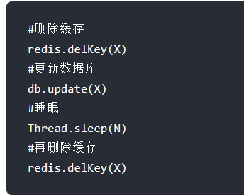

  ​		加了个睡眠时间，主要是为了确保请求 A 在睡眠的时候，请求 B 能够在这这一段时间完成「从数据库读取数据，再把缺失的缓存写入缓存」的操作，然后请求 A 睡眠完，再删除缓存。所以，请求 A 的睡眠时间就需要大于请求 B 「从数据库读取数据 + 写入缓存」的时间。但是具体睡眠多久其实是个玄学，很难评估出来，所以这个方案也只是尽可能保证一致性而已，极端情况下，依然也会出现缓存不一致的现象。因此，还是比较建议用「先更新数据库，再删除缓存」的方案。

==分析第四种方案==：【写策略】先更后删

- 这个在多线程**并发「读 + 写」很容易出现问题。 ** A请求去读取，B请求去写。


- 但是==**第四种方案优于第三种**==。==因为缓存的写入删除速度远远大于数据库的更新速度。== 上图的A请求在读完数据库后基本上瞬间就写入缓存了。**很大概率可以避免数据不一致**。


## 15.【先更后删】如何保证两个操作都能执行成功？

「先更新数据库， 再删除缓存」其实是两个操作，这次客户投诉的问题就在于，**在删除缓存（第二个操作）的时候失败了，导致缓存中的数据是旧值，而数据库是最新值**。==（哎呀，这种情况其实一般不考虑，这属于哎呀牛角尖的问题）==

==1、消息队列来重试缓存的删除==

我们可以引入**消息队列**，将第二个操作（删除缓存）要操作的数据加入到消息队列，由消费者来操作数据。

- 如果应用**删除缓存失败**，可以从消息队列中重新读取数据，然后再次删除缓存，这个就是**重试机制**。当然，如果重试超过的一定次数，还是没有成功，我们就需要向业务层发送报错信息了。
- 如果**删除缓存成功**，就要把数据从消息队列中移除，避免重复操作，否则就继续重试。

举个例子，来说明重试机制的过程。


==2、订阅 MySQL binlog，再操作缓存==

「**先更新数据库，再删缓存**」的策略的第一步是更新数据库，那么更新数据库成功，就会产生一条变更日志，记录在 binlog 里。

于是我们就可以通过订阅 binlog 日志，拿到具体要操作的数据，然后再执行缓存删除，阿里巴巴开源的 Canal 中间件就是基于这个实现的。

Canal 模拟 MySQL 主从复制的交互协议，把自己伪装成一个 MySQL 的从节点，向 MySQL 主节点发送 dump 请求，MySQL 收到请求后，就会开始推送 Binlog 给 Canal，Canal 解析 Binlog 字节流之后，转换为便于读取的结构化数据，供下游程序订阅使用。

下图是 Canal 的工作原理：

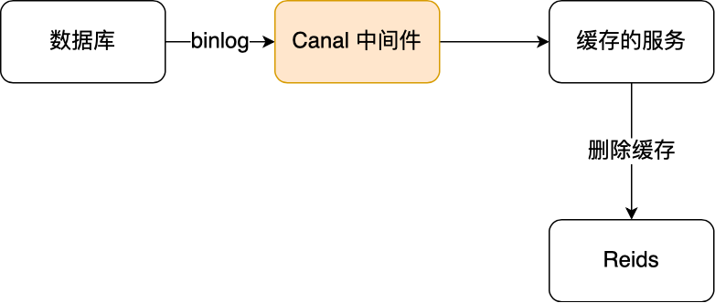

所以，**如果要想保证「先更新数据库，再删缓存」策略第二个操作能执行成功，我们可以使用「消息队列来重试缓存的删除」，或者「订阅 MySQL binlog 再操作缓存」，这两种方法有一个共同的特点，都是采用异步操作缓存。**


## ==16.什么是缓存雪崩？==

> 引入了缓存层，就会有缓存异常的三个问题，分别是**缓存雪崩、缓存击穿、缓存穿透**。这三个问题也是面试中很常考察的问题，我们不光要清楚地知道它们是怎么发生，还需要知道如何解决它们。

缓存雪崩：**缓存在某一个时刻出现大规模的key失效**，那么就会导致大量的请求打在了数据库上面，导致数据库压力巨大，如果在高并发的情况下，可能瞬间就会导致数据库宕机。这时候如果运维马上又重启数据库，马上又会有新的流量把数据库打死。

原因：出现同时大规模失效的原因有两种：**第一种是Redis宕机**，第二种可能就是**采用了相同的过期时间**。

解决方案：

- 1、事前（预防大规模失效）

  - **均匀过期：设置不同的过期时间，让缓存失效的时间尽量均匀**
  - **分级缓存：第一级缓存失效的基础上，访问二级缓存，每一级缓存的失效时间都不同。**

  - **集群来保证Redis缓存的高可用，防止Redis宕机导致缓存雪崩。**可以使用主从+哨兵，Redis集群来避免 Redis 全盘崩溃的情况。

- 2、事中（主要是降低打在数据库上的请求数量）

  - **互斥锁：在缓存失效后，通过互斥锁或者队列来控制读数据写缓存的线程数量**，比如某个key只允许一个线程查询数据和写缓存，其他线程等待。这种方式会阻塞其他的线程，此时**系统的吞吐量会下降**
  - **使用熔断机制，限流降级。当流量达到一定的阈值，直接返回"系统拥挤"之类的提示**，防止过多的请求打在数据库上将数据库击垮，至少能保证一部分用户是可以正常使用，其他用户多刷新几次也能得到结果。

- 3、事后

  - **开启Redis持久化机制，出现宕机后可以尽快恢复缓存数据，一旦重启，就能从磁盘上自动加载数据恢复内存中的数据。**


## 17.什么是缓存击穿？

> 引入了缓存层，就会有缓存异常的三个问题，分别是**缓存雪崩、缓存击穿、缓存穿透**。这三个问题也是面试中很常考察的问题，我们不光要清楚地知道它们是怎么发生，还需要知道如何解决它们。

缓存击穿：跟缓存雪崩有点类似，缓存雪崩是大规模的key失效，而**缓存击穿是某个热点的key失效**，大并发集中对其进行请求，就会造成大量请求读缓存没读到数据，从而导致高并发访问数据库，引起数据库压力剧增。

解决方案：

- 1、事前（预防热点key失效）

  - **热点数据缓存永远不过期。**永不过期实际包含两层意思:

    物理不过期，针对热点key不设置过期时间

    逻辑过期，设置过期时间，如果发现要过期了，通过一个后台的异步线程进行缓存的构建。

- 2、事中（主要是降低打在数据库上的请求数量）
  - **互斥锁：在缓存失效后，通过互斥锁或者队列来控制读数据写缓存的线程数量**，比如某个key只允许一个线程查询数据和写缓存，其他线程等待。这种方式会阻塞其他的线程，此时**系统的吞吐量会下降**
  - **使用熔断机制，限流降级。当流量达到一定的阈值，直接返回"系统拥挤"之类的提示**，防止过多的请求打在数据库上将数据库击垮，至少能保证一部分用户是可以正常使用，其他用户多刷新几次也能得到结果。

- 3、事后（也是预防热点key失效）


## 18.什么是缓存穿透？

> 引入了缓存层，就会有缓存异常的三个问题，分别是**缓存雪崩、缓存击穿、缓存穿透**。这三个问题也是面试中很常考察的问题，我们不光要清楚地知道它们是怎么发生，还需要知道如何解决它们。

**缓存穿透：**是指**用户请求的数据在缓存中不存在，同时在数据库中也不存在**，导致用户每次请求该数据都要去数据库中查询一遍，并且无法去构建缓存数据。如果有恶意攻击不断请求系统中不存在的数据，会导致短时间大量请求落在数据库上，造成数据库压力过大，甚至导致数据库承受不住而宕机崩溃。

**解法方法：**这个就不分事前事后事中了，反正事中永远都是降低打在数据库上的请求，但是缓存穿透基本上都是黑客恶意为之，我们遇到后，马上解决就行了。

- **将无效的key存放进Redis中**

  当出现Redis查不到数据，数据库也查不到数据的情况，我们就把这个key保存到Redis中，设置
  value="null"，并设置其过期时间极短，后面再出现查询这个key的请求的时候，直接返回null，就不需要再查询数据库了。但==这种处理方式是有问题的==，假如传进来的这个不存在的Key值每次都是随机的，那存进Redis也没有意义。

- **使用布隆过滤器**

  如果布隆过滤器判定某个key不存在布隆过滤器中，那么就一定不存在，如果判定某个key存在，那么很大可能是存在(存在一定的误判率)。于是==我们可以在缓存之前再加一个布隆过滤器，将数据库中的所有key都存储在布隆过滤器中，在查询Redis前先去布隆过滤器查询key是否存在==，如果不存在就直接返回，不让其访问数据库，从而避免了对底层存储系统的查询压力。布隆过滤器由于是基于哈希函数实现查找的，高效查找的同时**存在哈希冲突的可能性**，比如数据 x 和数据 y 可能都落在第 1、4、6 位置，而事实上，可能数据库中并不存在数据 y，存在误判的情况。所以，**查询布隆过滤器说数据存在，并不一定证明数据库中存在这个数据，但是查询到数据不存在，数据库中一定就不存在这个数据**。
  
  > 我们可以在写入数据库数据时，使用布隆过滤器做个标记，然后在用户请求到来时，业务线程确认缓存失效后，可以通过查询布隆过滤器快速判断数据是否存在，如果不存在，就不用通过查询数据库来判断数据是否存在。即使发生了缓存穿透，大量请求只会查询 Redis 和布隆过滤器，而不会查询数据库，保证了数据库能正常运行，Redis 自身也是支持布隆过滤器的。
  >
  > 那问题来了，布隆过滤器是如何工作的呢？接下来，我介绍下。
  >
  > 布隆过滤器由「初始值都为 0 的位图数组」和「 N 个哈希函数」两部分组成。当我们在写入数据库数据时，在布隆过滤器里做个标记，这样下次查询数据是否在数据库时，只需要查询布隆过滤器，如果查询到数据没有被标记，说明不在数据库中。
  >
  > 布隆过滤器会通过 3 个操作完成标记：
  >
  > - 第一步，使用 N 个哈希函数分别对数据做哈希计算，得到 N 个哈希值；
  > - 第二步，将第一步得到的 N 个哈希值对位图数组的长度取模，得到每个哈希值在位图数组的对应位置。
  > - 第三步，将每个哈希值在位图数组的对应位置的值设置为 1；
  >
  > 举个例子，假设有一个位图数组长度为 8，哈希函数 3 个的布隆过滤器。
  >
  > 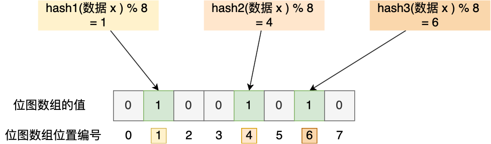
  >
  > 在数据库写入数据 x 后，把数据 x 标记在布隆过滤器时，数据 x 会被 3 个哈希函数分别计算出 3 个哈希值，然后在对这 3 个哈希值对 8 取模，假设取模的结果为 1、4、6，然后把位图数组的第 1、4、6 位置的值设置为 1。**当应用要查询数据 x 是否数据库时，通过布隆过滤器只要查到位图数组的第 1、4、6 位置的值是否全为 1，只要有一个为 0，就认为数据 x 不在数据库中**。
  >
  > 布隆过滤器由于是基于哈希函数实现查找的，高效查找的同时**存在哈希冲突的可能性**，比如数据 x 和数据 y 可能都落在第 1、4、6 位置，而事实上，可能数据库中并不存在数据 y，存在误判的情况。
  >
  > 所以，**查询布隆过滤器说数据存在，并不一定证明数据库中存在这个数据，但是查询到数据不存在，数据库中一定就不存在这个数据**。
  
  

## 19.什么是缓存预热?

缓存预热是指系统上线后，**提前将相关的缓存数据加载到缓存系统。**避免在用户请求的时候，先查询数据库，然后再将数据缓存的问题，用户直接查询事先被预热的缓存数据。

如果不进行预热，那么Redis初始状态数据为空，系统上线初期，对于高并发的流量，都会访问到数据库中，对数据库造成流量的压力。

## ==20.Redis 是单线程吗？为什么？==

网络上说的Redis是单线程，通常是**指在Redis 6.0之前**，其核心网络模型（网络 I/O 和执行命令）使用的是单线程。

然后**Redis6.0引入多线程I/O**，但只是用来处理网络数据的读写和协议的解析，而执行命令依旧是单线程。   

之所以使用单线程，是因为**CPU 并不是制约 Redis 性能表现的瓶颈所在**，更多情况下是受到**内存大小和网络I/O的限制**，多线程模型虽然在某些方面表现优异，但是它却引入了程序执行顺序的不确定性，带来了并发读写的一系列问题。

​                                

## 21.Redis 6.0为何引入多线程?

Redis之前的版本，处理网络 I/O 和执行命令都是单线程。后来互联网业务系统所要处理的线上流量越来越大，**Redis 的性能瓶颈在网络 I/O 的处理上越来越明显**，Redis的单线程模式会导致系统消耗很多CPU时间在网络IO上从而降低吞吐量，所以说所以为了提高网络 I/O 的并行度，Redis 6.0 对于网络 I/O 采用多线程来处理。**但是对于命令的执行，Redis 仍然使用单线程来处理**。

==Redis 6.0 版本引入的多线程 I/O 特性对性能提升至少是一倍以上==


## 22.Redis 6.0多线程的实现机制?

流程简述如下:

- 主线程负责接收建立连接请求，获取Socket放入全局等待读处理队列。
- 主线程处理完读事件之后，通过 RR (Round Robin）将这些连接分配给这些IO线程。
- 主线程阻塞等待IO线程读取Socket完毕。
- 主线程通过单线程的方式执行请求命令，请求数据读取并解析完成，但并不执行。
- 主线程阻塞等待lO线程将数据回写Socket完毕。


## 23.Redis 6.0开启多线程后，是否会存在线程并发安全问题?

从实现机制可以看出，Redis 的==多线程部分只是用来处理网络数据的读写和协议解析，执行命令仍然是单线程顺序执行。==


## ==24.redis如何实现高可用？==

要想设计一个高可用的 Redis 服务，一定要从 **Redis 的多服务节点**来考虑，比如 Redis 的主从复制、哨兵模式、切片集群。


##  ==25.Redis常见使用方式？主从，哨兵，切片==

Redis的几种常见使用方式包括:

- Redis单副本;（单个Redis使用，我们就是这种）
- Redis多副本（主从）；
- Redis Sentinel (哨兵）；
- Redis Cluster;（切片集群）

**使用场景：**

- 如果数据量很少，主要是承载高并发高性能的场景，比如缓存一般就几个G的话，单机足够了。

- **主从模式:** 

  - 一主多从，读写分离，主负责写和读，从只负责读。同时主写时会异步的将操作同步给从。
  - master节点挂掉后，需要手动指定新的master，可用性不高，基本不用。
  - 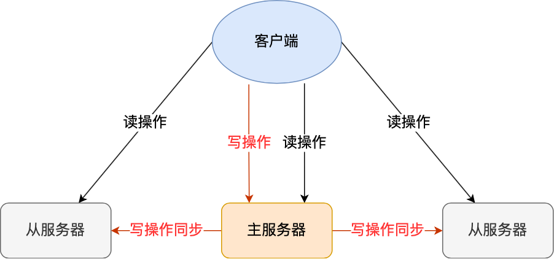

- **哨兵模式:** 

  - Redis Sentinel 实现Redis集群高可用，在主从复制实现集群的基础下，多了一个Sentinel角色来帮助我们监控Redis节点的运行状态并自动实现故障转移。Redis Sentinel的节点数量要满足2n+1 (n>=1)的奇数个。

  - master节点挂掉后，哨兵进程会主动选举新的 master，可用性高，但是每个节点存储的数据是一样的，浪费内存空间。数据量不是很多，集群规模不是很大，需要自动容错容灾的时候使用。

  - 多个sentinel节点**通过投票的方式来**确定master节点是否出现故障。建议将哨兵Sentinel配置成**单数且大于等于3台。**

  - 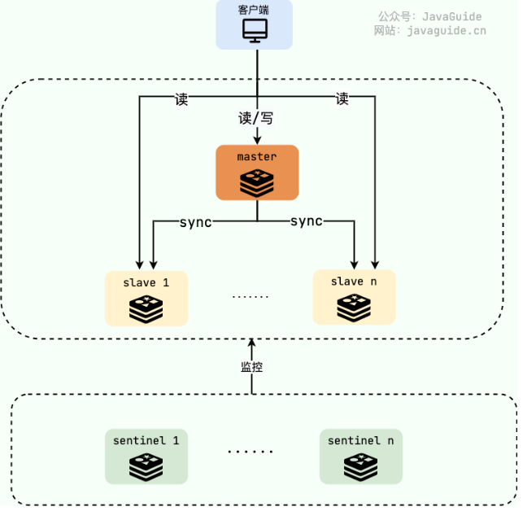

    

  **Sentinel如何检测节点是否下线?**

  Redis Sentinel中有两个下线(Down)的概念:

  ​	**主观下线(SDOWN) ：**sentinel节点认为某个Redis节点已经下线了(主观下线)，但还不是很确定，需要其他sentinel节点的投票

  ​	**客观下线(ODOWN)：**法定数量(通常为过半)的sentinel节点认定某个Redis节点已经下线(客观下线)，那它就算是真的下线了。

​		每个sentinel节点以每秒钟一次的频率向整个集群中的master、slave以及其他sentinel节点发送一个PING命令。


如果被认定为主观下线的是 **slave**的话, sentinel不会做什么事情，因为 slave下线对Redis集群的影响不大，Redis集群对外正常提供服务。但如果是master被认定为主观下线就不一样了，sentinel整体还要对其进行进一步核实，确保master是真的下线了。

所有sentinel节点要以每秒一次的频率确认**master**的确下线了，当法定数量（通常为过半)的sentinel节点认定 master已经下线, master才被判定为**客观下线(ODOWN)**。这样做的目的是为了防止误判,毕竟故障转移的开销还是比较大的，这也是为什么Redis官方推荐部署多个sentinel节点(哨兵集群)。

随后,sentinel中会有一个**Leader**的角色来负责故障转移，也就是自动地从slave中选出一个**新的master**并执行完相关的一些工作(比如通知slave新的master连接信息，让它们执行replicaof成为新的master 的 slave)。

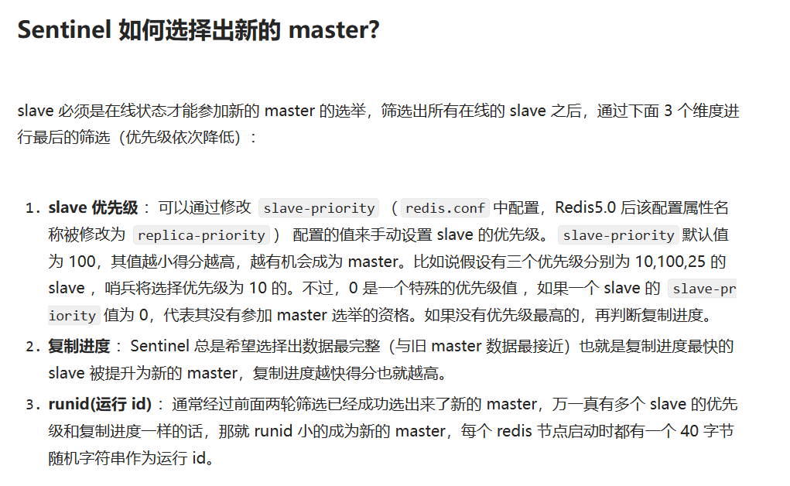


- **Redis cluster：**

  - 简单来说，Redis 切片集群就是部署**多台Redis主节点(master)，**这些节点之间平等，**同时对外提供读/写服务**。缓存的数据库相对均匀地分布在这些Redis主节点上，客户端的请求通过路由规则转发到目标master 上。除此以外，我们需要保证集群中每一个master的高可用，可以通过主从复制给每个master配置一个或者多个从节点(slave)。

  - 主要是针对海量数据+高并发+高可用的场景，如果是海量数据，如果你的数据量很大，那么建议就用Redis cluster，所有master的容量总和就是Redis cluster可缓存的数据容量。

    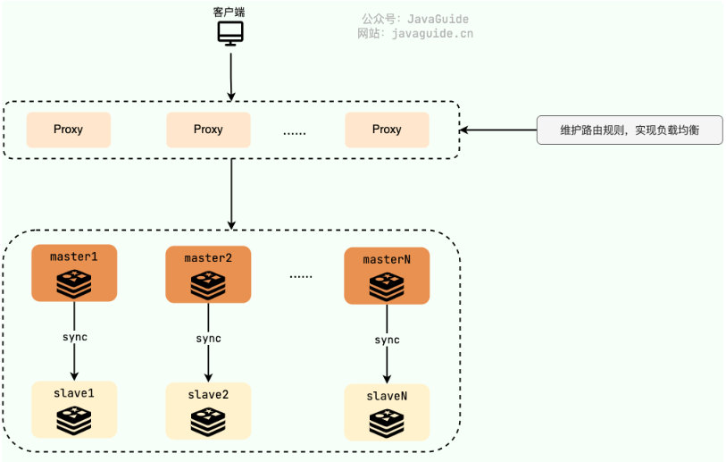

    **Redis 切片集群对于横向扩展非常友好，只需要增加Redis 节点到集群中即可。**
  
  - edis Cluster 方案采用哈希槽（Hash Slot），来处理数据和节点之间的映射关系。在 Redis Cluster 方案中，**一个切片集群共有 16384 个哈希槽**，这些哈希槽类似于数据分区，每个键值对都会根据它的 key，被映射到一个哈希槽中，

## 23-1.集群脑裂导致数据丢失怎么办？

**1、什么是脑裂？**

脑裂是哨兵集群时会发生的一个现象。

- 在 Redis 主从架构中，部署方式一般是「一主多从」，主节点提供写操作，从节点提供读操作。 如果主节点的网络突然发生了问题，它与所有的从节点都失联了，但是此时的主节点和客户端的网络是正常的，所以客户端还在向这个失联的主节点写数据，此时这些数据被主节点缓存到了缓冲区里，因为主从节点之间的网络问题，这些数据都是无法同步给从节点的。
- 这时，**哨兵也发现主节点失联了**，它就认为主节点挂了（但实际上主节点正常运行，只是网络出问题了），于是哨兵就会在「从节点」中选举出一个 leader 作为主节点，这时集群就有两个主节点了 —— **脑裂出现了**。
- 然后，网络突然好了，哨兵因为之前已经选举出一个新主节点了，它就会把旧主节点（A）降级为从节点，然后从节点（A）会向新主节点请求数据同步，因为第一次同步是全量同步的方式，此时的从节点（A）会清空掉自己本地的数据，然后再做全量同步。所以，之前客户端在过程 A 写入的数据就会丢失了，也就是集群产生脑裂数据丢失的问题。

**总结一句话就是：**由于网络问题，集群节点之间失去联系。主从数据不同步；重新平衡选举，产生两个主服务。等网络恢复，旧主节点会降级为从节点，再与新主节点进行同步复制的时候，由于会从节点会清空自己的缓冲区，所以导致之前客户端写入的数据丢失了。

**2、解决方案**

当主节点发现从节点下线或者通信超时的总数量小于阈值时，那么禁止主节点进行写数据，直接把错误返回给客户端。


## 26.Redis如何做内存优化?

- **控制key的数量。当使用Redis存储大量数据时，通常会存在大量键，过多的键同样会消耗大量内存。**Redis本质是一个数据结构服务器，它为我们提供多种数据结构，如String, hash，list，set等结构。使用Redis时不要进入一个误区，大量使用getlset这样的API，把Redis当成Memcached使用。对于存储相同的数据内容利用Redis的数据结构降低外层键的数量，也可以节省大量内存。

- **缩减键值对象，降低Redis内存使用最直接的方式就是缩减键（key)和值(value)的长度。**

- **编码优化。Redis对外提供了string,list,hash,set等类型，但是Redis内部针对不同类型存在编码的概念，所谓编码就是具体使用哪种底层数据结构来实现。**编码不同将直接影响数据的内存占用


## ==27.如果现在有个读超高并发的系统，用Redis来抗住大部分读请求，你会怎么设计?==

如果是读高并发的话，先看读并发的数量级是多少，因为Redis单机的读QPS在万级（10W），每秒几万没问题，使用**一主多从+哨兵集群的缓存架构来承载每秒10W+的读并发，主从复制，读写分离。**

**使用哨兵集群主要是提高缓存架构的可用性，解决单点故障问题。**主库负责写，多个从库负责读，支持水平扩容，根据读请求的QPS来决定加多少个Redis从实例。如果读并发继续增加的话，只需要增加Redis从实例就行了。

==如果需要缓存1T+的数据，选择Redis cluster模式，==每个主节点存一部分数据，假设一个master存32G，那只需要n*32G>=1T，n个这样的master节点就可以支持1T+的海量数据的存储了。

> ==目前Redis**单主**的瓶颈不在于读写的并发，而在于内存容量== ，即使是一主多从也是不能解决该问题，因为一主多从架构下，多个slave的数据和master的完全一样。假如master是10G那slave也只能存10G数据。所以数据量受单主的影响。
>
> 而这个时候又需要缓存海量数据，那就必须得有多主了，并且多个主保存的数据还不能一样。Redis官方给出的 Redis cluster模式完美的解决了这个问题。


# 分布式锁

## 1.什么是分布式锁?为什么用分布式锁?

锁在程序中的作用就是**同步工具**，**保证共享资源在同一时刻只能被一个线程访问**，Java中的锁我们都很熟悉了，像**synchronized 、Lock都是我们经常使用的**，但是**Java的锁只能保证单个系统的时候有效，分布式集群环境就无能为力了**，这个时候我们就需要用到==分布式锁==。

分布式锁，顾名思义，就是**分布式项目开发中用到的锁，可以用来控制分布式系统之间同步访问共享资源。**

思路是：在**整个系统提供一个全局、唯一的获取锁的" 东西 "，然后每个系统在需要加锁时，都去问这个"东西"拿到一把锁，这样不同的系统拿到的就可以认为是同一把锁。**==至于这个"东西"，可以是Redis、Zookeeper，也可以是数据库。==

一般来说，分布式锁需要满足的特性有这么几点:

**1、互斥性：**在任何时刻，对于==同一条数据，只有一台应用可以获取到分布式锁==;

**2、高可用性：**在分布式场景下，==一小部分服务器宕机不影响正常使用==，这种情况就需要将提供分布式锁的服务以集群的方式部署;

**3、防止锁超时：**如果客户端没有主动释放锁，服务器会在==一段时间之后自动释放锁==，防止客户端宕机或者网络不可达时产生死锁;

**4、独占性：**==加锁解锁必须由同一台服务器进行==，也就是锁的持有者才可以释放锁，不能出现你加的锁，别人给你解锁了。


## 2.常见的分布式锁有哪些解决方案?

实现分布式锁目前有三种流行方案，即基于关系型数据库、Redis、ZooKeeper的方案

**1、基于关系型数据库，如MySQL**

基于关系型数据库实现分布式锁，==是依赖数据库的唯一性来实现资源锁定，比如主键和唯一索引等。==

缺点:

- 这把锁**强依赖数据库的可用性**，**数据库是一个单点，一旦数据库挂掉，会导致业务系统不可用。**
- **这把锁没有失效时间，一旦解锁操作失败，**就会导致锁记录一直在数据库中，其他线程无法再获得到锁。
- **这把锁只能是非阻塞的，因为数据的insert操作，一旦插入失败就会直接报错。**没有获得锁的线程并不会进入排队队列，要想再次获得锁就要再次触发获得锁操作。
- **这把锁是非重入的，同一个线程在没有释放锁之前无法再次获得该锁。**

**2、基于Redis实现优点:**

​		==Redis锁实现简单，理解逻辑简单，性能好，可以支撑高并发的获取、释放锁操作。==

 缺点:     

- ==Redis容易单点故障，集群部署，并不是强一致性的，锁的不够健壮;==
- ==key的过期时间设置多少不明确==，只能根据实际情况调整;
- ==需要自己不断去尝试获取锁，比较消耗性能。==

**3、基于zookeeper优点:**

zookeeper天生设计定位就是分布式协调，强一致性，锁很健壮。[如果获取不到锁，只需要添加一个监听器就可以了，不用一直轮询，性能消耗较小。

缺点:

在高请求高并发下，系统疯狂的加锁释放锁，最后zookeeper承受不住这么大的压力可能会存在宕机的风险。


## 3.如何用 Redis 实现分布式锁的？

分布式锁是用于分布式环境下并发控制的一种机制，用于控制某个资源在同一时刻只能被一个应用所使用。如下图所示：

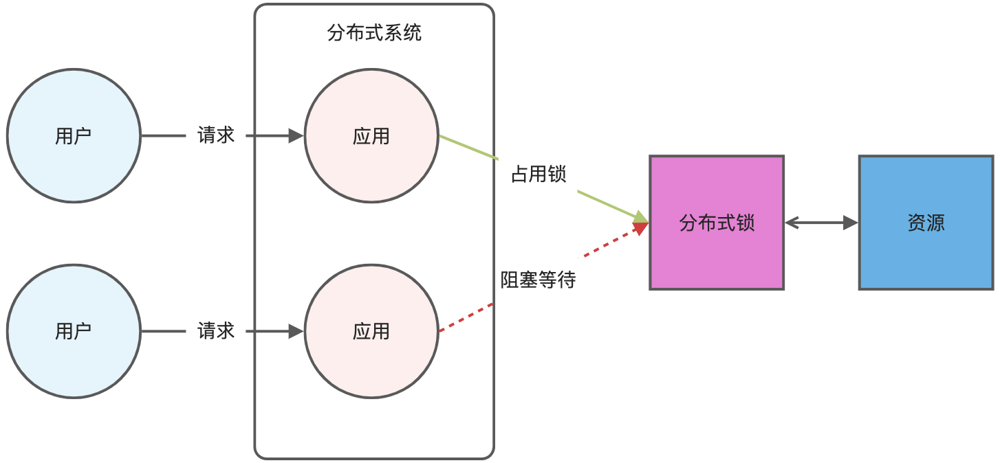

Redis 本身可以被多个客户端共享访问，正好就是一个共享存储系统，可以用来保存分布式锁，而且 **Redis 的读写性能高，可以应对高并发的锁操作场景。**

Redis 的 **SET 命令**有个 NX 参数可以实现「key不存在才插入，Key存在则不操作」，所以可以用它来实现分布式锁：

- 如果 key 不存在，则显示插入成功，可以用来表示加锁成功；
- 如果 key 存在，则会显示插入失败，可以用来表示加锁失败。

**基于 Redis 节点实现分布式锁时，对于加锁操作，我们需要满足三个条件。**

- 加锁包括了读取锁变量、检查锁变量值和设置锁变量值三个操作，但需要==以原子操作的方式完成==，所以，我们==使用 SET 命令带上 NX 选项来实现加锁；==
- ==Key需要设置过期时间==，以免客户端拿到锁后发生异常，导致锁一直无法释放，所以，我们在 SET 命令执行时加上 EX/PX 选项，设置其过期时间；
- ==key对应的Value的值需要能区分来自不同客户端的加锁操作==，以免在释放锁时，出现误释放操作，所以，我们使用 SET 命令设置Value时，每个客户端设置的值是一个唯一值，用于标识客户端；

满足这三个条件的分布式命令如下：

```c
SET lock_key unique_value NX PX 10000 #set成功会返回1，失败返回0
```

- lock_key 就是 key 键；就是被操纵资源的唯一属性，哪个系统成功set了这个key，哪个系统就拥有了该锁
- unique_value 是value值，是客户端生成的唯一的标识，区分来自不同客户端的锁操作；
- NX 代表只在 lock_key 不存在时，才对 lock_key 进行设置操作；实现原子操作。
- PX 10000 表示设置 lock_key 的过期时间为 10s，这是为了避免客户端发生异常而无法释放锁。

**【解锁】**而解锁的过程就是将 lock_key 键删除（del lock_key），但不能乱删，要保证执行操作的客户端就是加锁的客户端。所以，解锁的时候，我们要先判断锁的 unique_value 是否为加锁客户端，是的话，才将 lock_key 键删除。

可以看到，**解锁是有两个操作，这时就需要 Lua 脚本来保证解锁的原子性**，因为 Redis 在执行 Lua 脚本时，可以以原子性的方式执行，保证了锁释放操作的原子性。

==这样一来，就通过使用 SET 命令和 Lua 脚本在 Redis 单节点上完成了分布式锁的加锁和解锁。==


## 4.基于 Redis 实现分布式锁的**缺点**：


- **锁过期时间不好设置；（没有续命操作）**多个服务同时使用共享资源

- **不可重试；（自旋操作）**无法保证上锁成功
- **不可重入；**很容易出现死锁


## 5.Redission分布式框架

基于`set nx px `和`Lua脚本`进行分布式锁的加锁解锁问题：

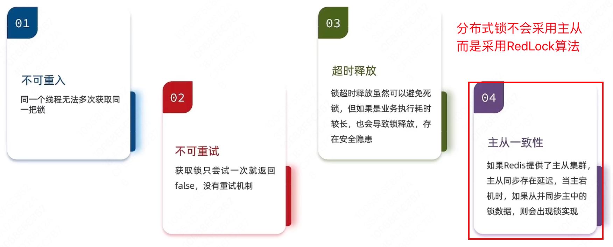

Redisson是一个在Redis的基础上实现的Java驻内存数据网格（In-Memory Data Grid）。它不仅提供了一系列的分布式的Java常用对象，还提供了许多分布式服务，其中就包含了各种分布式锁的实现。

### 5.3.0 加锁解锁方式

通过Lua脚本进行。

- 加锁的Lua脚本

```lua
local key = KEYS[1]; -- 锁的key
local threadId = ARGV[1]; -- 线程唯一标识
local releaseTime = ARGV[2]; -- 锁的自动释放时间
-- 判断是否存在
if(redis.call('exists', key) == 0) then
    -- 不存在, 获取锁
    redis.call('hset', key, threadId, '1'); 
    -- 设置有效期
    redis.call('expire', key, releaseTime); 
    return 1; -- 返回结果
end;
-- 锁已经存在，判断threadId是否是自己
if(redis.call('hexists', key, threadId) == 1) then
    -- 存在, 获取锁，重入次数+1
    redis.call('hincrby', key, threadId, '1'); 
    -- 设置有效期
    redis.call('expire', key, releaseTime); 
    return 1; -- 返回结果
end;
return 0; -- 代码走到这里,说明获取锁的不是自己，获取锁失败
```

- 解锁的Lua脚本

```lua
local key = KEYS[1]; -- 锁的key
local threadId = ARGV[1]; -- 线程唯一标识
local releaseTime = ARGV[2]; -- 锁的自动释放时间
-- 判断当前锁是否还是被自己持有
if (redis.call('HEXISTS', key, threadId) == 0) then
    return nil; -- 如果已经不是自己，则直接返回
end;
-- 是自己的锁，则重入次数-1
local count = redis.call('HINCRBY', key, threadId, -1);
-- 判断是否重入次数是否已经为0 
if (count > 0) then
    -- 大于0说明不能释放锁，重置有效期然后返回
    redis.call('EXPIRE', key, releaseTime);
    return nil;
else  -- 等于0说明可以释放锁，直接删除
    redis.call('DEL', key);
    return nil;
end;
```


### 5.3.1 可重入机制

这个的实现很简单，其实就是使用hash结构存储锁，key——锁（资源）的唯一标识；field——拥有锁的线程Id；value——锁的获取次数。

> 在Java里面的ReentrantLock锁中，他是借助于底层的一个voaltile的一个state变量来记录重入的状态的，比如当前没有人持有这把锁，那么state=0，假如有人持有这把锁，那么state=1，如果持有这把锁的人再次持有这把锁，那么state就会+1 。对于synchronized而言，他在c语言代码中会有一个count，原理和state类似，也是重入一次就加一，释放一次就-1 ，直到减少成0 时，表示当前这把锁没有被人持有。

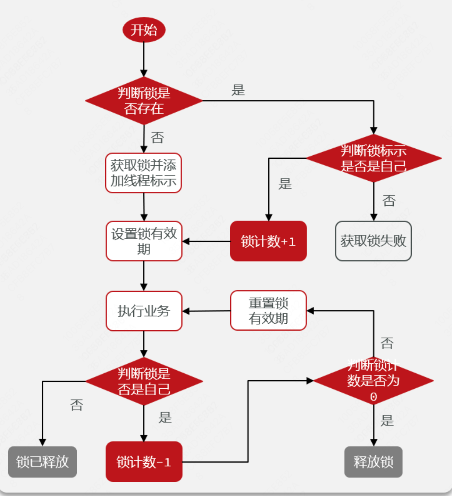

注意到每次获取锁成功或释放锁后都要重新设置锁的有效期，这是为了下面的业务有足够的时间去执行~

很简单吧，这里是获取锁成功后的看门狗机制和获取锁失败后的自选机制，就没有写了，看后面的内容。


### 5.3.2 看门狗机制

在获取锁成功、并且没有手动代码设置releaseTime的情况下，启动看门狗机制。（默认releaseTime=30s，每隔releaseTime/3秒，判断当前线程是否继续拥有锁，重置超时时间，这个默认时间可以通过配置文件设置）

**步骤如下：**

1. 进入trylock()，如果leaseTime如果为-1，那么就会设置默认时间为30S，并且触发watchDog逻辑 (如下图)，对锁不断的进行续约，从而让其永不超时...
2. 如果不为-1，则按照传入的时间。
3. 第一次tryAcquire后，返回**ttl** (锁的剩余是时间) ，如果ttl为null，说明锁已经获取成功，直接return即可。
4. 如果ttl返回不为nul，则返回锁的剩余有效期。此时代表获取锁失败~ 接下来开始进入重试逻辑..

**总结：**

- 本质上就是搞了一个定时任务。
- 最后，释放锁的时候会取消这个定时任务（value=0），删除这个key-hash。


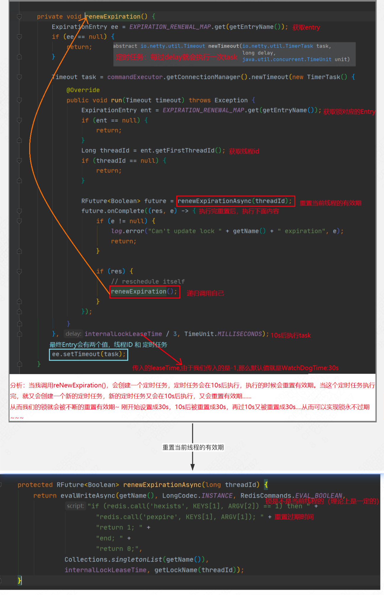

- 释放锁的操作：

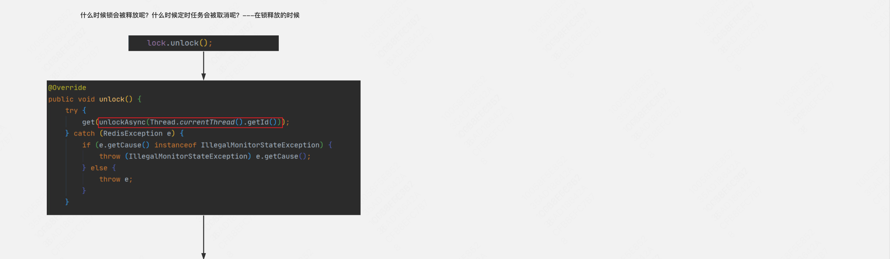

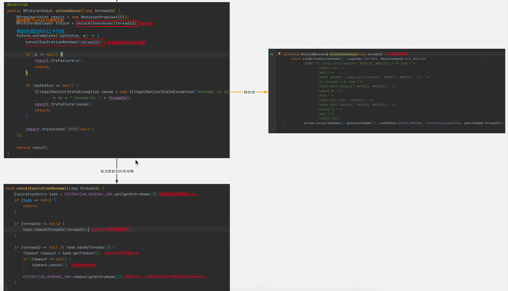


### 5.3.3 可重试机制（自旋）

这里可以设置，尝试获取锁的最大时间，这和锁的过期时间是两个概念哦，如果不设置的话，就是一定获取锁，不断尝试。

**步骤：**

1. 同上一节，看门狗机制的步骤，在获取锁失败后，进行重试阶段（ttl不为null）；
2. 用waitTime — tryAcquire花费的时间，得到剩余等待时间;
3. 如果剩余等待时间 >0，则继续重试。重试时，通过用redis的消息订阅或信号量的形式进行的。具体就是，当锁释放的时候，会发送一条消息通知我，锁释放了，你可以来获取了。从而再次执行获取锁的逻辑
4. 如果再次没获取到锁，就重试，直到获取到锁或等待时间用完了就返回~

**总结：**

​	这里利用的就是Redis的 pub/sub机制，避免一直自旋让cpu空转。然后还有一个手动设置的waitTime等待时间，不设置的话，就是永久，即一直尝试直到获取锁。

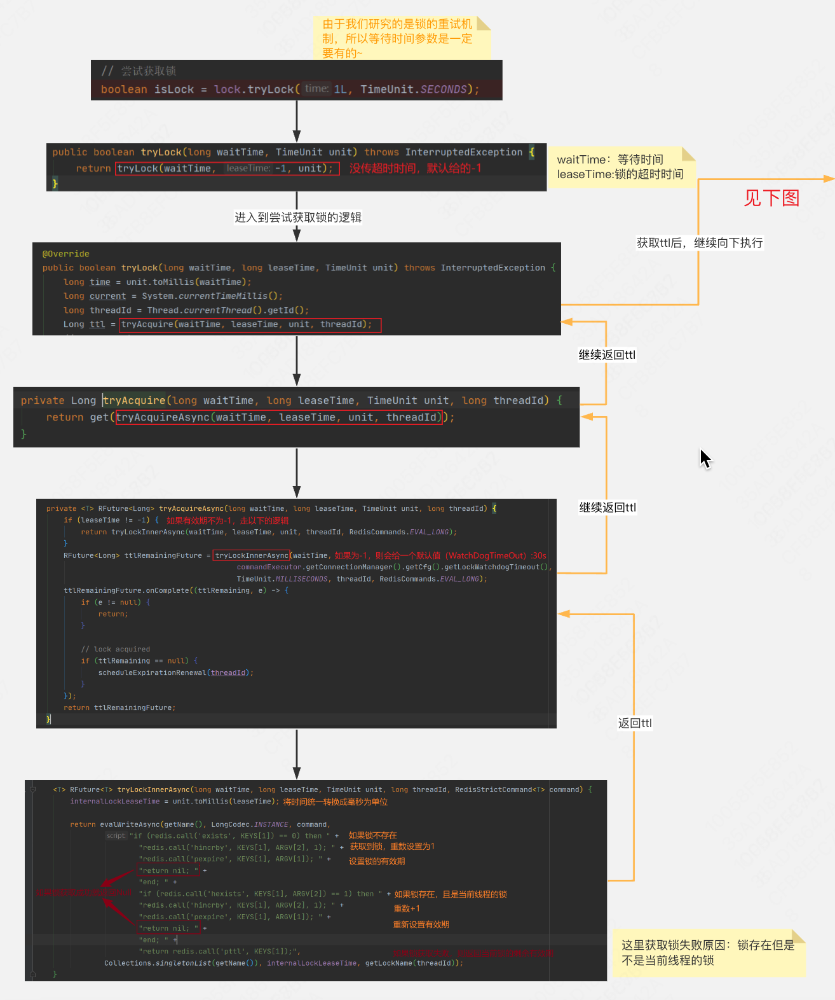

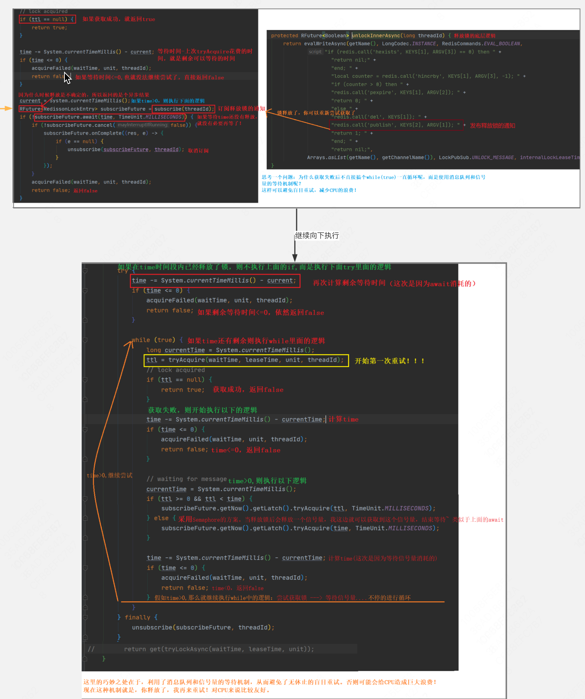


