[小林coding (xiaolincoding.com)](https://xiaolincoding.com/)

# 一、计算机网络


**什么是网络编程？**

- 网络编程可以让程序与网络上的其他设备中的程序进行数据交互。


## ==1.计算机网络的各层协议及作用?（实习-美团）==

计算机网络体系可以大致分为一下三种，OSI七层模型、TCP/IP四层模型和五层模型。

- **OSI七层模型：**大而全，但是比较复杂、而且是先==有了理论模型，没有实际应用==。
- **TCP/IP四层模型：**是由==实际应用发展总结出来的，事实上的国际标准。==，从实质上讲，TCP/IP只有最上面三层，最下面一层没有什么具体内容，TCP/IP参考模型没有真正描述这一层的实现。
- **·五层模型：**五层模型==只出现在计算机网络教学过程==中，这是对七层模型和四层模型的一个折中，既简洁又能将概念阐述清楚。

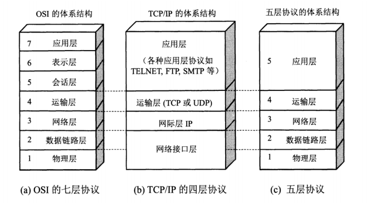

**传输层的2个常见协议：**

- TCP(Transmission Control Protocol) ：传输控制协议
- UDP(User Datagram Protocol)：用户数据报协议

七层网络体系结构各层的主要功能：

- **应用层：**==为应用程序提供交互服务==。在互联网中的应用层协议很多，如域名系统DNS，支持万维网
  应用的HTTP协议，支持电子邮件的SMTP协议等。
- **表示层：**==主要负责数据格式的转换==，如加密解密、转换翻译、压缩解压缩等。
- **会话层：**==负责在网络中的两节点之间建立、维持和终止通信==，如服务器验证用户登录便是由会话层完成的。
- **运输层：**==有时也译为传输层，向主机进程提供通用的数据传输服务==。该层主要有以下两种协议:
  - TCP: 提供面向连接的、可靠的数据传输服务;
  - UDP: 提供无连接的、尽最大努力的数据传输服务，但不保证数据传输的可靠性。
- **网络层：**==选择合适的路由和交换结点，确保数据及时传送==。主要包括==IP协议。==
- **数据链路层：**数据链路层通常简称为链路层。==将网络层传下来的IP数据包组装成帧，并再相邻节点的链路上传送帧。==
- **物理层：**==实现相邻节点间比特流的透明传输==，尽可能屏蔽传输介质和通信手段的差异。


## ==1-1.TCP/IP网络模型（实习-美团）==

**TCP/IP 四层模型** 是目前被广泛采用的一种模型,我们可以将 TCP / IP 模型看作是 OSI 七层模型的精简版本，由以下 4 层组成：

1. **应用层**（HTTP、DNS、SMTP、SSH、FTP）
2. **传输层**（TCP、UDP）
3. **网络层**（IP、ICMP）
4. **网络接口层**


## 2.TCP和UDP的区别?


总结;

**TCP用于在传输层有必要实现可靠传输的情况，UDP用于对高速传输和实时性有较高要求的通信。**TCP和UDP应该根据应用目的按需使用。


## 3.详细介绍一下TCP的三次握手机制?

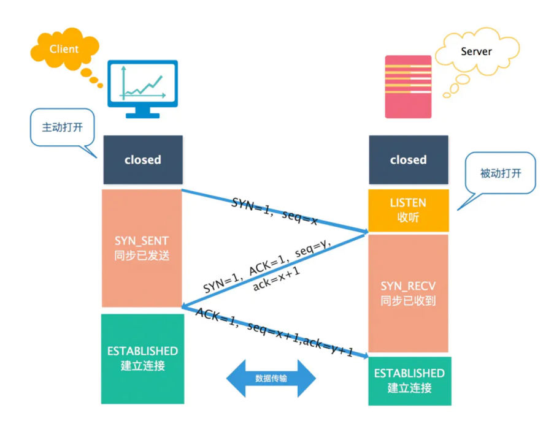

- 第一次握手：客户端请求建立连接，向服务端发送一个**同步报文(SYN=1)**，同时选择一个**随机数seq=x作为初始序列号**，并进入==SYN_SENT==状态，等待服务器确认。==（SYN包）==
- 第二次握手：服务端收到连接请求报文后，如果同意建立连接，则向客户端**发送同步确认报文(SYN=1，ACK=1)，确认号为ack =x +1，**同时选择一个**随机数seq =y作为初始序列号**，此时服务器进入==SYN_RECV==状态。==（SYN+ACK包）==
- 第三次握手：客户端收到服务端的确认后，向服务端**发送一个确认报文（ACK=1)**，**确认号为ack=y + 1，序列号为seq=x+1，**客户端和服务器进入==ESTABLISHED==状态，完成三次握手。==（ACK包）==

理想状态下，TCP连接一旦建立，在通信双方中的任何一方主动关闭连接之前，TCP连接都将被一直保持下去。


## 4.为什么需要三次握手，而不是两次?

主要有三个原因:

**1、防止已过期的连接请求报文突然又传送到服务器，因而产生错误和资源浪费。**

在双方两次握手即可建立连接的情况下，假设客户端发送A报文段请求建立连接，==由于网络原因造成A暂时无法到达服务器，服务器接收不到请求报文段就不会返回确认报文段==。

客户端在长时间得不到应答的情况下重新发送请求报文段B，这次B顺利到达服务器，服务器随即返回确认报文并进入ESTABLISHED 状态，客户端在收到确认报文后也进入ESTABLISHED状态，双方建立连接并传输数据，之后正常断开连接。

此时姗姗来迟的A报文段才到达服务器，**服务器随即返回确认报文并进入ESTABLISHED状态**，但是已经进入CLOSED 状态的客户端无法再接受确认报文段，更无法进入ESTABLISHED 状态，这将导致服务器长时间单方面等待，造成资源浪费。

**2、三次握手才能让双方均确认自己和对方的收、发能力都正常。**

- 第一次握手完成：
  - 客户端：什么都无法确认，因为他只是发送处请求报文段。
  - 服务器：确认自己接收正常，对方发送正常；
- 第二次握手：
  - 客户端：确认自己收、发能力正常，并且知道对方收、发能力正常。==（客户端这边没问题了）==
  - 服务端：确认自己接收正常，对方发送正常；（同第一次）（因为我发过去了，不知道有没有成功呀，等待客户端反馈才行）
- 第三次握手：
  - 客户端确认自己收、发能力正常，并且知道对方收、发能力正常。（第二次已经确认了）
  - 服务端：确认自己的收、发能力正常，并且知道对方的收、发能力正常。==（服务端没问题了）==

**3、告知对方自己的初始序号值，并确认收到对方的初始序号值。**

TCP实现了可靠的数据传输，原因之一就是TCP报文段中维护了==序号字段和确认序号字段==，通过这两个字段双方都可以知道在自己发出的数据中，哪些是已经被对方确认接收的。

这两个字段的值会在初始序号值得基础递增，==如果是两次握手，只有客户端的初始序号可以得到确认，而服务端的初始序号则得不到确认。==

## 6.为什么要三次握手，而不是四次?


因为 ==三次握手已经可以确认双方的发送接收能力正常，双方都知道彼此已经准备好，而且也可以完成对双方初始序号值得确认，也就无需再第四次握手了。==


## 7.什么是SYN洪泛攻击?如何防范?

SYN洪泛攻击属于==DOS攻击==的一种，它利用TCP协议缺陷，通过**发送大量的半连接请求，耗费服务端CPU和内存资源。**

**原理:**

- 在三次握手过程中，服务器发送 `[SYN/ACK ]` 包（第二个包)之后、收到客户端的`[ ACK]包`（第三个包)之前的TCP连接称为==半连接( half-open connect)==，此时服务器处于**SYN_RECV**(等待客户端响应）状态。==如果接收到客户端的  [ ACK ]，则TCP连接成功，如果未接受到，则会不断重发请求直至成功。==
- SYN 攻击的攻击者在==短时间内伪造大量不存在的IP地址，向服务器不断地发送  `[SYN]包`==，服务器回复`[SYN/ACK]包`，并等待客户的确认。==由于源地址是不存在的，服务器需要不断的重发直至超时。==
- 这些==伪造的 `[SYN]包` 将长时间占用未连接队列==，影响了正常的`SYN`，导致目标系统运行缓慢、网络堵塞甚至系统瘫痪。

**检测：**当在服务器上看到大量的半连接状态时，特别是源IP地址是随机的，基本上可以断定这是一次SYN攻击。

**防范:**

- 通过==防火墙、路由器等过滤网关防护==。
- 通过==加固TCP/IP协议栈防范，如增加最大半连接数，缩短超时时间==。
- ==SYN cookies技术。==SYN Cookies是对TCP服务器端的三次握手做一些修改，==专门用来防范SYN==洪泛攻击的一种手段。


## 8.三次握手连接阶段,最后一次ACK包丢失，会发生什么?

服务端:

- 第三次的ACK包在网络中丢失，那么服务端该TCP连接状态还是 **SYN_RECV**，并且会根据TCP的**超时重传机制**，会等待3秒、6秒、12秒后重新发送**SYN+ACK包**，以便客户端重新发送ACK包。
- **如果重发指定次数之后**，仍然未收到客户端的ACK应答，那么一段时间后，服务端自动关闭这个连接。

客户端:

- ==客户端认为这个连接已经建立==，如果客户端向服务端发送数据，服务端将以==RST包（Reset，标示复位，用于异常的关闭连接）响应==。此时，客户端知道第三次握手失败。

## 9.详细介绍一下TCP的四次挥手过程?

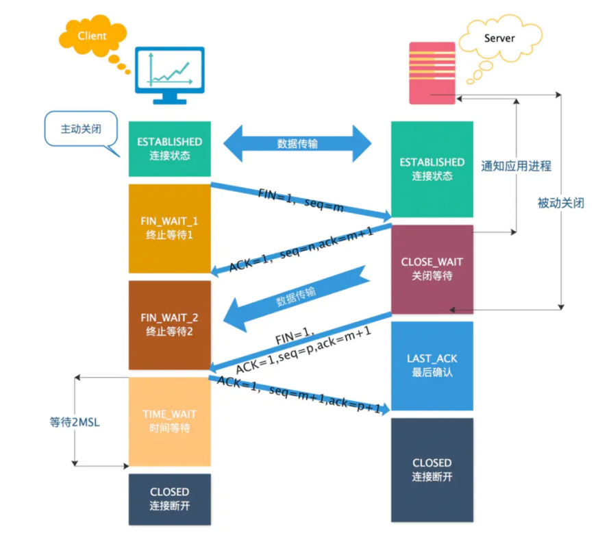

- 第一次挥手：==客户端==向服务端发送**连接释放报文（FIN=1)**，**主动关闭连接，** **进入FIN-WAIT-1** 状态。
  - **序列号seq = u，**即客户端上次发送的报文的最后一个字节的序号＋1；
  - **确认号 ack = k，**即服务端上次发送的报文的最后一个字节的序号＋1

- 第二次挥手：==服务端==收到连接释放报文后，发出**确认报文(ACK=1)**，**序列号 seq =k，确认号ack = u+ 1。**

  服务端进入**CLOSE-WAIT**状态，客户端进入**FIN-WAIT-2**状态。

  - 这时**TCP连接处于半关闭状态**，这表示客户端没有数据发送了，但服务端可能还要发送数据。

- 第三次挥手：==服务端== 向客户端发送**连接释放报文(FIN=1)**，**请求关闭连接，**进入**LAST-ACK**状态。

  - **序列号seq = w，**即服务端上次发送的报文的最后一个字节的序号＋1。

  - **确认号 ack =u+1**，与第二次挥手相同，因为这段时间客户端没有发送数据

- 第四次挥手：==客户端== 收到服务端连接释放报文后，发出**确认报文（ACK=1)**，**进入TIME-WAIT**状态，服务端收到后直接进入CLOSE状态。客户端等待 **2MSL** ，如果没有收到回复，就证明服务端已正常关闭，随后，客户端也可以关闭连接了。
  - **序列号seq =u+1**。因为客户端上次发送给服务端的序号为u，中间都没有再发数据了。
  - **确认号为ack = w + 1。**

此时，==客户端==就进入了 **[TIME-WAIT]** 状态。**注意此时客户端到TCP连接还没有释放，**必须经过 ==2*MSL (最长报文段寿命）==的时间后，才进入 **CLOSED** 状态。而服务端只要收到客户端发出的确认，就立即进入**（CLOSED）**状态。可以看到，**服务端结束TCP连接的时间要比客户端早一些。**


## 10.为什么连接的时候是三次握手，关闭的时候却是四次握手?

服务器在收到客户端的 **FIN报文段 ** 后，可能==还有一些数据要传输，所以不能马上关闭连接，但是会做出应答，返回**ACK报文段**。==

接下来可能会继续发送数据，==在数据发送完后，服务器会向客户**单发送FIN报文**==，表示数据已经发送完毕，请求关闭连接。

**服务器的ACK和FIN一般都会分开发送，从而导致多了一次，因此一共需要四次挥手。**


## 11.为什么客户端的TIME-WAIT状态必须等待2MSL ?


主要有两个原因:

**1、确保ACK报文能够到达服务端，从而使服务端正常关闭连接。**

- 为什么不能立即关闭：客户端第四次挥手的ACK报文==不一定会到达服务端==。服务端会超时重传【FIN】报文，如果客户端立即断开连接，那么就无法响应服务端的二次请求，这样服务端迟迟收不到【FIN】报文的确认，就无法正常断开连接。
- 为什么要等2MSL：==MSL 是报文段在网络上存活的最长时间==。客户端等待2MSL时间，即【客户端ACK报文 1MSL超时＋服务端FIN报文 1MSL传输】，就==确保能够收到服务端重传的【FIN】报文==，然后客户端重传一次ACK报文，==重新启动2MSL计时器==。如此保证服务端能够正常关闭。
- 如果==服务端重发的【FIN/ACK】报文在2MSL时间还是没有传给客户端，此时客户端已经断开了==，服务端则会继续超时重试==直到断开连接。==

> **2、防止，本次连接中已失效的连接请求，出现在之后的连接中。**
>
> - ==TCP要求在2MSL内不使用相同的序列号。==客户端在发送完最后一个ACK报文段后，再经过时间2MSL，就可以保证 ==本次连接持续的时间内==产生的所有报文段都从网络中消失。这样就可以使下一个连接中不会出现这种旧的连接请求报文段。或者即使收到这些过时的报文，也可以不处理它。
>

 

## 12.如果已经建立了连接,但是客户端出现故障了怎么办?

或者说，如果三次握手阶段、四次挥手阶段的包丢失了怎么办？如"服务端重发FIN丢失"的问题。

==简而言之，通过定时器＋超时重试机制，尝试获取确认，直到最后会自动断开连接。==

具体而言，TCP设有一个保活计时器。服务器每收到一次客户端的数据，都会重新复位这个计时器，时间通常是设置为2小时。若2小时还没有收到客户端的任何数据，服务器就开始重试:每隔75分钟发送一个探测报文段，若一连发送10个探测报文后客户端依然没有回应，那么服务器就认为连接已经断开了。


## 13.TIME-WAIT状态过多会产生什么后果?怎样处理?

**从服务器来讲**，==短时间内关闭了大量的Client连接，就会造成服务器上出现大量的TIME_WAIT连接，严重消耗着服务器的资源，此时部分客户端就会显示连接不上。==（因为服务端一直没有断开啊）

**从客户端来讲**，客户端TIME_WAIT过多，==就会导致端口资源被占用，因为端口就65536个==，被占满就会导致无法创建新的连接。

**解决办法： ** ==强制关闭，发送RST包越过TIME_WAIT状态，直接进入CLOSED状态。==


## 14.TIME_WAIT是服务器端的状态?还是客户端的状态?

TIME_WAIT是主动断开连接的一方会进入的状态，一般情况下，==都是客户端所处的状态==；服务器端一般设置不主动关闭连接。

==TIME_WAIT需要等待2MSL，在大量短连接的情况下，TIME_WAIT会太多，这也会消耗很多系统资源==。

> 对于服务器来说，在HTTP协议里指定KeepAlive（浏览器重用一个TCP连接来处理多个HTTP请求），由浏览器来主动断开连接，可以一定程度上减少服务器的这个问题。


## 15.TCP协议如何保证可靠性?

TCP主要提供了==检验和==、==序列号/确认应答==、==超时重传==、==滑动窗口==、==拥塞控制和流量控制==等方法实现了可靠性传输。

- **检验和：**通过检验和的方式，接收端可以检测出来数据是否有差错和异常，假如有差错就会直接丢弃TCP段，重新发送。
- **初始序列号/确认序列号:**

  - ==序列号的作用不仅仅是应答的作用，有了序列号能够将接收到的数据根据序列号排序，并且去掉重复序列号的数据。==

  - ==TCP传输的过程中，每次接收方收到数据后，都会对传输方进行确认应答。也就是发送ACK报文，这个ACK报文当中带有对应的确认序列号，告诉发送方，接收到了哪些数据，下一次的数据从哪里发。==
- **滑动窗口：**==滑动窗口既提高了报文传输的效率，也避免了发送方发送过多的数据而导致接收方无法正常处理的异常。==
- **拥塞控制：**在数据传输过程中，可能由于网络状态的问题，造成网络拥堵，此时引入拥塞控制机制，在保证TCP可靠性的同时，提高性能。
- **超时重传：**超时重传是指发送出去的数据包到接收到确认包之间的时间，如果超过了这个时间会被认为是丢包了，需要重传。==最大超时时间是动态计算的。==
- **流量控制：**如果主机A一直向主机B发送数据，不考虑主机B的接受能力，则可能导致主机B的接受缓冲区满了而无法再接受数据，从而会导致大量的数据丢包，引发重传机制。而在重传的过程中，若主机B的接收缓冲区情况仍未好转，则会将大量的时间浪费在重传数据上，降低传送数据的效率。==所以引入流量控制机制，主机B通过告诉主机A自己接收缓冲区的大小，来使主机A控制发送的数据量。流量控制与TCP协议报头中的窗口大小有关。==


## 15-2.TCP如何保证数据的有序性？

TCP会对发送的数据包进行编号，接收方接收之后会进行排序，之后发送给应用层。

首先说，TCP 不同与UDP ,TCP 是有序的，那么是如何保证有序的，数据在发送后，可能经过不同路径，这样到达目的地时的顺序可能会与发送时不同，后发先到是一件很平常的事，网络层是不会保证数据的有序，TCP 是传输层协议，他实现了这样的一套逻辑，虽然网络层收到的消息顺序可能不一样，但是tcp 保证了提交到上层，应用层的消息，是有序的。那么，如何保证有序，tcp通过字节编号，每一个数据字节都会有一个编号，比如发送了三包，每包100字节，假设第一包首个字节标号是1，那么发送的三包的编号就是 1,101,201，三包数据，只有接收端收到连续的序号的包，才会将数据包提交到应用层例如收到1,201,101，是不会提交到上层应用层的，只有收到正确连续顺序才会提交，所以就保证了数据的有序性。

1. 主机每次发送数据时，TCP就给每个数据包分配一个序列号并且在一个特定的时间内等待接收主机对分配的这个序列号进行确认

2. 如果发送主机在一个特定时间内没有收到接收主机的确认，则发送主机会重传此数据包

3. 接收主机利用序列号对接收的数据进行确认，以便检测对方发送的数据是否有丢失或者乱序等，

4. 接收主机一旦收到已经顺序化的数据，它就将这些数据按正确的顺序重组成数据流并传递到高层进行处理。

## 16.详细讲一下TCP的滑动窗口?

在进行数据传输时，如果传输的数据比较大，就==需要拆分为多个数据包进行发送==。==TCP协议需要对数据进行确认后，才可以发送下一个数据包==。==这样一来，就会在等待确认应答包环节浪费时间。==

为了避免这种情况，TCP引入了窗口概念。==窗口大小指的是**不需要等待确认应答包**而可以继续发送数据包的最大值。==

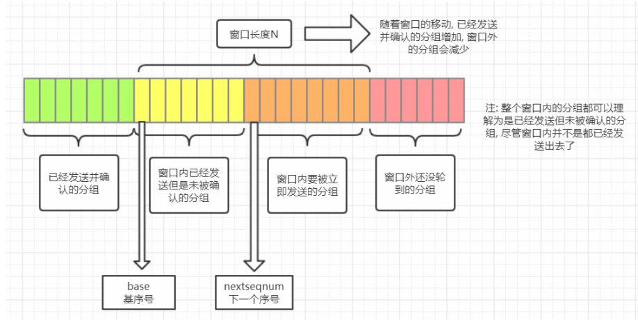

从上面的图可以看到**滑动窗口左边的是已发送并且被确认的分组，滑动窗口右边是还没有轮到的分组。**

**滑动窗口里面也分为两块，一块是已经发送但是未被确认的分组，另一块是窗口内等待发送的分组。**随着**已发送的分组不断被确认，窗口内等待发送的分组也会不断被发送。**整个窗口就会往右移动，让还没轮到的分组进入窗口内。

可以看到==滑动窗口起到了一个限流的作用==，也就是说==当前滑动窗口的大小决定了当前TCP发送包的速率==，而滑动窗口的大小取决于拥塞控制窗口和流量控制窗口的两者间的最小值。


## 17.详细讲一下拥塞控制？

TCP一共使用了四种算法来实现拥塞控制:

- 慢开始(slow-start);
- 拥塞避免(congestion avoidance)；
- 快速重传(fast retransmit);
- 快速恢复(fast recovery)。

==发送方维持一个叫做拥塞窗口 cwnd== (congestion window)  的状态变量。当cwnd超过ssthresh时，改用拥塞避免算法。

**慢开始：**不要一开始就发送大量的数据，由小到大逐渐增加拥塞窗口的大小。

**拥塞避免：**拥塞避免算法让拥塞窗口缓慢增长，即每经过一个往返时间 RTT 就把发送方的拥塞窗口==cwnd加1而不是加倍==。这样拥塞窗口按线性规律缓慢增长。

**快重传：**==我们可以剔除一些不必要的拥塞报文，提高网络吞吐量。==  比如==接收方在收到一个失序的报文段后就立即发出重复确认，而不要等到自己发送数据时捎带确认。==

- 快重传规定：==发送方只要一连收到三个重复确认，就立即重传对方尚未收到的报文段，而不必继续等待设置的重传计时器时间到期。==

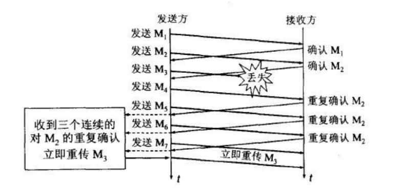

**快恢复：**主要是配合快重传。==当发送方连续收到三个重复确认时，就执行 “乘法减小" 算法，把ssthresh门限减半（为了预防网络发生拥塞)，但接下来并不执行慢开始算法，因为如果网络出现拥塞的话就不会收到好几个重复的确认，收到三个重复确认说明网络状况还可以。==

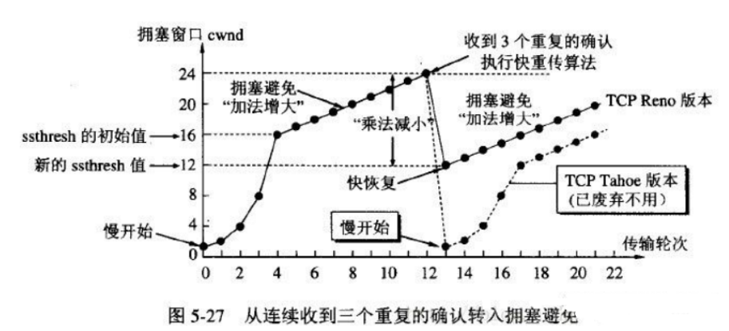

## 18.HTTP常见的状态码有哪些?

**服务端发送给**客户端常见状态码:

- **200：成功**。通常，这表示服务器提供了请求的网页。
- 301：(永久移动) 请求的网页已永久移动到新位置。服务器返回此响应(对GET或HEAD请求的响应)时，会自动将请求者转到新位置。
- 302：(临时移动) 服务器目前从不同位置的网页响应请求，但请求者应继续使用原有位置来进行以后的请求。
- 400：客户端请求有语法错误，不能被服务器所理解。
- 403：服务器收到请求，但是拒绝提供服务。
- **404：(未找到对应资源) 服务器找不到请求的网页。**
- **500：(服务器内部错误) 服务器遇到错误，无法完成请求。**

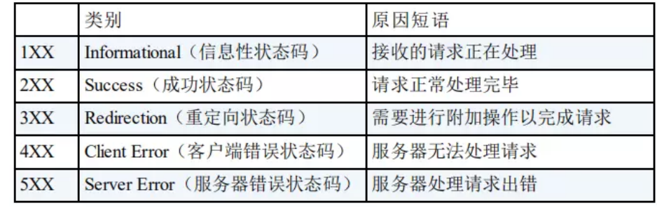


## 19.状态码301和302的区别是什么?

**共同点：** ==301和302状态码都表示重定向==，就是说==浏览器在拿到服务器返回的这个状态码后会自动跳转到一个新的URL地址，这个地址可以从响应的Location首部中获取（用户看到的效果就是他输入的地址A瞬间变成了另一个地址B)。==

**不同点： **==301表示旧地址A的资源已经被永久地移除了==(这个资源不可访问了)，搜索引擎在抓取新内容的同时也将旧的网址交换为重定向之后的网址;  ==302表示旧地址A的资源还在（仍然可以访问)，这个重定向只是临时地从旧地址A跳转到地址B，==搜索引擎会抓取新的内容而保存旧的网址。


## 20.HTTP常用的请求方式?

**增删改查——post、delete、get、put**


## ==21.GET请求和POST请求的区别?（实习-美团）==

**1、使用上的区别**

- GET只有请求头和请求行，只能使用URL传参，而且GET请求参数大小有限制；
- 而POST可以使用请求体传参，并且请求参数大小无限制。

**2、本质区别**

GET和POST最大的区别主要是**GET请求是幂等性的，POST请求不是。**

==幂等性是指一次和多次请求某一个资源应该具有同样的作用==。简单来说意味着对同一URL的多个请求应该返回同样的结果。

**3、REST请求中哪些是幂等操作**

GET，PUT，DELETE都是幂等操作，而POST不是，以下进行分析：

首先GET请求很好理解，对资源做查询多次，此实现的结果都是一样的。

PUT请求的幂等性可以这样理解，将A修改为B，它第一次请求值变为了B，再进行多次此操作，最终的结果还是B，与一次执行的结果是一样的，所以PUT是幂等操作。
同理可以理解DELETE操作，第一次将资源删除后，后面多次进行此删除请求，最终结果是一样的，将资源删除掉了。

POST不是幂等操作，因为一次请求添加一份新资源，二次请求则添加了两份新资源，多次请求会产生不同的结果，因此POST不是幂等操作。


==特别问了：请求头信息的：**content-type**==

Content-Type叫做MIME（[mediaType](https://so.csdn.net/so/search?q=mediaType&spm=1001.2101.3001.7020)）类型,使用Content-Type来表示请求和响应中的媒体类型信息。如果是请求头，它用来告诉服务端如何处理请求的数据，如果是响应头，它用来告诉客户端（一般是浏览器）如何解析响应的数据。

Content-Type含义为内容类型，请求头和响应头中都有该项，有时我们会遇到明明发送了参数后端却没有拿到的情况，或后端向我们发送了一个图片，获取后却是乱码。

**一 、参数传输失败元凶：请求头中的Content-Type**

- 请求头中的Content-Type是为告诉服务器我们发送的请求信息是哪种格式的。不合适的Content-Type可能导致服务端无法正确接收我们的参数。

- **1.1 application/x-www-form-urlencoded**

  请求头中的Content-Type默认值为content-type:application/x-www-form-urlencoded，不指定content-type时，默认使用此格式。此时参数格式如下:

  

- **1.2 multipart/form-data**

- application/x-www-form-urlencoded是把数据使用url编码后传送给后端，不适合用于传输大型二进制数据或者包含非ASCII字符的数据，multipart/form-data就诞生了，专门用于有效的传输文件。

  multipart/form-data 既可以上传文件，也可以上传键值对，它采用了键值对的方式，所以可以上传多个文件。
  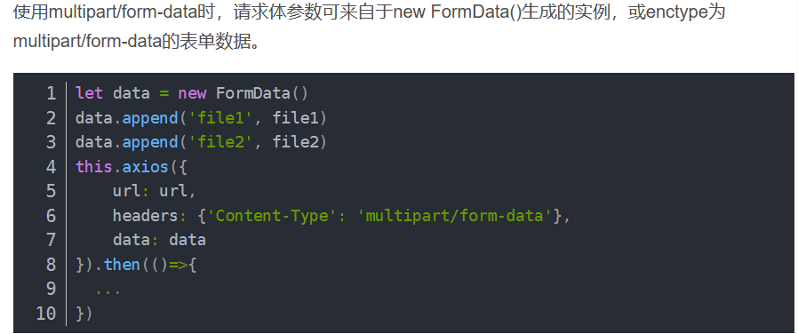

- **1.3 content-type:application/json**

  application/json能够方便传递复杂多层次对象，消息主体是序列化的JSON字符串。

**二、 如何从服务端下载文件：响应头中的Content-Type**

- 响应头中的Content-Type决定浏览器将以什么形式、什么编码读取返回数据，这就是经常看到一些 PHP 网页点击的结果却是下载一个文件或一张图片的原因。

- 响应头中的Content-Type默认为text/plain，但通常需要显式地指定为**text/html。**

- 响应头中的Content-Type由服务端调用专用的方法setContentType，进行设置。
  


## ==22.解释一下HTTP长连接和短连接?OR HTTP1.0和HTTP1.1的区别?==

**在HTTP/1.0中，默认使用的是短连接。**也就是说，==浏览器和服务器每进行一次HTTP操作，就建立一次连接，但在务结束就中断连接。==  如果客户端浏览器访问的某个HTML或其他类型的Web页中包含有其他的Web资源，如JavaScript文件、图像文件、CSS文件等；==当浏览器每遇到这样一个Web资源，就会建立一个HTTP会话。==

**但从HTTP/1.1起，默认使用长连接，**用以保持连接特性。使用长连接的HTTP协议，==会在响应头有加入这行代码:Connection:keep-alive==

==在使用长连接的情况下，当一个网页打开关闭后，客户端和服务器之间用于传输HTTP数据的TCP连接不会关闭，如果客户端再次访问这个服务器上的网页，会继续使用这一条已经建立的连接。== Keep-Alive不会永久保持连接，它有一个保持时间，可以在不同的服务器软件（如Apache)中设定这个时间。实现长连接要客户端和服务端都支持长连接。

==HTTP协议的长连接和短连接，实质上是TCP协议的长连接和短连接。==


## 25.HTTP1.1和 HTTP2.0的区别?

==HTTP2.0 引入了多路复用和头部压缩。==


##==26.HTTP 与HTTPS的区别?（实习-美团）==

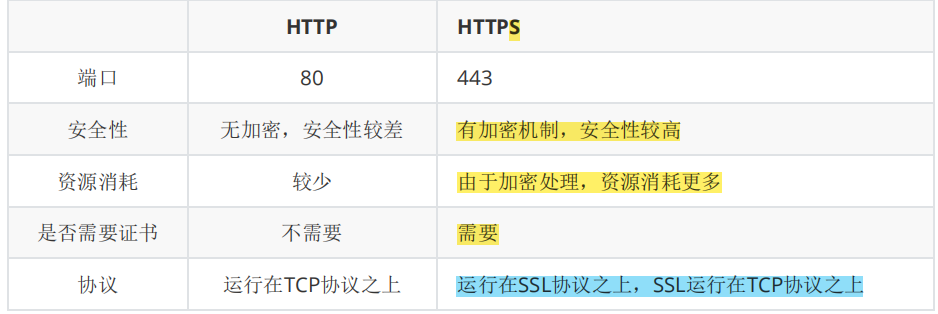

## 27.HTTPS的优缺点?

**优点:：具有很高安全性:**

- 使用HTTPS协议可以认证用户和服务器，确保数据发送到正确的客户机和服务器;
- ==HTTPS协议是由SSL+HTTP协议构建的可进行加密传输、身份认证的网络协议==，要比http协议安全，可防止数据在传输过程中不被窃取、改变，确保数据的完整性。
- ==HTTPS是现行架构下最安全的解决方案==，虽然不是绝对安全，但它大幅增加了中间人攻击的成本。

缺点:

- 在相同网络环境中，==HTTPS相比HTTP的响应时间、耗电量都有大幅度上升，需要更多服务器资源== 
- HTTPS的安全是有范围的，在黑客攻击、服务器劫持等情况下几乎起不到作用。
- 在现有的证书机制下，中间人攻击依然有可能发生。
- HTTPS需要更多的服务器资源，也会导致成本的升高。


## 28.讲一讲HTTPS的原理?


加密流程按图中的序号分为:

1. **客户端请求HTTPS网址，然后连接到server的443端口** (HTTPS默认端口，类似于HTTP的80端口)。

2. **采用HTTPS协议的服务器必须要有一套数字CA(Certification Authority)证书**。颁发证书的同时会产生一个私钥和公钥。私钥由服务端自己保存，不可泄漏。公钥则是附带在证书的信息中，可以公开的。证书本身也附带一个证书电子签名，这个签名用来验证证书的完整性和真实性，可以防止证书被篡改。

3. **==服务器==响应客户端请求，将证书传递给客户端，证书包含公钥和大量其他信息，**比如证书颁发机构信息，公司信息和证书有效期等。

4. **客户端解析证书并对其进行验证。**如果证书不是可信机构颁布，或者证书中的域名与实际域名不一致，或者证书已经过期，就会向访问者显示一个警告，由其选择是否还要继续通信。

   **如果证书没有问题，客户端就会从服务器证书中取出服务器的公钥A，**然后客户端还会生成一个随机码KEY，并使用公钥A将其加密。

5. **客户端把加密后的随机码KEY发送给服务器，**作为后面对称加密的密钥。

6. **==服务器==在收到随机码 KEY之后会使用私钥B将其解密。**经过以上这些步骤，客户端和服务器终于建立了安全连接，完美解决了对称加密的密钥泄露问题，==接下来就可以用对称加密愉快地进行通信了。==

7. **==服务器== 使用前面的密钥(随机码KEY)对数据进行对称加密并发送给客户端，客户端使用相同的密钥(随机码KEY)解密数据。**
8. ==双方使用对称加密愉快地传输所有数据。==


## ==29.在浏览器中输入www.baidu.com后执行的全部过程?（实习-美团）==

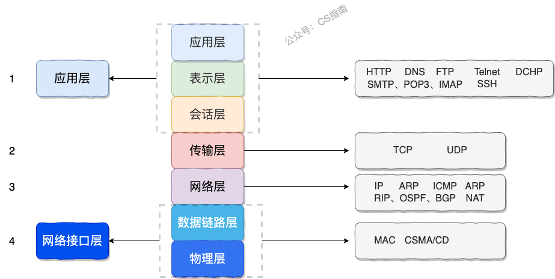

**1、HTTP请求数据包：**浏览器做的第一步工作是解析 URL，确定了 Web 服务器和文件名，接下来就是根据这些信息来生成 HTTP 请求消息了。

**2、真实地址查询——DNS查询：**通过浏览器解析 URL 并生成 HTTP 消息后，需要委托操作系统将消息发送给 `Web` 服务器。但在发送之前，还有一项工作需要完成，那就是**查询服务器域名对应的 IP 地址**，因为委托操作系统发送消息时，必须提供通信对象的 IP 地址。

- 浏览器搜索自己的DNS缓存（维护一张域名与IP的对应表)﹔若没有，则搜索操作系统的DNS缓存（维护一张域名与IP的对应表）﹔若没有，则搜索操作系统的hosts文件(维护一张域名与IP的对应表）。
- 若都没有，则找tcp/lip参数中设置的首选 dns服务器，即本地dns服务器（递归查询)，本地域名服务器查询自己的dns缓存，如果没有，则进行迭代查询。将本地dns服务器将IP返回给操作系统，同时缓存IP。

**3、可靠传输——TCP头部：**找到IP之后，可以把 HTTP 的传输工作交给操作系统中的**协议栈**。协议栈包括了TCP、UDP、IP等协议；

这里是建立TCP的连接，三次握手，并且加上tcp的头部进数据包。浏览器会以一个随机端口（1024-65535）向服务端发起tcp 的连接。

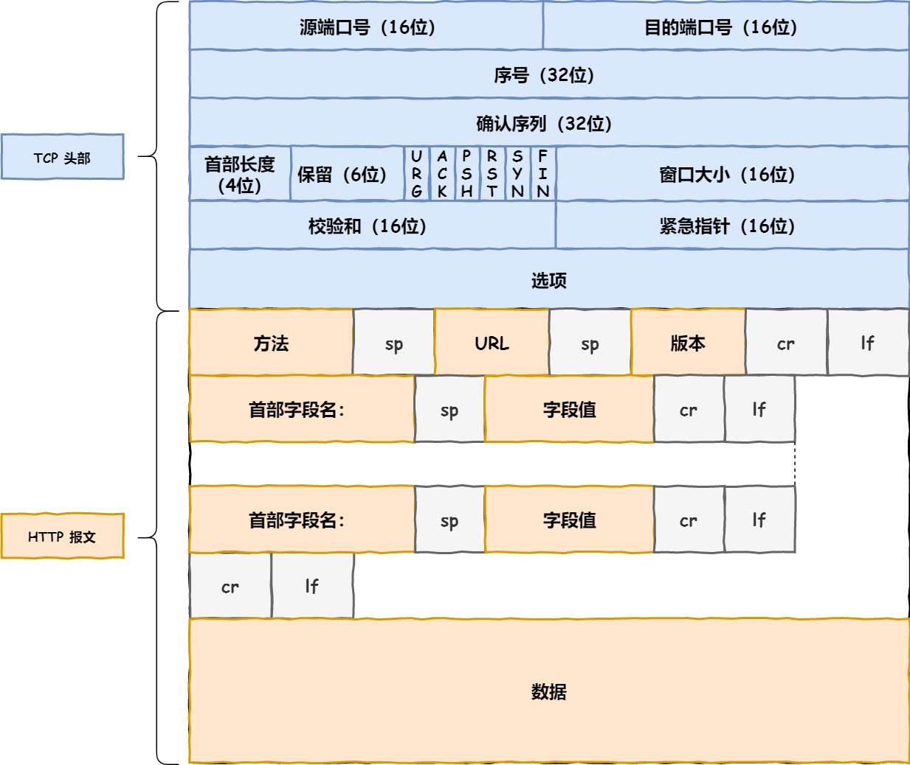

**4、远程定位 —— IP协议（网络层了）**会加上IP报文，TCP 模块在执行连接、收发、断开等各阶段操作时，都需要委托 IP 模块将数据封装成**网络包**发送给通信对象。

**5、两点传输 —— MAC头部：**此时，加上了 IP 头部的数据包表示 ：“有了远程定位的能力！不会害怕在浩瀚的互联网迷茫了！可是目的地好远啊，我下一站应该去哪呢？”就是MAC地址，需要在 IP 头部的前面加上 **MAC 头部**。需要发送方 MAC 地址和接收方目标 MAC 地址，用于两点之间的传输。**目标地址的MAC需要通过ARP协议帮助得到！！**

**6、后面就是进行请求响应了**

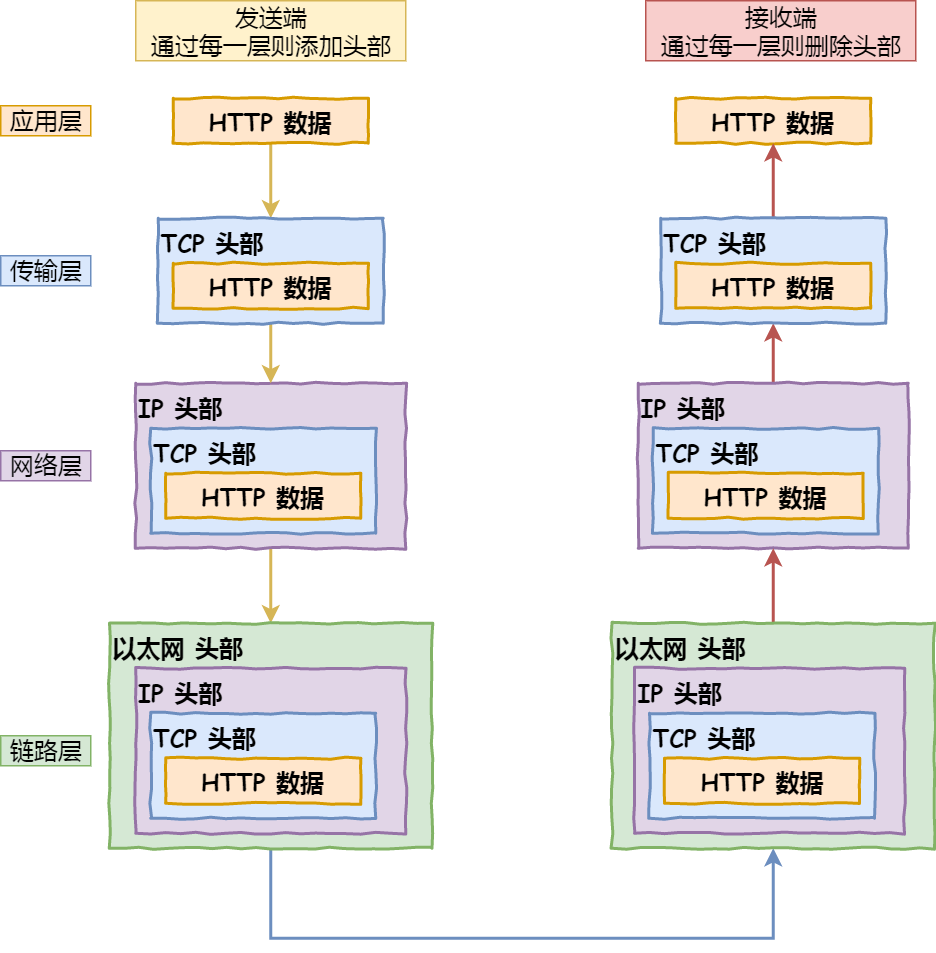


## ==30.什么是Cookie和 Session ?==（美团-实习）


==Cookie、Session都是会话跟踪技术，用于服务器需要识别多次请求是否来自于同一浏览器，以便同一次会话的多次请求间共享数据==。因为HTTP是无状态协议，无法实现一次会话中多次请求共享数据

> 会话:  用户打开浏览器，发起第一次请求访问web服务器的资源，会话开始建立，直到有一方断开连接，会话结束，这是一次会话。**然后在这一次会话中可以包含多次请求和响应**，后面的请求就不会再建立会话了。

Cookie：客户端会话跟踪技术。

- ==服务器发送数据（Cookie对象）到用户浏览器并保存在客户端本地的一小块数据，它会在浏览器下次向同一服务器再发起请求时被携带，并发送到服务器上。==通常，它用于告知服务端两个请求是否来自同一浏览器，如保持用户的登录状态。

Session：服务端会话跟踪技术。

- 会将数据保留到服务端，原理是基于Cookie实现的。由于在服务端，因此数据更安全，不容易被获取。

**一般而言，用户登录前的数据使用Cookie，如账号密码、记住我功能；用户登录后的数据，私密性更高，会使用Session，存在服务端。**


## 31.Session的实现过程？

**Session是基于Cookie实现的，**Session是如何保证在一次会话中多次请求获取的Session对象是同一个呢?

- ==用户第一次请求服务器的时候，业务代码会创建对应的Session对象，== Tomcat服务器发现业务处理中使用了session对象，就会把session的唯一标识如`id:10`当做一个cookie，自动添加`Set-Cookie:JSESSIONID=10`到响应头中，并响应给浏览器。

- 浏览器接收到响应结果后，会把响应头中的coookie数据存储，同时Cookie记录此SessionID属于哪个域名。

- ==当用户第二次访问服务器的时候==，**会自动判断此域名下是否存在Cookie 信息**，如果存在的话，请求时会把Cookie信息也发送给服务端，服务端会从Cookie 中获取 SessionlD，再根据SessionID查找对应的Session对象信息，就实现了一次会话多次请求共享数据。

  > 如果没有找到说明用户没有登录或者登录失效，如果找到Session 证明用户已经登录可执行后面操作。

- 根据以上流程可知，SessionID 是连接Cookie和Session的一道桥梁，==大部分系统也是根据此原理来验证用户登录状态。==

> 
>
> (1) demo1在第一次获取session对象的时候，session对象会有一个唯一的标识，假如是`id:10`
>
> (2) demo1在session中存入其他数据并处理完成所有业务后，需要通过Tomcat服务器响应结果给浏览器
>
> (3) Tomcat服务器发现业务处理中使用了session对象，就会把session的唯一标识`id:10`当做一个cookie，自动添加`Set-Cookie:JESSIONID=10`到响应头中，并响应给浏览器（**自动添加哦，Tomcat666）**
>
> (4) ==浏览器接收到响应结果后，会把响应头中的coookie数据存储到浏览器的内存中==
>
> (5) 浏览器在**同一会话**中访问demo2的时候，会把cookie中的数据按照`cookie: JESSIONID=10`的格式添加到请求头中并发送给服务器Tomcat
>
> (6) demo2获取到请求后，从请求头中就读取**cookie中的 JSESSIONID** 值为10，然后就会到服务器内存中寻找`id:10`的session对象，如果找到了，就直接返回该对象，如果没有则新创建一个session对象
>
> (7) 关闭打开浏览器后，因为浏览器的cookie已被销毁，所以就没有JESSIONID的数据，服务端获取到的session就是一个全新的session对象


## 32.Cookie和Session的区别？

- 存储位置：Cookie在客户端，Session在服务端；
- 安全性：Cookie不安全，Session安全；
- 数据大小：Cookie最大3KB，Session无限制；
- ·有效期不同，Cookie可设置为长时间保持，比如我们经常使用的默认登录功能，Session一般失效时间较短，客户端关闭或者Session超时都会失效。

应用场景:

* 记住我功能:使用Cookie来存储
* 验证码:使用session来存储

## 34.什么是DDos攻击?

DDos全称==Distributed Denial of Service，分布式拒绝服务攻击。==

==最基本的DOS==攻击过程如下:

1. **客户端向服务端发送请求链接数据包。**

2. **服务端向客户端发送确认数据包。**

3. **客户端不向服务端发送确认数据包，服务器一直等待来自客户端的确认**

DDoS则是采用分布式的方法，通过在网络上占领多台“肉鸡"，用多台计算机发起攻击。

## 36.SQL注入是什么，如何避免SQL注入?

**SQL注入就是在用户输入的字符串中加入SQL语句，**如果在设计不良的程序中忽略了检查，那么这些注入进去的SQL语句就会被数据库服务器误认为是正常的SQL语句而运行，==攻击者就可以执行计划外的命令或访问未被授权的数据==。**破解用户登录**

**SQL注入的原理**主要有以下4点

- ==恶意拼接查询==
- 利用注释执行非法命令
- ==传入非法参数==
- ==添加额外条件==

**避免SQL注入**的一些方法:

- ==对进入数据库的特殊字符(""尖括号&*;等）转义处理。==（如 JDBC的 preStatement）
- ==提供参数化查询接口，不要直接使用原生SQL。==


## 37.负载均衡算法有哪些?

多台服务器以对称的方式组成一个服务器集合，每台服务器都具有等价的地位，能互相分担负载。

- **轮询法：**将请求按照顺序轮流的分配到服务器上。大锅饭，不能发挥某些高性能服务器的优势。
- **随机法：**随机获取一台，和轮询类似。
- **哈希法：**==通过ip地址哈希化来确定要选择的服务器编号==。好处是,每次客户端访问的服务器都是同一个服务器，能很好地利用session或者cookie。
- **加权轮询：**==根据服务器性能不同加权。==


## 38.断网了，还能 ping 通 127.0.0.1 吗？

ping 是应用层命令， 是基于网络层的**ICMP协议**工作的。

ICMP 全称是 **Internet Control Message Protocol**，也就是**互联网控制报文协议**。

`ICMP` 主要的功能包括：**确认 IP 包是否成功送达目标地址、报告发送过程中 IP 包被废弃的原因和改善网络设置等**


## ==39.HTTP（美团-contentType）==

### 2.1 简介


**HTTP概念**

HyperText Transfer Protocol，==超文本传输协议，规定了浏览器和服务器之间数据传输的规则==。

* 数据传输的规则指的是请求数据和响应数据需要按照指定的格式进行传输。
* 如果想知道具体的格式，可以打开浏览器，点击`F12`打开开发者工具，点击`Network`来查看某一次请求的请求数据和响应数据具体的格式内容，如下图所示:


> 注意:在浏览器中如果看不到上述内容，需要清除浏览器的浏览数据。chrome浏览器可以使用ctrl+shift+Del进行清除。

==所以学习HTTP主要就是学习请求和响应数据的具体格式内容。==

**HTTP协议特点**

HTTP协议有它自己的一些特点，分别是:

* ==基于TCP协议: 面向连接，安全==

  TCP是一种面向连接的(建立连接之前是需要经过三次握手)、可靠的、基于字节流的传输层通信协议，在数据传输方面更安全。

* ==基于请求-响应模型的:一次请求对应一次响应==

  请求和响应是一一对应关系

* ==HTTP协议是无状态协议:对于事物处理没有记忆能力。每次请求-响应都是独立的==

  **无状态**指的是客户端发送HTTP请求给服务端之后，服务端根据请求响应数据，响应完后，不会记录任何信息。这种特性有优点也有缺点。

  * 缺点:多次请求间不能共享数据
  * 优点:速度快

  请求之间无法共享数据会引发的问题，如:

  * 京东购物，`加入购物车`和`去购物车结算`是两次请求，
  * HTTP协议的无状态特性，加入购物车请求响应结束后，并未记录加入购物车是何商品
  * 发起去购物车结算的请求后，因为无法获取哪些商品加入了购物车，会导致此次请求无法正确展示数据

  具体使用的时候，我们发现京东是可以正常展示数据的，原因是Java早已考虑到这个问题，并提出了使用`会话技术(Cookie、Session)`来解决这个问题。具体如何来做，我们后面会详细讲到。刚才提到HTTP协议是规定了请求和响应数据的格式，那具体的格式是什么呢?

  

### 2.2 请求数据格式


#### 2.2.1 格式介绍

请求数据总共分为三部分内容，分别是==请求行==、==请求头==、==请求体==


* **请求行**: HTTP请求中的第一行数据，请求行包含三块内容，分别是 GET[请求方式]	 /[请求URL路径] HTTP/1.1[HTTP协议及版本]

  ==请求方式有七种,最常用的是GET和POST==

* **请求头**: 第二行开始，格式为key: value形 式

  请求头中会包含若干个属性，常见的HTTP请求头有:

  ```
  Host: 表示请求的主机名
  User-Agent: 浏览器版本,例如Chrome浏览器的标识类似Mozilla/5.0 ...Chrome/79，IE浏览器的标识类似Mozilla/5.0 (Windows NT ...)like Gecko；
  Accept：表示浏览器能接收的资源类型，如text/*，image/*或者*/*表示所有；
  Accept-Language：表示浏览器偏好的语言，服务器可以据此返回不同语言的网页；
  Accept-Encoding：表示浏览器可以支持的压缩类型，例如gzip, deflate等。
  ```

   ==这些数据有什么用处?==

  举例说明:服务端可以根据请求头中的内容来获取客户端的相关信息，有了这些信息服务端就可以处理不同的业务需求，比如:

  * 不同浏览器解析HTML和CSS标签的结果会有不一致，所以就会导致相同的代码在不同的浏览器会出现不同的效果
  * 服务端根据客户端请求头中的数据获取到客户端的浏览器类型，就可以根据不同的浏览器设置不同的代码来达到一致的效果
  * **这就是我们常说的浏览器兼容问题**

* **请求体:** POST请求的最后一部分，存储请求参数

  

  如上图红线框的内容就是请求体的内容，请求体和请求头之间是有一个空行隔开。

##### GET请求


- 只有请求头和请求行，请求的参数放在请求行里面。而且GET请求参数大小有限制

- 我们浏览器直接访问网址（URL）就是GET请求。不需要后端其他的操作，仅仅通过浏览器就可以！


##### POST请求


- 请求头+请求行+请求体

- 请求体放请求参数，并且请求参数无限制。
- ==但是注意到，虽然请求体可以放参数，但现在我们请求行依旧可以放请求参数==
- 要想发送一个POST请求，请求该Servlet，单单通过浏览器是无法实现的，这个时候就需要编写一个form表单来发送请求，在webapp下创建一个`a.html`页面


#### 2.2.2 实例演示

把 `代码\http` 拷贝到IDEA的工作目录中，比如`D:\workspace\web`目录，


使用IDEA打开


打开后，可以点击项目中的`html\19-表单验证.html`，使用浏览器打开，通过修改页面中form表单的method属性来测试GET请求和POST请求的参数携带方式。


**小结**:

1. 请求数据中包含三部分内容，分别是请求行、请求头和请求体

2. POST请求数据在请求体中，GET请求数据在请求行上

### 2.3 响应数据格式


#### ==2.3.1 格式介绍（content-type）==

响应数据总共分为三部分内容，分别是==响应行==、==响应头==、==响应体==


* **响应行**：响应数据的第一行,响应行包含三块内容，分别是 HTTP/1.1[HTTP协议及版本] 		200[响应状态码] 					ok[状态码的描述]

* **响应头**：第二行开始，格式为key：value形式

  响应头中会包含若干个属性，常见的HTTP响应头有:

  ```
  Content-Type：表示该响应内容的类型，例如text/html，image/jpeg；
  Content-Length：表示该响应内容的长度（字节数）；
  Content-Encoding：表示该响应压缩算法，例如gzip；
  Cache-Control：指示客户端应如何缓存，例如max-age=300表示可以最多缓存300秒
  ```

* **响应体：** 最后一部分。存放响应数据

  上图中<html>...</html>这部分内容就是响应体，它和响应头之间有一个空行隔开。

  

#### 2.3.2 响应状态码

参考: 响应状态码.md

关于响应状态码，我们先主要认识三个状态码，其余的等后期用到了再去掌握:

* 200  ok 客户端请求成功
* 404  Not Found 请求资源不存在
* 500 Internal Server Error 服务端发生不可预期的错误


#### 2.3.3 自定义服务器

在前面我们导入到IDEA中的http项目中，有一个Server.java类，这里面就是自定义的一个服务器代码，主要使用到的是`ServerSocket`和`Socket`, 看看就行了。

```java
package com.itheima;

import sun.misc.IOUtils;

import java.io.*;
import java.net.ServerSocket;
import java.net.Socket;
import java.nio.charset.StandardCharsets;
import java.nio.file.Files;
/*
    自定义服务器
 */
public class Server {
    public static void main(String[] args) throws IOException {
        ServerSocket ss = new ServerSocket(8080); // 监听指定端口
        System.out.println("server is running...");
        while (true){
            Socket sock = ss.accept();
            System.out.println("connected from " + sock.getRemoteSocketAddress());
            Thread t = new Handler(sock);
            t.start();
        }
    }
}

class Handler extends Thread {
    Socket sock;

    public Handler(Socket sock) {
        this.sock = sock;
    }

    public void run() {
        try (InputStream input = this.sock.getInputStream()) {
            try (OutputStream output = this.sock.getOutputStream()) {
                handle(input, output);
            }
        } catch (Exception e) {
            try {
                this.sock.close();
            } catch (IOException ioe) {
            }
            System.out.println("client disconnected.");
        }
    }

    private void handle(InputStream input, OutputStream output) throws IOException {
        BufferedReader reader = new BufferedReader(new InputStreamReader(input, StandardCharsets.UTF_8));
        BufferedWriter writer = new BufferedWriter(new OutputStreamWriter(output, StandardCharsets.UTF_8));
        // 读取HTTP请求:
        boolean requestOk = false;
        String first = reader.readLine();
        if (first.startsWith("GET / HTTP/1.")) {
            requestOk = true;
        }
        for (;;) {
            String header = reader.readLine();
            if (header.isEmpty()) { // 读取到空行时, HTTP Header读取完毕
                break;
            }
            System.out.println(header);
        }
        System.out.println(requestOk ? "Response OK" : "Response Error");
        if (!requestOk) {
            // 发送错误响应:
            writer.write("HTTP/1.0 404 Not Found\r\n");
            writer.write("Content-Length: 0\r\n");
            writer.write("\r\n");
            writer.flush();
        } else {
            // 发送成功响应:

            //读取html文件，转换为字符串
            BufferedReader br = new BufferedReader(new FileReader("http/html/a.html"));
            StringBuilder data = new StringBuilder();
            String line = null;
            while ((line = br.readLine()) != null){
                data.append(line);
            }
            br.close();
            int length = data.toString().getBytes(StandardCharsets.UTF_8).length;

            writer.write("HTTP/1.1 200 OK\r\n");
            writer.write("Connection: keep-alive\r\n");
            writer.write("Content-Type: text/html\r\n");
            writer.write("Content-Length: " + length + "\r\n");
            writer.write("\r\n"); // 空行标识Header和Body的分隔
            writer.write(data.toString());
            writer.flush();
        }
    }
}
```

上面代码，大家不需要自己写，主要通过上述代码，只需要大家了解到服务器可以使用java完成编写，是可以接受页面发送的请求和响应数据给前端浏览器的，真正用到的Web服务器，我们不会自己写，都是使用目前比较流行的web服务器，比如==Tomcat==

**小结**

1. 响应数据中包含三部分内容，分别是响应行、响应头和响应体

2. 掌握200，404，500这三个响应状态码所代表含义，分布是成功、所访问资源不存在和服务的错误


# 二、操作系统

## 1.什么是操作系统？

1. **操作系统（Operating System，简称 OS）是管理计算机硬件与软件资源的程序，是计算机的基石。**
2. **操作系统本质上是一个运行在计算机上的软件程序 ，用于管理计算机硬件和软件资源。** 举例：运行在你电脑上的所有应用程序都通过操作系统来调用系统内存以及磁盘等等硬件。
3. **操作系统存在屏蔽了硬件层的复杂性。** 操作系统就像是硬件使用的负责人，统筹着各种相关事项。
4. **操作系统的内核（Kernel）是操作系统的核心部分，连接应用程序和硬件的桥梁，决定着系统的性能和稳定性。它负责系统的内存管理，硬件设备的管理，文件系统的管理以及应用程序的管理**。 


## 1.线程和进程有什么区别?还有协程？


**进程：**  

- 进程是程序的一次执行过程，是==系统运行程序的基本单位==，是==操作系统==资源分配的基本单位。

**线程：**

- 线程是==处理器任务调度和执行==的基本单位，线程与进程相似，但线程是进程内部的一个更小的执行单位。一个进程在其执行的过程中可以产生多个线程。


- 与进程不同的是，同类的多个线程共享该进程的**方法区**和**堆**资源，每个线程有自己独立的**程序计数器**、**虚拟机栈**和**本地方法栈**，所以==系统在各个线程之间作切换工作时，开销要比进程切换小得多==，也正因为如此，线程也被称为**轻量级进程。**

**协程：是一种比线程更加轻量级的存在。**

- 协程不是进程，也不是线程，它就是**一个可以在某个地方挂起的特殊函数，并且可以重新在挂起处继续运行**。所以说，协程与进程、线程相比，不是一个维度的概念。
- 一个进程可以包含多个线程，一个线程也可以包含多个协程，也就是说，一个线程内可以有多个那样的特殊函数在运行。但是有一点，**必须明确，一个线程内的多个协程的运行是串行的**。如果有多核CPU的话，多个进程或一个进程内的多个线程是可以并行运行的，但是一个线程内的多个协程却绝对串行的，无论有多少个CPU（核）。这个比较好理解，毕竟协程虽然是一个特殊的函数，但仍然是一个函数。一个线程内可以运行多个函数，但是这些函数都是串行运行的。当一个协程运行时，其他协程必须挂起。
  

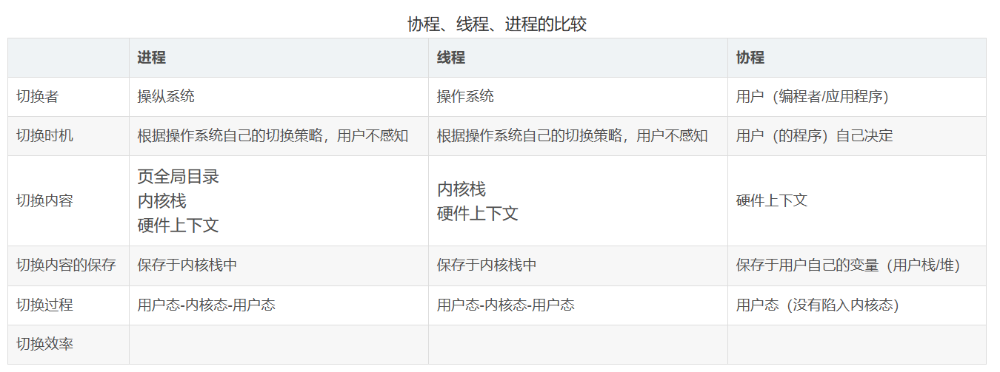


## 3.并发和并行有什么区别?

**并发就是在一段时间内，多个任务都会被处理；但在某一时刻，只有一个任务在执行。**==单核cpu处理器可以做到并发==。比如有两个进程A和B，A运行一个时间片之后，切换到B，B运行一个时间片之后又切换到A。==因为切换速度足够快==，所以宏观上表现为在一段时间内能同时运行多个程序。

**并行就是在同一时刻，有多个任务在执行。**这个==需要多核处理器==才能完成，在微观上就能同时执行多条指令，不同的程序被放到不同的处理器上运行，这个是物理上的多个进程同时进行。


## ==4.进程与线程的切换流程?==

**进程切换**分两步:

==1、切换页表以使用新的地址空间，一旦去切换上下文，处理器中所有已经缓存的内存地址一瞬间都作废了。==

==2、切换内核栈和硬件上下文。==

**线程切换**只有一步：

对于linux来说，线程和进程的最大区别就在于**地址空间**，对于线程切换，第1步是不需要做的，第2步是进程和线程切换都要做的。

因为==每个进程都有自己的虚拟地址空间==，而==线程是共享所在进程的虚拟地址空间的==，因此同一个进程中的线程切换时不涉及虚拟地址空间的转换。


## 5.为什么虚拟地址空间切换会比较耗时?

**进程都有自己的虚拟地址空间，把虚拟地址转换为物理地址需要查找页表，页表查找是一个很慢的过程，因此通常使用Cache来缓存常用的地址映射，这样可以加速页表查找。**

这个Cache就是TLB ( translation Lookaside Buffer，TLB本质上就是一个Cache，是用来加速页表查找的)。

**由于每个进程都有自己的虚拟地址空间，那么显然每个进程都有自己的页表，那么当进程切换后页表也要进行切换，页表切换后TLB就失效了，**==Cache失效导致命中率降低，那么虚拟地址转换为物理地址就会变慢，表现出来的就是程序运行会变慢，==，**而线程切换则不会导致TLB失效，因为线程无需切换地址空间，因此我们通常说线程切换要比较进程切换块，原因就在这里。**


## 6.进程间通信方式有哪些?

- **管道：**管道这种通讯方式有两种限制，一是半双工的通信，==数据只能单向流动==，二是只能在具有亲缘关系的进程间使用。进程的亲缘关系通常是指==父子进程关系。==
  - **速度慢、容量有限**

> ​		管道可以分为两类:匿名管道和命名管道。匿名管道是单向的，只能在有亲缘关系的进程间通信;命名管道以磁盘文件的方式存在，可以实现本机任意两个进程通信。

- **信号：**==信号是一种比较复杂的通信方式，信号可以在任何时候发给某一进程，而无需知道该进程的状态。==
- **信号量：** ==信号量是一个计数器，可以用来控制多个进程对共享资源的访问。它常作为一种锁机制==，防止某进程正在访问共享资源时，其他进程也访问该资源。因此，主要作为进程间以及同一进程内不同线程之间的同步手段。
  - **只能用来同步;**
- **消息队列：**消息队列是消息的链接表，包括Posix消息队列和System V消息队列。有足够权限的进程可以向队列中添加消息，被赋予读权限的进程则可以读走队列中的消息。消息队列克服了信号承载信息量少，管道只能承载无格式字节流以及缓冲区大小受限等缺点。
  - **容量受到系统限制**，且要注意第一次读的时候，要考虑上一次没有读完数据的问题;
- **共享内存：**==共享内存就是映射一段能被其他进程所访问的内存，这段共享内存由一个进程创建，但多个进程都可以访问。==共享内存是最快的IPC方式，它是针对其他进程间通信方式运行效率低而专门设计的。==它往往与其他通信机制，如信号量，配合使用，来实现进程间的同步和通信。==
  - **容量可控、速度快，但有线程安全问题，**一个线程在写时，另一个注意读写问题。因为是共享资源。
- **Socket：**与其他通信机制不同的是，它==可用于不同机器间的进程通信==。
  - **速度慢**


## ==7.线程间同步的方式有哪些?==

线程同步是两个或多个有共享关键资源的线程的并发执行。应该同步线程以避免关键的资源使用冲突。

操作系统一般有下面四种线程同步的方式：

**1、临界区：**==通过对多线程的串行化来访问公共资源，速度快，适合控制数据访问。==

- 缺点：只能用来同步本进程内的线程，而不可用来同步多个进程中的线程。

**2、互斥量：**采用互斥对象机制，只有拥有互斥对象的线程才有访问公共资源的权限。因为互斥对象只有一个，所以可以保证公共资源不会被多个线程同时访问。比如 Java 中的 synchronized 关键词和各种 Lock 都是这种机制。

**3、信号量：**==它允许多个线程在同一时刻访问同一资源，但是限制在该时刻访问此资源的最大线程数目。==

- 缺点：==信号量机制必须有公共内存，不能用于分布式操作系统，这是它最大的弱点;==

**4、事件：**用来通知线程有一些事件已发生，从而启动后继任务的开始。


## 8.**什么是系统调用呢？** 能不能详细介绍一下。

我们运行的程序基本都是运行在**用户态**，如果我们**调用操作系统提供的系统态的功能**咋办呢？那就**需要系统调用**了！

==IO就是典型的系统调用==

==在我们运行的用户程序中，凡是与系统态级别的资源有关的操作（如文件管理、进程控制、内存管理等)，都必须通过系统调用方式向操作系统提出服务请求，并由操作系统代为完成。==

> 这些系统调用按功能大致可分为如下几类：
>
> - 设备管理。完成设备的请求或释放，以及设备启动等功能。
> - 文件管理。完成文件的读、写、创建及删除等功能。
> - 进程控制。完成进程的创建、撤销、阻塞及唤醒等功能。
> - 进程通信。完成进程之间的消息传递或信号传递等功能。
> - 内存管理。完成内存的分配、回收以及获取作业占用内存区大小及地址等功能


## 9.什么是用户态和系统态（内核态）？

==根据进程访问资源的特点==，我们可以==把进程在系统上的运行==分为两个级别：

1. 用户态(user mode) : 该进程可以直接读取用户程序的数据。
2. 系统态(kernel mode)：可以简单的理解该状态的进程几乎可以访问计算机的任何资源，不受限制。

在用户态的进程，调用操作系统提供的系统态的功能，就是系统调用！


## 10.**==你知道操作系统中进程的调度算法有哪些吗?==**

- **先到先服务(FCFS)调度算法** : 从就绪队列中选择一个最先进入该队列的进程为之分配资源，使它立即执行并一直执行到完成或发生某事件而被阻塞放弃占用 CPU 时再重新调度。
- **短作业优先(SJF)的调度算法** : 从就绪队列中选出一个估计运行时间最短的进程为之分配资源，使它立即执行并一直执行到完成或发生某事件而被阻塞放弃占用 CPU 时再重新调度。
- **时间片轮转调度算法** : 时间片轮转调度是一种最古老，最简单，==最公平且使用最广的算法，又称 RR(Round robin)调度==。每个进程被分配一个时间段，称作它的时间片，即该进程允许运行的时间。
- **多级反馈队列调度算法** ：多级反馈队列调度算法既能使高优先级的作业得到响应又能使短作业（进程）迅速完成。，因而它是目前**被公认的一种较好的进程调度算法**，UNIX 操作系统采取的便是这种调度算法。
- **优先级调度** ： 为每个流程分配优先级，首先执行具有最高优先级的进程，依此类推。具有相同优先级的进程以 FCFS 方式执行。可以根据内存要求，时间要求或任何其他资源要求来确定优先级。


## 11.你知道什么是死锁吗?

死锁描述的是这样一种情况：多个线程同时被阻塞，它们中的一个或者全部都在等待某个资源被释放。由于线程被无限期地阻塞，导致程序不能正常终止。

**死锁必须具备以下四个条件:**

- **互斥条件：**该资源任意一个时刻只由一个线程占用。
- **请求与保持条件:**  一个进程因请求资源而阻塞时，对已获得的资源保持不放。
- **不剥夺条件:**  线程已获得的资源在末使用完之前不能被其他线程强行剥夺，只有自己使用完毕后才释放资源。
- **循环等待条件:**  若干进程之间形成一种头尾相接的循环等待资源关系。


## **12.如何避免、预防线程死锁？**

只要破坏产生死锁的四个条件中的其中一个就可以了

- 破坏互斥条件

  ​	这个条件我们没有办法破坏，因为我们用锁本来就是想让他们互斥的

- **破坏请求与保持条件**

  ​	一次性申请所有的资源。

- **破坏不剥夺条件**

  ​	占用资源的线程进一步申请其他资源时，如果申请不到，可以主动释放它的资源。

- **破坏循环等待条件**

  ​	靠按序申请资源来预防。在申请资源时必须按照编号的顺序进行，一个进程只有获得较小编号的进程才能申请较大编号的进程。

- ==**锁排序法:（必须回答出来的点）**==

​	       **通过指定锁的获取顺序，**比如规定，只有获得A锁的线程才有资格获取B锁，按顺序获取锁就可以避免死锁。这通常被认为是解决死锁很好的一种方法。


## 13.死锁的检测？

死锁检测算法是**通过资源分配图来检测是否存在环来实现**，从一个节点出发进行深度优先搜索，对访问过的节点进行标记，如果访问了已经标记的节点，就表示有存在环，也就是检测到死锁的发生。


## ==14.操作系统的内存管理机制了解吗？内存管理有哪几种方式?==

> 操作系统的内存管理主要负责内存的分配与回收（malloc 函数：申请内存，free 函数：释放内存），另外地址转换也就是将逻辑地址转换成相应的物理地址等功能也是操作系统内存管理做的事情。

内存管理机制简单分为**连续分配管理方式**和**非连续分配管理方式**这两种。连续分配管理方式是指为一个用户程序分配一个连续的内存空间，常见的如 **块式管理** 。非连续分配管理方式允许一个程序使用的内存分布在离散或者说不相邻的内存中，常见的如**页式管理** 、 **段式管理**、**段页式管理。**

- **块式管理** ： 远古时代的计算机操作系统的内存管理方式。==将内存分为几个固定大小的块，每个块中只包含一个进程==。如果程序运行只需要很小的空间的话，分配的这块内存很大一部分几乎被浪费了。==这些在每个块中未被利用的空间，我们称之为碎片==

- **页式管理** ：==把主存分为大小相等且固定的一页一页的形式，页较小，相比于块式管理的划分粒度更小，提高了内存利用率，减少了碎片==。

  页式管理通过**页表**对应逻辑地址和物理地址；

- **段式管理** ： 页式管理虽然提高了内存利用率，==页式管理其中的页并无任何实际意义==。 ==段式管理把主存分为一段段的，段是有实际意义的，每个段定义了一组逻辑信息==，例如,有主程序段 MAIN、子程序段 X、数据段 D 及栈段 S 等。

   段式管理通过**段表**对应逻辑地址和物理地址；

- **段页式管理：**结合了段式管理和页式管理的优点。简单来说段页式管理机制就是把主存先分成若干段，每个段又分成若干页，也就是说 **段页式管理机制** 中段与段之间以及段的内部的都是离散的。


## ==15.页表管理机制中有两个很重要的概念：快表和多级页表，这两个东西分别解决了页表管理中很重要的两个问题。你给我简单介绍一下吧==

在分页内存管理中，很重要的两点是：

1. 虚拟地址到物理地址的转换要快。
2. 解决虚拟地址空间大，页表也会很大的问题。

**快表（即 TLB）**

==为了提高虚拟地址到物理地址的转换速度，==操作系统在 **页表方案** 基础之上引入了 **快表** 来加速虚拟地址到物理地址的转换。我们可以把快表理解为一种特殊的高速缓冲存储器（Cache），其中的内容是页表的一部分或者全部内容。作为页表的 Cache，它的作用与页表相似，但是提高了访问速率。由于采用页表做地址转换，读写内存数据时 CPU 要访问两次主存。有了快表，有时只要访问一次高速缓冲存储器，一次主存，这样可加速查找并提高指令执行速度。

使用快表之后的地址转换流程是这样的：

1. 根据虚拟地址中的页号查快表；
2. 如果该页在快表中，直接从快表中读取相应的物理地址；
3. 如果该页不在快表中，就访问内存中的页表，再从页表中得到物理地址，同时将页表中的该映射表项添加到快表中；
4. 当快表填满后，又要登记新页时，就按照一定的淘汰策略淘汰掉快表中的一个页。

看完了之后你会发现快表和我们平时经常在开发系统中使用的缓存（比如 Redis）很像，的确是这样的，操作系统中的很多思想、很多经典的算法，你都可以在我们日常开发使用的各种工具或者框架中找到它们的影子。

**多级页表**

- 引入多级页表的主要目的是： ==为了避免把全部页表一直放在内存中占用过多空间==， 特别是那些根本就不需要的页表就不需要保留在内存中。多级页表属于时间换空间的典型场景。


## ==16.**分页机制和分段机制有哪些共同点和区别呢？**==

**共同点：**

- 分页机制和分段机制都是为了提高内存利用率，减少内存碎片。
- 页和段都是离散存储的但是，每个页和段中的内存是连续的。

**区别** ： 

- 页的大小是固定的，由操作系统决定；而**段的大小不固定**，取决于我们当前运行的程序。
- 分页仅仅是为了满足操作系统内存管理的需求，而**段是逻辑信息的单位，在程序中可以体现为代码段，数据段，能够更好满足用户的需要。**


## ==17.你刚刚还提到了**逻辑地址和物理地址**这两个概念，我不太清楚，你能为我解释一下不？==

编程一般只有可能和逻辑地址打交道，比如java中的引用地址也就是我们说的逻辑地址，逻辑地址由操作系统决定。

物理地址指的是真实物理内存中地址，更具体一点来说就是内存地址寄存器中的地址。物理地址是内存单元真正的地址。


## ==18.为什么需要虚拟地址空间?==

==不过有些资料是直接把逻辑地址当成虚拟地址，两者并没有明确的界限。==

没有虚拟地址空间的时候，**程序直接访问和操作的都是物理内存** 。但是这样有什么问题呢？

1. 用户程序可以访问任意内存，这样就很容易（有意或者无意）破坏操作系统，造成操作系统崩溃。
2. 想要同时运行多个程序特别困难，比如你想同时运行一个微信和一个 QQ 音乐都不行。为什么呢？举个简单的例子：微信在运行的时候给内存地址 1xxx 赋值后，QQ 音乐也同样给内存地址 1xxx 赋值，那么 QQ 音乐对内存的赋值就会覆盖微信之前所赋的值，这就造成微信这个程序会崩溃。

**总结来说：如果直接把物理地址暴露出来的话会带来严重问题，比如可能对操作系统造成伤害以及给同时运行多个程序造成困难。**

**通过虚拟地址访问内存有以下优势：**

- 程序可以使用一系列相邻的虚拟地址来访问物理内存中不相邻的大内存缓冲区。
- 程序可以使用一系列虚拟地址来访问大于可用物理内存的内存缓冲区。当物理内存的供应量变小时，内存管理器会将物理内存页（通常大小为 4 KB）保存到磁盘文件。数据或代码页会根据需要在物理内存与磁盘之间移动。
- 不同进程使用的虚拟地址彼此隔离。一个进程中的代码无法更改正在由另一进程或操作系统使用的物理内存。


## ==19.什么是虚拟内存(Virtual Memory)?==

这个在我们平时使用电脑特别是 Windows 系统的时候太常见了。我们同一时间运行很多软件，但这些软件占用的内存可能已经超出了我们电脑物理内存。

之所以可以这样正是因为 **虚拟内存** 的存在，==通过 虚拟内存 可以让程序可以拥有超过系统物理内存大小的可用内存空间。==另外，**虚拟内存为每个进程提供了一个一致的、私有的地址空间，它让每个进程产生了一种自己在独享主存的错觉（每个进程拥有一片连续完整的内存空间）**，这样会更加有效地管理内存并减少出错。

**虚拟内存**是计算机系统内存管理的一种技术，我们可以手动设置自己电脑的虚拟内存。**虚拟内存的重要意义是它定义了一个连续的虚拟地址空间**，并且 **把内存扩展到硬盘空间**。

> 不要单纯认为虚拟内存只是 “使用硬盘空间来扩展内存“ 的技术。
>
> **虚拟内存** 使得应用程序认为它拥有连续的可用的内存（一个连续完整的地址空间），而实际上，它通常是被分隔成多个物理内存碎片，还有部分暂时存储在外部磁盘存储器上，在需要时进行数据交换。与没有使用虚拟内存技术的系统相比，使用这种技术的系统使得大型程序的编写变得更容易，对真正的物理内存（例如 RAM）的使用也更有效率。目前，大多数操作系统都使用了虚拟内存，如 Windows 家族的“虚拟内存”；Linux 的“交换空间”等。


## ==20.虚拟内存技术的实现呢？==

**虚拟内存的实现需要建立在离散分配的内存管理方式的基础上。** 虚拟内存的实现有以下三种方式：

- **请求分页存储管理** ：建立在分页管理之上，为了支持虚拟存储器功能而增加了请求调页功能和页面置换功能。请求分页是目前最常用的一种实现虚拟存储器的方法。请求分页存储管理系统中，在作业开始运行之前，仅装入当前要执行的部分段即可运行。假如在作业运行的过程中发现要访问的页面不在内存，则由处理器通知操作系统按照对应的页面置换算法将相应的页面调入到主存，同时操作系统也可以将暂时不用的页面置换到外存中。
- **请求分段存储管理** ：建立在分段存储管理之上，增加了请求调段功能、分段置换功能。请求分段储存管理方式就如同请求分页储存管理方式一样，在作业开始运行之前，仅装入当前要执行的部分段即可运行；在执行过程中，可使用请求调入中断动态装入要访问但又不在内存的程序段；当内存空间已满，而又需要装入新的段时，根据置换功能适当调出某个段，以便腾出空间而装入新的段。
- **请求段页式存储管理**


## ==21.虚拟内存管理很重要的一个概念就是页面置换算法。那你说一下 页面置换算法的作用?常见的页面置换算法有哪些?==


地址映射过程中，若在页面中发现所要访问的页面不在内存中，发生缺页中断；

**缺页中断** 就是要访问的**页**不在主存，需要操作系统将其调入主存后再进行访问；

当发生缺页中断时，如果当前内存中并没有空闲的页面，操作系统就必须在内存选择一个页面将其移出内存，以便为即将调入的页面让出空间。**用来选择淘汰哪一页的规则叫做页面置换算法**。


- **OPT 页面置换算法（最佳页面置换算法）** ：最佳 (Optimal, OPT) 置换算法所选择的被淘汰页面将是以后永不使用的，或者是在最长时间内不再被访问的页面,这样可以保证获得最低的缺页率。但由于人们目前无法预知进程在内存下的若千页面中哪个是未来最长时间内不再被访问的，==因而该算法无法实现==。一般作为衡量其他置换算法的方法。
- **FIFO（First In First Out）页面置换算法（先进先出页面置换算法）**: 总是淘汰最先进入内存的页面，即选择在内存中驻留时间最久的页面进行淘汰。
- **LRU （Least Recently Used）页面置换算法（最近最久未使用页面置换算法）**：LRU 算法赋予每个页面一个访问字段，用来记录一个页面自上次被访问以来所经历的时间 T，当须淘汰一个页面时，选择现有页面中其 T 值最大的，即最近最久未使用的页面予以淘汰。
- **LFU （Least Frequently Used）页面置换算法（最少使用页面置换算法）**: 该置换算法选择在之前时期使用最少的页面作为淘汰页。


## 22.讲一讲IO多路复用


IO 多路复用模型中，==线程首先发起 select 调用，询问内核数据是否准备就绪==，等内核把数据准备好了， 再去通知线程，用户线程再发起 read 调用。read 调用的过程（数据从内核空间 -> 用户空间）还是阻塞的。

==IO 多路复用模型，通过减少无效的系统调用，减少了对 CPU 资源的消耗。==

> 目前支持 IO 多路复用的系统调用，有 select，epoll 等等。select 系统调用，目前几乎在所有的操作系统上都有支持。
>
> - **select 调用** ：内核提供的系统调用，它支持一次查询多个系统调用的可用状态。几乎所有的操作系统都支持。
> - **epoll 调用** ：linux 2.6 内核，属于 select 调用的增强版本，优化了 IO 的执行效率。

> **select，poll，epoll都是IO多路复用的机制。**/O多路复用就是通过一种机制监视多个描述符，一旦某个描述符就绪（一般是读就绪或者写就绪），就通知程序进行相应的读写操作。但select,poll，epoll本质上都是同步IO，因为他们都需要在读写事件就绪后自己负责进行读写，也就是说这个读写过程是阻塞的，而异步I/o则无需自己负责进行读写，异步Io的实现会负责把数据从内核拷贝到用户空间。


### **IO多路复用适用场景：**

- 当客户处理多个描述字时(一般是交互式输入和网络套接口)，必须使用I/O复用。
- 如果一个TCP服务器既要处理监听套接口，又要处理已连接套接口，一般也要用到I/O复用。
- 如果一个服务器即要处理TCP，又要处理UDP，一般要使用I/O复用。
- 如果一个服务器要处理多个服务或多个协议，一般要使用IO复用。
- **与多进程和多线程技术相比，IO多路复用技术的最大优势是系统开销小，系统不必创建进程/线程，也不必维护这些进程/线程，从而大大减小了系统的开销。**


## 23.硬链接和软链接有什么区别?

在**Linux/Unix系统中**，存在两种链接类型，分别是：硬链接和软链接

- **软链接相当于Windows中的快捷方式。**软链接就是一个指向另一个文件的文件。当你创建一个软链接的时候，你创建的是一个新文件，OS为软链接分配inode，而**该文件存在的意义只是一个指向系统某处的另一个文件的快捷方式。这里文件也可以是目录**
- **硬链接是原始链接的另一个实例，是磁盘上某个位置的引用 (**或者更准确的说，文件系统中的某个位置)，或者说硬链接是一个指针，指向文件索引节点，系统并不为它重新分配inode。

- **删除硬链接的时候，不会直接删除文件**，链接数同时减一,只有将所有指向文件内容的指针,也即链接数减为0时，内核才会把文件内容从磁盘上删除。
- **删除软链接的时候，则根本不会影响原来的文件**。删除了源文件，则软连接也就无效了。

最后，一图胜千言，我们通过下面这张图来清晰的认识软链接与硬链接之间的关系。

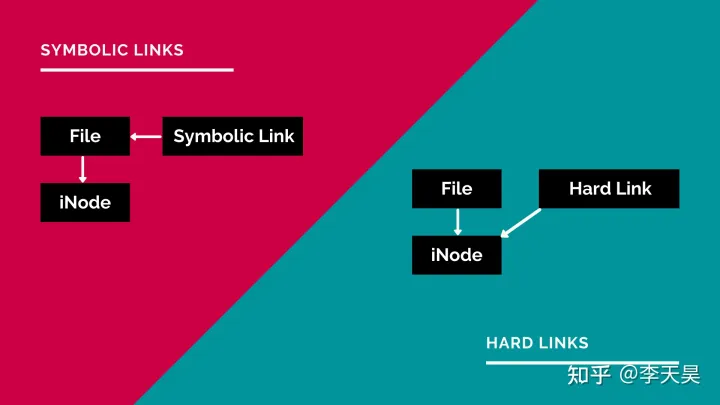


