# 一、Mybatis

## mybatis是什么？

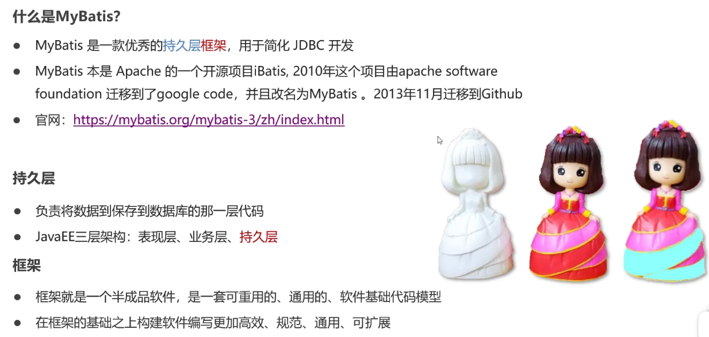

这里提出一个概念：持久层，负责处理数据库之间的连接。

-  **mybatis 是一个优秀的半自动ORM的持久层框架，它内部封装了jdbc，使开发者只需要关注sql语句本身，而不需要花费精力去处理加载驱动、创建连接、创建statement等繁杂的过程。**
-  **mybatis通过xml或注解的方式将要执行的各种 statement配置起来，并通过java对象和statement中sql的动态参数进行映射生成最终执行的sql语句。**
-  最后mybatis框架执行sql并将结果映射为java对象并返回。**采用ORM思想（ObjectRelationMapping）解决了实体对象和数据库表映射的问题，**对jdbc 进行了封装，屏蔽了jdbc api 底层访问细节，使我们不用与jdbc api打交道，就可以完成对数据库的持久化操作。

缺点：

- **SQL语句的编写量较大；**
- **SQL语句依赖于数据库，导致数据库移植性差，不能随意更换数据库。**


## 为什么说Mybatis是半自动ORM映射工具?它与全自动的区别在哪里?

Hibernate属于全自动ORM映射工具，使用Hibernate查询关联对象或者关联集合对象时，可以**根据对象关系模型直接获取**，所以它是全自动的。

而Mybatis在查询关联对象或关联集合对象时，**需要手动编写sql来完成**，所以，称之为半自动ORM映射工具。


## **SqlSessionFactoryBuilder**

**工厂构建器对象**，通过加载mybatis的核心文件的输入流的形式构建一个SqlSessionFactory对象。

```java
String resource = "mybatis-config.xml";
InputStream inputStream = Resources.getResourceAsStream(resource);
SqlSessionFactory sqlSessionFactory = new 	SqlSessionFactoryBuilder().build(inputStream);
```

## **SqlSessionFactory**

**工厂对象**，通过它来创建我们的sql会话对象SqlSession。并且有多个方法创建 SqlSession 。

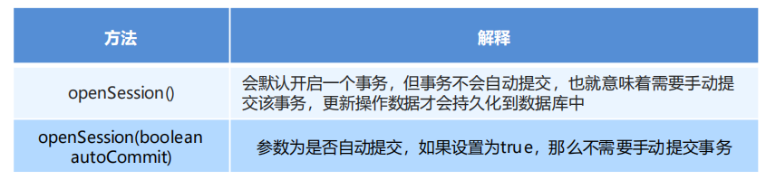

##  **SqlSession**

**会话对象**，SqlSession 实例在 MyBatis 中是非常强大的一个类。在这里你会看到**所有执行语句、提交或回滚事务和获取映射器实例的方法。**

执行语句的方法主要有：（后面代理开发，这个连接即可）

```java
<T> T selectOne(String statement, Object parameter) 
<E> List<E> selectList(String statement, Object parameter) 
int insert(String statement, Object parameter) 
int update(String statement, Object parameter) 
int delete(String statement, Object parameter)
```

**操作事务的方法主要有：**

```java
void commit()	//用的多一点
void rollback()
```

## mybatis的开发流程

1、导入依赖；

2、编写Mybatis的核心配置文件**mybatis-config.xml**------->>替换连接信息，解决硬编码

- 数据库的连接、起别名、使用包扫描加载sql映射文件

3、新建SQL映射文件如UserMapper.xml。

4、使用mapper接口代理开发。

- 定义SQL映射文件同名的Mapper接口，并且该Mapper接口与SQL映射文件要在同一个目录下；
- SQL映射文件**的`namespace`为Mapper接口全限定名。**
- 在Mapper接口里面定义方法，**方法名对应SQL映射文件中sql语句的id。**
- 这里采用MybatisX 插件完成两者之间的关联。可以根据接口方法直接生成 statement 。

5、开始执行Sql语句。

- 1、**工厂构建器对象SqlSessionFactoryBuilder**，通过加载mybatis的核心文件的输入流的形式构建一个SqlSessionFactory对象。
- 2.、**工厂对象SqlSessionFactory**，通过它来创建我们的sql会话对象SqlSession。
- 3.、**会话对象SqlSession**，执行sql语句。
- 4、注意增删改需要提交事务
- 5、释放资源。`sqlSession.close();`


## ==参数占位符（实习-美团）==

**mybatis提供了两种参数占位符：**

```java
* 参数占位符
    #{}: 最终会将其替换成？为了防止SQL注入。将来自动设置参数值。会自动给传入的数据加上双引号 “”
    		 底层使用的是PreparedStatement
```

上面的例子就是，使用的#{}。

```java
* 参数占位符
    ${}：会进行拼接sql，存在sql注入问题。不会给传入的数据加上双引号 “”
```


==特别注意一点，${ }使用的时候，是直接将传入的参数替换掉 这个占位符，不带上引号哦，sql语句内需要引号的就要自己加上，#{ }就会自动按需求带上== 

其中，这里需要用Mybatis的另外一个不怎么用的参数占位符——**${ }** , 还记得我们在学习JavaWeb的Jdbc部分的SQL注入问题，常用的 **#{ }**采用的是预编译（PreStatement），可以防止SQL注入；而**${ }**采用的是非预编译（Statement）。

预编译与非预编译的区别：如果是预编译的，那么系统在初始化时就会读取这段sql代码，将指定的实体类中的字段替换了类似 #{ }这样的语句，就是形成了类似这样的语句：**”select * from tableName where code=?”**  这个时候你在系统运行时再想向这句sql中替换tableName或者code，结果可想而知。如果是非预编译呢，结果刚好相反，他会在系统运行时才会去生成这样类似的语句。此时就可以去替换这些动态的字段或者表名之类：**”select * from bridge_jsd where code= 1011 ”**。对于非预编译一定要记得使用${}这个符号来接收参数。


##  SQL语句中殊字段处理><

以后肯定会在SQL语句中写一下特殊字符，比如某一个字段大于某个值，如下图


可以看出报错了，**因为映射配置文件是xml类型的问题，而 > < 等这些字符在xml中有特殊含义**，所以此时我们需要将这些符号进行转义，可以使用以下两种方式进行转义

* 转义字符

  下图的 `&lt;` 就是 `<` 的转义字符。

  

* **<![CDATA[内容]] >**

  


## Mybatis参数传递

正如前面所看见的，**我们Mapper接口与Mapper.xml（SQL映射文件）的参数关系。**在映射文件中，我们不用写接收参数的代码，就是直接拿传入的参数在使用，**然后Mapper接口方法的参数需要按照一定的标准才行！！！**下面详细解释一下。

Mybatis 接口方法中可以接收的参数类型如下，如下：

* 多个参数
* 单个参数：单个参数又可以是如下类型
  * POJO 类型（类似Javabean）
  * Map 集合类型
  * Collection 集合类型
  * List 集合类型
  * Array 类型
  * 其他类型

### 多个参数

```java
* 多个参数：Mybatis原理是将其多个参数封装为Map集合,可以使用@Param注解，替换Map集合中默认的arg键名
    map.put("arg0",参数值1)
    map.put("param1",参数值1)
    map.put("param2",参数值2)
    map.put("arg1",参数值2)
    ---------------@Param("username")
    map.put("username",参数值1)
    map.put("param1",参数值1)
    map.put("param2",参数值2)
    map.put("arg1",参数值2)
```

如下面的代码，就是接收两个参数，而接收多个参数需要使用 `@Param` 注解，那么为什么要加该注解呢？这个问题要弄明白就必须来研究Mybatis 底层对于这些参数是如何处理的。

```java
User select(@Param("username1") String username,@Param("password1") String password);
```

```xml
<select id="select" resultType="user">
	select *
    from tb_user
    where 
    	username=#{username1}
    	and password=#{password1}
</select>
```

- **下面是具体原理的解析**

我们在接口方法中定义多个参数，Mybatis 会将这些参数封装成 Map 集合对象，值就是传递的参数值，而键在没有使用 `@Param` 注解时有以下命名规则：

* 以 arg 开头  ：第一个参数就叫 arg0，第二个参数就叫 arg1，以此类推。如：

  > map.put("arg0"，参数值1);
  >
  > map.put("arg1"，参数值2);

* 以 param 开头 ： 第一个参数就叫 param1，第二个参数就叫 param2，依次类推。如：

  > map.put("param1"，参数值1);
  >
  > map.put("param2"，参数值2);

==结论：以后接口参数是多个时，在每个参数上都使用 `@Param` 注解。这样代码的可读性更高。==


### 传递自定义对象和数组

```java
boolean updateByIds(@Param("ids") String[] ids, @Param("bridgeAlertRecord") BridgeAlertRecord bridgeAlertRecord);
```

```xml
<update id="updateByIds">
        update bridge_alert_record
        set
            is_deal = #{bridgeAlertRecord.isDeal},
            deal_result = #{bridgeAlertRecord.dealResult},
            deal_content = #{bridgeAlertRecord.dealContent}
        where id in
            <foreach collection="ids" item="id" separator="," open="(" close=")">
                #{id}
            </foreach>
</update>
```

### 单个参数

```java
/*
  MyBatis 参数封装：
    * 单个参数：
        1. POJO类型：直接使用，属性名 和 参数占位符名称 一致
        
        2. Map集合：直接使用，键名 和 参数占位符名称 一致
        
        3. Collection：封装为Map集合，可以使用@Param注解，替换Map集合中默认的arg键名
            map.put("arg0",collection集合);
            map.put("collection",collection集合);
            
        4. List：封装为Map集合，可以使用@Param注解，替换Map集合中默认的arg键名
            map.put("arg0",list集合);
            map.put("collection",list集合);
            map.put("list",list集合);
            
        5. Array：封装为Map集合，可以使用@Param注解，替换Map集合中默认的arg键名
            map.put("arg0",数组);
            map.put("array",数组);
            
        6. 其他类型：直接使用，例如单个的int参数
      
```

* POJO 类型

  直接使用。要求 `属性名` 和 `参数占位符名称` 一致。

  将多个参数封装成一个 实体对象 ，将该实体对象作为接口的方法参数。该方式要求在映射配置文件的SQL中使用 `#{内容}` 时，里面的内容必须和实体类属性名保持一致。

  ```java
  // 代理接口，方法
  void add(Brand brand);
  
  // sql映射文件
  <insert id="add">
      insert into tb_brand (brand_name, company_name, ordered, description, status)
      values (#{brandName}, #{companyName}, #{ordered}, #{description}, #{status});
  </insert>
  ```

* Map 集合类型

  直接使用。要求 `map集合的键名` 和 `参数占位符名称` 一致。

  将多个参数封装到map集合中，将map集合作为接口的方法参数。该方式要求在映射配置文件的SQL中使用 `#{内容}` 时，里面的内容必须和map集合中键的名称一致。

  ```java
  List<Brand> selectByCondition(Map map);
  ```

* Collection 集合类型

  Mybatis 会将集合封装到 map 集合中，如下：

  > map.put("arg0"，collection集合);
  >
  > map.put("collection"，collection集合;

  ==可以使用 `@Param` 注解替换map集合中默认的 arg 键名。==

* List 集合类型

  Mybatis 会将集合封装到 map 集合中，如下：

  > map.put("arg0"，list集合);
  >
  > map.put("collection"，list集合);
  >
  > map.put("list"，list集合);

  ==可以使用 `@Param` 注解替换map集合中默认的 arg 键名。==

* Array 类型

  Mybatis 会将集合封装到 map 集合中，如下：

  > map.put("arg0"，数组);
  >
  > map.put("array"，数组);

  ==可以使用 `@Param` 注解替换map集合中默认的 arg 键名。==

* 其他类型

  比如int类型，`参数占位符名称` 叫什么都可以。尽量做到见名知意

```java
/**
  * 代理接口：根据Id查询
  */
Brand selectById(int id);

// sql映射文件
<select id="selectById"  resultMap="brandResultMap">
    select *
    from tb_brand where id = #{id};
</select>
```


## 查询数据映射到实体类原理

从上面结果可以看到 `brandName` 和 `companyName` 这两个属性的数据没有封装成功，查询 实体类 和 表中的字段 发现，在实体类中属性名是 `brandName` 和 `companyName` ，而表中的字段名为 `brand_name` 和 `company_name`，如下图所示 。那么我们只需要保持这两部分的名称一致这个问题就迎刃而解。

==原理是，我们的resultType指的是，返回的每一条数据的类型，首先啊，你看，数据库搜索出来的话是一个表，对不对，然后，我们jdbc是一个个去从上到下拿数据，这些数据一条条发给我们的java。我们将返回值类型指定为Brand实体类后，Mybatis帮我们做了一个自动封装复制（通过Setter方法）的操作，他会去对应数据库发来数据的字段名和实体类的属性名，假如一模一样，他就会把该字段的数据，赋值给实体类的属性。==


## resultMap完成数据库字段和实体类属性映射

==使用resultMap来定义数据库字段和实体类属性的映射关系的方式解决上述问题。==

**原理就是，一个替换的功能**。**将数据库返回过来数据的brand_name字段和其对应数据，替换成brandName和其对应的数据**，然后==再给Mybatis坐自动封装注入==，这样就有了。

将resultMap写好后，代替Statement（sql语句）的返回值类型就行了。

编写的最终BrandMapper.xml文件如下：

```xml
<?xml version="1.0" encoding="UTF-8" ?>
<!DOCTYPE mapper
        PUBLIC "-//mybatis.org//DTD Mapper 3.0//EN"
        "http://mybatis.org/dtd/mybatis-3-mapper.dtd">
<!--
    namespace:名称空间
-->
<mapper namespace="com.CCooky.mapper.BrandMapper">
<!--
    数据库表的字段名称 和 实体类的属性名称 不一样，则不能自动封装。
    数据库表的命名 规则：brand_name   实体类规则：brandName
        * 起别名：brand_name as brandName.太垃圾了麻烦
        * sql片段：也麻烦，垃圾东西
        * resultMap:
                参数id——是这个resultMap的唯一标识；
                参数type——指明需要映射哪一个实体类全限名，这里核心配置文件设置了别名
                根标签下面还有两个标签，分别是：
                <id/> ：完成主键字段的映射
                      column：查询结果表的列名（注意，我们在查询的时候，可以给数据库字段器别名哦，例如两个表里面都会有id，为了区分就会起别名）
                      property：实体类的属性名
                <result/> ：完成一般字段的映射
                      column：表的列名
                      property：实体类的属性名
-->
    <resultMap id="brandResultMap" type="brand">
        <result column="brand_name" property="brandName"/>
        <result column="company_name" property="companyName"/>
    </resultMap>
  
		<!-- 
			注意，要把返回值类型，改成这个resultMap哦，相对于替换了前面的那个实体类，不是resultType了
		-->
    <select id="selectAll" resultMap="brandResultMap">
        select * from tb_brand;
    </select>
</mapper>
```

==使用的注解形式编写sql的话，就需要加上一个注解==

```java
/**
     * 分页查询
     * @param begin
     * @param size
     * @return
     */
@Select("select * from tb_brand limit #{begin} , #{size}")
@ResultMap("brandResultMap")
List<Brand> selectByPage(@Param("begin") int begin,@Param("size") int size);
```

## 动态sql

**针对上述的需要，Mybatis对动态SQL有很强大的支撑：**

即SQL语句随着用户的输入而变化。他给了一下几个强大的标签，真的不错哦！

> * if
> * where
> * choose (when, otherwise)
> * trim (where, set)
> * foreach

## if标签

- 标签的属性为：test
- 作用：放逻辑表达式
- 注意到1=1的目的，因为拼接需要 and，....，自己体会，不然就可能出现，where后面直接跟关键字and，出现问题。

```xml
<select id="selectByCondition" resultMap="brandResultMap">
    select *
    from tb_brand
    where 1=1
        <if test="status != null">
            and status = #{status}
        </if>
        <if test="companyName != null and companyName != '' ">
            and company_name like #{companyName}
        </if>
        <if test="brandName != null and brandName != '' ">
            and brand_name like #{brandName}
        </if>
</select>
```

## where标签

为了解决if标签例子中的问题，写1=1这种太不专业，很垃圾！！所以Mybatis提供了where标签。

作用：

* 替换SQL语句中的where关键字，最后编译完发给MySQL的时候，还是where关键字
* ==会动态的去掉第一个条件前的 and==
* ==如果所有的参数没有值则不加where关键字==

> 注意：==需要给每个条件前都加上 and 关键字。==

```xml
    <select id="selectByCondition" resultMap="brandResultMap">
        select * from tb_brand
        <where>
            <if test="status!=null">
                and status=#{status}
            </if>
            <if test="companyName!=null and companyName!=''">
                and company_name like#{companyName}
            </if>
            <if test="brandName!=null and brandName!=''">
                and brand_name like#{brandName};
            </if>
        </where>
    </select>
```


## choose标签-单条件查询

**单条件（多个条件下拉框选择一个进行查询）查询需求**需要使用到  `choose（when，otherwise）标签`  实现，  

 `choose` 等同于Java 中的switch。

`when`等同于java里面的case。有test属性，放判断语句

`otherwise`等同于default。


在 `BrandMapper` 接口中定义单条件查询的方法。

```java
/**
  * 单条件动态查询
  * @param brand
  * @return
  */
List<Brand> selectByConditionSingle(Brand brand);
```

在 `BrandMapper.xml` 映射配置文件中编写 `statement`，使用 `resultMap` 而不是使用 `resultType`

```xml
<select id="selectByConditionSingle" resultMap="brandResultMap">
    select *
    from tb_brand
    <where>
        <choose>
            <when test="status != null">
                and status = #{status}
            </when>
            <when test="companyName != null and companyName != '' ">
                and company_name like #{companyName}
            </when>
            <when test="brandName != null and brandName != ''">
                and brand_name like #{brandName}
            </when>
        </choose>
    </where>
 
```

## set标签-修改

作用：==可以动态的去添加set后面的数据。自动去除逗号，后面不跟值就自动不添加set。==

你看，假如我们使用sql里面的set，后面加if标签去判断，存在问题在于这个逗号啊！！！，还有一点假如所有数据都为空，那不更加完蛋嘛。

> *set* 标签可以用于动态包含需要更新的列，忽略其它不更新的列。
>
> **注意：每个设置值的那里都要加逗号哦**

```xml
<update id="update">
    update tb_brand
  	set
        <if test="brandName != null and brandName != ''">
            brand_name = #{brandName},
        </if>
        <if test="companyName != null and companyName != ''">
            company_name = #{companyName},
        </if>
    where id = #{id};
</update>
<update id="update">
    update tb_brand
    <set>
        <if test="brandName != null and brandName != ''">
            brand_name = #{brandName},
        </if>
        <if test="companyName != null and companyName != ''">
            company_name = #{companyName},
        </if>
    </set>
    where id = #{id};
</update>
```


## foreach标签-遍历数组集合

==例如：我们需要传入一个数组，存放着需要删除的id。然后Mapper.xml的SQL语句里面需要遍历所有的id。==

**用来迭代任何可迭代的对象（如数组，集合）**

* collection 属性：
  * mybatis会将传入的数组参数，封装为一个Map集合。
    * 默认键名：array = 数组
    * 使用@Param注解改变map集合的默认key的名称
* item 属性：本次迭代获取到的元素。
* separator 属性：集合项迭代之间的分隔符。`foreach` 标签不会错误地添加多余的分隔符。也就是最后一次迭代不会加分隔符。
* open 属性：该属性值是在拼接SQL语句之前拼接的语句，只会拼接一次
* close 属性：该属性值是在拼接SQL语句拼接后拼接的语句，只会拼接一次

在 `BrandMapper` 接口中定义删除多行数据的方法。

```java
/**
  * 批量删除
  */
void deleteByIds(int[] ids);
```

> 参数是一个数组，数组中存储的是多条数据的id

在 `BrandMapper.xml` 映射配置文件中编写删除多条数据的 `statement`。

编写SQL时需要遍历数组来拼接SQL语句。Mybatis 提供了 `foreach` 标签供我们使用

```xml
    <delete id="deleteByIds">
        delete from tb_brand
        <where>
            id in
            <foreach collection="array" item="id" separator="," open="(" close=")">
                #{id}
            </foreach>
        </where>
    </delete>
```

> 假如数组中的id数据是{1,2,3}，那么拼接后的sql语句就是：
>
> ```sql
> delete from tb_brand where id in (1,2,3);
> ```

## 注解开发

使用注解开发会比配置文件开发更加方便。如下就是使用注解进行开发

```java
@Select(value = "select * from tb_user where id = #{id}")
@ResultMap("userResultMap")
public User select(int id);
```

> ==注意：==
>
> * 注解是用来替换映射配置文件方式配置的，所以使用了注解，就不需要再映射配置文件中书写对应的 `statement`。

Mybatis 针对 CURD 操作都提供了对应的注解，已经做到见名知意。如下：

* 查询 ：@Select
* 添加 ：@Insert
* 修改 ：@Update
* 删除 ：@Delete


## Dao 接口方法能重载吗？工作原理是什么？

==Dao 接口里的方法，参数不同时，方法能重载吗？==

首先接口代理开发中，sql映射xml文件和Mapper接口对应关系：

- 1、Mapper接口与SQL映射文件要在同一个目录下；
- 2、SQL映射文件**的`namespace`为Mapper接口全限定名。**
- 3、在Mapper接口里面定义方法，**方法名对应SQL映射文件中sql语句的id。**这个id是唯一的

`Mapper` 接口是没有实现类的，当调用接口方法时，接口全限名+方法名拼接字符串作为 key 值，可唯一定位一个 `Statement` ；

Dao 接口里的方法可以重载，但是sql映射文件的里面的 id 不允许重复。即可以进行方法重载，但这几个重载方法对应的都是一个xml文件中的一个sql语句。具体实现使用动态sql，如下。

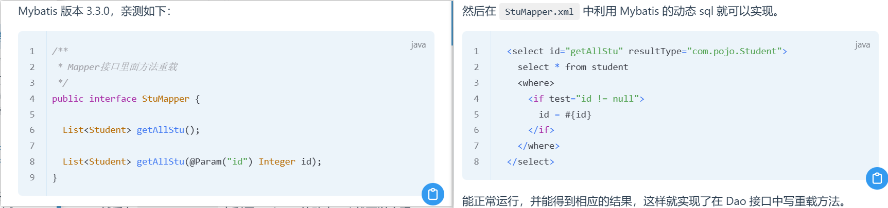


**原理：Dao 接口的工作原理是 JDK 动态代理，**MyBatis 运行时会使用 JDK 动态代理为 Dao 接口生成代理 proxy 对象，代理对象 proxy 会拦截接口方法，转而执行 `MappedStatement` 所代表的 sql，然后将 sql 执行结果返回。


# 二、Spring

## 1.Spring的特点，介绍一下

Spring是分层的 Java EE应用 full-stack 轻量级开源框架，以 **IoC（Inverse Of Control：反转控制）**和**AOP（Aspect Oriented Programming：面向切面编程）**为内核。提供了**表现层 SpringMVC** 和**持久层 Spring JDBCTemplate** 以及**业务层事务管理**等众多的企业级应用技术。

**Spring是业务逻辑层的框架。**MVC与三层架构。


**优势**

**1）IOC方便解耦，简化开发**

通过 Spring 提供的 IoC容器，可以将对象间的依赖关系交由 Spring 进行控制，避免硬编码所造成的过度耦合。

用户也不必再为单例模式类、属性文件解析等这些很底层的需求编写代码，可以更专注于上层的应用。

**2）AOP 编程的支持**

通过 Spring的 AOP 功能，方便进行面向切面编程，可以通过 AOP 轻松实现许多用传统 OOP 难实现的功能。

**3）声明式事务的支持**

可以将我们从单调烦闷的事务管理代码中解脱出来，通过声明式方式灵活的进行事务管理，提高开发效率和质量。

**4）方便集成各种优秀框架**

Spring对各种优秀框架（Struts、Hibernate、Hessian、Quartz等）的支持。

5）方便程序的测试

可以用非容器依赖的编程方式进行几乎所有的测试工作，测试不再是昂贵的操作，而是随手可做的事情。

6）降低 JavaEE API 的使用难度

Spring对 JavaEE API（如 JDBC、JavaMail、远程调用等）进行了薄薄的封装层，使这些 API 的使用难度大为降低。

7）Java 源码是经典学习范例

Spring的源代码设计精妙、结构清晰、匠心独用，处处体现着大师对Java 设计模式灵活运用以及对 Java技术的高深造诣。它的源代码无意是 Java 技术的最佳实践的范例。

**体系结构**

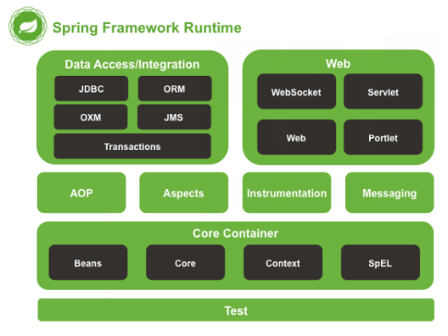

其中SpEl（Spring Expression Language，spring的EL表达式语言）没有接触过，前面的JSP是涉及到了EL表达式的，只是我们没有学而已。

## 2.Spring框架开发流程-xml

**1、导入依赖-spring-context**

```xml
  <dependency>
    <groupId>org.springframework</groupId>
    <artifactId>spring-context</artifactId>
    <version>5.3.14</version>
  </dependency>
```

**2、resources下创建Spring的核心配置文件——applicationContext.xml**

**3、编写接口和实现类**（这里我们就拿DAO层为例子）

**4、在applicationContext.xml中使用bean标签配置实现类**

​		这样最后可以通过反射得到的实现类对象。

```xml
<?xml version="1.0" encoding="UTF-8"?>
<beans xmlns="http://www.springframework.org/schema/beans"
       xmlns:xsi="http://www.w3.org/2001/XMLSchema-instance"
      xsi:schemaLocation="http://www.springframework.org/schema/beans http://www.springframework.org/schema/beans/spring-beans.xsd">
    
  
    <bean id="userDao" class="com.CCooky.dao.impl.UserDaoImpl"></bean>
</beans>
```

**5、使用时，先加载Spring配置文件，得到ApplicationContext应用上下文对象，然后调用其getBean(bean的id)方法** 获取对象示例。

```java
    @Test
    public void test1(){
      // 加载Spring应用
        ApplicationContext app = new ClassPathXmlApplicationContext("applicationContext.xml");
     //这里反射出来的应该是Impl实现类，所以这一行代码用到了强制类型转换和多态
        UserDao userDao = (UserDao) app.getBean("userDao");
        userDao.save();
    }
```


## 3.如何理解IOC和DI？

**IOC：控制反转，**

- **控制** ：指的是对象创建的权力
- **反转** ：控制权交给Spring 

通俗的说就是我们不用自己创建实例对象，这些都交给Spring的bean工厂帮我们创建管理。IoC 容器是 Spring 用来实现 IoC 的载体， IoC 容器实际上就是个 Map，Map 中存放的是各种对象。

将对象之间的相互依赖关系交给 IoC 容器来管理，并由 IoC 容器完成对象的注入。这样可以很大程度上简化应用的开发，把应用从复杂的依赖关系中解放出来。 IoC 容器就像是一个工厂一样，当我们需要创建一个对象的时候，只需要配置好配置文件/注解即可，完全不用考虑对象是如何被创建出来的。

**DI：依赖注入。**

简单说在容器内部，将一个Bean实例注入到另外一个Bean的成员属性中。它是 Spring IOC 的具体实现，将对象之间的相互依赖关系交给 IoC 容器来管理

如果不使用依赖注入，那就是只能通过应用上下文对象获取bean实例。

​                                                                                                                                                                                                                                                                                                                                                                                                                                                                                                                                                                                                                                                                                                                                                                                 

## 3.bean标签详解

简单来说，**Bean 代指的就是那些被 IoC 容器所管理的对象。**

默认情况下它调用的是类中的**无参构造函数**，**如果没有无参构造函数则不能创建成功。**

两个基本属性：

-  **id**：Bean对象实例在Spring容器中的唯一标识
-  **class**：Bean对象的全限定名称

`<bean id="userDao" class="com.CCooky.dao.impl.UserDaoImpl"></bean>`

### **Bean作用范围配置**

| scope**取值范围** | **说明**                                                     |
| ----------------- | ------------------------------------------------------------ |
| **singleton **    | **默认值，单例的**，就是说容器里面一直只有唯一一个对象       |
| **prototype**     | **多例的**，容器里面可以创建多个对象，每次使用创建一个新的   |
| request           | WEB 项目中，Spring 创建一个 Bean 的对象，将对象存入到 request 域中 |
| session           | WEB 项目中，Spring 创建一个 Bean 的对象，将对象存入到 session 域中 |
| global  session   | WEB 项目中，应用在 Portlet 环境，如果没有 Portlet 环境那么globalSession 相当 |

**1）当scope的取值为singleton时**

Bean的实例化个数：1个

==Bean的实例化时机：当Spring核心文件被加载时，实例化配置的Bean实例==

==Bean的生命周期：跟随容器的==

- 对象创建：当加载应用，创建容器时，对象被创建
- 对象运行：只要容器在，对象一直活着
- 对象销毁：当应用卸载，销毁容器时，对象就被销毁了

**2）当scope的取值为prototype时**

Bean的实例化个数：多个

==Bean的实例化时机：当调用getBean( )方法时实例化Bean==

==Bean的生命周期：普通的java对象==

-  对象创建：当使用对象时getBean()，对象被创建
-  对象运行：只要对象在使用中，就一直活着
-  对象销毁：当对象长时间不用时，被 Java 的垃圾回收器回收了

```xml
<bean id="userDao" class="com.CCooky.dao.impl.UserDaoImpl" scope="singleton"></bean>
```

### **Bean生命周期配置**

-  **init-method**：手动可指定类中的自己写的**初始化方法名称**，在对象创建后Spring会自动调用指定的方法，目的是完成一些必要的初始化工作
-  **destroy-method**：手动可指定类中自己**销毁方法名称**，在销毁对象前，Spring会自动调用指定的方法，目的是完成一些销毁前的工作

Example：applicationContext.xml

```xml
<bean id="userDao" class="com.CCooky.dao.impl.UserDaoImpl" scope="singleton" init-method="init" destroy-method="destory"></bean>
```

实现类

```java
public class UserDaoImpl implements UserDao {
    public UserDaoImpl() {
        System.out.println("无参构造器使用了");
    }

    public void init(){
        System.out.println("初始化方法Init.......");
    }
    public void destory(){
        System.out.println("Destory.......");
    }

    @Override
    public void save() {
        System.out.println("save is running.......");
    }
}
```

### **Bean实例化三种方式**

- **无参构造**方法实例化**（默认）**
- **工厂静态方法**实例化
- **工厂实例方法**实例化

==无参构造方法实例化==

就是前面入门用的这种，而且基本上大部分都是用这种，方便快捷。**如果Bean没有无参构造器那么就会创建对象失败**

```xml
<bean id="userDao" class="com.itheima.dao.impl.UserDaoImpl"/>
```

==工厂静态方法实例化==

新建一个对象，里面写一个静态方法，然后在配置文件加上factory-method属性指定该方法。

没有什么很特别的，就是看着好像高级一点

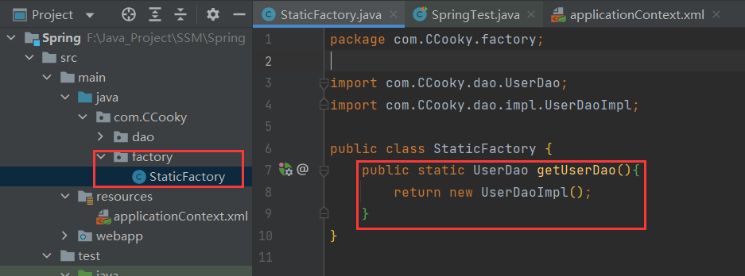

```xml
<bean id="userDao" class="com.CCooky.factory.StaticFactory" factory-method="getUserDao"></bean>
```

==工厂实例方法实例化==

这个和上一个静态方法几乎一样，方法内容什么的全部不用动，但多麻烦一步，因为是实例方法，所以需要通过实例对象才可以调用，不能直接类名＋方法名。

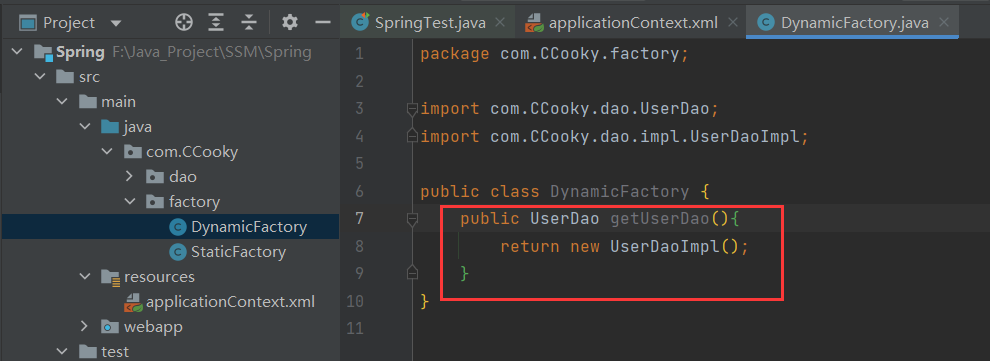

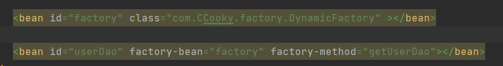

注意：第一个bean是声明了我们动态工厂类的对象，第二个标签是factory-bean，拿到实例对象，调用方法。


## ==3.Bean的生命周期过程？==

**我们描述 Bean 的生命周期，都是指的 Singleton Bean。**指定的就是Bean从创建到销毁的整个过程: 

分4大步：

**1、实例化对象**

- a.通过反射去推断无参构造函数进行实例化

- b.或者通过这两种方式实例工厂、静态工厂

**2、属性赋值**

- a.解析依赖注入 ( @Autowired ) DI 的体现

- b.这里会有一个循环依赖问题，Spring已经给我们解决好了

**3、初始化**

- a.调用XXXAware回调方法；

  - 如果 Bean 实现了 `BeanNameAware` 接口，调用 `setBeanName()`方法，传入 Bean 的名字。

  - 如果 Bean 实现了 `BeanClassLoaderAware` 接口，调用 `setBeanClassLoader()`方法，传入 `ClassLoader`对象的实例。

  - 如果 Bean 实现了 `BeanFactoryAware` 接口，调用 `setBeanFactory()`方法，传入 `BeanFactory`对象的实例。

    与上面的类似，如果实现了其他 `*.Aware`接口，就调用相应的方法。

- b.调用初始化生命周期回调(三种)，前置处理、是否实现initializingBean接口、是否配置init-method方法

- c.后置处理：==如果bean实现aop了，在后置处理就会创建动态代理对象，这里也有循环依赖问题要解决==

- d. **最后完成初始化，加入单例池**


**4、销毁**

- a.在spring容器关闭的时候进行调用
- b.调用销毁生命周期回调，三种。

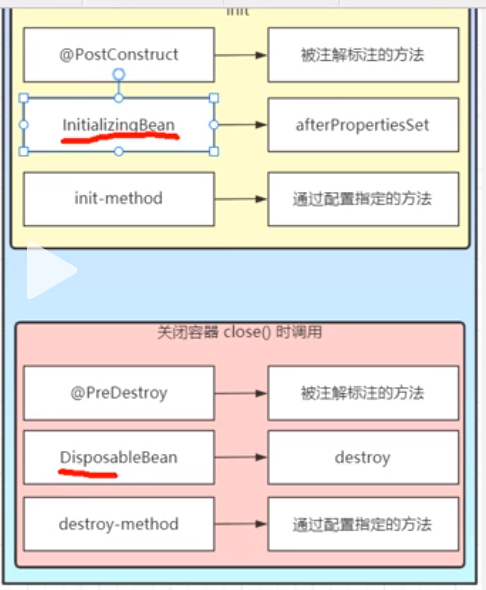

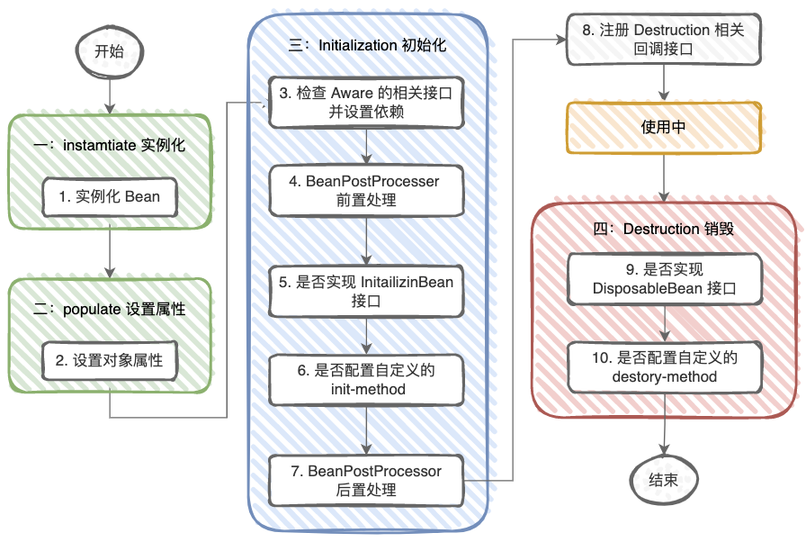


## 3.将一个类声明为 Bean 的注解有哪些?

- `@Component` ：通用的注解，可标注任意类为 `Spring` 组件。如果一个 Bean 不知道属于哪个层，可以使用`@Component` 注解标注。
- `@Repository` : 对应持久层即 Dao 层，主要用于数据库相关操作。
- `@Service` : 对应服务层，主要涉及一些复杂的逻辑，需要用到 Dao 层。
- `@Controller` : 对应 Spring MVC 控制层，主要用户接受用户请求并调用 Service 层返回数据给前端页面。

## 3.@Component 和 @Bean 的区别是什么？

- `@Component` 注解作用于类，而`@Bean`注解作用于方法。


## 4.Bean的依赖注入

什么是依赖注入：

**简单说在容器内部，将一个Bean实例注入到另外一个Bean的成员属性中。它是 Spring 框架核心 IOC 的具体实现**。

**如果不使用依赖注入，那就是只能通过应用上下文对象获取bean实例。**

- 那就会出现service层通过ApplicationContext对象getBean获取mapper实现类对象，调用其方法。
- controller层也是通过ApplicationContext对象getBean获取service实现类对象，调用其方法。
- 就会出现一是重复性代码，二是相当于我们先拿到mapper，然后在Spring容器外部将mapper组装到Service内部，这样就不符合逻辑，为什么不直接在容器内部完成组装呢，因为外部组装还要先去容器里面拿出来。


> 举个例子，controller调用service，service层调用mapper层。
>
> ① 创建 UserService，UserService内部也写一个save方法，里面调用 UserDao的save() 方法
>
> ```java
> public class UserServiceImpl implements UserService {
>     @Override
>     public void save() {
>         ApplicationContext app = new ClassPathXmlApplicationContext("applicationContext.xml");
>         UserDao userDao = (UserDao) app.getBean("userDao");
>         userDao.save();
>     }
> }
> ```
>
> ② 将 UserServiceImpl 的创建权交给 Spring
>
> ```xml
> <bean id="userService" class="com.CCooky.service.impl.UserServiceImpl"></bean>
> ```
>
> ③Controller层里面 从 Spring 容器中获得 UserService 进行操作
>
> ```java
> public class UserController {
>     public static void main(String[] args) {
>       
>         ApplicationContext app = new ClassPathXmlApplicationContext("applicationContext.xml");
>         UserService userService = (UserService) app.getBean("userService");
>         userService.save();
>     }
> }
> ```
>
> 开始运行，是没有问题。
>
> 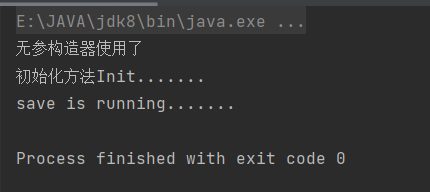
>
> 我们分析一下整个实现流程：目前**UserService实例**和**UserDao实例**都存在与Spring容器中，当前的做法是**在容器外部获得**UserService实例和UserDao实例，然后在程序中进行结合。
>
> 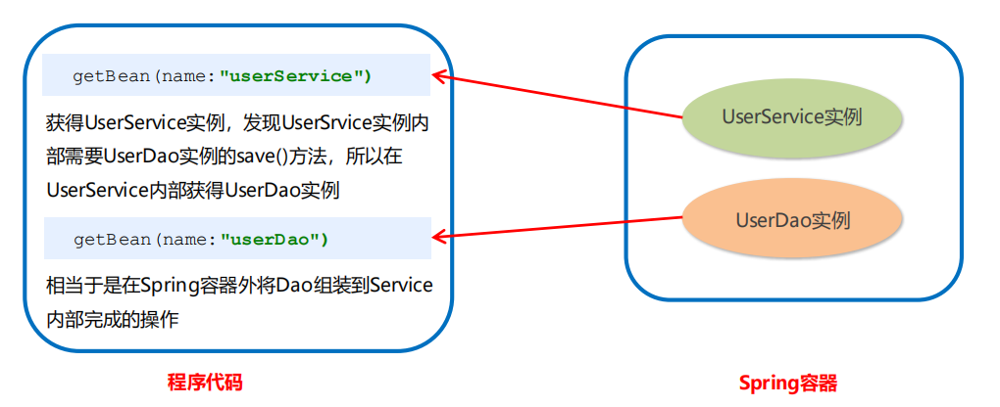
>
> 这种方式是不是显得有笨笨的呢！！！因为里面有重复代码，我们new了两个app出来，而且最终程序直接使用的只有UserService啊，所以说：我们应该在Spring容器里面，将将UserDao设置到UserService内部！！！
>
> 因为UserService和UserDao都在Spring容器中，而最终程序直接使用的是UserService，所以可以**在Spring容器中，将UserDao设置到UserService内部。**
>
> 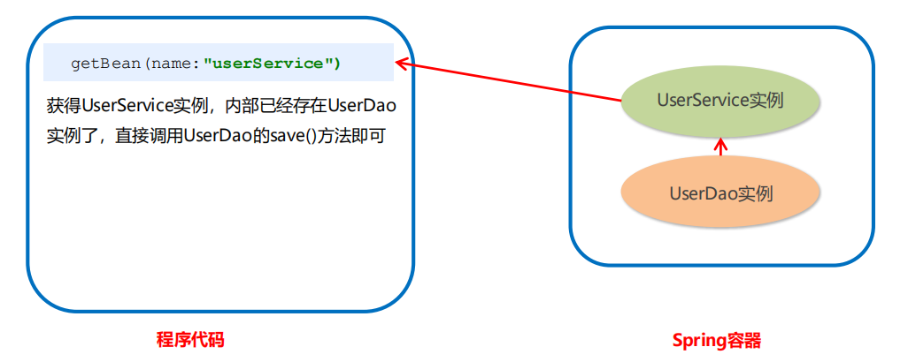


### Bean依赖注入方式

注入数据的三种数据类型

-  **引用数据类型**==（set方法、构造方法）（bean的property属性、bean的constructor-arg）==
-  **普通数据类型**（bean的property属性）
-  **集合数据类型**（bean的property属性）


#### 引用数据类型

就是将UserDao怎样注入到UserService内部。一是Setter方法注入，而是有参构造器注入。

==**set方法注入**==

**这个很简单，就是在被注入的Bean中写上对应成员属性的setter方法，然后在bean标签配置property属性**

例如在UserServiceImpl中写上setUserDao方法。

```java
public class UserServiceImpl implements UserService {
  // 添加一个成员变量
    private UserDao userDao;
  
    public void setUserDao(UserDao userDao) {
        this.userDao = userDao;
    }
    @Override
    public void save() {
    /*ApplicationContext app = new ClassPathXmlApplicationContext("applicationContext.xml");
        UserDao userDao = (UserDao) app.getBean("userDao");
    */
        userDao.save();
    }
}
```

配置Spring容器调用set方法进行注入, **bean的Property标签**

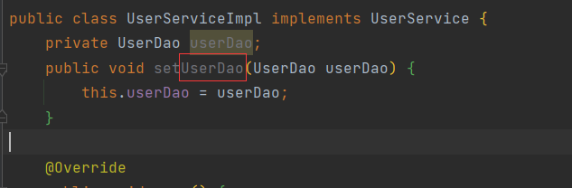

```xml
<bean id="userDao" class="com.itheima.dao.impl.UserDaoImpl"/>

<bean id="userService" class="com.itheima.service.impl.UserServiceImpl"> 
  	<property name="userDao" ref="userDao"/>
</bean>
```

==注意哦：<property name="userDao" ref="userDao"/>，这个里面的name是指的你要调用的set方法，因为Spring知道你是set注入，所以不用写set，直接写setUserDao的后面字符。小驼峰格式；==

==ref代表引用，是指的被注入的那个容器bean对象，前面我们已经把userDao对象放到了Spring容器里面，id为userDao，所以这里写userDao==

这样，在Spring容器里面，UserDao就被设置到UserService内部！！！


==**构造函数注入**==

**和前面的set差不多，只是说用的是有参构造器注入参数，使用的是bean标签的construct-arg属性。**

```java
public class UserServiceImpl implements UserService {
    private UserDao userDao;

    public UserServiceImpl(UserDao userDao) {
        this.userDao = userDao;
    }

    @Override
    public void save() {
        userDao.save();
    }
}
```

在核心配置文件，配置constructor-arg标签

==注意哦：<constructor-arg name="userDao" ref="userDao"></constructor-arg>，里面第一个name是指的构造器的参数，就是那个被注入的成员变量userDao；==

==ref代表引用，是指的被注入的对象，前面我们已经把userDao对象放到了Spring容器里面，id为userDao，所以这里写userDao==

```xml
<bean id="userService" class="com.CCooky.service.impl.UserServiceImpl">
    <constructor-arg name="userDao" ref="userDao"></constructor-arg>
</bean>
```

#### 普通数据类型

==**普通数据类型 **==**< property name="username" value="周权"></property>**

```java
public class UserDaoImpl implements UserDao {
    private String username;
    private int age;

    public void setUsername(String username) {
        this.username = username;
    }

    public void setAge(int age) {
        this.age = age;
    }

    @Override
    public void save() {
        System.out.println("save is running.......");
        System.out.println(username);
        System.out.println(age);
    }
}
```

```xml
<bean id="userDao" class="com.CCooky.dao.impl.UserDaoImpl">
    <property name="username" value="周权"></property>
    <property name="age" value="22"></property>
</bean>

<bean id="userService" class="com.CCooky.service.impl.UserServiceImpl">
    <property name="userDao" ref="userDao"></property>
</bean>
```

#### **集合数据类型**

```java
public class UserDaoImpl implements UserDao {
		private List<String> strList;
  
		public void setStrList(List<String> strList) {
				this.strList = strList;
		}
    @Override
		public void save() {
				System.out.println(strList);
				System.out.println("UserDao save method running....");
		} 
}
```

```xml
<bean id="userDao" class="com.CCooky.dao.impl.UserDaoImpl">
    <property name="strList">
        <list>
            <value>aaa</value>
            <value>ccc</value>
            <value>bbb</value>
        </list>
    </property>
</bean>
```

还有其他的就不看了，以后springboot也不需要写这些，但要知道原理


## 5.**ApplicationContext接口**

**applicationContext：**接口类型，代表**应用上下文对象**，可以通过其实例获得 Spring 容器中的 Bean 对象。

ApplicationContext的实现类

**1）ClassPathXmlApplicationContext**

​		==从类的根路径下加载xml配置文件（放在resources下）==推荐使用这种

**2）FileSystemXmlApplicationContext**

​		它是从磁盘路径上加载配置文件，配置文件可以在磁盘的任意位置。

**3）AnnotationConfigApplicationContext**

​		==当使用注解配置容器对象时==，需要使用此类来创建 spring 容器。它用来读取注解。


## 5.getBean()方法使用

```java
// 一、根据bean的id找
public Object getBean(String name) throws BeansException {
		assertBeanFactoryActive();
		return getBeanFactory().getBean(name);
}
// 二、根据字节码对象类型找（不用这个）
public <T> T getBean(Class<T> requiredType) throws BeansException {
		assertBeanFactoryActive();
		return getBeanFactory().getBean(requiredType);
}
```

- 当**参数的数据类型是字符串**时，表示根据**Bean的id**从容器中获得Bean实例，返回是Object，需要强转。

- 当**参数的数据类型是Class类型**时，表示根据**字节码对象类型**从容器中匹配Bean实例，==当容器中相同类型的Bean有多个时，则此方法会报错。即这种方式bean的作用范围只能是singleton==


## 7.spring注解开发

Spring是轻代码而重配置的框架，配置比较繁重，影响开发效率，所以注解开发是一种趋势，**注解代替xml配置文件可以简化配置，提高开发效率。**

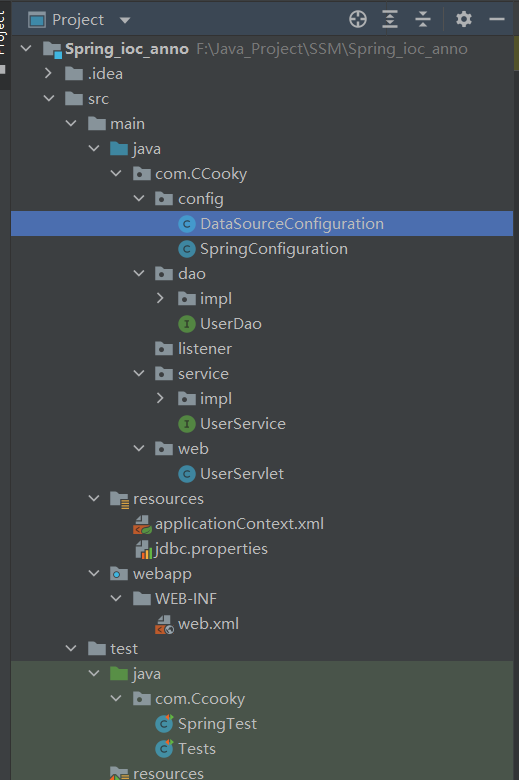


### **Spring原始注解替代< Bean>**

Spring原始注解主要是替代< Bean>的配置

| **注解**       | **说明**                                                     |
| -------------- | ------------------------------------------------------------ |
| @Component     | 使用在类上用于实例化Bean                                     |
| @Controller    | 使用在web层类上用于实例化Bean(同Component，但具有语义的作用) |
| @Service       | 使用在service层类上用于实例化Bean(同Component，但具有语义的作用) |
| @Repository    | 使用在dao层类上用于实例化Bean(同Component，但具有语义的作用) |
| **@Autowired** | 使用在字段上按照**数据类型**从Spring容器中进行**依赖注入**（等同于getBean里面字节码对象类型注入，可能有问题） |
| @Qualifier     | 结合@Autowired一起使用，根据**bean名称进行依赖注入**         |
| **@Resource**  | 相当于@Autowired+@Qualifier，按照**bean名称进行注入**        |
| @Value         | **注入普通数据属性   < property value>标签**                 |
| **@Scope**     | 标注Bean的作用范围                                           |

| **注解**           | **说明**                                                 |
| ------------------ | -------------------------------------------------------- |
| **@PostConstruct** | 使用在方法上标注该方法是Bean的初始化方法（init-method）  |
| **@PreDestroy**    | 使用在方法上标注该方法是Bean的销毁方法（destroy-method） |

### **组件扫描**

你自己配置好了，但是Spring不晓得的哇，你要去告诉Spring，我代码哪些部分已经配置了注解，需要在applicationContext.xml中配置组件扫描，配置一个包的范围，==这样Spring就会自动去这个包以及子包下所有的注解。==

```xml
<!--注解的组件扫描--> 
<context:component-scan base-package="com.CCooky"></context:component-scan>
```


**@Component** 

​	可以加bean-id，也可以不加bean-id。不加的话，注入就只能根据字节码对象类型注入。

```java
@Component("userDao")

@Component
```

**@Autowired** 

​	当使用这个注解进行注入时，不用再写set方法，具体他是使用的什么办法进行注入的呢，这里暂时没有讲。一般与@Qualifier 一起用根据bean-id进行注入，比较专业

```java
    @Autowired
    private UserDao userDao;

    @Autowired
    @Qualifier("userDao")
    private UserDao userDao;
```

**@Value**

使用很简单。直接在成员变量上加这个注解，同时可以结合SpEL使用，舒舒服服。

```java
    @Value("周权")
    private String name;

    @Value("${jdbc.driver}")
    private String driver;
```


###  **Spring新注解-去掉xml配置文件**

**使用上面的注解还不能全部替代xml配置文件**，例如我们上面案例中的数据源配置、组件扫描配置等，其他的需要使用注解替代的xml标签如下：

-  **非自定义的Bean的配置**：< bean>
-  加载properties文件的配置：<context:property-placeholder >
-  组件扫描的配置：<context:component-scan >
-  引入其他文件：< import>

| **注解**            | **说明**                                                     |
| ------------------- | ------------------------------------------------------------ |
| **@Configuration**  | 标志该类是Spring的**核心配置类！可以有多个**，一般就是一个主配置类加载几个其他的配置类 |
| **@ComponentScan**  | 用于指定 Spring 在初始化容器时要扫描的包。作用和在 Spring 的 xml 配置文件中的<context:component-scan   base-package="com.CCooky"/>一样 |
| **@Bean**           | **使用在方法上**，标注将该方法的返回值对象放到 Spring 容器中。必须配套**@Configuration在该类上** |
| **@PropertySource** | 用于加载.properties 文件中的配置                             |
| **@Import**         | 用于导入其他配置类，导入的是数组哦                           |

```java
@ComponentScan("com.CCooky")

@Bean("dataSource")// Spring会将当前方法的返回值以指定名称bean-id存储到容器里面
public DataSource getDataSource(){
			......
}

@PropertySource("classpath:jdbc.properties")// 用于加载.properties文件中的配置

@Import({DataSourceConfiguration.class}) //加载子配置类到主配置类，导入的是数组哦
```


> **案例：**
>
> 接着上面的案例，把下面的三个注释的内容用注解替代！！！并且把这个xml配置文件也可以删掉了哦，哈哈哈哈哈，完全注解开发！！
>
> ```xml
> <?xml version="1.0" encoding="UTF-8"?>
> <beans xmlns="http://www.springframework.org/schema/beans"
>        xmlns:context="http://www.springframework.org/schema/context"
>        xmlns:xsi="http://www.w3.org/2001/XMLSchema-instance"
>        xsi:schemaLocation="http://www.springframework.org/schema/beans
>        http://www.springframework.org/schema/beans/spring-beans.xsd
>        http://www.springframework.org/schema/context
>        http://www.springframework.org/schema/context/spring-context.xsd">
> <!--加载properties文件-->
>     <context:property-placeholder location="classpath:jdbc.properties"></context:property-placeholder>
> <!--dataSource-->
>     <bean id="dataSource" class="com.alibaba.druid.pool.DruidDataSource">
>         <property name="driverClassName" value="${jdbc.driver}"></property>
>         <property name="url" value="${jdbc.url}"></property>
>         <property name="username" value="${jdbc.username}"></property>
>         <property name="password" value="${jdbc.password}"></property>
>     </bean>
> <!--配置组件扫描-->
>     <context:component-scan base-package="com.CCooky"></context:component-scan>
> </beans>
> ```
>
> **第一步：新建核心配置类**
>
> 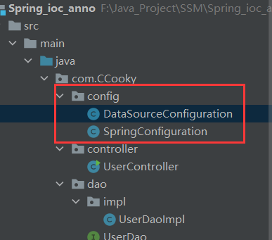
>
> ```java
> @Configuration
> @ComponentScan("com.CCooky")
> @Import({DataSourceConfiguration.class})
> public class SpringConfiguration {
>     
> }
> ```
> 
> **第二步：新建数据源的配置类，**用来加载jdbc.properties里面的信息，并且创建DataSource对象，放到容器里面。
> 
>     ```java
> @PropertySource("classpath:jdbc.properties")
> @Configuration
>public class DataSourceConfiguration {
>  @Value("${jdbc.driver}")
> private String driver;
>  @Value("${jdbc.url}")
>  private String url;
>  @Value("${jdbc.username}")
>  private String username;
>  @Value("${jdbc.password}")
>     private String password;
>    
>     @Bean("dataSource")
>    	 //Spring会将当前方法的返回值以指定名称bean-id存储到容器里面
>     public DataSource getDataSource(){
>         //创建数据源
>         DruidDataSource dataSource = new DruidDataSource();
>         //设置数据库连接参数
>      dataSource.setDriverClassName(driver);
>         dataSource.setUrl(url);
>       dataSource.setUsername(username);
>         dataSource.setPassword(password);
>         return dataSource;
>     }
>    }
>     ```
>    
>    **第三步：测试类，这里创建app上下文应用时，要换一个实现类**。前面都是用的类路径xml加载的实现类，现在要用注解配置的实现类。
>    
>    ```java
>    new ClassPathXmlApplicationContext("applicationContext.xml")
> ```
> 
>```java
> new AnnotationConfigApplicationContext(SpringConfiguration.class)
>```
> 
> ```java
> @Test
>public void testConfiguration(){
>  ApplicationContext app = new AnnotationConfigApplicationContext(SpringConfiguration.class);
>  UserService userService = (UserService) app.getBean("userService");
>  userService.save();
>}
> ```
> 


## 8. javase的动态代理Proxy

**概述**

代理就是被代理者没有能力或者不愿意去完成某件事情，需要找个人代替自己去完成这件事，**动态代理就是用来对业务功能（方法）进行代理的。**例如我要出国，但我不想去弄很多的证明，所以我出钱要别人给我弄，我只用做飞机就行了。其实他出现的原因是在于：想让程序员在业务实现层仅仅保留你的逻辑代码就好了，一些其他的冗余，重复，没有技术的东西让代理去做，这样代码很整洁，方便查看。

**关键步骤**

1. 必须有接口，实现类要实现接口（**代理通常是基于接口实现的**）。

2. 创建一个实现类的对象，该对象为业务对象，紧接着为业务对象做一个代理对象。


**优点**

1. 非常的灵活，==支持任意接口类型的实现类对象做代理==，也可以直接为接本身做代理。
2. 可以为被代理对象的所有方法做代理。
3. ==可以在不改变方法源码的情况下，实现对方法功能的增强。==
4. 不仅简化了编程工作、提高了软件系统的可扩展性，同时也提高了开发效率。

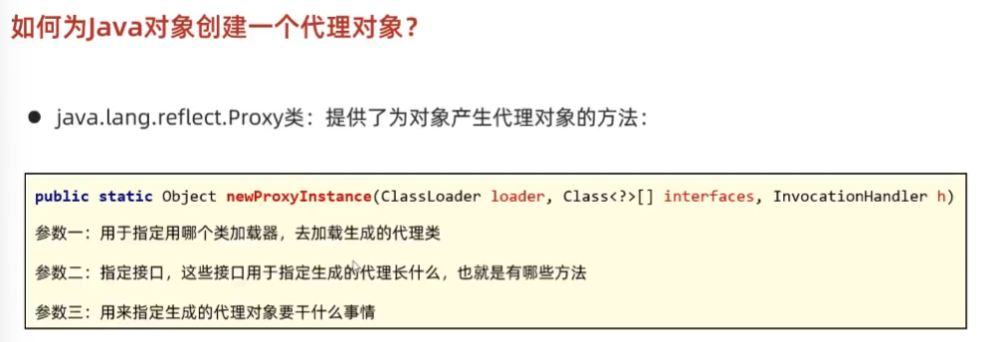


**举个案例说明好处与基本使用：**


这里我们会发现，这个统计耗时的工作是明显重复的，并且让我们的业务实现层变得很复杂，代码看着不优雅！！

**UserService:**

```java
/**
   模拟用户业务功能
 */
public interface UserService {
    String login(String loginName , String passWord) ;
    void selectUsers();
    boolean deleteUsers();
}
```

**UserServiceImpl:**

```java
public class UserServiceImpl implements UserService{
    @Override
    public String login(String loginName, String passWord)  {
        try {
            Thread.sleep(1000);
        } catch (Exception e) {
            e.printStackTrace();
        }
        if("admin".equals(loginName) && "1234".equals(passWord)) {
            return "success";
        }
        return "登录名和密码可能有毛病";

    }

    @Override
    public void selectUsers() {
        System.out.println("查询了100个用户数据！");
        try {
            Thread.sleep(2000);
        } catch (Exception e) {
            e.printStackTrace();
        }
    }

    @Override
    public boolean deleteUsers() {
        try {
            System.out.println("删除100个用户数据！");
            Thread.sleep(500);
            return true;
        } catch (Exception e) {
            e.printStackTrace();
            return false;
        }
    }
```

**代理对象：ProxyUtil（写成了一个工具类）**

这里写的是泛型，表明可以接收任意类型，为任意业务进行耗时统计。

```java
/**
    public static Object newProxyInstance(ClassLoader loader,  Class<?>[] interfaces, InvocationHandler h)
    参数一：类加载器，负责加载代理类到内存中使用。
    参数二：获取被代理对象实现的全部接口。代理要为全部接口的全部方法进行代理
    参数三：代理的核心处理逻辑
 */
public class ProxyUtil {
    /**
      生成业务对象的代理对象。
     * @param obj
     * @return
     */
    public static <T> T  getProxy(T obj) {
        // 返回了一个代理对象了
        return (T)Proxy.newProxyInstance(obj.getClass().getClassLoader(),
                obj.getClass().getInterfaces(),
                new InvocationHandler() {
                    @Override
                    public Object invoke(Object proxy, Method method, Object[] args) throws Throwable {
                        // 参数一：代理对象本身。一般不管
                        // 参数二：正在被代理的方法
                        // 参数三：被代理方法，应该传入的参数
                       long startTimer = System .currentTimeMillis();
                        // 马上触发方法的真正执行。(触发真正的业务功能)
                        Object result = method.invoke(obj, args);

                        long endTimer = System.currentTimeMillis();
                        System.out.println(method.getName() + "方法耗时：" + (endTimer - startTimer) / 1000.0 + "s");

                        // 把业务功能方法执行的结果返回给调用者
                        return result;
                    }
                });
    }
}
```

**测试类**

```java
public class Controller {
    public static void main(String[] args) {
      	// 使用时就这里，实现类时通过代理Proxy.拿到的
        UserService1 userService1 = ProxyUtil1.getProxy(new UserServiceImpl1());
      
        System.out.println(userService1.login("admin", "123456"));
        userService1.selectUsers();
        System.out.println(userService1.deleteUsers());
    }
}
```


## ==9.Spring AOP简介==

**AOP** 为 **A**spect **O**riented **P**rogramming 的缩写，意思为**面向切面编程**，**是通过预编译方式和运行期动态代理 实现程序功能的统一维护的一种技术。**

**AOP 是 OOP（面向对象编程） 的延续**，是软件开发中的一个热点，也是Spring框架中的一个重要内容，是函数式编程的一种衍生范型。利用AOP可以对业务逻辑的各个部分进行隔离（松耦合），从而使 得业务逻辑各部分之间的耦合度降低，提高程序的可重用性，同时提高了开发的效率。

-  **作用：在程序运行期间，在不修改源码的情况下对方法进行功能增强**
-  **优势：减少重复代码，提高开发效率，并且便于维护**

暂且理解，**切面的意思就是业务方法与增强方法的结合。**

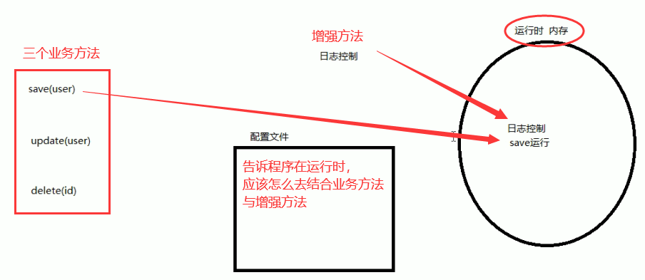

## ==10.springAOP 的底层实现==

AOP 的底层是通过 Spring 提供的的动态代理技术实现的。

**在运行期间，Spring通过动态代理技术动态的生成代理对象，代理对象方法执行时进行增强功能的介入，再去调用目标对象的方法，从而完成功能的增强。**

常用的动态代理技术

-  **JDK 代理 :** 基于**接口**的动态代理技术，利用反射技术生成匿名的代理类走 ==InvokeHandler回调方法==实现增强；
-  **cglib 代理：**基于**父类**的动态代理技术，==代理对象子类去重写所有父类的非final、非public方法，实现功能增强==

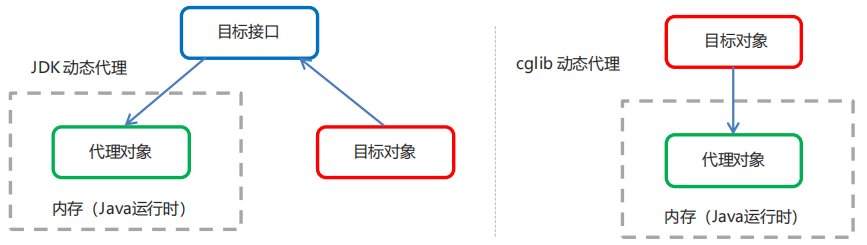

- 具体JDK代理实现：是通过``Proxy.newProxyInstance()`这个方法来实现的，方法参数需要传入被代理的接口类，之所以只能传入接口类，是因为jdk动态代理在程序运行期间会生成一个代理类，叫`$Proxy0`，它呢会继承我们的Proxy类，同时去实现被代理类的接口，由于是单继承，所以只能去代理接口，不能代理实现类；

- 当没有接口时，cglib是去动态生成一个对象，并且这个对象的父类是我们的目标对象！！==是父子关系，但不是通过继承实现的哦，后面会进行详解。==


##  **==11.springAOP 相关概念==**

Spring 的 AOP 实现底层就是对上面的动态代理的代码进行了封装，封装后我们只需要对需要关注的部分进行代码编写，并通过配置的方式完成指定目标的方法增强。

在正式讲解 AOP 的操作之前，我们必须理解 AOP 的相关术语，常用的术语如下：

-  **Target（目标对象）**：代理的目标对象
-  **Proxy （代理对象）**：一个类被 AOP 织入增强后，就产生一个结果代理类
-  **Joinpoint（连接点）**：所谓连接点是指那些被拦截到的点。在spring中,这些点指的是方法，因为spring只支持方法类型的连接点。**（可以被增强的方法就是连接点）**

-  **Pointcut（切点）**：所谓切入点是指我们要对哪些 Joinpoint 进行拦截的定义**（真正被增强的那些方法就是切入点）**
-  **Advice（通知/ 增强）**：所谓通知是指拦截到 Joinpoint 之后所要做的事情就是通知**（就是那些增强方法）**
-  **Aspect（切面）**：是切入点**Pointcut**和通知**Advice**（引介）的结合
-  **Weaving（织入）**：是指把通知，应用到目标对象来创建新的代理对象的过程。spring采用动态代理织入，==而AspectJ采用编译期织入和类装载期织入 （切点和通知集合的这个过程）==

## **12.springAOP 开发流程**

**1. 需要编写的内容**

-  编写核心业务代码（目标类的目标方法——连接点）
-  编写切面类，切面类中有通知 (增强功能方法) 
-  在配置文件中，配置织入关系，即将哪些通知与哪些连接点进行结合，即指定哪些方法是切点

**2. AOP 技术实现的内容**

Spring 框架监控切入点方法的执行。一旦监控到切入点方法被运行，使用代理机制，动态创建切点方法所在的目标对象的代理对象，根据配置的通知类型，在代理对象的对应位置，将通知对应的功能织入，完成完整的代码逻辑运行。

**3. AOP 底层使用哪种代理方式**

在 spring 中，框架会根据目标类是否实现了接口来决定采用哪种动态代理的方式。很聪明哦！！！

## 前期知识点总结

-  **aop：**面向切面编程
-  **aop底层实现：**基于JDK的动态代理 和 基于Cglib的动态代理
-  **aop的重点概念：**

​			Pointcut（切入点）：被增强的方法

​			Advice（通知/ 增强）：封装增强业务逻辑的方法

​			Aspect（切面）：切点+通知

​			Weaving（织入）：将切点与通知结合的过程

-  **开发明确事项：**

​			谁是切点（切点表达式配置）

​			谁是通知（切面类中的增强方法）

​			将切点和通知进行织入配置


## 13.基于 XML 的 AOP 开发

**① 导入 AOP 相关坐标（aspectJ）**

**② 创建目标接口和目标类（内部有切点）**

**③ 创建切面类（内部有增强方法）**

**④ 将目标类和切面类的对象创建权交给 spring**

**⑤ 在 applicationContext.xml 中配置织入关系**

⑥ 测试代码

**第一步：**

这里采用**AspectJ这个轻量级框架进行AOP的实现**，spring内部也进行了AOP思想的实现，但spring的方式没有aspectJ的这个好！，后期**spring官方也推荐大家使用aspectJ来实现aop。**

```xml
<dependency>
  <groupId>org.springframework</groupId>
  <artifactId>spring-context</artifactId>
  <version>5.3.14</version>
</dependency>
<dependency>
  <groupId>org.aspectj</groupId>
  <artifactId>aspectjweaver</artifactId>
  <version>1.9.6</version>
</dependency>
```

**第二步：创建目标接口和目标类（内部有切点）**

依然还是之前的简单实现

```java
public interface TargetInterface {
    public abstract void save();
}

// 实现类
public class Target implements TargetInterface {
    @Override
    public void save() {
        System.out.println("saveing ..........");
    }
}
```

**第三步：创建切面类（内部有增强方法）**

```java
public class MyAspect {

    public void before(){
        System.out.println("前置增强。。。。。");
    }
}
```

**第四步：将目标类和切面类的对象创建权交给 spring，并且配置织入关系。**

​		要引入aop的命名空间和真实地址。

```xml
<?xml version="1.0" encoding="UTF-8"?>
<beans xmlns="http://www.springframework.org/schema/beans"
       xmlns:xsi="http://www.w3.org/2001/XMLSchema-instance"
       xmlns:context="http://www.springframework.org/schema/context"
       xmlns:aop="http://www.springframework.org/schema/aop"
       xsi:schemaLocation="
       http://www.springframework.org/schema/beans http://www.springframework.org/schema/beans/spring-beans.xsd
       http://www.springframework.org/schema/context http://www.springframework.org/schema/context/spring-context.xsd
       http://www.springframework.org/schema/aop http://www.springframework.org/schema/aop/spring-aop.xsd
">

<!--    目标对象-->
    <bean id="target" class="com.CCooky.aop.Target"></bean>
<!--    切面对象-->
    <bean id="myAspect" class="com.CCooky.aop.MyAspect"></bean>
  
<!--    配置织入：告诉spring框架哪些方法（切点）需要进行哪些增强（通知）-->
    <aop:config>
        <!--声明切面类-->
        <aop:aspect ref="myAspect">
            <!--
            切面：切点+通知
                before：指明通知的类型（前置增强）
                method：指定使用哪个增强方法
                pointcut: 指定哪个业务方法被增强（指定切点）
            -->
            <aop:before method="before" pointcut="execution(public void com.CCooky.aop.Target.save())"/>
          
        </aop:aspect>
    </aop:config>
  
</beans>
```

第五步：测试代码。这里用Spring集成的那个junit，而不是单独的junit，需要先导入依赖。

```xml
    <dependency>
      <groupId>junit</groupId>
      <artifactId>junit</artifactId>
      <version>4.12</version>
<!--      <scope>test</scope>-->
    </dependency>
    <dependency>
      <groupId>org.springframework</groupId>
      <artifactId>spring-test</artifactId>
      <version>5.3.14</version>
    </dependency>
```

```java
@RunWith(SpringJUnit4ClassRunner.class)
@ContextConfiguration("classpath:applicationContext.xml")
public class AopTest {

    @Autowired	// 根据字节码文件从容器里面找对象，并注入
    private TargetInterface target;

    @Test
    public void test1(){
        target.save();
    }
}
```

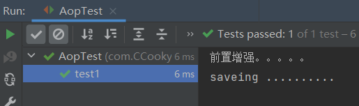

666666666666666666666666666666666666666666666666666666666

**xml中aop配置织入详解**

主要就是aop那一段配置。

```xml
<!--    配置织入：告诉spring框架哪些方法（切点）需要进行哪些增强（通知）-->
    <aop:config>
        <!--声明切面类-->
        <aop:aspect ref="myAspect">
            <!--
            	切面：切点+通知
                before：指明通知的类型（前置增强）
                method：指定使用哪个增强方法
                pointcut: 指定哪个业务方法被增强（指定切点）
            -->
            <aop:before method="before" pointcut="execution(public void com.CCooky.aop.Target.save())"/>
        </aop:aspect>
    </aop:config>
```

**切点表达式的写法**

```xml
<aop:before method="before" 
  pointcut="execution(public void com.CCooky.aop.Target.save())"/>
```

表达式语法：

```xml
execution([修饰符] 返回值类型 包名.类名.方法名(参数)) （6个）
```

-  **访问修饰符**可以省略，默认public
-  **返回值类型、包名、类名、方法名**可以使用星号 * ( 通配符）代表任意
-  包名与类名之间**一个点 .** 代表当前包下的类，**两个点 ..** 表示当前包及其子包下的类
-  参数列表可以使用 **两个点 ..**  表示任意个数，任意类型的参数列表

例如：

```
execution(public void com.itheima.aop.Target.method())
execution(void com.itheima.aop.Target.*(..))
execution(* com.itheima.aop.*.*(..))
execution(* com.itheima.aop..*.*(..))
execution(* *..*.*(..))
```

**切点表达式的抽取**

当多个增强方法的切点表达式相同时，可以将切点表达式进行抽取，在增强中使用 **pointcut-ref** 属性代替 pointcut 属性来引用抽取后的切点表达式！！！

例如，现在是这种情况：

```xml
<!--    目标对象-->
    <bean id="target" class="com.CCooky.aop.Target"></bean>
<!--    切面对象-->
    <bean id="myAspect" class="com.CCooky.aop.MyAspect"></bean>
<!--    配置织入：告诉spring框架哪些方法（切点）需要进行哪些增强（通知）-->
    <aop:config>
        <!--声明切面类-->
        <aop:aspect ref="myAspect">  
          
            <!--
            切面：切点+通知
                before：指明通知的类型（前置增强）
                method：指定使用哪个增强方法
                pointcut: 指定哪个业务方法被增强（指定切点）
            -->
            <aop:before method="before" pointcut="execution(* com.CCooky.aop.*.*(..))"/>
            <aop:after-returning method="afterReturningggg" pointcut="execution(* com.CCooky.aop.*.*(..))"/>
        </aop:aspect>
    </aop:config>
```

将那个piontcut切点表达式的抽取出来！！！如下：

```xml
<!--    目标对象-->
    <bean id="target" class="com.CCooky.aop.Target"></bean>
<!--    切面对象-->
    <bean id="myAspect" class="com.CCooky.aop.MyAspect"></bean>
<!--    配置织入：告诉spring框架哪些方法（切点）需要进行哪些增强（通知）-->
    <aop:config>
        <!--声明切面类-->
        <aop:aspect ref="myAspect">
          
            <!--切点表达式抽取-->
            <aop:pointcut id="myPointcut" expression="execution(* com.CCooky.aop.*.*(..))"/>
          
            <!--
            切面：切点+通知
                before：指明通知的类型（前置增强）
                method：指定使用哪个增强方法
                pointcut: 指定哪个业务方法被增强（指定切点）
            -->
            <aop:before method="before" pointcut-ref="myPointcut"/>
            <aop:after-returning method="afterReturning" pointcut-ref="myPointcut"/>
        </aop:aspect>
    </aop:config>

```

 **advice通知的类型**

在进行切面时，第一个属性就是通知的类型

```
<aop:通知类型 method=“切面类中方法名（增强方法）” pointcut=“切点表达式"></aop:通知类型>
```

| **名称**     | **标签**               | **说明**                                 |
| ------------ | ---------------------- | ---------------------------------------- |
| 前置通知     | < aop:before>          | 指定增强方法在切入点方法之前执行         |
| 后置通知     | < aop:after-returning> | 指定增强方法在切入点方法之后执行         |
| 环绕通知     | < aop:around>          | 指定增强方法在切入点方法之前和之后都执行 |
| 异常抛出通知 | < aop:after-throwing>  | 指定增强方法在切入点方法出现异常时执行   |
| 最终通知     | < aop:after>           | 无论切点方法是否有异常，增强方法都会执行 |


## ==14.基于注解的 AOP 开发@Aspect @Before（切点表达式)==

基于注解的aop开发步骤：

① 创建目标接口和目标类（内部有切点方法）（上同）

**② 创建切面类（内部有增强方法）（上同）**==@Aspect==

**③ 使用注解将目标类和切面类的对象创建权交给 spring**

④ **在切面类中使用注解配置织入关系** ==@Before（切点表达式)==

⑤ **在配置文件中开启组件扫描和 AOP 的自动代理**

⑥ 测试


目标接口与目标类

```java
public interface TargetInterface {
    public abstract void save();
}
```

```java
@Component("target")
public class Target implements TargetInterface {
    @Override
    public void save() {
        System.out.println("saveing ..........");
    }
}
```

**切面类**

```java
@Component("myAspect")
@Aspect   // 标示该类为切面类
public class MyAspect {

    // 配置织入（指定通知类型，和切点表达式）
    @Before("execution(* com.CCooky.anno.*.*(..))")
    public void before(){
        System.out.println("前置增强。。。。。");
    }
    
}
```

**applicationContext-anno.xml配置文件**

```xml
<!--    配置AOP的自动代理-->
    <aop:aspectj-autoproxy></aop:aspectj-autoproxy>
```


## 14.advice通知类型有哪些

通知的配置语法：@通知注解(”切点表达式“)

**@Before("execution(* com.CCooky.anno.*.*(..))")**

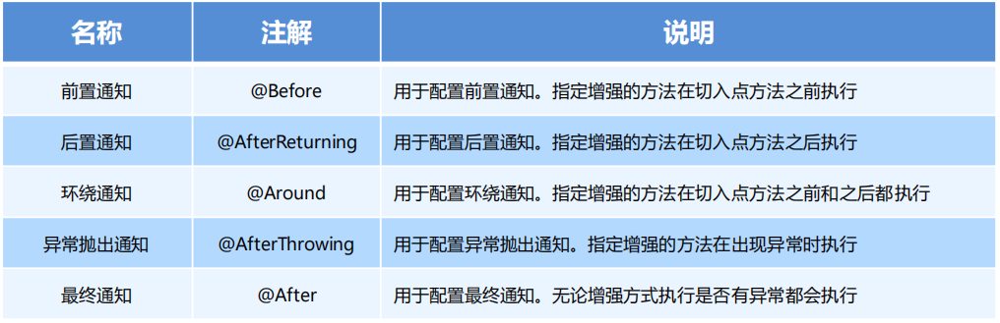

## 15.**切点表达式的写法**

```xml
<aop:before method="before" 
  pointcut="execution(public void com.CCooky.aop.Target.save())"/>
```

表达式语法：

```xml
execution([修饰符] 返回值类型 包名.类名.方法名(参数)) （6个）
```

-  **访问修饰符**可以省略，默认public
-  **返回值类型、包名、类名、方法名**可以使用星号 * ( 通配符）代表任意
-  包名与类名之间**一个点 .** 代表当前包下的类，**两个点 ..** 表示当前包及其子包下的类
-  参数列表可以使用 **两个点 ..**  表示任意个数，任意类型的参数列表

例如：

```
execution(public void com.itheima.aop.Target.method())
execution(void com.itheima.aop.Target.*(..))
execution(* com.itheima.aop.*.*(..))
execution(* com.itheima.aop..*.*(..))
execution(* *..*.*(..))
```


**切点表达式的抽取**

抽取方式是**在切面类内定义方法**，在该方法上使用@Pointcut注解定义切点表达式，方法内部什么都不用写，然后在在增强方法注解中进行引用。具体如下：

```java
@Component("myAspect")
@Aspect   // 标示该类为切面类
public class MyAspect {

    // 配置织入（指定通知类型，和切点方法）
    @Before("pointcut()")
    public void before(){
        System.out.println("前置增强。。。。。");
    }

    // 定义切点表达式
    @Pointcut("execution(* com.CCooky.anno.*.*(..))")
    public void pointcut(){}

}
```


## ==15.Spring **声明式**事务控制==

==就是对业务方法进行事务控制==。==之前的事务控制都是针对于数据库而言的==，例如mybatis里面commit等等。

### 编程式事务控制相关对象

编程式事务控制三大对象

-  PlatformTransactionManager
-  TransactionDefinition
-  TransactionStatus     前两个对象决定了第三个对象的信息。

**首先，先介绍这种编程式的事务控制方法（就是之前mybatis学的那种），他是通过我们人工自己写代码进行事务控制！！！（Dao层）。这也是Spring的声明式事务的底层。**

==**1. PlatformTransactionManager（平台事务管理器）**==

PlatformTransactionManager 接口是 spring 的事务管理器，它里面提供了我们常用的操作事务的方法。

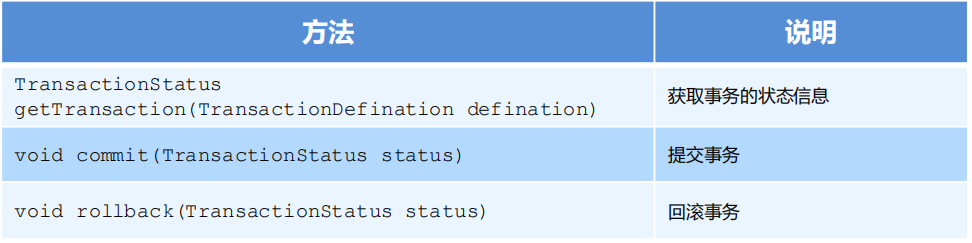

**注意：**

PlatformTransactionManager 是接口类型，不同的 Dao 层技术，spring则有不同的实现类。

例如：

- Dao 层技术是jdbc 或 mybatis 时：		  																						org.springframework.jdbc.datasource.DataSourceTransactionManager 
- Dao 层技术是hibernate时：org.springframework.orm.hibernate5.HibernateTransactionManager

==**2. TransactionDefinition（事务通知的配置）**==

TransactionDefinition 是事务的定义对象，里面有如下方法：

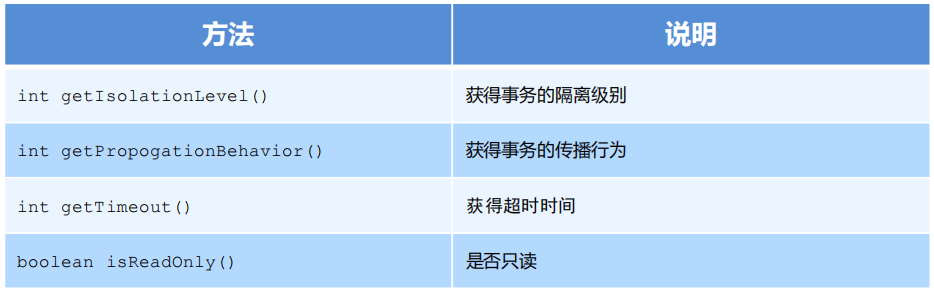

**事务隔离级别**

设置隔离级别，可以解决事务并发产生的问题，如脏读、不可重复读和虚读。

- ISOLATION_DEFAULT
- ISOLATION_READ_UNCOMMITTED（读未提交）
- ISOLATION_READ_COMMITTED（读已提交）
- ISOLATION_REPEATABLE_READ（可重复读）
- ISOLATION_SERIALIZABLE（串行化）

**事务传播行为**

解决问题：我们业务方法中可能出现A方法去调用B方法的情况，那此时A、B的事务可能就出现冲突之类的。

下面这么多的处理情况是：A方法，调用B方法。然后下面所有的主语都是B方法。是B去判断A的事务情况，然后做出反应

-  **REQUIRED：如果A当前没有事务，就新建一个事务，如果已经存在一个事务中，加入到这个事务中。一般的选择（默认值）**
-  **SUPPORTS：支持当前事务，如果当前没有事务，就以非事务方式执行（没有事务）**
-  MANDATORY：使用当前的事务，如果当前没有事务，就抛出异常
-  **REQUERS_NEW**：新建事务，如果当前在事务中，把当前事务挂起。
-  NOT_SUPPORTED：以非事务方式执行操作，如果当前存在事务，就把当前事务挂起
-  NEVER：以非事务方式运行，如果当前存在事务，抛出异常
-  NESTED：如果当前存在事务，则在嵌套事务内执行。如果当前没有事务，则执行 REQUIRED 类似的操作
-  **超时时间：默认值是-1，没有超时限制。如果有，以秒为单位进行设置**
-  **是否只读：建议查询时设置为只读**

==**3. TransactionStatus**==

TransactionStatus 接口提供的是事务的状态信息，这是被动的信息，方法介绍如下

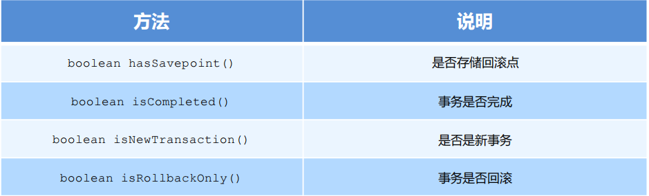


### 声明式事务控制


**1、什么是声明式事务控制**

Spring 的声明式事务顾名思义就是采用声明的方式来处理事务。这里所说的声明，在 XML 配置文件中配置或者直接基于注解（推荐使用），替代代码式的控制。


**2、声明式事务处理的作用**

-  **事务管理不侵入开发的组件。**具体来说，业务逻辑对象就不会意识到正在事务管理之中，事实上也应该如此，因为事务管理是属于系统层面的服务，而不是业务逻辑的一部分，如果想要改变事务管理策划的话，也只需要在定义文件中重新配置即可。==（这就是AOP的思想！！！哇，666，我们的开发就是切点，事务控制就是增强方法）==
-  **维护起来极其方便。**在不需要事务管理的时候，只要在设定文件上修改一下，即可移去事务管理服务，无需改变代码重新编译，这样维护起来极其方便

​	==**注意：Spring 声明式事务控制底层就是AOP。**==


### 基于 XML 的声明式事务控制

**声明式事务控制的实现**

​	声明式事务控制明确事项：

-  谁是切点？被增强的业务方法
-  谁是通知？事务控制
-  配置切面？织入配置

① 引入tx命名空间

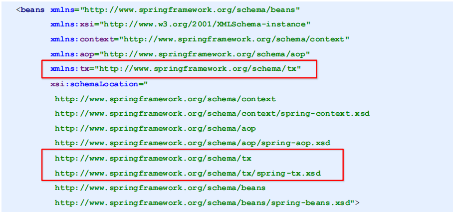

**② 配置事务增强**

**这里重点关注的东西，**他对应的就是前面说的三大事务对象中的==第二个控制事务属性==的==事务定义对象。==

```xml
<!--    配置平台事务管理器-->
    <bean id="transctionManager" class="org.springframework.jdbc.datasource.DataSourceTransactionManager">
        <property name="dataSource" ref="dataSource"></property>
    </bean>

<!--  事务增强配置-->
    <tx:advice id="txAdvice" transaction-manager="transctionManager">
      <!--设置事务的属性信息-->
        <tx:attributes>
          	<!--name 是被增强的方法名-->
            <tx:method name="*"/>
        </tx:attributes>
    </tx:advice>
```

**③ 配置事务 AOP 织入**

前面我们都是配的aspect，其实这里也是**aspect**，只是说Spring单独给我们整了一个名字，专门用来标示这是事务配置的织入而已。

```xml
<!--    配置事务AOP织入-->
    <aop:config>
        <aop:advisor advice-ref="txAdvice" pointcut="execution(* com.itheima.service.impl.*.*(..))"/>
    </aop:config>
```

这样就**给业务层的所有方法配置了事务管理。**必须要业务层的该方法全部执行完，才会向数据库提交事务。总体的xml配置内容如下：

```xml
    <bean id="dataSource" class="com.mchange.v2.c3p0.ComboPooledDataSource">
        <property name="driverClass" value="com.mysql.jdbc.Driver"/>
        <property name="jdbcUrl" value="jdbc:mysql://localhost:3306/test"/>
        <property name="user" value="root"/>
        <property name="password" value="root"/>
    </bean>

    <bean id="jdbcTemplate" class="org.springframework.jdbc.core.JdbcTemplate">
        <property name="dataSource" ref="dataSource"/>
    </bean>

    <bean id="accountDao" class="com.itheima.dao.impl.AccountDaoImpl">
        <property name="jdbcTemplate" ref="jdbcTemplate"/>
    </bean>
<!--     目标对象 内部的方法就是切点-->
    <bean id="accountService" class="com.itheima.service.impl.AccountServiceImpl">
        <property name="accountDao" ref="accountDao"/>
    </bean>

    <!--  从这里往下就是事务控制的实现  -->
<!--    配置平台事务管理器-->
    <bean id="transctionManager" class="org.springframework.jdbc.datasource.DataSourceTransactionManager">
        <property name="dataSource" ref="dataSource"></property>
    </bean>
<!--    通知 事务的增强配置-->
    <tx:advice id="txAdvice" transaction-manager="transctionManager">
      <!--设置事务的属性信息-->
        <tx:attributes>
           	<!--name 是被增强的方法名-->
            <tx:method name="*"/>
        </tx:attributes>
    </tx:advice>
<!--    配置事务AOP织入-->
    <aop:config>
        <aop:advisor advice-ref="txAdvice" pointcut="execution(* com.itheima.service.impl.*.*(..))"/>
    </aop:config>
```

**事务增强的详细配置**

也就是快速入门的第二步。

每个方法可以配置不同的事务管理方法。

```xml
<!--    通知 事务的增强-->
    <tx:advice id="txAdvice" transaction-manager="transctionManager">
        <!--设置事务的属性信息-->
        <tx:attributes>
            <!--name 是被增强的方法名-->
            <tx:method name="transfer" isolation="REPEATABLE_READ" propagation="REQUIRED" read-only="false"/>
            <tx:method name="findAll" isolation="REPEATABLE_READ" propagation="REQUIRED" read-only="true"/>
  <!--update*  里面这个*是通配符，表示只要是update开头的方法都用这个事务控制 -->
            <tx:method name="update*" isolation="REPEATABLE_READ" propagation="REQUIRED" read-only="true"/>
            <tx:method name="*"/>
        </tx:attributes>
    </tx:advice>
```

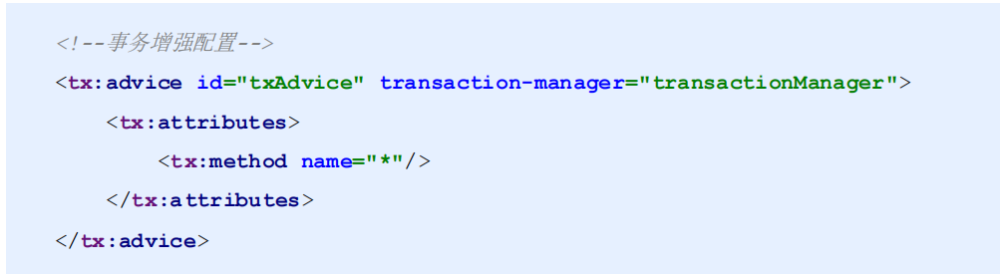

其中，< tx:method> 代表切点方法的事务参数的配置，例如：

```xml
<tx:method name="transfer" isolation="REPEATABLE_READ" propagation="REQUIRED" timeout="-1" read-only="false"/>
```

-  name：切点方法名称
-  isolation:事务的隔离级别
-  propogation：事务的传播行为
-  timeout：超时时间
-  read-only：是否只读


### 基于注解的声明式事务控制

**@Transactional。**既可以**标示方法也可以标示在类**上面。标示在类上，就是将该事务配置应用到该类的所有方法。那假如单独在方法上又写了一个@Transactional，**那就是就近原则。**

- 注解涉及到的参数

  - **isolation: 事务的隔离级别**。Isolation.**DEFAULT**：使用各个数据库默认的隔离级别【默认】

  - propogation：事务的传播行为

  - timeout：超时时间

  - read-only：是否只读

- ```java
  @Service("accountService")
  @Transactional
  public class AccountServiceImpl implements AccountService {
    
  		@Autowired
      private AccountDao accountDao;
  
      @Transactional(isolation = Isolation.READ_COMMITTED, propagation = Propagation.REQUIRED)
      public void transfer(String outMan, String inMan, double money) {
          //  这里会开启事务
          accountDao.out(outMan,money);
          accountDao.in(inMan,money);
           // 这里会提交事务
      }
  }
  ```

**最后开启事务注解驱动。springboot不会自己开**

​	==注意没有配置事务注解驱动的话，是不可能生效的哦。==原因在于前面说了Spring声明式事务控制的底层就是AOP，当我们用配置文件写的时候，Spring检测到了会自动调用aop的动态代理；而==当我们用注解写的时候，spring就不会自动去开启动态代理，而是需要我们手动开启，也就是这个注解的作用。==

```xml
<!--事务的注解驱动-->
    <tx:annotation-driven transaction-manager="transctionManager"/>
```


> 前面所有的配置都是用的xml，包括dao、service层bean的声明。
>
> ==有一个规范说，自己写的代码声明bean的时候都用注解，用的别人的工具时就用配置文件声明。==
>
> ​	之前的配置文件内容如下：
>
> ```XML
>  <bean id="dataSource" class="com.mchange.v2.c3p0.ComboPooledDataSource">
>         <property name="driverClass" value="com.mysql.jdbc.Driver"/>
>         <property name="jdbcUrl" value="jdbc:mysql://localhost:3306/test"/>
>         <property name="user" value="root"/>
>         <property name="password" value="root"/>
>     </bean>
> 
>     <bean id="jdbcTemplate" class="org.springframework.jdbc.core.JdbcTemplate">
>         <property name="dataSource" ref="dataSource"/>
>     </bean>
> 
>     <bean id="accountDao" class="com.itheima.dao.impl.AccountDaoImpl">
>         <property name="jdbcTemplate" ref="jdbcTemplate"/>
>     </bean>
> <!--     目标对象 内部的方法就是切点-->
>     <bean id="accountService" class="com.itheima.service.impl.AccountServiceImpl">
>         <property name="accountDao" ref="accountDao"/>
>     </bean>
> 
>     <!--  从这里往下就是事务控制的实现  -->
> <!--    配置平台事务管理器-->
>     <bean id="transctionManager" class="org.springframework.jdbc.datasource.DataSourceTransactionManager">
>         <property name="dataSource" ref="dataSource"></property>
>     </bean>
> <!--    通知 事务的增强配置-->
>     <tx:advice id="txAdvice" transaction-manager="transctionManager">
>       <!--设置事务的属性信息-->
>         <tx:attributes>
>            	<!--name 是被增强的方法名-->
>             <tx:method name="*"/>
>         </tx:attributes>
>     </tx:advice>
> <!--    配置事务AOP织入-->
>     <aop:config>
>         <aop:advisor advice-ref="txAdvice" pointcut="execution(* com.itheima.service.impl.*.*(..))"/>
>     </aop:config>
> ```
>
> 接下来，我们一个个用注解去替代这些配置。
>
> **第一步：**把dao和service层的去掉，这个很简单就不说了。
>
> **第二步：**就是事务控制那里，**平台事务管理器**是Spring给我们提供的，所以只能用配置文件；**事务通知配置、事务织入**可以去掉，直接加在业务方法里面。
>
> ​	用到的注解是**@Transactional。**既可以标示方法也可以标示在类上面。标示在类上，就是将该事务配置应用到该类的所有方法。那假如单独在方法上又写了一个@Transactional，那就是就近原则。
>
> ```java
> @Service("accountService")
> @Transactional(isolation = Isolation.READ_UNCOMMITTED)
> public class AccountServiceImpl implements AccountService {
>   
> 		@Autowired
>     private AccountDao accountDao;
> 
>     @Transactional(isolation = Isolation.READ_COMMITTED, propagation = Propagation.REQUIRED,readOnly = true)
>     public void transfer(String outMan, String inMan, double money) {
>         //  开启事务
>         accountDao.out(outMan,money);
>         accountDao.in(inMan,money);
>          // 提交事务
>     }
> }
> ```
>
> **第三步：组件扫描以及事务注解驱动。**
>
> ​	==注意没有配置注解驱动的话，是不可能生效的哦。==原因在于前面说了Spring声明式事务控制的底层就是AOP，当我们用配置文件写的时候，Spring检测到了会自动调用aop的动态代理；而==当我们用注解写的时候，spring就不会自动去开启动态代理，而是需要我们手动开启，也就是这个注解的作用。==
>
> ```xml
>     <!--组件扫描-->
>     <context:component-scan base-package="com.CCooky"/>
>     <!--事务的注解驱动-->
>     <tx:annotation-driven transaction-manager="transctionManager"/>
> ```
>
> 最后配置文件剩下的内容为：
>
> ```xml
>     <bean id="dataSource" class="com.mchange.v2.c3p0.ComboPooledDataSource">
>         <property name="driverClass" value="com.mysql.jdbc.Driver"/>
>         <property name="jdbcUrl" value="jdbc:mysql://localhost:3306/test"/>
>         <property name="user" value="root"/>
>         <property name="password" value="root"/>
>     </bean>
> 
>     <bean id="jdbcTemplate" class="org.springframework.jdbc.core.JdbcTemplate">
>         <property name="dataSource" ref="dataSource"/>
>     </bean>
> 
> <!--    配置平台事务管理器-->
>     <bean id="transctionManager" class="org.springframework.jdbc.datasource.DataSourceTransactionManager">
>         <property name="dataSource" ref="dataSource"></property>
>     </bean>
> 
>     <!--组件扫描-->
>     <context:component-scan base-package="com.CCooky"/>
>     <!--事务的注解驱动-->
>     <tx:annotation-driven transaction-manager="transctionManager"/>
> ```
>
> **配置要点总结**
>
> -  平台事务管理器配置（xml方式）
> -  事务通知的配置（@Transactional注解配置）
> -  事务注解驱动的配置 < tx:annotation-driven/>
>


##  ==16. 单例 Bean 的线程安全问题了解吗？==

大部分时候我们并没有在项目中使用多线程，所以很少有人会关注这个问题。单例 Bean 存在线程问题，主要是因为当多个线程操作同一个对象的时候是存在资源竞争的。

常见的有两种解决办法：

1. 在 Bean 中尽量避免定义可变的成员变量。
2. 在类中定义一个 **`ThreadLocal` 成员变量**，将需要的可变成员变量保存在 `ThreadLocal` 中（推荐的一种方式）。

**不过，大部分 Bean 实际都是无状态（没有实例变量）的（比如 Dao、Service），这种情况下， Bean 是线程安全的。**


## ==17.spring中用到了哪些设计模式？==

- **工厂设计模式：**Spring使用工厂模式通过(BeanFactory )、Applicationcontext创建bean对象。
- **单例设计模式：**Spring中的Bean 默认都是单例的。
- **代理设计模式：**Spring AOP功能的实现。
- **模板方法：**Spring 中 `jdbcTemplate`、以 Template 结尾的对数据库操作的类，它们就使用到了模板模式。

- **适配器模式** : Spring AOP 的增强或通知(Advice)使用到了适配器模式、spring MVC 中**HandlerAdaptor**也是用到了适配器模式。


## ==18、Bean的循环依赖问题？==

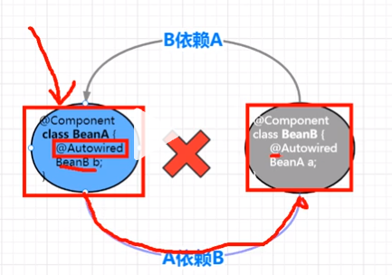

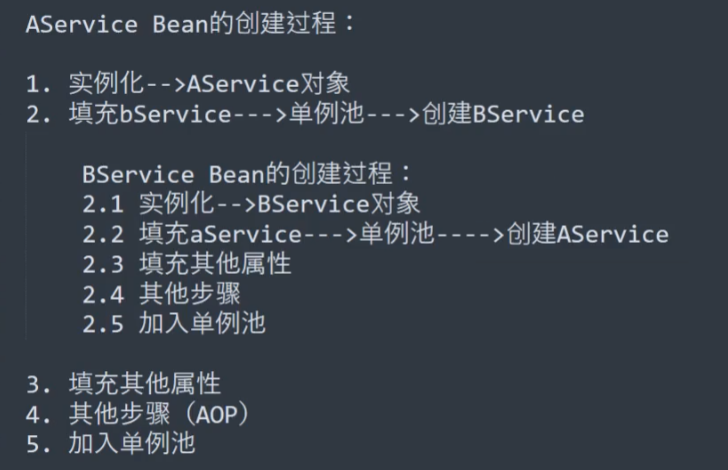

发生在Bean生命周期的第二大步——属性赋值时，采用三级缓存解决的，实质上就是三个Map集合，解决方式就是打破循环。

- 单例池：singletonobjects
- 二级缓存（半成品池）：earlysingleton0bjects
- 三级缓存：singletonFactories

**1、（两个MAP）可以解决的问题：常见的普通对象循环依赖**

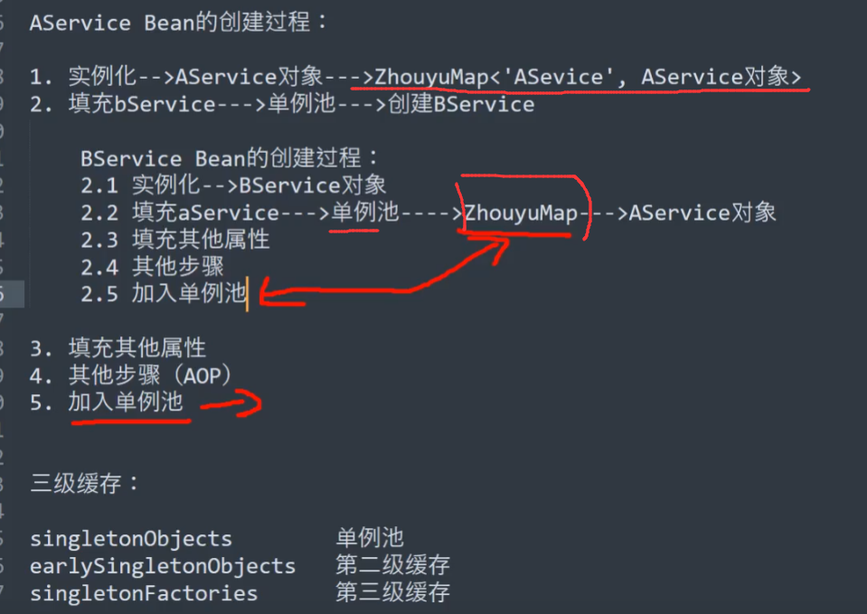

**2、当出现代理对象时，如Aservice使用了AOP的代理方式，我们知道代理对象的生成是在Bean初始化的最后一步—后置处理的时候，**而且最后加入单例池的肯定是代理对象，而不是原普通对象。

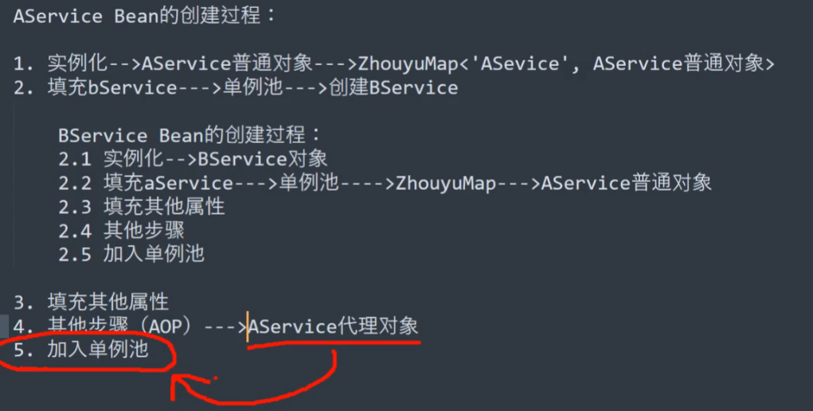

**而且如果后面我们要使用到AService时，必须使用的是其代理对象，而不能再是普通对象了；这就产生了很多问题；**

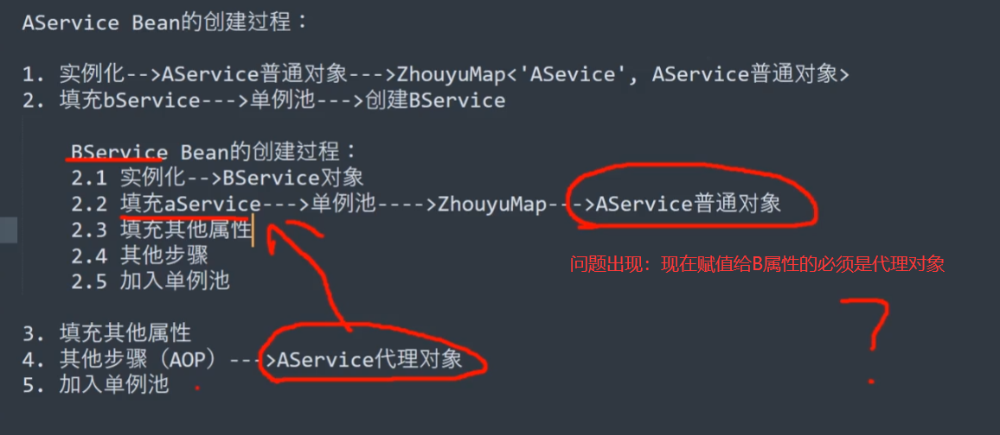


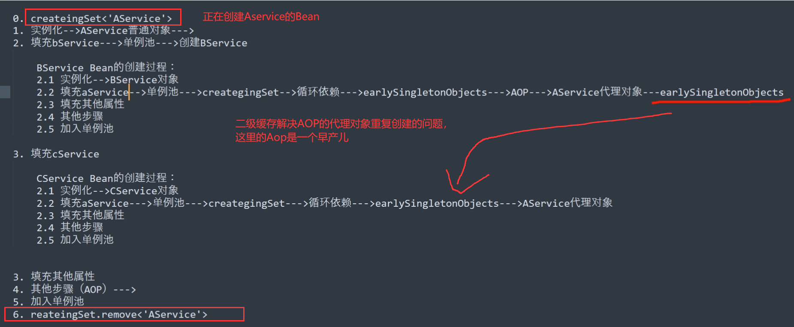

**最后一个关键性问题：Spring中创建代理对象时，需要先获得普通对象！，这就麻烦了，按照上面的做法是拿不到普通对象的，因为AService普通对象并没有存起来，所以就有了我们的三级缓存Map，存实例化后的AService普通对象**。

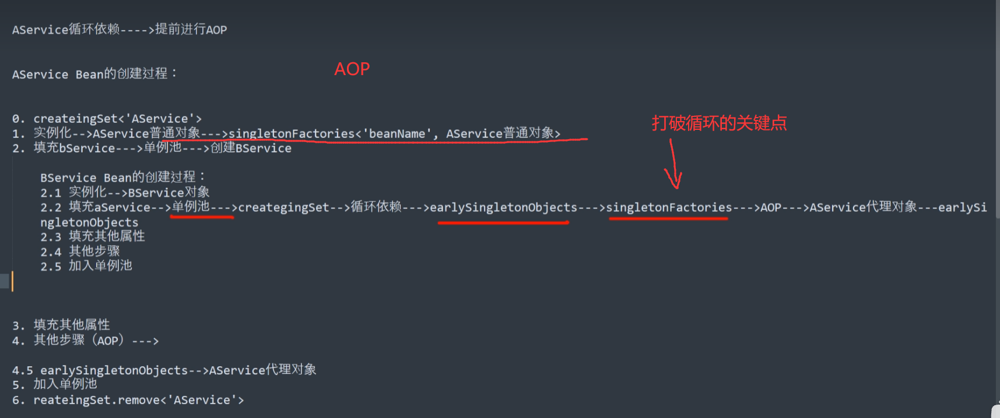

==确实秒啊， 三级缓存：存储原生实例化对象   二级缓存：存储不完整aop代理对象   一级缓存：存储完整代理对象==

**加入源码的一些方法，就是下面这样的，整体思路一模一样，但是注意那个分支判断的地方，也就是不管有没有代理，只要出现了循环依赖，二级缓存里面一定会被添加一个半成品的对象进去；**

最后加入单例池的对象，会从我们的二级缓存里面拿出来，放入，此时拿出来的也可能是普通对象也可以是代理对象；

- **也就是这里有一个 提前AOP，通常我们说的AOP是在Bean周期的初始化最后一步，也就是说在进行到后置处理时，会判断一下，是否该对象已经进行了提前AOP的操作；**

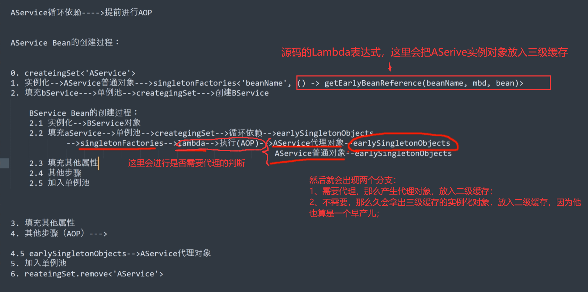

**5大核心点：解决循环依赖！！！！！！！**

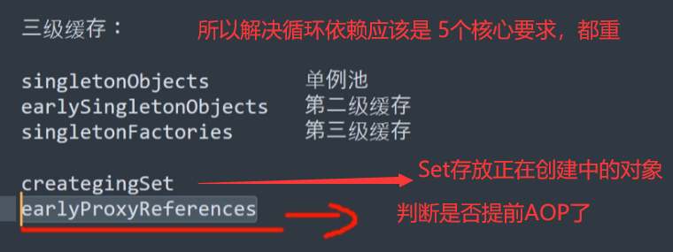

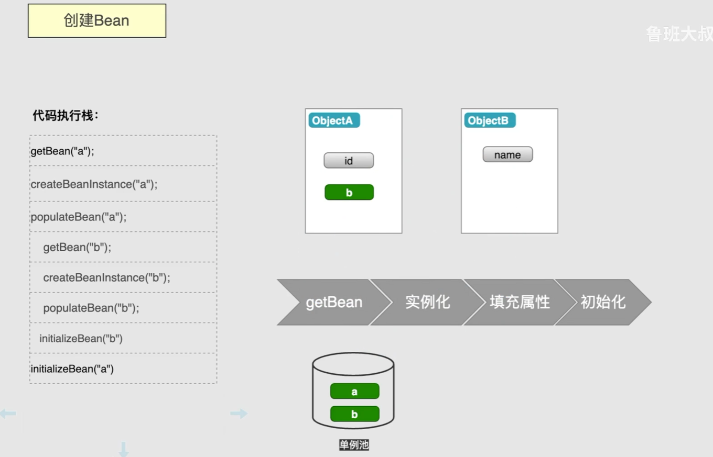

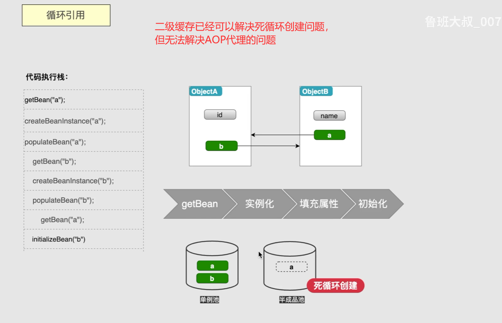

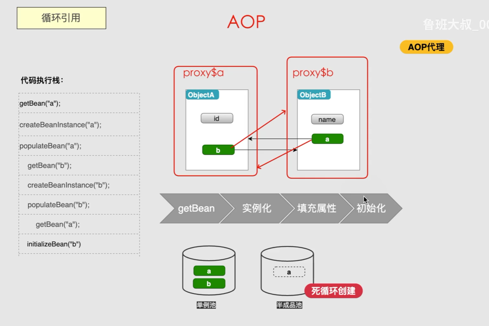


# **三、SpringMVC**

## 1.SpringMVC简介

**SpringMVC** 是一种基于 Java 的实现 **MVC 设计模型**的请求驱动类型的轻量级 **Web 框架**，==它通过一套注解，让一个简单的 Java 类成为处理请求的控制器，而无须实现任何接口==。同时它还支持 **RESTful** 编程风格的请求。


> SpringMVC 已经成为目前最主流的MVC框架之一，并且随着Spring3.0 的发布，全面超越 Struts2，成为最优秀的 MVC 框架。属于**SpringFrameWork** 的后续产品，已经融合在 Spring Web Flow 中。

> 
>
> 先回归一下，前面的Web知识，客户端服务端请求响应的逻辑：
>
> - 每个Servlet都有一些共有行为，也就是一般情况下都要执行的。如先接收求参数，封装实体，访问业务层，接收返回结果，指派视图这几个。所以我们就考虑是不是可以把这些共有的行为抽取出来呢？
>
> 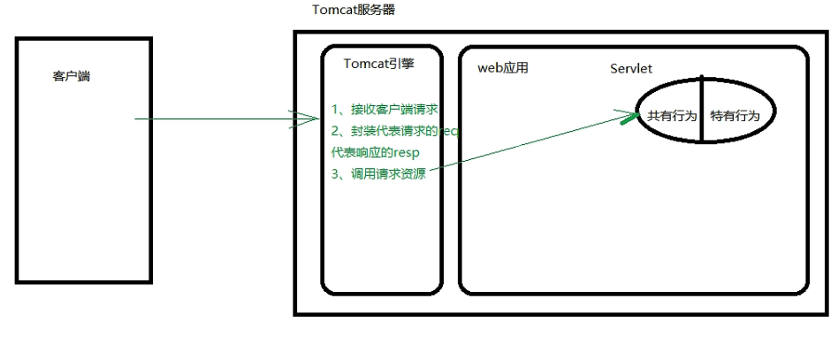
>
> - 下面我们以2个Servlet为例，分析一下，把共有行为抽取出来，这样不就很好了嘛。
>
> 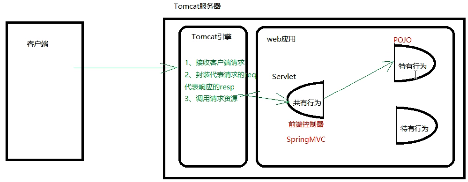
>
> - 而前面的共有行为肯定不是我们自己写撒，这是由框架来提供的，**并且这个共有行为部分框架被称为前端控制器（这也是SpringMVC的核心）**，这里就实现了前面提到的所有共有行为，还需要加入的其他的特殊行为就是通过我们的POJO（JavaBean）来自己实现
>


## 2. 快速入门NO

需求：客户端发起请求，服务器端接收请求，执行逻辑并进行视图跳转。

**注意：SpringMVC与Spring是分开独立的两个东西**

开发步骤：

① 导入SpringMVC相关坐标

② 配置SpringMVC核心控制器DispathcerServlet

③ 创建Controller类（图中的POJO）和视图页面

④ 使用注解配置Controller类中业务方法的映射地址

⑤ 配置SpringMVC核心文件 spring-mvc.xml（实现组件扫描功能）。和Spring的配置文件是分开独立的。

⑥ 客户端发起请求测试

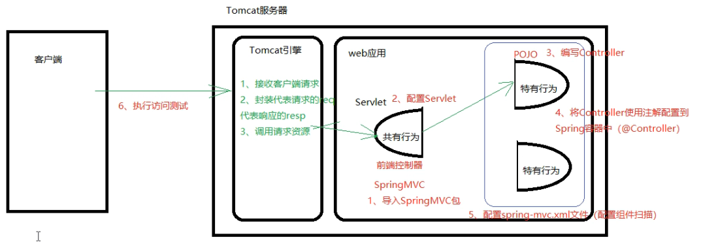

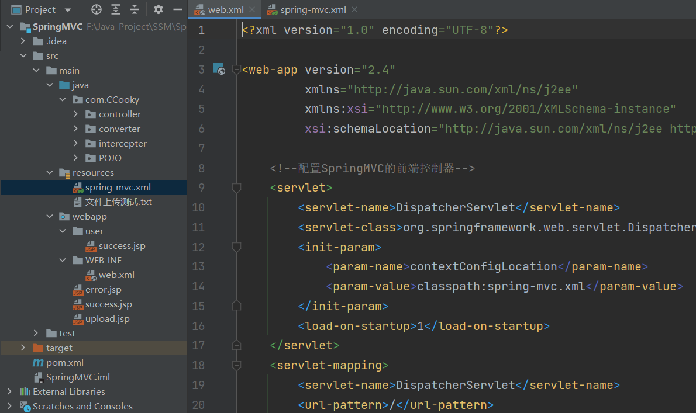

**第一步： 导入SpringMVC相关坐标**

```xml
<!--    SpringMVC-->
    <dependency>
      <groupId>org.springframework</groupId>
      <artifactId>spring-webmvc</artifactId>
      <version>5.3.14</version>
    </dependency>
<!--    Servlet-->
    <dependency>
          <groupId>javax.servlet</groupId>
          <artifactId>servlet-api</artifactId>
          <version>2.5</version>
          <scope>provided</scope>
    </dependency>
<!--    JSP-->
    <dependency>
      <groupId>javax.servlet.jsp</groupId>
      <artifactId>jsp-api</artifactId>
        <version>2.2</version>
        <scope>provided</scope>
    </dependency>
```

**第二步： 在web.xml配置SpringMVC的核心控制器DispathcerServlet**

```xml
<!--配置SpringMVC的前端控制器-->
<servlet>
    <servlet-name>DispatcherServlet</servlet-name>
    <servlet-class>org.springframework.web.servlet.DispatcherServlet</servlet-class>
    <init-param>
        <param-name>contextConfigLocation</param-name>
        <param-value>classpath:spring-mvc.xml</param-value>
    </init-param>
  	<!--服务器启动同时启动前端控制器-->
    <load-on-startup>1</load-on-startup>
</servlet>
<servlet-mapping>
    <servlet-name>DispatcherServlet</servlet-name>
  	<!--这是判断该访问资源是否进入我的前端控制器（这样就是任何访问资源-->
    <url-pattern>/</url-pattern>
</servlet-mapping>
```

**第三步：创建Controller类（图中的POJO）和视图页面success.jsp**

```java
@Controller
public class UserController {

    @RequestMapping("/quick")	//访问资源路径@WebServlet("/quick")
    public String save(){
        System.out.println("Contorller save running.....");
        return "success.jsp";
    }
}
```

```jsp
<%@ page contentType="text/html;charset=UTF-8" language="java" %>
<html>
<head>
    <title>Title</title>
</head>
<body>
    <h1>Success</h1>
</body>
</html>
```

**第四步：resources下新建配置SpringMVC核心文件 spring-mvc.xml（实现组件扫描功能）**

​	需要引入context容器才可以实现组件扫描。

==注意哦SpringMVC与Spring都有组件扫描功能，那你就问：为什么不一次性扫描了，搞了两个？？这也是解耦得一种，因为Spring负责处理得是Dao层与Service层，所以他只扫描这两个包下的组件；而SpringMVC单独负责Web层，所以他也只扫描Controller层得组件，各司其职==

```xml
<?xml version="1.0" encoding="UTF-8"?>
<beans xmlns="http://www.springframework.org/schema/beans"
       xmlns:context="http://www.springframework.org/schema/context"
       xmlns:xsi="http://www.w3.org/2001/XMLSchema-instance"
       xsi:schemaLocation="http://www.springframework.org/schema/beans
http://www.springframework.org/schema/beans/spring-beans.xsd
http://www.springframework.org/schema/context
http://www.springframework.org/schema/context/spring-context.xsd">
  
    <!--配置注解扫描-->
    <context:component-scan base-package="com.CCooky.controller"/>
</beans>
```

**第五步：测试**

- 访问测试地址

  ​			http://localhost:8080/SpringMVC/quick

- 控制台打印


- 页面显示

  

### 过程分析

==代码层面==

接下来我们首先从代码的层面分析一下他的执行过程：首先浏览器发送请求，Tomcat首先拿到请求，然后往下走，因为这个映射配置路径为/，即会拦截所有的请求资源，先进行我们的SpringMVC的前端控制器，执行共有行为，里面会有很复杂一系列操作，当他完成之后，最后会访问到我们写的的@RequestMapping注解，然后执行下面的方法。

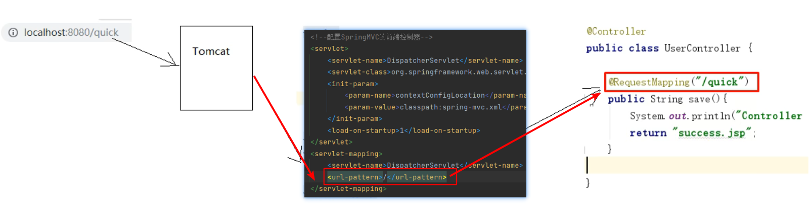

==逻辑层面==

这是SpringMVC的流程图。Tomcat与Controller之间的就是SpringMVC框架的功能。

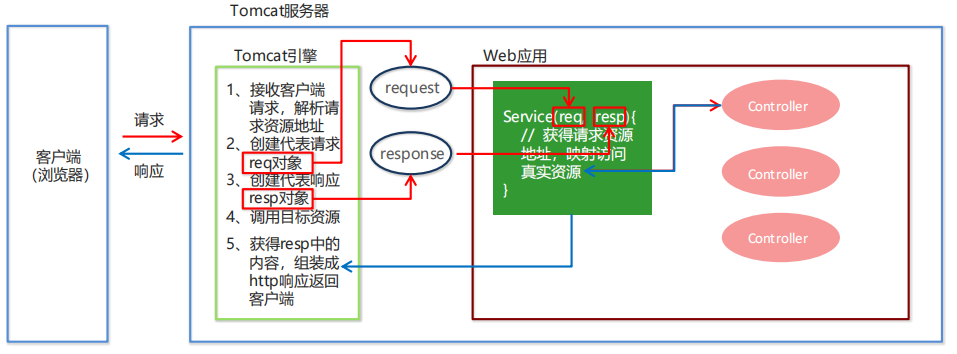

## **==3. SpringMVC 组件解析==**

### **执行流程**

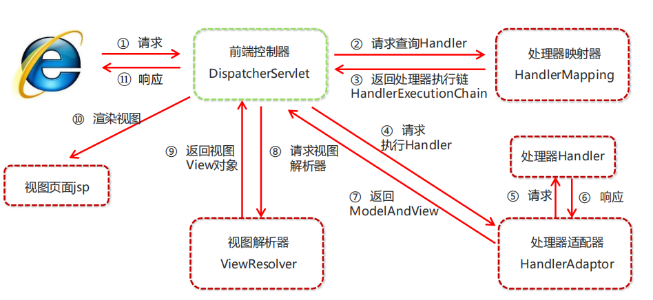

① 用户发送请求至前端控制器**DispatcherServlet**。 

② DispatcherServlet收到请求调用**HandlerMapping**处理器映射器。

③ 处理器映射器找到具体的处理器(可以根据xml配置、注解进行查找)，生成处理器对象及处理器拦截器(如果有则生成)一并返回给**DispatcherServlet**。 

④ DispatcherServlet调用**HandlerAdapter**处理器适配器。

⑤ HandlerAdapter经过适配调用具体的处理器**(@Controller，也叫后端控制器)。** 

⑥ Controller执行完成返回**ModelAndView**。 

⑦ HandlerAdapter将controller执行结果ModelAndView返回给**DispatcherServlet**。 

⑧ DispatcherServlet将ModelAndView传给**ViewReslover**视图解析器。

⑨ ViewReslover解析后返回具体**View**。 

⑩ DispatcherServlet根据View进行渲染视图（即将模型数据填充至视图中）。**DispatcherServlet响应用户**。

### **组件解析**

在 SpringMVC 的各个组件中，**处理器映射器**、**处理器适配器**、**视图解析器**称为 SpringMVC 的三大组件。

**1. 前端控制器：DispatcherServlet**

用户请求到达前端控制器，它就相当于 MVC 模式中的 C，DispatcherServlet 是整个流程控制的中心，由它调用其它组件处理用户的请求，DispatcherServlet 的存在降低了组件之间的耦合性。

**2. 处理器映射器：HandlerMapping**

HandlerMapping 负责根据用户请求找到 Handler 即处理器，SpringMVC 提供了不同的映射器实现不同的映射方式，例如：配置文件方式，实现接口方式，注解方式等。

**3. 处理器适配器：HandlerAdapter**

通过 HandlerAdapter 对处理器进行执行，==这是适配器模式的应用，通过扩展适配器可以对更多类型的处理器进行执行。==

**4. 处理器：Handler：就是Controller**

它就是我们开发中要编写的具体业务控制器。由Handler 对具体的用户请求进行处理。

**5. 视图解析器：View Resolver**

View Resolver 负责将处理结果生成 View 视图，View Resolver 首先根据逻辑视图名解析成物理视图名，即具体的页面地址，再生成 View 视图对象，最后对 View 进行渲染将处理结果通过页面展示给用户。

**6. 视图：View**

SpringMVC 框架提供了很多的 View 视图类型的支持，包括：jstlView、freemarkerView、pdfView等。最常用的视图就是 jsp。一般情况下需要通过页面标签或页面模版技术将模型数据通过页面展示给用户，需要由程序员根据业务需求开发具体的页面

## ==4. @Controller注解有什么用?==

==@controller注解标记一个类为Spring Web MVC控制器—handler。Spring MVC会将扫描到该注解的类，然后扫描这个类下面带有 @RequestMapping注解的方法，根据注解信息，为这个方法生成一个对应的处理器对象。==


### ==**注解**@RequestMapping==

**@RequestMapping**

作用：用于==建立请求 URL 和处理请求方法==之间的对应关系。

实际开发中，都是**写在类＋方法上**，完成资源的访问的路径拼接方式

位置：

```java
// 仅仅写在方法上
@Controller
public class UserController {

    // 请求地址：http://localhost:8080/SpringMVC/quick
    @RequestMapping("/quick")
    public String save(){
        System.out.println("Contorller save running.....");
        return "success.jsp";
    }
}

// 类加方法
@Controller
@RequestMapping("/user")
public class UserController {

    // 请求地址：http://localhost:8080/SpringMVC/user/quick
    @RequestMapping("/quick")
    public String save(){
        System.out.println("Contorller save running.....");
        return "success.jsp";
      // 访问视图：user/success.jsp
    }
}
```

属性：

- **value**：用于指定请求的URL。它和path属性的作用是一样的。（仅仅只有value值得时候，不用写value键，注解学习过）
- **method**：用于指定请求的方式
- **params**：用于指定限制请求参数的条件。它支持简单的表达式。要求请求参数的key和value必须和配置的一模一样

例如：

```java
@RequestMapping(value = "/user",method = RequestMethod.GET,params = {"userName","password"})
```

**params = {"accountName"}**，表示请求参数必须有accountName

**params = {"moeny!100"}**，表示请求参数中money不能是100


###  SpringMVC的XML配置

前面我们==只配置了组件扫描功能==，他会可以配置一些其他的东西。

==这些就是我们前面讲到的各个组件，例如视图解析器。看看就行了==

```xml
<?xml version="1.0" encoding="UTF-8"?>
<beans xmlns="http://www.springframework.org/schema/beans"
       xmlns:context="http://www.springframework.org/schema/context"
       xmlns:xsi="http://www.w3.org/2001/XMLSchema-instance"
       xsi:schemaLocation="http://www.springframework.org/schema/beans
http://www.springframework.org/schema/beans/spring-beans.xsd
http://www.springframework.org/schema/context
http://www.springframework.org/schema/context/spring-context.xsd">
    <!--配置注解扫描-->
    <context:component-scan base-package="com.CCooky.controller"/>
</beans>
```

#### **视图解析器**

SpringMVC有默认组件配置，默认组件都是**DispatcherServlet.properties**配置文件中配置的，该配置文件地址**org/springframework/web/servlet/DispatcherServlet.properties**，该文件中配置了默认的视图解析器，如下：

```properties
org.springframework.web.servlet.ViewResolver=org.springframework.web.servlet.view.InternalResourceViewResolver
```

翻看该解析器源码，可以看到该解析器的默认设置，如下：

```properties
REDIRECT_URL_PREFIX = "redirect:" --重定向前缀
FORWARD_URL_PREFIX = "forward:" --转发前缀（默认值）
prefix = ""; --视图名称前缀
suffix = ""; --视图名称后缀
```

这里是什么意思呢，我们详细说一下：

- **第一个：REDIRECT_URL_PREFIX = "redirect:" --重定向前缀**

  这是在我们Controller中，进行访问视图时加上的路径前缀。我们把前面的代码改一下：

```java
@Controller
@RequestMapping(value = "/user",method = RequestMethod.GET)
public class UserController {

    // 请求地址：http://localhost:8080/SpringMVC/user/quick
    @RequestMapping("/quick")
    public String save(){
        System.out.println("Contorller save running.....");
        return "redirect:/success.jsp";
    }
}
```

最后的效果就是，我们浏览器访问资源，访问成功后，他就会有重定向的功能。


- **第二个：FORWARD_URL_PREFIX = "forward:" --转发前缀（默认值）**

  即我们视图资源那里，不加的话就是默认的转发方式。浏览器路径不变

  `return "forward:/success.jsp";`

```java
@Controller
@RequestMapping(value = "/user",method = RequestMethod.GET)
public class UserController {

    // 请求地址：http://localhost:8080/SpringMVC/user/quick
    @RequestMapping("/quick")
    public String save(){
        System.out.println("Contorller save running.....");
        return "/success.jsp";
    }
}
```

- **第三个：prefix = ""; --视图名称前缀；suffix = ""; --视图名称后缀**

  这个就是我们内部视图资源的访问更改。例如说我们JSP文件放在webapp下的jsp文件夹下，那我们return的时候，就要资源写出`return "/jsp/success.jsp";`

  有点麻烦，两个东西就是用来改变`/jsp/success.jsp`的前缀后缀的，配置了之后他就会自动在外面写的视图字符串前后加上

  例如下面：

  ```java
  return "success";
  ==
  return "/WEB-INF/views/success.jsp"
  ```

```xml
<?xml version="1.0" encoding="UTF-8"?>
<beans xmlns="http://www.springframework.org/schema/beans"
       xmlns:context="http://www.springframework.org/schema/context"
       xmlns:xsi="http://www.w3.org/2001/XMLSchema-instance"
       xsi:schemaLocation="http://www.springframework.org/schema/beans
http://www.springframework.org/schema/beans/spring-beans.xsd
http://www.springframework.org/schema/context
http://www.springframework.org/schema/context/spring-context.xsd">
    <!--配置注解扫描-->
    <context:component-scan base-package="com.CCooky.controller"/>

    <!--配置内部资源视图解析器-->
    <bean class="org.springframework.web.servlet.view.InternalResourceViewResolver">
        <property name="prefix" value="/WEB-INF/views/"></property>
        <property name="suffix" value=".jsp"></property>
    </bean>
</beans>
```

#### 处理器适配器

在 SpringMVC 的各个组件中，**处理器映射器**、**处理器适配器**、**视图解析器**称为 SpringMVC 的三大组件。

拿一个例子来说明：==在使用@ResponseBody注解给客户端返回数据时，只能是JSON字符串==，但一般我们java里面最后的数据都是对象，不能直接`return user；`需要在给客户端之前进行java对象和JSON串的转换功能。（可以使用转换工具fastjson进行转换。但这样太笨了，所以强大的SpringMVC提供了自动JSON串转功能，但需要我们自己去指定用什么工具转换。）

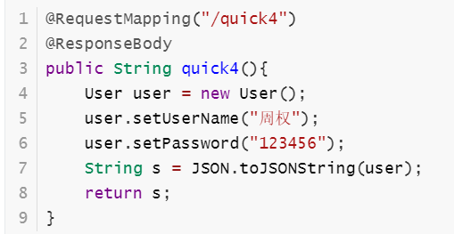

这个自动JSON串的转换功能，就是**处理器适配器**提供给我们的。

打开我们的依赖库，找到前端控制器的配置文件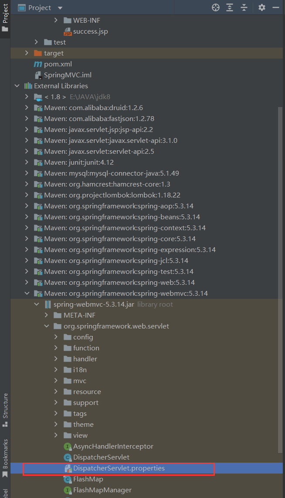

打开，你会看到我们前面讲的所有组件信息，

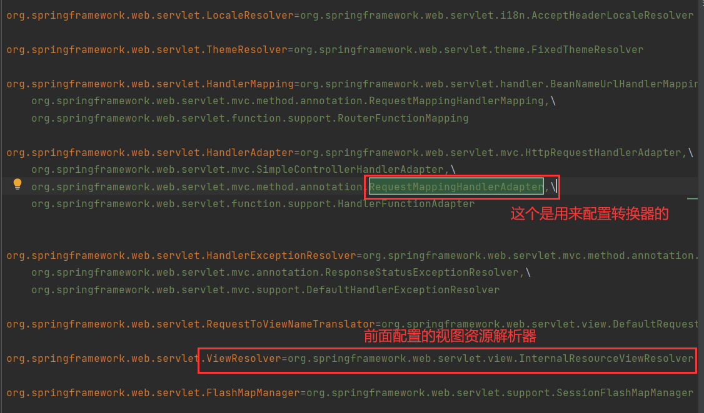

双击Shift点进去看看这个类，你会找到一个方法，设置消息转换的。这里就是我们需要设置的地方`messageConverters`。注入的方法，很简单。因为这个类是一个Bean，然后有set方法，messageConverters这个属性为List集合，然后集合里面类型是一个bean对象。哦豁，后面不是很简单嘛

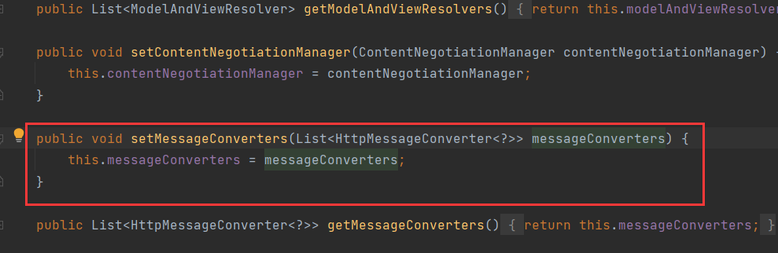

好，知道原理了，我们在xml文件里面进行设置。

**配置好了以后，在方法上添加@ResponseBody就可以返回json格式的字符串**

```xml
<!--    配置处理器适配器-->
    <bean class="org.springframework.web.servlet.mvc.method.annotation.RequestMappingHandlerAdapter">
        <property name="messageConverters" >
            <list>
                <bean class="org.springframework.http.converter.json.MappingJackson2HttpMessageConverter"></bean>
            </list>
        </property>
    </bean>
```

最后返回对象或集合的时候，直接返回就行了

```java
@RequestMapping("/quick4")
@ResponseBody
public User quick4(){
    User user = new User();
    user.setUserName("周权");
    user.setPassword("123456");
    return user;
}
```

==**优化优化优化**==

上面的操作太麻烦了，无语。最后我们可以使用mvc的注解驱动代替上述配置。


在SpringMVC的配置文件中 使用**<mvc:annotation-driven >标签**自动配置加载 `RequestMappingHandlerMapping（处理映射器）`和`RequestMappingHandlerAdapter（处理适配器）`

同时使用**<mvc:annotation-driven >**默认底层就会**集成jackson**进行对象或集合的json格式字符串的转换。==（这里要先导入jsckson的依赖哦，mvc里面自己是没有的）==

```xml
<dependency>
    <groupId>com.fasterxml.jackson.core</groupId>
    <artifactId>jackson-core</artifactId>
    <version>2.13.1</version>
</dependency>
<dependency>
    <groupId>com.fasterxml.jackson.core</groupId>
    <artifactId>jackson-databind</artifactId>
    <version>2.9.0</version>
</dependency>
<dependency>
    <groupId>com.fasterxml.jackson.core</groupId>
    <artifactId>jackson-annotations</artifactId>
    <version>2.9.0</version>
</dependency>
```

先引入mvc的命名空间，然后一行代码设置注解驱动。

```xml
<beans xmlns="http://www.springframework.org/schema/beans"
       xmlns:context="http://www.springframework.org/schema/context"
       xmlns:mvc="http://www.springframework.org/schema/mvc"
       xmlns:xsi="http://www.w3.org/2001/XMLSchema-instance"
       xsi:schemaLocation="http://www.springframework.org/schema/beans
        http://www.springframework.org/schema/beans/spring-beans.xsd
        http://www.springframework.org/schema/context
        http://www.springframework.org/schema/context/spring-context.xsd
        http://www.springframework.org/schema/mvc
        http://www.springframework.org/schema/mvc/spring-mvc.xsd">
    <!--配置注解扫描-->
    <context:component-scan base-package="com.CCooky.controller"/>

<!--    配置内部资源视图解析器-->
<!--    <bean class="org.springframework.web.servlet.view.InternalResourceViewResolver">-->
<!--        <property name="prefix" value="/WEB-INF/views/"></property>-->
<!--        <property name="suffix" value=".jsp"></property>-->
<!--    </bean>-->

    <!--mvc的注解驱动-->
    <mvc:annotation-driven/>
</beans>
```

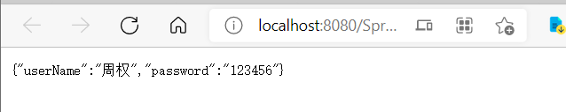


## 4. SpringMVC的数据响应

**数据响应方式**

1） 页面跳转

-  直接返回字符串	`return success.jsp;`
-  通过ModelAndView对象返回

2） 回写数据

-  直接返回字符串
-  返回对象或集合（SpringMVC帮我们做了对象转换成JSON字符串的操作）

### **==回写数据@ResponseBody==**

关键注解**@ResponseBody**，两个作用：不跳转视图+回写数据（JSON）

==**直接返回字符串**==

**将需要回写的字符串直接返回，但此时需要通过@ResponseBody注解告知SpringMVC框架**，方法返回的字符串不是跳转而是直接在http响应体中返回。

```java
@RequestMapping("/quick5")
@ResponseBody
public String quickMethod5() throws IOException {
		return "hello springMVC!!!"; 
}
```

==**返回对象或者集合**==

使用处理器适配器进行java对象和JSON串的自动转化。客户端只介绍JSON数据哦

```java
@RequestMapping("/quick4")
@ResponseBody
public User quick4(){
    User user = new User();
    user.setUserName("周权");
    user.setPassword("123456");
    return user;
}
```


## ==5. SpringMVC接收请求参数==

### 1.请求参数的分类

其实就是三种传递参数的方式：

- **参数在请求行中，通过url地址传参，使用？拼接**，即传统的资源风格描述方式
- **参数在请求行中，通过url访问路径传参，/**
- **参数在请求体中，非get**（前端通过Ajax（axios）异步方式哦，传递的是json串）

<font color="#ff0000"><b>RESTful</b></font>：严格来说只包括后面两种，是采用==“url+请求方式” 表示一次请求目的。==

 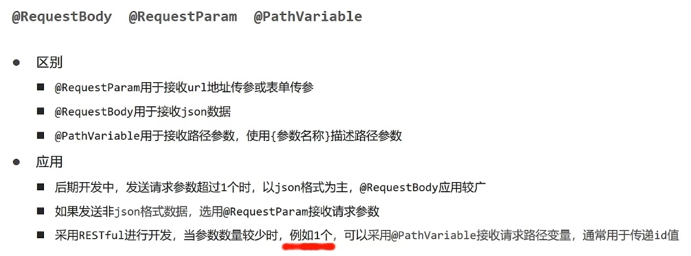


#### 1.通过url地址传参?拼接,@requestParam

这是传统的资源风格描述方式。http://localhost:8080/itheima_springmvc1/quick9?username=zhangsan&age=12

SpringMVC有多种方式对其进行接收，核心注解为**参数绑定注解@requestParam**

- **使用单个数据类型接收**，自动注入或@requestParam
- **使用实体类对象进行接收**，自动注入


**1、使用单个数据类型接收**

Controller中的**业务方法的参数名称**要与**请求参数的键**一致，参数值会==自动映射匹配。==

> 注意：前面学过前端发过来的全部都是字符串类型，SpringMVC会帮我们进行自动类型转换，我这里age参数为int类型，他就会吧接收到的String类型20，自动转换成int类型20。
>

```java
http://localhost:8080/itheima_springmvc1/quick9?username=zhangsan&age=12
```

```java
//@RequestMapping(value = "/quick9", method = RequestMethod.GET)
@GetMapping("/quick9") //RestFul风格简化上面的
@ResponseBody
public void quickMethod9(String username,int age) throws IOException {
		System.out.println(username);
		System.out.println(age);
}
```

Controller中的**业务方法的参数名称**要与**请求参数的键**一致，参数值==不会自动映射匹配。==就需要通过==@RequestParam注解显示的绑定==

```java
http://localhost:8080/SpringMVC_war/quick14?name=zhouquan
```

```java
//@RequestMapping(value = "/quick14", method = RequestMethod.GET)
@GetMapping("/quick14") //简化上面的
@ResponseBody
public void quickMethod14(@RequestParam("name") String username) throws IOException {
    System.out.println(username);
}
```

注解@RequestParam还有如下参数可以使用：

-  **value**：请绑定求参数键名称
-  **required**：此在指定的请求参数是否必须被包括，**默认是true，**提交时如果没有此参数则报错
-  **defaultValue**：当没有接收到指定请求参数时，则使用**指定的默认值赋值**

```java
@GetMapping("/quick14")
@ResponseBody
public void quickMethod14(@RequestParam(value="name",required = false,defaultValue = "itcast") String username) throws IOException {
		System.out.println(username);
}
```

**2、使用实体类对象进行接收**

Controller中的**业务方法的实体类的属性名**与**请求参数的键**一致，参数值会自动映射匹配。底层原理是调用的==set方法进行参数注入==。例如前端传递userName，SpringMVC拿到后，就会在实体类里面找setUserName（），有的话就会去调用，没有就算了。

和Mybatis里面的实体类参数接收一样。

```java
http://localhost:8080/itheima_springmvc1/quick10?username=zhangsan&age=12
```

```java
public class User {
		private String username;
		private int age;
		getter/setter…
}
//@RequestMapping(value = "/quick10", method = RequestMethod.GET)
@GetMapping("/quick10") //简化上面的
@ResponseBody	
public void quickMethod10(User user) throws IOException {
		System.out.println(user);
}
```


#### 2.通过url访问路径传参 /,@PathVariable

Restful风格的资源访问方式：

- **@PathVariable**——获取url路径地址参数，**只能用单个数据类型接收**。 

  在SpringMVC中可以使用**占位符**进行参数绑定。如地址	`/user/1`	可以写成	`/user/{id}`	，占位符{id}对应的就是1的值

  ```java
  http://localhost:8000/msgs/13973034756
  ```

  ```java
      @GetMapping("/msgs/{tele}")
      public String get(@PathVariable("tele") String tele){
          String code = msgService.get(tele);
          return code;
      }
  ```

  

#### 3.**参数在请求体中,@RequestBody**

- **@RequestBody**——获取请求体参数，**只能使用实体类对象：VO对象**进行接收。（要使用Ajax提交，为json格式才行哦）

- 这个POJO对象一般叫做**vo对象**（ValueObject—值对象）（ViewObject—视图对象）

  ```java
  http://localhost:8000/msgs；
  ```

  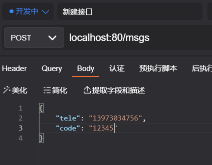

  ```java
  public class TeleCode {
  		private String tele;
  		private String code;
  		getter/setter…
  }
  @PostMapping("/msgs")
  public void check(@RequestBody TeleCode teleCode) {
        
  }
  ```


- **@RequestParam**——**也可以获取请求体参数**，就是前面的使用单个数据类型进行接收

```java
@PostMapping("/msgs")
public void check(@RequestParam("tele") String tele, @RequestParam("code") String code) {
      
}
```


###==2.REST风格开发==

> 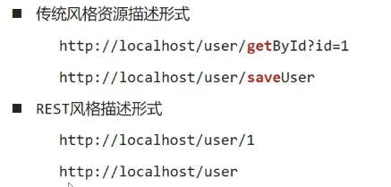
>
> 这样就有一个问题：我怎么知道它具体是做的什么操作呢，我查询指定用户用的是上面那个user/1的路径，那我删除呢，修改呢，于是这个公司建立了下面这种，加了一个行为动作。
>
> 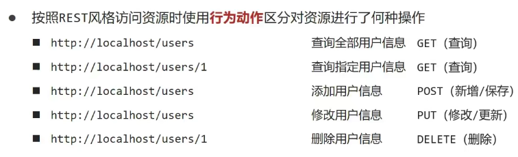

<font color="#ff0000"><b>REST</b></font>：（Representational State Transfer），表现形式状态转换。一种资源表现风格。

<font color="#ff0000"><b>RESTful</b></font>：后来我们统一把根据REST风格对资源进行访问的方式叫做RESTful。**采用 “url+请求方式” 表示一次请求目的。就是说访问同一个url，但请求方式不同，就会访问到不同的资源！！！**。就是以后url不用再写的那么复杂，不然每一个方法都要有一个单独命名的url才行。

- 请求方式就是对应HTTP 协议里面四个表示操作方式的动词（增删改查）
  - POST：用于新建资源  
  - DELETE：用于删除资源
  - PUT：用于更新资源 
  - GET：用于获取资源

- **优点：**

  - 隐藏资源的访问行为，无法通过地址得知对资源是何种操作，请求映射不再需要包含语义信息。

  - 书写简化。


<font color="#ff0000"><b>注意事项：</b></font>

==上述的行为是约定方式，约定不是规范，是可以被打破的==，不一定要按照这样写，所以说叫做REST风格，不是REST规范。但随着人数越来越多，逐渐成为了一种专业的约定。在Restful风格里面，获取请求参数有三种方式如下：


**下面是使用RestFul风格开发的一个例子：**

> ```java
>// 对应下面五个的请求行
> http://localhost:8080/SpringMVC_war/users（post）
> http://localhost:8080/SpringMVC_war/users（put）
> http://localhost:8080/SpringMVC_war/users/5（delete）
> http://localhost:8080/SpringMVC_war/users/3（get）
> http://localhost:8080/SpringMVC_war/users（get）
> ```
> 
> ```java
>// Rest风格
> @Controller
> public class BooksController {
> 
>  @RequestMapping(value = "/books", method = RequestMethod.POST)
>  @ResponseBody
>     public String save(@RequestBody Book book){
>         System.out.println("Book save ....."+book);
>         return "{'module':'Books save'}";
>     }
>    
>     @RequestMapping(value = "/books",method = RequestMethod.PUT)
>  @ResponseBody
>     public String update(@RequestBody Book book){
>         System.out.println(book);
>         return "{'module':'Books update'}";
>     }
>    
>     @RequestMapping(value = "/books/{id}",method = RequestMethod.DELETE)
>  @ResponseBody
>     public String delete(@PathVariable(value="id") Integer id){
>         System.out.println("Book delete..." + id);
>         return "{'module':'Books delete'}";
>     }
>    
>     @RequestMapping(value = "/books/{id}",method = RequestMethod.GET)
>  @ResponseBody
>     public String getById(@PathVariable(value="id") Integer id){
>         System.out.println("Book getById..." + id);
>         return "{'module':'Books getById'}";
>     }
>    
>     @RequestMapping(value = "/books",method = RequestMethod.GET)
>  @ResponseBody
>     public String getAll(){
>         System.out.println("Book getAll...");
>         return "{'module':'Books getAll'}";
>     }
>    }
>    ```
> 
> 从这里，可以看出：我前端访问同一个url，但请求方式不同，就会访问到不同的资源！！！就是以后url不用再写的那么复杂，不然每一个方法都要有一个单独命名的url才行。
>


### **==3.Restful简化代码==**

- **1、@ResponseBody 和相同访问路径 @RequestMapping("/books") 放到类上**
- **2、每个单独的方法用@GetMapping、@PostMapping....替代@RequestMapping**（哎呀，这一步改不改都行我感觉）
- **3、类上使用@RestController替换@Controller+@ResponseBody**（两者是对等关系）


看到上面，其实是有很多重复的代码的，例如每个方法都写了@ResponseBody注解，每个方法url都有重复的books，

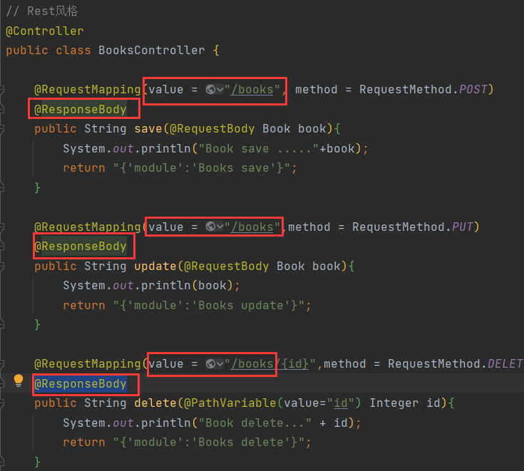

**第一步简化：**我们把这些重复的代码，可以直接放到类上进行注解撒。但是注意哦，有路径参数的，还是要写单独写在方法上面。


**第二步简化：**SpringBoot提供了一个单独给Rest风格的注解，==`@RestController`==，他等于`@Controller+@ResponseBody`。

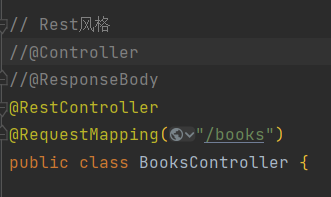


**第三步简化：**每个方法上都要加重复的代码`method = RequestMethod.。。`这个也还行哦，但也可以简化呢，springboot提供了每个请求方法的一个注解，例如 ==`@PostMapping`==,，如果有路径参数的话，直接在这个注解后面加上就好了，真棒。

```java
@PostMapping = @RequestMapping(method = RequestMethod.POST)

@DeleteMapping("/{id}") = @RequestMapping(value = "/{id}",method = RequestMethod.DELETE)
```


**最终效果：**

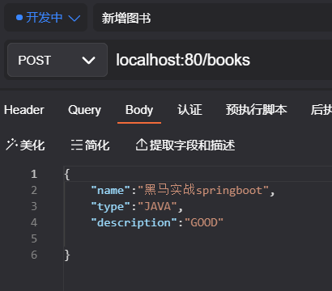

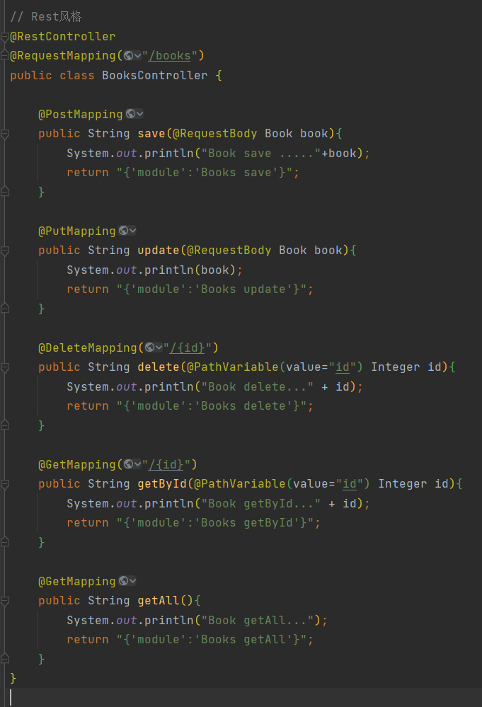


## 6. SpringMVC拦截器

相当于我们在web阶段学习到的filter拦截器。

Spring MVC 的**拦截器**类似于 Servlet 开发中的过滤器 Filter，用于对处理器进行**预处理**和**后处理**。

将拦截器按一定的顺序联结成一条链，这条链称为**拦截器链（Interceptor Chain）**。在访问被拦截的方法或字段时，拦截器链中的拦截器就会按其之前定义的顺序被调用。**拦截器也是AOP思想的具体实现。**

**拦截器和过滤器区别**

| **区别** | **过滤器（Filter）**                                        | **拦截器（Interceptor）**                                    |
| -------- | ----------------------------------------------------------- | ------------------------------------------------------------ |
| 使用范围 | 是 servlet 规范中的一部分，任何Java Web 工程都可以使用      | 是 SpringMVC 框架自己的，只有使用了SpringMVC 框架的工程才能用 |
| 拦截范围 | 在 url-pattern 中配置了 /* 之后，可以对所有要访问的资源拦截 | 在**<mvc:mapping path=“ ”/>** 中配置了 /** 之后也可以对所有资源进行拦截，但是可以通过  **<mvc:exclude-mapping path=“ ”/>**  标签排除不需要拦截的资源 |

#### **开发快速入门**

自定义拦截器很简单，只有如下三步：

① 创建拦截器类实现HandlerInterceptor接口

② SpringMVC配置拦截器

③ 测试拦截器的拦截效果

第一步：

```java
public class MyHandlerIntercepter implements HandlerInterceptor {

    @Override
    // ---拦截器---目标方法执行，视图对象返回
		public boolean preHandle(HttpServletRequest request, HttpServletResponse response, Object handler) throws Exception {
        System.out.println("preHandle");
        String param = request.getParameter("param");
        if (Objects.equals(param,"yes")){
            return true;
        }else {
       			request.getRequestDispatcher("/error.jsp").forward(request,response);
            return false;
        }
    }

    @Override
    // 目标方法执行---拦截器---视图对象返回
    public void postHandle(HttpServletRequest request, HttpServletResponse response, Object handler, ModelAndView modelAndView) throws Exception {
        System.out.println("postHandle");
    }
    
    @Override
  	// 目标方法执行，视图对象返回---拦截器---
    public void afterCompletion(HttpServletRequest request, HttpServletResponse response, Object handler, Exception ex) throws Exception {
        System.out.println("afterCompletion");
    }
}
```

第二步：

```xml
<!--    配置拦截器-->
    <mvc:interceptors>
        <mvc:interceptor>
            <!-- 对哪些资源进行拦截-->
            <mvc:mapping path="/**"/>
            <bean class="com.CCooky.intercepter.MyHandlerIntercepter"/>
        </mvc:interceptor>
    </mvc:interceptors>
```

第三步：

```java
@GetMapping("/target")
public ModelAndView show(){
    System.out.println("目标资源执行。。。。。");
    ModelAndView modelAndView = new ModelAndView();
    modelAndView.addObject("name","zhouquan");
    modelAndView.setViewName("/success.jsp");
    return modelAndView;
}
```

测试结果如下：

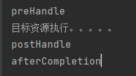

**多拦截器操作**

同上，在编写一个MyHandlerInterceptor2操作，测试执行顺序。具体先执行那个拦截器，要看你spring-mvc.xml里面配置的前后顺序。


**拦截器方法说明**

| **方法名**         | **说明**                                                     |
| ------------------ | ------------------------------------------------------------ |
| preHandle( )       | 方法将在请求处理之前进行调用，该方法的返回值是布尔值Boolean类型的，当它返回为false 时，表示请求结束，后续的Interceptor 和Controller 都不会再执行；当返回值为true 时就会继续调用下一个Interceptor 的preHandle |
| postHandle( )      | 该方法是在当前请求进行处理之后被调用，前提是preHandle 方法的返回值为true 时才能被调用，且它会在DispatcherServlet 进行视图返回渲染之前被调用，所以我们可以在这个方法中对Controller 处理之后的ModelAndView 对象进行操作 |
| afterCompletion( ) | 该方法将在整个请求结束之后，也就是在DispatcherServlet 渲染了对应的视图之后执行，前提是preHandle 方法的返回值为true 时才能被调用 |


## ==7. SpringMVC异常处理器（实习-美团）==

**回顾：**之前的异常处理机制，我们都==采用的try-catch机制==，这样做的效果就是==在业务层写了很多重复代码==，但这都不是最重要的，最主要的是==我们异常处理与源码完全耦合在了一起，后期出了异常，我们也不方便去找到具体是哪里的异常==。所以SpringMVC帮我们做了一个组件，用来专门处理源码中的异常。这样异常处理 与我们的源码完全解耦！！！

**SpringMVC异常处理方式：**

​	代码只管用throws Exception向上抛出，也包括了Controller层，最后由SpringMVC前端控制器交由异常处理器进行异常处理，如下图：

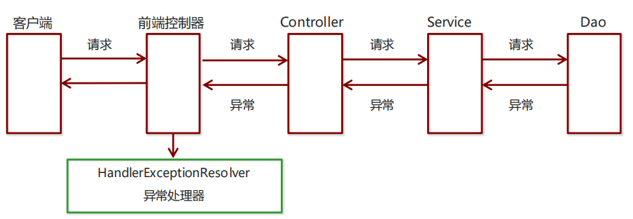

**推荐使用注解的方式统一异常处理，具体会使用到 `@ControllerAdvice` + `@ExceptionHandler` 这两个注解 。**

- @ControllerAdvice：用来开启全局的异常捕获
- @ExceptionHandler：说明捕获哪些异常，对哪些异常进行处理。可以单独争对不同异常进行个性化处理


```java
// 声明为springMVC的异常处理器  //向前端回写数据json
@ControllerAdvice
@ResponseBody  
public class ProjectExceptionAdvice {

		// 捕获和处理Controller层的所有异常
    @ExceptionHandler(Exception.class)
    public R allException(Exception e) {
        // 记录日志
        // 通知运维
        // 通知开发
        e.printStackTrace();//控制台打印信息
        return new R("服务器故障,请稍后再试");
    }
  
  	// 捕获和处理Controller层的IOException
    @ExceptionHandler(IOException.class)
    public R doException(IOException e) {
        // 记录日志
        // 通知运维
        // 通知开发
        e.printStackTrace();//控制台打印信息
        return new R("服务器故障,请稍后再试");
    }
  
}
```


## 8.为什么HandlerAdapter要用适配器模式

Spring MVC中的适配器模式主要用于执行目标 Controller 中的请求处理方法。

在Spring MVC中，**DispatcherServlet** 作为用户，**HandlerAdapter** 作为期望接口，具体的适配器实现类用于对目标类进行适配，**Controller** 作为需要被适配的类。

为什么要在 Spring MVC 中使用适配器模式？Spring MVC 中的 Controller 种类众多，不同类型的 Controller 通过不同的方法来对请求进行处理。如果不利用适配器模式的话，DispatcherServlet 直接获取对应类型的 Controller，需要的自行来判断，用大量的 **if-else语句**，使得程序可维护性差。

当Spring容器启动后，会将所有定义好的适配器对象存放在一个List集合中，当一个请求来临时，DispatcherServlet 会通过 **handler （controller）的类型**找到对应适配器，并将该适配器对象返回给用户，然后就可以统一通过**HandlerAdapter接口的 hanle() 方法**来调用 Controller 中的方法。

通过适配器模式我们将所有的 controller 统一交给 **HandlerAdapter** 处理，免去了写大量的 if-else 语句对 Controller 进行判断，也更利于扩展新的 Controller 类型。

```java
//定义一个Adapter接口  
public interface HandlerAdapter {  
    public boolean supports(Object handler);  
    public void handle(Object handler);  
}  
  
//以下是三种Controller实现  
public interface Controller {  
  
}  
  
public class HttpController implements Controller{  
    public void doHttpHandler(){  
        System.out.println("http...");  
    }  
}  
  
public class SimpleController implements Controller{  
    public void doSimplerHandler(){  
        System.out.println("simple...");  
    }  
}  
  
public class AnnotationController implements Controller{  
    public void doAnnotationHandler(){  
        System.out.println("annotation...");  
    }  
}  
  
  
//下面编写适配器类  
  
public class SimpleHandlerAdapter implements HandlerAdapter {  
  
  
    public void handle(Object handler) {  
        ((SimpleController)handler).doSimplerHandler();  
    }  
  
    public boolean supports(Object handler) {  
        return (handler instanceof SimpleController);  
    }  
  
}  
  
  
public class HttpHandlerAdapter implements HandlerAdapter {  
  
    public void handle(Object handler) {  
        ((HttpController)handler).doHttpHandler();  
    }  
  
    public boolean supports(Object handler) {  
        return (handler instanceof HttpController);  
    }  
  
}  
  
  
  
public class AnnotationHandlerAdapter implements HandlerAdapter {  
  
    public void handle(Object handler) {  
        ((AnnotationController)handler).doAnnotationHandler();  
    }  
  
    public boolean supports(Object handler) {  
          
        return (handler instanceof AnnotationController);  
    }  
  
}  
  
  
//模拟一个DispatcherServlet  
import java.util.ArrayList;  
import java.util.List;  
  
  
public class DispatchServlet {  
      
    public static List<HandlerAdapter> handlerAdapters = new ArrayList<HandlerAdapter>();   
      
    public DispatchServlet(){  
        handlerAdapters.add(new AnnotationHandlerAdapter());  
        handlerAdapters.add(new HttpHandlerAdapter());  
        handlerAdapters.add(new SimpleHandlerAdapter());  
    }  
      
      
    public void doDispatch(){  
          
        //此处模拟SpringMVC从request取handler的对象，仅仅new出，可以出，               
                     //不论实现何种Controller，适配器总能经过适配以后得到想要的结果  
//      HttpController controller = new HttpController();  
//      AnnotationController controller = new AnnotationController();  
        SimpleController controller = new SimpleController();  
        //得到对应适配器  
        HandlerAdapter adapter = getHandler(controller);  
        //通过适配器执行对应的controller对应方法  
        adapter.handle(controller);  
          
    }  
      
    public HandlerAdapter getHandler(Controller controller){  
        for(HandlerAdapter adapter: this.handlerAdapters){  
            if(adapter.supports(controller)){  
                return adapter;  
            }  
        }  
        return null;  
    }  
      
    public static void main(String[] args){  
        new DispatchServlet().doDispatch();  
    }  
      
}
```


## 9.什么是适配器模式？

[适配器模式](https://so.csdn.net/so/search?q=适配器模式&spm=1001.2101.3001.7020)（Adapter Pattern）：结构型模式之一，**将一个类的接口转换成客户希望的另一个接口。Adapter模式使得原本由于接口不兼容而不能一起工作的哪些类可以一起工作**。

适配器模式有“类适配器”和“对象适配器”两种不同的形式。

 **类适配器：通过继承进行适配（类间继承）**。URL结构图如下：

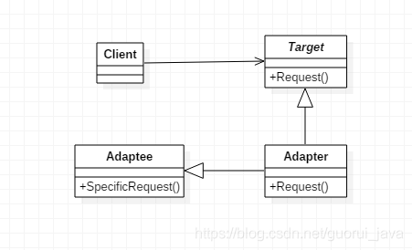

类适配器主要由三部分构成：

- Target：目标角色，这是客户端使用的期望接口。是一个接口或一个抽象类
- Adaptee：源角色，需要被转换的类或对象；
- Adapter：适配器，通过继承+实现的方式把源角色转换成期望接口。

```java
// Target我们的用户只知道这个接口，他只会去调用target.request()完成操作。
public interface Target {   
    public void request();
}
// Adaptee源角色，想把谁转换为目标角色，这个“谁”就是源角色，它是已经存在的类或对象
public class Adaptee {
    public void specificRequest() {
        System.out.println("特殊请求");
    }
}
// Adapter适配器角色，是适配器模式的核心角色，它的职责是通过继承的方式把源角色转换成目标角色
public class Adapter extends Adaptee implements Target {
    @Override
    public void request() {
        super.specificRequest();
    }
}
// Client我们客户使用时：
public class Client {
    public static void main(String[] args) {
      	// new 的就是适配器对象哦
        Target target = new Adapter();
        target.request();
    }
}
```


## ==10.过滤器和拦截器（实习-美团）==

相当于我们在web阶段学习到的filter拦截器。

Spring MVC 的**拦截器**类似于 Servlet 开发中的过滤器 Filter，用于对处理器进行**预处理**和**后处理**。

将拦截器按一定的顺序联结成一条链，这条链称为**拦截器链（Interceptor Chain）**。在访问被拦截的方法或字段时，拦截器链中的拦截器就会按其之前定义的顺序被调用。**拦截器也是AOP思想的具体实现。**

### **拦截器和过滤器区别**

| **区别** | **过滤器（Filter）**                                        | **拦截器（Interceptor）**                                    |
| -------- | ----------------------------------------------------------- | ------------------------------------------------------------ |
| 使用范围 | 是 servlet 规范中的一部分，任何Java Web 工程都可以使用      | 是 SpringMVC 框架自己的，只有使用了SpringMVC 框架的工程才能用 |
| 拦截范围 | 在 url-pattern 中配置了 /* 之后，可以对所有要访问的资源拦截 | 在**<mvc:mapping path=“ ”/>** 中配置了 /** 之后也可以对所有资源进行拦截，但是可以通过  **<mvc:exclude-mapping path=“ ”/>**  标签排除不需要拦截的资源 |


### **快速入门**

自定义拦截器很简单，只有如下三步：

① 创建拦截器类实现HandlerInterceptor接口

② SpringMVC配置拦截器

③ 测试拦截器的拦截效果

第一步：

```java
public class MyHandlerIntercepter implements HandlerInterceptor {

    @Override
    // ---拦截器---目标方法执行，视图对象返回
		public boolean preHandle(HttpServletRequest request, HttpServletResponse response, Object handler) throws Exception {
        System.out.println("preHandle");
        String param = request.getParameter("param");
        if (Objects.equals(param,"yes")){
            return true;
        }else {
       			request.getRequestDispatcher("/error.jsp").forward(request,response);
            return false;
        }
    }

    @Override
    // 目标方法执行---拦截器---视图对象返回
    public void postHandle(HttpServletRequest request, HttpServletResponse response, Object handler, ModelAndView modelAndView) throws Exception {
        System.out.println("postHandle");
    }
    
    @Override
  	// 目标方法执行，视图对象返回---拦截器---
    public void afterCompletion(HttpServletRequest request, HttpServletResponse response, Object handler, Exception ex) throws Exception {
        System.out.println("afterCompletion");
    }
}
```

第二步：

```xml
<!--    配置拦截器-->
    <mvc:interceptors>
        <mvc:interceptor>
            <!-- 对哪些资源进行拦截-->
            <mvc:mapping path="/**"/>
            <bean class="com.CCooky.intercepter.MyHandlerIntercepter"/>
        </mvc:interceptor>
    </mvc:interceptors>
```

第三步：

```java
@GetMapping("/target")
public ModelAndView show(){
    System.out.println("目标资源执行。。。。。");
    ModelAndView modelAndView = new ModelAndView();
    modelAndView.addObject("name","zhouquan");
    modelAndView.setViewName("/success.jsp");
    return modelAndView;
}
```

测试结果如下：


### **多拦截器操作**

同上，在编写一个MyHandlerInterceptor2操作，测试执行顺序。具体先执行那个拦截器，要看你spring-mvc.xml里面配置的前后顺序。

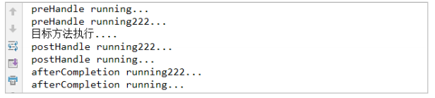

| **方法名**         | **说明**                                                     |
| ------------------ | ------------------------------------------------------------ |
| preHandle( )       | 方法将在请求处理之前进行调用，该方法的返回值是布尔值Boolean类型的，当它返回为false 时，表示请求结束，后续的Interceptor 和Controller 都不会再执行；当返回值为true 时就会继续调用下一个Interceptor 的preHandle |
| postHandle( )      | 该方法是在当前请求进行处理之后被调用，前提是preHandle 方法的返回值为true 时才能被调用，且它会在DispatcherServlet 进行视图返回渲染之前被调用，所以我们可以在这个方法中对Controller 处理之后的ModelAndView 对象进行操作 |
| afterCompletion( ) | 该方法将在整个请求结束之后，也就是在DispatcherServlet 渲染了对应的视图之后执行，前提是preHandle 方法的返回值为true 时才能被调用 |


## ==11.filter(美团-实习）==

### 1.1  Filter概述

Filter 表示过滤器，是 JavaWeb 三大组件(Servlet、Filter、Listener)之一。Servlet 我们之前都已经学习过了.

==过滤器可以把对资源的请求拦截下来，从而实现一些特殊的功能。==

如下图所示，浏览器可以访问服务器上的所有的资源（servlet、jsp、html等）


而在访问到这些资源之前可以使过滤器拦截来下，也就是说在访问资源之前会先经过 Filter，如下图


拦截器拦截到后可以做什么功能呢？

==过滤器一般完成一些通用的操作。==比如每个资源都要写一些代码完成某个功能，我们总不能在每个资源中写这样的代码吧，而此时我们可以将这些代码写在过滤器中，因为请求每一个资源都要经过过滤器。

**Example:**

我们之前做的品牌数据管理的案例中就已经做了登陆的功能，而如果我们不登录能不能访问到数据呢？我们可以在浏览器直接访问首页 ，可以看到 `查询所有` 的超链接


当我点击该按钮，居然可以看到品牌的数据


这显然和我们的要求不符。我们希望实现的效果是用户如果登陆过了就跳转到品牌数据展示的页面；如果没有登陆就跳转到登陆页面让用户进行登陆，要实现这个效果需要在每一个资源中都写上这段逻辑，而像这种通用的操作，我们就可以放在过滤器中进行实现。

**这个就是权限控制，以后我们还会进行细粒度权限控制。过滤器还可以做 `统一编码处理`、 `敏感字符处理` 等等…**

### 1.2  Filter快速入门

#### 1.2.1  开发步骤

注意啊：Filter是在服务什么的都正常启动的时候才有的，他是对之前的补充功能。在servlet和tomcat，的基础上。

* 定义类，实现 Filter接口，并重写其所有方法

  

* 配置Filter拦截资源的路径：在类上定义 `@WebFilter` 注解。而注解的 `value` 属性值 `/*` 表示拦截所有的资源

  

* 在doFilter方法中输出一句话，并放行

  

  > 上述代码中的 `chain.doFilter(request,response);` 就是放行，也就是让其访问本该访问的资源。

#### 1.2.2  代码演示

创建一个项目，项目下有一个 `hello.jsp` 页面，项目结构如下：


`pom.xml` 配置文件内容如下：

```xml
<?xml version="1.0" encoding="UTF-8"?>
<project xmlns="http://maven.apache.org/POM/4.0.0"
         xmlns:xsi="http://www.w3.org/2001/XMLSchema-instance"
         xsi:schemaLocation="http://maven.apache.org/POM/4.0.0 http://maven.apache.org/xsd/maven-4.0.0.xsd">
    <modelVersion>4.0.0</modelVersion>

    <groupId>org.example</groupId>
    <artifactId>filter-demo</artifactId>
    <version>1.0-SNAPSHOT</version>
    <packaging>war</packaging>

    <properties>
        <maven.compiler.source>8</maven.compiler.source>
        <maven.compiler.target>8</maven.compiler.target>
    </properties>

    <dependencies>
        <dependency>
            <groupId>javax.servlet</groupId>
            <artifactId>javax.servlet-api</artifactId>
            <version>3.1.0</version>
            <scope>provided</scope>
        </dependency>
    </dependencies>

    <build>
        <plugins>
            <plugin>
                <groupId>org.apache.tomcat.maven</groupId>
                <artifactId>tomcat7-maven-plugin</artifactId>
                <version>2.2</version>
                <configuration>
                    <port>80</port>
                </configuration>
            </plugin>
        </plugins>
    </build>
</project>
```

`hello.jsp` 页面内容如下：

```jsp
<%@ page contentType="text/html;charset=UTF-8" language="java" %>
<html>
<head>
    <title>Title</title>
</head>
<body>
    <h1>hello JSP~</h1>
</body>
</html>
```

我们现在在浏览器输入 `http://localhost/filter-demo/hello.jsp` 访问 `hello.jsp` 页面，这里是可以访问到 `hello.jsp` 页面内容的。


**接下来编写过滤器。过滤器是 Web 三大组件之一，所以我们将 `filter` 创建在 `com.itheima.web.filter` 包下，起名为 `FilterDemo`**

```java
@WebFilter("/*")
public class FilterDemo implements Filter {

    @Override
    public void doFilter(ServletRequest request, ServletResponse response, FilterChain chain) throws IOException, ServletException {
        System.out.println("FilterDemo...");
    }

    @Override
    public void init(FilterConfig filterConfig) throws ServletException {
    }

    @Override
    public void destroy() {
    }
}

```

重启启动服务器，再次重新访问 `hello.jsp` 页面，会发现页面没有任何效果，但是在 `idea` 的控制台可以看到如下内容


看不到 `hello.jsp` 页面的内容的原因是，我们Filter拦截了后没有放行，在 `doFilter()` 方法中添加放行的方法才能访问到 `hello.jsp` 页面。

```java
//放行
 chain.doFilter(request,response);
```

再次重启服务器并访问 `hello.jsp` 页面，发现这次就可以在浏览器上看到页面效果。

### 1.3  Filter执行流程

：

**Filter的执行流程如下：**


具体实现如下：==注意到哦，放行前逻辑只有request对象数据，当服务器执行完资源返回的时候才有respose对象数据。==


同时在 `hello.jsp` 页面加上输出语句，如下


以后我们可以将对请求进行处理的代码放在放行之前进行处理，而如果请求完资源后还要对响应的数据进行处理时可以在放行后进行逻辑处理。

### 1.4  Filter拦截路径配置

使用 `@WebFilter` 注解进行配置。如：`@WebFilter("拦截路径")` ，表示 Filter 会对请求的哪些资源进行拦截

拦截路径有如下四种配置方式：

* 拦截具体的资源：/index.jsp：只有访问index.jsp时才会被拦截
* 目录拦截：/user/*：访问/user下的所有资源，都会被拦截
* 后缀名拦截：*.jsp：访问后缀名为jsp的资源，都会被拦截
* 拦截所有：/*：访问所有资源，都会被拦截

### 1.5  过滤器链

#### 1.5.1  概述

过滤器链是指在一个Web应用，可以配置多个过滤器，这多个过滤器称为过滤器链。

如下图就是一个过滤器链，我们学习过滤器链主要是学习过滤器链执行的流程


上图中的过滤器链执行是按照以下流程执行：

1. 执行 `Filter1` 的放行前逻辑代码
2. 执行 `Filter1` 的放行代码
3. 执行 `Filter2` 的放行前逻辑代码
4. 执行 `Filter2` 的放行代码
5. 访问到资源
6. 执行 `Filter2` 的放行后逻辑代码
7. 执行 `Filter1` 的放行后逻辑代码

以上流程串起来就像一条链子，故称之为过滤器链。

#### 1.5.2  代码演示

* 编写第一个过滤器 `FilterDemo` ，配置成拦截所有资源

  ```java
  @WebFilter("/*")
  public class FilterDemo implements Filter {
  
      @Override
      public void doFilter(ServletRequest request, ServletResponse response, FilterChain chain) throws IOException, ServletException {
  
          //1. 放行前，对 request数据进行处理
          System.out.println("1.FilterDemo...");
          //放行
          chain.doFilter(request,response);
          //2. 放行后，对Response 数据进行处理
          System.out.println("3.FilterDemo...");
      }
  
      @Override
      public void init(FilterConfig filterConfig) throws ServletException {
      }
  
      @Override
      public void destroy() {
      }
  }
  ```

* 编写第二个过滤器 `FilterDemo2` ，配置炒年糕拦截所有资源

  ```java
  @WebFilter("/*")
  public class FilterDemo2 implements Filter {
  
      @Override
      public void doFilter(ServletRequest request, ServletResponse response, FilterChain chain) throws IOException, ServletException {
  
          //1. 放行前，对 request数据进行处理
          System.out.println("2.FilterDemo...");
          //放行
          chain.doFilter(request,response);
          //2. 放行后，对Response 数据进行处理
          System.out.println("4.FilterDemo...");
      }
  
      @Override
      public void init(FilterConfig filterConfig) throws ServletException {
      }
  
      @Override
      public void destroy() {
      }
  }
  
  ```

* 修改 `hello.jsp` 页面中脚本的输出语句

  ```jsp
  <%@ page contentType="text/html;charset=UTF-8" language="java" %>
  <html>
  <head>
      <title>Title</title>
  </head>
  <body>
      <h1>hello JSP~</h1>
      <%
          System.out.println("3.hello jsp");
      %>
  </body>
  </html>
  ```

* 启动服务器，在浏览器输入 `http://localhost/filter-demo/hello.jsp` 进行测试，在控制台打印内容如下

  

  

  从结果可以看到确实是按照我们之前说的执行流程进行执行的。

#### 1.5.3  执行顺序

上面代码中为什么是先执行 `FilterDemo` ，后执行 `FilterDemo2` 呢？

我们现在使用的是注解配置Filter，而这种配置方式的优先级是按照过滤器类名(字符串)的自然排序。

比如有如下两个名称的过滤器 ： `BFilterDemo` 和 `AFilterDemo` 。那一定是 `AFilterDemo` 过滤器先执行。

### 1.6  案例（看看就行了）

#### 1.6.1  需求

访问服务器资源时，需要先进行登录验证，如果没有登录，则自动跳转到登录页面

#### 1.6.2  分析

我们要实现该功能是在每一个资源里加入登陆状态校验的代码吗？显然是不需要的，只需要写一个 `Filter` ，在该过滤器中进行登陆状态校验即可。而在该 `Filter` 中逻辑如下：


#### 1.6.3  代码实现

##### 1.6.3.1  创建Filter

在 `brand-demo` 工程创建 `com.itheima.web.filter`  包，在该下创建名为 `LoginFilter` 的过滤器

##### 1.6.3.2  编写逻辑代码

在 `doFilter()` 方法中编写登陆状态校验的逻辑代码。

我们首先需要从 `session` 对象中获取用户信息，但是 `ServletRequest` 类型的 requset 对象没有获取 session 对象的方法，所以此时需要将 request对象强转成 `HttpServletRequest` 对象。

```java
HttpServletRequest req = (HttpServletRequest) request;
```

然后完成以下逻辑

* 获取Session对象
* 从Session对象中获取名为 `user` 的数据
* 判断获取到的数据是否是 null
  * 如果不是，说明已经登陆，放行
  * 如果是，说明尚未登陆，将提示信息存储到域对象中并跳转到登陆页面

代码如下：

```java
@WebFilter("/*")
public class LoginFilter implements Filter {
    @Override
    public void doFilter(ServletRequest request, ServletResponse response, FilterChain chain) throws ServletException, IOException {
        HttpServletRequest req = (HttpServletRequest) request;
   
        //1. 判断session中是否有user
        HttpSession session = req.getSession();
        Object user = session.getAttribute("user");

        //2. 判断user是否为null
        if(user != null){
            // 登录过了
            //放行
            chain.doFilter(request, response);
        }else {
            // 没有登陆，存储提示信息，跳转到登录页面

            req.setAttribute("login_msg","您尚未登陆！");
            req.getRequestDispatcher("/login.jsp").forward(req,response);
        }
    }

    public void init(FilterConfig config) throws ServletException {
    }

    public void destroy() {
    }
}
```

##### 1.6.3.3  测试并抛出问题

在浏览器上输入 `http://localhost:8080/brand-demo/` ，可以看到如下页面效果


从上面效果可以看出没有登陆确实是跳转到登陆页面了，但是登陆页面为什么展示成这种效果了呢？

##### 1.6.3.4  问题分析及解决

因为登陆页面需要 `css/login.css` 这个文件进行样式的渲染，下图是登陆页面引入的css文件图解


而在请求这个css资源时被过滤器拦截，就相当于没有加载到样式文件导致的。解决这个问题，只需要对所有的登陆相关的资源进行放行即可。还有一种情况就是当我没有用户信息时需要进行注册，而注册时也希望被过滤器放行。

综上，我们需要在判断session中是否包含用户信息之前，应该加上对登陆及注册相关资源放行的逻辑处理

```java
//判断访问资源路径是否和登录注册相关
//1,在数组中存储登陆和注册相关的资源路径
String[] urls = {"/login.jsp","/imgs/","/css/","/loginServlet","/register.jsp","/registerServlet","/checkCodeServlet"};
//2,获取当前访问的资源路径
String url = req.getRequestURL().toString(); 

//3,遍历数组，获取到每一个需要放行的资源路径
for (String u : urls) {
    //4,判断当前访问的资源路径字符串是否包含要放行的的资源路径字符串
    /*
    	比如当前访问的资源路径是  /brand-demo/login.jsp
    	而字符串 /brand-demo/login.jsp 包含了  字符串 /login.jsp ，所以这个字符串就需要放行
    */
    if(url.contains(u)){
        //找到了，放行
        chain.doFilter(request, response);
        //break;
        return;
    }
}
```

##### 1.6.3.5  过滤器完整代码

```java
@WebFilter("/*")
public class LoginFilter implements Filter {
    @Override
    public void doFilter(ServletRequest request, ServletResponse response, FilterChain chain) throws ServletException, IOException {
        HttpServletRequest req = (HttpServletRequest) request;
        
        //判断访问资源路径是否和登录注册相关
        //1,在数组中存储登陆和注册相关的资源路径
        String[] urls = {"/login.jsp","/imgs/","/css/","/loginServlet","/register.jsp","/registerServlet","/checkCodeServlet"};
        //2,获取当前访问的资源路径
        String url = req.getRequestURL().toString(); 

        //3,遍历数组，获取到每一个需要放行的资源路径
        for (String u : urls) {
            //4,判断当前访问的资源路径字符串是否包含要放行的的资源路径字符串
            /*
                比如当前访问的资源路径是  /brand-demo/login.jsp
                而字符串 /brand-demo/login.jsp 包含了  字符串 /login.jsp ，所以这个字符串就需要放行
            */
            if(url.contains(u)){
                //找到了，放行
                chain.doFilter(request, response);
                //break;
                return;
            }
        }
   
        //1. 判断session中是否有user
        HttpSession session = req.getSession();
        Object user = session.getAttribute("user");

        //2. 判断user是否为null
        if(user != null){
            // 登录过了
            //放行
            chain.doFilter(request, response);
        }else {
            // 没有登陆，存储提示信息，跳转到登录页面

            req.setAttribute("login_msg","您尚未登陆！");
            req.getRequestDispatcher("/login.jsp").forward(req,response);
        }
    }

    public void init(FilterConfig config) throws ServletException {
    }

    public void destroy() {
    }
}
```


### 2，Listener

### 2.1  概述

* Listener 表示监听器，是 JavaWeb 三大组件(Servlet、Filter、Listener)之一。

* 监听器可以监听就是在 `application`，`session`，`request` 三个对象创建、销毁或者往其中添加修改删除属性时自动执行代码的功能组件。

  request 和 session 我们学习过。==而 `application` 是 `ServletContext` 类型的对象。==

  ==ServletContext==**代表整个web应用，在服务器启动的时候，tomcat会自动创建该对象。在服务器关闭时会自动销毁该对象。**

### 2.2  分类

JavaWeb 提供了8个监听器：


这里面只有 `ServletContextListener` 这个监听器后期我们会接触到，`ServletContextListener` 是用来监听 `ServletContext` 对象的创建和销毁。

`ServletContextListener` 接口中有以下两个方法

* `void contextInitialized(ServletContextEvent sce)`：`ServletContext` 对象被创建了会自动执行的方法
* `void contextDestroyed(ServletContextEvent sce)`：`ServletContext` 对象被销毁时会自动执行的方法

### 2.3  代码演示

我们只演示一下 `ServletContextListener` 监听器

* 定义一个类，实现`ServletContextListener` 接口
* 重写所有的抽象方法
* 使用 `@WebListener` 进行配置，后面不用加路径撒，他是争对这个整个Maven项目而言。

代码如下：

```java
@WebListener
public class ContextLoaderListener implements ServletContextListener {
    @Override
    public void contextInitialized(ServletContextEvent sce) {
        //加载资源
        System.out.println("ContextLoaderListener...");
    }

    @Override
    public void contextDestroyed(ServletContextEvent sce) {
        //释放资源
    }
}
```

启动服务器，就可以在启动的日志信息中看到 `contextInitialized()` 方法输出的内容，同时也说明了 `ServletContext` 对象在服务器启动的时候被创建了。


# 四、SpringBoot

## 1.springboot是什么？

SpringBoot是由Pivotal团队提供的全新框架，其设计目的是用来<font color="#ff0000"><b>简化Spring应用的初始搭建以及开发过程</b></font>。针对原始的Spring程序制作的**两个痛点**进行了简化：

- 依赖导入繁琐，pom文件需要自己一个个导入，例如spring-web，spring-webmvc啊
- 配置繁琐，applicationcontext.xml , spring-mvc.xml , web.xml等，

这些简化操作在SpringBoot中有专业的用语，也是**SpringBoot程序的核心功能及优点：**

- **起步依赖（简化依赖配置）**
- **自动配置（简化常用工程相关配置）**
- **辅助功能（内置tomcat服务器，……）**

​	这些简化操作具体体现在下面4个方面：

- **parent**
- **starter**
- **引导类**
- **内嵌tomcat**

来看看一个初始化的Springboot工程的 pom.xml

关注点：

- **< parent> spring-boot-starter-parent**、
- **spring-boot-starter-web**、
- **spring-boot-starter-test**、
- **插件spring-boot-maven-plugin**

```XML
<?xml version="1.0" encoding="UTF-8"?>
<project xmlns="http://maven.apache.org/POM/4.0.0" xmlns:xsi="http://www.w3.org/2001/XMLSchema-instance"
         xsi:schemaLocation="http://maven.apache.org/POM/4.0.0 https://maven.apache.org/xsd/maven-4.0.0.xsd">
    <modelVersion>4.0.0</modelVersion>
  
    <parent>
        <groupId>org.springframework.boot</groupId>
        <artifactId>spring-boot-starter-parent</artifactId>
        <version>2.6.2</version>
        <relativePath/> <!-- lookup parent from repository -->
    </parent>

    <groupId>com.CCooky</groupId>
    <artifactId>demo1</artifactId>
    <version>0.0.1-SNAPSHOT</version>

    <properties>
        <java.version>1.8</java.version>
    </properties>

    <dependencies>
        <dependency>
            <groupId>org.springframework.boot</groupId>
            <artifactId>spring-boot-starter-web</artifactId>
        </dependency>

        <dependency>
            <groupId>org.springframework.boot</groupId>
            <artifactId>spring-boot-starter-test</artifactId>
            <scope>test</scope>
        </dependency>
    </dependencies>

    <build>
        <plugins>
            <plugin>
                <groupId>org.springframework.boot</groupId>
                <artifactId>spring-boot-maven-plugin</artifactId>
            </plugin>
        </plugins>
    </build>

</project>
```


### parent

==对版本号进行大一统，减少依赖冲突。==其实就是Maven里面的依赖传递。核心是< parent>标签。spring-boot-starter-parent中定义了若干个依赖管理，继承parent模块可以避免多个依赖版本冲突。

**spring-boot-starter-parent**自己还有一个父模块**spring-boot-dependencies**，在这个pom文件里面，使用properties定义了统一的版本号，使用< dependencyManagement>将依赖和版本号关联，所有不用自己导入版本。

**下面的看看理解记忆：**

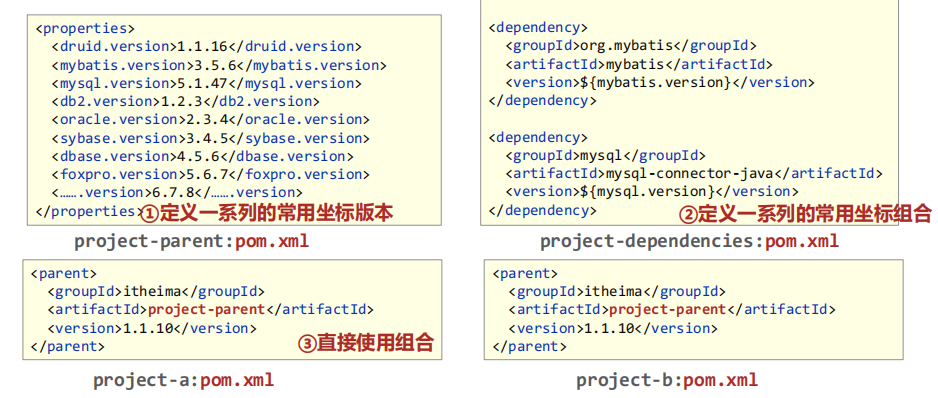

在我们的父模块下，定义好需要的依赖，并且指定好坐标版本。我们新建的子模块只需要去继承他就行了。

在我们SpringBoot框架里面，这个父模块就是：

```xml
<parent>
    <groupId>org.springframework.boot</groupId>
    <artifactId>spring-boot-starter-parent</artifactId>
    <version>2.6.2</version>
    <relativePath/> <!-- lookup parent from repository -->
</parent>
```

> 点击进去查看这个pom文件，他又有一个parent，然后下面的东西几百行都不是我们想要的：
>
> 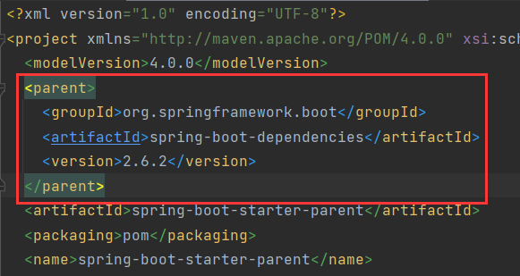
>
> 点击进去查看`spring-boot-dependencies`这个pom文件，哇，终于找到了，核心地方就是这里：
>
> 
>
> 他在properties定义了统一的版本号，那为什么我们自己引入依赖的时候，没有用 ${ }去引入这个属性呢，往下翻你会看到他定义了< dependencyManagement>：
>
> 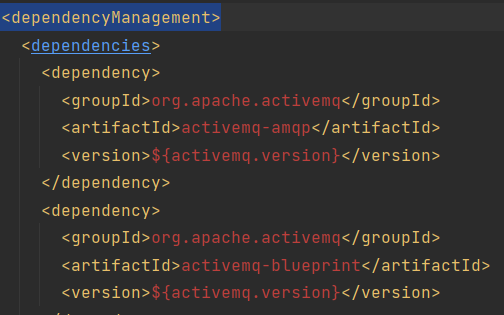


### starter

==减少依赖配置的书写量。==，**Starter就是一个启动器依赖，依赖内部是一系列依赖关系的集合，使我们在使用某一个技术时，你可以一站式集成该技术，而不需要到处找依赖包，而是只要添加一个starter就行了。**

例如，我们在开发Web服务时，只需要导入spring-boot-starter-web的starter就行了，这个依赖内部中已经帮我们导入spring-web、spring-webmvc、spring-boot-starter-tomcat等这些开发web服务所需要的所有依赖。

> **实际开发应用方式**
>
> - 实际开发中如果需要用什么技术，先去找有没有这个技术**对应的starter**
>
>   - 如果有对应的starter，直接写starter，而且无需指定版本，版本由parent提供
>   - 如果没有对应的starter，手写坐标即可
> - 实际开发中如果发现坐标出现了冲突现象，确认你要使用的可行的版本号，使用手工书写的方式添加对应依赖，覆盖SpringBoot提供给我们的配置管理
>
> <font color="#f0f"><b>温馨提示</b></font>	SpringBoot官方给出了好多个starter的定义，方便我们使用，而且名称都是如下格式：**命名规则：spring-boot-starter-技术名称**

​	

### **starter与parent的区别**

朦朦胧胧中感觉starter与parent好像都是帮助我们简化配置的，但是功能又不一样，梳理一下。

<font color="#ff0000"><b>starter</b></font>是一个坐标中定义若干个坐标，以前写多个的依赖，现在写一个，<font color="#ff0000"><b>是用来减少依赖配置的书写量的</b></font>

<font color="#ff0000"><b>parent</b></font>是定义了几百个依赖版本号，以前写依赖需要自己手工控制版本，现在由SpringBoot统一管理，这样就不存在版本冲突了，<font color="#ff0000"><b>是用来减少依赖冲突的</b></font>。


### 引导类

**使用了@SpringBootApplication的类就是引导类，内部有一个main方法，方法内调用了SpringApplication.run（）方法。**

该run方法运行的结果返回对象是Spring的ApplicationContext应用上下文对象，并且可以调用getBean方法获取容器内的Bean。所以说到这里就明白了。这个方法就是用来产生Spring容器对象的。说到底SpringBoot就是为了简化加速Spring开发的，具体实现还是Spring那一套。

**除此以外，引导类注解配置了包扫描器，扫描当前包及其子包下所有注解。**

> 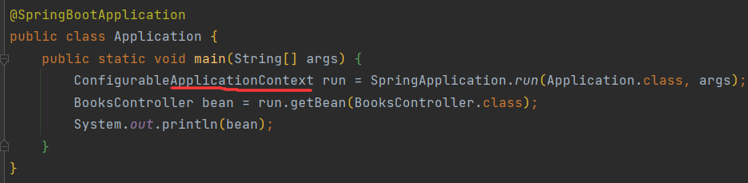
>
> 哇哇！！这不是应用上下文对象嘛，不就是Spring的那个最终的东西嘛，并且我们还可以从里面拿到Bean。所以说到这里就明白了。这个方法就是用来产生Spring容器对象的。说到底SpringBoot就是为了简化加速Spring开发的，具体实现还是Spring那一套。
>


### 内嵌tomcat

在导入的spring-boot-starter-web中，引入了spring-boot-starter-tomcat依赖，然后在这个依赖内，有一个tomcat-embed-core的依赖，这就是我们最终导入的内嵌tomcat。

tomcat服务器运行其实是以对象的形式在Spring容器中运行的。


## 2.springboot的配置有哪些

springboot项目呈现的一起三个配置文件：**一个pom.xml（maven的），一个引导类，一个application.properties**。

核心就是这个application.properties，其中这个配置文件，也可以使用yml和yaml这两种格式。


## 3.介绍一下springboot的几种配置文件

springboot支持properties、yml、yaml三种格式的配置文件，命名必须是application，我们一般使用yml格式。

**三种配置文件的优先级：**

1. 配置文件间的加载优先级	properties（最高）>  yml  >  yaml（最低）
2. 不同配置文件中相同配置按照加载优先级相互覆盖，不同配置文件中不同配置全部保留

> properties使用点 . 表示属性层级关系，使用 key=value的方式。
>
> yml使用多行缩进关系表示属性层级关系，使用key：value的方式。字符串使不使用双引号都可以，区别在于**引号包裹的字符串**，里面的转义字符可以生效


## ==4.springboot代码中如何读取yml文件==

- **1、读取yml单一数据**

  使用@Value注解，括号内使用$表达式对应yml某个具体属性

- **2、读取yml全部数据**

  SpringBoot提供了一个**Environment**对象，通过使用**自动装配注解@Autowired**可以将所有的yml数据封装到这个对象中，对象通过调用getProperties方法获取数值。

- **3、读取yml某个对象数据**

  1、自己写一个java实体类加上**@Component**，对象成员属性和要读取的yml的对象属性名完全一样；

  2、实体类上使用注解**@ConfigurationProperties (prefix = "yml对象名字"）**指定加载yml中哪一组对象配置的信息。

  3、使用时用**@Autowired**的时候从Spring容器里面直接拿取。


## 5.如何做临时配置

临时配置就是在不改变application配置文件的基础上，在运行java程序时修改相关配置属性，临时配置覆盖了之前的固定配置。例如配置文件中写的是8080端口，部署运行jar时要使用8000端口。

办法就是在java -jar 命令行启动程序时，在后面添加上对应参数就可以，使用双减号--

```cmd
java –jar springboot.jar –-server.port=80
```

如果你发现要修改的属性不止一个，可以按照上述格式继续写，属性与属性之间使用空格分隔。

```cmd
java –jar springboot.jar –-server.port=80 --logging.level.root=debug
```

**原理就是：springboot启动类main方法的那个String[] args参数**，通过这个参数进行修改的

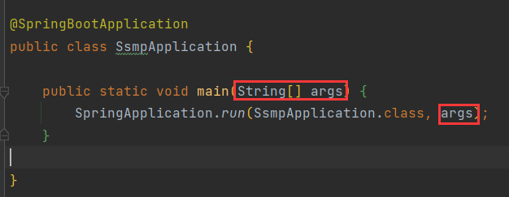

## 6.配置文件的优先级？

**SpringBoot提供了配置文件和临时属性的方式来对程序进行配置。**

**临时配置的优先级高于配置文件**

springboot给配置文件**分了4个优先级，分类根据是配置文件的存放位置**：从高到低排列：

- 程序包jar所在目录下的config目录下的配置文件；
- 程序包jar所在目录中的配置文件；
- 类路径下的config目录下的配置文件；（ resource/config目录下）
- 类路径下的配置文件（resources目录下）；

采用高级优先级**叠加并覆盖**低级优先级的形式，有则改之，无则加上。

**举例说明一下哈：**

开发人员：

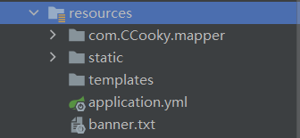

项目经理：

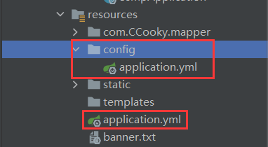

运维人员：

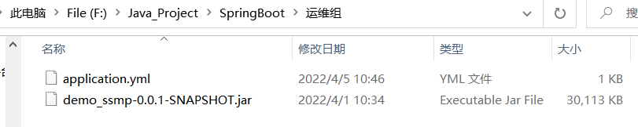

运维经理：

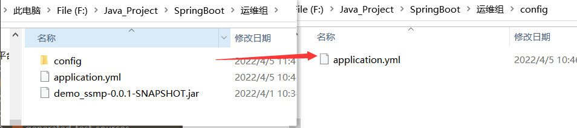


## 7.多环境开发如何写配置文件？多配置文件处理

​	什么是多环境？其实就是说你的电脑上写的程序最终要放到别人的服务器上去运行。每个计算机环境不一样，这就是多环境。常见的多环境开发主要兼顾3种环境设置，**开发环境——自己用的，测试环境——自己公司用的，生产环境——甲方爸爸用的。**因为这是绝对不同的三台电脑，所以环境肯定有所不同，**比如连接的数据库不一样，设置的访问端口不一样**等等。

**就是说，我们在不同的环境中要用不同的配置文件，需要写多个配置文件。**有两种方式可以解决：

**1、利用springboot的四种配置文件优先级；将不同版本的application文件放在不同的位置。**

- 优点：不用更改项目中的配置文件属性。
- 缺点：修改配置起来不是很方便，不简洁

**2、采用一个主配置文件application加其他环境分类配置文件。**

- 优点：修改方便，结构清晰；
- 缺点：每次需要更改主配置文件属性；

- **实现方式：**主配置文件通过**配置spring.profiles.active属性**，**指定特定的文件名称application-xx**来识别加载的配置文件；=
  - 主配置文件命名：application，环境分类配置文件命名：application-pro、application-dev、application-test（生产环境、开发环境、测试环境）
  - 一般而言：主配置文件中设置公共配置（全局）。环境分类配置文件中常用于设置冲突属性（局部）

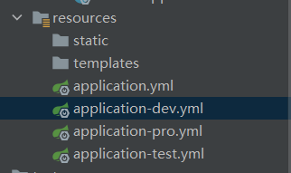

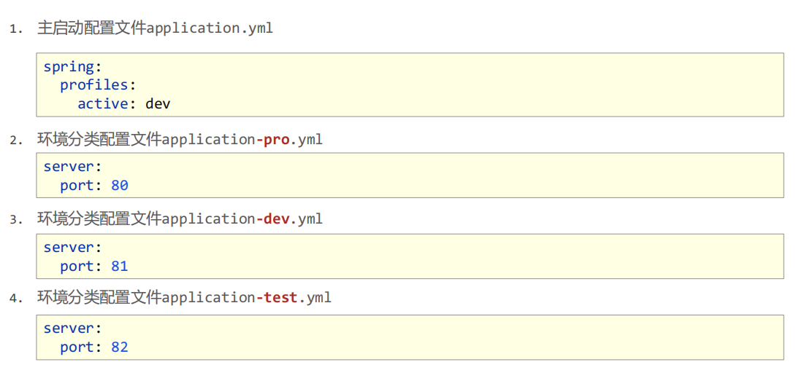

## 8.独立配置文件书写技巧

**就是可以将多个配置单独分出来单独成为一个配置文件，例如数据库的配置、Redis的配置等，命名规则如下：**

-  application-devDB.yml（数据库配置）
-  application-devRedis.yml（Redis）
-  application-devMVC.yml（SpringMVC）

**使用include属性在激活指定环境的情况下进行加载**，同时对多个环境进行加载使其生效，多个环境间使用逗号分隔

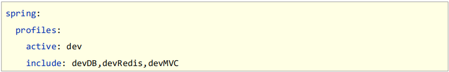

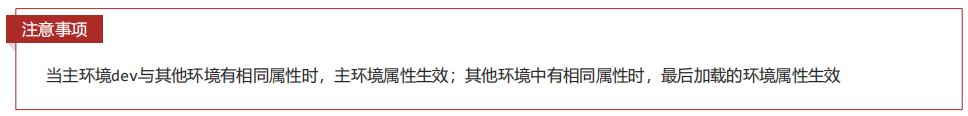

 从Spring2.4版开始使用group属性替代include属性，降低了配置书写量。

 **使用group属性定义多种主环境与子环境的包含关系**

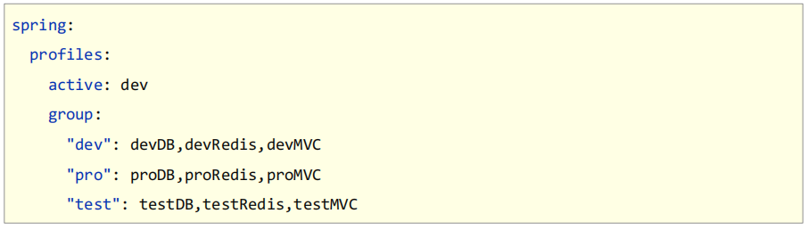

## 9.日志控制

### 1、日志级别

日志的级别分为6种，分别是：

- TRACE：运行堆栈信息，使用率低
- **DEBUG：程序员调试代码使用**（开发）
- **INFO：记录运维过程数据**（上线）
- **WARN：记录运维过程报警数据**（运维）
- **ERROR：记录错误堆栈信息**
- FATAL：灾难信息，合并计入ERROR

### 2、代码中手动添加日志信息

SpringBoot提供的**Logger对象**就是用来记录日志的对象，下面的log.debug，log.info这些操作就是写日志的API了。

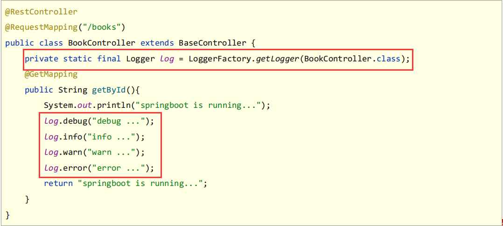

使用**lombok提供的注解@Slf4j**简化开发，**减少日志对象的声明操作**

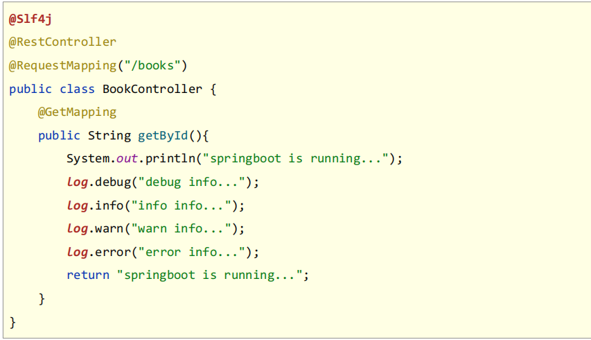

### 3、配置文件配置日志

**1、控制日志输出级别：**

```yml
# 设置日志级别，root表示根节点，即整体应用日志级别
logging:
	level:
    	root: debug
```

设置日志组，控制指定包对应的日志输出级别。更细粒度的控制

```yml
logging:
  #  设置分组，每一个组下可放多个包
  group:
    #  一个组名为ebank，一个为iservice
    ebank: com.CCooky.controller,com.CCooky.service
    iservice: com.alibaba
  level:
    #  整体输出均为info级别
    root: info
    #  单独设置日志组的日志输出级别
    ebank: warn
```


**2、控制日志输出位置**

> 日志不能仅显示在控制台上，要把日志记录到文件中，方便后期维护查阅。对于日志文件的使用存在各种各样的策略，例如每日记录，分类记录，报警后记录等。这里主要研究日志文件如何记录。
>

直接设置日志文件名：

```yml
logging:
	file:
    name: server.log #出现在项目的同目录下
```

然后启动我们的项目，直接在IDEA是找不到这个文件的，他在这个模块的同级目录下：

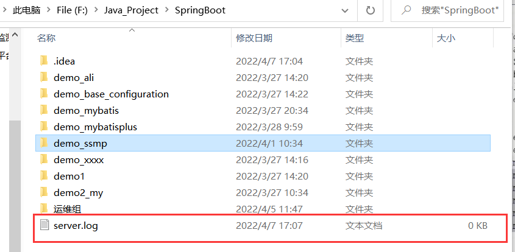

新的问题来了，难道我们项目就一直用这个文件吗？那这个文件不就越来越大呢！！！肯定是不行的，所以**要对日志按照大小或日期进行分开记录**。通常会每天记录日志文件，同时为了便于维护，还要限制每个日志文件的大小。

下面给出日志文件的常用配置方式：基于logback日志技术设置每日日志文件的设置格式，要求容量到达3KB以后就转存信息到第二个文件中。

```YAML
logging:
	logback:
    	rollingpolicy:
        	max-file-size: 3KB
            file-name-pattern: server.%d{yyyy-MM-dd}.%i.log
           # 日志文件大小最大为3kb
           # 日志文件的命名模板---server.2022-04-07.0.log
           # %d标识日期，%i是一个递增变量，用于区分日志文件。
```

​		

**3、控制日志输出格式**

目前记录的格式是SpringBoot给我们提供的，如果想自定义控制就需要自己设置了。


- PID：进程ID，用于表明当前操作所处的进程，当多服务同时记录日志时，该值可用于协助程序员调试程序
- 所属类/接口名：当前显示信息为SpringBoot重写后的信息，名称过长时，简化包名书写为首字母，甚至直接删除		

对于单条日志信息来说，日期，触发位置，记录信息是最核心的信息。级别用于做筛选过滤，PID与线程名用于做精准分析。了解这些信息后就可以DIY日志格式了。下面给出课程中模拟的官方日志模板的书写格式，便于大家学习。

```yml
# %d---事件，%clr---彩色标注，%p---级别，PID我们自己无法直接获取，%t---进程
# %c---类名，%m---日志信息，%n---换行
logging:
	pattern:
    	console: "%d %clr(%p) --- [%16t] %clr(%-40.40c){cyan} : %m %n"
```

## ==10.springboot缓存解决方案==

==SpringBoot内置了缓存解决方案，采用的是内存级缓存，缓存到内存里面，程序重启就没有了。==可以进行技术更换，使用专业的缓存技术商提供的，但使用方式还是一样的

**1、spring-boot-starter-cache依赖**

**2、启动类加注解@EnableCaching，开启缓存功能**

**3、在业务方法上使用缓存类的注解**、

- **@Cacheable(value="cacheSpace",key="#id")**

  value属性--缓存存储空间的名字；key属性--缓存的唯一标识，使用**#id**读取**形参中的id值**作为缓存名称。最后缓存id的对应数据——方法的返回值。

  当该方法被调用时，首先会先去对应的缓存空间找key=参数id的数据，找到了就会直接返回缓存里的数据，不再调用方法。没有找到这个key时，才会调用下面的方法。

-  **@CachePut(value = "smCode",key = "#tele")**

  这个注解就是单纯的存入key=tele的缓存数据，然后就没了，不会去取出缓存的数据，也就是不会停止下面方法的调用。

- **@CacheEvict(value = "smCode",key = "#tele")**

  清除缓存。默认在方法调用完之后清除缓存。

  `allEntries`：是否清空所有缓存，默认为 false；如果指定为 true，则方法调用后将立即清空所有的缓存
  `beforeInvocation`：是否在方法执行前就清空，默认为 false；如果指定为 true，则在方法执行前就会清空缓存

```xml
<dependency>
    <groupId>org.springframework.boot</groupId>
    <artifactId>spring-boot-starter-cache</artifactId>
</dependency>
```

```java
@SpringBootApplication
//开启缓存功能
@EnableCaching
public class Springboot19CacheApplication {
    public static void main(String[] args) {
        SpringApplication.run(Springboot19CacheApplication.class, args);
    }
}
```

```java
@Service
public class BookServiceImpl implements BookService {
    @Autowired
    private BookDao bookDao;
		
  // value属性--缓存存储空间的名字；key属性——缓存的唯一标识（这里的id对应形参的Integer id）；最后缓存id的对应数据——方法的返回值
    @Cacheable(value="cacheSpace",key="#id")
    public Book getById(Integer id) {
        return bookDao.selectById(id);
    }
}
```

### 1.整合Redis缓存

需要安装独立的Redis服务器，连接时需要输入对应的服务器地址，这种是远程缓存

**步骤①**：导入redis的starter坐标

```xml
<dependency>
    <groupId>org.springframework.boot</groupId>
    <artifactId>spring-boot-starter-data-redis</artifactId>
</dependency>
```

**步骤②**：配置缓存技术实现使用redis

```yaml
spring:
  redis:
    host: localhost
    port: 6379
  cache:
    type: redis
```

如需要对redis作为缓存进行配置，注意不是对原始的redis这个软件进行配置，而是配置redis作为缓存使用相关的配置，隶属于spring.cache.redis节点下，注意不要写错位置了。

```yaml
spring:
	# redis的连接信息
  redis:
    host: localhost
    port: 6379
  # springboot对redis的缓存配置信息
  cache:
    type: redis
    redis:
      use-key-prefix: true  # 在redis缓存的key前加前缀，（默认true）
      key-prefix: sms_  # 前缀命名（默认无）
      cache-null-values: false  # 是否可以缓存空值
      time-to-live: 10s  # 缓存存活时间
```

默认情况下，我们在redis里面存的key是下面这个，`@Cacheable(value = "smCode", key = "#tele")`

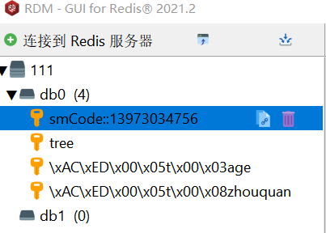

> 假如设置use-key-prefix: true，key-prefix: sms_，则Redis的键为
>
> sms_smCode::13973034756

## 11.spring的任务组件Task

Quartz将其中的对象划分粒度过细，导致开发的时候有点繁琐，Springboot针对上述规则进行了简化，开发了自己的**任务管理组件——Task**。spring根据定时任务的特征，将定时任务的开发简化到了极致，6666。

**步骤①**：启动类加上注解**@EnableScheduling**开启SP的定时任务功能

```java
@SpringBootApplication
//开启定时任务功能
@EnableScheduling
public class Springboot22TaskApplication {
    public static void main(String[] args) {
        SpringApplication.run(Springboot22TaskApplication.class, args);
    }
}
```

**步骤②**：使用注解**@Scheduled（cron表达式）**定义定时任务的时间

```java
@Component
public class MyBean {
    @Scheduled(cron = "0/1 * * * * ?")
    public void print(){
        System.out.println(Thread.currentThread().getName()+" :spring task run...");
    }
}
```

完事，这就完成了定时任务的配置。


## ==12.Spring Boot的核心注解是哪个?它主要由哪几个注解组成的?==

启动类上面的注解是**@SpringBootApplication**，它也是Spring Boot 的核心注解，主要组合**包含了以下3个注解:**

- **@SpringBootConfiguration：**组合了@Configuration注解，实现配置文件的功能。
- **@EnableAutoConfiguration：**==打开自动配置的功能==，也可以关闭某个自动配置的选项，如关闭数据源自动配置功能: @SpringBootApplication(exclude = { DataSourceAutoConfiguration.class })。
- **@ComponentScan:** Spring组件扫描。


## ==13.讲述一下 SpringBoot 自动装配原理？==

从下面三个方面回答：

1. 什么是 SpringBoot 自动装配？
2. SpringBoot 是如何实现自动装配的？如何实现按需加载？
3. 如何实现一个 Starter

**1、什么是Springboot的自动装配？**

SpringBoot 定义了一套接口规范，这套规范规定：SpringBoot 在启动时会扫描**外部引用 jar 包中的`META-INF/spring.factories`文件**，将文件中配置的类型信息加载到 Spring 容器（此处涉及到 JVM 类加载机制与 Spring 的容器知识），并执行类中定义的各种操作。对于外部 jar 来说，只需要按照 SpringBoot 定义的标准，就能将自己的功能装置进 SpringBoot。==也就是starter的实现==

没有 Spring Boot 的情况下，如果我们需要引入第三方依赖，需要手动配置，非常麻烦。但是，Spring Boot 中，我们直接引入一个 starter 即可。比如你想要在项目中使用 redis 的话，直接在项目中引入对应的 starter 即可。引入 starter 之后，我们通过少量注解和一些简单的配置就能使用第三方组件提供的功能了。

自动装配可以简单理解为：**通过注解或者一些简单的配置就能在 Spring Boot 的帮助下实现某块功能。**


**2、SpringBoot 是如何实现自动装配的？**

在springboot的核心注解**@SpringBootApplication**下有一个**@EnableAutoConfiguration**注解。这是实现自动装配的重要注解。

然后**EnableAutoConfiguration**下import了**AutoConfigurationImportSelector类**，这是实现自动装配的具体功能类。类中的 **ImportSelector**方法加载**META-INF/spring.factories**中的**自动配置类**实现自动装配到IoC容器中，自动配置类其实就是通过**@Conditional按需加载的配置类**，==想要其生效必须引入**spring-boot-starter**包实现起步依赖。==

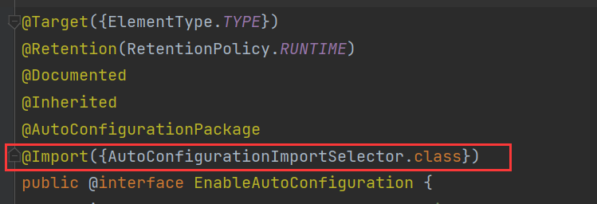

他会获取需要自动装配的所有配置类，

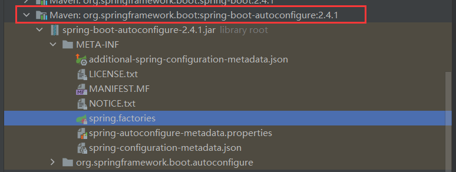

到这里可能面试官会问你:“`spring.factories`中这么多配置，每次启动都要全部加载么？”。很明显，这是不现实的。我们 debug 到后面你会发现，`configurations` 的值变小了加载的数量变少了，因为，这里通过条件注解**@ConditionalOnXXX** 经历了一遍筛选，


**3、如何实现一个 Starter**

光说不练假把式，现在就来撸一个 starter，实现自定义线程池

第一步，**创建一个Maven的Starter模块，**如`threadpool-spring-boot-starter`工程


第二步，**引入 Spring Boot 相关依赖**


第三步，创建**ThreadPoolAutoConfiguration**类，用到**@Configuration**注解、**条件注解@Conditional**、**@Bean**等


第四步，在**threadpool-spring-boot-starter工程**的 resources 包下创建**META-INF/spring.factories**文件，里面对该类进行声明。


**最后新建工程引入`threadpool-spring-boot-starter`**


测试通过！！！


## 14. Spring .Spring Boot和 Spring Cloud的关系?

**Spring最初最核心的两大核心功能Spring loc和Spring Aop成就了Spring**，Spring在这两大核心的功能上不断的发展，才有了Spring 事务、Spring Mvc 等一系列伟大的产品，最终成就了Spring帝国，到了后期Spring几乎可以解决企业开发中的所有问题。

**Spring Boot是在强大的Spring帝国生态基础上面发展而来，发明Spring Boot不是为了取代Spring,是为了让人们更容易的使用Spring 。**

Spring Cloud是一系列框架的有序集合。**它利用Spring Boot 的开发便利性巧妙地简化了分布式系统基础设施的开发，如服务发现注册、配置中心、消息总线、负载均衡、断路器、数据监控等，都可以用Spring Boot 的开发风格做到一键启动和部署。**


## ==15.spring事务 @Transactional 失效的种场景==

归于底层是因为 声明式事务是采用AOP织入实现的，AOP底层是基于动态代理，一个是JDK的接口实现，一个是基于cglib的父类进行代理。就会出现很多问题。因为是生成了代理类，在代理类中实现的事务功能。


**1、方法非public修饰**；spring要求被代理方法必须得是public的。

**2、方法用final修饰，不会生效**；代理类无法重写该方法撒；

**3、方法被同一个类的方法内部进行调用，失效**；原因一样的，@Transactional要生效，需要经过Spring的代理类。所以只有来自外部的方法调用被AOP代理成功捕获，也就是，类内部方法调用本类内部的其他方法并不会引起事务行为。

- 解决方法：

  一个是可以在类中自己注入自己，用注入的对象调用另一个方法。可能有些人可能会有这样的疑问：这种做法会不会出现循环依赖问题？答案：不会。其实spring ioc内部的[三级缓存](https://blog.csdn.net/mccand1234/article/details/116403266)保证了它，不会出现循环依赖问题。

  另一个是将同一个类中的两个事务方法拆分到两个类中，A方法所在的类中注入B方法所在的类。


**4、出现异常，事务不回滚的情况**

- 1、Spring的事务管理默认是**针对Error异常**和**RuntimeException异常以及其子类进行事务回滚。**如果代码抛出的异常在这两中范围之外，则不可回滚。

  处理这种情况：只需在@Transaction注解里面指定回滚异常类型即，争对所有异常情况；

- 2、手动捕获了这个异常try...catch，然后没有进行手动的事务回滚


**5、一个业务方法中，出现多线程调用某个方法**；

- 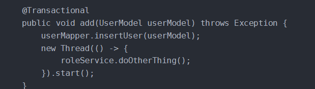

- 从上面的例子中，我们可以看到事务方法add中，调用了事务方法doOtherThing，但是事务方法doOtherThing是在新建的一个线程中调用的，不是主线程。
- 这样会导致两个方法不在同一个线程中，获取到的数据库连接不一样，从而是两个不同的事务。如果想doOtherThing方法中抛了异常，add方法回滚是不可能的。
- ==如果看过spring事务源码的朋友，可能会知道spring的事务是通过数据库连接来实现的。==当前线程中保存了一个map，key是数据源，value是数据库连接。我们说的同一个事务，其实是指同一个数据库连接，只有拥有同一个数据库连接才能同时提交和回滚。如果在不同的线程，拿到的数据库连接肯定是不一样的，所以是不同的事务。

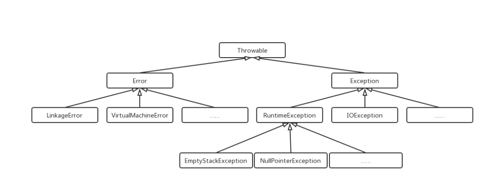

**7、非事务方法A调用事务B引起事务失效（代码中最常见）**

spring默认的是PROPAGATION_REQUIRED机制；

- 如果方法A标注了注解@Transactional 是完全没问题的,执行的时候传播给方法B,因为方法A开启了事务,线程内的connection的属性autoCommit=false,并且执行到方法B时,事务传播依然是生效的,得到的还是方法A的connection,autoCommit还是为false,所以事务生效;

- 反之,如果方法A没有注解@Transactional 时,是不受事务管理的,autoCommit=true,那么传播给方法B的也为true,执行完自动提交,即使B标注了@Transactional
  


## 16、@Transactional参数

**@Transactional。**既可以**标示方法也可以标示在类**上面。标示在类上，就是将该事务配置应用到该类的所有方法。那假如单独在方法上又写了一个@Transactional，**那就是就近原则。**

- 注解涉及到的参数

  - **isolation: 事务的隔离级别**。Isolation.**DEFAULT**：使用各个数据库默认的隔离级别【默认】
  - **propogation**：事务的传播行为

  - timeout：超时时间
  - read-only：是否只读

**@Transactional 只能被应用到public方法上, 对于其它非public的方法,如果标记了@Transactional也不会报错,但方法没有事务功能.**

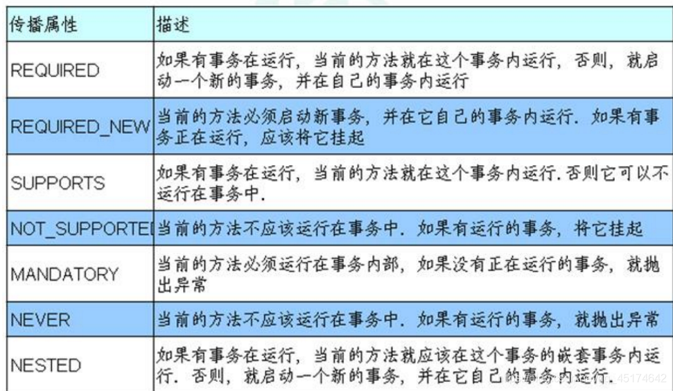

下面列举出两种传播行为的例子，因为实际开发中用的比较多：

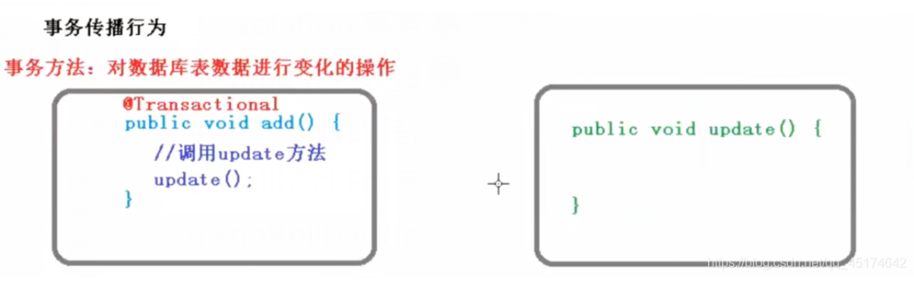

**REQUIRED**：如果add方法本身就有事务,调用update方法之后,使用add当前的事务,若没有,则创建新的事务。

**REQUIRED_NEW**：当前的方法必须启动新的事务,add方法调用update方法,不管add方法是否有事务,都会创建新的事务。


