# 一、Docker

## 1.介绍一下docker和其架构

**解决的问题：程序在不同的环境中水土不服的问题。**

Docker就是一个容器，可以把我们开发人员的**代码环境和依赖一起打包**，做成一个镜像，然后直接到其他电脑上使用，不会再有水土不服的情况。

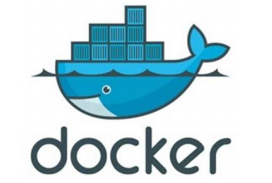

• **Docker 可以让开发者打包他们的应用以及依赖包到一个轻量级、可移植的容器中，然后发布到任何流行的Linux 机器上。**

• **容器是完全使用沙箱机制，相互隔离**

**• 容器性能开销极低。**

• Docker 是一个开源的应用容器引擎

• 诞生于 2013 年初，基于 Go 语言实现， dotCloud 公司出品（后改名为Docker Inc） 


**架构：**


• **镜像（Image）**：Docker 镜像（Image），就相当于是一个 root 文件系统。比如官方镜像 ubuntu:16.04 就包含了完整的一套 Ubuntu16.04 最小系统的 root 文件系统。

• **容器（Container）**：镜像（Image）和容器（Container）的关系，就像是面向对象程序设计中的类和对象一样，镜像是静态的定义，**容器是镜像运行时的实体**。容器可以被创建、启动、停止、删除、暂停等。

• **仓库（Repository）**：仓库可看成一个代码控制中心，用来保存镜像。

## 2.介绍一下docker的数据卷

**1、数据卷解决的三个问题：**

​	• 容器内数据持久化（容器挂掉了，我们数据还是在的）

​	• 容器之间数据交换

​	• 外部机器和容器的间接通信

**2、数据卷是什么？**

​	• 数据卷是**宿主机（Linux）**中的一个目录或文件(被挂载了才算)

​	• 当**容器目录和数据卷目录绑定**后，**双方的修改会立即同步**

​	• 一个数据卷可以被多个容器同时挂载

​	• 一个容器也可以被挂载多个数据卷

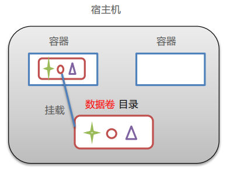

## 3.如何实现两个容器之间的数据交互？

==两个容器挂载同一个数据卷==实现两个容器之间的通信。

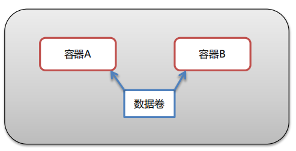

```sh
docker run -it --name=c3 -v /root/data:/root/data centos:7
# 新建一个会话
docker run -it --name=c4 -v /root/data:/root/data centos:7
```

> 然后我们在c4里面新建一个itcast.txt，然后我们去c3会发现里面也有这个itcast.txt；


## 4.如何实现外部机器与容器的数据交互？

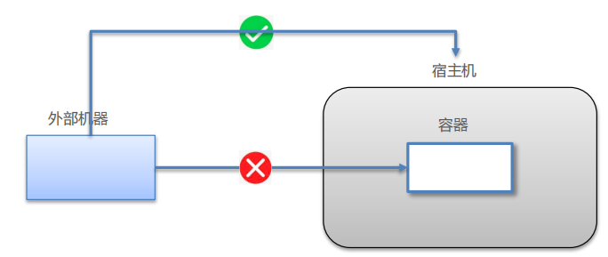

首先我们知道：外部机器和宿主机可以直接通信；宿主机和容器可以直接通信

可以通过**端口映射**的操作实现外部机器与容器的通信。当容器中的网络服务需要被外部机器访问时，将容器中**提供服务的端口映射到宿主机的端口**上。外部机器访问宿主机的该端口，从而间接访问容器的服务.

> 宿主机有一个本地的localhost，也有一个对外暴露的 Ip地址，两个本质是一样的东西（但是访问对外的IP地址是需要过LInux防火墙和阿里云控制台权限的）；

假如我们运行了一个简单的springboot项目: 宿主机的7001映射到springboot容器内8000.（宿主机的8000还是空的，容器内7001是空的，懂了吧）

```sh
# 宿主机7001——容器内8000
docker run -id --name=sp -p 7001:8000 sp
# 容器内部访问该服务 （先进入容器：docker exec -it sp bash）
curl localhost:8000/hello
# 宿主机访问该服务
curl localhost:7001/hello
```

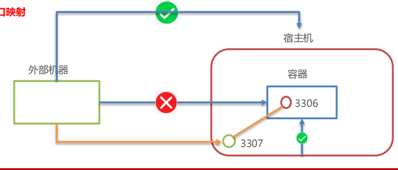

## 5.docker与传统虚拟机对比

docker容器就是将软件打包成标准化单元，以用于开发、交付和部署。

- 容器镜像是轻量的、可执行的独立软件包 ，包含软件运行所需的所有内容：代码、运行时环境、系统工具、系统库和设置。
- 容器化软件在任何环境中都能够始终如一地运行。

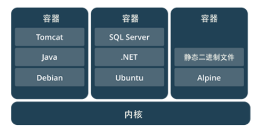

**相同：**

- 容器和虚拟机具有相似的资源隔离和分配优势

**不同：**

- 容器虚拟化的是操作系统，虚拟机虚拟化的是硬件。（虚拟机共享的是我们电脑的硬件cpu，内存，显卡撒）这一点就导致了两者之间的性能差异很大！！！

  > 虚拟机是虚拟出来一套硬件，在其上面运行一个完整的操作系统，例如我们使用的VMware，指定系统镜像，然后装系统，最终可以使用，在该系统上再运行所需的应用程序。VMware创建虚拟机时，如果指定较少的CPU，内存，硬盘等资源，虚拟机性能较低。而且不断的创建虚拟机，会消耗了大量的硬件资源，会占用很多磁盘空间，可能实际运行的应用程序才MB级别，而整个虚拟机一起是几个G。
  >
  > 容器内的应用程序是直接运行在宿主机的内核上，容器内没有自己的内核，也没有对硬件进行虚拟，能够使用宿主机最大的硬件资源，内存、cpu、磁盘，就好比直接运行在宿主机上面的一个进程，每个进程是互相隔离的，互不影响。所以性能更高。

- 传统虚拟机可以运行不同的操作系统，容器只能运行同一类型操作系统.

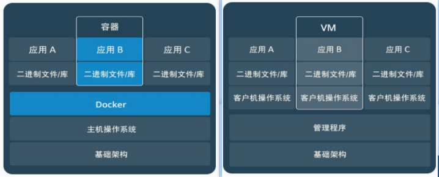


- 虚拟机是分配宿主机硬件资源，性能较弱。容器能够直接使用宿主机性能


## 6.docker镜像的本质是什么？

==总结：==

**1、Docker 镜像本质是什么？**

- 是一个分层文件系统。
- 镜像就是和操作系统相关的，通过镜像文件呢，我们可以启动一个容器也就是启动了一个Linux操作系统。
- Linux文件管理系统由bootfs和rootfs两部分组成，不同的linux发行版，bootfs基本一样，而rootfs不同。
- Docker镜像是由特殊的文件系统叠加而成，最底端是 bootfs，并且会使用宿主机的bootfs（内核）。第二层是 root文件系统rootfs, 称为基础镜像。
- 然后再往上可以叠加其他的镜像文件；比如添加一个jdk镜像，然后上面再叠加一个tomcat镜像，以tomcat为例，==我们就会称这三部分是一个tomcat的镜像，但对外暴露的只是tomcat镜像。==而Tomcat依赖于下面两个镜像，他会在下载Tomcat时自动去搜索，假如有了下面的所需镜像就直接在上面叠加不用再去下载。==这样做的好处就是：复用。并且这几部分是只读镜像==。
- 这种叠加的操作叫做：==统一文件系统（Union File System）技术==，他能够将不同的层整合成一个文件系统，为这些层提供了一个统一的视角，这样就隐藏了多层的存在，在用户的角度看来，只存在一个文件系统。例如上面的tomcat，用户并不知道有多少层，只知道我搞了一个tomcat镜像。

**2、Docker 中一个centos镜像为什么只有200MB，而一个centos操作系统的iso文件要几个个G？** 

​    Centos的iso镜像文件包含bootfs和rootfs，而docker的centos镜像复用操作系统的bootfs，只有rootfs和其他镜像层。

**3、Docker 中一个tomcat镜像为什么有500MB，而一个tomcat安装包只有70多MB？**

​    由于docker中镜像是分层叠加的，tomcat虽然只有70多MB，但他需要依赖于父镜像jdk和基础镜像如centos啊，这样jdk200多M，centos200多M，加起来就有500多M了，所以整个tomcat镜像大小500多MB，但对于用户而言只看到了对外暴露的tomcat镜像，这就是统一文件系统（Union File System）技术的好处


$\color{#FF69B4}{1、首先了解一下操作系统的组成部分：}$

> 为什么先要了解操作系统的组成部分呢？
>
> **因为镜像就是和操作系统相关的，通过镜像文件呢，我们可以就启动一个Linux操作系统，启动一个容器也就是启动了一个Linux操作系统。**
>
> 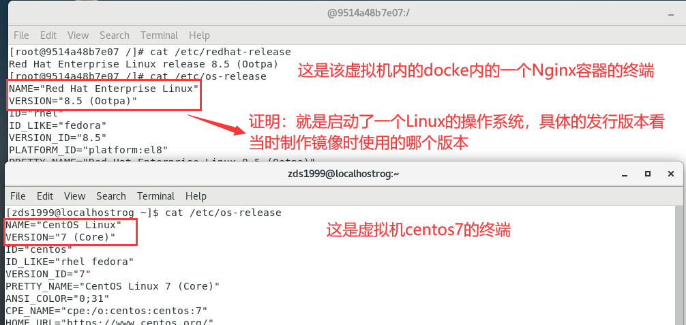

​		• 进程调度子系统

​		• 进程通信子系统

​		• 内存管理子系统

​		• 设备管理子系统

​		• **文件管理子系统**

​		• 网络通信子系统

​		• 作业控制子系统

我们这里重点关注操作系统的文件管理子系统，==由于Docker是基于Linux操作系统的，所以我们看一下Linux的文件管理子系统。==

**Linux文件系统由bootfs和rootfs两部分组成**

​	• bootfs：包含bootloader（引导加载程序）和 **kernel（内核）**

​	• rootfs： **root文件系统**，包含的就是典型 Linux 系统中的/dev，/proc，/bin，/etc等标准目录和文件

​	• **不同的linux发行版，bootfs基本一样，而rootfs不同**，如ubuntu，centos等


$\color{#FF69B4}{2、docker镜像的原理}$

1. **Docker镜像是由特殊的文件系统叠加而成**

2. **最底端是 bootfs，并且使用宿主机的bootfs（内核）**，正因为这样所以docker容器启动的非常快啊，几乎就是1秒，而我们自己启动一台Linux的操作系统就要好久啊，几十秒甚至1分钟。因为容器启动时省去了启动bootfs的这个过程。

   提问：可不可以在Linux操作系统下安装一个Windows的docker呢？答案是不可以，因为内核不一样啊，不能复用了。

   

3. **第二层是 root文件系统rootfs, 称为基础镜像**


4. **然后再往上可以叠加其他的镜像文件；**比如添加一个jdk镜像，然后上面再叠加一个tomcat镜像，如下，以tomcat为例，**我们就会称这三部分是一个tomcat的镜像，但对外暴露的只是tomcat镜像。**但Tomcat依赖于下面两个镜像，他会在下载Tomcat时自动去搜索，假如有了下面的所需镜像就直接在上面叠加，没有就先下载。**这样做的好处就是：复用**

   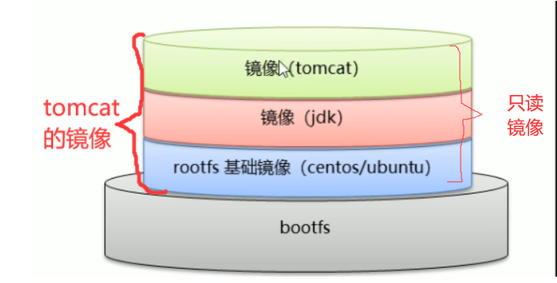

   **并且这三部分叫做只读镜像**。为什么是只读呢？因为你修改了之后别人就不能去复用了呀！

5. **这种叠加的操作叫做：统一文件系统（Union File System）技术**，他能够将不同的层整合成一个文件系统，为这些层提供了一个统一的视角，这样就隐藏了多层的存在，在用户的角度看来，只存在一个文件系统。你看用户并不知道有多少层，只知道我搞了一个tomcat镜像。

6. **一个镜像可以放在另一个镜像的上面。**位于下面的镜像称为**父镜像**，最底部的镜像成为**基础镜像**。

## 7.只读镜像不可以改！那就要改镜像怎么办？

==有办法，通过容器！！！==当从一个镜像启动容器时，Docker会在最顶层加载一个读写文件系统作为容器（里面包含了基础镜像啊、父镜像啊，当前镜像啊），我们可以在这个容器里面修改，改完了之后再把这个容器作为一个新的镜像！！！就相当于这个新的镜像是改了tomcat后的镜像。容器下面的那三部分还是只读镜像，没有影响。

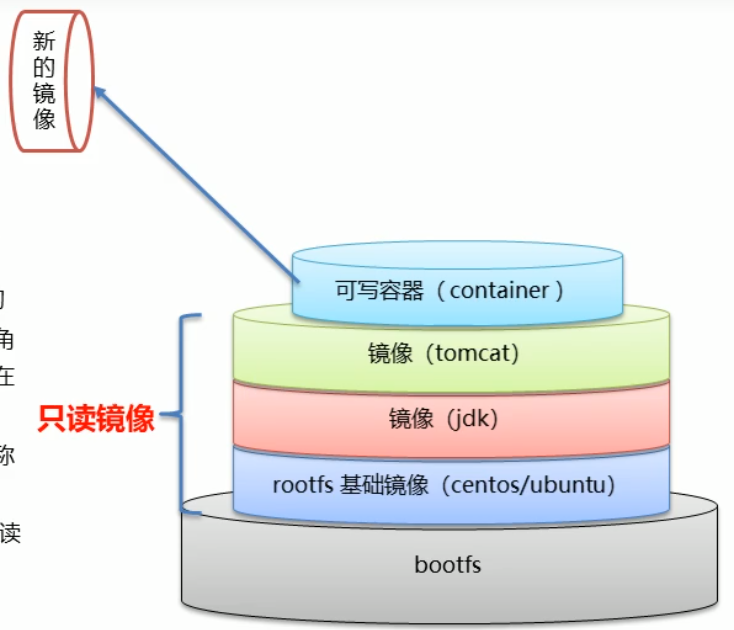

**1、容器转镜像**

```shell
docker commit 容器id 镜像名称:版本号
```

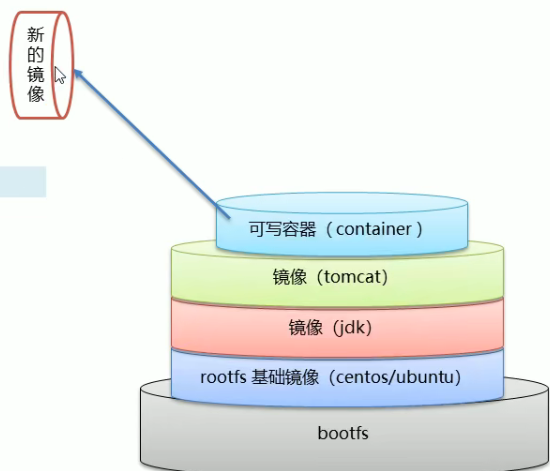

**2、压缩镜像**

镜像本身是不可以传给别人的，所以要压缩，就可以了，压缩文件不是想怎么传就怎么传嘛；例如开发转给测试

```
docker save -o 压缩文件名称 镜像名称:版本号
```

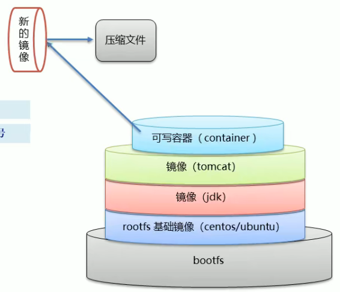

**3、还原镜像**

把压缩的镜像还原进行使用；

```
docker load –i 压缩文件名称
```

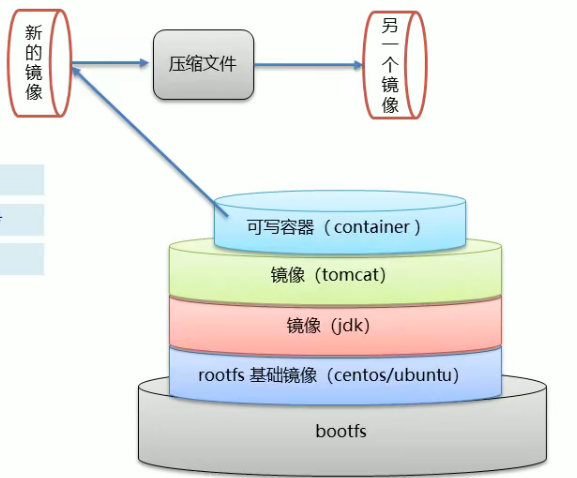

**Example:**

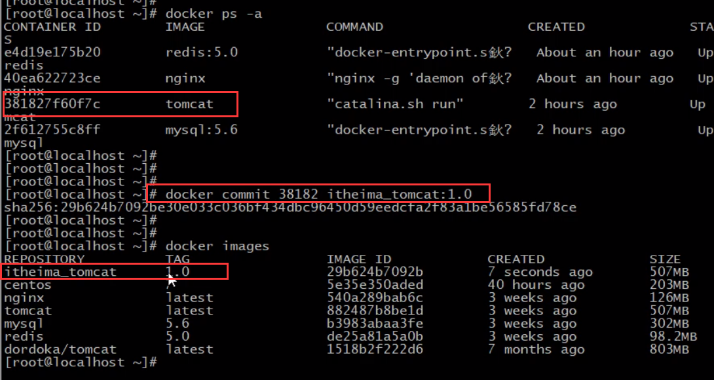


## 7.制作镜像的方式有哪些？

有两种方式：

- 1、通过容器转镜像；
- 2、通过dockerfile制作镜像。


## 8.dockerfile介绍一下？

- **Dockerfile 是一个文本文件**
- **包含了一条条的指令**
- **每一条指令构建一层镜像，基于基础镜像，最终构建出一个新的镜像**

重点关注的指令有：

> 其实`volume`指令的设定的目的就是为了避免用户忘记指定`-v`的时候导致的数据丢失，那么如果用户指定了`-v`，自然而然就不需要volume指定的位置了。

| DF关键字       | 作用                                               | 备注                                                         |
| -------------- | -------------------------------------------------- | ------------------------------------------------------------ |
| **FROM**       | 指定父镜像                                         | 指定dockerfile基于那个image构建                              |
| **MAINTAINER** | 作者信息                                           | 用来标明这个dockerfile谁写的                                 |
| **RUN**        | **在构建镜像过程中执行的命令**。可以使用多个该命令 | 默认是/bin/sh 格式: RUN command 或者 RUN ["command" , "param1","param2"] |
| **CMD**        | **容器启动时执行的命令**，只能有一个CMD            | 提供启动容器时候的默认命令 和ENTRYPOINT配合使用.格式 CMD ["command" , "param1","param2"] |
| **COPY**       | 复制文件到容器                                     | 不会自动解压缩，只能添加本地的                               |
| **ADD**        | 添加文件到容器中                                   | 会自动解压缩，并且既可以添加本地的也可以添加远程的           |


## 9.docker compose了解吗

微服务架构的应用系统中一般包含若干个微服务，每个微服务一般都会部署多个实例，如果每个微服务都要手动启停，维护的工作量会很大。如我们按照原始的方式就是：

- 要从Dockerfile build image 或者去dockerhub拉取image

- 要创建多个container

- 要管理这些container（启动停止删除）


**服务编排： 按照一定的业务规则批量管理容器**

**Docker Compose**

Docker Compose是一个编排多容器分布式部署的**服务编排工具**，提供命令集管理容器化应用的完整开发周期，包括服务构建，启动和停止。

使用步骤：

1. 利用 Dockerfile 先定义好，运行环境镜像

2. 使用 **docker-compose.yml** 定义组成应用的各服务（如要启动十个容器）

3. 运行 **docker-compose up** 启动应用（会按照顺序启动这十个容器，不用一个个手动启动）

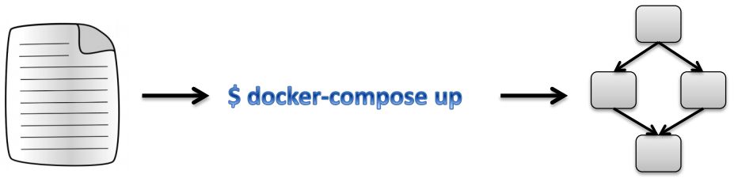

 **一、安装Docker Compose**

```shell
# Compose目前已经完全支持Linux、Mac OS和Windows，在我们安装Compose之前，需要先安装Docker。下面我 们以编译好的二进制包方式安装在Linux系统中。 
curl -L https://github.com/docker/compose/releases/download/1.22.0/docker-compose-`uname -s`-`uname -m` -o /usr/local/bin/docker-compose
# 设置文件可执行权限 
chmod +x /usr/local/bin/docker-compose
# 查看版本信息 
docker-compose -version
```

**二、卸载Docker Compose**

```shell
# 二进制包方式安装的，删除二进制文件即可
rm /usr/local/bin/docker-compose
```


**三、 使用docker compose编排nginx+springboot项目**

1. 创建docker-compose目录

```shell
mkdir ~/docker-compose
cd ~/docker-compose
```

2. 编写 docker-compose.yml 文件

```yml
version: '3'
services:
  nginx: #要启动的容器名称
   image: nginx  # 所用镜像名称
   ports:
    - 80:80
   links:
    - app  # 这个也可以不写，这个和后面nginx的配置文件对应
   volumes: # 数据卷
    - ./nginx/conf.d:/etc/nginx/conf.d
    
  app: #要启动的容器名称
    image: springbootapp  # 所用镜像名称
    expose:
      - "8080"  # 只是显示的指明暴露的端口，并不会建立端口映射，提高可读性和维护性。
```

3. 创建./nginx/conf.d目录

```shell
mkdir -p ./nginx/conf.d
```

4. 在./nginx/conf.d目录下 编写itheima.conf文件

```shell
server {
    listen 80;
    access_log off;

    location / {
        proxy_pass http://app:8080;  # app和前面的yml文件对应，直接用ip地址也可以
    }
   
}
```

5. 在~/docker-compose 目录下 使用docker-compose 启动容器

```shell
docker-compose up
```

6. 测试访问

```shell
http://192.168.149.135/hello
```


## 10.docker命令知道哪些？

**1、控制docker的命令**

```shell
# 查看docker运行状态
systemctl status docker  systemctl start docker
```

**2、镜像的相关命令**

```sh
# 查看镜像
docker images
# 从网络中查找需要的镜像
docker search 镜像名称
# 拉取镜像
docker pull 镜像名称:版本号（直接写镜像名称就是最新版）
# 删除指定本地镜像
docker rmi 镜像id 
```

**3、容器启动相关命令**

```sh
# 查看在运行的容器，查看所有容器
docker ps  docker ps –a
# 根据镜像启动容器
docker run 参数 镜像名称:版本
docker run -id --name=redis redis:5.0 /bin/bash
参数说明：
• -i：保持容器运行。
• -t：为容器分配一个伪输入终端，让他可以接收命令，通常与 -i 同时使用。
• -d：以守护（后台）模式运行容器。
• -it：容器创建后自动进入容器中，退出容器后，容器自动关闭。
• -id：容器创建后需要使用docker exec进入容器。退出后，容器不会关闭。
• --name：为创建的容器命名。
# 进入守护式容器
docker exec -it c_mysql /bin/bash   exit为退出
# 停止容器
docker stop 容器名
# 删除容器
docker rm 容器名称
```

```sh
# 设置容器的数据卷，启动容器命令加 -v参数
docker run ... –v 宿主机绝对目录(文件):容器内绝对目录(文件) ...
docker run -id --name=c3 -v $pwd/data:/root/data centos:7
```

```sh
# 端口映射 启动容器命令加 -p参数
docker run ... –p 宿主机端口:容器端口...
```

```sh
  # -p指定端口映射 # -v 容器内数据卷绑定（不需要python算法）
docker run -id \
-p 8000:8000 \
--name=backxboot \
-v $PWD/xbootlog:/xboot-logs \
backxboot  
```

**4、容器日志相关命令**

```sh
docker logs -ft 容器名称  # 实时查看所有的日志信息
docker logs -ft --tail 50 容器名称  # 查看容器近50条日志信息
```

**5、容器转镜像**

```sh
docker commit 容器id 镜像名称:版本号  #容器转镜像
docker save -o 压缩文件名称 镜像名称:版本号 #压缩镜像
docker load –i 压缩文件名称  # 解压缩镜像
```


## 11.dockerfile的编写命令

部署springboot的项目

```sh
# 定义父镜像
FROM java:8  
# 定义作者信息
MAINTAINER ZHOUQUAN <123@QQ.COM>  

VOLUME /tmp   
# 将jar包添加到容器中并更名为xboot.jar
ADD xboot.jar xboot.jar 
# 运行jar包
CMD java -jar xboot.jar
```

```sh
# 制作镜像
docker bulid –f dockerfile的文件路径 –t 镜像名称:版本 . # 版本不写就是latest，后面有个点哦
docker build -f back_dockerfile -t backxboot . #最后这个点.必须要
```

```sh
# 创建启动容器
docker run -id \
-p 8000:8000 \
--name=backxboot \
-v $PWD/xbootlog:/xboot-logs \
backxboot  
```


# 二、Linux

## 1、发行版本

各不同版本Linux，都是基于相同的内核版本，只是用的内核版本可能有高有低，同时各厂家自己加了自己有特点的工具，还有某些文件位置不一样，所以可以说，不同版本的Linux相同度可以达90%

**三大家族：**

- linux系统基本上分两大类：

- [RedHat](https://so.csdn.net/so/search?q=RedHat&spm=1001.2101.3001.7020)系列：Redhat、Centos、Fedora等；

- [Debian](https://so.csdn.net/so/search?q=Debian&spm=1001.2101.3001.7020)系列：Debian、Ubuntu等；

**RedHat （如Centos）系列**

- 常见的安装包格式 rpm包，安装rpm包的命令是“rpm -参数”

- 包管理工具 **yum** 进行软件安装

- 支持tar包


**Debian（如Ubuntu）系列** 

- 常见的安装包格式 deb包，安装deb包的命令是“dpkg -参数” 

- 包管理工具 **apt** 进行软件安装

- 支持tar包

**通用下载工具：**

[wget](https://so.csdn.net/so/search?q=wget&spm=1001.2101.3001.7020)是一种下载工具。可以下载网络上的资源，有点类似于迅雷。比如安装redis时需要先下载redis软件然后再安装，那就用wget命令。


## 2、常用命令

**1、切换管理员**

- sudo 命令，临时获取root权限
- su 命令，切换到root用户

**2、编辑器**

- vim、vi
- gedit

**3、常用的几个**

- ```sh
  ls    #列出目录下文件
  ls -al == ll (简写)  #包括隐藏文件，并且显示全部文件信息
  
  mkdir abc  # 创建一个目录
  mkdir -p abc/dz/wang   #创建多层目录
  rmdir you/dss/wang     #移除目录
  
  cp abc.txt aaa/bbb/  # 复制文件
  cp -r xhx/ aaa/bbb/   # 递归复制整个文件夹
  
  rm abc.txt   #删除某个文件
  rm -rf abc/  #递归删除文件中所有内容
  
  cat config.d  # 查看文件内容
  
  touch  #创建一个文件
  df -h  #查看磁盘分区使用情况
  fdisk -l #查看物理磁盘大小、磁盘信息
  free -m  #查看内存大小
  
  curl localhost:8000  #用来请求 Web 服务器，这是get请求
  ping www.baidu.com
  
  ifconfig  # 查看宿主机的网卡
  
  where is mysql
  ```

**4、软连接**

- ```sh
  # 软连接（类似快捷方式，指向作用，会去创建一个文件）
  ln -s [原文件或目录] [软连接名]
  
  # cd进入软连接中，用pwd查看会出现什么情况呢？？
  cd linkxxx
  pwd   # ---会显示软连接的目录路径
  pwd -P  #---会显示真正的文件路径
  
  # 直接进入到真正的文件路径
  cd -P 软连接名 
  ```


## 3、chmod改变权限


文件权限类型使用从左至右用0-9这些数字来表示:

**（1）0 首位表示类型**

在Linux中第一个字符代表这个文件是目录、文件或链接文件等等

- ​	**-**    代表文件
- ​    **d**    代表目录
- ​    **l**     链接文档(link file)；

**（2）第1-3位确定属主**（该文件的所有者）拥有该文件的权限。---User

**（3）第4-6位确定属组**（所有者的同组用户）拥有该文件的权限，---Group

**（4）第7-9位**  确定其他用户拥有该文件的权限 ---Other


**chmod基本语法**


- 指令名称 : chmod

- 使用权限 : 所有使用者

- 使用方式 : chmod [-cfvR] [–help] [–version] mode file…
  说明 : Linux/Unix 的档案调用权限分为三级 : **档案拥有者u、群组g、其他o**。利用 chmod 可以藉以控制档案如何被他人所调用

- ```yml
  chmode : 权限设定字串，格式如下 : chmod [{ugoa}{+-=}{rwx}] 文件或目录
  # u:档案拥有者 g:拥有者的同组用户 o:其他人  a:所有人(u、g、o 的总和)
  # + 表示增加权限、- 表示取消权限、= 表示唯一设定权限。
  # r 表示可读取，w 表示可写入，x 表示可执行，X 表示只有当该档案是个子目录或者该档案已经被设定过为可执行。
  -R : 对目前目录下的所有档案与子目录进行相同的权限变更(即以递回的方式逐个变更)
  ```

  ```sh
  # 例如将档案 file1.txt 设为所有人皆可读取 :
  chmod ugo+r file1.txt 
  chmod a+r file1.txt 
  # 将档案 file1.txt 与 file2.txt 设为该档案拥有者，与其所属同一个群体者可写入，但其他以外的人则不可写入 :
  chmod ug+w,o-w file1.txt file2.txt 
  # 将目前目录下的所有档案与子目录皆设为任何人可读取 
  chmod -R a+r * 
  ```

- **第二种方式更改权限，**就是用数字代替各个字母，简化书写，各个权限与数字的对应关系如下：

  ```sh
  r=4, w=2,  x=1 
  若要rwx属性则4+2+1=7；
  若要rw-属性则4+2=6；
  若要r-x属性则4+1=5。
  ```

  ```sh
  格式为:  chmod 三个组权限数字 文件或目录
  # 例如:将文件变成所有用户可读可写可执行，即文件权限对所有用户全部开放
  chmod 777 file.txt == chmod a+rwx file.txt
  ```

## 4、部署java程序相关命令

### **1、防火墙权限设置**

```sh
# 查看防火墙状态  开启防火墙  关闭防火墙
systemctl status/start/stop firewalld  
# 查看已经开放的已开放的临时端口
firewall-cmd --list-ports
# 查看所有永久开放的端口
firewall-cmd --list-ports --permanent
# 添加永久开放的端口
firewall-cmd --add-port=8000/tcp --permanent
# 关闭永久端口
firewll-cmd --remove-port=8000/tcp --permanent
# 重载入添加的端口：
firewall-cmd --reload
# 查询指定端口是否开启成功
firewall-cmd --query-port=8000/tcp
```

### **2、查询端口冲突，并且解决**

```sh
# 查询运行的java应用程序（只能查到PID，无法查到占用端口）
ps -ef | grep java
# 查询所有运行的应用程序
ps -ef
# 查看某个端口占用情况，可以看到pid
netstat -anp | grep 8080
# 查询全部端口占用情况
netstat -anp
# 根据pid查看占用的端口：
netstat -antup | grep 48891132
# 查看具体端口被哪个进程占用
lsof -i : 8080
# 强制杀死进程
kill -9 pid
```

**1、ps命令**

- **ps命令将某个进程显示出来**（是LINUX下最常用的也是非常强大的进程查看命令）

- **grep命令是查找**（是一种强大的文本搜索工具，它能使用正则表达式搜索文本，并把匹配的行打印出来，grep全称是**Global Regular Expression Print**，表示全局正则表达式版本，它的使用权限是所有用户）

- **中间的|是管道命令** 是指ps命令与grep同时执行

- ps -ef | grep java查询**结果字段含义如下：主要看PID**

  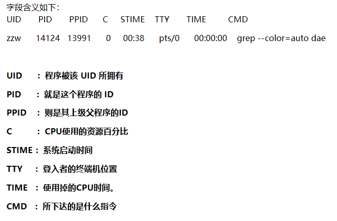

- **ps -ef | grep java的疑惑**

  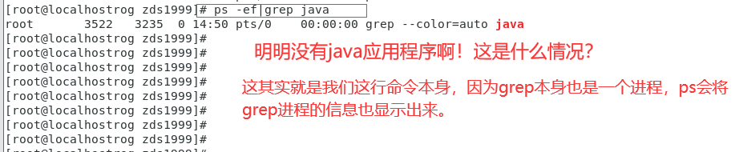

  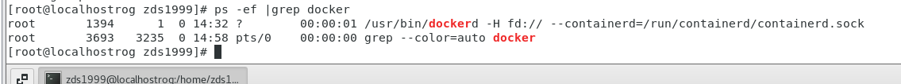


**2、netstat命令**

用于查看Linux服务器上当前机器监听的端口信息,

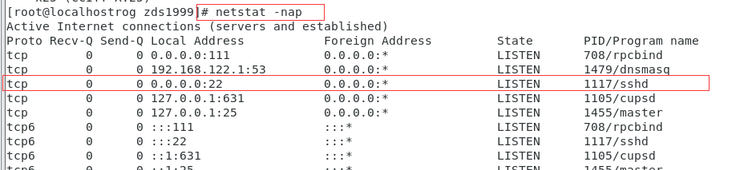


### **3、启动jar包**

（1）直接启动。当前ssh窗口被锁定，不能操作其他命令，按CTRL + C打断程序运行，或直接关闭窗口，程序中止。

```sh
java -jar server-1.0.0.jar
```

（2）后台启动。&代表在后台运行。当前ssh窗口不被锁定，但是当窗口关闭时，程序中止。

```sh
java -jar server-1.0.0.jar &
```

（3）守护进程后台启动并输出日志，控制台窗口退出不会中止应用。不指定日志输出文件，则所有的输出都会被重定向到 `nohub.out` 的文件中。

```sh
nohup java -jar server-1.0.0.jar &
```

==（4）守护进程后台启动指定输出日志文件。==

- 一个大于号：“ **>** spring.log ” 表示将输出重定向到Log.log中
- 两个大于号：" **>>** " 表示将输出以追加的方式重定向到Log.log中。
- **2>&1**：**标准错误输出**重定向到**标准输出**。也就是说将应用的标准输出和错误输出合在一起

```sh
nohup  java -jar server-1.0jar >> spring.log 2>&1 &
```

（5）守护进程后台启动( 指定系统分配内存 )

```sh
nohup java -jar -Xms1024m -Xmx2048m server-1.0.0.jar >> spring.log 2>&1 &
```


> **在Linux系统中0 1 2是一个文件描述符：**
>
> 标准的输入，输出和错误输出分别表示为STDIN, STDOUT, STDERR，也可以用0，1，2来表示。如下：
>
> 
>
> 其中0表示键盘输入 1表示屏幕输出 2表示错误输出。
>
> **2>&1的含义**：将**标准错误输出重定向到标准输出。**
>
> **“> Log.log 2>&1” ：**表示将 stdout 和 stderr 合并后重定向到 Log.log
>
> 注意：符号**>&**是一个整体，不可分开，分开后就不是上述含义了


## 5、Linux文件系统

==Linux 系统中一切皆文件。==

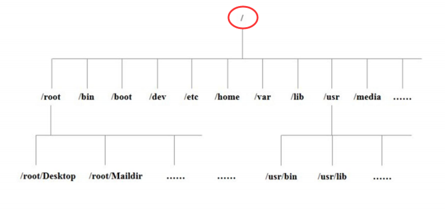

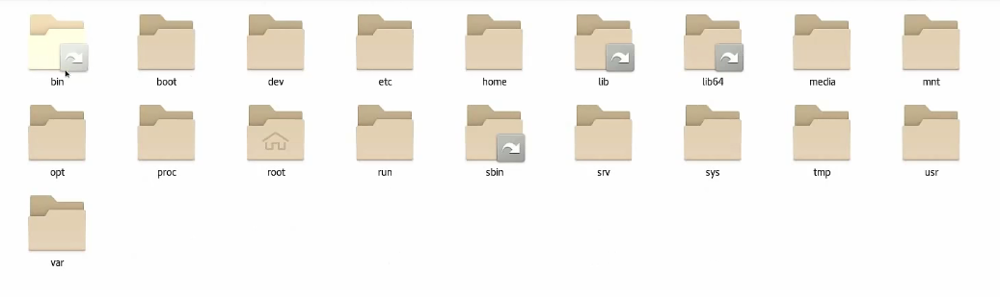

**特别注意**，有些目录是带有一个箭头的，这表示 该目录是一个链接，类似于**快捷方式**，真实的目录地址并不是在这里，例如看bin文件夹的的属性。

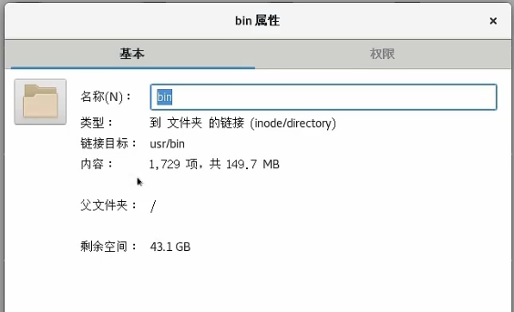

==主要关注点：==  

- **/mnt目录 ：**让用户临时挂载别的文件系统的
- **/opt目录：**空，给用户安装额外的软件用的，如mysql
- **/tmp目录：**存放临时文件用的
- **/etc目录：**存放系统管理的配置文件
- **/usr目录：**存放用户很多的应用程序和文件，很重要，类似于win的program files目录。
- **/home目录：** 存放普通用户的主目录，每一个Linux账号用户都有这样一个自己的目录
- **/bin目录：**软连接文件，对应usr/bin。存放最经常使用的二进制命令
- **/root目录：**对应于/home目录，这里是超级管理员的用户主目录

## 6、挂载点

**即将文件路径和真实的物理磁盘分区关联起来** 。如我把这个1G的磁盘分区挂载到了 /boot 文件路径下，那么我在系统访问 /boot 目录是进入的就是这个 1G的磁盘分区。

什么意思呢，很简单，其实就是，我们拿到这个Linux的系统盘之后，就像Win一样撒，先分区，不同的区放不同的东西之类的，方便管理。

例如，我们在安装Ubuntu的时候，手动将所有硬盘空间分了三个部分——一个1G、一个45G、一个4G。然后Win会给每个分区分配一个盘符，例如C盘、D盘，但是Linux不会，Linux是一切皆是文件，所有我们现在需要去访问这个磁盘空间，就需要一个**文件路径——这就是挂载点**，

也就是说我把这个**1G**的分区挂载到了 **/boot** 文件路径下，那么我在系统访问 **/boot** 目录是进入的就是这个 **1G**的磁盘分区。

其实，就是Linux需要通过文件路径（挂载点）---访问对应的真实物理内存空间。把文件路径和 真实物理磁盘空间对应起来就可以正常访问。**一个是逻辑关系，一个是真实磁盘存储关系。**


# 三、发布SP+vue项目

我们部署前后端分离项目在Linux下的文件目录结构统一为：

在root下新建`xboot`文件夹，`xboot`下新建`front`目录和`back`目录；

- front——放前端部署文件；
- back——放后端部署文件；


```
mkdir xboot
```

## **6.1、后端运行环境部署**

xboot项目需要Mysq、Redis、Java8三个环境，Java8不用提前安装，dockerfile写了会自动安装；

**Mysql的安装前面有，按着那个来，注意持久化存储的位置！！！！**

**Redis不需要持久化存储，这个简单，一下子就好了，按照前面来！！！**

==注意注意==：坑点来了，这里相当于我们后端项目、Mysql、Redis在三个不同的容器，他们之间是不可以通信的，必须通过宿主机对外IP地址来通信！！！就是说我们后端yml文件要把mysql和Redis的host改为现在的Linux的IP地址；

==记住：每一个容器就是一个单独的系统！！！！！==

## 6.2、后端部署

**1、打包springboot项目为jar包，注意跳过测试哦**

**2、jar包传到服务器 root/xboot/back下**

**3、back目录下新建编辑Dockerfile文件**

```sh
vim back_dockerfile	# 新建文件
```

```sh
# 输入以下内容
# 定义父镜像
FROM java:8  
# 定义作者信息
MAINTAINER ZHOUQUAN <123@QQ.COM>  
# VOLUME 指定临时文件目录为/tmp 在主机 /var/lib/docker 目录下创建了一个临时文件，并链接到容器的/tmp
VOLUME /tmp   
# 将jar包添加到容器中并更名为xboot.jar
ADD xboot.jar xboot.jar 
# 运行jar包
CMD java -jar xboot.jar
```

这样后端部署的文件就全部到位了！！

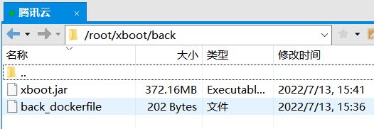

**5、通过dockerfile构建镜像**

```sh
docker bulid –f dockerfile文件路径 –t 镜像名称:版本 .# 版本不写就是latest

docker build -f back_dockerfile -t backxboot . #最后这个点.必须要
```

**6、启动容器**

```sh
  # -p指定端口映射 # -v 容器内数据卷绑定（不需要python算法）
docker run -id \
-p 8000:8000 \
--name=backxboot \
-v $PWD/xbootlog:/xboot-logs \
backxboot  

# 桥梁项目（需要部署python算法）
docker run -id \
-p 8000:8000 \
--name=backxboot \
-v $PWD/xbootlog:/xboot-logs \
-v $PWD/DataAnalysis:/DataAnalysis \
-v $PWD/ProgramData:/ProgramData \
-v $PWD/report:/report \
backxboot 
```

**7、查看容器日志**

```sh
docker logs -ft backxboot  # 实时查看所有的日志信息
docker logs -ft --tail 50 backxboot  # 查看容器近50条日志信息

# 进入容器
docker exec -it backxboot /bin/bash
```

**8、测试访问**

访问：http://47.111.114.184:8000

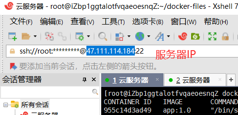

### **1. 问题排查**

假如访问不了，就按照下面进行问题排查，最好先拿一个简单的sp项目跑通先：

**1、排除docker内部的原因**

```sh
# 1、先在容器内部测试
docker exec -it backxboot bash
curl localhost:8000 # xboot这样访问没有回写数据看不出来，可以先拿一个简单的sp项目跑通先
ping www.baidu.com  # 随便ping一下，看网络通不

# 2、在宿主机测试
exit
curl localhost:8000  # 端口映射是8000:8000
ping www.baidu.com
```

这里假如都ok的话，就说明服务启动没问题了，是外网不能访问；

**2、解决外部访问问题**

1. 关闭Linux防火墙（访问暴露的IP地址需要经过防火墙）

```sh
systemctl status firewalld  # 查看防火墙状态
systemctl stop firewalld  # 关闭防火墙
systemctl disable firewalld  # 关闭防火墙的开机启动
```

2. 阿里云服务器需要在控制台安全组开放宿主机的端口号；
3. 阿里云服务器与docker虚拟网卡冲突，都是172网段

```sh
ifconfig  # 查看宿主机的网卡
```

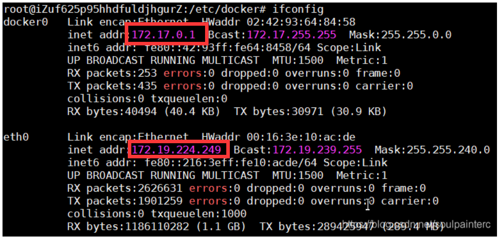

发现阿里云的[内网](https://so.csdn.net/so/search?q=内网&spm=1001.2101.3001.7020)eth0 网段正好跟Docker 的虚拟网卡都是 172 网段,有冲突.

```sh
 # 修改docker的网卡
 vim /etc/docker/daemon.json
 # 在里面加入下面一行
 "bip": "192.168.1.5/24",
```

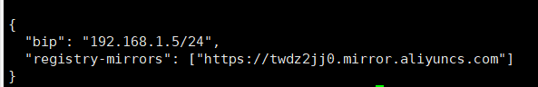

```sh
# 重启docker
systemctl restart docker
```

## 6.2、前端部署

前端环境是Nginx；我们需要自己写好路由跳转的配置文件；现在有两种部署方式，效果是一样的！！！

注意要点：

1. 我们前端打包文件夹dist下的内容要全部复制到nginx容器根目录下html文件夹下

2. nginx容器里面有两个配置文件，一个是`/etc/nginx/nginx.conf` ，一个是`/etc/nginx/conf.d/default.conf`，

   区别在于：第一个是正常的完全空的配置文件；第二个是默认的配置文件模板，这个里面已经帮我们把前面的`http{ }等结构`写好了，我们只要写`server{......}`里面的内容

前端打包：`npm run build`

### **1. 无数据卷**

这里用**default.conf**或者nginx.conf都是一样的，随便选；我们在无数据卷下选的**default.conf**，有数据卷选的**nginx.conf**

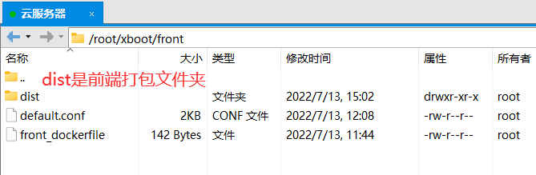

**1、Dockerfile**

```sh
vim front_dockerfile  # 也可以用xftp的用记事本打开还好用一点
```

```sh
FROM nginx  # 父镜像
MAINTAINER zouzou
RUN rm /etc/nginx/conf.d/default.conf  # 删除default.conf
ADD default.conf /etc/nginx/conf.d/  # 当前目录下default.conf复制到...
COPY dist/ /usr/share/nginx/html/  # 当前dits目录下的文件放到nginx的html下
```

**2、default.conf：只要写server内容**

```
vim default.conf
```

```sh
server {
    listen       9000;
    server_name  localhost;

    # Vue路由模式为history需添加的配置
    location / {
        if (!-e $request_filename) {
            rewrite ^(.*)$ /index.html?s=$1 last;
            break;
        }
        root   /usr/share/nginx/html/;  # 要改成你前端项目放的地方
        index  index.html;
    }

    location /xboot/ {
        proxy_pass http://47.111.114.184:8000;  # 改成后端访问地址
    }
    location /doc.html {
        proxy_pass http://47.111.114.184:8000;
    }
    location /swagger-resources {
        proxy_pass http://47.111.114.184:8000;
    }
    location /webjars {
        proxy_pass http://47.111.114.184:8000;
    }
    location /v2 {
        proxy_pass http://47.111.114.184:8000;
    }
    location /druid {
        proxy_pass http://47.111.114.184:8000;
    }
    # 完整版Activiti工作流设计器以及机器人助手页面需加入以下配置
    location /chat {
        proxy_pass http://47.111.114.184:8000;
    }
    location /modeler {
        proxy_pass http://47.111.114.184:8000;
     }
    location /editor-app {
        proxy_pass http://47.111.114.184:8000;
    }
    # 以上为完整版需要加的反向代理转发路径规则

    # 获取真实IP以及Websocket需添加的配置
    proxy_set_header Host $host;
    proxy_set_header X-Real-IP $remote_addr;
    proxy_set_header REMOTE-HOST $remote_addr;
    proxy_set_header X-Forwarded-For $proxy_add_x_forwarded_for;
    proxy_set_header Upgrade $http_upgrade;
    proxy_set_header Connection "upgrade";
    
    # 客户端Body大小限制（文件上传大小限制配置）
    client_max_body_size 5m;

    error_page   500 502 503 504 404  /50x.html;
    location = /50x.html {
        root   html;
    }
}
```

**3、创建镜像**

```sh
docker build -f front_dockerfile -t frontxboot .
```

**4、创建启动容器**

```sh
docker run -id --name=frontxboot -p 9000:9000 frontxboot
```

**5、查看日志**

```sh
docker logs -ft frontxboot  # 实时查看所有的日志信息
docker logs -ft --tail 50 frontxboot  # 查看容器近50条日志信息
```

**6、测试访问**

这里一般就可以了，后端部署ok的话；

访问：http://47.111.114.184:9000

### 2. 有数据卷(推荐)

这种方式我们dockerfile就一句话就行了，主要在我们创建容器的时候绑定数据卷信息；

**新建文件夹html：**将dist目录下的文件复制到html目录下

**新建文件夹logs：**空

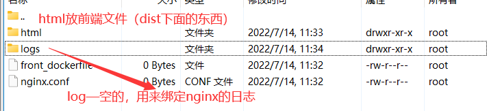

**1、Dockerfile**

```
vim front_dockerfile
```

```
FROM nginx
MAINTAINER zouzou
```

**2、nginx.conf**

因为改的是`/etc/nginx/nginx.conf`，需要全部内容

```
vim nginx.conf
```

```sh
#user  nobody;
worker_processes  1;

#error_log  logs/error.log;
#error_log  logs/error.log  notice;
#error_log  logs/error.log  info;

#pid        logs/nginx.pid;


events {
    worker_connections  1024;
}


http {
    include       mime.types;
    default_type  application/octet-stream;

    #log_format  main  '$remote_addr - $remote_user [$time_local] "$request" '
    #                  '$status $body_bytes_sent "$http_referer" '
    #                  '"$http_user_agent" "$http_x_forwarded_for"';

    #access_log  logs/access.log  main;

    sendfile        on;
    #tcp_nopush     on;

    #keepalive_timeout  0;
    keepalive_timeout  65;

    #gzip  on;

server {
    listen       9000;
    server_name  localhost;

    # Vue路由模式为history需添加的配置
    location / {
        if (!-e $request_filename) {
            rewrite ^(.*)$ /index.html?s=$1 last;
            break;
        }
        root   /usr/share/nginx/html/;   # 要改成你前端项目放置的路径下（html）
        index  index.html;
    }

    location /xboot/ {
        proxy_pass http://139.155.243.51:8000;
    }
    location /doc.html {
        proxy_pass http://139.155.243.51:8000;
    }
    location /swagger-resources {
        proxy_pass http://139.155.243.51:8000;
    }
    location /webjars {
        proxy_pass http://139.155.243.51:8000;
    }
    location /v2 {
        proxy_pass http://139.155.243.51:8000;
    }
    location /druid {
        proxy_pass http://139.155.243.51:8000;
    }
    # 完整版Activiti工作流设计器以及机器人助手页面需加入以下配置
    location /chat {
        proxy_pass http://139.155.243.51:8000;
    }
    location /modeler {
        proxy_pass http://139.155.243.51:8000;
     }
    location /editor-app {
        proxy_pass http://139.155.243.51:8000;
    }
    # 以上为完整版需要加的反向代理转发路径规则

    # 获取真实IP以及Websocket需添加的配置
    proxy_set_header Host $host;
    proxy_set_header X-Real-IP $remote_addr;
    proxy_set_header REMOTE-HOST $remote_addr;
    proxy_set_header X-Forwarded-For $proxy_add_x_forwarded_for;
    proxy_set_header Upgrade $http_upgrade;
    proxy_set_header Connection "upgrade";
    
    # 客户端Body大小限制（文件上传大小限制配置）
    client_max_body_size 5m;

    error_page   500 502 503 504 404  /50x.html;
    location = /50x.html {
        root   html;
    }
}

}
```

**3、创建镜像**

```sh
docker build -f front_dockerfile -t frontxboot .
```

**4、创建启动容器，重点是这里**

-v ——一定是绝对路径才行哦

$PWD——获取当前绝对路径

```sh
# 当前目录的nginx.conf绑定到容器内的....
# 当前目录下的logs目录绑定到容器下这个日志目录
# 当前html目录下文件绑定到容器内html目录下
docker run -id --name=frontxboot \
-p 9000:9000 \
-v $PWD/nginx.conf:/etc/nginx/nginx.conf \
-v $PWD/logs:/var/log/nginx \
-v $PWD/html:/usr/share/nginx/html \
frontxboot
```

==这样的好处就是，每次我要改一下前端文件、nginx配置信息的话，就不用再重新创建镜像创建容器了，直接先停止stop容器，然后改现在宿主机内的内容，再start容器；==不相信的话，可以`cat /etc/nginx/nginx.conf`一下

**5、查看日志**

```sh
docker logs -ft frontxboot  # 实时查看所有的日志信息
docker logs -ft --tail 50 frontxboot  # 查看容器近50条日志信息
```

**6、测试访问**

这里一般就可以了，后端部署ok的话；

访问：http://47.111.114.184:9000


### 3. 不用docker

我们的系统不用docker安装方便一点，因为不用去改Nginx的请求转发的地址，真的改的麻烦哦！

系统部署端口：

​	1、后端  》》》》》》  182.245.124.110:4341==192.168.10.43:8000

​	2、前端  》》》》》》  182.245.124.110:4343==192.168.10.43:8002

​	部署的时候，大屏跳转改成外部访问地址！

​	Nginx的还是写本地的就行了，因为是请求转发，nginx和后端是一个服务器，127.0.0.1:8000可以访问到！！

**1、官网下载Nginx**

http://nginx.org/en/download.html


上传到服务器里面：

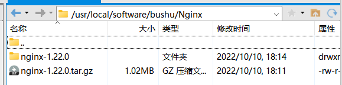

**2、解压配置**

1）检查是否存在 nginx（**有的话需要卸载掉自带的**）

```
whereis nginx
```

2）进入下载目录，解压

```
tar -zxvf nginx-1.20.2.tar.gz
```

3）进入解压目录，发现和Window目录一样的

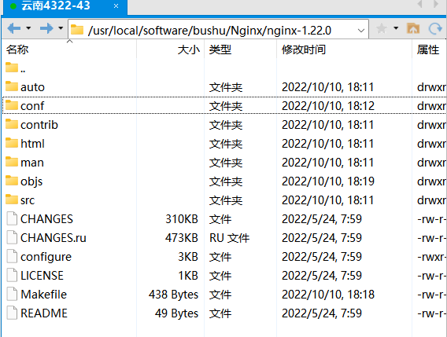

4）修改配置文件，在conf目录下面。

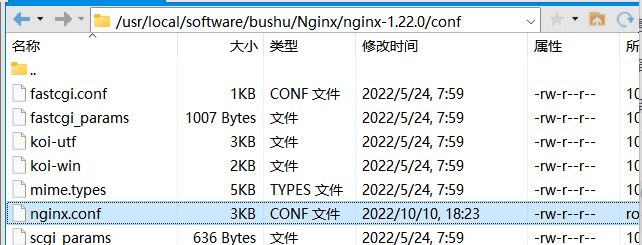

```sh
#user  nobody;
worker_processes  1;

#error_log  logs/error.log;
#error_log  logs/error.log  notice;
#error_log  logs/error.log  info;

#pid        logs/nginx.pid;


events {
    worker_connections  1024;
}


http {
    include       mime.types;
    default_type  application/octet-stream;

    #log_format  main  '$remote_addr - $remote_user [$time_local] "$request" '
    #                  '$status $body_bytes_sent "$http_referer" '
    #                  '"$http_user_agent" "$http_x_forwarded_for"';

    #access_log  logs/access.log  main;

    sendfile        on;
    #tcp_nopush     on;

    #keepalive_timeout  0;
    keepalive_timeout  65;

    #gzip  on;

server {
    listen       8002;
    server_name  localhost;

    # Vue路由模式为history需添加的配置
    location / {
        if (!-e $request_filename) {
            rewrite ^(.*)$ /index.html?s=$1 last;
            break;
        }
        root   xboot;    # 前端打包的项目文件路径
        index  index.html;
    }

    location /xboot/ {
        proxy_pass http://127.0.0.1:8000;
    }
    location /doc.html {
        proxy_pass http://127.0.0.1:8000;
    }
    location /swagger-resources {
        proxy_pass http://127.0.0.1:8000;
    }
    location /webjars {
        proxy_pass http://127.0.0.1:8000;
    }
    location /v2 {
        proxy_pass http://127.0.0.1:8000;
    }
    location /druid {
        proxy_pass http://127.0.0.1:8000;
    }
    # 完整版Activiti工作流设计器以及机器人助手页面需加入以下配置
    location /chat {
        proxy_pass http://127.0.0.1:8000;
    }
    location /modeler {
        proxy_pass http://127.0.0.1:8000;
     }
    location /editor-app {
        proxy_pass http://127.0.0.1:8000;
    }
    # 以上为完整版需要加的反向代理转发路径规则

    # 获取真实IP以及Websocket需添加的配置
    proxy_set_header Host $host;
    proxy_set_header X-Real-IP $remote_addr;
    proxy_set_header REMOTE-HOST $remote_addr;
    proxy_set_header X-Forwarded-For $proxy_add_x_forwarded_for;
    proxy_set_header Upgrade $http_upgrade;
    proxy_set_header Connection "upgrade";
    
    # 客户端Body大小限制（文件上传大小限制配置）
    client_max_body_size 5m;

    error_page   500 502 503 504 404  /50x.html;
    location = /50x.html {
        root   html;
    }
}


}

```


**3、安装Nginx**


先提前安装两个组件：

```sh
yum install -y openssl*

yum -y install ncurses-devel
```


在解压目录 `/usr/local/software/bushu/Nginx/nginx-1.22.0` 执行命令：

```sh
./configure			#先执行
make			    #执行完./configure之后，敲make回车
make install		#确认是否安装成功（可执行可不执行,没有影响）
```


等待完成后，nginx会被安装在Linux虚拟机上的`/usr/local/nginx`目录下，可以通过查找

```sh
whereis nginx			#查找nginx文件
cd /usr/local/nginx		#进入该文件
```


然后后续如果需要对Ngixn再次配置，就需要在安装好的目录下进行修改，如下：两个都是配置文件，忘记哪个是优先了，反正都改一下就对了

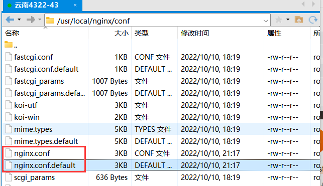


**4、将前端打包文件放到安装nginx的目录下即可，名字和前面对应为xboot**


**5、启动、停止Nginx**

Nginx的命令程序在：`/usr/local/nginx/sbin`，也就是sbin目录

```sh
cd /usr/local/nginx/sbin  #进入sbin文件

./nginx				#启动nginx程序

./nginx -s stop		#停止nginx

./nginx	-s quit		#安全退出

./nginx -s reload	#修改了文件之后重新加载该程序文件

ps aux|grep nginx	#查看nginx进程
```

