# 1、SQL注入问题

==拿学习的JDBC这里进行解释：==

### 3.3 Statement接口

前面我们通过Connection里面的createStatement方法==获取了Statement对象（多态），然后这个接口是用来执行SQL语句的==，有下面两种方法：在学习数据库的时候我们也了解了，数据库的查询都是单独拿出来的，因为他的返回结果比较特殊。所以说我们这里也是分了两种。

- **执行DDL、DML语句的方法**

  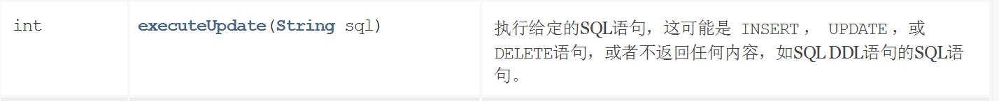

  返回值为影响的数据库里面的数据条数。

  这里就不想再举例了，和前面那个一模一样。

- **执行DQL语句的方法**

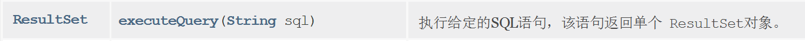

```java
ResultSet  executeQuery(sql)：执行DQL 语句，返回 ResultSet 对象
```

该方法涉及到了 `ResultSet` 对象，我们首先了解ResultSet对象。重点


#### 3.3.1 ResultSet

ResultSet（结果集对象）作用：

* ==封装了SQL查询语句的结果。==

而执行了DQL语句后就会返回该对象，对应执行DQL语句的方法如下：

```java
ResultSet  executeQuery(sql)：执行DQL 语句，返回 ResultSet 对象
```

那么我们就需要从 `ResultSet` 对象中获取我们想要的数据。

**然后`ResultSet` 类里面提供了操作查询结果数据的方法，如下**：

> **boolean  next()**
>
> * 将光标从当前位置向下移动一行 （注意，默认是在列名这个顶行）
> * 判断当前行是否为有效行
>
> 方法返回值说明：
>
> * true  ： 有效航，当前行有数据
> * false ： 无效行，当前行没有数据

> **xxx  getXxx(参数)：获取数据**
>
> * xxx : 数据类型；如： int getInt(参数) ；String getString(参数)
> * 参数（随便传下面两个中的一个都行，一般用int）
>   * int类型的参数：列的编号，**从1开始**
>   * String类型的参数： 列的名称 

如下图为执行SQL语句后的结果

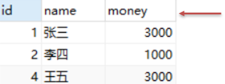

一开始光标指定于第一行前，如图所示红色箭头指向于表头行。当我们调用了 `next()` 方法后，光标就下移到第一行数据，并且方法返回true，此时就可以通过 `getInt("id")` 获取当前行id字段的值，也可以通过 `getString("name")` 获取当前行name字段的值。如果想获取下一行的数据，继续调用 `next()`  方法，以此类推。

**Example：**

```java
/**
  * 执行DQL
  * @throws Exception
  */
@Test
public void testResultSet() throws  Exception {
    //1. 注册驱动
    //Class.forName("com.mysql.jdbc.Driver");
    //2. 获取连接：如果连接的是本机mysql并且端口是默认的 3306 可以简化书写
    String url = "jdbc:mysql:///db1?useSSL=false";
    String username = "root";
    String password = "1234";
    Connection conn = DriverManager.getConnection(url, username, password);
    //3. 定义sql
    String sql = "select * from account";
    //4. 获取statement对象
    Statement stmt = conn.createStatement();
    //5. 执行sql
    ResultSet rs = stmt.executeQuery(sql);
    //6. 处理结果， 遍历rs中的所有数据
    // 6.1 光标向下移动一行，并且判断当前行是否有数据
  
    while (rs.next()){
         //6.2 获取数据  getXxx()
            int id = rs.getInt(1);
            String name = rs.getString(2);
            double money = rs.getDouble(3);

            System.out.println(id);
            System.out.println(name);
            System.out.println(money);

            System.out.println("--------------");

     }

    while (rs.next()){
        //6.2 获取数据  getXxx()
        int id = rs.getInt("id");
        String name = rs.getString("name");
        double money = rs.getDouble("money");

        System.out.println(id);
        System.out.println(name);
        System.out.println(money);

        System.out.println("--------------");
    }

    //7. 释放资源
    rs.close();
    stmt.close();
    conn.close();
}
```

### 3.4 PreparedStatement接口

```java
public interface PreparedStatement extends Statement
```

> PreparedStatement作用：
>
> * 预编译SQL语句并执行：预防SQL注入问题

对上面的作用中SQL注入问题大家肯定不理解。那我们先对SQL注入进行说明.


#### 3.4.1 SQL注入

> SQL注入是通过操作输入来修改事先定义好的SQL语句，用以达到执行代码对服务器进行攻击的方法。

在今天资料下的 `day03-JDBC\资料\2. sql注入演示` 中修改 `application.properties` 文件中的用户名和密码，文件内容如下：

```properties
spring.datasource.driver-class-name=com.mysql.cj.jdbc.Driver
spring.datasource.url=jdbc:mysql://localhost:3306/test?useSSL=false&useUnicode=true&characterEncoding=UTF-8
spring.datasource.username=root
spring.datasource.password=1234
```

在MySQL中创建名为 `test` 的数据库

```sql
create database test;
```

在命令提示符中运行今天资料下的 `day03-JDBC\资料\2. sql注入演示\sql.jar` 这个jar包。

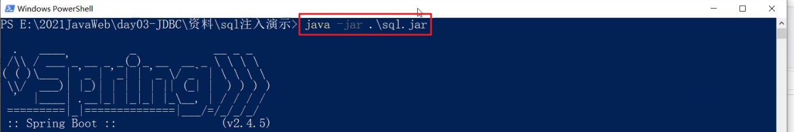 

此时我们就能在数据库中看到user表

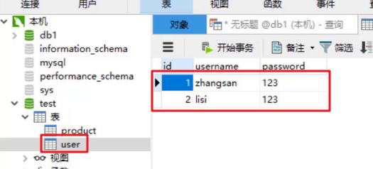

接下来在浏览器的地址栏输入 `localhost:8080/login.html` 就能看到如下页面

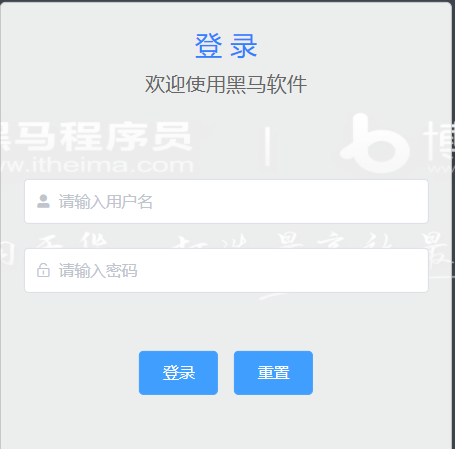

我们就可以在如上图中输入用户名和密码进行登陆。用户名和密码输入正确就登陆成功，跳转到首页。用户名和密码输入错误则给出错误提示，如下图

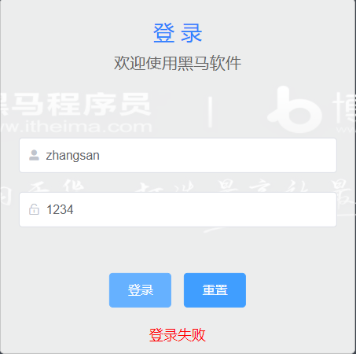

但是我可以通过输入一些特殊的字符登陆到首页。

用户名随意写，密码写成 `' or '1' ='1`

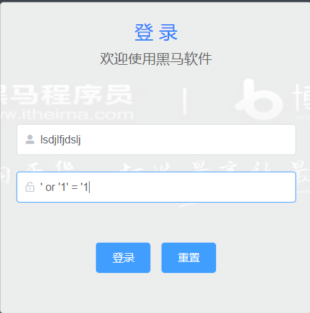

这就是SQL注入漏洞，也是很危险的。当然现在市面上的系统都不会存在这种问题了，所以大家也不要尝试用这种方式去试其他的系统。


**解决办法：将SQL执行对象 `Statement` 换成 `PreparedStatement` 对象。**

我们先在IDEA里面模拟实现一下上面这个案例的后端情况：

```sql
@Test
public void testLogin() throws  Exception {
    //2. 获取连接：如果连接的是本机mysql并且端口是默认的 3306 可以简化书写
    String url = "jdbc:mysql:///db1?useSSL=false";
    String username = "root";
    String password = "1234";
    Connection conn = DriverManager.getConnection(url, username, password);

    // 接收用户输入 用户名和密码
    String name = "sjdljfld";
    String pwd = "' or '1' = '1";
    String sql = "select * from tb_user where username = '"+name+"' and password = '"+pwd+"'";
    // 获取stmt对象
    Statement stmt = conn.createStatement();
    // 执行sql
    ResultSet rs = stmt.executeQuery(sql);
    // 判断登录是否成功
    if(rs.next()){
        System.out.println("登录成功~");
    }else{
        System.out.println("登录失败~");
    }

    //7. 释放资源
    rs.close();
    stmt.close();
    conn.close();
}
```

上面代码是将用户名和密码拼接到sql语句中，拼接后的sql语句如下:

```sql
select * from tb_user where username = 'sjdljfld' and password = ''or '1' = '1'
```

可见，不管条件 `username = 'sjdljfld' and password = ''` 怎么样，最后得到的结果都是 true。下面我们学习PreparedStatement对象的使用。


#### 3.4.2 快速入门

> PreparedStatement作用：
>
> * 预编译SQL语句并执行：预防SQL注入问题

**第一步：**获取 PreparedStatement 对象

```java
// SQL语句中的参数值，使用？占位符替代
String sql = "select * from user where username = ? and password = ?";
// 通过Connection对象获取，并传入对应的sql语句
PreparedStatement pstmt = conn.prepareStatement(sql);
```

其实，从上面的案例中，我们可以知道，出现sql注入的原因就在于拼字符串那里，别人使用一些特殊字符输入后，在后端的效果就变成了，永远的true。所以说，我们直接把拼字符串的操作去掉了，用❓作为占位符，后面得到了PreparedStatement对象后，再对❓的数据进行补充。还有一点注意：Connection接口的获取PreparedStatement的方法，是有参构造器，前面的Statement是无参的。

**第二步：**设置参数值

这里是对前面的❓占位符进行填充数据。PreparedStatement接口提供了方法。

> **setXxx(参数1，参数2)**：给 ? 赋值
>
> * Xxx：数据类型 ； 如 setInt (参数1，参数2)
>
> * 参数：
>
>   * 参数1： ？的位置编号，从1 开始
>
>   * 参数2： ？处被填充的数据

**第三步：**执行SQL语句

同Statement接口，一模一样的方法。

> **executeUpdate()**：执行DDL语句和DML语句
>
> **executeQuery()：** 执行DQL语句
>
> ==注意：==
>
> * 调用这两个方法时不需要传递SQL语句，因为获取SQL语句执行对象时已经对SQL语句进行预编译了。

#### 3.4.3 改进案例

把前面登录的bug修复

```java
 @Test
public void testPreparedStatement() throws  Exception {
    //2. 获取连接：如果连接的是本机mysql并且端口是默认的 3306 可以简化书写
    String url = "jdbc:mysql:///db1?useSSL=false";
    String username = "root";
    String password = "1234";
    Connection conn = DriverManager.getConnection(url, username, password);

    // 接收用户输入 用户名和密码
    String name = "zhangsan";
    String pwd = " ' ' or '1' = '1' ";

    // 定义sql
    String sql = "select * from tb_user where username = ? and password = ? ";
    // 获取pstmt对象
    PreparedStatement pstmt = conn.prepareStatement(sql);
    // 设置？的值
    pstmt.setString(1,name);
    pstmt.setString(2,pwd);
    // 执行sql
    ResultSet rs = pstmt.executeQuery();
    // 判断登录是否成功
    if(rs.next()){
        System.out.println("登录成功~");
    }else{
        System.out.println("登录失败~");
    }
    //7. 释放资源
    rs.close();
    pstmt.close();
    conn.close();
}
```

执行上面语句就可以发现不会出现SQL注入漏洞问题了。那么PreparedStatement又是如何解决的呢？它是将特殊字符进行了转义，转义的SQL如下：

用户名随意写，密码写成 `' or '1' ='1`

```java
select * from tb_user where username = 'sjdljfld' and password = '\' or \'1\' = \'1'
```

#### 3.4.4 执行原理

> PreparedStatement 好处：
>
> * ==预编译SQL==，性能更高（默认未开启）
> * 防止SQL注入：==将敏感字符进行转义==

我们先来看看Java来操作数据库的细节流程，再来讲他是如何做到上面两个优点的。

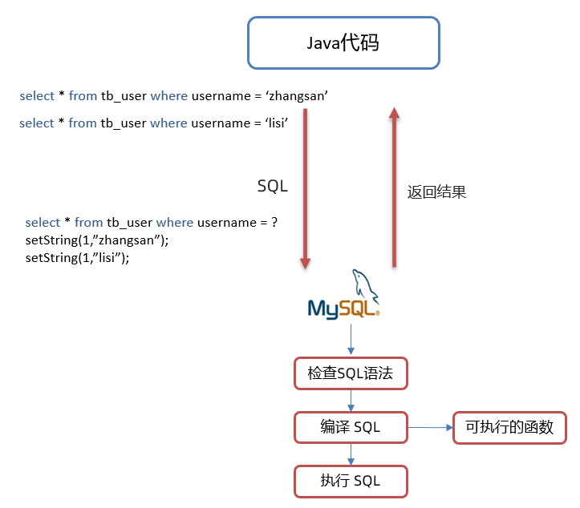

Java代码操作数据库的步骤：

1. **将sql语句发送到MySQL服务器端**

2. MySQL服务端会对sql语句进行如下操作：

   * **检查SQL语句**

     检查SQL语句的语法是否正确。

   * **编译SQL语句**。将SQL语句编译成可执行的函数。

     检查SQL和编译SQL花费的时间比执行SQL的时间还要长。如果我们只是重新设置参数，那么检查SQL语句和编译SQL语句将不需要重复执行。这样就提高了性能。

   * **执行SQL语句**

==预编译SQL==

注意：当我们通过Connection对象获取到执行对象时，现在就已经把SQL语句发送到了MySQL服务器，它就马上开始了检查与编译，当我们开始调用executeQuery（）这两个方法的时候，就只会进行执行SQL操作。

例如上图中的顶部的两条SQL语句，在我们每次执行的时候，都会每次进行检查、编译、执行这三步；而下面采用PreparedStatement的写法，只有第一次会进行检查、编译，后面重复运行executeQuery（）方法的时候，就只直接进行执行，因为它的语法形式是没有变动的撒。意思是假如我后面进行两次登录（两次的rs = pstmt.executeQuery();），在Mysql只会进行预编译一次。后面的这两次执行就会跑的很快。

**接下来我们通过查询日志来看一下原理。**

这么好的功能，竟然默认不开启，牛的。

1. **开启预编译功能**

在代码中编写url时需要加上以下参数。而我们之前根本就没有开启预编译功能，只是解决了SQL注入漏洞。

```java
String url = "jdbc:mysql:///test?useSSL=false&useServerPreStms=true";
```

2. **配置MySQL执行日志（重启mysql服务后生效）**

   放在mysqld配置下面哦

```java
log-output=FILE
general-log=1
general_log_file="D:\mysql.log"
slow-query-log=1
slow_query_log_file="D:\mysql_slow.log"
long_query_time=2
```

3. **测试代码，同前面的**，加了一次登录情况和睡眠情况

```java
 /**
   * PreparedStatement原理
   * @throws Exception
   */
@Test
public void testPreparedStatement2() throws  Exception {

    //2. 获取连接：如果连接的是本机mysql并且端口是默认的 3306 可以简化书写
    // useServerPrepStmts=true 参数开启预编译功能
    String url = "jdbc:mysql:///db1?useSSL=false&useServerPrepStmts=true";
    String username = "root";
    String password = "1234";
    Connection conn = DriverManager.getConnection(url, username, password);

    // 接收用户输入 用户名和密码
    String name = "zhangsan";
    String pwd = "' or '1' = '1";

    // 定义sql
    String sql = "select * from tb_user where username = ? and password = ?";

    // 获取pstmt对象
    PreparedStatement pstmt = conn.prepareStatement(sql);

    Thread.sleep(10000);
    // 设置？的值
    pstmt.setString(1,name);
    pstmt.setString(2,pwd);
    ResultSet rs = null;
    // 执行sql
    rs = pstmt.executeQuery();

    // 设置？的值
    pstmt.setString(1,"aaa");
    pstmt.setString(2,"bbb");
    // 执行sql
    rs = pstmt.executeQuery();

    // 判断登录是否成功
    if(rs.next()){
        System.out.println("登录成功~");
    }else{
        System.out.println("登录失败~");
    }

    //7. 释放资源
    rs.close();
    pstmt.close();
    conn.close();
}
```

执行SQL语句，查看 `D:\mysql.log` 日志如下:

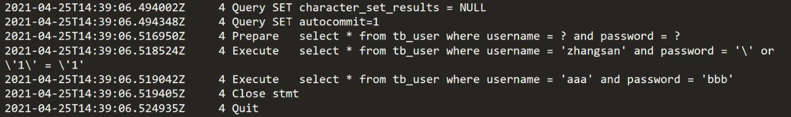

上图中第三行中的 `Prepare` 是对SQL语句进行预编译。第四行和第五行是执行了两次SQL语句，而第二次执行前并没有对SQL进行预编译。

==小结：==

* 在获取PreparedStatement对象时，将sql语句发送给mysql服务器进行检查，编译（这些步骤很耗时）
* 执行时就不用再进行这些步骤了，速度更快
* 如果sql模板一样，则只需要进行一次检查、编译


# 2、B/S架构

B/S 架构：Browser/Server，浏览器/服务器 架构模式，它的特点是，客户端只需要浏览器，应用程序的逻辑和数据都存储在服务器端。

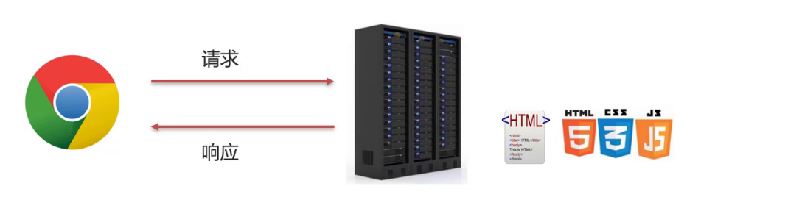

- 所以说B/S架构的好处:易于维护升级：服务器端升级后，客户端无需任何部署就可以使用到新的版本。

# 3、HTTP协议

## 3.1 简介

* HTTP协议:HyperText Transfer Protocol，==超文本传输协议，规定了浏览器和服务器之间数据传输的规则==。
* 浏览器发送请求给服务器，服务器响应数据给浏览器，这整个过程都需要遵守一定的规则，之前大家学习过TCP、UDP，这些都属于规则，这里我们需要使用的是HTTP协议，这也是一种规则。
* 数据传输的规则指的是**请求数据**和**响应数据需要按照指定的格式进行传输。**

==所以学习HTTP主要就是学习请求和响应数据的具体格式内容。==

HTTP协议有它自己的一些特点，分别是:

* ==基于TCP协议: 面向连接，安全==

  TCP是一种面向连接的(建立连接之前是需要经过三次握手)、可靠的、基于字节流的传输层通信协议，在数据传输方面更安全。

* ==基于请求-响应模型的:一次请求对应一次响应==

  请求和响应是一一对应关系

* ==HTTP协议是无状态协议:  对于事物处理没有记忆能力。每次请求-响应都是独立的==

  **无状态**指的是客户端发送HTTP请求给服务端之后，服务端根据请求响应数据，响应完后，不会记录任何信息。这种特性有优点也有缺点，

  * 缺点:多次请求间不能共享数据
  * 优点:速度快

  请求之间无法共享数据会引发的问题，如:

  * 京东购物，`加入购物车`和`去购物车结算`是两次请求，
  * HTTP协议的无状态特性，加入购物车请求响应结束后，并未记录加入购物车是何商品
  * 发起去购物车结算的请求后，因为无法获取哪些商品加入了购物车，会导致此次请求无法正确展示数据

  具体使用的时候，我们发现京东是可以正常展示数据的，原因是Java早已考虑到这个问题，并提出了使用`会话技术(Cookie、Session)`来解决这个问题。
  
  

### 2.2 请求数据格式


请求数据总共分为三部分内容，分别是==请求行==、==请求头==、==请求体==

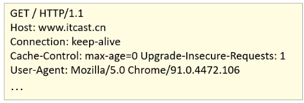

* **请求行**: HTTP请求中的第一行数据，请求行包含三块内容，分别是 GET[请求方式]	 /[请求URL路径] HTTP/1.1[HTTP协议及版本]

  ==请求方式有七种,最常用的是GET和POST==

* **请求头**: 第二行开始，格式为key: value形 式

  请求头中会包含若干个属性，常见的HTTP请求头有:

  ```
  Host: 表示请求的主机名
  User-Agent: 浏览器版本,例如Chrome浏览器的标识类似Mozilla/5.0 ...Chrome/79，IE浏览器的标识类似Mozilla/5.0 (Windows NT ...)like Gecko；
  Accept：表示浏览器能接收的资源类型，如text/*，image/*或者*/*表示所有；
  Accept-Language：表示浏览器偏好的语言，服务器可以据此返回不同语言的网页；
  Accept-Encoding：表示浏览器可以支持的压缩类型，例如gzip, deflate等。
  ```

   ==这些数据有什么用处?==

  举例说明:服务端可以根据请求头中的内容来获取客户端的相关信息，有了这些信息服务端就可以处理不同的业务需求，比如:

  * 不同浏览器解析HTML和CSS标签的结果会有不一致，所以就会导致相同的代码在不同的浏览器会出现不同的效果
  * 服务端根据客户端请求头中的数据获取到客户端的浏览器类型，就可以根据不同的浏览器设置不同的代码来达到一致的效果
  * 这就是我们常说的浏览器兼容问题

* **请求体:** POST请求的最后一部分，存储请求参数

  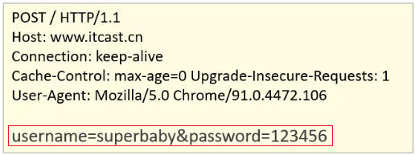

  如上图红线框的内容就是请求体的内容，请求体和请求头之间是有一个空行隔开。

  

##### GET请求


- 只有==请求头和请求行==，请求的参数放在请求行里面。而且GET请求参数大小有限制
- ==我们浏览器直接访问网址（URL）就是GET请求==。不需要后端其他的操作，仅仅通过浏览器就可以！


##### POST请求


- 请求头+请求行+请求体

- 请求体放请求参数，并且请求参数无限制。
- ==但是注意到，虽然请求体可以放参数，但现在我们请求行依旧可以放请求参数==
- 要想发送一个POST请求，请求该Servlet，单单通过浏览器是无法实现的，这个时候就需要编写一个form表单来发送请求，在webapp下创建一个`a.html`页面


### 2.3 响应数据格式


响应数据总共分为三部分内容，分别是==响应行==、==响应头==、==响应体==

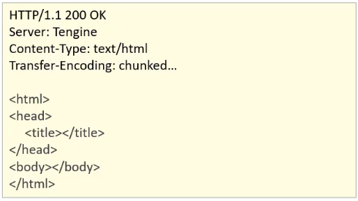

* **响应行**：响应数据的第一行,响应行包含三块内容，分别是 

  ​		`HTTP/1.1[HTTP协议及版本]`   `200[响应状态码]`  `ok[状态码的描述]`

* **响应头**：第二行开始，格式为key：value形式

  响应头中会包含若干个属性，常见的HTTP响应头有:

  ```
  Content-Type：表示该响应内容的类型，例如text/html，image/jpeg；
  Content-Length：表示该响应内容的长度（字节数）；
  Content-Encoding：表示该响应压缩算法，例如gzip；
  Cache-Control：指示客户端应如何缓存，例如max-age=300表示可以最多缓存300秒
  ```

* **响应体：** 最后一部分。存放响应数据

  上图中<html>...</html>这部分内容就是响应体，它和响应头之间有一个空行隔开。

  

#### 2.3.2 响应状态码

参考: 响应状态码.md

关于响应状态码，我们先主要认识三个状态码，其余的等后期用到了再去掌握:

* ==200==  ok 客户端请求成功
* ==404==  Not Found 请求资源不存在
* ==500== Internal Server Error 服务端发生不可预期的错误


# 4、什么是Web服务器

==Web服务器是一个应用程序（==软件==），对HTTP协议进行解析封装，==使得程序员不必直接对协议进行操作，让Web开发更加便捷。主要功能是"提供网上信息浏览服务"。

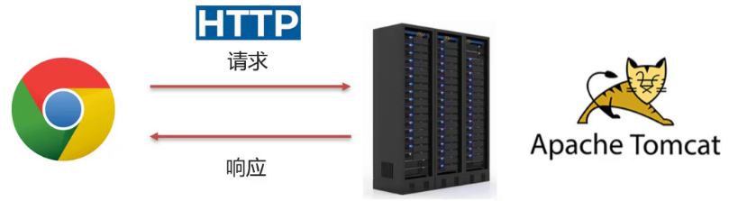

 Web服务器是安装在服务器端的一款软件，将来我们把自己写的Web项目部署到Web Tomcat服务器软件中，当Web服务器软件启动后，部署在Web服务器软件中的页面就可以直接通过浏览器来访问了。

**Web服务器软件使用步骤**

* 准备静态资源
* 下载安装Web服务器软件
* 将静态资源部署到Web服务器上
* 启动Web服务器使用浏览器访问对应的资源

Tomcat是Apache软件基金会一个核心项目，是一个开源免费的轻量级Web服务器，支持Servlet/JSP少量JavaEE规范。

**JavaEE:  Java Enterprise Edition,Java企业版。**指Java企业级开发的技术规范总和。包含13项技术规范:JDBC、JNDI、EJB、RMI、JSP、Servlet、XML、JMS、Java IDL、JTS、JTA、JavaMail、JAF。


# 5. MVC模式和三层架构

MVC 模式和三层架构是一些理论的知识，将来我们使用了它们进行代码开发会让我们代码维护性和扩展性更好。

## 1.1 MVC模式

MVC 是一种分层开发的模式，其中：

* M：Model，业务模型，处理业务

* V：View，视图，界面展示

* C：Controller，控制器，处理请求，调用模型和视图

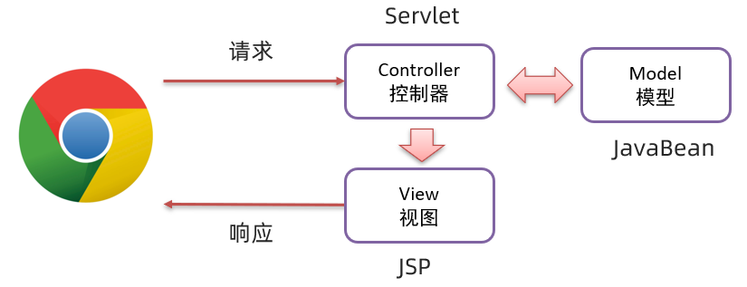

控制器（serlvlet）用来接收浏览器发送过来的请求，控制器调用模型（JavaBean）来获取数据，比如从数据库查询数据；控制器获取到数据后再交由视图（JSP）进行数据展示。

**MVC 好处：**

* 职责单一，互不影响。每个角色做它自己的事，各司其职。

* 有利于分工协作。

* 有利于组件重用

## 1.2 三层架构

MVC只是一种模式，宏观的概念而言，告诉我们要将各个部分分开，解耦！！！三层架构是实现MVC模式的一个具体方案

三层架构是将我们的项目分成了三个层面，分别是 `表现层`、`业务逻辑层`、`数据访问层`。

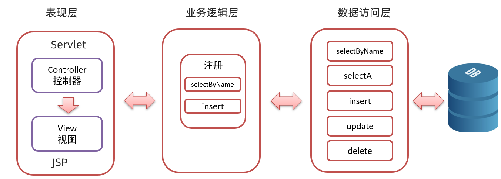

* 数据访问层：对数据库的CRUD基本操作
* 业务逻辑层：对业务逻辑进行封装，组合数据访问层层中基本功能，形成复杂的业务逻辑功能。例如 `注册业务功能` ，我们会先调用 `数据访问层` 的 `selectByName()` 方法判断该用户名是否存在，如果不存在再调用 `数据访问层` 的 `insert()` 方法进行数据的添加操作
* 表现层：接收解析请求，封装数据对象，调用业务逻辑层，响应数据

而整个流程是，浏览器发送请求，表现层的Servlet接收请求并调用业务逻辑层的方法进行业务逻辑处理，而业务逻辑层方法调用数据访问层方法进行数据的操作，依次返回到serlvet，然后servlet将数据交由 JSP 进行展示。

三层架构的每一层都有特有的包名称：

* 表现层： `com.itheima.controller` 或者 `com.itheima.web`
* 业务逻辑层：`com.itheima.service`
* 数据访问层：`com.itheima.dao` 或者 `com.itheima.mapper`

后期我们还会学习一些框架，不同的框架是对不同层进行封装的

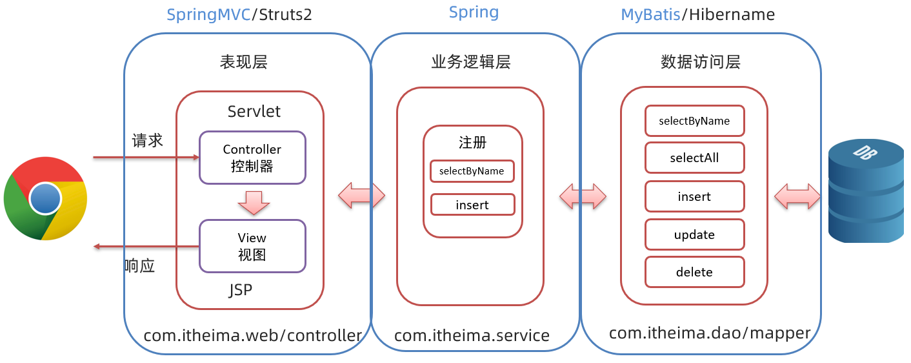

## 1.3 MVC 和 三层架构

通过 MVC 和 三层架构 的学习，有些人肯定混淆了。那他们有什么区别和联系？

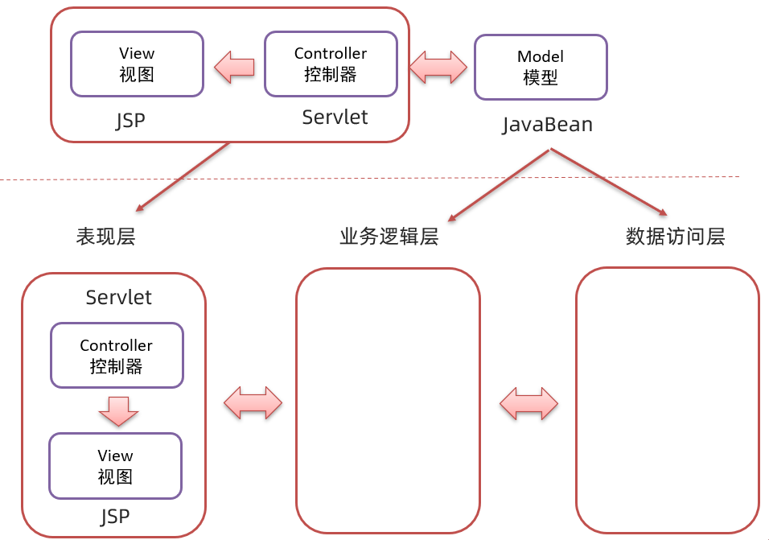

如上图上半部分是 MVC 模式，上图下半部分是三层架构。 `MVC 模式` 中的 C（控制器）和 V（视图）就是 `三层架构` 中的表现层，而 `MVC 模式` 中的 M（模型）就是 `三层架构` 中的 业务逻辑层 和 数据访问层。

可以将 `MVC 模式` 理解成是一个大的概念，而 `三层架构` 是对 `MVC 模式` 实现架构的思想。 那么我们以后按照要求将不同层的代码写在不同的包下，每一层里功能职责做到单一，将来如果将表现层的技术换掉，而业务逻辑层和数据访问层的代码不需要发生变化。


# 6、会话技术

## 视频

[01-会话跟踪技术概述_哔哩哔哩_bilibili](https://www.bilibili.com/video/BV1Qf4y1T7Hx?p=123&vd_source=3bb8a0b0cedc98aabfd7778729a81d51)

## 1.会话跟踪技术的概述

对于==会话跟踪==这四个词，我们需要拆开来进行解释，首先要理解==什么是会话==，然后再去理解 ==什么是会话跟踪:==

* **会话:  用户打开浏览器，发起第一次请求访问web服务器的资源，会话开始建立，直到有一方断开连接，会话结束，这是一次会话。**

  然后在这一次会话中可以包含==多次请求和响应==，后面的请求就不会再建立会话了。

  * 从浏览器发出请求到服务端响应数据给前端之后，一次会话 (在浏览器和服务器之间) 就被建立了
  * 会话被建立后，如果浏览器或服务端都没有被关闭，则会话就会持续建立着
  * 浏览器和服务器就可以继续使用该会话进行请求发送和响应，==上述的整个过程就被称之为会话==。

  用实际场景来理解下会话，比如在我们访问京东的时候，当打开浏览器进入京东首页后，浏览器和京东的服务器之间就建立了一次会话，后面的搜索商品,查看商品的详情,加入购物车等都是在这一次会话中完成。

  思考:下图中总共建立了几个会话?

  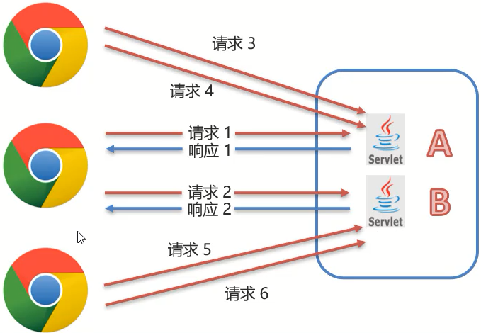

  每个浏览器都会与服务端建立了一个会话，加起来总共是==3==个会话。

  

* **会话跟踪:**  ==一种维护浏览器状态的方法，服务器需要识别多次请求是否来自于同一浏览器，以便同一次会话的多次请求间共享数据==。（这个十分重要哦，因为我们的**HTTP是无状态协议**，所以它无法共享数据，这就会引起很多麻烦）

  * 服务器会收到多个请求，这多个请求可能来自多个浏览器，如上图中的6个请求来自3个浏览器
  * 服务器需要用来识别请求是否来自同一个浏览器
  * 服务器用来识别浏览器的过程，这个过程就是==会话跟踪==
  * 服务器识别浏览器后就可以在同一个会话中多次请求之间来共享数据

  

那么我们又有一个问题需要思考，**一个会话中的多次请求为什么要共享数据呢**?有了这个数据共享功能后能实现哪些功能呢?

* **网站登录页面的记住我功能**：当用户登录成功后，勾选记住我按钮后下次再登录的时候，网站就会自动填充用户名和密码，简化用户的登录操作，多次登录就会有多次请求，他们之间也涉及到共享数据

  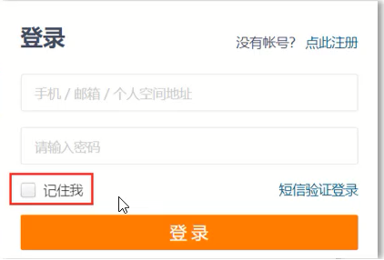

* **登录页面的验证码功能：**生成验证码和输入验证码点击注册这也是两次请求，这两次请求的数据之间要进行对比，相同则允许注册，不同则拒绝注册，该功能的实现也需要在同一次会话中共享数据。

  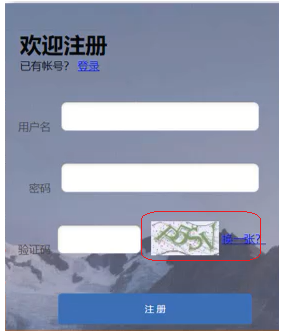

上面这几个例子很好诠释了会话追踪技术的作用，该技术在实际开发中也非常重要。

**那为什么现在浏览器和服务器不支持数据共享呢?**

* 浏览器和服务器之间使用的是==HTTP请求==来进行数据传输
* ==HTTP协议是无状态的，每次浏览器向服务器请求时，服务器都会将该请求视为新的请求==
* HTTP协议设计成无状态的目的是让每次请求之间相互独立，互不影响

实现会话跟踪技术的具体实现方式有:

(1)	客户端会话跟踪技术：==Cookie（客户端）==

(2)	服务端会话跟踪技术：==Session（服务端）==


## 2.Cookie


### 2.1 Cookie的基本使用

**1.概念**

Cookie：客户端会话技术，==将数据保存到客户端== ，以后==每次请求==都携带Cookie数据进行访问。

**2.Cookie的工作流程**

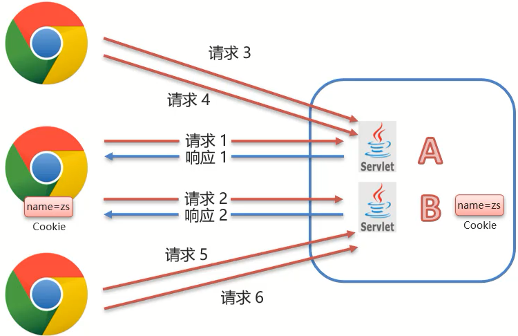

* 服务端提供了两个Servlet，分别是ServletA和ServletB
* 浏览器发送HTTP请求1给服务端，服务端ServletA接收请求并进行业务处理
* 服务端**ServletA**在处理的过程中可以创建一个Cookie对象并将`name=zs`的数据存入Cookie
* 服务端**ServletA**在响应数据的时候，会把Cookie对象响应给浏览器
* ==浏览器接收到响应数据，会把Cookie对象中的数据存储在浏览器内存中，此时浏览器和服务端就建立了一次会话==
* ==在同一次会话==中浏览器再次发送HTTP请求2给服务端**ServletB**，==浏览器会携带Cookie对象中的所有数据==
* **ServletB**接收到请求和数据后，就可以获取到存储在Cookie对象中的数据，这样同一个会话中的多次请求之间就实现了数据共享


**3.Cookie的基本使用**

对于Cookie的使用，我们更关注的应该是后台代码如何操作Cookie，对于Cookie的操作主要分两大类，本别是==发送Cookie==和==获取Cookie==,对于上面这两块内容，分别该如何实现呢?

**3.1 发送Cookie**

* 创建Cookie对象，并设置数据

```java
Cookie cookie = new Cookie("key","value");
```

* 发送Cookie到客户端：使用==response==对象

```java
response.addCookie(cookie);
```

**chrome浏览器查看Cookie的值，有两种方式**

方式一:

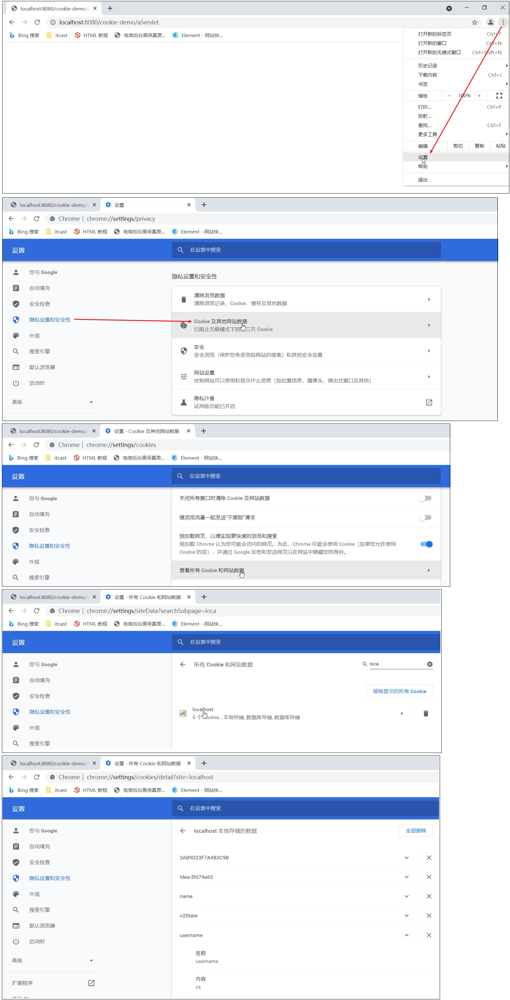

**方式二:选中打开开发者工具或**者 使用快捷键F12 或者 Ctrl+Shift+I

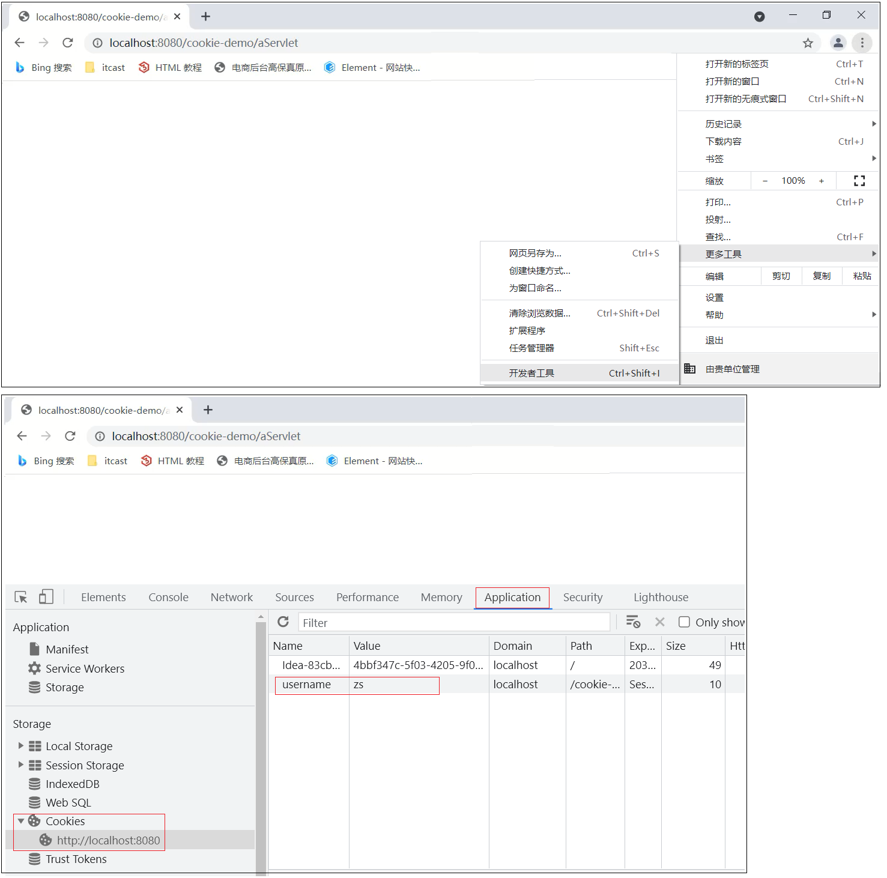

**3.2 获取Cookie**

- 获取客户端携带的所有Cookie，使用request对象

```java
Cookie[] cookies = request.getCookies();
```

- 遍历数组，获取每一个Cookie对象：for
- 使用Cookie对象方法获取数据

```java
cookie.getName();
cookie.getValue();
```


### 2.2 Cookie的原理分析

对于Cookie的实现原理是==基于HTTP协议的==,其中设计到==HTTP协议中的两个请求头信息:==

* 响应头: set-cookie
* 请求头: cookie

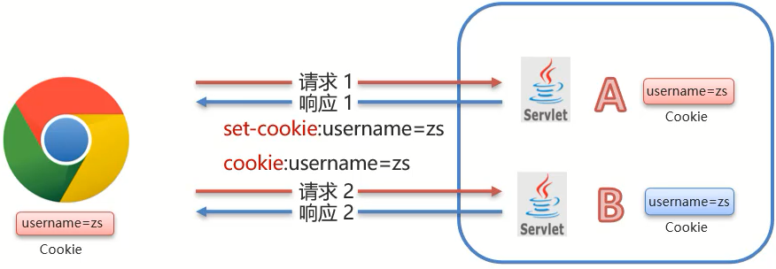

* AServlet给前端发送Cookie,  BServlet从request中获取Cookie的功能
* 对于AServlet响应数据的时候，Tomcat服务器都是基于HTTP协议来响应数据
* 当Tomcat发现后端要返回的是一个Cookie对象之后，Tomcat就会在响应头中添加一行数据==`Set-Cookie:username=zs`==
* 浏览器获取到响应结果后，从响应头中就可以获取到`Set-Cookie`对应值`username=zs`,并将数据存储在浏览器的内存中。
* 浏览器再次发送请求给BServlet的时候，浏览器会自动在请求头中添加==`Cookie: username=zs`==发送给服务端BServlet
* Request对象会把请求头中cookie对应的值封装成一个个Cookie对象，最终形成一个数组
* BServlet通过Request对象获取到Cookie[ ]后，就可以从中获取自己需要的数据

**接下来，使用刚才的案例，把上述结论验证下:**

(1)访问AServlet对应的地址`http://localhost:8080/cookie-demo/aServlet`

使用Chrom浏览器打开开发者工具(F12或Crtl+Shift+I)进行查看==响应头==中的数据

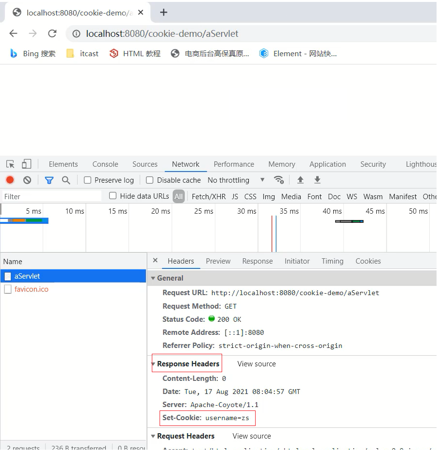

（2）访问BServlet对应的地址`http://localhost:8080/cookie-demo/bServlet

使用Chrom浏览器打开开发者工具(F12或Crtl+Shift+I)进行查看==请求头==中的数据

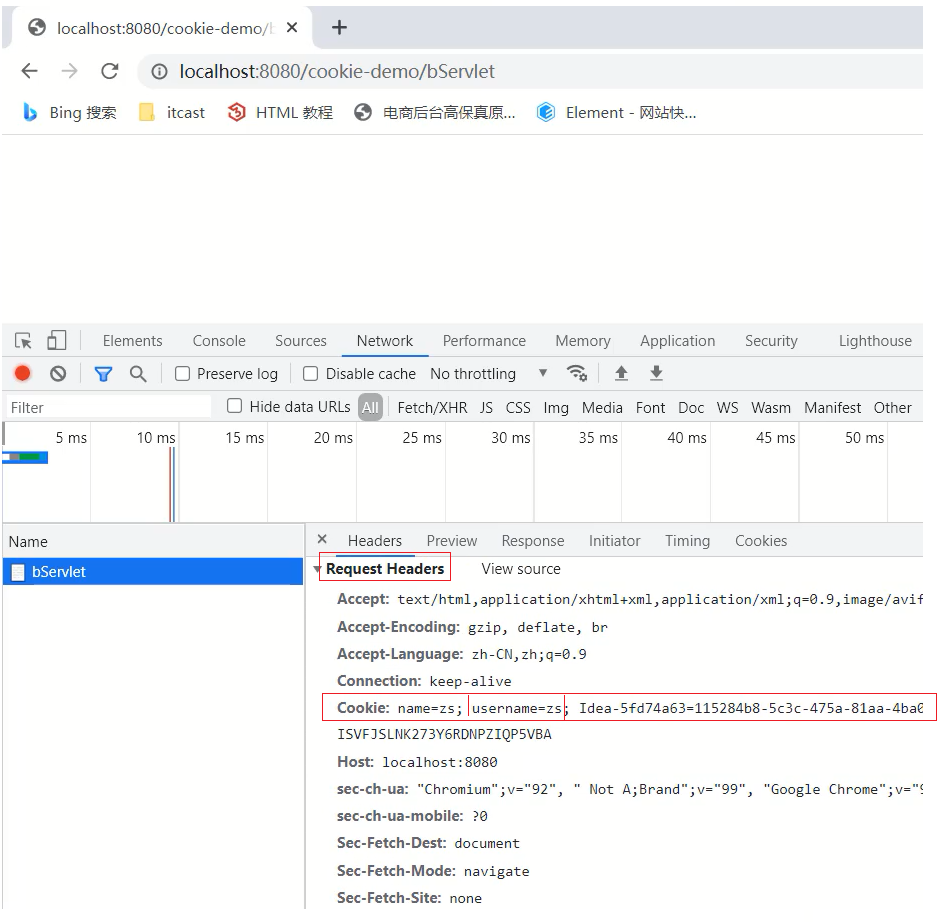


### 2.3.1 Cookie的存活时间

前面让大家思考过一个问题:

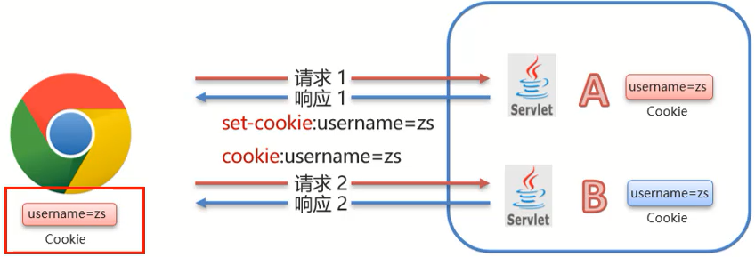

在发送请求到BServlet之前，如果把浏览器关闭再打开进行访问，BServlet能否获取到Cookie数据?

==注意：浏览器关闭再打开不是指打开一个新的选显卡，而且必须是先关闭再打开，顺序不能变。==

针对上面这个问题，通过演示，会发现，BServlet中无法再获取到Cookie数据，这是为什么呢?

* ==默认情况下，Cookie存储在浏览器内存中，当浏览器关闭，内存释放，则Cookie被销毁==

这个结论就印证了上面的演示效果，但是如果使用这种默认情况下的Cookie,有些需求就无法实现，比如:

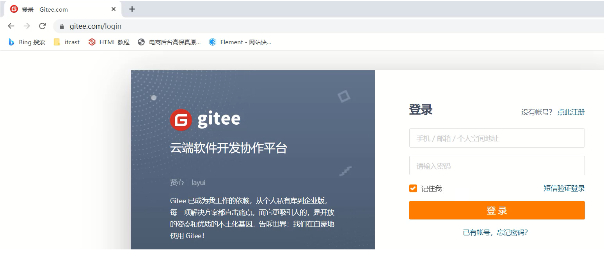

上面这个网站的登录页面上有一个`记住我`的功能，这个功能大家都比较熟悉

* 第一次输入用户名和密码并勾选`记住我`然后进行登录
* 下次再登陆的时候，用户名和密码就会被自动填充，不需要再重新输入登录
* 比如`记住我`这个功能需要记住用户名和密码一个星期，那么使用默认情况下的Cookie就会出现问题
* 因为默认情况，浏览器一关，Cookie就会从浏览器内存中删除，对于`记住我`功能就无法实现

 ==如何将Cookie持久化存储?==

**Cookie其实已经为我们提供好了对应的API来完成这件事，这个API就是==setMaxAge==,**

* 设置Cookie存活时间

```java
setMaxAge(int seconds)
```

参数值为:

1.正数：将Cookie写入浏览器所在电脑的硬盘，持久化存储。到时间自动删除

2.负数：默认值，Cookie在当前浏览器内存中，当浏览器关闭，则Cookie被销毁

3.零：删除对应Cookie


## 3. Session


### 3.1 Session的基本使用

**1.概念**

==Session：服务端会话跟踪技术：将数据保存到服务端。==

* Session是存储在服务端而Cookie是存储在客户端
* 存储在客户端的数据容易被窃取和截获，存在很多不安全的因素
* 存储在服务端的数据**相比于客户端来说就更安全**

**2.Session的工作流程**

 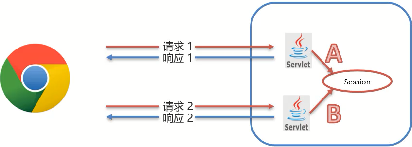

* 在服务端的AServlet获取一个Session对象，把数据存入其中
* 在服务端的BServlet获取到相同的Session对象，从中取出数据
* 就可以实现一次会话中多次请求之间的数据共享了
* **现在最大的问题是如何保证AServlet和BServlet使用的是同一个Session对象(在原理分析会讲解)?**


**3.Session的基本使用**

==在JavaEE中提供了HttpSession接口，来实现一次会话的多次请求之间数据共享功能。==

具体的使用步骤为:

* 获取Session对象, 使用的是request对象

```java
HttpSession session = request.getSession();
```

* Session对象提供的功能:

  * 存储数据到 session 域中,键值对

    ```java
    void setAttribute(String name, Object o)
    ```

  * 根据 key，获取值

    ```java
    Object getAttribute(String name)
    ```

  * 根据 key，删除该键值对

    ```java
    void removeAttribute(String name)
    ```

介绍完Session相关的API后，接下来通过一个案例来完成对Session的使用，具体实现步骤为:

> 需求:在一个Servlet中往Session中存入数据，在另一个Servlet中获取Session中存入的数据
>
> 1.创建名为SessionDemo1的Servlet类
>
> 2.创建名为SessionDemo2的Servlet类
>
> 3.在SessionDemo1的方法中:获取Session对象、存储数据
>
> 4.在SessionDemo2的方法中:获取Session对象、获取数据
>
> 5.启动测试

(1) SessionDemo1:  获取Session对象、存储数据

```java
@WebServlet("/demo1")
public class SessionDemo1 extends HttpServlet {
    @Override
    protected void doGet(HttpServletRequest request, HttpServletResponse response) throws ServletException, IOException {
    	//存储到Session中
        //1. 获取Session对象
        HttpSession session = request.getSession();
        //2. 存储数据
        session.setAttribute("username","zs");
    }

    @Override
    protected void doPost(HttpServletRequest request, HttpServletResponse response) throws ServletException, IOException {
        this.doGet(request, response);
    }
}
```

(4)SessionDemo2:获取Session对象、获取数据

```java
@WebServlet("/demo2")
public class SessionDemo2 extends HttpServlet {
    @Override
    protected void doGet(HttpServletRequest request, HttpServletResponse response) throws ServletException, IOException {
        //获取数据，从session中
        //1. 获取Session对象
        HttpSession session = request.getSession();
        //2. 获取数据
        Object username = session.getAttribute("username");
        System.out.println(username);
    }

    @Override
    protected void doPost(HttpServletRequest request, HttpServletResponse response) throws ServletException, IOException {
        this.doGet(request, response);
    }
}
```

(5)启动测试，

* 先访问`http://localhost:8080/cookie-demo/demo1`,将数据存入Session
* 在访问`http://localhost:8080/cookie-demo/demo2`,从Session中获取数据
* 查看控制台

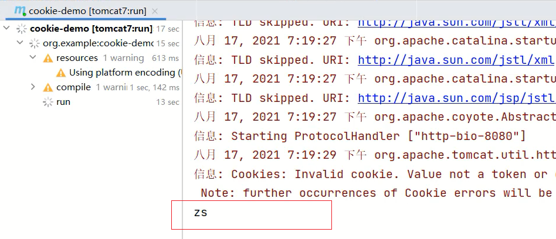

### 3.2 Session的原理分析

* ==Session是基于Cookie实现的==

这句话其实不太能详细的说明Session的底层实现，接下来，咱们一步步来分析下Session的具体实现原理:

* 前面案例中两个Servlet类中获取的Session对象是同一个，不相信可以自己打印一下。

  

==Session是如何保证在一次会话中获取的Session对象是同一个呢?==

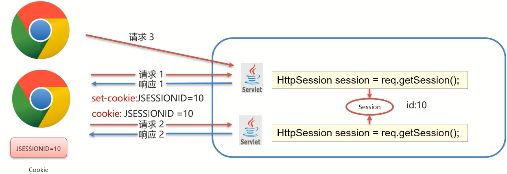

(1) demo1在第一次获取session对象的时候，session对象会有一个唯一的标识，假如是`id:10`

(2) demo1在session中存入其他数据并处理完成所有业务后，需要通过Tomcat服务器响应结果给浏览器

(3) Tomcat服务器发现业务处理中使用了session对象，就会把session的唯一标识`id:10`当做一个cookie，自动添加`Set-Cookie:JESSIONID=10`到响应头中，并响应给浏览器（**自动添加哦，Tomcat666）**

(4) ==浏览器接收到响应结果后，会把响应头中的coookie数据存储到浏览器的内存中==

(5) 浏览器在**同一会话**中访问demo2的时候，会把cookie中的数据按照`cookie: JESSIONID=10`的格式添加到请求头中并发送给服务器Tomcat

(6) demo2获取到请求后，从请求头中就读取**cookie中的 JSESSIONID** 值为10，然后就会到服务器内存中寻找`id:10`的session对象，如果找到了，就直接返回该对象，如果没有则新创建一个session对象

(7) 关闭打开浏览器后，因为浏览器的cookie已被销毁，所以就没有JESSIONID的数据，服务端获取到的session就是一个全新的session对象

至此，`Session是基于Cookie来实现的`这就话，我们就解释完了，接下来通过实例来演示下:

(1)使用chrome浏览器访问`http://localhost:8080/cookie-demo/demo1`,打开开发者模式(F12或Ctrl+Shift+I),查看==响应头(Response Headers)==数据:

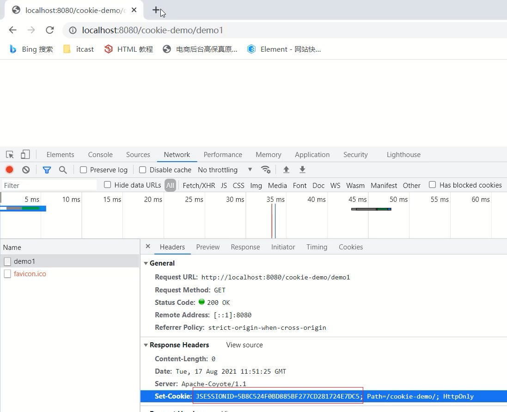

(2)使用chrome浏览器再次访问`http://localhost:8080/cookie-demo/demo2`，查看==请求头(Request Headers)==数据:

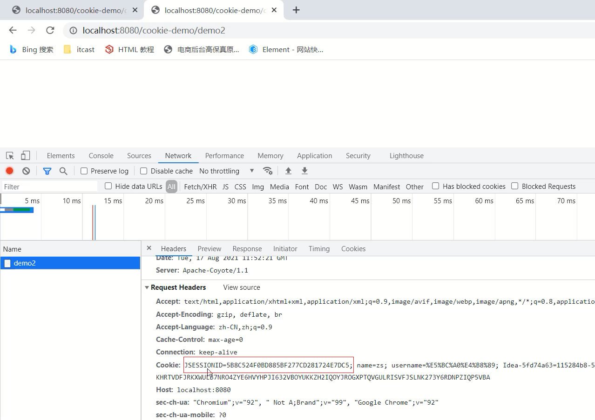


### 3.3 Session的使用细节

这节我们会主要讲解两个知识，第一个是Session的钝化和活化，第二个是Session的销毁，首先来学习什么是Session的钝化和活化？

#### 3.3.1 Session钝化与活化

首先需要大家思考的问题是: 

* **服务器重启后，Session中的数据是否还在?**
* 服务器端AServlet和BServlet共用的session对象应该是**存储在服务器的内存中**

所以说对于session的数据，要做持久化，服务器重启后应该在。

**分析了这么多，那么Tomcat服务器在重启的时候，session数据到底会不会保存以及是如何保存的**，


具体的原因就是 :**Session的钝化和活化:**

* 钝化：在服务器正常关闭后，Tomcat会自动将Session数据写入硬盘的文件中

  * 钝化的数据路径为:`项目目录\target\tomcat\work\Tomcat\localhost\项目名称\SESSIONS.ser`

    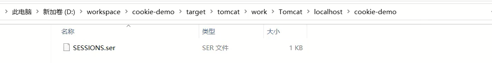

* 活化：再次启动服务器后，从文件中加载数据到Session中

  * 数据加载到Session中后，路径中的`SESSIONS.ser`文件会被删除掉


##### **小结**

Session的钝化和活化介绍完后，需要我们注意的是:

* session数据存储在服务端，服务器正常重启后，session数据会被保存
* 浏览器被关闭启动后，重新建立的连接就已经是一个全新的会话，获取的session数据也是一个新的对象
* session的数据要想共享，浏览器不能关闭，所以session数据不能长期保存数据
* cookie是存储在客户端，是可以长期保存


#### 3.3.2 Session销毁

session的销毁会有两种方式:

* 默认情况下，无操作，30分钟自动销毁

  * 对于这个失效时间，是可以通过配置进行修改的

    * 在项目的web.xml中配置

      ```xml
      <?xml version="1.0" encoding="UTF-8"?>
      <web-app xmlns="http://xmlns.jcp.org/xml/ns/javaee"
               xmlns:xsi="http://www.w3.org/2001/XMLSchema-instance"
               xsi:schemaLocation="http://xmlns.jcp.org/xml/ns/javaee http://xmlns.jcp.org/xml/ns/javaee/web-app_3_1.xsd"
               version="3.1">
      
          <session-config>
              <session-timeout>100</session-timeout>
          </session-config>
      </web-app> 	
      ```

* 调用Session对象的   invalidate()   进行销毁

  * 在SessionDemo2类中添加session销毁的方法

    ```java
    @WebServlet("/demo2")
    public class SessionDemo2 extends HttpServlet {
        @Override
        protected void doGet(HttpServletRequest request, HttpServletResponse response) throws ServletException, IOException {
            //获取数据，从session中
    
            //1. 获取Session对象
            HttpSession session = request.getSession();
            System.out.println(session);
    
            // 销毁
            session.invalidate();
            //2. 获取数据
            Object username = session.getAttribute("username");
            System.out.println(username);
        }
    
        @Override
        protected void doPost(HttpServletRequest request, HttpServletResponse response) throws ServletException, IOException {
            this.doGet(request, response);
        }
    }
    ```

  * 该销毁方法一般会在用户退出的时候，需要将session销毁掉。

### **Cookie和Session小结**

* Cookie 和 Session 都是来完成一次会话内多次请求间==数据共享==的。

所需两个对象放在一块，就需要思考:

Cookie和Session的区别是什么

Cookie和Session的应用场景分别是什么?

* 区别:

  * 存储位置：Cookie 是将数据存储在客户端，Session 将数据存储在服务端

  * 安全性：Cookie不安全，Session安全

  * 数据大小：Cookie最大3KB，Session无大小限制

  * 存储时间：Cookie默认情况下，浏览器关闭时销毁，但可以通过setMaxAge()进行长期存储，Session默认30分钟

  * 服务器性能：Cookie不占服务器资源，Session占用服务器资源

  * 浏览器关闭后，无法再获取上一次的的session对象，服务器正常重启，tomcat会自动存储session对象到硬盘中，之后依然可以获取已经存放的session对象。

* 应用场景:

  * 购物车: 使用Cookie来存储
  * 以登录用户的名称展示: 使用Session来存储
  * 记住我功能: 使用Cookie来存储
  * 验证码: 使用session来存储

  


# 7、Ajax

哇塞哇塞，正式步入前后端分离开发的大门了。从此以后，前端采用HTML+AJAX来实现，后端采用Servlet来实现。之前的JSP相对于都是后端的工作，真的很烦哦

## 3.1  概述

==`AJAX` (Asynchronous JavaScript And XML)：异步的 JavaScript 和 XML。==

我们先来说概念中的 `JavaScript` 和 `XML`，`JavaScript` 表明该技术和前端相关；`XML` 是指以此进行数据交换。而这两个我们之前都学习过。

#### 3.1.1  作用

AJAX 作用有以下两方面：

1. **与服务器进行数据交换**：通过AJAX可以给服务器发送请求，服务器将数据直接响应回给浏览器。

我们先来看之前做功能的流程，如下图：

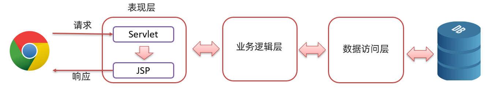

如上图，`Servlet` 调用完业务逻辑层后将数据存储到域对象中，然后跳转到指定的 `jsp` 页面，在页面上使用 `EL表达式` 和 `JSTL` 标签库进行数据的展示。这相对于前后端都是Java程序员再写，很烦。

而我们学习了AJAX 后，就可以==使用AJAX和服务器进行通信，以达到使用 HTML+AJAX来替换JSP页面==。即前端采用HTML+AJAX来实现，后端采用Servlet来实现。

如下图，浏览器发送请求servlet，servlet 调用完业务逻辑层后将数据直接响应回给浏览器页面，页面使用 HTML 来进行数据展示。

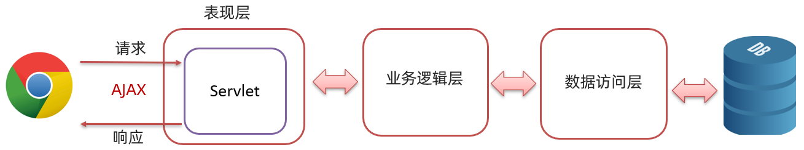

2. **异步交互**：可以在==不重新加载整个页面==的情况下，与服务器交换数据并==更新部分网页==的技术，如：搜索联想、用户名是否可用校验，等等…

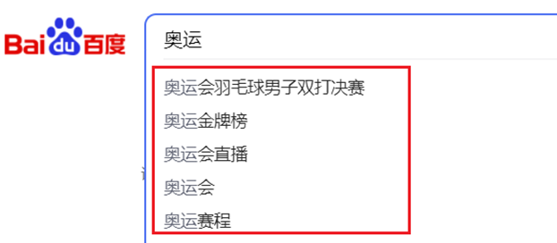

上图所示的效果我们经常见到，在我们输入一些关键字（例如 `奥运`）后就会在下面联想出相关的内容，而联想出来的这部分数据肯定是存储在百度的服务器上，但是我们并没有看出页面重新刷新，这就是 ==更新局部页面== 的效果。再如下图：

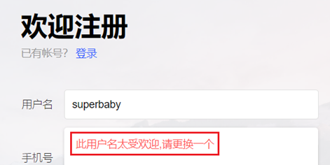

我们在用户名的输入框输入用户名，当输入框一失去焦点，如果用户名已经被占用就会在下方展示提示的信息；在这整个过程中也没有页面的刷新，只是在局部展示出了提示信息，这就是 ==更新局部页面== 的效果。

#### 3.1.2  同步和异步

后面还会涉及到很多，这里先简单了解！！！

* **同步发送请求过程如下**

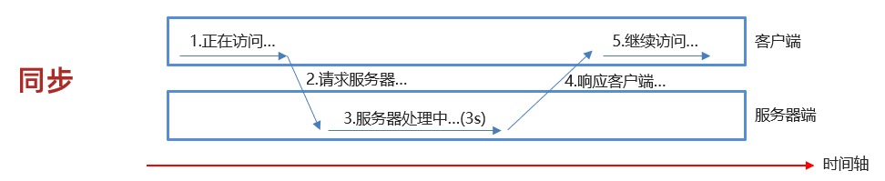

​	浏览器页面在发送请求给服务器，在服务器处理请求的过程中，浏览器页面不能做其他的操作。只能等到服务器响应结束后才能继续做其他的操作。

* **异步发送请求过程如下**

  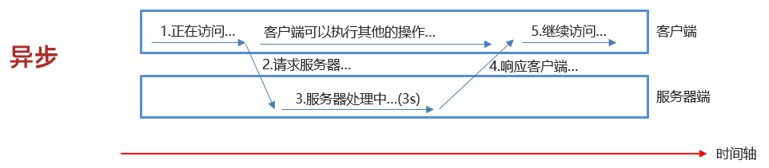

  浏览器页面发送请求给服务器，在服务器处理请求的过程中，浏览器页面还可以做其他的操作。

## 3.2  快速入门

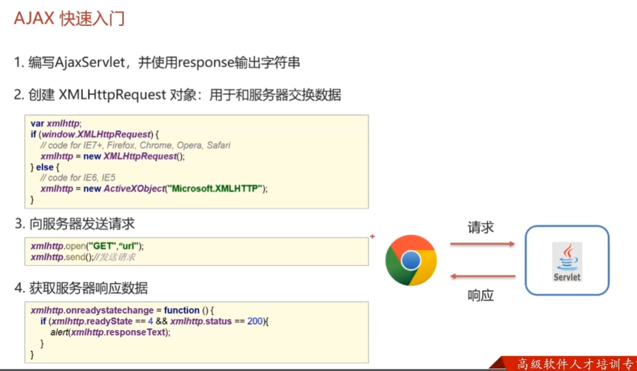

#### 3.2.1 服务端实现Servlet

第一步，在pom中导入依赖与tomcat服务器插件。

​		**servlet**

```xml
<dependency>
  <groupId>javax.servlet</groupId>
  <artifactId>javax.servlet-api</artifactId>
  <version>3.1.0</version>
  <scope>provided</scope>
</dependency>
```

​		**Tomcat插件**

```xml
  <build>
    <plugins>
      <plugin>
        <groupId>org.apache.tomcat.maven</groupId>
        <artifactId>tomcat7-maven-plugin</artifactId>
        <version>2.1</version>
        <configuration>
<!--          <port>80</port>-->
<!--          <path>/</path>-->
        </configuration>
      </plugin>
    </plugins>
  </build>
```

在项目的创建 `com.itheima.web.servlet` ，并在该包下创建名为  `AjaxServlet` 的servlet


#### 3.2.2  客户端实现HTML+Ajax


在 `webapp` 下创建名为 `01-ajax-demo1.html` 的页面，在该页面书写 `ajax` 代码

* 创建核心对象XMLHttpRequest，不同的浏览器创建的对象是不同的

  ```js
   var xhttp;
  if (window.XMLHttpRequest) {
      xhttp = new XMLHttpRequest();
  } else {
      // code for IE6, IE5
      xhttp = new ActiveXObject("Microsoft.XMLHTTP");
  }
  ```

* 发送请求

  ```js
  //建立连接
  xhttp.open("GET", "http://localhost:8080/ajax-demo/ajaxServlet");
  //发送请求
  xhttp.send();
  ```

* 获取响应

  ```js
  xhttp.onreadystatechange = function() {
      if (this.readyState == 4 && this.status == 200) {
          // 通过 this.responseText 可以获取到服务端响应的数据
          alert(this.responseText);
      }
  };
  ```

**完整代码如下：**

```html
<!DOCTYPE html>
<html lang="en">
<head>
    <meta charset="UTF-8">
    <title>Title</title>
</head>
<body>

<script>
    //1. 创建核心对象
    var xhttp;
    if (window.XMLHttpRequest) {
        xhttp = new XMLHttpRequest();
    } else {
        // code for IE6, IE5
        xhttp = new ActiveXObject("Microsoft.XMLHTTP");
    }
    //2. 发送请求
    xhttp.open("GET", "http://localhost:8080/ajax-demo/ajaxServlet");
    xhttp.send();

    //3. 获取响应
    xhttp.onreadystatechange = function() {
        if (this.readyState == 4 && this.status == 200) {
            alert(this.responseText);
        }
    };
</script>
</body>
</html>
```

#### 3.2.3  测试

启动Tomcat服务器，GOGO

在浏览器地址栏输入 `http://localhost:8080/ajax-demo/01-ajax-demo1.html` ，在 `01-ajax-demo1.html`加载的时候就会发送 `ajax` 请求，效果如下

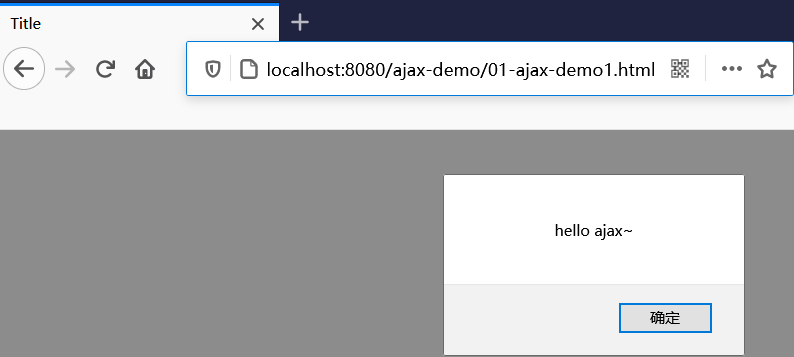

我们可以通过 `开发者模式` 查看发送的 AJAX 请求。在浏览器上按 `F12` 快捷键，

xhr是我们核心对象XMLHttpRequest的缩写。

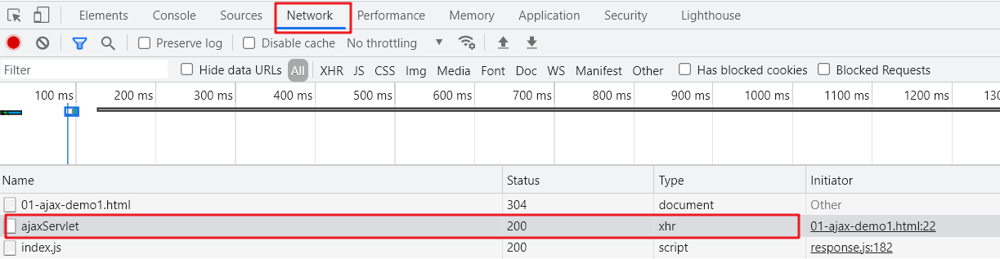

这个是查看所有的请求，如果我们只是想看 异步请求的话，点击上图中 `All` 旁边的 `XHR`，会发现只展示 Type 是 `xhr` 的请求。如下图：

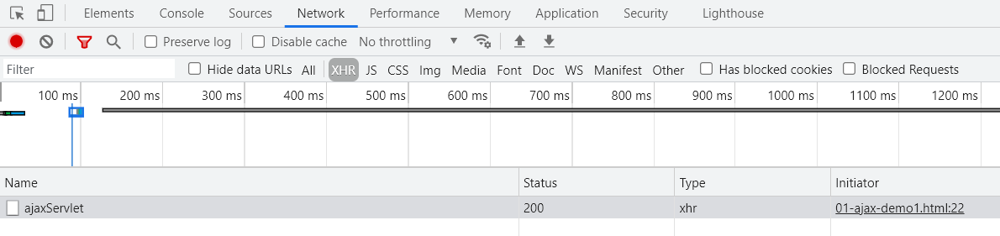

## 4. axios

==Axios 对原生的AJAX进行封装，简化书写。==

Axios官网是：`https://www.axios-http.cn`

### 4.1  基本使用

axios 使用是比较简单的，分为以下两步：

* 引入 axios 的 js 文件

  ```html
  <script src="js/axios-0.18.0.js"></script>
  ```

* 使用axios 发送请求，并获取响应结果

  * 发送 get 请求

    ```js
    axios({
        method:"get",
        url:"http://localhost:8080/ajax-demo1/aJAXDemo1?username=zhangsan"
    }).then(function (respose){
        alert(respose.data);
    })
    ```

  * 发送 post 请求

    ```js
    axios({
        method:"post",
        url:"http://localhost:8080/ajax-demo1/aJAXDemo1",
        data:"username=zhangsan"
    }).then(function (respose){
        alert(respose.data);
    });
    ```

`axios()` 是用来发送异步请求的，小括号中使用 js 对象传递请求相关的参数：

* `method` 属性：用来设置请求方式的。取值为 `get` 或者 `post`。
* `url` 属性：用来书写请求的资源路径。如果是 `get` 请求，需要将请求参数拼接到路径的后面，格式为： `url?参数名=参数值&参数名2=参数值2`。
* `data` 属性：作为请求体被发送的数据。也就是说如果是 `post` 请求的话，数据需要作为 `data` 属性的值。

`then()` 需要传递一个匿名函数。我们将 `then()` 中传递的匿名函数称为 ==回调函数==，意思是该匿名函数在发送请求时不会被调用，而是在成功响应后调用的函数。==而该回调函数中的 `resp` 参数是对响应的数据进行封装的对象，通过 `resp.data` 可以获取到响应的数据。==,注意这是axios对respose对象进行封装之后的一个新的对象，不是我们前面讲的那个respose对象哦。

### 4.3  请求方法别名

为了方便起见， Axios 已经为所有支持的请求方法提供了别名。其实就是个更加简介了，写起来更加方便，前面我们是通过js 对象传递请求相关的参数（大括号里面的），现在axios觉得麻烦，直接给我们写好了方法。

* `get` 请求 ： `axios.get(url[,config])`

* `delete` 请求 ： `axios.delete(url[,config])`

* `head` 请求 ： `axios.head(url[,config])`

* `options` 请求 ： `axios.option(url[,config])`

* `post` 请求：`axios.post(url[,data[,config])`

* `put` 请求：`axios.put(url[,data[,config])`

* `patch` 请求：`axios.patch(url[,data[,config])`

而我们只关注 `get` 请求和 `post` 请求。

入门案例中的 `get` 请求代码可以改为如下：

```js
axios.get("http://localhost:8080/ajax-demo/axiosServlet?username=zhangsan").then(function (resp) {
    alert(resp.data);
});
```

入门案例中的 `post` 请求代码可以改为如下：

```js
axios.post("http://localhost:8080/ajax-demo/axiosServlet","username=zhangsan").then(function (resp) {
    alert(resp.data);
})
```


# 8、JSON

### 5.1  概述

==概念：`JavaScript Object Notation`。JavaScript 对象表示法.==

作用：由于其语法格式简单，层次结构鲜明，现多用于作为==数据载体==，在网络中进行数据传输

如下是 `JavaScript` 对象的定义格式：

```js
{
	name:"zhangsan",
	age:23,
	city:"北京"
}
```

接下来我们再看看 `JSON` 的格式：

```json
{
	"name":"zhangsan",
	"age":23,
	"city":"北京"
}
```

通过上面 js 对象格式和 json 格式进行对比，发现两个格式特别像。只不过 js 对象中的属性名可以使用引号（可以是单引号，也可以是双引号）；而 `json` 格式中的键要求必须使用双引号括起来，这是 `json` 格式的规定。

如下图所示就是服务端给浏览器响应的数据，这个数据比较简单，如果现需要将 JAVA 对象中封装的数据响应回给浏览器的话，应该以何种数据传输呢？

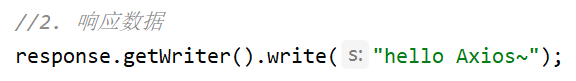

==大家还记得 `ajax` 的概念吗？ 是 异步的 JavaScript 和 xml。这里的 xml就是以前进行数据传递的方式，如下：==

```xml
<student>
    <name>张三</name>
    <age>23</age>
    <city>北京</city>
</student>
```

再看 `json` 描述以上数据的写法：

```json
{	
	"name":"张三",
    "age":23,
    "city":"北京"
}
```

上面两种格式进行对比后就会**发现 `json` 格式数据的简单，以及所占的字节数少等优点。**所以我们采用JSON的数据格式进行前后端的数据传输，这里就有一个很重要的**JSON数据与Java对象之间的转换**，下面会慢慢讲到。

### 5.2  JSON 语法

#### 5.2.1  定义格式

**`JSON` 本质就是一个字符串**，但是该字符串内容是有一定的格式要求的。 定义格式如下：

```js
var 变量名 = '{"key":value,"key":value,...}';
```

`JSON` 串对于

==key键==要求必须使用双引号括起来，而值根据要表示的类型确定。

==value 的数据类型==

* 数字（整数或浮点数）
* **字符串（使用双引号括起来）**不是单引号哦，这里注意外部使用单引号，里面就只能使用双引号，背下来就好了！！
* 逻辑值（true或者false）
* **数组（在方括号中）[   ]**
* **对象（在花括号中）{   }**
* null

**在进行js对象、java对象与json的转换时，你发给我json的是什么数据格式，我传输的就是什么数据格式**

示例：

```js
var jsonStr = '{"name":"zhangsan","age":23,"addr":["北京","上海","西安"]}';
```

### 5.3  前端与JSON串

- **问题**

  这里就是一个JS对象与JSON串之间的转换问题。因为JSON串只是一个字符串呀，我们无法从中获取到需要的数据。

- **解决办法**

  为了解决这个问题，JS 提供了一个对象 `JSON` ，该对象有如下两个方法：

  ​	`parse(str)` ：将 JSON串转换为 js 对象。

  ​			使用方式是： ==var jsObject = JSON.parse(jsonStr);==

​			`stringify(obj)` ：将 js 对象转换为 JSON 串。

​				使用方式是：==var jsonStr = JSON.stringify(jsObject)==

这样我们就可以通过 `js对象.属性名` 的方式来获取数据

记住：**你发给我json的是什么数据格式，我传输的就是什么数据格式**

**Example：**

如下，创建一个页面，在该页面的 `<script>` 标签中定义json字符串

```html
<!DOCTYPE html>
<html lang="en">
<head>
    <meta charset="UTF-8">
    <title>Title</title>
</head>
<body>
<script>
    //1. 定义JSON字符串
    var jsonStr = '{"name":"zhangsan","age":23,"addr":["北京","上海","西安"]}'
    alert(jsonStr);

    //2. 将 JSON 字符串转为 JS 对象
    let jsObject = JSON.parse(jsonStr);
    alert(jsObject)
    alert(jsObject.name)
    //3. 将 JS 对象转换为 JSON 字符串
    let jsonStr2 = JSON.stringify(jsObject);
    alert(jsonStr2)
</script>
</body>
</html>
```

这里JS对象的各个属性的值是什么类型呢，name——字符串；age——数字；addr——字符串数组。

通过浏览器打开，页面效果如下图所示

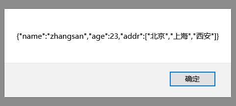


#### 5.3.1  前端axios发送接收JSON

- **前面方式的弊端**

  后面我们使用 `axios` 发送请求时，如果要携带复杂的数据时都会以 `JSON` 格式进行传递，如下是我们前面传输数据的方式：可见这种方式很不方便，所以我们采用JOSN传输。

```js
axios({
    method:"post",
    url:"http://localhost:8080/ajax-demo/axiosServlet",
    data:"username=zhangsan"
}).then(function (resp) {
    alert(resp.data);
})
```

- **json方式**

先提前定义一个 **js 对象**，用来封装需要提交的参数，然后使用 `JSON.stringify(js对象)` 转换为 `JSON` 串，再将该 `JSON` 串作为 `axios` 的 `data` 属性值进行请求参数的提交。如下：

```js
var jsObject = {
  name:"张三",
  age:20,
  addr:["北京","上海","西安"]
};
        // let s = JSON.stringify(jsObject);
        // console.log(s);
axios({
    method:"post",
    url:"http://localhost:8080/ajax-demo/axiosServlet",
    data: JSON.stringify(jsObject)
}).then(function (resp) {
    alert(resp.data);
})
```

记住：**你发给我json的是什么数据格式，我传输的就是什么数据格式**

- 这里json串打印出来是这样的：

  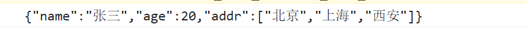

==而 `axios` 是一个很强大的工具。因为它内部已经封装好了js对象与JSON字符串的相互转换！！！==ohohohoh，也就是不用我们自己去调用那个方法。

- **当data值为一个js对象时，axios内部就帮我们调用了**，直接转换成JSON字符串，然后再发送POST请求

- **同时，当我们的axios接收到一个JSON串时，他也会自动把他转换成一个JS对象**，给前端人员使用。前面不是说了resp是对respose对象进行封装了撒，他在封装的过程就做了这一步操作，即resp.data这里得到的是JS对象，而不是JSON串

```js
var jsObject = {
  name:"张三",
  age:20,
  addr:["北京","上海","西安"]
};

axios({
    method:"post",
    url:"http://localhost:8080/ajax-demo/axiosServlet",
    data:jsObject  //这里 axios 会将该js对象转换为 json 串的
}).then(function (resp) {
    alert(resp.data);
})
```

> ==注意：==！！！！！！！！！！！！！！！！！！！！！！！！！！！
>
> * 发送异步请求时，当请求参数用 `JSON` 格式，请那求方式必须是 `POST`。因为 `JSON` 串需要放在请求体中。


### 5.3  后端与JSON串

==因为前端发送异步请求这一块，Ajax我们采用JSON串的形式在网络中传输。无请求参数时，我们采用get请求，有请求参数时我们采用post请求（json数据只能放在请求体里面），但是之前的request对象获取请求参数的那几个getParameter通用方法无法直接获取JSON串里面的数据，我们只能通过request对象里面获取请求体数据的那个方法`BufferedReader getReader()`，来获取整个JSON字符串；所以后端需要具备处理JSON字符串的功能（就是将json字符串变成Java对象）。`fastjson`==

学习完 json 后，接下来聊聊 json 的作用。以后我们会以 json 格式的数据进行前后端交互。前端发送请求时，如果是复杂的数据就会以 json 提交给后端；而后端如果需要响应一些复杂的数据时，也需要以 json 格式将数据响应回给浏览器。

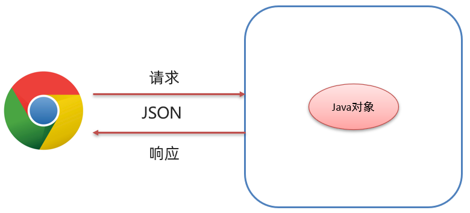

在后端我们就需要重点学习以下两部分操作：

* 请求数据：JSON字符串转为Java对象
* 响应数据：Java对象转为JSON字符串

接下来给大家介绍一套 API，可以实现上面两部分操作。这套 API 就是 `Fastjson`

#### 5.3.1  Fastjson 概述

`Fastjson` 是阿里巴巴提供的一个Java语言编写的高性能功能完善的 `JSON` 库，是目前Java语言中最快的 `JSON` 库，可以实现 `Java` 对象和 `JSON` 字符串的相互转换。

#### 5.3.2  Fastjson 使用

`Fastjson` 使用也是比较简单的，分为以下三步完成

1. **导入坐标**

   ```xml
   <dependency>
       <groupId>com.alibaba</groupId>
       <artifactId>fastjson</artifactId>
       <version>1.2.62</version>
   </dependency>
   ```

2. **Java对象转JSON串**

   这里java对象的属性是什么数据类型，json就是什么数据类型

   ```java
   String jsonStr = JSON.toJSONString(obj);
   ```

   使用 `Fastjson` 提供的 `JSON` 类中的 `toJSONString()` 静态方法即可。

3. **JSON字符串转Java实体类对象**

   ==划重点哦，敲黑板了==

   ​		前端发送过来的数据，例如 `{"name":"张三","age":"20","addr":["北京","上海","西安"]}` ,我们后端是没有办法去限制它前端页面得到的数据类型的，所以前端统一得到表单提交的数据时采用字符串的格式，也就是说，前端发过来的JSON串，里面value都是字符串。这就有问题了，因为我后端对应的实体类的属性可不都是字符串类型，有Integer，Float啊什么的。这里就涉及到了一个数据类型转换的问题。

   ​		首先我按照下面这样的方式解析，他的对应实体类的属性数据注入是一一对应的方式，即key值与属性名一一对应，他就会自动注入。当我接收JSON串的age是”25“的字符串类型，后端实体类监测到age是Integer类型，Fastjson库的这个工具方法，会自动进行一个类型转换（JavaSE里面讲过），把字符串“25”转换成Integer的25，再注入到实体类的属性里面。

   ​		最后一个问题，假如客户前端age表单里面写的是“25aaa”，那会出现什么情况呢？这样的话，后端就会报错，解析错误。所以说前端需要用正则表达式去限制客户的输入规范！！

   ```java
   User user = JSON.parseObject(jsonStr, User.class);
   ```

   使用 `Fastjson` 提供的 `JSON` 类中的 `parseObject()` 静态方法即可。

   **4. JSON串转换成其他的对象**

   ```java
       //转为 int[]
       int[] ids = JSON.parseObject(params, int[].class);
   ```

   

#### 5.3.3 后端接收JSON串

由于前端提交的是 json 格式的数据，所以我们不能使用 `request.getParameter()` 方法获取请求参数

* 如果提交的数据格式是 `username=zhangsan&age=23` ，后端就可以使用 `request.getParameter()` 方法获取
* 如果提交的数据格式是 json，后端就需要通过 request 对象获取输入流，再通过输入流读取数据 

```java
    // 获取请求体数据
    BufferedReader br = request.getReader();
    String params = br.readLine();
```

**Example**

```java
@WebServlet("/addServlet")
public class AddServlet extends HttpServlet {

    private BrandService brandService = new BrandService();

    @Override
    protected void doGet(HttpServletRequest request, HttpServletResponse response) throws ServletException, IOException {

        //1. 接收数据,request.getParameter 不能接收json的数据
       /* String brandName = request.getParameter("brandName");
        System.out.println(brandName);*/

        // 获取请求体数据
        BufferedReader br = request.getReader();
        String params = br.readLine();
        // 将JSON字符串转为Java对象
        Brand brand = JSON.parseObject(params, Brand.class);
        //2. 调用service 添加
        brandService.add(brand);
        //3. 响应成功标识
        response.getWriter().write("success");
    }

    @Override
    protected void doPost(HttpServletRequest request, HttpServletResponse response) throws ServletException, IOException {
        this.doGet(request, response);
    }
}
```

#### 5.3.4 后端发送json数据

* 将查询到的集合数据转换为 json 数据。我们将此过程称为 ==序列化==；如果是将 json 数据转换为 Java 对象，我们称之为 ==反序列化==
* 将 json 数据响应回给浏览器。这里一定要设置响应数据的类型及字符集 `response.setContentType("text/json;charset=utf-8");`

```java
@WebServlet("/selectAllServlet")
public class SelectAllServlet extends HttpServlet {

    private BrandService brandService = new BrandService();
    @Override
    protected void doGet(HttpServletRequest req, HttpServletResponse resp) throws ServletException, IOException {
        List<Brand> brands = brandService.selectAll();
        String s = JSON.toJSONString(brands);
        System.out.println(s);
      	// 重点哦，一定有这个不然报错无法识别
        resp.setContentType("text/json;charset = utf-8");
        resp.getWriter().write(s);
    }

    @Override
    protected void doPost(HttpServletRequest req, HttpServletResponse resp) throws ServletException, IOException {
        this.doGet(req, resp);
    }
}
```


# 9、JavaWeb三大组件—servlet

**什么是servlet啊，他和我们使用的springboot这些框架有什么区别？**

Servlet（Server Applet）是 Java Web 技术的基础，它是一种运行在服务器端的 Java 程序，用于处理客户端的请求并生成动态的响应。Servlet 是 Java EE 规范的一部分，它定义了处理 HTTP 请求的标准接口和生命周期方法。

Spring Boot 是一个基于 Spring 框架的开发工具，它简化了 Java Web 应用程序的开发、配置和部署。Spring Boot 提供了许多自动配置和约定优于配置的特性，使得开发者能够更快速地构建和运行 Web 应用程序。

Servlet 和 Spring Boot 的区别：

1. 技术层次：Servlet 是 Java Web 技术的基础，它定义了处理 HTTP 请求的基本接口。而 Spring Boot 是一个基于 Spring 框架的开发工具，它使用了 Servlet 技术作为底层实现。

2. 抽象程度：Servlet 提供了较低层次的 API，开发者需要处理底层的请求和响应细节。而 Spring Boot 提供了更高层次的抽象，使得开发者能够专注于业务逻辑，而不需要关心底层实现。

3. 功能范围：Servlet 主要关注于处理 HTTP 请求和生成响应。而 Spring Boot 除了包含 Web 功能外，还提供了许多其他功能，如数据访问、安全、缓存、消息队列等。

4. 易用性：使用 Servlet 开发 Web 应用程序需要处理许多底层细节，相对繁琐。而 Spring Boot 提供了自动配置和约定优于配置的特性，使得开发者能够更快速地构建和运行 Web 应用程序。

总之，Servlet 是 Java Web 技术的基础，而 Spring Boot 是一个更高层次的开发工具，它使用了 Servlet 技术作为底层实现，并提供了更多易用性和功能。


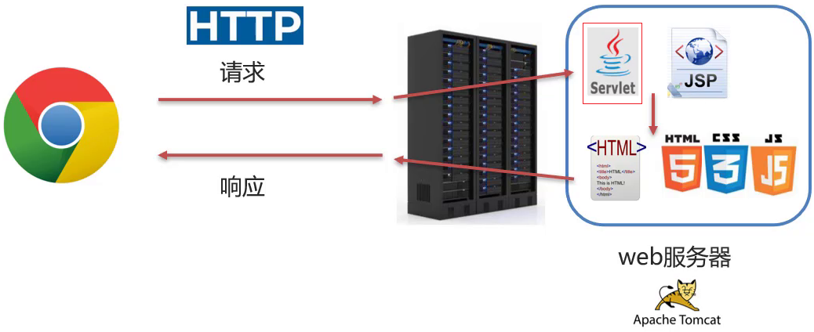

* ==Servlet是JavaWeb最为核心的内容，它是Java提供的一门动态web资源开发技术。==

* 使用Servlet就可以实现，根据不同的登录用户在页面上动态显示不同内容。

* ==Servlet是JavaEE规范之一，其实就是一个接口，==将来我们需要定义Servlet类实现Servlet接口，然后给web服务器运行这个Servlet类

  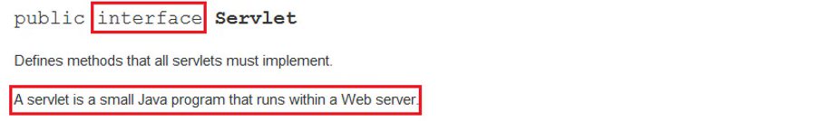

## 9.1 快速入门

就是写了一个接口。

1. 创建Web项目`web-demo`，导入Servlet依赖坐标

```xml
<dependency>
    <groupId>javax.servlet</groupId>
    <artifactId>javax.servlet-api</artifactId>
    <version>3.1.0</version>
    <scope>provided</scope>
</dependency>
```

2. 创建:定义一个类，实现Servlet接口，**并重写接口中所有方法**，并在service方法中输入一句话

```java
public class ServletDemo1 implements Servlet {

    public void service(ServletRequest servletRequest, ServletResponse servletResponse) throws ServletException, IOException {
        System.out.println("servlet hello world~");
    }
    public void init(ServletConfig servletConfig) throws ServletException {

    }
    public ServletConfig getServletConfig() {
        return null;
    }
    public String getServletInfo() {
        return null;
    }
    public void destroy() {

    }
}
```

3. 配置:在类上使用@WebServlet注解，配置该Servlet的访问路径

```java
@WebServlet("/demo1")
```

4. 访问:启动Tomcat,浏览器中输入URL地址访问该Servlet

```
http://localhost:8080/web-demo/demo1
```

5. 器访问后，在控制台会打印`servlet hello world~` 说明servlet程序已经成功运行。

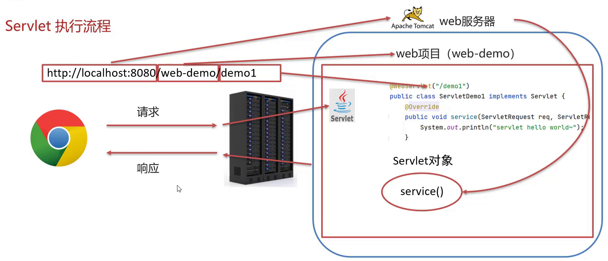

* **浏览器发出`http://localhost:8080/web-demo/demo1`请求，从请求中可以解析出三部分内容，分别是`localhost:8080`、`web-demo`、`demo1`**
  * 根据`localhost:8080`可以找到要访问的Tomcat Web服务器
  * 根据`web-demo`可以找到部署在Tomcat服务器上的web-demo项目
  * 根据`demo1`可以找到要访问的是项目中的哪个Servlet类，根据@WebServlet后面的值进行匹配
* **找到ServletDemo1这个类后，Tomcat Web服务器就会为ServletDemo1这个类创建一个对象，然后调用对象中的service方法**
  * ServletDemo1实现了Servlet接口，所以类中必然会重写service方法供Tomcat Web服务器进行调用
  * service方法中有**ServletRequest**和**ServletResponse**两个参数，ServletRequest封装的是请求数据，ServletResponse封装的是响应数据，后期我们可以通过这两个参数实现前后端的数据交互


## 9.2 HttpServlet

通过上面的学习，我们知道要想编写一个Servlet就必须要实现Servlet接口，重写接口中的5个方法，虽然已经能完成要求，但是编写起来还是比较麻烦的，因为我们更关注的其实只有service方法，那有没有更简单方式来创建Servlet呢? 

 **那就是httpServlet——针对http协议封装的实现类**

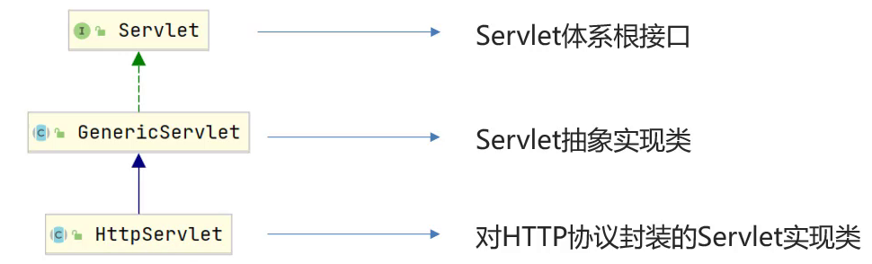

因为我们将来开发B/S架构的web项目，都是针对HTTP协议，所以我们自定义Servlet,会通过继承HttpServlet，这里的两个对象很重要，在SpringMVC中也会见到**HttpServletRequest**、**HttpServletResponse**

```java
@WebServlet("/demo4")
public class ServletDemo4 extends HttpServlet {
    @Override
    protected void doGet(HttpServletRequest req, HttpServletResponse resp) throws ServletException, IOException {
        //TODO GET 请求方式处理逻辑
        System.out.println("get...");
    }
    @Override
    protected void doPost(HttpServletRequest req, HttpServletResponse resp) throws ServletException, IOException {
        //TODO Post 请求方式处理逻辑
        System.out.println("post...");
    }
}
```

* 要想发送一个GET请求，请求该Servlet，只需要通过浏览器发送`http://localhost:8080/web-demo/demo4`,就能看到doGet方法被执行了
* 要想发送一个POST请求，请求该Servlet，也是一样的。

**HttpServlet原理：在实现Servlet方法时：**

> 获取请求方式，并根据不同的请求方式，调用不同的doXxx方法


# 10、Request和Response对象

## 1、是什么？

==Request是请求对象，Response是响应对象。==这两个对象在我们使用Servlet的时候有看到：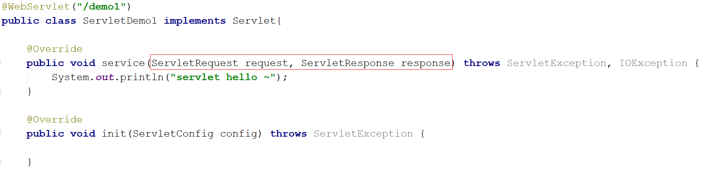

此时，我们就需要思考一个问题request和response这两个参数的作用是什么?

**明确一点：web服务器创建的Servlet接口“对象”**

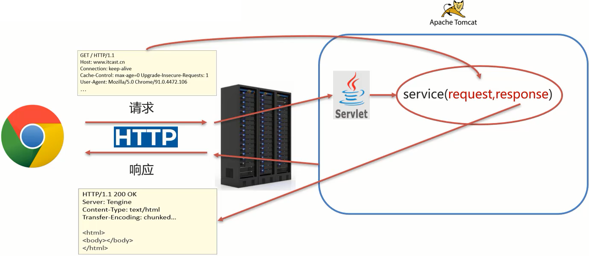

* ==request:获取请求数据==
  * 浏览器会发送HTTP请求到后台服务器[Tomcat]
  * HTTP的请求中会包含很多请求数据[请求行+请求头+请求体]
  * 后台服务器[Tomcat]会对HTTP请求中的数据进行解析并把解析结果存入到一个对象中
  * 所存入的对象即为request对象，所以我们可以从request对象中获取请求的相关参数
  * 获取到数据后就可以继续后续的业务，比如获取用户名和密码就可以实现登录操作的相关业务
* ==response:设置响应数据==
  * 业务处理完后，后台就需要给前端返回业务处理的结果即响应数据
  * 把响应数据封装到response对象中
  * 后台服务器[Tomcat]会解析response对象,按照[响应行+响应头+响应体]格式拼接结果
  * 浏览器最终解析结果，把内容展示在浏览器给用户浏览

对于上述所讲的内容，我们通过一个案例来初步体验下request和response对象的使用。

```java
@WebServlet("/demo3")
public class ServletDemo3 extends HttpServlet {
    @Override
    protected void doGet(HttpServletRequest request, HttpServletResponse response) throws ServletException, IOException {
        //使用request对象 获取请求数据
        String name = request.getParameter("name");//url?name=zhangsan

        //使用response对象 设置响应数据
        response.setHeader("content-type","text/html;charset=utf-8");
        response.getWriter().write("<h1>"+name+",欢迎您！</h1>");
    }

    @Override
    protected void doPost(HttpServletRequest request, HttpServletResponse response) throws ServletException, IOException {
        System.out.println("Post...");
    }
}
```

启动成功后就可以通过浏览器来访问，并且根据传入参数的不同就可以在页面上展示不同的内容:

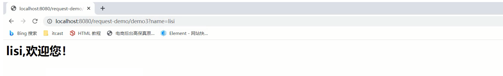

## 2、Request对象

### 2.1 Request继承体系

在学习这节内容之前，我们先思考一个问题，前面在介绍Request和Reponse对象的时候，比较细心的同学可能已经发现：

* 当我们的Servlet类实现的是Servlet接口的时候，service方法中的参数是ServletRequest和ServletResponse
* 当我们的Servlet类继承的是HttpServlet类的时候，doGet和doPost方法中的参数就变成HttpServletRequest和HttpServletReponse

那么，

* ServletRequest和HttpServletRequest的关系是什么?
* request对象是有谁来创建的?
* request提供了哪些API,这些API从哪里查?

**首先，我们先来看下Request的继承体系:**

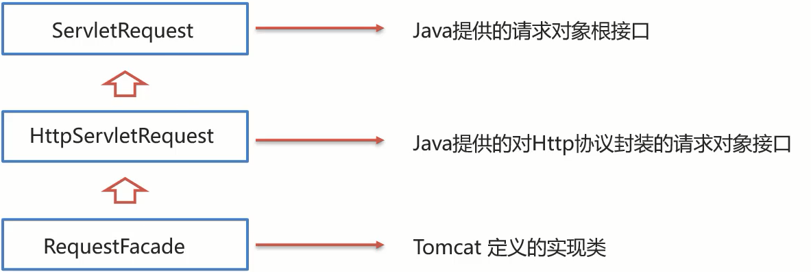


所以ServletRequest和HttpServletRequest是继承关系，并且两个都是接口，接口是无法创建对象，这个时候就引发了下面这个问题:

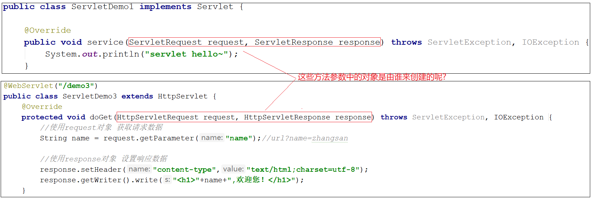

==这个时候，我们就需要用到Request继承体系中的`RequestFacade`:==

* 该类实现了HttpServletRequest接口，也间接实现了ServletRequest接口。

* 因为Servlet类中的service方法、doGet方法或者是doPost方法最终都是由Web服务器[Tomcat]来调用的，所以Tomcat提供了方法参数接口的具体实现类，并完成了对象的创建.

* RequestFacade中提供的所有方法，可以直接查看JavaEE的API文档中关于ServletRequest和HttpServletRequest的接口文档

* Tomcat需要解析请求数据，封装为request对象,并且创建request对象传递到service方法

  

### 2.2 Request获取请求数据

首先Web已经给我们解析完了HTTP请求数据，然后封装成了一个Request对象了，现在我们是从对象里面拿已经有的数据。

HTTP请求数据总共分为三部分内容，分别是==请求行、请求头、请求体==，

#### 2.2.1 获取请求行数据

请求行包含三块内容，分别是`请求方式`、`请求资源路径`、`HTTP协议及版本`

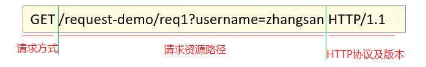

对于这三部分内容，request对象都提供了对应的API方法来获取，具体如下:

* **获取请求方式**: `GET`

```java
String getMethod()
```

* **获取虚拟目录(项目访问路径)**: `/request-demo`

```java
String getContextPath()
```

* **获取URL(统一资源定位符):** `http://localhost:8080/request-demo/req1`

```java
StringBuffer getRequestURL()
```

* **获取URI(统一资源标识符):** `/request-demo/req1`

```java
String getRequestURI()
```

* **获取请求参数(GET方式)**: `username=zhangsan&password=123`

```java
String getQueryString()
```

介绍完上述方法后，咱们通过代码把上述方法都使用下:

```java
@WebServlet("/req1")
public class RequestDemo1 extends HttpServlet {
    @Override
    protected void doGet(HttpServletRequest req, HttpServletResponse resp) throws ServletException, IOException {
        // String getMethod()：获取请求方式： GET
        String method = req.getMethod();
        System.out.println(method);//GET
        // String getContextPath()：获取虚拟目录(项目访问路径)：/request-demo
        String contextPath = req.getContextPath();
        System.out.println(contextPath);
        // StringBuffer getRequestURL(): 获取URL(统一资源定位符)：http://localhost:8080/request-demo/req1
        StringBuffer url = req.getRequestURL();
        System.out.println(url.toString());
        // String getRequestURI()：获取URI(统一资源标识符)： /request-demo/req1
        String uri = req.getRequestURI();
        System.out.println(uri);
        // String getQueryString()：获取请求参数（GET方式）： username=zhangsan
        String queryString = req.getQueryString();
        System.out.println(queryString);
    }
    @Override
    protected void doPost(HttpServletRequest req, HttpServletResponse resp) throws ServletException, IOException {
    }
}
```

启动服务器，访问`http://localhost:8080/request-demo/req1?username=zhangsan&passwrod=123`，获取的结果如下:

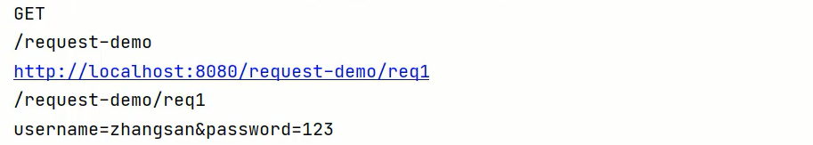

#### 2.2.2 获取请求头数据

对于请求头的数据，格式为`key: value`如下:

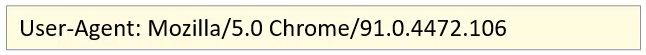

根据请求头名称获取对应值的方法为:

```java
String getHeader(String name)
```

接下来，在代码中如果想要获取客户端浏览器的版本信息，则可以使用

```java
@WebServlet("/req1")
public class RequestDemo1 extends HttpServlet {
    @Override
    protected void doGet(HttpServletRequest req, HttpServletResponse resp) throws ServletException, IOException {
      
        //获取请求头: user-agent: 浏览器的版本信息
        String agent = req.getHeader("user-agent");
				System.out.println(agent);
    }
    @Override
    protected void doPost(HttpServletRequest req, HttpServletResponse resp) throws ServletException, IOException {
    }
}
```

重新启动服务器后，`http://localhost:8080/request-demo/req1?username=zhangsan&passwrod=123`，获取的结果如下:


#### 2.2.3 获取请求体数据

浏览器在发送GET请求的时候是没有请求体的，所以需要把请求方式变更为POST，请求体中的数据格式如下:

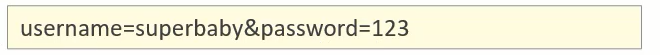

对于请求体中的数据，Request对象提供了如下两种方式来获取其中的数据，分别是:

* **获取字节输入流，**（如果前端发送的是字节数据，比如传递的是文件数据）

```java
ServletInputStream getInputStream()
```

* **获取字符输入流，**如果前端发送的是纯文本数据，则使用该方法

```java
BufferedReader getReader()
```


#### 2.2.4 获取请求参数的通用方式

在学习下面内容之前，我们先搞清楚几个问题：

==1.什么是请求参数?==

- 我们拿用户登录的例子来说明：用户名和密码其实就是我们所说的请求参数。

==2.什么是请求数据?==

- 请求数据则是包含请求行、请求头和请求体的所有数据

==3.请求参数和请求数据的关系是什么?==

- 请求参数是请求数据中的部分内容

==对于请求参数的获取,前面讲了两种:==

* GET方式:

```java
String getQueryString()
```

* POST方式:

```java
BufferedReader getReader();
```

但是GET请求和POST请求获取接收参数的方式不一样，这样就会造成代码冗余，重复代码的问题

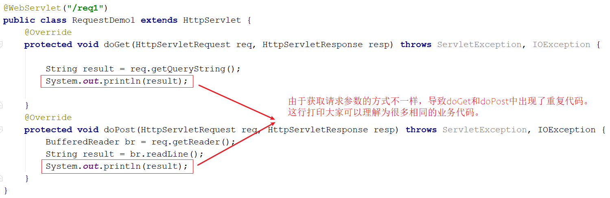

**request对象单独提供了专门获取请求参数的方法，其实就是对getQueryString()和 getReader()进行了二次封装**；（新建方法，里面调用这两个方法，拿到数据，然后整理好，返回给我们程序员，舒舒服服，让我们可以更加方便的获取请求参数）

> 实现的方式如下：
>
> (1) 根据不同的请求方式获取请求参数，获取的内容如下:
>
> 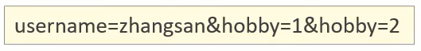
>
> (2 ) 把获取到的内容进行分割，内容如下:
>
> 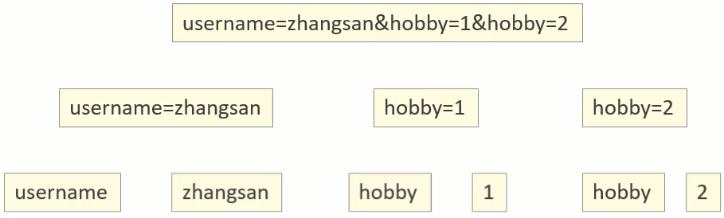
>
> (3) 把分割后端数据，存入到一个Map集合中:
>
> 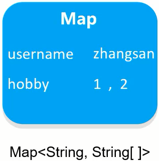
>
> **注意**:因为参数的值可能是一个，也可能有多个，所以Map的值的类型为String数组。


* **获取所有请求参数Map集合**

```java
Map<String,String[]> getParameterMap()
```

* **根据键名称获取对应参数值（数组）**

```java
String[] getParameterValues(String name)
```

* **根据键名称获取对应参数值(单个值)**

```java
String getParameter(String name)
```

> 举一个例子如下：
>
> ```java
> /**
>  * request 通用方式获取请求参数
>  */
> @WebServlet("/req2")
> public class RequestDemo2 extends HttpServlet {
>     @Override
>     protected void doGet(HttpServletRequest req, HttpServletResponse resp) throws ServletException, IOException {
>         //GET请求逻辑
>         System.out.println("get....");
>       
>         //1. 获取所有参数的Map集合
>         Map<String, String[]> map = req.getParameterMap();
>       
>         for (String key : map.keySet()) {
>             // username:zhangsan lisi
>             System.out.print(key+":");
>             //获取值
>             String[] values = map.get(key);
>             for (String value : values) {
>                 System.out.print(value + " ");
>             }
>         }
>     }
>     @Override
>     protected void doPost(HttpServletRequest req, HttpServletResponse resp) throws ServletException, IOException {
>     }
> }
> ```
>
> 获取的结果为:
>
> 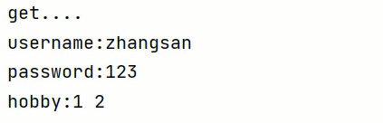
>
>  
>

### 2.3 请求参数中文乱码问题（可略）

问题展示:

(1)将req.html页面的请求方式修改为get

```html
<!DOCTYPE html>
<html lang="en">
<head>
    <meta charset="UTF-8">
    <title>Title</title>
</head>
<body>
<form action="/request-demo/req2" method="get">
    <input type="text" name="username"><br>
    <input type="password" name="password"><br>
    <input type="checkbox" name="hobby" value="1"> 游泳
    <input type="checkbox" name="hobby" value="2"> 爬山 <br>
    <input type="submit">

</form>
</body>
</html>
```

(2)在Servlet方法中获取参数，并打印

```java
/**
 * 中文乱码问题解决方案
 */
@WebServlet("/req4")
public class RequestDemo4 extends HttpServlet {
    @Override
    protected void doGet(HttpServletRequest request, HttpServletResponse response) throws ServletException, IOException {
       //1. 获取username
       String username = request.getParameter("username");
       System.out.println(username);
    }

    @Override
    protected void doPost(HttpServletRequest request, HttpServletResponse response) throws ServletException, IOException {
        this.doGet(request, response);
    }
}
```

（3）启动服务器，页面上输入中文参数

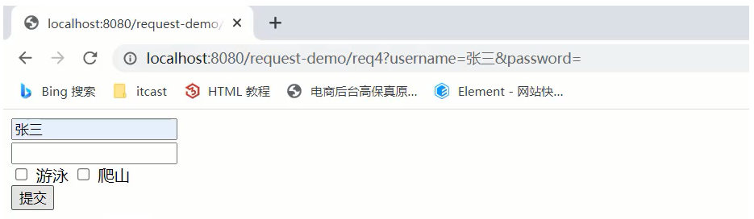

（4）查看控制台打印内容

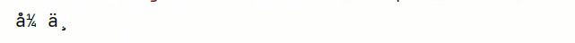

（5）把req.html页面的请求方式改成post,再次发送请求和中文参数

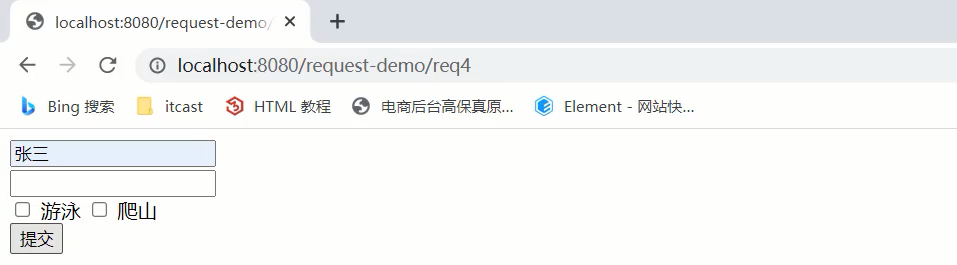

（6）查看控制台打印内容，依然为乱码


通过上面的案例，会发现，不管是GET还是POST请求，在发送的请求参数中如果有中文，在后台接收的时候，都会出现中文乱码的问题。具体该如何解决呢？

#### 2.4.1 POST请求解决方案

* 分析出现中文乱码的原因：

  * POST的请求参数是通过request的getReader()来获取流中的数据
  * TOMCAT在获取流的时候采用的编码是ISO-8859-1
  * ISO-8859-1编码是不支持中文的，所以会出现乱码

* 解决方案：

  1.页面设置的编码格式为UTF-8

  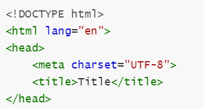

  2.把TOMCAT在获取流数据之前的编码设置为UTF-8

  ```java
  request.setCharacterEncoding("UTF-8")
  ```

修改后的代码为:

```java
/**
 * 中文乱码问题解决方案
 */
@WebServlet("/req4")
public class RequestDemo4 extends HttpServlet {
    @Override
    protected void doGet(HttpServletRequest request, HttpServletResponse response) throws ServletException, IOException {
        //1. 解决乱码: POST getReader()
        //设置字符输入流的编码，设置的字符集要和页面保持一致
        request.setCharacterEncoding("UTF-8");
       //2. 获取username
       String username = request.getParameter("username");
       System.out.println(username);
    }

    @Override
    protected void doPost(HttpServletRequest request, HttpServletResponse response) throws ServletException, IOException {
        this.doGet(request, response);
    }
}
```

至此POST请求中文乱码的问题就已经解决，但是这种方案不适用于GET请求，这个原因是什么呢，咱们下面再分析。

#### 2.4.2 GET请求解决方案

刚才提到一个问题是`POST请求的中文乱码解决方案为什么不适用GET请求？`

* GET请求获取请求参数的方式是`request.getQueryString()`
* POST请求获取请求参数的方式是`request.getReader()`
* request.setCharacterEncoding("utf-8")是设置request处理流的编码
* getQueryString方法并没有通过流的方式获取数据

1. 首先我们需要先分析下GET请求出现乱码的原因:

 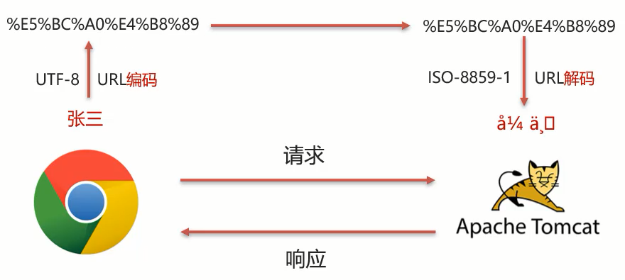

(1)浏览器通过HTTP协议发送请求和数据给后台服务器（Tomcat)

(2)浏览器在发送HTTP的过程中会对中文数据进行URL==编码==

(3)在进行URL编码的时候会采用页面`<meta>`标签指定的UTF-8的方式进行编码，`张三`编码后的结果为`%E5%BC%A0%E4%B8%89`

(4)后台服务器(Tomcat)接收到`%E5%BC%A0%E4%B8%89`后会默认按照`ISO-8859-1`进行URL==解码==

(5)由于前后编码与解码采用的格式不一样，就会导致后台获取到的数据为乱码。

思考: 如果把`req.html`页面的`<meta>`标签的charset属性改成`ISO-8859-1`,后台不做操作，能解决中文乱码问题么?

答案是否定的，因为`ISO-8859-1`本身是不支持中文展示的，所以改了<meta>标签的charset属性后，会导致页面上的中文内容都无法正常展示。

分析完上面的问题后，我们会发现，其中有两个我们不熟悉的内容就是==URL编码==和==URL解码==，什么是URL编码，什么又是URL解码呢?

**URL编码**

这块知识我们只需要了解下即可,具体编码过程分两步，分别是:

(1)将字符串按照编码方式转为二进制

(2)每个字节转为2个16进制数并在前边加上%

`张三`按照UTF-8的方式转换成二进制的结果为:

```
1110 0101 1011 1100 1010 0000 1110 0100 1011 1000 1000 1001
```

这个结果是如何计算的?

使用`http://www.mytju.com/classcode/tools/encode_utf8.asp`，输入`张三`

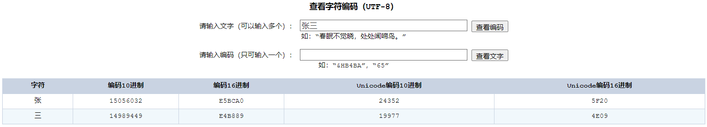

就可以获取张和三分别对应的10进制，然后在使用计算器，选择程序员模式，计算出对应的二进制数据结果:

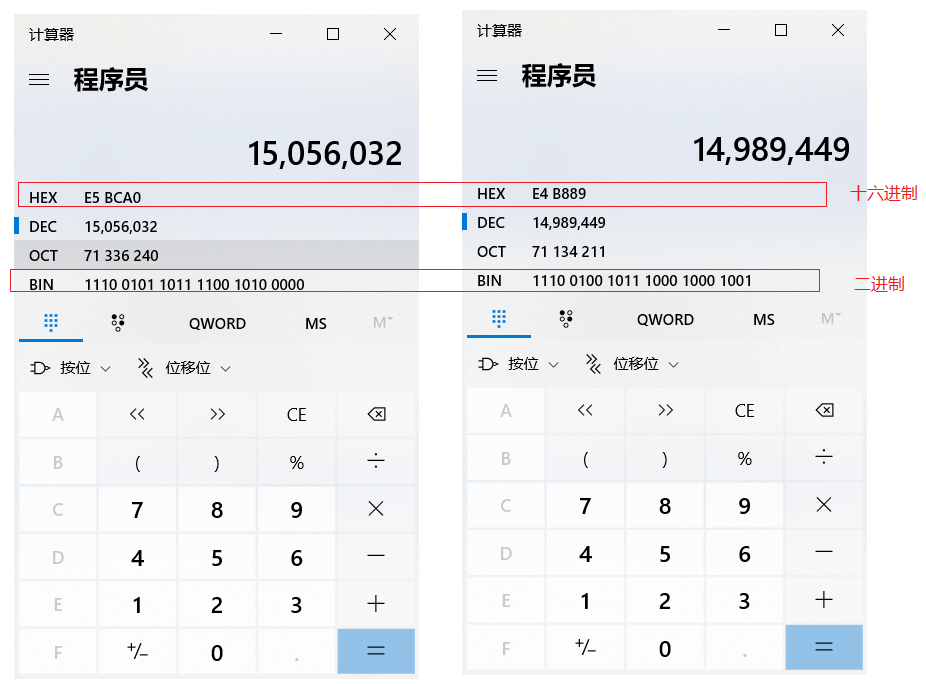

在计算的十六进制结果中，每两位前面加一个%,就可以获取到`%E5%BC%A0%E4%B8%89`。

当然你从上面所提供的网站中就已经能看到编码16进制的结果了:

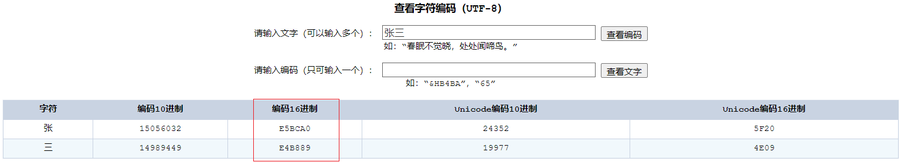

但是对于上面的计算过程，如果没有工具，纯手工计算的话，相对来说还是比较复杂的，我们也不需要进行手动计算，在Java中已经为我们提供了编码和解码的API工具类可以让我们更快速的进行编码和解码:

编码:

```java
java.net.URLEncoder.encode("需要被编码的内容","字符集(UTF-8)")
```

解码:

```java
java.net.URLDecoder.decode("需要被解码的内容","字符集(UTF-8)")
```

接下来咱们对`张三`来进行编码和解码

```
public class URLDemo {

  public static void main(String[] args) throws UnsupportedEncodingException {
        String username = "张三";
        //1. URL编码
        String encode = URLEncoder.encode(username, "utf-8");
        System.out.println(encode); //打印:%E5%BC%A0%E4%B8%89

       //2. URL解码
       //String decode = URLDecoder.decode(encode, "utf-8");//打印:张三
       String decode = URLDecoder.decode(encode, "ISO-8859-1");//打印:`å¼ ä¸ `
       System.out.println(decode);
    }
}

```

到这，我们就可以分析出GET请求中文参数出现乱码的原因了，

* 浏览器把中文参数按照`UTF-8`进行URL编码
* Tomcat对获取到的内容进行了`ISO-8859-1`的URL解码
* 在控制台就会出现类上`å¼ ä¸‰`的乱码，最后一位是个空格

2. 清楚了出现乱码的原因，接下来我们就需要想办法进行解决

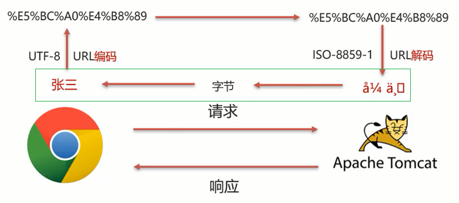

从上图可以看住，

* 在进行编码和解码的时候，不管使用的是哪个字符集，他们对应的`%E5%BC%A0%E4%B8%89`是一致的

* 那他们对应的二进制值也是一样的，为:

  * ```
    1110 0101 1011 1100 1010 0000 1110 0100 1011 1000 1000 1001
    ```

* 为所以我们可以考虑把`å¼ ä¸‰`转换成字节，在把字节转换成`张三`，在转换的过程中是它们的编码一致，就可以解决中文乱码问题。

具体的实现步骤为:

>1.按照ISO-8859-1编码获取乱码`å¼ ä¸‰`对应的字节数组
>
>2.按照UTF-8编码获取字节数组对应的字符串

实现代码如下:

```
public class URLDemo {

  public static void main(String[] args) throws UnsupportedEncodingException {
        String username = "张三";
        //1. URL编码
        String encode = URLEncoder.encode(username, "utf-8");
        System.out.println(encode);
        //2. URL解码
        String decode = URLDecoder.decode(encode, "ISO-8859-1");

        System.out.println(decode); //此处打印的是对应的乱码数据

        //3. 转换为字节数据,编码
        byte[] bytes = decode.getBytes("ISO-8859-1");
        for (byte b : bytes) {
            System.out.print(b + " ");
        }
		//此处打印的是:-27 -68 -96 -28 -72 -119
        //4. 将字节数组转为字符串，解码
        String s = new String(bytes, "utf-8");
        System.out.println(s); //此处打印的是张三
    }
}
```

**说明**:在第18行中打印的数据是`-27 -68 -96 -28 -72 -119`和`张三`转换成的二进制数据`1110 0101 1011 1100 1010 0000 1110 0100 1011 1000 1000 1001`为什么不一样呢？

其实打印出来的是十进制数据，我们只需要使用计算机换算下就能得到他们的对应关系，如下图:

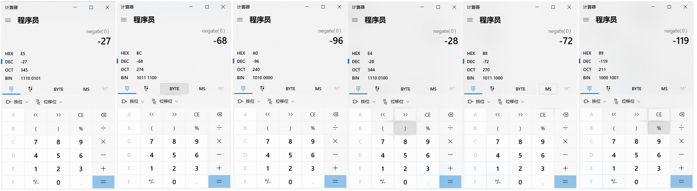

至此对于GET请求中文乱码的解决方案，我们就已经分析完了，最后在代码中去实现下:

```java
/**
 * 中文乱码问题解决方案
 */
@WebServlet("/req4")
public class RequestDemo4 extends HttpServlet {
    @Override
    protected void doGet(HttpServletRequest request, HttpServletResponse response) throws ServletException, IOException {
        //1. 解决乱码：POST，getReader()
        //request.setCharacterEncoding("UTF-8");//设置字符输入流的编码

        //2. 获取username
        String username = request.getParameter("username");
        System.out.println("解决乱码前："+username);

        //3. GET,获取参数的方式：getQueryString
        // 乱码原因：tomcat进行URL解码，默认的字符集ISO-8859-1
       /* //3.1 先对乱码数据进行编码：转为字节数组
        byte[] bytes = username.getBytes(StandardCharsets.ISO_8859_1);
        //3.2 字节数组解码
        username = new String(bytes, StandardCharsets.UTF_8);*/

        username  = new String(username.getBytes(StandardCharsets.ISO_8859_1),StandardCharsets.UTF_8);

        System.out.println("解决乱码后："+username);

    }

    @Override
    protected void doPost(HttpServletRequest request, HttpServletResponse response) throws ServletException, IOException {
        this.doGet(request, response);
    }
}
```

**注意**

* 把`request.setCharacterEncoding("UTF-8")`代码注释掉后，会发现GET请求参数乱码解决方案同时也可也把POST请求参数乱码的问题也解决了
* 只不过对于POST请求参数一般都会比较多，采用这种方式解决乱码起来比较麻烦，所以对于POST请求还是建议使用设置编码的方式进行。

另外需要说明一点的是==Tomcat8.0之后，已将GET请求乱码问题解决，设置默认的解码方式为UTF-8==

**小结**

1. 中文乱码解决方案

* POST请求和GET请求的参数中如果有中文，后台接收数据就会出现中文乱码问题

  GET请求在Tomcat8.0以后的版本就不会出现了

* POST请求解决方案是:设置输入流的编码

  ```
  request.setCharacterEncoding("UTF-8");
  注意:设置的字符集要和页面保持一致
  ```

* 通用方式（GET/POST）：需要先解码，再编码

  ```
  new String(username.getBytes("ISO-8859-1"),"UTF-8");
  ```

2. URL编码实现方式:

* 编码:

  ```
  URLEncoder.encode(str,"UTF-8");
  ```

* 解码:

  ```
  URLDecoder.decode(s,"ISO-8859-1");
  ```


### 2.4 Request请求转发

请求转发(forward): 一种在服务器内部的资源跳转方式。

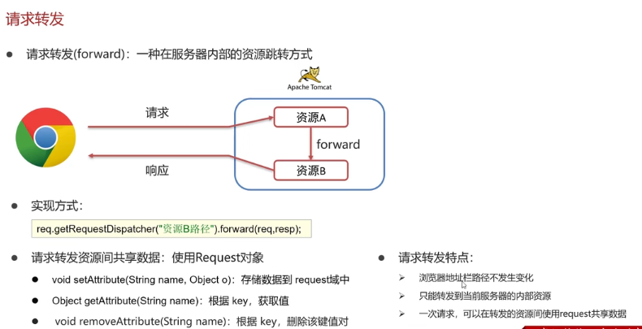

​	(1) 浏览器发送请求给服务器，服务器中对应的资源A接收到请求

​	(2) 资源A处理完请求后将请求发给资源B

​	(3) 资源B处理完后将结果响应给浏览器

​	(4) 请求从资源A到资源B的过程就叫请求转发

**请求转发的实现方式:**代码写在当前的资源中哦

```java
req.getRequestDispatcher("资源B路径").forward(req,resp);
```

**请求转发资源间共享数据:	使用Request对象**

此处主要解决的问题是把请求从`/req5`转发到`/req6`的时候，如何传递数据给`/req6`。

需要使用request对象提供的三个方法:

* 存储数据到request域	[范围, 数据是存储在request对象]	中

```java
void setAttribute(String name, Object o);
```

* 根据key获取值

```
Object getAttribute(String name);
```

* 根据key删除该键值对

```
void removeAttribute(String name);
```

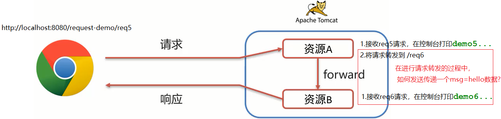

> 1.在RequestDemo5的doGet方法中转发请求之前，将数据存入request域对象中
>
> 2.在RequestDemo6的doGet方法从request域对象中获取数据，并将数据打印到控制台

1、修改RequestDemo5中的方法

```java
@WebServlet("/req5")
public class RequestDemo5 extends HttpServlet {
    @Override
    protected void doGet(HttpServletRequest request, HttpServletResponse response) throws ServletException, IOException {
        System.out.println("demo5...");
        //存储数据
        request.setAttribute("msg","hello");
        //请求转发
        request.getRequestDispatcher("/req6").forward(request,response);
    }
    @Override
    protected void doPost(HttpServletRequest request, HttpServletResponse response) throws ServletException, IOException {
        this.doGet(request, response);
    }
}
```

2、修改RequestDemo6中的方法

```java
/**
 * 请求转发
 */
@WebServlet("/req6")
public class RequestDemo6 extends HttpServlet {
    @Override
    protected void doGet(HttpServletRequest request, HttpServletResponse response) throws ServletException, IOException {
        System.out.println("demo6...");
        //获取数据
        Object msg = request.getAttribute("msg");
        System.out.println(msg);
    }
    @Override
    protected void doPost(HttpServletRequest request, HttpServletResponse response) throws ServletException, IOException {
        this.doGet(request, response);
    }
}
```

此时就可以实现在转发多个资源之间共享数据。

**请求转发的特点：**

* 浏览器地址栏路径不发生变化

* 只能转发到当前服务器的内部资源

* 一次请求，可以在转发资源间使用request共享数据

  

## 3、Response对象

前面讲解完Request对象，接下来我们回到刚开始的那张图:

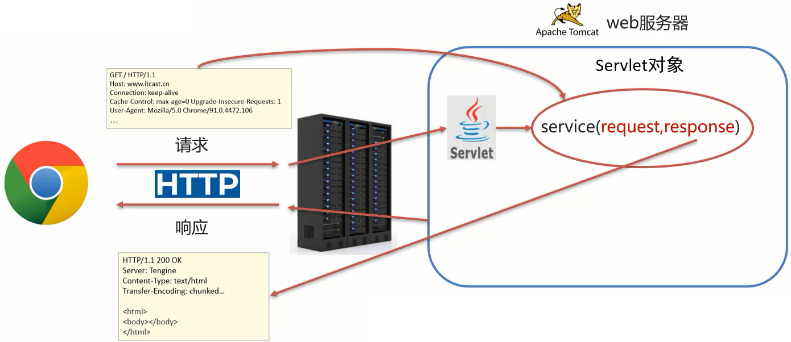

* Request: 使用request对象来获取请求数据
* Response: 使用response对象来设置响应数据

Reponse的继承体系和Request的继承体系也非常相似:

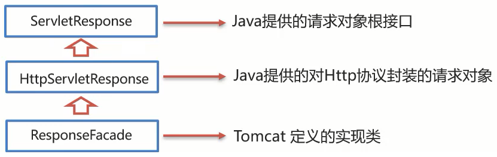


### 3.1 Response设置响应数据

HTTP响应数据总共分为三部分内容，分别是==响应行、响应头、响应体==，对于这三部分内容的数据，respone对象都提供了哪些方法来进行设置?

**1、响应行**

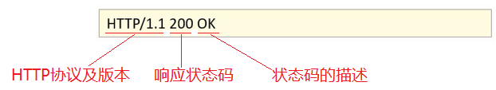

对于响应头，比较常用的就是设置响应状态码:

```java
void setStatus(int sc);
```

**2、响应头**

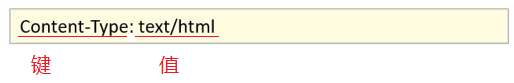

设置响应头键值对：

```java
void setHeader(String name,String value);
```

**3、响应体**

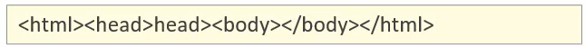

对于响应体，是通过字符、字节输出流的方式往浏览器写，

获取字符输出流:

```
PrintWriter getWriter();
```

获取字节输出流

```
ServletOutputStream getOutputStream();
```

介绍完这些方法后，后面我们会通过案例把这些方法都用一用，首先先来完成下重定向的功能开发。


### 3.2 Respones请求重定向


**Response重定向(redirect)：一种资源跳转方式。**

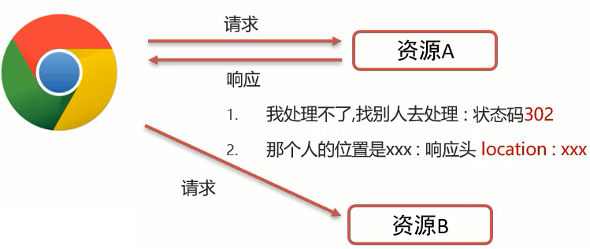

​	1)浏览器发送请求给服务器，服务器中对应的资源A接收到请求

​	(2)资源A现在无法处理该请求，就会给浏览器响应一个302的状态码+location的一个访问资源B的路径

​	(3)浏览器接收到响应状态码为302就会重新发送请求到location对应的访问地址去访问资源B

​	(4)资源B接收到请求后进行处理并最终给浏览器响应结果，这整个过程就叫重定向

**2、重定向的实现方式:**

```
resp.setStatus(302);
resp.setHeader("location","资源B的访问路径");
```

具体如何来使用，我们先来看下需求:

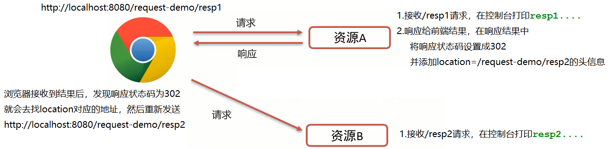

针对上述需求，具体的实现步骤为:

> 1.创建一个ResponseDemo1类，接收/resp1的请求，在doGet方法中打印`resp1....`
>
> 2.创建一个ResponseDemo2类，接收/resp2的请求，在doGet方法中打印`resp2....`
>
> 3.在ResponseDemo1的方法中使用response.setStatus(302);response.setHeader("Location","/request-demo/resp2") 来给前端响应结果数据
>
> 4.启动测试

​		(1)创建ResponseDemo1类

```java
@WebServlet("/resp1")
public class ResponseDemo1 extends HttpServlet {
    @Override
    protected void doGet(HttpServletRequest request, HttpServletResponse response) throws ServletException, IOException {
        System.out.println("resp1....");
        //重定向
        //1.设置响应状态码 302
        response.setStatus(302);
        //2. 设置响应头 Location
        response.setHeader("Location","/request-demo/resp2");
    }

    @Override
    protected void doPost(HttpServletRequest request, HttpServletResponse response) throws ServletException, IOException {
        this.doGet(request, response);
    }
}
```

​		(2)创建ResponseDemo2类

```java
@WebServlet("/resp2")
public class ResponseDemo2 extends HttpServlet {
    @Override
    protected void doGet(HttpServletRequest request, HttpServletResponse response) throws ServletException, IOException {
        System.out.println("resp2....");
    }

    @Override
    protected void doPost(HttpServletRequest request, HttpServletResponse response) throws ServletException, IOException {
        this.doGet(request, response);
    }
}
```

​		(4)启动测试

访问`http://localhost:8080/request-demo/resp1`,就可以在控制台看到如下内容:

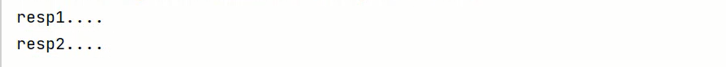

说明`/resp1`和`/resp2`都被访问到了。到这重定向就已经完成了。


**3、重定向的特点**

* 浏览器地址栏路径发送变化

  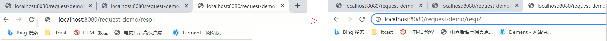

* 可以重定向到任何位置的资源 (服务内容、外部均可)

* 两次请求，不能在多个资源使用request共享数据

  因为浏览器发送了两次请求，是两个不同的request对象，就无法通过request对象进行共享数据

介绍完请求重定向和请求转发以后，接下来把这两个放在一块对比下:

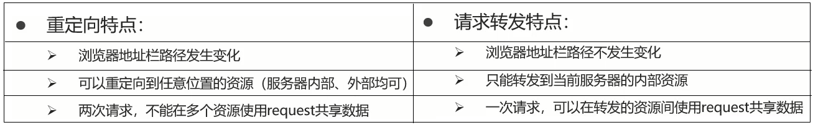

以后到底用哪个，还是需要根据具体的业务来决定。


### 3.4 Response响应字符数据

要想将字符数据写回到浏览器，我们需要两个步骤:

* **通过Response对象获取字符输出流：** `PrintWriter writer = resp.getWriter();`

* **通过字符输出流写数据:**  `writer.write("aaa");`

接下来，我们实现通过些案例把响应字符数据给实际应用下:

 1、返回一个简单的字符串`aaa`

```java
@WebServlet("/resp3")
public class ResponseDemo3 extends HttpServlet {
    @Override
    protected void doGet(HttpServletRequest request, HttpServletResponse response) throws ServletException, IOException {
      
        response.setContentType("text/html;charset=utf-8");
        //1. 获取字符输出流
        PrintWriter writer = response.getWriter();
				writer.write("aaa");
    }
    @Override
    protected void doPost(HttpServletRequest request, HttpServletResponse response) throws ServletException, IOException {
        this.doGet(request, response);
    }
}
```

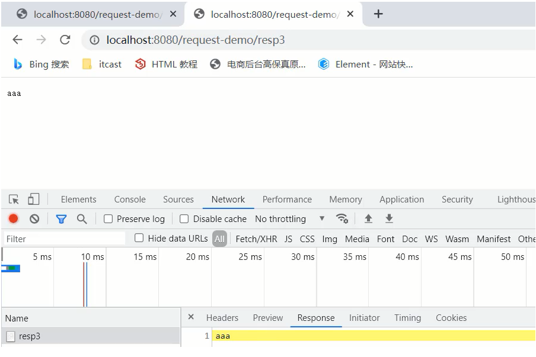

2. 返回一串html字符串，并且能被浏览器解析

```java
PrintWriter writer = response.getWriter();
//content-type，告诉浏览器返回的数据类型是HTML类型数据，这样浏览器才会解析HTML标签
response.setHeader("content-type","text/html");
writer.write("<h1>aaa</h1>");
```

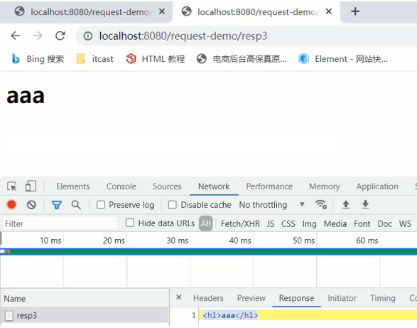

3. 返回一个中文的字符串`你好`，需要注意设置响应数据的编码为`utf-8`

```java
//设置响应的数据格式及数据的编码
response.setContentType("text/html;charset=utf-8");
writer.write("你好");
```

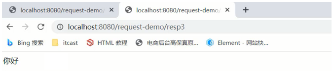


### 3.3 Response响应字节数据

要想将字节数据写回到浏览器，我们需要两个步骤:

- **通过Response对象获取字节输出流**：`ServletOutputStream outputStream = resp.getOutputStream();`

- **通过字节输出流写数据**: `outputStream.write(字节数据);`

接下来，我们实现通过些案例把响应字符数据给实际应用下:

1. 返回一个图片文件到浏览器

```java
/**
 * 响应字节数据：设置字节数据的响应体
 */
@WebServlet("/resp4")
public class ResponseDemo4 extends HttpServlet {
    @Override
    protected void doGet(HttpServletRequest request, HttpServletResponse response) throws ServletException, IOException {
        //1. 读取文件
        FileInputStream fis = new FileInputStream("d://a.jpg");
        //2. 获取response字节输出流
        ServletOutputStream os = response.getOutputStream();
        //3. 完成流的copy
        byte[] buff = new byte[1024];
        int len = 0;
        while ((len = fis.read(buff))!= -1){
            os.write(buff,0,len);
        }
        fis.close();
    }

    @Override
    protected void doPost(HttpServletRequest request, HttpServletResponse response) throws ServletException, IOException {
        this.doGet(request, response);
    }
}
```

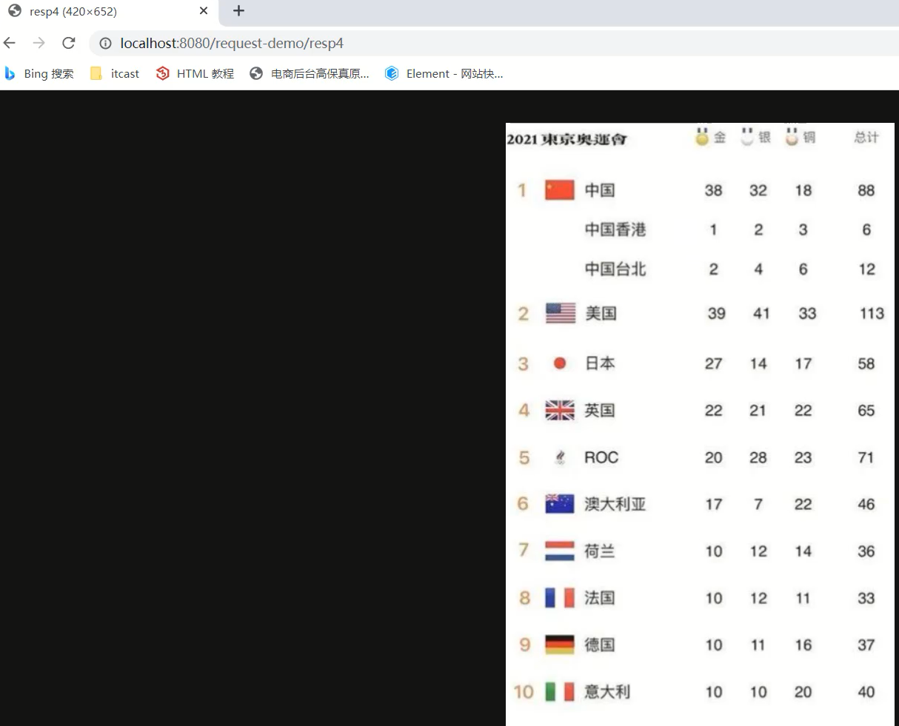

# 11、Filter

Filter 表示过滤器，是 JavaWeb 三大组件(Servlet、Filter、Listener)之一。Servlet 我们之前都已经学习过了.

**过滤器可以把对资源的请求拦截下来，从而实现一些特殊的功能。**

如下图所示，在访问到这些资源之前可以使过滤器拦截来下：

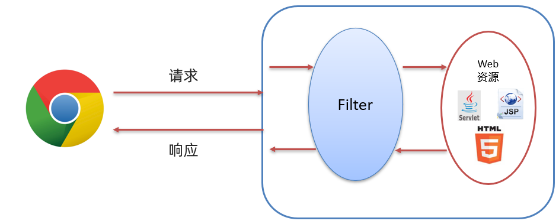

过滤器一般完成一些通用的操作。比如每个资源都要写一些代码完成某个功能，我们总不能在每个资源中写这样的代码吧，而此时我们可以将这些代码写在过滤器中，因为请求每一个资源都要经过过滤器。

## 11.1 Filter快速入门

> 注意啊：Filter是在服务什么的都正常启动的时候才有的，在servlet和tomcat的基础上‘

* 定义类，实现 Filter接口，并重写其所有方法

  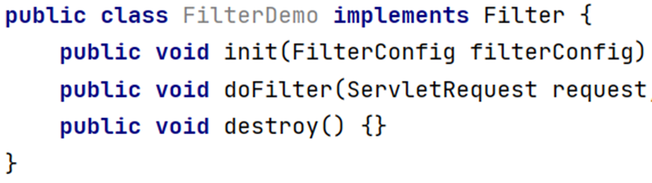

* 配置Filter拦截资源的路径：在类上定义 `@WebFilter` 注解。而注解的 `value` 属性值 `/*` 表示拦截所有的资源

  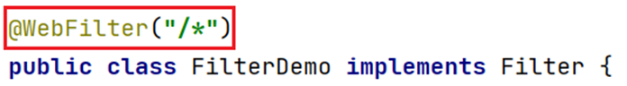

* 在doFilter方法中实现具体的前后逻辑

  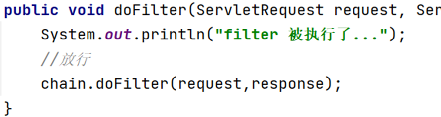

## 11.2  Filter执行流程


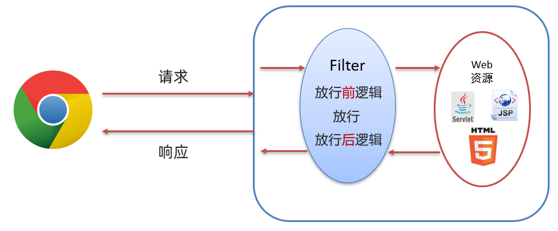：

**Filter的执行流程如下：**

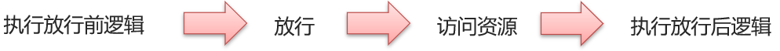

==注意到哦，放行前逻辑只有request对象数据，当服务器执行完资源返回的时候才有respose对象数据。==

- doFilter之前，可以对servletRequest对象进行处理，例如读取数据后进行鉴权等逻辑
- doFilter之后，可以对servletResponse对象进行处理，例如.......
- 同时doFilter的两个方法入参对象，可以修改，并且会传递到后序的Controller层等。

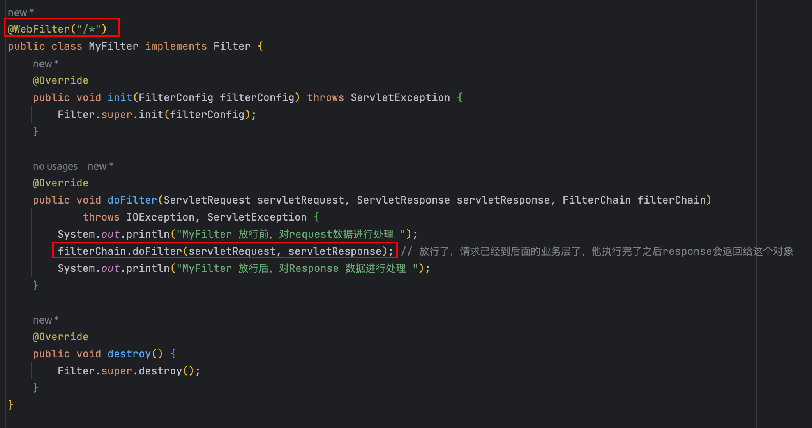


## 11.3 基于springboot

上面的写法是基于Servlet的Web应用程序，而不是Spring Boot应用程序。

在Spring Boot应用程序中，需要使用`@Component`注解和`FilterRegistrationBean`进行过滤器的注册。

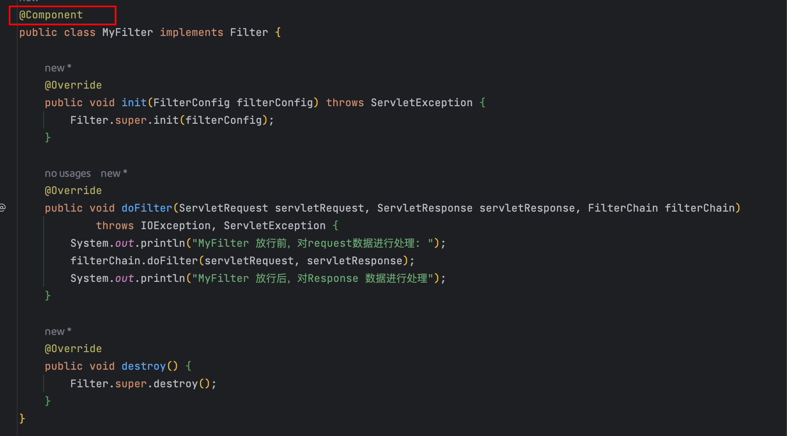

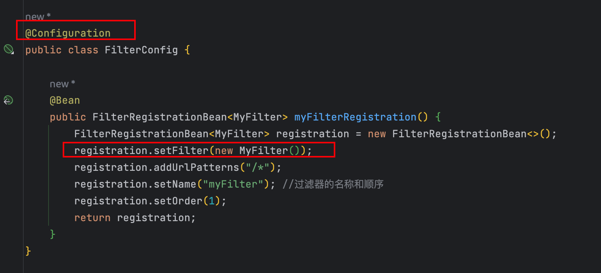


