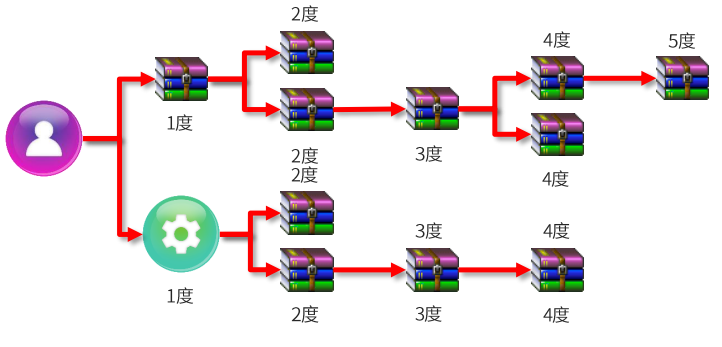

# 一、Maven

==Apache Maven 是一个java项目管理和构建工具==，它基于项目对象模型(POM)的概念，**通过一小段描述信息来管理项目的构建、报告和文档。**它的主要功能有：

* 提供了**一套标准化的项目结构**，，所有的IDE使用Maven构建的项目结构完全一样，所以IDE创建的Maven项目可以通用。

* 提供了**一套标准化的构建流程（编译，测试，打包，发布……）**，Maven提供了一套简单的命令来完成项目构建。

* 提供了**一套新的依赖管理机制**，管理你项目所依赖的第三方资源（jar包、插件）。Maven使用标准的坐标 配置来管理各种依赖，只需要简单的配置就可以了，其他的下载复制导入，Maven都会帮我们做了。

  如之前我们项目中需要使用JDBC和Druid的话，就需要去网上下载对应的依赖包，复制到项目中，还要将jar包加入工作环境这一系列的操作。

**项目对象模型 (Project Object Model)：**项目对象模型就是将我们自己这个项目抽象成一个对象模型，有自己专属的坐标

**依赖管理模型(Dependency)**：则是使用坐标来描述当前项目依赖哪些第三方jar包。

**依赖传递冲突问题：**

- **路径优先:**   当依赖中出现相同的资源时，层级越浅，优先级越高。
- **声明优先:**   当资源在相同层级被依赖时，配置顺序靠前的覆盖顺序靠后的

# 二、EasyExcel

**EasyExcel重写了POI对07版Excel的解析，可以把内存消耗从100M左右降低到10M以内，并且再大的Excel不会出现内存溢出，03版仍依赖POI的SAX模式。**

> 下图为64M内存1分钟内读取75M(46W行25列)的Excel（当然还有急速模式能更快，但是内存占用会在100M多一点）
>
> 
>
> 在上层做了模型转换的封装，让使用者更加简单方便

**特点：**

1. **EasyExcel采用一行一行的解析模式，并将一行的解析结果以观察者的模式通知处理（AnalysisEventListener）**
2. **EasyExcel能大大减少占用内存的主要原因是在解析Excel时没有将文件数据一次性全部加载到内存中，而是从磁盘上一行行读取数据，逐个解析。**
3. 在数据模型层面进行了封装，使用简单
4. 重写了07版本的Excel的解析代码，降低内存消耗，能有效避免OOM
5. 只能操作Excel，不能读取图片